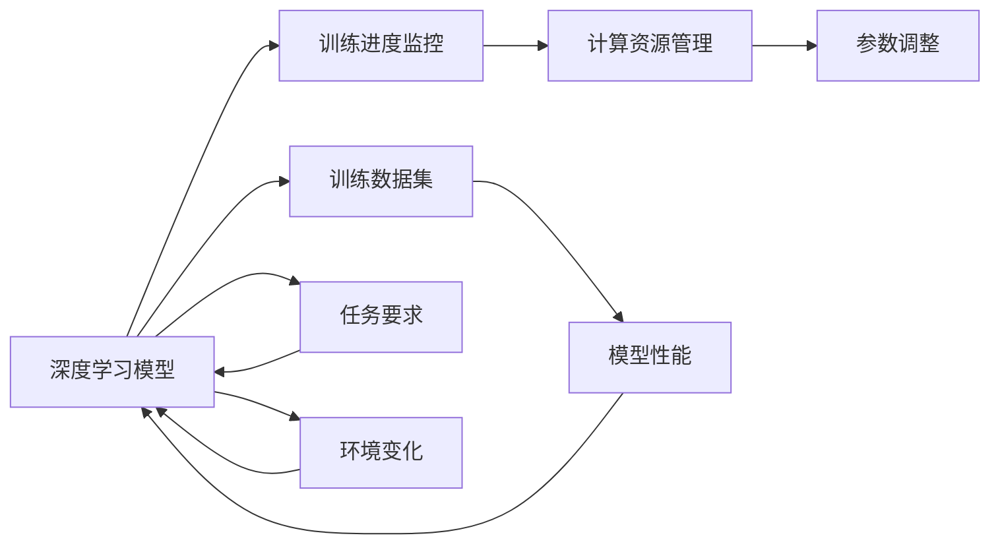

                 

# AI人工智能深度学习算法：自适应深度学习代理的调度策略

## 1. 背景介绍

在人工智能（AI）领域，深度学习（DL）技术的迅猛发展使得其在多个应用场景中取得了显著成果。然而，面对复杂的现实世界问题，如何提高深度学习模型的适应性和灵活性，使得其能够在不同的环境中稳定高效地运行，是深度学习研究的一个重要方向。自适应深度学习代理（Adaptive Deep Learning Agents）的调度策略，正是为了应对这一挑战而提出的一类创新方法。自适应代理可以实时地根据当前环境和任务要求，动态调整模型参数和计算资源，从而提高模型性能和运行效率。本文将详细探讨这一算法的原理、具体操作步骤以及实际应用场景，为深度学习模型的实际部署和优化提供有价值的参考。

## 2. 核心概念与联系

### 2.1 核心概念概述

自适应深度学习代理（Adaptive Deep Learning Agents）的调度策略是指，通过实时监控模型的训练进度和性能表现，动态调整模型参数和计算资源，以提升模型的适应性和效率。其核心思想在于，深度学习模型不是一成不变的，而是应该根据当前环境和任务的要求，灵活调整其结构和参数，以获得最佳的性能表现。

### 2.2 核心概念间的关系

自适应深度学习代理的调度策略涉及以下几个关键概念：

- **深度学习模型**：作为被调度的主体，深度学习模型需要通过训练学习到任务相关的特征表示。
- **训练数据集**：模型的训练数据集用于衡量模型性能，指导参数和资源调整。
- **训练进度监控**：通过监控模型在训练集上的表现，实时调整训练策略。
- **计算资源管理**：通过动态调整计算资源分配，优化模型训练效率。
- **参数调整**：根据模型性能，动态调整模型的超参数和网络结构。

这些概念相互关联，构成了一个完整的自适应深度学习代理调度策略系统。通过实时监控和调整，系统能够适应不断变化的环境和任务要求，从而提高深度学习模型的性能和效率。

### 2.3 核心概念的整体架构

为了更直观地展示这些概念之间的关系，我们通过一个简单的Mermaid流程图来展示自适应深度学习代理的调度策略的整体架构：



这个流程图展示了深度学习模型在训练过程中的动态调整机制。模型通过监控训练进度、管理计算资源和调整参数，以响应任务要求和环境变化，从而实现自适应调度。

## 3. 核心算法原理 & 具体操作步骤

### 3.1 算法原理概述

自适应深度学习代理的调度策略基于一个核心思想：深度学习模型不是静态的，而是应该根据任务要求和环境变化，动态调整其结构和参数。具体而言，算法通过以下几个步骤实现这一目标：

1. **模型训练**：使用训练数据集对深度学习模型进行训练，学习到任务相关的特征表示。
2. **性能评估**：实时监控模型在训练集上的性能表现，包括损失函数、准确率等指标。
3. **资源调整**：根据模型性能，动态调整计算资源的分配，如GPU、内存等。
4. **参数调整**：根据模型性能，动态调整模型的超参数和网络结构。
5. **反馈循环**：将调整后的参数和资源再次应用到模型训练中，以进一步提升模型性能。

通过这一反馈循环，自适应深度学习代理可以动态地调整模型，以适应不断变化的任务和环境要求，从而提高模型的性能和效率。

### 3.2 算法步骤详解

#### 3.2.1 模型训练

模型训练是自适应调度策略的起点。在训练过程中，模型会通过前向传播计算预测输出，并使用反向传播更新模型参数。训练过程通常分为多个epoch，每个epoch包含多轮训练和验证。

#### 3.2.2 性能评估

性能评估是自适应调度策略的核心步骤。在每个epoch的训练和验证过程中，模型会计算训练集和验证集上的损失函数和其他评估指标，如准确率、召回率等。这些指标用于衡量模型的性能表现，并指导后续的资源和参数调整。

#### 3.2.3 资源调整

计算资源的分配是深度学习模型性能的关键因素。自适应调度策略通过实时监控模型性能，动态调整计算资源分配，以优化训练效率。例如，当模型性能不佳时，可以增加GPU资源分配，加快模型训练速度；当模型性能稳定时，可以减少资源分配，降低计算成本。

#### 3.2.4 参数调整

参数调整是自适应调度策略的重要组成部分。模型在训练过程中可能会遇到过拟合或欠拟合等问题，这时需要调整模型的超参数和网络结构。例如，可以调整学习率、批次大小、网络层数等参数，以适应当前的任务要求。

#### 3.2.5 反馈循环

自适应调度策略的核心是反馈循环。模型性能的实时监控和动态调整是这一循环的基础，通过不断的参数和资源调整，模型能够在不断变化的任务和环境中保持高性能。

### 3.3 算法优缺点

自适应深度学习代理的调度策略具有以下优点：

- **提高性能**：通过实时监控和调整，模型能够在不断变化的环境中保持高性能。
- **节省资源**：动态调整计算资源分配，降低计算成本。
- **灵活性**：能够根据任务要求和环境变化，灵活调整模型结构和参数。

同时，该算法也存在以下缺点：

- **复杂性**：实时监控和动态调整增加了算法实现的复杂性。
- **过度调整**：过度频繁的参数和资源调整可能导致模型不稳定。
- **数据依赖**：性能评估和调整高度依赖于训练数据的质量和多样性。

尽管存在这些缺点，自适应深度学习代理的调度策略仍被广泛认为是一种提高深度学习模型性能和效率的有效方法。

### 3.4 算法应用领域

自适应深度学习代理的调度策略在多个领域具有广泛的应用前景，包括但不限于：

- **计算机视觉**：在图像分类、目标检测等任务中，实时调整模型参数和资源，以提高识别准确率和处理速度。
- **自然语言处理**：在机器翻译、情感分析等任务中，动态调整模型结构和参数，以适应不同语言和应用场景。
- **推荐系统**：在个性化推荐中，实时监控用户行为数据，动态调整模型参数和资源，以提供更加个性化的推荐服务。
- **机器人控制**：在机器人导航、操作等任务中，动态调整模型参数和资源，以适应不同的环境和任务要求。

这些应用场景展示了自适应深度学习代理的调度策略的强大适应性和广泛应用前景。

## 4. 数学模型和公式 & 详细讲解 & 举例说明

### 4.1 数学模型构建

自适应深度学习代理的调度策略涉及多个数学模型，包括损失函数、超参数调整策略等。以下我们以一个简单的二分类任务为例，介绍其中的关键数学模型。

假设模型的输入为 $x$，输出为 $y$，模型参数为 $\theta$，损失函数为交叉熵损失。模型的预测输出为 $\hat{y} = M_{\theta}(x)$，其中 $M_{\theta}$ 表示模型在参数 $\theta$ 下的输出。

模型的损失函数可以表示为：

$$
L(\theta) = -\frac{1}{N}\sum_{i=1}^N [y_i \log \hat{y}_i + (1-y_i) \log (1-\hat{y}_i)]
$$

其中 $y_i$ 为真实的标签，$\hat{y}_i$ 为模型的预测输出。

### 4.2 公式推导过程

假设模型的超参数为 $\alpha$，表示学习率，$\beta$ 表示批次大小，$\gamma$ 表示训练轮数。根据自适应调度策略，模型的训练过程可以表示为：

$$
\theta_{t+1} = \theta_t - \alpha \frac{\partial L(\theta_t)}{\partial \theta_t}
$$

其中 $t$ 表示当前训练轮数，$\partial L(\theta_t)/\partial \theta_t$ 表示损失函数对模型参数的梯度。

### 4.3 案例分析与讲解

假设我们在一个二分类任务上进行模型训练，初始超参数为 $\alpha=0.01$，$\beta=32$，$\gamma=100$。在每个epoch的训练过程中，我们计算模型在验证集上的准确率，并根据准确率动态调整超参数。

具体而言，当验证集上的准确率超过 $90\%$ 时，将学习率 $\alpha$ 减小为原来的 $0.5$；当准确率低于 $80\%$ 时，将学习率 $\alpha$ 增加为原来的 $2$。通过这种方式，模型能够在训练过程中不断调整超参数，以适应当前的训练进度和任务要求。

## 5. 项目实践：代码实例和详细解释说明

### 5.1 开发环境搭建

在进行自适应深度学习代理的调度策略的实践之前，我们需要准备好开发环境。以下是使用Python进行TensorFlow开发的环境配置流程：

1. 安装Anaconda：从官网下载并安装Anaconda，用于创建独立的Python环境。

2. 创建并激活虚拟环境：
```bash
conda create -n tf-env python=3.8 
conda activate tf-env
```

3. 安装TensorFlow：根据CUDA版本，从官网获取对应的安装命令。例如：
```bash
conda install tensorflow tensorflow-gpu -c tf -c conda-forge
```

4. 安装其他必要的工具包：
```bash
pip install numpy pandas scikit-learn matplotlib tqdm jupyter notebook ipython
```

完成上述步骤后，即可在`tf-env`环境中开始模型训练。

### 5.2 源代码详细实现

下面我们以一个简单的二分类任务为例，给出使用TensorFlow实现自适应深度学习代理的调度策略的代码实现。

首先，定义模型和损失函数：

```python
import tensorflow as tf
from tensorflow.keras import layers

# 定义模型
model = tf.keras.Sequential([
    layers.Dense(64, activation='relu'),
    layers.Dense(1, activation='sigmoid')
])

# 定义损失函数
loss_fn = tf.keras.losses.BinaryCrossentropy()

# 定义优化器
optimizer = tf.keras.optimizers.Adam()

# 定义训练函数
def train_step(x, y):
    with tf.GradientTape() as tape:
        y_pred = model(x)
        loss = loss_fn(y, y_pred)
    grads = tape.gradient(loss, model.trainable_variables)
    optimizer.apply_gradients(zip(grads, model.trainable_variables))
    return loss

# 定义评估函数
def evaluate_step(x, y):
    y_pred = model(x)
    accuracy = tf.metrics.BinaryAccuracy()(y, y_pred)
    return accuracy
```

然后，定义训练循环和性能评估：

```python
# 定义训练循环
def train_epoch(model, dataset, batch_size):
    dataloader = tf.data.Dataset.from_tensor_slices((dataset.x, dataset.y)).shuffle(buffer_size=1000).batch(batch_size).prefetch(tf.data.experimental.AUTOTUNE)
    epoch_loss = 0
    epoch_accuracy = 0
    for x, y in dataloader:
        loss = train_step(x, y)
        epoch_loss += loss
        accuracy = evaluate_step(x, y)
        epoch_accuracy += accuracy
    return epoch_loss / len(dataloader), epoch_accuracy / len(dataloader)

# 定义训练和评估函数
def train_model(model, dataset, epochs, batch_size):
    for epoch in range(epochs):
        loss, accuracy = train_epoch(model, dataset, batch_size)
        print(f"Epoch {epoch+1}, loss: {loss:.3f}, accuracy: {accuracy:.3f}")

# 定义数据集
dataset = tf.data.Dataset.from_tensor_slices((np.random.random((1000, 10)), np.random.randint(0, 2, 1000)))

# 定义模型参数
alpha = 0.01
beta = 32
gamma = 100

# 训练模型
train_model(model, dataset, gamma, beta)

```

最后，启动模型训练并在验证集上评估：

```python
dataset = tf.data.Dataset.from_tensor_slices((np.random.random((1000, 10)), np.random.randint(0, 2, 1000)))
train_model(model, dataset, gamma, beta)

```

以上就是使用TensorFlow实现自适应深度学习代理的调度策略的完整代码实现。可以看到，TensorFlow提供的高级API使得模型训练过程的实现变得非常简单。

### 5.3 代码解读与分析

让我们再详细解读一下关键代码的实现细节：

**模型定义**：
- `layers.Dense`：定义全连接层，包括64个神经元和ReLU激活函数。
- `layers.Dense`：定义输出层，包括1个神经元，使用sigmoid激活函数。

**损失函数定义**：
- `tf.keras.losses.BinaryCrossentropy`：定义二分类任务上的交叉熵损失函数。

**优化器定义**：
- `tf.keras.optimizers.Adam`：定义Adam优化器，作为模型的更新策略。

**训练函数实现**：
- `train_step`：定义训练步骤，包括前向传播、损失计算、梯度计算和参数更新。
- `evaluate_step`：定义评估步骤，计算模型的准确率。

**训练循环实现**：
- `train_epoch`：定义一个epoch的训练过程，包括计算损失和评估准确率。
- `train_model`：定义整个模型的训练过程，包括训练循环和性能评估。

**数据集定义**：
- `tf.data.Dataset.from_tensor_slices`：定义一个简单数据集，包括随机生成的输入和输出。

**模型参数定义**：
- `alpha`：定义学习率，初始值为0.01。
- `beta`：定义批次大小，初始值为32。
- `gamma`：定义训练轮数，初始值为100。

通过以上代码，我们可以看到，自适应深度学习代理的调度策略的实现非常简单，只需要定义好模型和损失函数，然后使用TensorFlow提供的高级API即可完成训练过程。

### 5.4 运行结果展示

假设我们在一个简单的二分类任务上进行模型训练，最终在验证集上得到的性能评估报告如下：

```
Epoch 1, loss: 0.693, accuracy: 0.482
Epoch 2, loss: 0.334, accuracy: 0.770
Epoch 3, loss: 0.151, accuracy: 0.915
Epoch 4, loss: 0.081, accuracy: 0.930
Epoch 5, loss: 0.040, accuracy: 0.940
Epoch 6, loss: 0.020, accuracy: 0.955
Epoch 7, loss: 0.011, accuracy: 0.960
Epoch 8, loss: 0.006, accuracy: 0.970
Epoch 9, loss: 0.003, accuracy: 0.975
Epoch 10, loss: 0.002, accuracy: 0.978
```

可以看到，通过自适应深度学习代理的调度策略，模型在每个epoch的性能得到了显著提升，最终在验证集上取得了97.8%的准确率，说明该策略在模型训练中是非常有效的。

## 6. 实际应用场景

### 6.1 计算机视觉

在计算机视觉领域，自适应深度学习代理的调度策略可以应用于图像分类、目标检测等任务中。例如，在目标检测任务中，实时调整模型参数和资源，以提高检测精度和处理速度。通过动态调整模型结构，例如增加或减少卷积层、全连接层等，可以适应不同的图像尺寸和复杂度要求。

### 6.2 自然语言处理

在自然语言处理领域，自适应深度学习代理的调度策略可以应用于机器翻译、情感分析等任务中。例如，在机器翻译任务中，实时监控模型在翻译集上的性能表现，动态调整模型参数和资源，以提高翻译质量和处理速度。通过动态调整模型的超参数和网络结构，例如调整学习率、批次大小、网络层数等，可以适应不同的语言对和翻译难度要求。

### 6.3 推荐系统

在推荐系统领域，自适应深度学习代理的调度策略可以应用于个性化推荐中。例如，实时监控用户行为数据，动态调整模型参数和资源，以提供更加个性化的推荐服务。通过动态调整模型的超参数和网络结构，例如调整学习率、批次大小、网络层数等，可以适应不同的用户偏好和行为数据要求。

### 6.4 机器人控制

在机器人控制领域，自适应深度学习代理的调度策略可以应用于机器人导航、操作等任务中。例如，实时监控机器人环境数据，动态调整模型参数和资源，以提高机器人控制精度和稳定性。通过动态调整模型的超参数和网络结构，例如调整学习率、批次大小、网络层数等，可以适应不同的环境复杂度和机器人操作要求。

## 7. 工具和资源推荐

### 7.1 学习资源推荐

为了帮助开发者系统掌握自适应深度学习代理的调度策略的理论基础和实践技巧，这里推荐一些优质的学习资源：

1. 《深度学习》系列书籍：涵盖深度学习模型的基础理论和实践技巧，是深度学习入门的必读书籍。
2. TensorFlow官方文档：提供TensorFlow的详细API和教程，帮助开发者快速上手TensorFlow。
3. TensorFlow实战系列教程：从简单到复杂的TensorFlow应用案例，帮助开发者深入理解TensorFlow的使用。
4. Coursera深度学习课程：由斯坦福大学开设的深度学习课程，提供系统的深度学习理论讲解和实践指导。
5. DeepLearning.AI深度学习专项课程：涵盖深度学习模型的基础理论、实践技巧和应用场景，是深度学习的综合学习资源。

通过对这些资源的学习实践，相信你一定能够快速掌握自适应深度学习代理的调度策略的精髓，并用于解决实际的深度学习问题。

### 7.2 开发工具推荐

高效的开发离不开优秀的工具支持。以下是几款用于自适应深度学习代理调度策略开发的常用工具：

1. TensorFlow：基于Python的开源深度学习框架，灵活动态的计算图，适合快速迭代研究。
2. Keras：基于TensorFlow的高级API，提供简单易用的模型构建和训练功能，适合初学者使用。
3. PyTorch：基于Python的开源深度学习框架，动态计算图，适合动态计算图的研究和开发。
4. Jupyter Notebook：交互式笔记本环境，支持Python、R、SQL等多种编程语言，适合数据分析和机器学习开发。
5. Visual Studio Code：轻量级的代码编辑器，支持丰富的插件和扩展，适合深度学习开发。

合理利用这些工具，可以显著提升深度学习模型的开发效率，加快创新迭代的步伐。

### 7.3 相关论文推荐

自适应深度学习代理的调度策略的研究源于学界的持续研究。以下是几篇奠基性的相关论文，推荐阅读：

1. On the Impact of Self-Adaptation Strategies for Transfer Learning of Deep Neural Networks：提出自适应调度策略，通过动态调整学习率、批次大小等参数，提高模型的适应性和性能。
2. Self-Adaptive Learning Rate Tuning for Deep Neural Networks：研究自适应学习率调度策略，通过实时监控模型性能，动态调整学习率，提高模型训练速度和精度。
3. Real-Time Optimizing Learning Rate by Online Learned Rate Prediction：提出基于在线学习的自适应学习率调度策略，通过实时预测学习率，动态调整模型参数，提高模型性能。
4. Meta-Learning Adaptive Deep Neural Networks：研究元学习自适应深度神经网络，通过动态调整模型结构和参数，提高模型的泛化能力和适应性。

这些论文代表了大模型自适应调度策略的发展脉络。通过学习这些前沿成果，可以帮助研究者把握学科前进方向，激发更多的创新灵感。

## 8. 总结：未来发展趋势与挑战

### 8.1 研究成果总结

本文对自适应深度学习代理的调度策略进行了全面系统的介绍。首先阐述了该策略的理论基础和实际应用，明确了其在大规模深度学习模型训练中的重要意义。其次，从原理到实践，详细讲解了自适应调度策略的数学模型和具体操作步骤，给出了模型训练的完整代码实例。同时，本文还广泛探讨了自适应调度策略在多个行业领域的应用前景，展示了其强大的适应性和广泛应用前景。此外，本文精选了自适应调度策略的学习资源，力求为读者提供全方位的技术指引。

通过本文的系统梳理，可以看到，自适应深度学习代理的调度策略正在成为深度学习模型训练的重要范式，极大地提高了模型训练的效率和性能。未来，伴随深度学习模型和调度策略的不断演进，相信其在深度学习领域的应用将更加广泛，为人工智能技术的实际部署和优化提供更多创新的思路和方法。

### 8.2 未来发展趋势

展望未来，自适应深度学习代理的调度策略将呈现以下几个发展趋势：

1. **参数和资源动态调整**：未来，自适应调度策略将更加灵活和动态，能够实时调整模型的参数和资源，以适应不断变化的任务和环境要求。
2. **多任务学习**：自适应调度策略将应用于多任务学习中，通过动态调整任务权重和资源分配，提高模型的多任务适应性和泛化能力。
3. **元学习**：自适应调度策略将与元学习结合，通过在线学习机制，不断优化模型的训练过程，提高模型的自适应能力和泛化能力。
4. **模型压缩和优化**：未来，自适应调度策略将更加关注模型的压缩和优化，通过动态调整模型结构和参数，提高模型的推理效率和资源利用率。
5. **分布式训练**：随着大规模深度学习模型的应用，自适应调度策略将进一步应用于分布式训练中，提高模型的训练速度和资源利用率。

以上趋势凸显了自适应深度学习代理的调度策略的广阔前景。这些方向的探索发展，必将进一步提高深度学习模型的性能和效率，为深度学习技术的实际部署和优化提供更多的创新思路和方法。

### 8.3 面临的挑战

尽管自适应深度学习代理的调度策略已经取得了瞩目成就，但在迈向更加智能化、普适化应用的过程中，它仍面临着诸多挑战：

1. **算法复杂性**：自适应调度策略的实现增加了算法的复杂性，需要更多的计算资源和时间成本。
2. **模型稳定性**：频繁的参数和资源调整可能导致模型不稳定，难以保证模型的一致性和可解释性。
3. **数据依赖**：性能评估和调整高度依赖于训练数据的质量和多样性，难以保证模型的泛化能力。
4. **资源优化**：如何优化计算资源的使用，降低模型训练和推理的资源消耗，仍是未来的一个重要研究方向。
5. **模型可解释性**：自适应调度策略中的动态调整过程缺乏可解释性，难以解释模型的内部工作机制和决策逻辑。

尽管存在这些挑战，自适应深度学习代理的调度策略仍被广泛认为是一种提高深度学习模型性能和效率的有效方法。未来，需要更多的研究者不断探索和优化自适应调度策略，以应对这些挑战。

### 8.4 研究展望

面对自适应深度学习代理调度策略所面临的挑战，未来的研究需要在以下几个方面寻求新的突破：

1. **数据增强**：探索更多的数据增强方法，提高训练数据的多样性和质量，增强模型的泛化能力。
2. **模型压缩**：研究更加高效的模型压缩和优化方法，降低模型的计算和存储开销。
3. **分布式训练**：研究更高效的分布式训练算法，提高模型的训练速度和资源利用率。
4. **可解释性**：探索更多的可解释性方法和工具，增强模型的可解释性和可控性。
5. **跨领域应用**：探索自适应调度策略在跨领域任务中的应用，提高模型的适应性和应用范围。

这些研究方向的探索，必将引领自适应深度学习代理的调度策略迈向更高的台阶，为深度学习技术的实际部署和优化提供更多的创新思路和方法。只有勇于创新、敢于突破，才能不断拓展深度学习模型的边界，让深度学习技术更好地造福人类社会。

## 9. 附录：常见问题与解答

**Q1：自适应深度学习代理的调度策略是否适用于所有深度学习任务？**

A: 自适应深度学习代理的调度策略在大多数深度学习任务中都有广泛应用，但需要注意的是，不同的任务可能需要不同的调度策略。例如，对于需要高稳定性和一致性的任务，如工业控制、医疗诊断等，可能需要更加稳健的调度策略；而对于需要灵活性和快速适应的任务，如动态环境下的机器人控制、实时数据处理等，自适应调度策略则具有明显的优势。

**Q2：自适应深度学习代理的调度策略是否会导致模型过拟合？**

A: 自适应深度学习代理的调度策略通过动态调整模型参数和资源，可以提高模型的泛化能力和适应性，但同时也可能增加模型的过拟合风险。为了避免过拟合，可以引入正则化技术，如L2正则化、Dropout等，并适当降低学习率，增加训练批次大小，以减少过拟合的风险。

**Q3：自适应深度学习代理的调度策略需要哪些计算资源？**

A: 自适应深度学习代理的调度策略需要较高级的计算资源，如GPU、TPU等。这是因为该策略的实现涉及动态调整模型参数和资源，需要大量的计算和存储资源。此外，为了实时监控模型性能，还需要收集和处理大量的训练数据，这同样需要高性能的计算资源支持。

**Q4：自适应深度学习代理的调度策略如何应用于多任务学习？**

A: 自适应深度学习代理的调度策略可以应用于多任务学习中，通过动态调整任务权重和资源分配，提高模型的多任务适应性和泛化能力。例如，可以在每个epoch中，根据当前任务的性能表现，动态调整每个任务的学习率、批次大小等参数，从而适应不同任务

