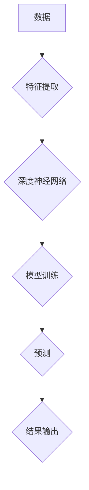

## Andrej Karpathy：人工智能的未来发展规划

> 关键词：人工智能、深度学习、计算机视觉、自然语言处理、强化学习、模型压缩、可解释性

### 1. 背景介绍

人工智能（AI）正以惊人的速度发展，从自动驾驶到医疗诊断，AI技术正在改变着我们生活的方方面面。作为AI领域的领军人物之一，Andrej Karpathy 始终关注着AI技术的未来发展方向，并提出了许多具有前瞻性的观点。本文将结合Karpathy的思想和最新的研究成果，探讨人工智能未来的发展规划。

### 2. 核心概念与联系

人工智能的核心概念是模拟人类智能的行为，包括学习、推理、决策和感知等。深度学习作为AI的重要分支，通过多层神经网络模拟大脑的结构和功能，取得了令人瞩目的成就。

**Mermaid 流程图：**



**核心概念原理和架构：**

* **数据驱动:** 深度学习模型依赖于海量数据进行训练，数据质量直接影响模型性能。
* **层次化特征提取:** 深度神经网络通过多层网络结构，逐层提取数据的特征，最终实现高层次的抽象和理解。
* **参数学习:** 模型训练的过程就是通过调整网络参数，使得模型的预测结果与真实值尽可能接近的过程。

### 3. 核心算法原理 & 具体操作步骤

#### 3.1  算法原理概述

深度学习算法主要包括卷积神经网络（CNN）、循环神经网络（RNN）和生成对抗网络（GAN）。

* **卷积神经网络（CNN）:** 擅长处理图像和视频数据，通过卷积操作提取图像特征，并进行分类、识别等任务。
* **循环神经网络（RNN）:** 擅长处理序列数据，例如文本和语音，能够捕捉序列中的时间依赖关系，用于机器翻译、文本生成等任务。
* **生成对抗网络（GAN）:** 由生成器和判别器两部分组成，生成器生成数据，判别器判断数据真实性，通过对抗训练，生成器能够生成逼真的合成数据。

#### 3.2  算法步骤详解

以卷积神经网络为例，其训练步骤如下：

1. **数据预处理:** 将图像数据进行尺寸调整、归一化等处理，使其适合模型输入。
2. **网络结构设计:** 根据任务需求设计CNN网络结构，包括卷积层、池化层、全连接层等。
3. **参数初始化:** 为网络参数赋予初始值。
4. **前向传播:** 将输入数据通过网络层级传递，得到输出结果。
5. **损失函数计算:** 计算模型预测结果与真实值的差异，即损失函数值。
6. **反向传播:** 根据损失函数值，反向传播梯度信息，更新网络参数。
7. **迭代训练:** 重复前向传播、损失函数计算和反向传播步骤，直到模型性能达到预期目标。

#### 3.3  算法优缺点

**优点:**

* 能够自动学习特征，无需人工特征工程。
* 性能优异，在图像识别、自然语言处理等领域取得了突破性进展。

**缺点:**

* 训练数据量大，需要大量计算资源。
* 模型解释性差，难以理解模型的决策过程。

#### 3.4  算法应用领域

深度学习算法广泛应用于以下领域：

* **计算机视觉:** 图像识别、物体检测、图像分割、人脸识别等。
* **自然语言处理:** 机器翻译、文本摘要、情感分析、对话系统等。
* **语音识别:** 语音转文本、语音合成等。
* **推荐系统:** 商品推荐、内容推荐等。
* **医疗诊断:** 病理图像分析、疾病预测等。

### 4. 数学模型和公式 & 详细讲解 & 举例说明

#### 4.1  数学模型构建

深度学习模型的核心是神经网络，其数学模型基于线性变换和非线性激活函数。

**线性变换:**

$$
y = Wx + b
$$

其中，$x$ 是输入向量，$W$ 是权重矩阵，$b$ 是偏置向量，$y$ 是输出向量。

**非线性激活函数:**

常用的激活函数包括ReLU、Sigmoid和tanh等，其作用是引入非线性，使得神经网络能够学习更复杂的映射关系。

#### 4.2  公式推导过程

模型训练的目标是最小化损失函数，常用的损失函数包括均方误差（MSE）和交叉熵损失（CE）。

**均方误差（MSE）:**

$$
L = \frac{1}{n} \sum_{i=1}^{n} (y_i - \hat{y}_i)^2
$$

其中，$y_i$ 是真实值，$\hat{y}_i$ 是模型预测值，$n$ 是样本数量。

**交叉熵损失（CE）:**

$$
L = -\frac{1}{n} \sum_{i=1}^{n} y_i \log(\hat{y}_i) + (1-y_i) \log(1-\hat{y}_i)
$$

其中，$y_i$ 是真实标签，$\hat{y}_i$ 是模型预测概率。

#### 4.3  案例分析与讲解

以图像分类为例，假设我们训练一个CNN模型，用于识别猫和狗的图片。

* **输入数据:** 猫和狗的图片数据。
* **模型结构:** 包括卷积层、池化层、全连接层等。
* **损失函数:** 均方误差或交叉熵损失。
* **训练过程:** 通过前向传播、反向传播和参数更新，模型逐渐学习到识别猫和狗的特征。
* **测试结果:** 将训练好的模型应用于新的图片数据，预测图片中是否包含猫或狗。

### 5. 项目实践：代码实例和详细解释说明

#### 5.1  开发环境搭建

使用Python语言和深度学习框架TensorFlow或PyTorch进行开发。

#### 5.2  源代码详细实现

```python
# 使用TensorFlow构建一个简单的CNN模型
import tensorflow as tf

# 定义模型结构
model = tf.keras.models.Sequential([
    tf.keras.layers.Conv2D(32, (3, 3), activation='relu', input_shape=(28, 28, 1)),
    tf.keras.layers.MaxPooling2D((2, 2)),
    tf.keras.layers.Conv2D(64, (3, 3), activation='relu'),
    tf.keras.layers.MaxPooling2D((2, 2)),
    tf.keras.layers.Flatten(),
    tf.keras.layers.Dense(10, activation='softmax')
])

# 编译模型
model.compile(optimizer='adam',
              loss='sparse_categorical_crossentropy',
              metrics=['accuracy'])

# 训练模型
model.fit(x_train, y_train, epochs=10)

# 评估模型
loss, accuracy = model.evaluate(x_test, y_test)
print('Test loss:', loss)
print('Test accuracy:', accuracy)
```

#### 5.3  代码解读与分析

* **模型结构:** 模型包含两层卷积层、两层池化层和一层全连接层。
* **激活函数:** 使用ReLU激活函数，能够提高模型的学习能力。
* **损失函数:** 使用交叉熵损失函数，适合多分类问题。
* **优化器:** 使用Adam优化器，能够快速收敛。

#### 5.4  运行结果展示

训练完成后，模型能够对新的图片数据进行分类，并输出分类结果的概率。

### 6. 实际应用场景

深度学习技术已广泛应用于各个领域，例如：

* **自动驾驶:** 用于图像识别、物体检测和路径规划。
* **医疗诊断:** 用于病理图像分析、疾病预测和药物研发。
* **金融科技:** 用于欺诈检测、风险评估和投资决策。
* **个性化推荐:** 用于商品推荐、内容推荐和用户画像。

### 6.4  未来应用展望

未来，深度学习技术将继续推动人工智能的发展，并应用于更多领域，例如：

* **增强现实和虚拟现实:** 用于创建更逼真的虚拟环境和增强现实体验。
* **机器人技术:** 用于赋予机器人更强的感知能力和决策能力。
* **科学研究:** 用于加速科学发现和解决复杂问题。

### 7. 工具和资源推荐

#### 7.1  学习资源推荐

* **书籍:**
    * 深度学习 (Deep Learning) - Ian Goodfellow, Yoshua Bengio, Aaron Courville
    * 构建深度学习模型 (Hands-On Machine Learning with Scikit-Learn, Keras & TensorFlow) - Aurélien Géron
* **在线课程:**
    * 深度学习 Specialization - Andrew Ng (Coursera)
    * fast.ai - Practical Deep Learning for Coders
* **博客和网站:**
    * Andrej Karpathy's Blog: https://karpathy.github.io/
    * OpenAI Blog: https://openai.com/blog/

#### 7.2  开发工具推荐

* **深度学习框架:** TensorFlow, PyTorch, Keras
* **编程语言:** Python
* **数据处理工具:** Pandas, NumPy

#### 7.3  相关论文推荐

* **ImageNet Classification with Deep Convolutional Neural Networks** - Alex Krizhevsky, Ilya Sutskever, Geoffrey E. Hinton
* **Attention Is All You Need** - Ashish Vaswani, Noam Shazeer, Niki Parmar, Jakob Uszkoreit, Llion Jones, Aidan N. Gomez, Łukasz Kaiser, Illia Polosukhin
* **Generative Adversarial Networks** - Ian Goodfellow, Jean Pouget-Abadie, Mehdi Mirza, Bing Xu, David Warde-Farley, Sherjil Ozair, Aaron Courville, Yoshua Bengio

### 8. 总结：未来发展趋势与挑战

#### 8.1  研究成果总结

近年来，深度学习取得了令人瞩目的成就，在图像识别、自然语言处理等领域取得了突破性进展。

#### 8.2  未来发展趋势

* **模型压缩:** 降低模型大小和计算复杂度，使其能够部署在移动设备等资源有限的设备上。
* **可解释性:** 提高模型的解释性，使得人类能够理解模型的决策过程。
* **联邦学习:** 在不共享原始数据的情况下，训练模型，保护用户隐私。
* **强化学习:** 训练模型能够自主学习和决策，应用于机器人控制、游戏等领域。

#### 8.3  面临的挑战

* **数据获取和标注:** 深度学习模型依赖于海量数据，数据获取和标注成本高昂。
* **模型解释性:** 深度学习模型的决策过程难以理解，缺乏可解释性。
* **公平性和偏见:** 深度学习模型可能存在公平性和偏见问题，需要进行更深入的研究和解决。
* **安全性和可靠性:** 深度学习模型可能存在安全漏洞和可靠性问题，需要加强安全性和可靠性研究。

#### 8.4  研究展望

未来，人工智能研究将继续朝着更智能、更安全、更可解释的方向发展。


### 9. 附录：常见问题与解答

**Q1: 深度学习和机器学习有什么区别？**

**A1:** 机器学习是人工智能的一个子领域，它通过算法学习数据中的模式，并做出预测或决策。深度学习是机器学习的一种特殊形式，它使用多层神经网络模拟大脑的结构和功能，能够学习更复杂的模式。

**Q2: 如何选择合适的深度学习框架？**

**A2:** TensorFlow和PyTorch是目前最流行的深度学习框架，TensorFlow更适合于生产环境部署，PyTorch更灵活易于使用。选择框架需要根据具体项目需求和个人偏好。

**Q3: 如何解决深度学习模型的过拟合问题？**

**