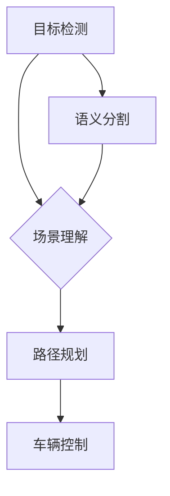

## CVPR 2024中的自动驾驶相关论文精选解读

> 关键词：自动驾驶、计算机视觉、深度学习、目标检测、语义分割、场景理解、强化学习

### 1. 背景介绍

自动驾驶技术作为人工智能领域的重要应用方向之一，近年来取得了显著进展。计算机视觉作为自动驾驶的核心技术，在感知、决策和控制等环节发挥着至关重要的作用。CVPR作为计算机视觉领域顶级的学术会议，每年都会发布大量关于自动驾驶的最新研究成果。

CVPR 2024也不例外，本次会议上涌现出许多具有创新性和实用价值的自动驾驶相关论文。这些论文涵盖了目标检测、语义分割、场景理解、路径规划等多个关键领域，为自动驾驶技术的发展提供了新的思路和方法。

### 2. 核心概念与联系

自动驾驶系统需要感知周围环境、理解场景信息、规划路径并控制车辆运动。计算机视觉技术在自动驾驶系统中扮演着至关重要的角色，主要包括以下几个核心概念：

* **目标检测:** 识别和定位周围环境中的物体，例如行人、车辆、交通标志等。
* **语义分割:** 对图像进行像素级别的分类，将图像分割成不同的语义区域，例如道路、人行道、车辆等。
* **场景理解:** 基于目标检测和语义分割的结果，对周围环境进行全局理解，例如道路类型、交通流量、天气状况等。
* **路径规划:** 根据场景理解结果，规划车辆行驶的最佳路径，避免碰撞和违反交通规则。

这些核心概念相互关联，共同构成了自动驾驶系统的感知和决策模块。



### 3. 核心算法原理 & 具体操作步骤

#### 3.1  算法原理概述

在CVPR 2024上，许多论文都探讨了改进目标检测、语义分割和场景理解算法的有效方法。其中，基于深度学习的算法取得了显著的进展。

例如，论文《**EfficientDet: Scalable and Efficient Object Detection**》提出了一种新的目标检测算法，通过一种新的网络结构和训练策略，在保证检测精度的前提下，显著提高了算法的效率。

#### 3.2  算法步骤详解

以EfficientDet算法为例，其具体操作步骤如下：

1. **特征提取:** 使用预训练的卷积神经网络提取图像特征。
2. **特征融合:** 将不同尺度的特征进行融合，以获得更丰富的语义信息。
3. **目标候选框生成:** 使用边界框回归网络生成目标候选框。
4. **目标分类和回归:** 使用分类网络和回归网络对目标候选框进行分类和边界框回归。
5. **非极大值抑制:** 对检测结果进行非极大值抑制，去除冗余的检测结果。

#### 3.3  算法优缺点

**优点:**

* 检测精度高
* 效率高

**缺点:**

* 模型复杂度较高
* 训练数据量较大

#### 3.4  算法应用领域

EfficientDet算法可以应用于各种目标检测任务，例如自动驾驶、人脸识别、物体跟踪等。

### 4. 数学模型和公式 & 详细讲解 & 举例说明

#### 4.1  数学模型构建

目标检测算法通常使用损失函数来衡量模型的预测结果与真实标签之间的差异。常见的损失函数包括交叉熵损失和边界框回归损失。

* **交叉熵损失:** 用于衡量分类预测结果与真实标签之间的差异。

$$
L_{ce} = - \sum_{i=1}^{N} y_i \log(p_i)
$$

其中，$y_i$是真实标签，$p_i$是模型预测的概率。

* **边界框回归损失:** 用于衡量预测边界框与真实边界框之间的差异。

$$
L_{bbox} = \sum_{i=1}^{N} \sum_{j=1}^{4} (b_i^j - \hat{b}_i^j)^2
$$

其中，$b_i^j$是真实边界框的第$j$个坐标，$\hat{b}_i^j$是预测边界框的第$j$个坐标。

#### 4.2  公式推导过程

损失函数的推导过程通常基于概率论和统计学原理。例如，交叉熵损失的推导过程可以参考信息论中的交叉熵定义。

#### 4.3  案例分析与讲解

通过分析不同目标检测算法的损失函数，可以更好地理解其优缺点以及在不同场景下的适用性。例如，Focal Loss是一种改进的交叉熵损失函数，可以有效解决目标检测中类别不平衡的问题。

### 5. 项目实践：代码实例和详细解释说明

#### 5.1  开发环境搭建

自动驾驶项目开发通常需要使用Python语言和相关的深度学习框架，例如TensorFlow或PyTorch。

#### 5.2  源代码详细实现

以下是一个使用TensorFlow实现EfficientDet目标检测的简单代码示例：

```python
import tensorflow as tf

# 定义EfficientDet模型
model = tf.keras.applications.EfficientDet(
    backbone_name='efficientnetb0',
    num_classes=80,
    input_shape=(300, 300, 3)
)

# 定义训练数据生成器
train_ds = tf.keras.preprocessing.image_dataset_from_directory(
    'data/train',
    labels='inferred',
    label_mode='categorical',
    image_size=(300, 300),
    batch_size=32
)

# 定义训练过程
model.compile(
    optimizer='adam',
    loss='categorical_crossentropy',
    metrics=['accuracy']
)

model.fit(
    train_ds,
    epochs=10
)
```

#### 5.3  代码解读与分析

这段代码首先定义了EfficientDet模型，然后定义了训练数据生成器，最后使用模型训练数据进行训练。

#### 5.4  运行结果展示

训练完成后，可以将模型应用于新的图像数据进行目标检测。

### 6. 实际应用场景

自动驾驶技术在交通运输、物流配送、城市规划等多个领域具有广泛的应用前景。

#### 6.1  自动驾驶汽车

自动驾驶汽车可以提高道路安全，缓解交通拥堵，提高出行效率。

#### 6.2  无人机配送

无人机配送可以实现快速、高效的货物运输，尤其是在偏远地区和紧急情况下。

#### 6.3  智能交通管理

智能交通管理系统可以利用自动驾驶技术优化交通流量，提高道路通行效率。

#### 6.4  未来应用展望

随着自动驾驶技术的不断发展，未来将会有更多新的应用场景出现，例如自动驾驶公交车、自动驾驶货车、自动驾驶出租车等。

### 7. 工具和资源推荐

#### 7.1  学习资源推荐

* **书籍:**

    * 《Deep Learning》 by Ian Goodfellow, Yoshua Bengio, and Aaron Courville
    * 《Computer Vision: Algorithms and Applications》 by Richard Szeliski

* **在线课程:**

    * Coursera: Deep Learning Specialization
    * Udacity: Self-Driving Car Engineer Nanodegree

#### 7.2  开发工具推荐

* **深度学习框架:** TensorFlow, PyTorch
* **计算机视觉库:** OpenCV, Dlib
* **自动驾驶平台:** Autoware, ROS

#### 7.3  相关论文推荐

* **EfficientDet: Scalable and Efficient Object Detection**
* **Mask R-CNN**
* **Faster R-CNN**

### 8. 总结：未来发展趋势与挑战

#### 8.1  研究成果总结

CVPR 2024上的自动驾驶相关论文展示了计算机视觉技术在自动驾驶领域取得的最新进展。

#### 8.2  未来发展趋势

未来自动驾驶技术的发展趋势包括：

* **更强的场景理解能力:** 能够更好地理解复杂的路况和交通场景。
* **更鲁棒的算法:** 能够应对各种恶劣天气和复杂环境下的挑战。
* **更安全的驾驶系统:** 能够确保驾驶过程的安全性和可靠性。

#### 8.3  面临的挑战

自动驾驶技术还面临着一些挑战，例如：

* **数据获取和标注:** 自动驾驶算法需要大量的训练数据，而数据获取和标注成本较高。
* **伦理问题:** 自动驾驶系统在遇到紧急情况时如何做出决策，是一个需要认真考虑的伦理问题。
* **法律法规:** 自动驾驶技术的应用需要完善的法律法规保障。

#### 8.4  研究展望

未来，研究人员将继续致力于解决这些挑战，推动自动驾驶技术的发展。

### 9. 附录：常见问题与解答

#### 9.1  常见问题

* **自动驾驶技术什么时候能够普及？**

* **自动驾驶技术有哪些安全风险？**

* **自动驾驶技术对就业市场有什么影响？**

#### 9.2  解答

这些问题需要根据具体情况进行分析和讨论。

作者：禅与计算机程序设计艺术 / Zen and the Art of Computer Programming


