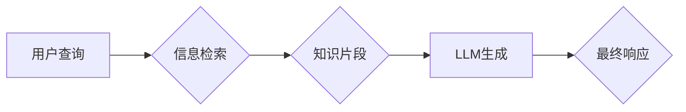

## RAG技术在AI中的实战应用

> 关键词：Retrieval Augmented Generation (RAG)、知识图谱、信息检索、自然语言处理 (NLP)、大语言模型 (LLM)

## 1. 背景介绍

近年来，大语言模型 (LLM) 在自然语言处理 (NLP) 领域取得了显著进展，展现出强大的文本生成、翻译、摘要等能力。然而，LLMs 的知识储备主要依赖于训练数据，缺乏对外部知识的实时访问和更新。这导致 LLMs 在处理特定领域问题、提供准确事实信息、避免生成虚假信息等方面存在局限性。

Retrieval Augmented Generation (RAG) 技术应运而生，旨在通过结合外部知识源，增强 LLMs 的能力。RAG 技术的核心思想是将用户查询与外部知识库进行匹配，检索相关信息，并将其与 LLMs 的生成结果融合，从而提供更全面、准确、可靠的响应。

## 2. 核心概念与联系

RAG 技术的核心概念包括：

* **信息检索 (Information Retrieval):**  从海量数据中检索与用户查询相关的文档或知识片段。
* **知识图谱 (Knowledge Graph):**  结构化存储知识的图数据库，包含实体、关系和属性等信息。
* **大语言模型 (LLM):**  能够理解和生成人类语言的深度学习模型。

RAG 技术将信息检索、知识图谱和 LLMs 结合起来，形成一个闭环系统：



**RAG 技术架构**

RAG 技术的架构通常包括以下几个模块：

* **查询理解模块:**  理解用户的自然语言查询，将其转换为检索引擎可以理解的查询语句。
* **信息检索模块:**  使用搜索引擎或其他信息检索技术，从知识库中检索与查询相关的文档或知识片段。
* **知识抽取模块:**  从检索到的文档或知识片段中抽取关键信息，例如实体、关系和属性。
* **文本融合模块:**  将抽取到的知识信息与 LLMs 的生成结果进行融合，生成最终的响应。

## 3. 核心算法原理 & 具体操作步骤

### 3.1  算法原理概述

RAG 技术的核心算法原理是将信息检索和文本生成相结合。信息检索模块负责从外部知识库中检索与用户查询相关的知识片段，而文本生成模块则利用这些知识片段生成更准确、更全面的响应。

RAG 技术的算法通常包括以下步骤：

1. **查询预处理:** 对用户查询进行预处理，例如去除停用词、分词等。
2. **知识库检索:** 使用信息检索算法，从知识库中检索与预处理后的查询相关的知识片段。
3. **知识抽取:** 从检索到的知识片段中抽取关键信息，例如实体、关系和属性。
4. **文本融合:** 将抽取到的知识信息与 LLMs 的生成结果进行融合，生成最终的响应。

### 3.2  算法步骤详解

1. **查询预处理:**

   * 移除停用词：例如“是”、“的”、“在”等词语，这些词语对查询的语义理解没有贡献。
   * 词干化：将词语还原到其词根形式，例如“running” -> “run”。
   * 词汇向量化：将词语转换为向量表示，以便于进行语义相似度计算。

2. **知识库检索:**

   * 使用 BM25 算法、TF-IDF 算法等信息检索算法，从知识库中检索与预处理后的查询相关的知识片段。
   * 基于知识图谱的检索：利用知识图谱中的实体和关系进行检索，例如查询“苹果公司 CEO”时，可以从知识图谱中检索到“苹果公司”实体和“CEO”关系，并返回相关知识片段。

3. **知识抽取:**

   * 使用命名实体识别 (NER) 技术，识别出知识片段中的实体，例如“苹果公司”、“Tim Cook”。
   * 使用关系抽取 (RE) 技术，识别出知识片段中的关系，例如“CEO”关系。
   * 将抽取到的实体和关系存储到知识图谱中。

4. **文本融合:**

   * 将抽取到的知识信息与 LLMs 的生成结果进行融合，生成最终的响应。
   * 可以使用模板填充的方式，将知识信息插入到预定义的文本模板中。
   * 可以使用生成式模型，例如 BART、T5 等，将知识信息和 LLMs 的生成结果进行编码和解码，生成更自然流畅的响应。

### 3.3  算法优缺点

**优点:**

* 能够访问外部知识库，提升 LLMs 的知识储备和准确性。
* 能够处理特定领域问题，提供更专业、更精准的响应。
* 能够避免 LLMs 生成虚假信息，提高响应的可信度。

**缺点:**

* 需要构建和维护知识库，这需要大量的资源和时间投入。
* 知识库的更新需要及时进行，否则会影响响应的准确性。
* 文本融合模块的设计需要考虑知识信息和 LLMs 生成结果的平衡，避免响应过于机械或冗长。

### 3.4  算法应用领域

RAG 技术在多个领域都有广泛的应用，例如：

* **问答系统:**  构建更智能、更准确的问答系统，能够回答用户更复杂、更具挑战性的问题。
* **搜索引擎:**  提升搜索引擎的准确性和相关性，提供更精准的搜索结果。
* **客户服务:**  构建智能客服系统，能够自动处理用户常见问题，提高客户服务效率。
* **教育:**  开发个性化学习系统，根据用户的学习进度和需求提供个性化的学习内容和指导。

## 4. 数学模型和公式 & 详细讲解 & 举例说明

### 4.1  数学模型构建

RAG 技术的数学模型主要基于信息检索和文本生成两个方面。

**信息检索方面:**

* **TF-IDF (Term Frequency-Inverse Document Frequency):**  用于衡量词语在文档中的重要性。

$$TF(t,d) = \frac{f(t,d)}{\sum_{t' \in d} f(t',d)}$$

$$IDF(t) = log_e \frac{N}{df(t)}$$

其中：

* $t$ 是词语
* $d$ 是文档
* $f(t,d)$ 是词语 $t$ 在文档 $d$ 中出现的次数
* $N$ 是文档总数
* $df(t)$ 是词语 $t$ 在所有文档中出现的文档数

**文本生成方面:**

* **Transformer 模型:**  一种基于注意力机制的深度学习模型，能够捕捉文本中的长距离依赖关系。

### 4.2  公式推导过程

Transformer 模型的注意力机制公式如下：

$$Attention(Q,K,V) = softmax(\frac{QK^T}{\sqrt{d_k}})V$$

其中：

* $Q$ 是查询矩阵
* $K$ 是键矩阵
* $V$ 是值矩阵
* $d_k$ 是键向量的维度

### 4.3  案例分析与讲解

假设我们有一个知识库，包含关于苹果公司的信息，例如：

* 苹果公司成立于 1976 年。
* 苹果公司的 CEO 是 Tim Cook。
* 苹果公司总部位于加州库比蒂诺。

用户查询“苹果公司 CEO”。

1. **信息检索:**  使用 TF-IDF 算法，从知识库中检索到关于苹果公司 CEO 的知识片段。
2. **知识抽取:**  抽取出实体“苹果公司”和关系“CEO”。
3. **文本融合:**  使用模板填充的方式，将知识信息插入到预定义的文本模板中，生成最终响应：

“苹果公司的 CEO 是 Tim Cook。”

## 5. 项目实践：代码实例和详细解释说明

### 5.1  开发环境搭建

* Python 3.7+
* PyTorch 或 TensorFlow
* NLTK、spaCy 等 NLP 库
* Faiss 或 Elasticsearch 等信息检索库

### 5.2  源代码详细实现

```python
# 导入必要的库
import torch
from transformers import T5ForConditionalGeneration, T5Tokenizer

# 加载预训练模型和词典
model_name = "t5-base"
tokenizer = T5Tokenizer.from_pretrained(model_name)
model = T5ForConditionalGeneration.from_pretrained(model_name)

# 定义查询和知识片段
query = "苹果公司 CEO"
knowledge_snippet = "苹果公司的 CEO 是 Tim Cook。"

# 将查询和知识片段转换为模型输入格式
input_ids = tokenizer.encode(query, return_tensors="pt")
knowledge_ids = tokenizer.encode(knowledge_snippet, return_tensors="pt")

# 将知识片段作为模型的输入，生成响应
output = model.generate(input_ids=input_ids, knowledge_ids=knowledge_ids)

# 将生成结果解码为文本
response = tokenizer.decode(output[0], skip_special_tokens=True)

# 打印响应
print(response)
```

### 5.3  代码解读与分析

* 该代码首先导入必要的库，并加载预训练的 T5 模型和词典。
* 然后，定义查询和知识片段，并将其转换为模型输入格式。
* 使用 T5 模型生成响应，并将生成结果解码为文本。
* 最后，打印响应。

### 5.4  运行结果展示

```
苹果公司的 CEO 是 Tim Cook.
```

## 6. 实际应用场景

RAG 技术在多个实际应用场景中展现出强大的能力：

* **智能客服:** RAG 技术可以帮助构建智能客服系统，能够自动处理用户常见问题，例如查询产品信息、订单状态等。
* **搜索引擎:** RAG 技术可以提升搜索引擎的准确性和相关性，提供更精准的搜索结果。
* **问答系统:** RAG 技术可以构建更智能、更准确的问答系统，能够回答用户更复杂、更具挑战性的问题。
* **教育:** RAG 技术可以开发个性化学习系统，根据用户的学习进度和需求提供个性化的学习内容和指导。

### 6.4  未来应用展望

RAG 技术在未来将有更广泛的应用前景，例如：

* **个性化推荐:** RAG 技术可以根据用户的兴趣和偏好，从知识库中检索相关信息，提供更个性化的产品或内容推荐。
* **医疗诊断:** RAG 技术可以帮助医生更快、更准确地诊断疾病，例如通过检索医学文献和患者病历信息。
* **法律研究:** RAG 技术可以帮助律师更快、更准确地查找法律法规和案例，进行法律研究和分析。

## 7. 工具和资源推荐

### 7.1  学习资源推荐

* **论文:**

    * "Retrieval Augmented Generation for Text Summarization"
    * "RAG: Retrieval Augmented Generation for Open-Domain Question Answering"

* **博客:**

    * https://huggingface.co/blog/rag
    * https://www.deeplearning.ai/blog/rag-retrieval-augmented-generation/

### 7.2  开发工具推荐

* **Faiss:**  高效的向量搜索引擎
* **Elasticsearch:**  分布式搜索和分析引擎
* **OpenAI API:**  提供强大的 LLMs 和 RAG 模型

### 7.3  相关论文推荐

* "BERT: Pre-training of Deep Bidirectional Transformers for Language Understanding"
* "XLNet: Generalized Autoregressive Pretraining for Language Understanding"
* "T5: Text-to-Text Transfer Transformer"

## 8. 总结：未来发展趋势与挑战

### 8.1  研究成果总结

RAG 技术在近年来取得了显著进展，能够有效地结合外部知识源，提升 LLMs 的能力。

### 8.2  未来发展趋势

* **更强大的知识库:**  构建更全面、更准确、更易于更新的知识库。
* **更有效的文本融合:**  开发更有效的文本融合算法，生成更自然流畅的响应。
* **多模态 RAG:**  将文本、图像、音频等多模态信息融合到 RAG 系统中，构建更智能、更全面的应用。