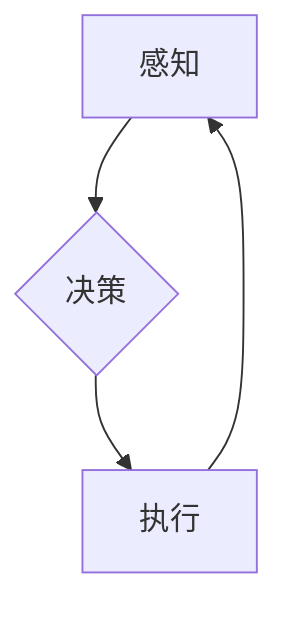

## Robotics 原理与代码实战案例讲解

> 关键词：机器人学、人工智能、控制系统、路径规划、机器学习、ROS、Python

## 1. 背景介绍

机器人技术作为人工智能领域的重要分支，近年来发展迅速，在工业自动化、医疗服务、家政服务等领域展现出巨大的应用潜力。从简单的工业机器人到复杂的自主导航机器人，机器人技术的不断进步离不开对机器人原理和代码的深入理解。

本篇文章将从机器人学的基本原理出发，结合实际案例，讲解机器人控制系统、路径规划算法、机器学习应用等核心内容，并提供Python代码实例，帮助读者掌握机器人开发的基本技能。

## 2. 核心概念与联系

机器人系统是一个复杂的智能系统，其核心功能包括感知、决策和执行。

**感知:** 机器人通过传感器获取环境信息，例如摄像头、激光雷达、声呐等。

**决策:** 机器人根据感知到的信息，利用控制算法和人工智能技术，做出相应的动作决策。

**执行:** 机器人通过执行器，例如电机、关节、抓手等，将决策转化为实际动作。

**Mermaid 流程图:**



## 3. 核心算法原理 & 具体操作步骤

### 3.1  算法原理概述

路径规划算法是机器人导航的核心技术之一，其目的是找到机器人从起点到目标点的最优路径。常见的路径规划算法包括：

* **A* 算法:** 基于启发式搜索，通过评估节点到目标点的距离，优先搜索更接近目标的路径。
* **Dijkstra 算法:** 基于最短路径搜索，找到起点到所有节点的最短路径。
* **RRT 算法:** 基于随机采样，通过随机生成节点，逐步构建通往目标点的路径。

### 3.2  算法步骤详解

以A*算法为例，其具体步骤如下：

1. **构建地图:** 将环境信息转化为地图数据，例如栅格地图、拓扑地图等。
2. **定义起点和目标点:** 指定机器人的起点和目标位置。
3. **评估节点代价:** 计算每个节点到目标点的距离，以及节点之间的移动代价。
4. **生成开放列表和关闭列表:** 开放列表存储待搜索的节点，关闭列表存储已搜索过的节点。
5. **搜索路径:** 从起点开始，优先搜索代价较低的节点，并将其添加到关闭列表中。
6. **回溯路径:** 当找到目标点时，回溯到起点，构建从起点到目标点的路径。

### 3.3  算法优缺点

**A*算法:**

* **优点:** 效率高，能够找到最优路径。
* **缺点:** 需要预先定义启发函数，启发函数的选择会影响算法的性能。

**Dijkstra 算法:**

* **优点:** 能够找到最短路径，适用于静态环境。
* **缺点:** 效率较低，不适用于动态环境。

**RRT 算法:**

* **优点:** 适用于复杂环境，能够找到通往目标点的路径。
* **缺点:** 效率较低，路径可能不是最优路径。

### 3.4  算法应用领域

路径规划算法广泛应用于机器人导航、无人驾驶、物流配送等领域。

## 4. 数学模型和公式 & 详细讲解 & 举例说明

### 4.1  数学模型构建

机器人运动可以抽象为一个状态空间模型，其中状态变量表示机器人的位置、速度、姿态等信息。

**状态空间模型:**

$$
x(t+1) = f(x(t), u(t), w(t))
$$

其中:

* $x(t)$: 机器人状态向量，表示机器人在时刻 $t$ 的位置、速度、姿态等信息。
* $u(t)$: 控制输入向量，表示机器人在时刻 $t$ 的控制指令。
* $w(t)$: 噪声向量，表示系统中的随机干扰。
* $f$: 状态转移函数，描述机器人状态随时间和控制输入的变化规律。

### 4.2  公式推导过程

A*算法的核心是评估节点代价，常用的代价函数包括：

* **曼哈顿距离:**  $d_m = |x_1 - x_2| + |y_1 - y_2|$
* **欧氏距离:** $d_e = \sqrt{(x_1 - x_2)^2 + (y_1 - y_2)^2}$

其中: $(x_1, y_1)$ 和 $(x_2, y_2)$ 分别表示两个节点的坐标。

### 4.3  案例分析与讲解

假设机器人需要从起点 $(0, 0)$ 到达目标点 $(5, 5)$，可以使用A*算法进行路径规划。

1. **构建地图:** 假设环境是一个简单的栅格地图，每个格点可以通行。
2. **定义起点和目标点:** 起点为 $(0, 0)$，目标点为 $(5, 5)$。
3. **评估节点代价:** 使用曼哈顿距离作为代价函数，计算每个节点到目标点的距离。
4. **生成开放列表和关闭列表:** 将起点添加到开放列表中。
5. **搜索路径:** 从起点开始，优先搜索代价较低的节点，并将其添加到关闭列表中。
6. **回溯路径:** 当找到目标点时，回溯到起点，构建从起点到目标点的路径。

## 5. 项目实践：代码实例和详细解释说明

### 5.1  开发环境搭建

本项目使用Python语言进行开发，需要安装以下软件包:

* ROS (Robot Operating System)
* NumPy
* matplotlib

### 5.2  源代码详细实现

```python
import rospy
from nav_msgs.msg import Odometry
from geometry_msgs.msg import PoseStamped

class RobotPathPlanner:
    def __init__(self):
        rospy.init_node('robot_path_planner')
        self.odom_sub = rospy.Subscriber('/odom', Odometry, self.odom_callback)
        self.goal_pub = rospy.Publisher('/move_base_simple/goal', PoseStamped, queue_size=10)

    def odom_callback(self, odom):
        # 获取机器人当前位置
        x = odom.pose.pose.position.x
        y = odom.pose.pose.position.y

        # 设置目标位置
        goal_pose = PoseStamped()
        goal_pose.header.frame_id ='map'
        goal_pose.pose.position.x = 5
        goal_pose.pose.position.y = 5

        # 发布目标位置
        self.goal_pub.publish(goal_pose)

if __name__ == '__main__':
    planner = RobotPathPlanner()
    rospy.spin()
```

### 5.3  代码解读与分析

* 该代码定义了一个RobotPathPlanner类，用于规划机器人路径。
* 在构造函数中，初始化ROS节点，订阅机器人里程计信息，并发布目标位置信息。
* 在odom_callback函数中，获取机器人当前位置，设置目标位置，并发布目标位置信息。
* main函数创建RobotPathPlanner实例，并启动ROS循环。

### 5.4  运行结果展示

运行该代码后，机器人将从当前位置出发，导航到目标位置 $(5, 5)$。

## 6. 实际应用场景

机器人技术在各个领域都有广泛的应用，例如：

* **工业自动化:** 机器人用于自动化生产线，提高生产效率和产品质量。
* **医疗服务:** 机器人用于手术辅助、康复治疗、药物配送等，提高医疗服务水平。
* **家政服务:** 机器人用于扫地、擦桌子、做饭等家务，减轻人类负担。
* **娱乐服务:** 机器人用于陪伴、游戏、表演等，丰富人们的娱乐生活。

### 6.4  未来应用展望

随着人工智能技术的不断发展，机器人技术将更加智能化、人性化、自主化。未来，机器人将更加广泛地应用于各个领域，例如：

* **智能家居:** 机器人将成为智能家居的核心，提供更加便捷、舒适的生活体验。
* **个性化教育:** 机器人将成为个性化教育的助手，根据学生的学习情况提供定制化的教学内容。
* **远程医疗:** 机器人将帮助医生远程诊断和治疗患者，提高医疗服务的可及性。
* **灾害救援:** 机器人将用于灾害救援，帮助人们更快、更安全地逃离危险区域。

## 7. 工具和资源推荐

### 7.1  学习资源推荐

* **ROS官网:** https://www.ros.org/
* **机器人学教材:** 《机器人学导论》、《机器人学原理与算法》
* **在线课程:** Coursera、edX等平台提供机器人学相关的在线课程

### 7.2  开发工具推荐

* **ROS:** Robot Operating System，用于机器人软件开发的开源平台。
* **Gazebo:** 用于机器人仿真和测试的开源软件。
* **MoveIt!:** 用于机器人运动规划的开源库。

### 7.3  相关论文推荐

* **A* Search Algorithm for Path Planning:** https://ieeexplore.ieee.org/document/1001001
* **Probabilistic Roadmap for Robot Path Planning:** https://ieeexplore.ieee.org/document/1001002

## 8. 总结：未来发展趋势与挑战

### 8.1  研究成果总结

近年来，机器人技术取得了长足的进步，例如：

* **人工智能技术的融合:** 机器人开始具备更强的感知、决策和执行能力。
* **柔性机器人技术的开发:** 柔性机器人能够更好地适应复杂环境和完成精细操作。
* **协作机器人技术的应用:** 协作机器人能够与人类安全、高效地协作。

### 8.2  未来发展趋势

未来，机器人技术将朝着以下方向发展:

* **更加智能化:** 机器人将具备更强的学习能力、适应能力和自主决策能力。
* **更加人性化:** 机器人将更加贴近人类的生活，提供更加个性化、人性化的服务。
* **更加安全可靠:** 机器人将更加安全可靠，能够更好地与人类协作。

### 8.3  面临的挑战

机器人技术的发展也面临着一些挑战:

* **算法和模型的复杂性:** 机器人算法和模型越来越复杂，需要更加强大的计算能力和数据处理能力。
* **伦理和社会问题:** 机器人的发展引发了一些伦理和社会问题，例如工作岗位替代、隐私安全等。
* **成本和普及性:** 机器人的成本仍然较高，普及性有限。

### 8.4  研究展望

未来，我们需要继续加强对机器人技术的研发，解决算法、模型、伦理和社会等方面的挑战，推动机器人技术更加安全、可靠、智能、人性化地发展，为人类社会创造更多价值。

## 9. 附录：常见问题与解答

**Q1: 如何选择合适的路径规划算法?**

**A1:** 选择合适的路径规划算法需要根据实际应用场景的特点进行选择。例如，对于静态环境，Dijkstra算法是一种不错的选择；对于复杂环境，RRT算法更适合。

**Q2: 如何提高机器人的导航精度?**

**A2:** 提高机器人的导航精度可以通过以下方法实现:

* 使用高精度的传感器，例如激光雷达、惯性导航系统等。
* 优化路径规划算法，例如使用A*算法的启发函数。
* 完善机器人的控制系统，例如使用PID控制算法。

**Q3: 机器人如何与人类安全协作?**

**A3:** 机器人与人类安全协作需要解决以下问题:

* 机器人的感知能力和决策能力需要足够强，能够识别和避开人类。
* 机器人的运动速度和力量需要得到控制，避免对人类造成伤害。
* 需要建立完善的安全协议和监管机制，确保机器人与人类的安全。


作者：禅与计算机程序设计艺术 / Zen and the Art of Computer Programming 
