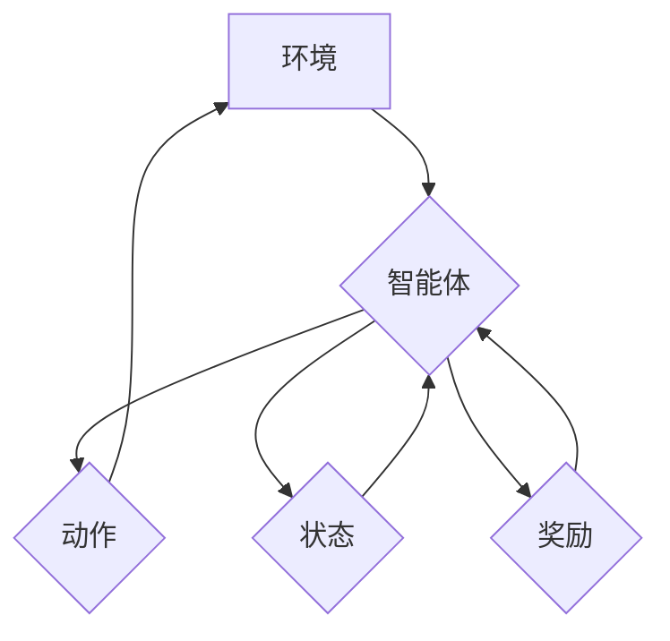

## 一切皆是映射：DQN在机器人领域的实践：挑战与策略

> 关键词：深度强化学习，DQN，机器人控制，动作映射，环境感知，模型训练

### 1. 背景介绍

机器人领域近年来取得了显著进展，从工业自动化到服务机器人，机器人技术正在深刻地改变着我们的生活。然而，机器人控制仍然是一个具有挑战性的问题。传统的基于规则的控制方法难以应对复杂、动态的环境，而深度学习技术的出现为机器人控制带来了新的希望。

深度强化学习（Deep Reinforcement Learning，DRL）作为机器学习的一个重要分支，通过训练智能体在环境中采取最优行动以最大化奖励，从而学习复杂的控制策略。其中，深度Q网络（Deep Q-Network，DQN）作为DRL领域的重要算法，凭借其强大的学习能力和应用广泛性，在机器人控制领域展现出巨大的潜力。

### 2. 核心概念与联系

DQN算法的核心思想是利用深度神经网络来估计状态-动作值函数（Q-value），即在给定状态下采取特定动作的期望未来回报。通过学习最优的Q-value，机器人可以做出最优的决策。

DQN算法的架构可以概括为以下几个部分：

* **环境（Environment）：** 机器人所处的环境，包括感知到的状态和对动作的反馈。
* **智能体（Agent）：** 学习控制策略的机器人。
* **动作空间（Action Space）：** 机器人可以采取的行动集合。
* **状态空间（State Space）：** 环境中可感知的状态集合。
* **奖励函数（Reward Function）：** 对智能体采取的行动进行评估的函数。
* **深度神经网络（Deep Neural Network）：** 用于估计状态-动作值函数的网络。

**Mermaid 流程图**



### 3. 核心算法原理 & 具体操作步骤

#### 3.1 算法原理概述

DQN算法的核心是利用深度神经网络来逼近状态-动作值函数，并通过Q-learning算法进行训练。Q-learning算法是一种基于价值函数的强化学习算法，其目标是学习一个策略，使得智能体在环境中采取最优行动以最大化累积奖励。

DQN算法的主要步骤如下：

1. **初始化深度神经网络：** 将深度神经网络的权重随机初始化。
2. **收集经验：** 在环境中与环境交互，收集状态、动作、奖励和下一个状态的经验数据。
3. **构建经验回放缓冲池：** 将收集到的经验数据存储在经验回放缓冲池中。
4. **从经验回放缓冲池中采样数据：** 从经验回放缓冲池中随机采样一批经验数据。
5. **计算目标Q值：** 使用目标网络（与主网络结构相同，但权重固定）计算目标Q值。
6. **更新主网络权重：** 使用梯度下降算法更新主网络的权重，使得主网络的预测Q值与目标Q值之间的误差最小化。
7. **更新目标网络权重：** 定期更新目标网络的权重，使其与主网络的权重保持一致。

#### 3.2 算法步骤详解

1. **初始化深度神经网络：** 

   DQN算法使用深度神经网络来逼近状态-动作值函数。网络的结构可以根据具体任务进行设计，通常包含多个隐藏层和一个输出层。输出层的每个神经元对应一个动作，输出值代表在给定状态下采取该动作的期望未来回报。

2. **收集经验：**

   智能体在环境中与环境交互，通过感知环境状态和采取行动，收集经验数据。每个经验数据包含以下信息：

   * **状态（State）：** 环境中可感知的状态信息。
   * **动作（Action）：** 智能体采取的动作。
   * **奖励（Reward）：** 对智能体采取的行动的反馈。
   * **下一个状态（Next State）：** 智能体采取动作后环境的状态。

3. **构建经验回放缓冲池：**

   收集到的经验数据存储在经验回放缓冲池中。经验回放缓冲池是一个存储经验数据的队列，可以随机采样经验数据进行训练。

4. **从经验回放缓冲池中采样数据：**

   从经验回放缓冲池中随机采样一批经验数据，每个数据包含一个状态、一个动作、一个奖励和一个下一个状态。

5. **计算目标Q值：**

   使用目标网络计算目标Q值。目标网络与主网络结构相同，但权重固定。目标Q值代表在下一个状态下采取最优动作的期望未来回报。

6. **更新主网络权重：**

   使用梯度下降算法更新主网络的权重，使得主网络的预测Q值与目标Q值之间的误差最小化。

7. **更新目标网络权重：**

   定期更新目标网络的权重，使其与主网络的权重保持一致。

#### 3.3 算法优缺点

**优点：**

* **能够学习复杂的控制策略：** DQN算法能够学习复杂的非线性控制策略，适用于各种机器人控制任务。
* **能够处理高维状态空间：** DQN算法可以使用深度神经网络来处理高维状态空间，适用于复杂环境下的机器人控制。
* **能够利用经验回放进行训练：** 经验回放机制可以提高训练效率，并避免训练过程中的样本偏差。

**缺点：**

* **训练过程可能比较慢：** DQN算法的训练过程可能比较慢，需要大量的经验数据和计算资源。
* **容易出现震荡问题：** DQN算法在训练过程中容易出现震荡问题，需要使用一些技巧来解决。
* **难以处理连续动作空间：** DQN算法通常适用于离散动作空间，处理连续动作空间比较困难。

#### 3.4 算法应用领域

DQN算法在机器人控制领域具有广泛的应用前景，例如：

* **机器人导航：** 训练机器人自主导航，避开障碍物，到达目标位置。
* **机器人抓取：** 训练机器人抓取物体，例如拾取、放置、整理等。
* **机器人运动控制：** 训练机器人进行复杂运动，例如行走、跑步、跳跃等。
* **机器人协作：** 训练多个机器人协作完成任务，例如组装、搬运等。

### 4. 数学模型和公式 & 详细讲解 & 举例说明

#### 4.1 数学模型构建

DQN算法的核心是状态-动作值函数（Q-value），它表示在给定状态下采取特定动作的期望未来回报。数学模型可以表示为：

$$Q(s, a) = E[\sum_{t=0}^{\infty} \gamma^t r_{t+1} | s_t = s, a_t = a]$$

其中：

* $s$ 表示状态。
* $a$ 表示动作。
* $r_{t+1}$ 表示在时间步 $t+1$ 获得的奖励。
* $\gamma$ 表示折扣因子，控制未来奖励的权重。

#### 4.2 公式推导过程

DQN算法的目标是学习最优的Q-value，即最大化累积奖励。可以使用Q-learning算法来更新Q-value：

$$Q(s, a) \leftarrow Q(s, a) + \alpha [r_{t+1} + \gamma \max_{a'} Q(s', a') - Q(s, a)]$$

其中：

* $\alpha$ 表示学习率，控制学习速度。
* $s'$ 表示下一个状态。
* $a'$ 表示在下一个状态下采取的动作。

#### 4.3 案例分析与讲解

假设一个机器人需要学习在迷宫中导航到目标位置。

* 状态空间：迷宫中的每个位置都是一个状态。
* 动作空间：机器人可以向四个方向移动（上、下、左、右）。
* 奖励函数：到达目标位置获得最大奖励，撞墙或超出迷宫边界获得负奖励。

DQN算法可以学习一个Q-value表，其中每个表项表示在给定状态下采取特定动作的期望未来回报。通过训练，机器人可以学习到最优的导航策略，即在每个状态下采取能够最大化累积奖励的动作。

### 5. 项目实践：代码实例和详细解释说明

#### 5.1 开发环境搭建

* Python 3.x
* TensorFlow 或 PyTorch 深度学习框架
* OpenAI Gym 机器人控制仿真环境

#### 5.2 源代码详细实现

```python
import tensorflow as tf
import numpy as np
from tensorflow.keras.models import Sequential
from tensorflow.keras.layers import Dense

# 定义DQN网络
class DQN(tf.keras.Model):
    def __init__(self, state_size, action_size):
        super(DQN, self).__init__()
        self.model = Sequential()
        self.model.add(Dense(64, activation='relu', input_shape=(state_size,)))
        self.model.add(Dense(64, activation='relu'))
        self.model.add(Dense(action_size))

    def call(self, state):
        return self.model(state)

# 定义经验回放缓冲池
class ReplayBuffer:
    def __init__(self, capacity):
        self.capacity = capacity
        self.buffer = []

    def add(self, state, action, reward, next_state, done):
        if len(self.buffer) < self.capacity:
            self.buffer.append((state, action, reward, next_state, done))
        else:
            self.buffer[len(self.buffer) % self.capacity] = (state, action, reward, next_state, done)

    def sample(self, batch_size):
        return random.sample(self.buffer, batch_size)

# 定义训练函数
def train(dqn, replay_buffer, batch_size, gamma, epsilon):
    batch = replay_buffer.sample(batch_size)
    states = np.array([sample[0] for sample in batch])
    actions = np.array([sample[1] for sample in batch])
    rewards = np.array([sample[2] for sample in batch])
    next_states = np.array([sample[3] for sample in batch])
    dones = np.array([sample[4] for sample in batch])

    with tf.GradientTape() as tape:
        q_values = dqn(states)
        target_q_values = rewards + gamma * np.max(dqn(next_states), axis=1) * (1 - dones)
        loss = tf.keras.losses.mean_squared_error(target_q_values, q_values[np.arange(batch_size), actions])

    gradients = tape.gradient(loss, dqn.trainable_variables)
    optimizer.apply_gradients(zip(gradients, dqn.trainable_variables))

#... 其他代码...
```

#### 5.3 代码解读与分析

* **DQN网络：** 使用深度神经网络来逼近状态-动作值函数。
* **经验回放缓冲池：** 存储经验数据，并随机采样数据进行训练。
* **训练函数：** 使用Q-learning算法更新Q-value，并使用梯度下降算法优化网络参数。

#### 5.4 运行结果展示

通过训练，DQN算法可以学习到最优的控制策略，使机器人能够在迷宫中成功导航到目标位置。

### 6. 实际应用场景

DQN算法在机器人控制领域具有广泛的应用前景，例如：

* **工业机器人：** 训练机器人进行复杂的任务，例如焊接、喷漆、组装等。
* **服务机器人：** 训练机器人进行服务任务，例如清洁、送餐、陪伴等。
* **医疗机器人：** 训练机器人进行手术、康复等医疗任务。