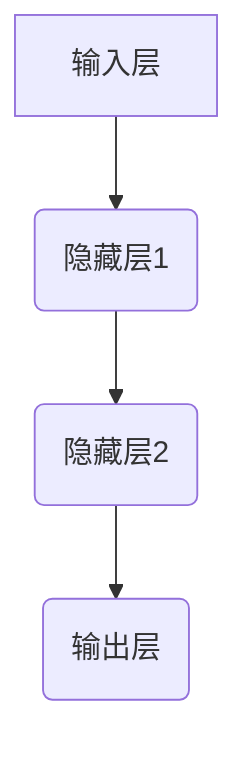

## 一切皆是映射：深度学习的基石与概念入门

> 关键词：深度学习、神经网络、映射、激活函数、反向传播、梯度下降

### 1. 背景介绍

深度学习作为机器学习领域最前沿的突破，近年来在图像识别、自然语言处理、语音识别等领域取得了令人瞩目的成就。其核心思想是通过多层神经网络模拟人类大脑的学习机制，从海量数据中自动提取特征，从而实现对复杂问题的学习和解决。

然而，深度学习的复杂性和抽象性也让许多人望而却步。本文将从“映射”这一核心概念出发，深入浅出地讲解深度学习的基本原理、算法和应用，帮助读者理解深度学习的本质，并为进一步学习和实践打下坚实的基础。

### 2. 核心概念与联系

深度学习的核心概念是**映射**。神经网络本质上是一个复杂的**函数映射**系统。输入数据经过多层神经元之间的连接和计算，最终映射到输出结果。

**神经网络结构**



* **输入层:**接收原始数据，每个神经元代表一个数据特征。
* **隐藏层:**数据经过隐藏层进行多层处理，提取特征和进行抽象。
* **输出层:**输出最终结果，每个神经元代表一个输出类别或值。

每个神经元接收来自前一层神经元的输入信号，并通过**权重**进行加权求和。然后，通过**激活函数**对求和结果进行非线性变换，输出到下一层神经元。

**激活函数**

激活函数是神经网络中引入非线性性的关键因素。它决定了神经元对输入信号的响应方式，并赋予神经网络学习复杂模式的能力。常见的激活函数包括：

* **Sigmoid函数:**输出值在0到1之间，常用于二分类问题。
* **ReLU函数:**输出值大于0时为输入值，否则为0，常用于隐藏层。
* **Softmax函数:**将多个输出值归一化到0到1之间，常用于多分类问题。

**权重和偏置**

权重和偏置是神经网络的参数，通过训练过程不断调整，以最小化预测误差。

* **权重:**控制不同神经元之间连接强度的参数。
* **偏置:**每个神经元自身的阈值参数。

### 3. 核心算法原理 & 具体操作步骤

#### 3.1 算法原理概述

深度学习的核心算法是**反向传播算法**，它用于训练神经网络，调整权重和偏置，使网络的预测结果更加准确。

反向传播算法的基本思想是：

1. 将输入数据输入神经网络，计算输出结果。
2. 计算输出结果与真实值的误差。
3. 根据误差反向传播，计算每个神经元的梯度。
4. 使用梯度下降算法更新权重和偏置，减小误差。

#### 3.2 算法步骤详解

1. **前向传播:** 将输入数据逐层传递到神经网络，计算每个神经元的输出值。
2. **损失函数:** 计算输出结果与真实值的误差，使用损失函数量化误差。
3. **反向传播:** 计算损失函数对每个权重和偏置的梯度。
4. **梯度下降:** 使用梯度下降算法更新权重和偏置，减小损失函数的值。

#### 3.3 算法优缺点

**优点:**

* 能够学习复杂非线性关系。
* 具有强大的泛化能力。
* 可以处理海量数据。

**缺点:**

* 训练过程耗时且资源消耗大。
* 对数据质量要求高。
* 难以解释模型的决策过程。

#### 3.4 算法应用领域

* **图像识别:** 人脸识别、物体检测、图像分类。
* **自然语言处理:** 机器翻译、文本摘要、情感分析。
* **语音识别:** 语音转文本、语音助手。
* **推荐系统:** 商品推荐、内容推荐。
* **医疗诊断:** 病情预测、疾病诊断。

### 4. 数学模型和公式 & 详细讲解 & 举例说明

#### 4.1 数学模型构建

深度学习模型可以看作是一个多层感知机的组合，每个感知机由输入层、隐藏层和输出层组成。

**感知机模型:**

$$
y = f(w^T x + b)
$$

其中：

* $y$ 是输出值。
* $x$ 是输入向量。
* $w$ 是权重向量。
* $b$ 是偏置项。
* $f$ 是激活函数。

**多层感知机模型:**

$$
y = f_L(f_{L-1}(...f_1(w^T_1 x + b_1)...))
$$

其中：

* $f_i$ 是第 $i$ 层的激活函数。
* $w_i$ 是第 $i$ 层的权重矩阵。
* $b_i$ 是第 $i$ 层的偏置向量。

#### 4.2 公式推导过程

反向传播算法的核心是计算损失函数对每个参数的梯度。

**损失函数:**

$$
L = \frac{1}{N} \sum_{i=1}^{N} (y_i - \hat{y}_i)^2
$$

其中：

* $L$ 是损失函数值。
* $N$ 是样本数量。
* $y_i$ 是第 $i$ 个样本的真实值。
* $\hat{y}_i$ 是第 $i$ 个样本的预测值。

**梯度下降算法:**

$$
\theta_{t+1} = \theta_t - \eta \nabla L(\theta_t)
$$

其中：

* $\theta$ 是模型参数。
* $\eta$ 是学习率。
* $\nabla L(\theta)$ 是损失函数对参数 $\theta$ 的梯度。

#### 4.3 案例分析与讲解

**举例说明:**

假设我们有一个简单的感知机模型，用于分类手写数字。输入数据是数字图像的像素值，输出是数字类别。

我们可以使用反向传播算法训练这个模型，通过调整权重和偏置，使模型能够准确地识别手写数字。

### 5. 项目实践：代码实例和详细解释说明

#### 5.1 开发环境搭建

* Python 3.x
* TensorFlow 或 PyTorch 等深度学习框架
* Jupyter Notebook 或 VS Code 等代码编辑器

#### 5.2 源代码详细实现

```python
import tensorflow as tf

# 定义模型
model = tf.keras.models.Sequential([
    tf.keras.layers.Dense(128, activation='relu', input_shape=(784,)),
    tf.keras.layers.Dense(10, activation='softmax')
])

# 编译模型
model.compile(optimizer='adam',
              loss='sparse_categorical_crossentropy',
              metrics=['accuracy'])

# 训练模型
model.fit(x_train, y_train, epochs=10)

# 评估模型
loss, accuracy = model.evaluate(x_test, y_test)
print('Loss:', loss)
print('Accuracy:', accuracy)
```

#### 5.3 代码解读与分析

* **定义模型:** 使用 TensorFlow 的 `Sequential` API 定义一个简单的多层感知机模型。
* **编译模型:** 使用 `adam` 优化器、`sparse_categorical_crossentropy` 损失函数和 `accuracy` 评估指标编译模型。
* **训练模型:** 使用 `fit` 方法训练模型，输入训练数据 `x_train` 和标签 `y_train`，训练 10 个 epochs。
* **评估模型:** 使用 `evaluate` 方法评估模型在测试数据 `x_test` 和标签 `y_test` 上的性能。

#### 5.4 运行结果展示

训练完成后，模型会输出训练过程中的损失值和准确率，以及在测试数据上的损失值和准确率。

### 6. 实际应用场景

深度学习在各个领域都有广泛的应用，例如：

* **图像识别:** 自动驾驶、人脸识别、医疗影像分析。
* **自然语言处理:** 机器翻译、文本摘要、聊天机器人。
* **语音识别:** 语音助手、语音搜索、语音转文本。
* **推荐系统:** 商品推荐、内容推荐、个性化服务。

### 6.4 未来应用展望

随着深度学习技术的不断发展，其应用场景将更加广泛，例如：

* **药物研发:** 利用深度学习加速药物发现和开发。
* **个性化教育:** 根据学生的学习情况提供个性化的学习方案。
* **智能制造:** 利用深度学习实现智能生产和质量控制。

### 7. 工具和资源推荐

#### 7.1 学习资源推荐

* **书籍:**
    * 深度学习 (Deep Learning) - Ian Goodfellow, Yoshua Bengio, Aaron Courville
    * 深度学习实践 (Deep Learning with Python) - Francois Chollet
* **在线课程:**
    * Coursera: 深度学习 Specialization
    * Udacity: 深度学习 Nanodegree
    * fast.ai: 深度学习课程

#### 7.2 开发工具推荐

* **TensorFlow:** Google 开发的开源深度学习框架。
* **PyTorch:** Facebook 开发的开源深度学习框架。
* **Keras:** TensorFlow 上的深度学习 API，易于使用。

#### 7.3 相关论文推荐

* **ImageNet Classification with Deep Convolutional Neural Networks** - Alex Krizhevsky, Ilya Sutskever, Geoffrey E. Hinton
* **Attention Is All You Need** - Ashish Vaswani, Noam Shazeer, Niki Parmar, Jakob Uszkoreit, Llion Jones, Aidan N. Gomez, Łukasz Kaiser, Illia Polosukhin

### 8. 总结：未来发展趋势与挑战

#### 8.1 研究成果总结

深度学习取得了令人瞩目的成就，在图像识别、自然语言处理等领域取得了突破性进展。

#### 8.2 未来发展趋势

* **模型效率:** 追求更小、更快、更节能的深度学习模型。
* **可解释性:** 提高深度学习模型的透明度和可解释性。
* **数据效率:** 降低深度学习模型对数据量的依赖。
* **安全性和鲁棒性:** 增强深度学习模型的安全性和鲁棒性。

#### 8.3 面临的挑战

* **数据获取和标注:** 深度学习模型需要海量数据进行训练，数据获取和标注成本高昂。
* **计算资源:** 训练大型深度学习模型需要大量的计算资源。
* **模型复杂性:** 深度学习模型越来越复杂，难以理解和调试。
* **伦理问题:** 深度学习技术可能带来伦理问题，例如算法偏见和隐私泄露。

#### 8.4 研究展望

未来，深度学习研究将继续朝着更智能、更安全、更可解释的方向发展，并应用于更多领域，为人类社会带来更多福祉。

### 9. 附录：常见问题与解答

* **什么是激活函数？**

激活函数是神经网络中引入非线性性的关键因素，它决定了神经元对输入信号的响应方式。

* **什么是反向传播算法？**

反向传播算法是深度学习模型训练的核心算法，它用于计算损失函数对每个参数的梯度，并根据梯度更新参数值。

* **什么是深度学习框架？**

深度学习框架是用于构建和训练深度学习模型的软件库，例如 TensorFlow 和 PyTorch。


作者：禅与计算机程序设计艺术 / Zen and the Art of Computer Programming