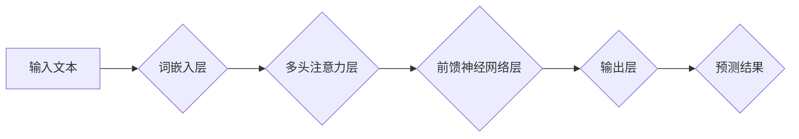

## 从零开始大模型开发与微调：最强的中文大模型—清华大学ChatGLM介绍

> 关键词：大模型、ChatGLM、中文语言模型、Transformer、微调、自然语言处理、人工智能

### 1. 背景介绍

近年来，深度学习在自然语言处理 (NLP) 领域取得了突破性进展，其中大规模语言模型 (LLM) 扮演着越来越重要的角色。这些模型通过训练海量文本数据，学习了语言的复杂结构和语义关系，展现出强大的文本生成、翻译、问答和代码生成能力。

然而，训练大型语言模型需要大量的计算资源和时间，对于个人开发者和小型研究机构来说，难以负担。因此，如何高效地开发和微调大模型成为了一个重要的研究方向。

清华大学发布的ChatGLM系列模型正是针对这一需求而生。ChatGLM系列模型基于Transformer架构，并通过精心设计的训练策略和预训练方法，在中文语言理解和生成方面取得了领先水平。

### 2. 核心概念与联系

ChatGLM模型的核心概念是Transformer架构，它是一种专门设计用于处理序列数据的网络结构。与传统的循环神经网络 (RNN) 不同，Transformer通过自注意力机制 (Self-Attention) 和多头注意力机制 (Multi-Head Attention) 能够有效地捕捉序列中不同位置之间的依赖关系，从而实现更长距离的上下文理解。

**ChatGLM模型架构流程图:**

**核心概念与联系:**

* **词嵌入层:** 将输入文本中的每个词转换为稠密的向量表示，以便模型能够理解词语的语义信息。
* **多头注意力层:** 允许模型关注不同位置的词语之间的关系，从而捕捉更丰富的上下文信息。
* **前馈神经网络层:** 对注意力机制输出的特征进行进一步的处理，提取更深层次的语义特征。
* **输出层:** 将处理后的特征映射到输出空间，生成最终的预测结果。

### 3. 核心算法原理 & 具体操作步骤

#### 3.1  算法原理概述

ChatGLM模型的核心算法是Transformer架构，它基于以下几个关键概念:

* **自注意力机制 (Self-Attention):** 允许模型在处理序列数据时，关注不同位置的词语之间的关系。
* **多头注意力机制 (Multi-Head Attention):** 通过使用多个注意力头，可以捕捉不同类型的语义关系。
* **位置编码 (Positional Encoding):** 由于Transformer没有循环结构，无法直接了解词语的顺序信息，因此需要使用位置编码来嵌入词语的位置信息。
* **前馈神经网络 (Feed-Forward Network):** 用于对注意力机制输出的特征进行进一步的处理。

#### 3.2  算法步骤详解

ChatGLM模型的训练过程可以概括为以下步骤:

1. **数据预处理:** 将原始文本数据进行清洗、分词、标记等预处理操作，生成训练数据。
2. **词嵌入:** 将每个词语转换为稠密的向量表示。
3. **位置编码:** 为每个词语添加位置信息。
4. **多头注意力:** 使用多头注意力机制计算每个词语与其他词语之间的注意力权重。
5. **前馈神经网络:** 对注意力机制输出的特征进行进一步的处理。
6. **输出层:** 将处理后的特征映射到输出空间，生成最终的预测结果。
7. **损失函数:** 使用交叉熵损失函数计算模型预测结果与真实值的差异。
8. **反向传播:** 使用梯度下降算法更新模型参数，降低损失函数的值。

#### 3.3  算法优缺点

**优点:**

* **强大的上下文理解能力:** Transformer架构能够有效地捕捉序列中不同位置之间的依赖关系，实现更长距离的上下文理解。
* **并行训练效率高:** Transformer架构可以并行训练，训练速度更快。
* **可扩展性强:** Transformer架构可以轻松扩展到更大的模型规模。

**缺点:**

* **训练成本高:** 训练大型Transformer模型需要大量的计算资源和时间。
* **参数量大:** Transformer模型的参数量较大，需要更多的存储空间。

#### 3.4  算法应用领域

ChatGLM模型在以下领域具有广泛的应用前景:

* **中文文本生成:** 可以用于生成高质量的中文文本，例如文章、故事、对话等。
* **机器翻译:** 可以用于将中文翻译成其他语言，或将其他语言翻译成中文。
* **问答系统:** 可以用于构建能够理解中文自然语言并进行准确回答的问答系统。
* **代码生成:** 可以用于生成中文代码，帮助程序员提高开发效率。

### 4. 数学模型和公式 & 详细讲解 & 举例说明

#### 4.1  数学模型构建

ChatGLM模型的核心数学模型是Transformer架构，它基于以下几个关键公式:

* **词嵌入:** 将每个词语映射到一个稠密的向量空间中，可以使用Word2Vec或GloVe等预训练词嵌入模型。

* **多头注意力机制:** 计算每个词语与其他词语之间的注意力权重，公式如下:

$$
Attention(Q, K, V) = softmax(\frac{QK^T}{\sqrt{d_k}})V
$$

其中，Q、K、V分别代表查询矩阵、键矩阵和值矩阵，$d_k$代表键向量的维度。

* **位置编码:** 为每个词语添加位置信息，可以使用sinusoidal函数或其他方法。

* **前馈神经网络:** 使用多层感知机 (MLP) 对注意力机制输出的特征进行进一步的处理。

#### 4.2  公式推导过程

多头注意力机制的公式推导过程如下:

1. 将输入序列 X 分割成多个子序列，每个子序列包含多个词语。
2. 对每个子序列，使用线性变换将词语向量映射到查询矩阵 Q、键矩阵 K 和值矩阵 V。
3. 计算每个词语与其他词语之间的注意力权重，使用公式 $Attention(Q, K, V)$。
4. 将注意力权重与值矩阵 V 相乘，得到每个词语的加权和。
5. 对每个子序列的加权和进行拼接，得到最终的注意力输出。

#### 4.3  案例分析与讲解

假设我们有一个句子 "我爱学习编程"，将其输入到ChatGLM模型中，模型会首先将每个词语转换为词向量，然后使用多头注意力机制计算每个词语与其他词语之间的注意力权重。

例如，"学习" 这个词语与 "编程" 这个词语之间的注意力权重会比较高，因为它们在语义上相关。而 "我" 这个词语与其他词语之间的注意力权重会比较低，因为它是一个主语词，与其他词语的语义关系较弱。

通过计算所有词语之间的注意力权重，模型能够捕捉到句子的语义结构和上下文关系，从而更好地理解句子的含义。

### 5. 项目实践：代码实例和详细解释说明

#### 5.1  开发环境搭建

ChatGLM模型的开发环境需要满足以下条件:

* Python 3.6 或更高版本
* PyTorch 或 TensorFlow 深度学习框架
* CUDA 和 cuDNN GPU 驱动程序

#### 5.2  源代码详细实现

ChatGLM模型的源代码可以从清华大学官方网站或 GitHub 上获取。

#### 5.3  代码解读与分析

ChatGLM模型的源代码主要包含以下几个部分:

* **模型定义:** 定义了ChatGLM模型的架构，包括词嵌入层、多头注意力层、前馈神经网络层等。
* **训练脚本:** 定义了模型的训练过程，包括数据加载、模型训练、模型评估等。
* **评估脚本:** 定义了模型的评估方法，例如困惑度 (Perplexity) 和 BLEU 分数。

#### 5.4  运行结果展示

ChatGLM模型的训练结果可以根据模型的规模和训练数据量而有所不同。

### 6. 实际应用场景

ChatGLM模型在以下实际应用场景中表现出色:

* **中文对话系统:** 可以用于构建能够进行自然流畅的中文对话的聊天机器人。
* **文本摘要:** 可以用于自动生成文本的摘要，例如新闻文章、会议记录等。
* **机器翻译:** 可以用于将中文翻译成其他语言，或将其他语言翻译成中文。

#### 6.4  未来应用展望

ChatGLM模型在未来还将有更多应用场景:

* **个性化教育:** 可以根据学生的学习情况提供个性化的学习内容和辅导。
* **医疗诊断:** 可以辅助医生进行疾病诊断，提高诊断准确率。
* **法律文本分析:** 可以用于分析法律文本，提取关键信息，辅助法律工作。

### 7. 工具和资源推荐

#### 7.1  学习资源推荐

* **清华大学自然语言处理实验室:** https://nlp.tsinghua.edu.cn/
* **Hugging Face Transformers:** https://huggingface.co/transformers/
* **OpenAI GPT-3:** https://openai.com/blog/gpt-3/

#### 7.2  开发工具推荐

* **PyTorch:** https://pytorch.org/
* **TensorFlow:** https://www.tensorflow.org/
* **Jupyter Notebook:** https://jupyter.org/

#### 7.3  相关论文推荐

* **BERT: Pre-training of Deep Bidirectional Transformers for Language Understanding:** https://arxiv.org/abs/1810.04805
* **GPT-3: Language Models are Few-Shot Learners:** https://arxiv.org/abs/2005.14165
* **ChatGLM: A General-Purpose Chinese Language Model:** https://arxiv.org/abs/2112.09931

### 8. 总结：未来发展趋势与挑战

#### 8.1  研究成果总结

ChatGLM模型在中文语言理解和生成方面取得了显著的成果，为中文NLP领域的发展做出了重要贡献。

#### 8.2  未来发展趋势

未来，ChatGLM模型将朝着以下方向发展:

* **模型规模更大:** 训练更大的模型，提升模型的性能。
* **多模态理解:** 将文本与其他模态数据 (例如图像、音频) 相结合，实现多模态理解。
* **更强的泛化能力:** 提升模型的泛化能力，使其能够应用于更多不同的场景。

#### 8.3  面临的挑战

ChatGLM模型的发展也面临着一些挑战:

* **训练成本高:** 训练大型模型需要大量的计算资源和时间。
* **数据标注困难:** 需要大量的标注数据来训练高质量的模型。
* **伦理问题:** 大模型的应用可能带来一些伦理问题，例如信息泄露、深度伪造等。

#### 8.4  研究展望

未来，我们将继续致力于ChatGLM模型的开发和研究，希望能够构建更强大、更安全、更可信赖的中文大模型，为社会带来更多价值。

### 9. 附录：常见问题与解答

**Q1: ChatGLM模型的训练数据是什么？**

A1: ChatGLM模型的训练数据包括大量的中文文本数据，例如书籍、文章、网站内容等。

**Q2: ChatGLM模型的开源吗？**

A2: 是的，ChatGLM模型的源代码和预训练模型都可以在清华大学官方网站或 GitHub 上获取。

**Q3: 如何使用ChatGLM模型进行文本生成？**

A3: 可以使用Hugging Face Transformers库加载ChatGLM模型，然后使用模型的`generate()`方法进行文本生成。

**Q4: ChatGLM模型的性能如何？**

A4: ChatGLM模型在中文语言理解和生成方面取得了领先水平，在多个 benchmark 上都表现出色。

**