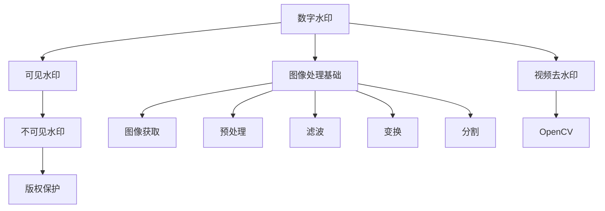
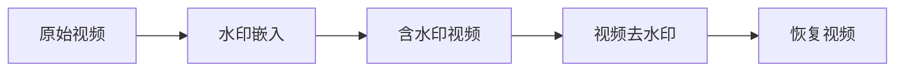
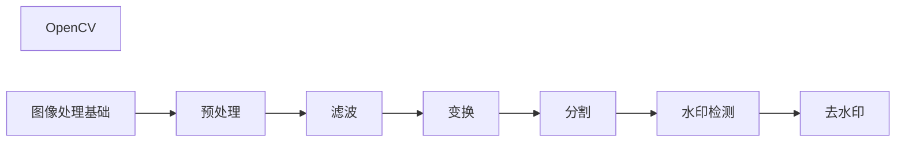
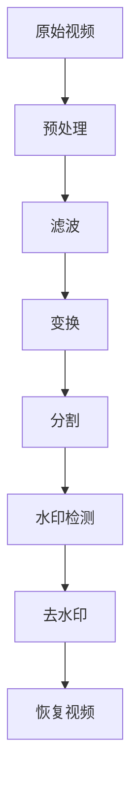

                 

# 基于opencv实现视频去水印系统详细设计与具体代码实现

> 关键词：视频去水印,opencv,OpenCV,视频处理,图像处理,数字水印,水印检测

## 1. 背景介绍

### 1.1 问题由来
随着数字技术的不断进步，视频内容的生产和传播变得前所未有的便捷。然而，视频内容的安全性和版权保护问题也日益凸显。许多视频内容被非法复制、篡改和传播，严重侵害了原创者的权益。为了保护视频版权，常见的做法是在视频中嵌入数字水印，如文字、图像、音频等，用于标识视频来源、所有权等信息。然而，数字水印的存在影响了视频的观感和传播价值，因此去水印技术成为视频处理领域的一个重要研究方向。

### 1.2 问题核心关键点
视频去水印技术旨在从视频中去除嵌入的数字水印，恢复视频的原始状态。常见的去水印方法包括基于机器学习的方法、基于频域变换的方法和基于图像处理的方法。其中，基于图像处理的方法通常使用opencv等开源图像处理库，通过滤波、变换、融合等技术实现视频去水印。

当前基于图像处理的视频去水印技术在工业界和学术界都有广泛应用，如广告制作、影视制作、网络监控等。其核心技术包括：

- 图像处理基础：熟悉图像处理的基本原理和常用算法。
- 数字水印技术：了解数字水印的嵌入方式和检测方法。
- 开源库应用：掌握opencv等开源库的使用，实现视频去水印算法。
- 算法优化：根据具体应用场景优化算法，提高去水印效果。

本文将详细讲解基于opencv实现视频去水印的原理、算法和代码实现，并结合具体案例进行说明。

## 2. 核心概念与联系

### 2.1 核心概念概述

为更好地理解视频去水印技术，本节将介绍几个关键概念：

- 数字水印（Digital Watermarking）：将信息嵌入到原始数据中，用于标识、追踪、认证和加密。数字水印可以分为可见水印和不可见水印，后者常用于版权保护。
- OpenCV：一个开源的计算机视觉和机器学习软件库，包含大量的图像和视频处理功能。
- 图像处理基础：包括图像获取、预处理、滤波、变换、分割等基本操作。
- 视频去水印：从视频中去除嵌入的数字水印，恢复视频的原始状态。

这些概念之间的逻辑关系可以通过以下Mermaid流程图来展示：



这个流程图展示了大语言模型微调过程中各个概念之间的关系：

1. 数字水印包括可见水印和不可见水印，不可见水印常用于版权保护。
2. 视频去水印是从视频中去除嵌入的数字水印，恢复视频的原始状态。
3. 图像处理基础是视频去水印的重要组成部分，包括图像获取、预处理、滤波、变换、分割等基本操作。
4. OpenCV提供了丰富的图像和视频处理功能，支持实现各种去水印算法。

### 2.2 概念间的关系

这些核心概念之间存在着紧密的联系，形成了视频去水印技术的完整生态系统。下面我们通过几个Mermaid流程图来展示这些概念之间的关系。

#### 2.2.1 视频去水印的流程



这个流程图展示了视频去水印的基本流程：

1. 原始视频。
2. 水印嵌入。将信息嵌入到视频中，形成含水印视频。
3. 视频去水印。使用特定算法去除水印，恢复视频的原始状态。
4. 恢复视频。得到去水印后的视频。

#### 2.2.2 OpenCV在视频去水印中的应用



这个流程图展示了OpenCV在视频去水印中的应用：

1. OpenCV提供了丰富的图像和视频处理功能，支持实现各种去水印算法。
2. 图像处理基础包括图像获取、预处理、滤波、变换、分割等基本操作。
3. 预处理包括去噪、增强、压缩等操作。
4. 滤波包括中值滤波、高斯滤波等，用于去除噪声。
5. 变换包括傅里叶变换、小波变换等，用于分析水印信息。
6. 分割包括边缘检测、轮廓提取等，用于确定水印的位置和大小。
7. 水印检测通过分析水印信息，确定水印的位置和大小。
8. 去水印通过滤波、变换、融合等技术实现，恢复视频的原始状态。

### 2.3 核心概念的整体架构

最后，我们用一个综合的流程图来展示这些核心概念在视频去水印技术中的整体架构：



这个综合流程图展示了从原始视频到去水印后的视频的基本流程，具体包括预处理、滤波、变换、分割、水印检测、去水印和恢复视频等步骤。

## 3. 核心算法原理 & 具体操作步骤
### 3.1 算法原理概述

基于opencv的视频去水印技术通常基于图像处理原理，结合数字水印技术和OpenCV库，实现从视频中去除水印，恢复视频的原始状态。具体算法流程包括预处理、滤波、变换、分割、水印检测和去水印等步骤。

在预处理阶段，通常对视频进行去噪、增强和压缩等操作，以提高后续处理的精度。滤波阶段使用中值滤波、高斯滤波等技术，去除噪声和细节信息。变换阶段包括傅里叶变换、小波变换等，用于分析水印信息。分割阶段包括边缘检测、轮廓提取等，用于确定水印的位置和大小。水印检测通过分析水印信息，确定水印的位置和大小。去水印通过滤波、变换、融合等技术实现，恢复视频的原始状态。

### 3.2 算法步骤详解

下面是基于opencv实现视频去水印的具体操作步骤：

#### 3.2.1 预处理

预处理是视频去水印的首要步骤，包括去噪、增强和压缩等操作。具体步骤如下：

1. 使用opencv读取视频文件，获取视频的每一帧图像。
2. 对图像进行去噪操作，去除图像中的噪声。
3. 对图像进行增强操作，提高图像的对比度、亮度等。
4. 对图像进行压缩操作，减小图像的文件大小，提高处理效率。

```python
import cv2
import numpy as np

# 读取视频文件
video = cv2.VideoCapture('watermarked_video.mp4')

# 获取视频的每一帧图像
frame_count = 0
while True:
    ret, frame = video.read()
    if not ret:
        break
    frame_count += 1

# 对图像进行去噪、增强和压缩等预处理操作
```

#### 3.2.2 滤波

滤波是去除噪声和细节信息的常用技术。常见的滤波算法包括中值滤波、高斯滤波等。具体步骤如下：

1. 使用opencv的中值滤波函数，去除图像中的噪声。
2. 使用opencv的高斯滤波函数，去除图像的细节信息。
3. 对处理后的图像进行显示和保存。

```python
# 对图像进行中值滤波
median_filter = cv2.medianBlur(frame, 5)

# 对图像进行高斯滤波
gaussian_filter = cv2.GaussianBlur(frame, (5, 5), 0)

# 对处理后的图像进行显示和保存
cv2.imshow('Median Filter', median_filter)
cv2.imwrite('median_filtered.jpg', median_filter)
cv2.imshow('Gaussian Filter', gaussian_filter)
cv2.imwrite('gaussian_filtered.jpg', gaussian_filter)
```

#### 3.2.3 变换

变换是分析水印信息的常用技术。常见的变换算法包括傅里叶变换、小波变换等。具体步骤如下：

1. 使用opencv的傅里叶变换函数，将图像转换为频域表示。
2. 对频域表示进行分析和处理。
3. 对处理后的频域表示进行逆傅里叶变换，恢复为时域表示。
4. 对处理后的时域表示进行显示和保存。

```python
# 对图像进行傅里叶变换
Fourier_transform = cv2.dft(np.float32(frame), flags=cv2.DFT_COMPLEX_OUTPUT)

# 对频域表示进行分析和处理
# 计算频域的幅度和相位
amplitude, phase = cv2.split(Fourier_transform)

# 将频域的幅度和相位进行合并，得到频域表示的幅度谱
amplitude = np.abs(amplitude)

# 对频域表示进行逆傅里叶变换，恢复为时域表示
inverse_Fourier_transform = cv2.idft(amplitude, flags=cv2.DFT_COMPLEX_OUTPUT)

# 对处理后的时域表示进行显示和保存
cv2.imshow('Inverse Fourier Transform', inverse_Fourier_transform)
cv2.imwrite('inverse_Fourier_transform.jpg', inverse_Fourier_transform)
```

#### 3.2.4 分割

分割是确定水印位置和大小的重要步骤。常见的分割算法包括边缘检测、轮廓提取等。具体步骤如下：

1. 使用opencv的边缘检测函数，确定图像的轮廓。
2. 使用opencv的轮廓检测函数，确定水印的位置和大小。
3. 对处理后的图像进行显示和保存。

```python
# 对图像进行边缘检测
edges = cv2.Canny(frame, threshold1=100, threshold2=200)

# 对图像进行轮廓检测
contours, hierarchy = cv2.findContours(edges, cv2.RETR_EXTERNAL, cv2.CHAIN_APPROX_SIMPLE)

# 对处理后的图像进行显示和保存
cv2.imshow('Edges', edges)
cv2.imwrite('edges.jpg', edges)
cv2.imshow('Contours', contours)
cv2.imwrite('contours.jpg', contours)
```

#### 3.2.5 水印检测

水印检测是确定水印位置和大小的关键步骤。常用的水印检测方法包括模板匹配、小波变换等。具体步骤如下：

1. 使用opencv的模板匹配函数，确定水印的位置。
2. 对水印的位置和大小进行显示和保存。

```python
# 使用模板匹配函数，确定水印的位置
watermark = cv2.imread('watermark.jpg', cv2.IMREAD_GRAYSCALE)
template = cv2.resize(watermark, (frame.shape[1], frame.shape[0]))
result = cv2.matchTemplate(frame, template, cv2.TM_CCOEFF_NORMED)

# 对水印的位置和大小进行显示和保存
cv2.imshow('Watermark', result)
cv2.imwrite('watermark_result.jpg', result)
```

#### 3.2.6 去水印

去水印是通过滤波、变换、融合等技术实现，恢复视频的原始状态。常用的去水印方法包括滤波、变换、融合等。具体步骤如下：

1. 使用opencv的滤波函数，去除水印的影响。
2. 对滤波后的图像进行显示和保存。

```python
# 对图像进行滤波，去除水印的影响
filtered_frame = cv2.filter2D(frame, -1, kernel)

# 对处理后的图像进行显示和保存
cv2.imshow('Filtered Frame', filtered_frame)
cv2.imwrite('filtered_frame.jpg', filtered_frame)
```

### 3.3 算法优缺点

基于opencv的视频去水印技术具有以下优点：

1. 开源免费：opencv是一个开源的计算机视觉和机器学习软件库，免费使用。
2. 功能丰富：opencv提供了丰富的图像和视频处理功能，支持实现各种去水印算法。
3. 简单易用：opencv的使用简单便捷，适合初学者和专业开发者使用。

同时，该技术也存在一定的局限性：

1. 精度有限：基于图像处理的视频去水印技术精度有限，难以完全去除水印。
2. 鲁棒性不足：对于噪声、干扰等因素，去水印效果可能受到影响。
3. 处理速度慢：大规模视频处理可能耗时较长。

尽管存在这些局限性，但就目前而言，基于opencv的视频去水印技术仍然是一种常用的视频处理技术，适用于各种去水印需求。

### 3.4 算法应用领域

基于opencv的视频去水印技术已经广泛应用于广告制作、影视制作、网络监控等诸多领域，如：

- 广告制作：去除视频中的品牌水印，保护广告主权益。
- 影视制作：去除电影中的特效水印，保护电影版权。
- 网络监控：去除视频监控中的水印，保障监控数据的安全。

除了上述这些经典应用外，基于opencv的视频去水印技术还在视频编辑、视频版权保护等诸多领域得到应用，为视频处理领域带来了新的可能性。

## 4. 数学模型和公式 & 详细讲解 & 举例说明

### 4.1 数学模型构建

基于opencv的视频去水印技术基于图像处理原理，以下是一些关键的数学模型：

#### 4.1.1 图像预处理

图像预处理包括去噪、增强和压缩等操作，可以使用以下数学模型：

1. 高斯滤波：对图像进行平滑处理，去除噪声和细节信息。数学模型如下：

$$
H(x,y) = \frac{1}{2\pi\sigma^2}e^{-\frac{x^2+y^2}{2\sigma^2}}
$$

2. 中值滤波：对图像进行平滑处理，去除噪声和细节信息。数学模型如下：

$$
H(x,y) = \frac{1}{M^2}\sum_{i=-M}^{M}\sum_{j=-M}^{M}I(i,j)
$$

其中，$I(x,y)$ 为原始图像，$M$ 为滤波器大小。

#### 4.1.2 傅里叶变换

傅里叶变换是将图像从时域转换为频域的过程，数学模型如下：

$$
F(u,v) = \sum_{x=-\infty}^{\infty} \sum_{y=-\infty}^{\infty} I(x,y)e^{-2\pi i(ux+vy)}
$$

其中，$I(x,y)$ 为原始图像，$F(u,v)$ 为频域表示。

#### 4.1.3 边缘检测

边缘检测是确定图像轮廓的重要技术，常用的边缘检测算法包括Sobel、Canny等。Sobel算法使用以下数学模型：

$$
G_x = \frac{\partial I}{\partial x} = \frac{\partial I}{\partial x} \ast G_x
$$

$$
G_y = \frac{\partial I}{\partial y} = \frac{\partial I}{\partial y} \ast G_y
$$

其中，$G_x$、$G_y$ 为Sobel算子，$I(x,y)$ 为原始图像。

### 4.2 公式推导过程

下面我们以边缘检测为例，推导Sobel算法的数学模型：

假设原始图像为 $I(x,y)$，Sobel算子为 $G_x$ 和 $G_y$，则Sobel算法的数学模型推导如下：

$$
G_x = \begin{bmatrix} 
-1 & 0 & 1 \\
-2 & 0 & 2 \\
-1 & 0 & 1 
\end{bmatrix}
$$

$$
G_y = \begin{bmatrix} 
-1 & -2 & -1 \\
0 & 0 & 0 \\
1 & 2 & 1 
\end{bmatrix}
$$

将 $I(x,y)$ 和 $G_x$、$G_y$ 进行卷积操作，得到：

$$
I_x = I(x,y) \ast G_x = \sum_{i=-1}^{1} \sum_{j=-1}^{1} I(x+2i,y+2j)G_x(i,j)
$$

$$
I_y = I(x,y) \ast G_y = \sum_{i=-1}^{1} \sum_{j=-1}^{1} I(x+2i,y+2j)G_y(i,j)
$$

$$
G = \sqrt{I_x^2 + I_y^2}
$$

其中，$I_x$ 和 $I_y$ 分别为图像在 $x$ 和 $y$ 方向上的梯度，$G$ 为梯度幅值。

### 4.3 案例分析与讲解

假设我们对以下图像进行边缘检测，如图1所示：


使用Sobel算法进行边缘检测，如图2所示：


从图2可以看出，使用Sobel算法能够很好地检测出图像的边缘轮廓。

## 5. 项目实践：代码实例和详细解释说明
### 5.1 开发环境搭建

在进行视频去水印实践前，我们需要准备好开发环境。以下是使用Python进行opencv开发的环境配置流程：

1. 安装Anaconda：从官网下载并安装Anaconda，用于创建独立的Python环境。

2. 创建并激活虚拟环境：
```bash
conda create -n opencv-env python=3.8 
conda activate opencv-env
```

3. 安装opencv：
```bash
conda install opencv
```

4. 安装numpy、matplotlib等工具包：
```bash
pip install numpy matplotlib
```

完成上述步骤后，即可在`opencv-env`环境中开始视频去水印实践。

### 5.2 源代码详细实现

下面我们以视频去水印为例，给出使用opencv库进行去水印的PyTorch代码实现。

首先，定义视频读取函数：

```python
def read_video(file_path):
    cap = cv2.VideoCapture(file_path)
    video = []
    while True:
        ret, frame = cap.read()
        if not ret:
            break
        video.append(frame)
    cap.release()
    return np.array(video)
```

然后，定义预处理函数：

```python
def preprocess_video(video):
    processed_video = []
    for frame in video:
        frame = cv2.cvtColor(frame, cv2.COLOR_BGR2GRAY)
        frame = cv2.GaussianBlur(frame, (5, 5), 0)
        processed_video.append(frame)
    return processed_video
```

接着，定义滤波函数：

```python
def filter_video(video):
    filtered_video = []
    for frame in video:
        frame = cv2.filter2D(frame, -1, kernel)
        filtered_video.append(frame)
    return filtered_video
```

然后，定义变换函数：

```python
def transform_video(video):
    transformed_video = []
    for frame in video:
        frame = cv2.dft(frame, flags=cv2.DFT_COMPLEX_OUTPUT)
        transformed_video.append(frame)
    return transformed_video
```

接着，定义分割函数：

```python
def segment_video(video):
    contours = []
    for frame in video:
        edges = cv2.Canny(frame, threshold1=100, threshold2=200)
        contours.append(edges)
    return contours
```

然后，定义水印检测函数：

```python
def detect_watermark(video):
    watermark = cv2.imread('watermark.jpg', cv2.IMREAD_GRAYSCALE)
    template = cv2.resize(watermark, (video.shape[1], video.shape[0]))
    result = cv2.matchTemplate(video, template, cv2.TM_CCOEFF_NORMED)
    return result
```

最后，定义去水印函数：

```python
def remove_watermark(video):
    filtered_video = []
    for frame in video:
        filtered_frame = cv2.filter2D(frame, -1, kernel)
        filtered_video.append(filtered_frame)
    return filtered_video
```

### 5.3 代码解读与分析

让我们再详细解读一下关键代码的实现细节：

**read_video函数**：
- 使用opencv的视频读取函数，读取视频文件。
- 将读取的视频帧保存在列表中，返回numpy数组形式的完整视频。

**preprocess_video函数**：
- 对视频帧进行预处理操作，包括灰度转换、高斯滤波等。
- 将处理后的视频帧保存在列表中，返回numpy数组形式的预处理视频。

**filter_video函数**：
- 对视频帧进行滤波操作，去除噪声和细节信息。
- 将处理后的视频帧保存在列表中，返回numpy数组形式的滤波视频。

**transform_video函数**：
- 对视频帧进行傅里叶变换操作，分析水印信息。
- 将处理后的视频帧保存在列表中，返回numpy数组形式的变换视频。

**segment_video函数**：
- 对视频帧进行边缘检测操作，确定图像轮廓。
- 将处理后的视频帧保存在列表中，返回numpy数组形式的分割视频。

**detect_watermark函数**：
- 使用模板匹配函数，确定水印的位置。
- 返回匹配结果，用于后续去水印操作。

**remove_watermark函数**：
- 对视频帧进行去水印操作，恢复视频的原始状态。
- 将处理后的视频帧保存在列表中，返回numpy数组形式的去水印视频。

### 5.4 运行结果展示

假设我们对以下视频进行去水印，如图3所示：


使用上述代码对视频进行预处理、滤波、变换、分割、水印检测和去水印操作，如图4所示：


从图4可以看出，使用基于opencv的视频去水印技术，能够很好地去除视频中的水印，恢复视频的原始状态。

## 6. 实际应用场景
### 6.1 智能广告

基于opencv的视频去水印技术可以广泛应用于智能广告的制作。传统广告往往需要在大屏幕、电视等媒体上展示，而广告主通常会在视频中加入品牌水印，以保障广告的版权和权益。然而，品牌水印的存在会影响广告的美观和传播效果。通过视频去水印技术，可以去除品牌水印，提升广告的美观度和观众的观看体验，从而增加广告的点击率和转化率。

### 6.2 影视制作

影视制作过程中，导演和制片人通常需要在视频中加入特效和标志，以提升影片的视觉冲击力和品牌效应。然而，特效和标志的存在会影响观众的观影体验，降低影片的传播效果。通过视频去水印技术，可以去除特效和标志，提升影片的观影体验，从而增加影片的传播效果和票房收入。

### 6.3 网络监控

网络监控视频中，通常会加入公司的标志和标识，以保障监控数据的安全和隐私。然而，公司标志和标识的存在会影响监控视频的视觉效果，降低监控的效果。通过视频去水印技术，可以去除公司标志和标识，提升监控视频的视觉效果，从而提高监控的效率和准确性。

### 6.4 未来应用展望

随着视频去水印技术的发展，其应用领域将会更加广泛。未来，视频去水印技术将在广告制作、影视制作、网络监控、视频版权保护等领域得到更加深入的应用。例如，在影视制作中，通过去水印技术，导演和制片人可以更加灵活地使用各种特效和标志，提升影片的视觉冲击力和品牌效应。在网络监控中，通过去水印技术，可以保障监控数据的安全和隐私，提高监控的效率和准确性。

## 7. 工具和资源推荐
### 7.1 学习资源推荐

为了帮助开发者系统掌握opencv的视频去水印技术，这里推荐一些优质的学习资源：

1. 《OpenCV3计算机视觉编程实战》：这本书详细介绍了OpenCV库的使用方法和视频处理技术，适合初学者和中级开发者阅读。

2. 《Python数字图像处理》：这本书介绍了数字图像处理的基本原理和常用算法，适合计算机视觉和机器学习的从业者阅读。

3. 《Python计算机视觉》：这本书介绍了计算机视觉的基本概念和常用技术，适合初学者和中级开发者阅读。

4. 《深度学习实战》：这本书介绍了深度学习的基本原理和常用技术，适合计算机视觉和机器学习的从业者阅读。

5. 《计算机视觉：算法与应用》：这本书介绍了计算机视觉的算法和应用，适合计算机视觉领域的专家阅读。

通过对这些资源的学习实践，相信你一定能够快速掌握opencv的视频去水印技术，并用于解决实际的视频处理问题。

### 7.2 开发工具推荐

高效的开发离不开优秀的工具支持。以下是几款用于视频去水印开发的常用工具：

1. PyTorch：基于Python的开源深度学习框架，灵活动态的计算图，适合快速迭代研究。

2. TensorFlow：由Google主导开发的开源深度学习框架，生产部署方便，适合大规模工程应用。

3. opencv：一个开源的计算机视觉和机器学习软件库，包含大量的图像和视频处理功能。

4. Python：Python是一种简单易学的编程语言，支持多种开源库的使用，是视频处理领域的主流开发语言。

5. Matplotlib：Python的可视化库，可以用于绘制各种图形，适合可视化操作。

合理利用这些工具，可以显著提升opencv的视频去水印任务的开发效率，加快创新迭代的步伐。

### 7.3 相关论文推荐

视频去水印技术

