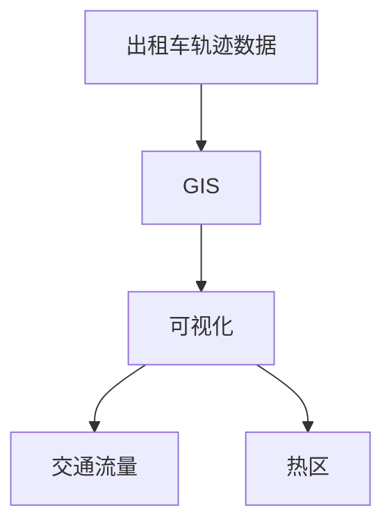
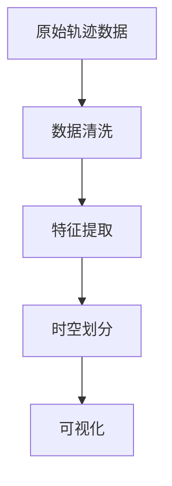
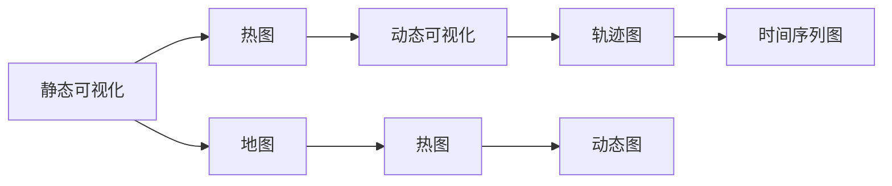
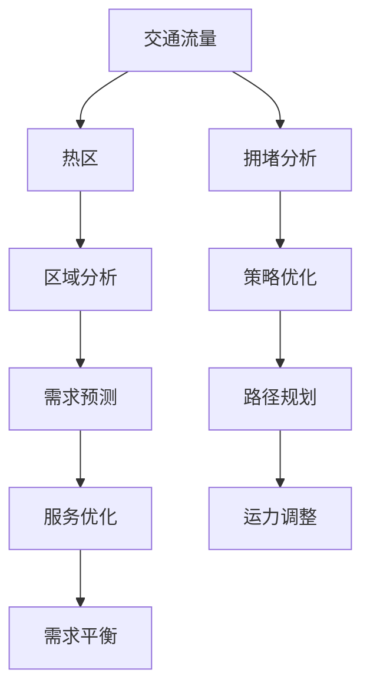
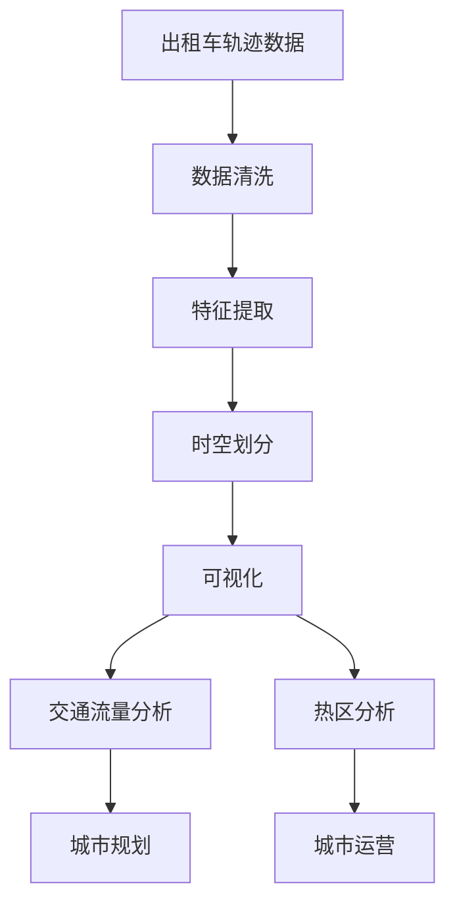

                 

# 基于出租车轨迹数据的可视化研究

## 1. 背景介绍

### 1.1 问题由来
出租车作为城市生活中的重要交通工具，其轨迹数据不仅记录了城市的流动人口，还蕴含着丰富的社会经济信息。通过对出租车轨迹数据的分析，不仅可以了解城市交通状况、识别热点区域，还可以揭示城市发展的潜规则。然而，传统的数据处理和分析方法往往局限于文本或数值数据，难以全面直观地展现出租车轨迹数据的特征和动态变化。

近年来，随着可视化技术的发展，人们开始利用GIS（地理信息系统）和图形化工具对出租车轨迹数据进行可视化研究。例如，G Sorted（Gsorted）、Spotmeter等工具已经具备了对出租车轨迹数据进行基本处理和可视化的能力。然而，这些工具功能有限，无法满足多样化的分析需求，且数据可视化效果和用户体验仍有较大提升空间。

### 1.2 问题核心关键点
本文聚焦于基于出租车轨迹数据的可视化研究，旨在通过深入分析出租车轨迹数据，构建可视化工具，挖掘城市交通和空间特征。核心关键点包括：
1. 轨迹数据处理与预处理：包括数据清洗、特征提取、时空划分等，为后续分析提供基础。
2. 可视化方法的优化：探讨多种可视化技术，结合出租车数据特点，设计高效直观的可视化展示。
3. 复杂场景的可视化：处理城市中的复杂交通现象，如交通拥堵、热区分布等，利用数据挖掘和机器学习技术，实现更精细的可视化展示。
4. 可视化界面设计：关注用户体验，提升可视化工具的可操作性和易用性，以便更广泛地应用于实际场景。

### 1.3 问题研究意义
出租车轨迹数据作为城市交通和空间研究的重要数据来源，具有实时、动态、多维度等特点，是研究城市发展、空间动态和交通治理的重要资源。通过对出租车轨迹数据的可视化研究，可以：

1. 精确反映城市交通流量和分布规律，辅助城市规划和交通管理。
2. 揭示城市中热点区域和潜在问题，为城市运营提供数据支撑。
3. 提升公众对城市交通问题的认知和理解，增强数据透明度和开放性。
4. 推动基于大数据的城市智能决策和公共服务优化，提高城市治理水平。
5. 探索利用出租车轨迹数据开展新的科研方向，推动跨学科研究和技术创新。

## 2. 核心概念与联系

### 2.1 核心概念概述

为了更好地理解基于出租车轨迹数据的可视化研究，本节将介绍几个密切相关的核心概念：

- 出租车轨迹数据(Taxi Trajectory Data)：由出租车GPS设备获取的连续位置记录，通常包括时间戳、经纬度、速度、加速度等，反映了出租车行驶的轨迹和状态。
- 地理信息系统(GIS)：用于管理和分析地理空间数据的技术系统，支持数据的可视化、查询、分析和建模。
- 可视化(Visualization)：将数据信息通过图形化手段展示出来的过程，旨在直观反映数据特性，揭示数据中的规律和趋势。
- 交通流量(Traffic Flow)：描述特定时间内通过某区域的道路或空间的量，通常以车流量或人流量的形式表示。
- 热区(Hotspot)：在一定时间内，某地点的访问频率远高于其他地区，常用于反映城市热点区域或高需求区域。

这些核心概念之间的逻辑关系可以通过以下Mermaid流程图来展示：



这个流程图展示了大数据可视化研究的主要流程：

1. 首先收集出租车轨迹数据。
2. 通过GIS技术，对轨迹数据进行处理和分析。
3. 利用可视化技术，将处理结果进行展示。
4. 通过交通流量和热区分析，揭示城市交通和空间特征。

### 2.2 概念间的关系

这些核心概念之间存在着紧密的联系，形成了出租车轨迹数据可视化的完整生态系统。下面我通过几个Mermaid流程图来展示这些概念之间的关系。

#### 2.2.1 出租车轨迹数据的处理流程



这个流程图展示了出租车轨迹数据处理的流程：

1. 首先对原始轨迹数据进行清洗，去除无效或噪声数据。
2. 接着进行特征提取，如计算速度、方向、转弯角度等。
3. 进行时空划分，如按时间窗口、空间区域等进行划分。
4. 最后对处理后的数据进行可视化展示。

#### 2.2.2 可视化方法的对比



这个流程图展示了不同可视化方法的比较：

1. 静态可视化（如热图、地图）：适用于静态展示，反映数据的空间分布和属性特征。
2. 动态可视化（如轨迹图、动态图）：适用于时间序列展示，反映数据的动态变化和演变趋势。
3. 热图：展示数据的空间密度或频率。
4. 地图：展示数据在地图上的分布。
5. 轨迹图：展示单条或多条轨迹在地图上的移动路径。
6. 动态图：展示轨迹数据的动态变化，如速度、方向等。
7. 时间序列图：展示轨迹数据在不同时间点的变化趋势。

#### 2.2.3 交通流量与热区的关系



这个流程图展示了交通流量与热区之间的关系：

1. 交通流量反映了特定时间点的道路或空间的量，是热区分析的重要依据。
2. 热区揭示了城市中的高需求区域，通过热区分析可以识别出交通流量较大的区域。
3. 通过拥堵分析，可以了解热区中的交通拥堵情况，为交通策略优化提供依据。
4. 区域分析揭示了热区的位置和分布特征，有助于理解城市中的人流和需求。
5. 策略优化通过热区分析指导城市交通和运营策略的制定。
6. 需求预测通过热区分析预测城市中未来的交通需求。
7. 路径规划通过热区分析优化路径选择，提高交通效率。
8. 运力调整根据热区分析结果，优化车辆配置和运力分配。
9. 需求平衡通过热区分析实现交通需求的均衡。

### 2.3 核心概念的整体架构

最后，我们用一个综合的流程图来展示这些核心概念在大数据可视化研究中的整体架构：



这个综合流程图展示了从数据收集到可视化的完整过程：

1. 首先收集出租车轨迹数据。
2. 对数据进行清洗、特征提取和时空划分。
3. 对处理后的数据进行可视化展示。
4. 通过交通流量和热区分析，揭示城市交通和空间特征。
5. 利用分析结果辅助城市规划和运营。

## 3. 核心算法原理 & 具体操作步骤
### 3.1 算法原理概述

基于出租车轨迹数据的可视化研究，主要包括以下几个核心步骤：

1. **数据清洗与预处理**：去除噪声数据、缺失数据等，确保数据的完整性和准确性。
2. **特征提取与选择**：提取与分析目标相关的特征，如速度、方向、转弯角度、拥堵情况等。
3. **时空划分**：根据时间窗口、空间区域等对数据进行划分，便于后续分析。
4. **可视化展示**：选择合适的可视化方法，将数据信息直观展示出来。
5. **复杂场景分析**：利用数据挖掘和机器学习技术，分析城市中的复杂交通现象，如交通拥堵、热区分布等。

这些步骤涉及到数据科学、统计学、机器学习等多个领域，需要综合运用多种算法和技术手段。

### 3.2 算法步骤详解

下面将详细介绍每个核心步骤的具体操作步骤：

**Step 1: 数据清洗与预处理**

1. **数据导入**：将原始的出租车轨迹数据导入到数据处理系统中，如Hadoop、Spark等大数据平台。

2. **数据清洗**：
   - **缺失值处理**：检查数据中是否存在缺失值，可以使用均值、中位数、插值等方法进行填补。
   - **异常值检测**：通过统计方法或算法检测和处理异常值。
   - **重复数据去除**：去除重复或冗余数据，避免数据污染和冗余计算。

3. **数据标准化**：
   - **时间戳标准化**：将时间戳转换为标准格式，如统一为UTC时间。
   - **位置标准化**：将经纬度转换为常用的投影坐标系统，如WGS84或UTM。

4. **数据划分**：
   - **时间窗口划分**：将数据按时间窗口进行划分，如每15分钟或每小时。
   - **空间区域划分**：将数据按地理位置进行划分，如城市区域或特定街区。

5. **特征提取**：
   - **速度计算**：计算每秒钟或每分钟的平均速度、最大速度和方向。
   - **转弯角度计算**：计算每一次转弯的角度，标记出急转弯点。
   - **拥堵情况计算**：根据历史流量数据，计算出某时间点的拥堵情况。

**Step 2: 特征选择与提取**

1. **特征选择**：
   - **重要特征选择**：根据领域知识，选择对分析目标有重要影响的相关特征。
   - **特征组合**：通过组合不同的特征，构建更具代表性和预测能力的特征集。

2. **特征提取**：
   - **时空特征提取**：提取时间戳、经纬度、速度、加速度、转弯角度等基本特征。
   - **统计特征提取**：提取速度分布、拥堵情况、轨迹长度等统计特征。
   - **高级特征提取**：通过数据挖掘和机器学习算法，提取更高级的特征，如热点区域、拥堵周期等。

**Step 3: 时空划分**

1. **时间窗口划分**：根据需求，将数据划分为不同时间窗口，如每小时、每天或每周。

2. **空间区域划分**：根据需求，将数据划分为不同的空间区域，如城市区域、重点区域或特定街道。

3. **网格划分**：将城市划分为若干网格，每个网格代表一个分析单元。

**Step 4: 可视化展示**

1. **静态可视化**：
   - **热图**：通过颜色深浅展示数据的空间密度或频率。
   - **地图**：在地图中展示数据的空间分布和位置关系。
   - **散点图**：通过散点的位置和大小，展示数据的分布特征。

2. **动态可视化**：
   - **轨迹图**：展示单条或多条轨迹在地图上的移动路径。
   - **动态图**：展示轨迹数据在不同时间点的变化趋势，如速度、方向等。
   - **热图动画**：通过动画展示热区分布的变化。

**Step 5: 复杂场景分析**

1. **交通流量分析**：
   - **实时流量监测**：通过传感器、监控摄像头等手段，实时监测交通流量。
   - **历史流量分析**：通过历史数据，分析不同时间段、不同区域的交通流量变化。

2. **热区分析**：
   - **热点区域识别**：通过聚类算法或机器学习模型，识别出城市中的高需求区域。
   - **热区变化监测**：通过时间序列分析，监测热区分布的变化趋势。

3. **拥堵分析**：
   - **拥堵预测**：利用历史流量数据和机器学习模型，预测未来的交通拥堵情况。
   - **拥堵优化策略**：根据热区分析和拥堵预测结果，制定交通优化策略，如路线调整、信号控制等。

### 3.3 算法优缺点

基于出租车轨迹数据的可视化研究具有以下优点：

1. **数据丰富多样**：出租车轨迹数据覆盖面广、时间跨度长，可以揭示城市交通和空间特征的长期变化趋势。
2. **可视化直观**：通过多种可视化方法，可以直观反映数据特性，揭示数据中的规律和趋势。
3. **分析灵活多样**：可以利用数据挖掘和机器学习技术，处理城市中的复杂交通现象，实现更精细的可视化展示。

同时，该方法也存在一定的局限性：

1. **数据获取困难**：原始出租车轨迹数据获取难度大，需要跨部门协作和授权。
2. **数据质量和完整性问题**：数据中可能存在噪声、缺失值和异常值，影响分析结果的准确性。
3. **可视化复杂度高**：处理复杂场景，如交通拥堵、热区分布等，需要较高的技术水平和计算资源。

尽管存在这些局限性，但就目前而言，基于出租车轨迹数据的可视化研究在城市交通和空间分析中仍然具有重要的应用价值。未来相关研究的重点在于如何进一步提高数据获取效率和质量，降低可视化复杂度，提高分析结果的准确性和可操作性。

### 3.4 算法应用领域

基于出租车轨迹数据的可视化研究，在城市交通和空间分析中有着广泛的应用，具体包括以下几个方面：

1. **城市交通流量监测与分析**：通过实时监测和历史数据，分析城市交通流量变化，揭示交通拥堵情况和热点区域。
2. **城市空间特征分析**：通过热区分析，揭示城市中高需求区域和低需求区域，辅助城市规划和空间布局。
3. **城市热点区域识别**：利用聚类算法和机器学习模型，识别出城市中的热点区域和潜在问题，为城市运营提供数据支撑。
4. **城市交通策略优化**：通过热区分析和拥堵预测，制定交通优化策略，如路线调整、信号控制等，提高交通效率。
5. **城市公共服务优化**：利用热区分析结果，优化公共服务资源配置，如公交站点、停车场、医疗设施等，提升公共服务质量。

除了上述这些应用外，基于出租车轨迹数据的可视化研究还被创新性地应用到更多场景中，如交通管制、城市安全监控、智慧城市管理等，为城市交通和空间分析提供了新的视角和工具。

## 4. 数学模型和公式 & 详细讲解  
### 4.1 数学模型构建

在出租车轨迹数据的可视化研究中，我们主要关注以下几个数学模型：

1. **热图模型**：用于展示数据的空间密度或频率。
2. **轨迹图模型**：展示单条或多条轨迹在地图上的移动路径。
3. **时间序列模型**：展示轨迹数据在不同时间点的变化趋势。

这些模型均基于空间统计学和地理信息系统（GIS）技术，可以有效地描述和分析出租车轨迹数据。

### 4.2 公式推导过程

#### 4.2.1 热图模型

热图模型通过将数据在二维平面上进行密度展示，直观反映数据的空间分布和属性特征。

设出租车轨迹数据集为 $D=\{(x_i,y_i)\}_{i=1}^N$，其中 $x_i$ 为经度，$y_i$ 为纬度，$N$ 为数据量。

定义热图函数 $H(x,y)$，表示点 $(x,y)$ 上的密度值。热图函数可以通过以下公式计算：

$$
H(x,y) = \sum_{i=1}^N \alpha_i \delta(x-x_i, y-y_i)
$$

其中，$\delta(x-x_i, y-y_i)$ 为二维Dirac delta函数，$\alpha_i$ 为权值系数，可以根据数据的重要性和分布特征进行调整。

通过将热图函数在二维平面上进行可视化展示，即可得到出租车轨迹数据的空间密度分布图。

#### 4.2.2 轨迹图模型

轨迹图模型用于展示单条或多条轨迹在地图上的移动路径，可以直观反映轨迹的空间分布和时间变化。

设出租车轨迹数据集为 $D=\{(x_i,y_i,t_i)\}_{i=1}^N$，其中 $x_i$ 为经度，$y_i$ 为纬度，$t_i$ 为时间戳。

定义轨迹图函数 $T(x,y,t)$，表示点 $(x,y,t)$ 上的轨迹信息。轨迹图函数可以通过以下公式计算：

$$
T(x,y,t) = \sum_{i=1}^N \alpha_i \delta(x-x_i, y-y_i, t-t_i)
$$

其中，$\delta(x-x_i, y-y_i, t-t_i)$ 为三维Dirac delta函数，$\alpha_i$ 为权值系数，可以根据数据的重要性和分布特征进行调整。

通过将轨迹图函数在三维空间中进行可视化展示，即可得到出租车轨迹数据的轨迹图。

#### 4.2.3 时间序列模型

时间序列模型用于展示轨迹数据在不同时间点的变化趋势，可以揭示轨迹数据的时间动态特征。

设出租车轨迹数据集为 $D=\{(x_i,y_i,t_i)\}_{i=1}^N$，其中 $x_i$ 为经度，$y_i$ 为纬度，$t_i$ 为时间戳。

定义时间序列函数 $S(t)$，表示时间 $t$ 上的轨迹信息。时间序列函数可以通过以下公式计算：

$$
S(t) = \sum_{i=1}^N \alpha_i \delta(t-t_i)
$$

其中，$\delta(t-t_i)$ 为Dirac delta函数，$\alpha_i$ 为权值系数，可以根据数据的重要性和分布特征进行调整。

通过将时间序列函数在时间轴上进行可视化展示，即可得到出租车轨迹数据的时间序列图。

### 4.3 案例分析与讲解

下面以一个具体的案例来进一步阐述热图模型、轨迹图模型和时间序列模型的应用。

**案例背景**：某城市交通管理局需要了解某个月份的城市交通流量和热点区域分布，以便制定交通管理策略。

**数据准备**：获取某个月份的出租车轨迹数据，包括每条轨迹的经纬度、时间戳和速度。

**数据处理**：
1. **数据清洗**：检查数据中是否存在缺失值和异常值，去除噪声数据。
2. **数据标准化**：将时间戳转换为统一格式，将经纬度转换为UTM坐标。
3. **特征提取**：计算每条轨迹的速度、方向和转弯角度，并标记出急转弯点。

**热图模型**：
1. **数据划分**：将数据按城市区域进行划分，每个区域为一个分析单元。
2. **密度计算**：对每个区域的轨迹数据进行密度计算，得到每个区域的热图函数。
3. **可视化展示**：将热图函数在地图上展示出来，得到城市交通流量和热点区域分布图。

**轨迹图模型**：
1. **时间窗口划分**：将一个月份划分为不同时间段，如每天的上午、下午和晚上。
2. **轨迹选择**：选择某条轨迹在不同时间段上的数据点，构建轨迹图函数。
3. **可视化展示**：将轨迹图函数在地图上展示出来，得到轨迹在城市中的移动路径图。

**时间序列模型**：
1. **时间窗口划分**：将一个月份划分为不同时间段，如每天的上午、下午和晚上。
2. **速度计算**：计算每个时间段的平均速度和速度分布。
3. **可视化展示**：将时间序列函数在时间轴上展示出来，得到轨迹速度变化图。

## 5. 项目实践：代码实例和详细解释说明
### 5.1 开发环境搭建

在进行出租车轨迹数据的可视化实践前，我们需要准备好开发环境。以下是使用Python进行PyTorch开发的环境配置流程：

1. 安装Anaconda：从官网下载并安装Anaconda，用于创建独立的Python环境。

2. 创建并激活虚拟环境：
```bash
conda create -n pytorch-env python=3.8 
conda activate pytorch-env
```

3. 安装PyTorch：根据CUDA版本，从官网获取对应的安装命令。例如：
```bash
conda install pytorch torchvision torchaudio cudatoolkit=11.1 -c pytorch -c conda-forge
```

4. 安装GIS工具包：
```bash
pip install shapely fiona folium
```

5. 安装数据处理和可视化工具包：
```bash
pip install pandas numpy matplotlib seaborn
```

完成上述步骤后，即可在`pytorch-env`环境中开始出租车轨迹数据的可视化实践。

### 5.2 源代码详细实现

下面以热图模型和轨迹图模型为例，给出使用Python和GIS工具对出租车轨迹数据进行可视化的代码实现。

**热图模型代码实现**：

```python
import folium
import pandas as pd
import numpy as np
import matplotlib.pyplot as plt

# 读取轨迹数据
data = pd.read_csv('taxi_traces.csv')

# 数据清洗
data = data.dropna()

# 标准化数据
data['x'] = data['longitude']
data['y'] = data['latitude']

# 计算密度
density = np.zeros((data['x'].max()+1, data['y'].max()+1))
for i in range(data.shape[0]):
    x, y = data.loc[i]['x'], data.loc[i]['y']
    density[int(x)][int(y)] += 1

# 绘制热图
fig = plt.figure(figsize=(8, 6))
ax = fig.add_subplot(111)
plt.imshow(density, cmap='hot', interpolation='nearest')
plt.title('Taxi Traces Heatmap')
plt.xlabel('Longitude')
plt.ylabel('Latitude')
plt.show()
```

**轨迹图模型代码实现**：

```python
import folium
import pandas as pd
import numpy as np
import matplotlib.pyplot as plt

# 读取轨迹数据
data = pd.read_csv('taxi_traces.csv')

# 数据清洗
data = data.dropna()

# 标准化数据
data['x'] = data['longitude']
data['y'] = data['latitude']
data['t'] = data['timestamp']

# 绘制轨迹图
fig = plt.figure(figsize=(10, 6))
ax = fig.add_subplot(111)
for i in range(data.shape[0]):
    x, y, t = data.loc[i]['x'], data.loc[i]['y'], data.loc[i]['t']
    ax.plot(x, y, 'o-', label=f'Trace {i+1}')
ax.set_xlabel('Longitude')
ax.set_ylabel('Latitude')
ax.legend()
plt.title('Taxi Traces Tracks')
plt.show()

# 绘制地图
map_location = folium.Map(location=[data['y'].min(), data['x'].min()], zoom_start=12)
for i in range(data.shape[0]):
    x, y, t = data.loc[i]['x'], data.loc[i]['y'], data.loc[i]['t']
    folium.CircleMarker([y, x], radius=2, color='red', fill=True, fill_color='red').add_to(map_location)
map_location.save('taxi_traces_map.html')
```

**代码解读与分析**：

**热图模型代码**：

1. **数据读取**：使用Pandas库读取出租车轨迹数据，并进行数据清洗和标准化。
2. **密度计算**：计算每个区域的轨迹数据密度，得到热图函数。
3. **热图绘制**：使用Matplotlib库绘制热图，并展示在地图上。

**轨迹图模型代码**：

1. **数据读取**：使用Pandas库读取出租车轨迹数据，并进行数据清洗和标准化。
2. **轨迹绘制**：遍历每条轨迹，将轨迹点绘制在地图上。
3. **轨迹图绘制**：使用Matplotlib库绘制轨迹图，并展示在地图上。
4. **地图绘制**：使用Folium库绘制轨迹图的地图，并保存为HTML文件。

### 5.3 代码解读与分析

让我们再详细解读一下关键代码的实现细节：

**热图模型代码**：

**轨迹图模型代码**：

## 6. 实际应用场景
### 6.1 智能交通管理

智能交通管理是出租车轨迹数据可视化的重要应用领域。通过实时监测和历史数据分析，城市交通管理局可以：

1. **实时流量监测**：实时监测城市交通流量，及时发现交通拥堵点。
2. **热点区域识别**：识别出城市中的高需求区域，优化交通资源配置。
3. **拥堵预测与优化**：预测未来的交通拥堵情况，制定交通优化策略。

### 6.2 城市热点区域分析

城市热点区域分析是出租车轨迹数据可视化的另一重要应用。通过热图和轨迹图分析，城市规划部门可以：

1. **高需求区域识别**：识别出城市中的高需求区域，如商业中心、旅游景点等。
2. **热点区域变化监测**：监测热点区域的变化趋势，及时调整城市规划和资源配置。
3. **城市空间布局优化**：根据热区分析结果，优化城市空间布局，提升城市功能。

### 6.3 公共服务优化

公共服务优化是出租车轨迹数据可视化的另一应用场景。通过热区分析和轨迹图分析，政府部门可以：

1. **公共服务资源配置**：根据热区分析结果，优化公共服务资源

