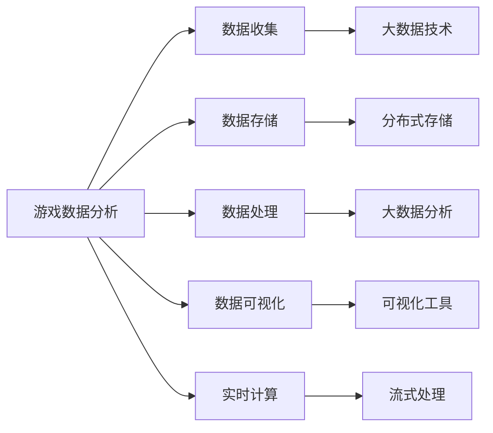

                 

# 基于大数据的游戏数据分析系统的设计与实现

## 1. 背景介绍

### 1.1 问题由来
随着电子游戏产业的蓬勃发展，越来越多的游戏公司开始重视游戏数据分析。通过游戏数据分析，公司可以深入了解游戏玩家的行为习惯，优化游戏设计，提升用户体验，同时还能精准定位市场机会，制定有效的营销策略。然而，传统的游戏数据分析方法往往依赖于人工分析和有限的样本数据，无法全面、实时地把握海量用户行为数据。

## 1.2 问题核心关键点
为了解决这一问题，需要构建一个基于大数据的游戏数据分析系统。该系统能够自动收集、存储、处理和分析游戏中的大量数据，提供全面、及时、准确的游戏行为分析报告，助力游戏公司做出数据驱动的决策。

核心关键点包括：
- 高效的数据收集与存储
- 复杂的数据处理与分析
- 可定制的数据可视化
- 强大的数据交互能力

## 1.3 问题研究意义
构建一个基于大数据的游戏数据分析系统，对于游戏公司的发展具有重要意义：

1. 提升游戏质量。通过实时监测和分析玩家行为，游戏公司可以迅速发现问题并加以改进，提升游戏用户体验。
2. 优化游戏设计。数据驱动的设计能够精准地满足玩家需求，减少试错成本，提高游戏市场竞争力。
3. 精准营销。基于玩家行为数据，游戏公司可以开展个性化营销活动，提升广告效果，提高用户转化率。
4. 发掘市场机会。通过数据分析，游戏公司可以深入了解市场趋势和玩家偏好，提前布局，抢占市场先机。
5. 支持决策。数据支持的游戏决策更加客观、精准，能够提高公司运营效率和盈利能力。

## 2. 核心概念与联系

### 2.1 核心概念概述

为更好地理解基于大数据的游戏数据分析系统，本节将介绍几个密切相关的核心概念：

- 游戏数据分析（Game Analytics）：通过收集、处理和分析游戏中的用户行为数据，洞察游戏运营状况、玩家需求和市场趋势。
- 大数据（Big Data）：指海量的、多样化的、快速变化的数据，需要先进的技术手段进行处理和分析。
- 数据挖掘（Data Mining）：从大量数据中发现隐藏的模式、规律和知识，支持数据驱动的决策。
- 数据可视化（Data Visualization）：通过图表、仪表盘等形式，将复杂的数据信息直观展示出来，支持快速、准确的数据理解。
- 实时计算（Real-time Computing）：能够对实时数据进行快速处理和分析，支持实时决策。

这些概念之间紧密联系，构成了大数据游戏数据分析系统的核心框架。

### 2.2 概念间的关系

这些核心概念之间的逻辑关系可以通过以下Mermaid流程图来展示：



这个流程图展示了数据收集、存储、处理、可视化、实时计算各个环节之间的联系：

1. 数据收集依赖于大数据技术，将游戏玩家的行为数据高效收集起来。
2. 数据存储使用分布式存储技术，确保海量数据的可靠性和可扩展性。
3. 数据处理利用大数据分析工具，挖掘出有价值的模式和规律。
4. 数据可视化通过可视化工具，将分析结果直观展示出来，支持快速理解。
5. 实时计算通过流式处理技术，对实时数据进行快速分析，支持实时决策。

## 3. 核心算法原理 & 具体操作步骤
### 3.1 算法原理概述

基于大数据的游戏数据分析系统，本质上是一个数据处理和分析的流程。其核心思想是：利用分布式存储和大数据分析技术，对游戏中的海量数据进行高效处理和分析，提取出有用的信息，支持决策。

具体而言，系统通过以下步骤实现数据分析：

1. 数据收集：通过日志、配置文件、API接口等途径收集游戏数据。
2. 数据存储：将收集到的数据存储到分布式存储系统中，如Hadoop、Spark等。
3. 数据处理：利用大数据分析工具，对存储的数据进行数据清洗、特征提取、模型训练等操作。
4. 数据分析：通过数据分析工具，对处理后的数据进行统计、挖掘、可视化等操作，得出有用的结论和洞察。
5. 数据交互：将分析结果展示给数据分析师、开发者、运营团队等，支持决策和优化。

### 3.2 算法步骤详解

基于大数据的游戏数据分析系统，其操作步骤可以分为以下几个关键环节：

**Step 1: 数据收集与预处理**
- 利用游戏客户端、服务端日志等手段收集游戏数据。
- 对收集到的数据进行清洗和预处理，去除无效或异常数据，确保数据质量。

**Step 2: 数据存储与分布式存储**
- 将清洗后的数据存储到分布式存储系统中，如Hadoop、Spark等。
- 利用分布式文件系统进行数据分片，确保数据可靠性和可扩展性。

**Step 3: 数据处理与大数据分析**
- 利用大数据分析工具，对存储的数据进行特征提取、数据变换等操作。
- 对处理后的数据进行统计分析、机器学习模型训练等操作，得出有用的结论。

**Step 4: 数据分析与数据可视化**
- 利用数据分析工具，对模型结果进行统计分析和数据挖掘。
- 通过可视化工具，将分析结果展示为图表、仪表盘等形式，支持快速理解。

**Step 5: 数据交互与决策支持**
- 将分析结果输出给数据分析师、开发者、运营团队等，支持数据驱动的决策。
- 利用数据仪表盘、报告生成等工具，提供数据交互接口，支持实时决策。

### 3.3 算法优缺点

基于大数据的游戏数据分析系统，具有以下优点：

1. 处理能力强大。通过分布式存储和大数据分析技术，系统能够高效处理海量数据，支持大规模数据分析需求。
2. 实时性高。利用流式处理技术，系统可以对实时数据进行快速分析，支持实时决策。
3. 数据可视化效果好。通过可视化工具，数据结果以直观的形式展示，支持快速理解和分析。
4. 数据交互能力强。系统支持多种数据交互接口，方便数据共享和协作。

同时，该系统也存在一定的局限性：

1. 开发复杂。系统涉及多种技术和工具，开发难度较大，需要较强的技术背景。
2. 数据隐私问题。游戏中的用户数据涉及隐私保护，系统需要采用安全措施保护数据安全。
3. 数据质量问题。数据的清洗和预处理是系统的重要环节，数据质量直接影响分析结果的准确性。

尽管存在这些局限性，但就目前而言，基于大数据的游戏数据分析系统仍然是游戏公司进行数据驱动决策的重要手段。未来相关研究的重点在于如何进一步降低开发复杂度，提高数据质量，同时兼顾数据隐私保护，从而实现更高效、可靠、安全的游戏数据分析。

### 3.4 算法应用领域

基于大数据的游戏数据分析系统，已经广泛应用于游戏公司，助力游戏业务的发展。其具体应用领域包括：

1. 玩家行为分析：通过分析玩家行为数据，了解玩家兴趣和需求，优化游戏设计。
2. 游戏平衡调整：通过数据分析，发现游戏平衡问题，及时调整游戏规则和参数。
3. 市场趋势分析：通过分析市场数据，洞察市场趋势和玩家偏好，制定精准的营销策略。
4. 用户留存分析：通过分析用户行为数据，预测用户流失风险，制定有效的留存策略。
5. 个性化推荐：通过分析用户行为数据，提供个性化推荐，提升用户体验。

除了上述这些经典应用外，游戏数据分析系统还被创新性地应用到更多场景中，如ARPG游戏热度分析、MMORPG玩家社交网络分析等，为游戏技术的发展提供了新的思路。

## 4. 数学模型和公式 & 详细讲解 & 举例说明
### 4.1 数学模型构建

基于大数据的游戏数据分析系统，可以构建以下数学模型：

假设收集到的游戏数据为 $D=\{x_1, x_2, ..., x_n\}$，其中 $x_i$ 表示第 $i$ 个数据样本。游戏数据分析的目标是：通过数据处理和分析，提取出有用的信息 $Y=\{y_1, y_2, ..., y_n\}$，其中 $y_i$ 表示第 $i$ 个样本的输出结果。

定义数据预处理函数为 $f(x_i)$，数据存储函数为 $g(x_i)$，大数据分析函数为 $h(x_i)$，数据分析函数为 $i(x_i)$，数据交互函数为 $j(x_i)$。

基于上述定义，可以构建以下数学模型：

$$
Y = f(D) + g(D) + h(D) + i(D) + j(D)
$$

其中 $+$ 表示函数执行顺序。

### 4.2 公式推导过程

以下我们以玩家行为分析为例，推导数学模型中的数据分析部分。

假设收集到的玩家行为数据为 $D=\{(x_i, y_i)\}_{i=1}^N$，其中 $x_i$ 表示第 $i$ 个玩家的半个小时内游戏数据，$y_i$ 表示玩家的兴趣类型（如战斗、角色、装备等）。

定义数据分析模型为 $M(x_i, y_i) = \sum_{i=1}^N w_{ij} \cdot (x_i, y_i)$，其中 $w_{ij}$ 表示样本 $i$ 对模型 $j$ 的权重。

通过数据分析工具，对数据集 $D$ 进行统计分析，得到各个玩家的兴趣分布，从而构建兴趣类型和游戏行为之间的关系模型。

具体而言，数据分析步骤如下：

1. 数据清洗：去除无效或异常数据，确保数据质量。
2. 特征提取：从游戏数据中提取有用特征，如游戏时间、装备等级等。
3. 数据变换：对提取的特征进行标准化、归一化等处理。
4. 模型训练：利用机器学习算法（如随机森林、梯度提升等），对数据集进行模型训练，得出兴趣类型和游戏行为之间的关系模型。
5. 数据分析：对模型结果进行统计分析和数据挖掘，得出有用的结论和洞察。

### 4.3 案例分析与讲解

假设我们正在进行一款MMORPG游戏的玩家行为分析，通过数据分析发现大部分玩家对战斗类任务和角色类任务感兴趣，对装备类任务兴趣较低。于是，游戏公司可以调整游戏设计，增加战斗和角色类任务的数量，优化装备类任务的设计，从而提高玩家的游戏体验和留存率。

## 5. 项目实践：代码实例和详细解释说明
### 5.1 开发环境搭建

在进行游戏数据分析项目实践前，我们需要准备好开发环境。以下是使用Python进行Spark开发的开发环境配置流程：

1. 安装Anaconda：从官网下载并安装Anaconda，用于创建独立的Python环境。

2. 创建并激活虚拟环境：
```bash
conda create -n spark-env python=3.8 
conda activate spark-env
```

3. 安装Spark：根据CUDA版本，从官网获取对应的安装命令。例如：
```bash
conda install spark=3.1.2 cudatoolkit=11.1 -c conda-forge
```

4. 安装PySpark：
```bash
pip install pyspark
```

5. 安装Spark UI和Standalone模式：
```bash
spark-submit --master local[2] --class com.mycompany.MainClass --driver-class-name org.apache.spark.driver.MainEntryPoint --py-files /path/to/pyspark_files.py /path/to/app.py
```

完成上述步骤后，即可在`spark-env`环境中开始游戏数据分析项目实践。

### 5.2 源代码详细实现

这里我们以玩家行为分析为例，给出使用Spark进行大数据分析的Python代码实现。

首先，定义数据清洗和预处理函数：

```python
from pyspark.sql import SparkSession
from pyspark.sql.functions import col, select, drop_duplicates, limit

def data_clean_and_preprocess(spark, data_file):
    spark.read.csv(data_file) \
        .drop_duplicates('user_id') \
        .dropna() \
        .select('user_id', 'game_time', 'equipment_level', 'interest_type') \
        .limit(10000) \
        .write.csv('cleaned_data.csv')
```

然后，定义数据分析和模型训练函数：

```python
from pyspark.sql.functions import col, split, explode, max, avg
from pyspark.ml.feature import VectorAssembler
from pyspark.ml.classification import RandomForestClassifier
from pyspark.ml.evaluation import MultiClassEvaluator

def data_analysis_and_model_training(spark, cleaned_data_file):
    spark.read.csv(cleaned_data_file) \
        .select(col('user_id'), split(col('interest_type'), ',').explode().alias('interest_types')) \
        .drop_duplicates('user_id', 'interest_types') \
        .select('user_id', 'interest_types') \
        .groupBy('user_id') \
        .agg([max('game_time').alias('max_game_time'), avg('equipment_level').alias('avg_equipment_level'), count().alias('count')]) \
        .show(truncate=False)

    assembler = VectorAssembler(inputCols=['max_game_time', 'avg_equipment_level', 'count'], outputCol='features')
    df = spark.read.csv(cleaned_data_file)
    df = assembler.transform(df)
    features = df.select('features')
    features.show(truncate=False)

    model = RandomForestClassifier(featuresCol='features', labelCol='interest_type', numTrees=10)
    model.fit(features, df.select('interest_type'))
    predictions = model.transform(features)
    predictions.select('predicted_interest_type').groupBy('user_id').agg(['count', 'max', 'avg']).show(truncate=False)
```

最后，启动数据分析流程并在Spark UI上查看结果：

```python
spark = SparkSession.builder.appName('GameAnalytics').getOrCreate()

# 数据收集
spark.read.csv('game_data.csv').limit(1000).show()

# 数据清洗和预处理
data_clean_and_preprocess(spark, 'game_data.csv')

# 数据分析和模型训练
data_analysis_and_model_training(spark, 'cleaned_data.csv')

# 停止SparkSession
spark.stop()
```

以上就是使用Spark进行大数据游戏数据分析的完整代码实现。可以看到，通过Spark，我们可以高效地处理大规模数据，进行数据清洗、数据分析和模型训练，分析出有用的玩家行为信息。

### 5.3 代码解读与分析

让我们再详细解读一下关键代码的实现细节：

**data_clean_and_preprocess函数**：
- 定义了数据清洗和预处理的功能，包括去除重复数据、删除缺失值、提取关键特征等操作。

**data_analysis_and_model_training函数**：
- 首先对清洗后的数据进行统计分析，使用groupBy和agg函数计算玩家的游戏时间和装备等级，统计玩家行为分布。
- 然后通过VectorAssembler将特征列转换成向量，用于后续模型训练。
- 最后使用RandomForestClassifier对特征数据进行分类训练，输出预测结果。

**SparkSession和DataFrame API**：
- 使用SparkSession和DataFrame API，可以方便地进行数据操作，如数据读取、数据清洗、数据聚合、数据可视化等。

**可视化展示**：
- 利用Spark UI可以查看数据分析和模型训练的结果，包括数据分布、模型评估指标等。

**启动和停止SparkSession**：
- 启动SparkSession，配置应用程序，执行数据操作。
- 使用spark.stop()方法停止SparkSession，释放资源。

## 6. 实际应用场景
### 6.1 智能客服

基于大数据的游戏数据分析系统，可以应用于智能客服的建设。通过分析游戏玩家的行为数据，客服系统可以更加精准地识别玩家的需求和问题，提供个性化的解答和建议，提升用户体验和满意度。

例如，当玩家在游戏中遇到问题时，客服系统可以及时响应，提供精确的解答和帮助，加速玩家问题的解决。同时，系统可以根据玩家的行为数据，预测玩家可能遇到的问题类型，提前做好应对措施，提升客服效率。

### 6.2 游戏内容优化

通过分析玩家行为数据，游戏公司可以更好地了解玩家的需求和兴趣，优化游戏内容，提升玩家的游戏体验。

例如，对于战斗类任务和角色类任务，可以加大投入，提高任务难度和丰富度，满足玩家对战斗和角色的需求。对于装备类任务，可以优化任务设计，增加任务奖励，提高玩家对装备的兴趣。

### 6.3 用户留存策略

游戏公司可以通过分析玩家行为数据，预测玩家流失风险，制定有效的用户留存策略，提升玩家留存率。

例如，根据玩家的游戏时间和行为，分析玩家流失的常见原因，制定相应的留存措施，如奖励活动、任务提示等，帮助玩家更好地融入游戏，减少流失率。

### 6.4 游戏设计优化

游戏公司可以借助游戏数据分析系统，及时调整游戏设计，提升游戏质量和市场竞争力。

例如，通过分析玩家行为数据，识别游戏设计中的问题和不足，及时调整游戏规则和参数，提升游戏平衡性、可玩性和趣味性。

### 6.5 广告投放优化

游戏公司可以通过分析玩家行为数据，优化广告投放策略，提高广告效果和用户转化率。

例如，根据玩家的游戏行为和兴趣，推送精准的广告内容，提升广告的点击率和转化率，降低广告投放成本。

### 6.6 市场趋势分析

游戏公司可以通过分析市场数据和玩家行为数据，洞察市场趋势和玩家偏好，制定精准的市场策略。

例如，根据玩家的行为数据，分析游戏市场的流行趋势，预测未来的游戏方向和需求，提前布局，抢占市场先机。

## 7. 工具和资源推荐
### 7.1 学习资源推荐

为了帮助开发者系统掌握大数据游戏数据分析的理论基础和实践技巧，这里推荐一些优质的学习资源：

1. 《Spark机器学习实战》书籍：全面介绍了Spark在机器学习中的应用，从基础到高级，适合初学者和进阶者学习。

2. 《Hadoop分布式系统基础》课程：斯坦福大学开设的Hadoop课程，讲解Hadoop的基本原理和编程方法。

3. 《大数据时代》书籍：讲述大数据技术的基本概念和应用场景，适合入门学习。

4. 《Spark大数据分析实战》书籍：介绍了Spark在数据处理和分析中的应用，包括流式处理、实时分析等。

5. 《数据挖掘与统计学习基础》课程：Johns Hopkins大学的Coursera课程，讲解数据挖掘和机器学习的基本方法和应用。

6. 《Python数据科学手册》书籍：介绍了Python在数据处理、分析和可视化中的应用，适合数据科学初学者。

通过对这些资源的学习实践，相信你一定能够快速掌握大数据游戏数据分析的精髓，并用于解决实际的游戏问题。

### 7.2 开发工具推荐

高效的开发离不开优秀的工具支持。以下是几款用于大数据游戏数据分析开发的常用工具：

1. PySpark：Python的Spark接口，提供了丰富的数据处理和分析功能，适合Python开发者使用。

2. Spark UI：Spark的可视化界面，提供了数据流、任务执行、性能监控等功能，方便数据分析师进行数据分析。

3. Jupyter Notebook：Python的交互式编程环境，支持代码编写、数据展示和模型训练等功能，适合快速原型开发。

4. Apache Hadoop：分布式存储和计算框架，支持海量数据的存储和处理，适合大数据应用。

5. Apache Spark：分布式计算框架，支持流式处理、机器学习、数据挖掘等功能，适合大数据应用。

6. Apache Hive：基于Hadoop的SQL查询引擎，支持数据存储和查询，适合数据仓库应用。

合理利用这些工具，可以显著提升大数据游戏数据分析任务的开发效率，加快创新迭代的步伐。

### 7.3 相关论文推荐

大数据游戏数据分析技术的发展源于学界的持续研究。以下是几篇奠基性的相关论文，推荐阅读：

1. "Spark: Cluster Computing with Fault Tolerance"：Spark的论文，介绍了Spark的基本原理和编程方法。

2. "Hadoop: A Distributed File System"：Hadoop的论文，讲解了Hadoop的基本原理和架构。

3. "MapReduce: Simplified Data Processing on Large Clusters"：MapReduce的论文，讲解了MapReduce的基本原理和编程方法。

4. "Big Data: Principles and Best Practices of Scalable Real-time Data Systems"：Big Data的书籍，介绍了大数据的基本概念和应用场景。

5. "Data Mining and Statistical Learning"：数据挖掘和机器学习的经典教材，讲解了数据挖掘和机器学习的基本方法和应用。

6. "Graph Mining: Data Mining with Graphs"：Graph Mining的书籍，讲解了图数据的基本概念和应用场景。

这些论文代表了大数据游戏数据分析技术的发展脉络。通过学习这些前沿成果，可以帮助研究者把握学科前进方向，激发更多的创新灵感。

除上述资源外，还有一些值得关注的前沿资源，帮助开发者紧跟大数据游戏数据分析技术的最新进展，例如：

1. arXiv论文预印本：人工智能领域最新研究成果的发布平台，包括大量尚未发表的前沿工作，学习前沿技术的必读资源。

2. 业界技术博客：如Spark、Hadoop、MapReduce等顶尖实验室的官方博客，第一时间分享他们的最新研究成果和洞见。

3. 技术会议直播：如Spark Summit、Hadoop Summit、KDD等人工智能领域顶会现场或在线直播，能够聆听到大佬们的前沿分享，开拓视野。

4. GitHub热门项目：在GitHub上Star、Fork数最多的Spark、Hadoop相关项目，往往代表了该技术领域的发展趋势和最佳实践，值得去学习和贡献。

5. 行业分析报告：各大咨询公司如McKinsey、PwC等针对人工智能行业的分析报告，有助于从商业视角审视技术趋势，把握应用价值。

总之，对于大数据游戏数据分析技术的学习和实践，需要开发者保持开放的心态和持续学习的意愿。多关注前沿资讯，多动手实践，多思考总结，必将收获满满的成长收益。

## 8. 总结：未来发展趋势与挑战

### 8.1 总结

本文对基于大数据的游戏数据分析系统进行了全面系统的介绍。首先阐述了游戏数据分析的基本概念和研究背景，明确了系统在提升游戏质量、优化游戏设计、支持数据驱动决策等方面的重要意义。其次，从原理到实践，详细讲解了系统的数据收集、存储、处理、分析和可视化等关键环节，提供了代码实例和详细解释说明。同时，本文还广泛探讨了系统在智能客服、游戏内容优化、用户留存策略、广告投放优化、市场趋势分析等多个行业领域的应用前景，展示了系统的广阔应用空间。

通过本文的系统梳理，可以看到，基于大数据的游戏数据分析系统正在成为游戏公司进行数据驱动决策的重要手段。得益于分布式存储和大数据分析技术，系统能够高效处理海量数据，提取有用的信息，支持决策。未来，伴随技术的不断演进和优化，系统必将在更多领域得到应用，为游戏技术的发展注入新的活力。

### 8.2 未来发展趋势

展望未来，大数据游戏数据分析系统将呈现以下几个发展趋势：

1. 数据处理能力不断增强。随着硬件技术的发展和算法优化，系统将能够处理更海量的数据，提供更准确、更实时的分析结果。

2. 数据交互界面更加友好。系统将提供更灵活、更直观的数据交互界面，方便数据分析师、开发者、运营团队等快速进行数据分析和可视化。

3. 机器学习算法不断优化。利用机器学习算法，系统将能够提取更复杂、更深层次的特征，提高数据分析的准确性和预测能力。

4. 实时分析能力不断提升。利用流式处理和实时计算技术，系统将能够对实时数据进行快速处理和分析，支持实时决策。

5. 多模态数据分析能力不断增强。系统将能够处理图像、视频、音频等多模态数据，提升数据的完整性和多样性。

6. 数据隐私保护不断加强。随着数据隐私法规的不断完善，系统将采用更强的数据隐私保护措施，确保用户数据的安全和隐私。

7. 自动化水平不断提高。利用自动化技术，系统将能够自动进行数据清洗、特征提取、模型训练等操作，减少人工干预，提高工作效率。

以上趋势凸显了大数据游戏数据分析系统的广阔前景。这些方向的探索发展，必将进一步提升系统的性能和应用范围，为游戏技术的发展注入新的动力。

### 8.3 面临的挑战

尽管大数据游戏数据分析系统已经取得了显著成果，但在迈向更加智能化、普适化应用的过程中，它仍面临着诸多挑战：

1. 数据隐私保护。游戏中的用户数据涉及隐私保护，系统需要采用安全措施保护数据安全。

2. 数据质量问题。数据的清洗和预处理是系统的重要环节，数据质量直接影响分析结果的准确性。

3. 数据存储和计算资源。海量数据存储和计算资源的需求，对系统架构和计算能力提出了高要求。

4. 实时分析效率。对实时数据进行快速处理和分析，需要优化算法和系统架构，提高计算效率。

5. 数据交互界面。数据交互界面需要更加灵活和直观，方便数据共享和协作。

6. 自动化水平。系统需要自动化技术支持，减少人工干预，提高工作效率。

尽管存在这些挑战，但随着技术的不断演进和优化，这些挑战终将逐一被克服，大数据游戏数据分析系统必将在游戏公司的发展中发挥更大的作用。

### 8.4 研究展望

面对大数据游戏数据分析系统面临的诸多挑战，未来的研究需要在以下几个方面寻求新的突破：

1. 研究高效的数据处理算法和优化技术，提升系统的处理能力和实时性。

2. 开发更加友好的数据交互界面，支持更灵活的数据展示和分析。

3. 引入机器学习算法，提升数据挖掘的准确性和深度。

4. 引入自动化技术，减少人工干预，提高工作效率。

5. 加强数据隐私保护措施，确保用户数据的安全和隐私。

6. 探索多模态数据分析方法，提升数据的完整性和多样性。

这些

