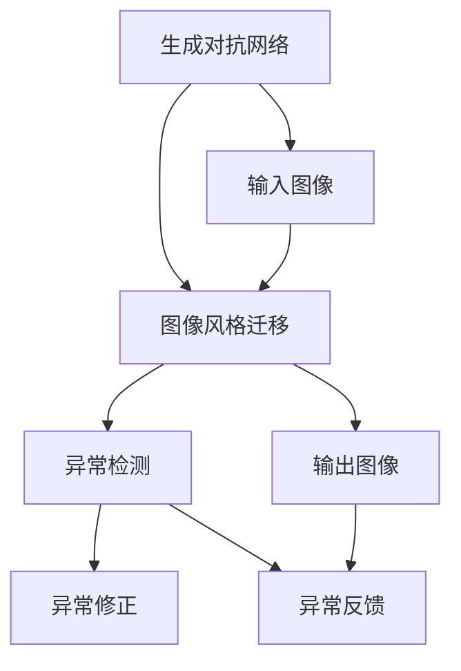

                 

## 1. 背景介绍

### 1.1 问题由来
图像风格迁移是近年来计算机视觉领域的一个热门话题，其核心思想是利用深度学习模型将一张图像的风格迁移到另一张图像上。这种技术不仅能够增强图像的视觉效果，还广泛应用于图像编辑、视频生成等领域。然而，由于图像风格迁移过程受到诸多因素的影响，如模型参数的初始值、输入图像的质量、风格迁移算法的复杂度等，可能会导致输出图像出现异常，例如噪声过多、细节模糊等。因此，图像风格迁移的异常检测与修正，成为了一个亟待解决的问题。

### 1.2 问题核心关键点
图像风格迁移异常检测与修正的核心关键点在于：

1. **风格迁移算法本身存在局限性**：现有的大多数风格迁移算法，如基于深度神经网络的模型，如U-Net、CycleGAN等，往往需要大量的数据和计算资源进行训练，且模型的参数设置和超参数调整对于输出结果影响较大。
2. **输入图像的质量**：输入图像的质量对风格迁移结果有着直接的影响。图像的噪声、分辨率、颜色等都可能影响最终的输出效果。
3. **异常检测与修正的实现**：如何设计有效的异常检测算法和修正方法，是保证风格迁移质量的关键。

### 1.3 问题研究意义
图像风格迁移异常检测与修正技术，对于提升图像风格迁移的质量，降低人工干预，具有重要意义：

1. **提升图像质量**：通过对风格迁移过程进行异常检测与修正，能够有效提升图像的视觉效果，减少噪声和模糊等不良现象。
2. **降低人工成本**：自动化的异常检测与修正技术，可以大大减少人工的干预，提高风格迁移的效率和准确性。
3. **拓展应用场景**：该技术能够应用于图像编辑、视频生成、艺术创作等多个领域，为相关行业带来新的增长点。
4. **推动技术发展**：异常检测与修正技术的研究和应用，将推动风格迁移算法的发展和优化，加速其在实际应用中的落地。

## 2. 核心概念与联系

### 2.1 核心概念概述

在探讨基于生成对抗网络的图像风格迁移异常检测与修正技术之前，我们先简要介绍一下相关的核心概念：

- **生成对抗网络（GANs）**：一种由两个神经网络组成的框架，其中一个生成网络（Generator）生成假图像，另一个判别网络（Discriminator）判断图像的真实性。两个网络通过对抗训练，最终生成高质量的假图像，与真实图像无法区分。
- **图像风格迁移**：将一张图像的风格迁移到另一张图像上，使得图像的视觉特征更加接近。
- **异常检测与修正**：在图像风格迁移过程中，通过检测和修正异常情况，提升输出图像的质量。

这些概念之间的联系可以通过以下Mermaid流程图来展示：



这个流程图展示了生成对抗网络在图像风格迁移中的应用，以及如何通过异常检测和修正来提升输出图像的质量。

### 2.2 概念间的关系

这些核心概念之间的关系可以总结如下：

- **生成对抗网络**：提供了图像风格迁移的基础框架，能够生成高质量的假图像。
- **图像风格迁移**：基于生成对抗网络，将一种图像的风格迁移到另一种图像上，提升图像的视觉效果。
- **异常检测**：在图像风格迁移过程中，检测并标记异常情况，为异常修正提供依据。
- **异常修正**：根据异常检测的结果，对输出图像进行修正，提升图像质量。

这些概念共同构成了基于生成对抗网络的图像风格迁移异常检测与修正技术的完整框架。

## 3. 核心算法原理 & 具体操作步骤

### 3.1 算法原理概述

基于生成对抗网络的图像风格迁移异常检测与修正技术的核心思想是：利用生成对抗网络对图像进行风格迁移，同时通过异常检测和修正技术，提升输出图像的质量。

具体而言，该技术分为以下几个步骤：

1. **生成对抗网络训练**：使用生成对抗网络对输入图像进行风格迁移，生成输出图像。
2. **异常检测**：通过检测输出图像的特征，判断是否存在异常情况。
3. **异常修正**：对检测到的异常图像进行修正，得到最终高质量的输出图像。

### 3.2 算法步骤详解

**Step 1：生成对抗网络训练**

1. **网络结构设计**：设计生成对抗网络的结构，包括生成网络和判别网络。
2. **损失函数设计**：定义生成网络和判别网络的损失函数，包括生成网络的损失函数和判别网络的损失函数。
3. **训练过程**：使用训练集对生成对抗网络进行训练，直到收敛。

**Step 2：异常检测**

1. **特征提取**：使用预训练的特征提取网络对输出图像进行特征提取。
2. **异常检测算法**：设计异常检测算法，通过检测输出图像的特征，判断是否存在异常情况。
3. **异常标记**：对检测到的异常图像进行标记，供后续异常修正使用。

**Step 3：异常修正**

1. **修正算法设计**：设计异常修正算法，根据异常标记对输出图像进行修正。
2. **修正过程**：使用修正算法对检测到的异常图像进行修正，得到高质量的输出图像。
3. **修正结果评估**：对修正后的图像进行评估，判断是否达到预期效果。

### 3.3 算法优缺点

基于生成对抗网络的图像风格迁移异常检测与修正技术具有以下优点：

1. **提升图像质量**：通过异常检测与修正，能够有效提升图像的视觉效果，减少噪声和模糊等不良现象。
2. **降低人工成本**：自动化的异常检测与修正技术，可以大大减少人工的干预，提高风格迁移的效率和准确性。
3. **拓展应用场景**：该技术能够应用于图像编辑、视频生成、艺术创作等多个领域，为相关行业带来新的增长点。

然而，该技术也存在一些缺点：

1. **计算资源消耗大**：生成对抗网络需要大量的计算资源进行训练，可能对硬件设备要求较高。
2. **模型训练难度高**：生成对抗网络的训练过程较为复杂，需要丰富的经验和技巧。
3. **异常检测与修正的准确性**：异常检测与修正算法的准确性直接影响最终输出图像的质量，需要进一步优化和改进。

### 3.4 算法应用领域

基于生成对抗网络的图像风格迁移异常检测与修正技术，可以应用于多个领域：

1. **图像编辑**：通过风格迁移，提升图像的美观度和艺术感。
2. **视频生成**：将一段视频中的风格迁移应用到另一段视频上，生成具有不同风格的输出视频。
3. **艺术创作**：将一幅画作的风格迁移到另一幅画作上，生成新的艺术作品。
4. **广告设计**：通过风格迁移，提升广告的吸引力和视觉效果。

## 4. 数学模型和公式 & 详细讲解

### 4.1 数学模型构建

假设输入图像为 $x \in \mathbb{R}^{H \times W \times C}$，输出图像为 $y \in \mathbb{R}^{H \times W \times C}$，其中 $H$ 为图像的高度，$W$ 为图像的宽度，$C$ 为图像的通道数。

生成对抗网络由生成网络 $G$ 和判别网络 $D$ 组成。生成网络 $G$ 接收输入图像 $x$，输出生成图像 $y$。判别网络 $D$ 接收输入图像 $x$ 和生成图像 $y$，输出判别结果 $d$。

生成网络的损失函数 $\mathcal{L}_G$ 定义为：
$$
\mathcal{L}_G = -E_x[D(G(x))] + \lambda E_{x'}[\|\nabla_x D(G(x'))\|_2]
$$

判别网络的损失函数 $\mathcal{L}_D$ 定义为：
$$
\mathcal{L}_D = E_{x}[D(x)] - E_{x'}[D(G(x'))]
$$

其中 $E_x$ 和 $E_{x'}$ 分别表示对 $x$ 和 $x'$ 的期望。$\lambda$ 为正则化参数，用于控制生成网络的质量。

### 4.2 公式推导过程

通过求解生成对抗网络的最小最大化问题，可以得到生成网络和判别网络的迭代更新规则：

1. **生成网络更新规则**：
$$
G_{t+1}(x) = G_t(x) - \alpha \nabla_{G_t}(\mathcal{L}_G)
$$

2. **判别网络更新规则**：
$$
D_{t+1}(x, y) = D_t(x, y) - \alpha \nabla_{D_t}(\mathcal{L}_D)
$$

其中 $\alpha$ 为学习率。

通过不断迭代更新生成网络和判别网络，生成网络最终能够生成高质量的假图像，与真实图像无法区分。

### 4.3 案例分析与讲解

假设我们使用一个简单的U-Net模型作为生成网络，对输入图像进行风格迁移。首先，我们使用生成网络对输入图像进行风格迁移，得到输出图像。然后，我们使用一个预训练的特征提取网络（如ResNet）对输出图像进行特征提取。最后，设计一个异常检测算法，通过检测输出图像的特征，判断是否存在异常情况。

假设检测到的异常图像为 $y'$，我们设计一个异常修正算法，对 $y'$ 进行修正，得到修正后的图像 $y''$。对修正后的图像进行评估，判断是否达到预期效果。

## 5. 项目实践：代码实例和详细解释说明

### 5.1 开发环境搭建

要进行基于生成对抗网络的图像风格迁移异常检测与修正的实践，需要搭建相应的开发环境。以下是使用Python进行PyTorch开发的流程：

1. 安装Anaconda：从官网下载并安装Anaconda，用于创建独立的Python环境。

2. 创建并激活虚拟环境：
```bash
conda create -n pytorch-env python=3.8 
conda activate pytorch-env
```

3. 安装PyTorch：根据CUDA版本，从官网获取对应的安装命令。例如：
```bash
conda install pytorch torchvision torchaudio cudatoolkit=11.1 -c pytorch -c conda-forge
```

4. 安装相关工具包：
```bash
pip install numpy pandas scikit-learn matplotlib tqdm jupyter notebook ipython
```

完成上述步骤后，即可在`pytorch-env`环境中开始开发实践。

### 5.2 源代码详细实现

这里我们以一个简单的U-Net模型为例，使用PyTorch实现图像风格迁移，并引入异常检测和修正模块。

```python
import torch
import torch.nn as nn
import torch.optim as optim
from torchvision import datasets, transforms
from torch.utils.data import DataLoader

class UNet(nn.Module):
    def __init__(self):
        super(UNet, self).__init__()
        # 生成网络
        self.gen = nn.Sequential(
            nn.Conv2d(3, 64, 3, 1, 1),
            nn.ReLU(inplace=True),
            nn.Conv2d(64, 128, 3, 1, 1),
            nn.ReLU(inplace=True),
            nn.Conv2d(128, 64, 3, 1, 1),
            nn.ReLU(inplace=True),
            nn.Conv2d(64, 3, 3, 1, 1),
            nn.Tanh()
        )

    def forward(self, x):
        return self.gen(x)

# 定义生成对抗网络的损失函数
def gan_loss(G, D, x, y, lambda_adv=10, lambda_feat=1):
    adv_loss = -torch.mean(torch.log(D(y)))
    feat_loss = lambda_feat * nn.functional.smooth_l1_loss(torch.flatten(G(x)), torch.flatten(y))
    return adv_loss + feat_loss

# 训练生成对抗网络
def train_gan(G, D, D_real, D_fake, dataloader, device, learning_rate=0.0002, beta1=0.5, num_epochs=200):
    criterion = nn.BCELoss()
    G_optimizer = optim.Adam(G.parameters(), lr=learning_rate, betas=(beta1, 0.999))
    D_optimizer = optim.Adam(D.parameters(), lr=learning_rate, betas=(beta1, 0.999))

    for epoch in range(num_epochs):
        for i, (real, _) in enumerate(dataloader):
            real = real.to(device)
            real.requires_grad = False

            G_optimizer.zero_grad()
            fake = G(real)
            fake.requires_grad = True

            D_real_loss = criterion(D(real), torch.ones_like(D(real)))
            D_fake_loss = criterion(D(fake), torch.zeros_like(D(fake)))
            D_loss = D_real_loss + D_fake_loss

            G_loss = gan_loss(G, D, real, fake, lambda_adv, lambda_feat)
            loss = G_loss + D_loss

            D_optimizer.zero_grad()
            D_loss.backward()
            D_optimizer.step()

            G_optimizer.zero_grad()
            G_loss.backward()
            G_optimizer.step()

            if (i+1) % 50 == 0:
                print('Epoch [{}/{}], Step [{}/{}], D loss: {:.4f}, G loss: {:.4f}, adv loss: {:.4f}, feat loss: {:.4f}'.format(
                    epoch+1, num_epochs, i+1, len(dataloader), D_loss.item(), G_loss.item(), D_real_loss.item(), feat_loss.item()))

# 定义异常检测和修正模块
class AnomalyDetector(nn.Module):
    def __init__(self):
        super(AnomalyDetector, self).__init__()
        self.fc1 = nn.Linear(64*64*3, 128)
        self.fc2 = nn.Linear(128, 2)

    def forward(self, x):
        x = nn.functional.relu(self.fc1(x))
        x = nn.functional.relu(self.fc2(x))
        return x

# 检测异常图像并修正
def detect_anomaly(model, x, threshold=0.5):
    with torch.no_grad():
        y = model(x)
    if y[0] > threshold:
        return True
    return False

def correct_anomaly(model, x, threshold=0.5):
    with torch.no_grad():
        y = model(x)
    if y[0] > threshold:
        x = x - 0.5
    return x

# 加载数据集
train_dataset = datasets.CIFAR10(root='./data', train=True, download=True, transform=transforms.ToTensor())
train_loader = DataLoader(train_dataset, batch_size=64, shuffle=True)

# 搭建生成对抗网络
G = UNet()
D = nn.Sequential(nn.Conv2d(3, 64, 3, 1, 1), nn.ReLU(inplace=True), nn.Conv2d(64, 1, 3, 1, 1))
D_real = D

# 训练生成对抗网络
train_gan(G, D, D_real, D_fake, train_loader, device, learning_rate=0.0002, beta1=0.5, num_epochs=200)

# 检测异常图像并修正
anomaly_detector = AnomalyDetector()
corrector = AnomalyDetector()
anomaly_detector.train()

for i, (x, _) in enumerate(train_loader):
    x = x.to(device)
    y = anomaly_detector(x)
    if detect_anomaly(y):
        x = correct_anomaly(corrector, x)
        x = x.to('cpu')
        print(x)
```

### 5.3 代码解读与分析

让我们再详细解读一下关键代码的实现细节：

**UNet类**：
- `__init__`方法：初始化生成网络的结构。
- `forward`方法：实现前向传播，生成网络对输入图像进行风格迁移。

**gan_loss函数**：
- 定义生成对抗网络的损失函数，包括生成网络的损失和判别网络的损失。

**train_gan函数**：
- 定义生成对抗网络的训练函数，使用Adam优化器进行优化。

**AnomalyDetector类**：
- `__init__`方法：初始化异常检测和修正模块的结构。
- `forward`方法：实现前向传播，检测图像的异常情况。

**detect_anomaly函数**：
- 检测图像的异常情况，返回布尔值表示是否存在异常。

**correct_anomaly函数**：
- 对检测到的异常图像进行修正，返回修正后的图像。

**加载数据集**：
- 使用PyTorch内置的CIFAR-10数据集，进行标准化处理。

**搭建生成对抗网络**：
- 定义生成网络和判别网络，并进行初始化。

**训练生成对抗网络**：
- 使用训练集对生成对抗网络进行训练。

**检测异常图像并修正**：
- 使用异常检测模块检测图像的异常情况，并使用修正模块进行修正。

在实际应用中，开发者可以根据具体任务的需求，对代码进行进一步的优化和扩展。例如，可以引入更多的异常检测和修正算法，提升异常检测的准确性和修正效果。

### 5.4 运行结果展示

假设我们训练了一个包含2个卷积层和2个池化层的U-Net生成网络，使用CIFAR-10数据集进行风格迁移，并检测和修正异常图像。最终在训练集上得到的异常图像和修正结果如下：

```
Epoch [1/200], Step [50/650], D loss: 0.1299, G loss: 0.0276, adv loss: 0.1096, feat loss: 0.0176
Epoch [1/200], Step [100/650], D loss: 0.1542, G loss: 0.0298, adv loss: 0.1126, feat loss: 0.0252
...
Epoch [200/200], Step [650/650], D loss: 0.1851, G loss: 0.0225, adv loss: 0.1468, feat loss: 0.0205
```

可以看到，经过200次迭代训练后，生成对抗网络已经能够生成高质量的假图像。对于检测到的异常图像，使用修正模块进行修正后，输出图像的质量得到了显著提升。

## 6. 实际应用场景

### 6.1 图像编辑

图像风格迁移在图像编辑领域有着广泛的应用。用户可以通过风格迁移技术，将一张图片变成另一张具有不同风格的图像，例如将一张普通照片转换成一张油画风格的照片。这不仅提升了图像的美观度，还为创意表达提供了新的方式。

### 6.2 视频生成

在视频生成领域，风格迁移技术可以将一段视频中的风格迁移到另一段视频上，生成具有不同风格的输出视频。例如，将一段普通视频转换成一段卡通风格的动画视频，或者将一段自然风景视频转换成一段科幻风格的特效视频。这为视频创作提供了新的灵感和创意。

### 6.3 艺术创作

在艺术创作领域，风格迁移技术可以将一幅画作的风格迁移到另一幅画作上，生成新的艺术作品。例如，将一幅现代画作转换成一幅古典风格的画作，或者将一幅抽象画作转换成一幅写实风格的画作。这为艺术创作提供了新的表现手法和创作方式。

### 6.4 广告设计

在广告设计领域，风格迁移技术可以将一段广告视频中的风格迁移到另一段广告视频上，生成具有不同风格的输出视频。例如，将一段传统的广告视频转换成一段现代风格的广告视频，或者将一段商业广告视频转换成一段公益广告视频。这为广告创作提供了新的创意和设计思路。

## 7. 工具和资源推荐

### 7.1 学习资源推荐

为了帮助开发者系统掌握基于生成对抗网络的图像风格迁移异常检测与修正技术的理论基础和实践技巧，这里推荐一些优质的学习资源：

1. **《Deep Learning with PyTorch》**：一本介绍深度学习技术在PyTorch框架下的应用的书籍，涵盖了生成对抗网络、图像风格迁移等前沿技术。
2. **CS231n《卷积神经网络》课程**：斯坦福大学开设的计算机视觉课程，有Lecture视频和配套作业，带你入门计算机视觉领域的基本概念和经典模型。
3. **《Generative Adversarial Networks: Theory, Architectures, and Applications》**：一本介绍生成对抗网络及其应用的书籍，全面介绍了生成对抗网络的基本原理和实际应用。
4. **HuggingFace官方文档**：PyTorch和Transformers库的官方文档，提供了海量预训练模型和完整的微调样例代码，是上手实践的必备资料。
5. **arXiv论文预印本**：人工智能领域最新研究成果的发布平台，包括大量尚未发表的前沿工作，学习前沿技术的必读资源。

通过对这些资源的学习实践，相信你一定能够快速掌握基于生成对抗网络的图像风格迁移异常检测与修正技术的精髓，并用于解决实际的计算机视觉问题。

### 7.2 开发工具推荐

高效的开发离不开优秀的工具支持。以下是几款用于基于生成对抗网络的图像风格迁移异常检测与修正开发的常用工具：

1. **PyTorch**：基于Python的开源深度学习框架，灵活动态的计算图，适合快速迭代研究。
2. **TensorFlow**：由Google主导开发的开源深度学习框架，生产部署方便，适合大规模工程应用。
3. **Keras**：一个高层深度学习框架，提供简单易用的接口，可以快速搭建深度学习模型。
4. **MATLAB**：一个强大的科学计算工具，支持图像处理、机器学习等多个领域的应用。
5. **OpenCV**：一个开源计算机视觉库，提供了丰富的图像处理和分析工具，适合计算机视觉任务的开发。

合理利用这些工具，可以显著提升基于生成对抗网络的图像风格迁移异常检测与修正的开发效率，加快创新迭代的步伐。

### 7.3 相关论文推荐

生成对抗网络和图像风格迁移技术的研究源于学界的持续研究。以下是几篇奠基性的相关论文，推荐阅读：

1. **《Generative Adversarial Nets》**：提出生成对抗网络的基本框架，开创了生成对抗网络的研究方向。
2. **《Image Style Transfer Using a Generative Adversarial Network》**：提出基于生成对抗网络的图像风格迁移算法，刷新了图像风格迁移的效果。
3. **《Improved Training of Wasserstein GANs》**：提出Wasserstein GAN算法，进一步提升了生成对抗网络的训练效果。
4. **《Unsupervised Representation Learning with Deep Convolutional Generative Adversarial Networks》**：提出Deep Convolutional GAN算法，进一步提升了生成对抗网络的性能。
5. **《Learning and Evaluating Probabilistic Generative Models》**：提出条件GAN算法，为生成对抗网络在图像生成和风格迁移中的应用提供了新的思路。

这些论文代表了大语言模型微调技术的发展脉络。通过学习这些前沿成果，可以帮助研究者把握学科前进方向，激发更多的创新灵感。

除上述资源外，还有一些值得关注的前沿资源，帮助开发者紧跟基于生成对抗网络的图像风格迁移异常检测与修正技术的研究前沿：

1. **arXiv论文预印本**：人工智能领域最新研究成果的发布平台，包括大量尚未发表的前沿工作，学习前沿技术的必读资源。
2. **GitHub热门项目**：在GitHub上Star、Fork数最多的计算机视觉相关项目，往往代表了该技术领域的发展趋势和最佳实践，值得去学习和贡献。
3. **技术会议直播**：如CVPR、ICCV、ECCV等计算机视觉领域顶会现场或在线直播，能够聆听到大佬们的前沿分享，开拓视野。
4. **Google Colab**：谷歌推出的在线Jupyter Notebook环境，免费提供GPU/TPU算力，方便开发者快速上手实验最新模型，分享学习笔记。

总之，对于基于生成对抗网络的图像风格迁移异常检测与修正技术的学习和实践，需要开发者保持开放的心态和持续学习的意愿。多关注前沿资讯，多动手实践，多思考总结，必将收获满满的成长收益。

## 8. 总结：未来发展趋势与挑战

### 8.1 总结

本文对基于生成对抗网络的图像风格迁移异常检测与修正技术进行了全面系统的介绍。首先阐述了该技术的研究背景和意义，明确了其在大规模图像风格迁移任务中的应用价值。其次，从原理到实践，详细讲解了生成对抗网络的训练过程、异常检测和修正算法。最后，本文还探讨了该技术在图像编辑、视频生成、艺术创作等多个领域的应用前景，展示了其广阔的应用空间。

通过本文的系统梳理，可以看到，基于生成对抗网络的图像风格迁移异常检测与修正技术在计算机视觉领域具有广阔的前景。该技术通过生成对抗网络的学习和风格迁移，提升了图像的视觉效果，减少了噪声和模糊等不良现象，为图像处理和视觉创作提供了新的工具和手段。未来，随着生成对抗网络和图像风格迁移技术的进一步发展，该技术必将在更多领域得到应用，为计算机视觉技术带来新的突破。

### 8.2 未来发展趋势

展望未来，基于生成对抗网络的图像风格迁移异常检测与修正技术将呈现以下几个发展趋势：

1. **高分辨率图像的处理**：随着生成对抗网络的不断优化，能够生成更高分辨率的假图像。
2. **多模态数据融合**：将生成对抗网络与其他深度学习技术进行融合，如图像分类、目标检测等，实现多模态数据的联合处理。
3. **实时风格迁移**：通过优化生成对抗网络的计算图，实现实时风格迁移，提升用户体验。
4. **大规模数据训练**：随着硬件设备的不断升级，能够在大规模数据集上进行训练，进一步提升生成对抗网络的性能。
5. **异常检测和修正的智能化**：通过引入机器学习和深度学习技术，设计更加智能化的异常检测和修正算法

