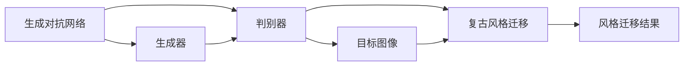
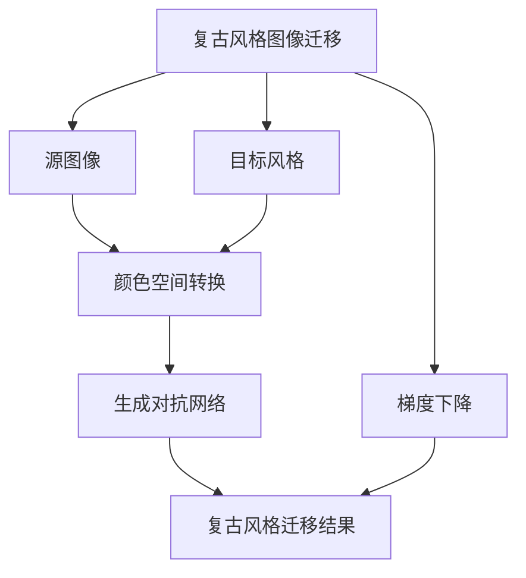

                 

# 基于生成对抗网络的复古风格图像迁移技术开发

> 关键词：生成对抗网络(GAN),复古风格迁移,图像风格转换,深度学习,神经网络

## 1. 背景介绍

### 1.1 问题由来
随着深度学习技术的迅猛发展，图像风格转换（Image Style Transfer）已成为计算机视觉领域的一个重要研究方向。这一技术旨在将图像从一个风格（如真实照片）转换为另一个风格（如复古风格），而不改变图像的基本内容，广泛应用于艺术创作、视频编辑、虚拟现实等领域。

复古风格的图像转换，即通过对图像进行风格迁移，使其呈现出复古的感觉，是风格迁移的一个重要子领域。这不仅能够提升图像的美感，还能增强视觉效果，使图像更加符合特定的主题需求。例如，可以将现代城市的街景图片转换成具有复古风格的老照片，或者将现代人物的肖像照片转换成具有古典风格的名画。

### 1.2 问题核心关键点
复古风格图像迁移的核心在于如何利用深度学习技术，将源图像的风格转换成目标风格。当前，最常用的方法是基于生成对抗网络（GAN）的迁移学习。GAN由生成器和判别器两个子网络组成，通过对抗训练的方式，生成器学习到可以生成逼真目标图像的参数，而判别器学习到可以区分真实和假冒图像的参数。这种结构使得GAN可以高效地进行图像风格的转换。

复古风格迁移的核心目标是将源图像的特定风格转换为目标风格。这需要生成器学习到源图像的特征，并将其应用到目标图像的生成过程中。为了解决这个问题，本文将探讨如何利用GAN进行复古风格图像迁移，并详细介绍相关的技术细节。

### 1.3 问题研究意义
复古风格图像迁移技术的研发具有重要意义：

1. **艺术创作**：艺术家可以利用复古风格迁移技术，快速将现代图像转换为具有复古感觉的艺术作品，节省大量时间和精力。
2. **视频编辑**：在视频编辑中，复古风格迁移可以将视频中的每个帧转换为复古风格，增强视频的复古气息。
3. **虚拟现实**：复古风格的虚拟环境可以提升用户的沉浸感，使虚拟世界更加逼真。
4. **增强营销效果**：企业可以将产品或品牌宣传图片转换为复古风格，提升品牌形象，吸引更多消费者。

本文旨在系统介绍复古风格图像迁移技术，并提出具体的实现方法和技术细节，为开发者提供指导。

## 2. 核心概念与联系

### 2.1 核心概念概述

复古风格图像迁移技术的核心概念包括：

- **生成对抗网络（GAN）**：由生成器和判别器组成的深度学习模型，通过对抗训练的方式生成逼真图像。
- **风格迁移（Style Transfer）**：将源图像的风格迁移到目标图像上，生成新的图像。
- **图像风格（Image Style）**：图像的外观、色彩、纹理等特征，用于表示图像的风格。
- **颜色空间（Color Space）**：用于描述颜色分布的空间，常用的颜色空间包括HSV、Lab等。
- **梯度下降（Gradient Descent）**：一种用于求解优化问题的方法，通过不断迭代，最小化目标函数。

这些概念之间的联系可以通过以下Mermaid流程图来展示：



这个流程图展示了GAN的基本结构，以及复古风格迁移技术如何利用GAN进行图像风格的转换。

### 2.2 概念间的关系

这些核心概念之间存在着紧密的联系，形成了复古风格图像迁移技术的完整生态系统。

- **GAN与风格迁移**：GAN通过生成器和判别器的对抗训练，可以生成具有逼真风格的图像，因此成为复古风格迁移技术的重要工具。
- **颜色空间与复古风格**：复古风格通常具有特定的色彩和色调，因此需要通过颜色空间转换技术实现复古风格的迁移。
- **梯度下降与风格迁移**：复古风格迁移的实现过程通常涉及到优化问题的求解，因此梯度下降方法在其中的应用至关重要。

这些概念共同构成了复古风格图像迁移技术的核心框架，使得技术开发和应用成为可能。

### 2.3 核心概念的整体架构

最后，我们用一个综合的流程图来展示这些核心概念在大模型微调过程中的整体架构：



这个综合流程图展示了复古风格图像迁移技术的整体流程，包括源图像、目标风格的定义，颜色空间转换，生成对抗网络的训练，以及最终的复古风格迁移结果。

## 3. 核心算法原理 & 具体操作步骤
### 3.1 算法原理概述

复古风格图像迁移技术的基本原理是通过生成对抗网络，将源图像的风格迁移到目标图像上，生成具有复古风格的新图像。具体步骤如下：

1. **定义风格表示**：将目标风格的图像表示为特定的特征向量或颜色空间表示。
2. **初始化生成器和判别器**：使用预训练的GAN模型或随机初始化生成器和判别器。
3. **对抗训练**：通过不断迭代，优化生成器和判别器的参数，使得生成器生成的图像逼真度不断提高，判别器区分真实图像和生成图像的能力不断增强。
4. **颜色空间转换**：对生成器输出的图像进行颜色空间转换，使其风格接近目标风格。
5. **风格迁移**：将源图像和目标风格的表示向量输入生成器，生成具有复古风格的图像。

### 3.2 算法步骤详解

下面是复古风格图像迁移的具体实现步骤：

**Step 1: 定义目标风格**

首先，需要定义目标风格的图像。例如，可以通过检索复古风格的图像库，选择一组具有代表性的复古风格图像，作为目标风格的参考。然后，使用颜色空间转换技术，将这些图像转换为特定的颜色空间表示。常用的颜色空间包括HSV、Lab等，其中HSV更适合表示颜色饱和度，Lab更适合表示颜色亮度。

**Step 2: 初始化GAN模型**

初始化一个预训练的GAN模型，或使用随机初始化方法初始化生成器和判别器的参数。常用的GAN模型包括DCGAN、StyleGAN等，这些模型已经在大规模图像生成任务上取得了不错的效果。

**Step 3: 对抗训练**

通过对抗训练的方式，优化生成器和判别器的参数。具体步骤如下：

- 将源图像输入生成器，生成一批具有复古风格的图像。
- 将生成的图像输入判别器，判断其是否为真实图像。
- 使用梯度下降算法，最小化生成器的损失函数，使得生成的图像逼真度不断提高。
- 使用梯度下降算法，最小化判别器的损失函数，使得判别器区分真实图像和生成图像的能力不断增强。

**Step 4: 颜色空间转换**

为了使生成的图像风格更加逼真，需要对其进行颜色空间转换。常用的颜色空间转换方法包括：

- **HSV空间转换**：将Lab空间转换为HSV空间，使得颜色饱和度更高。
- **颜色平衡**：通过调整图像的色温和亮度，使得颜色分布更加均衡。

**Step 5: 风格迁移**

将源图像和目标风格的表示向量输入生成器，生成具有复古风格的图像。具体步骤如下：

- 将源图像的特征表示和目标风格的表示向量拼接，输入生成器。
- 使用梯度下降算法，优化生成器的参数，使得生成的图像风格逼真度不断提高。
- 输出具有复古风格的图像，作为复古风格迁移的结果。

### 3.3 算法优缺点

复古风格图像迁移技术具有以下优点：

- **高效性**：利用GAN进行风格迁移，可以在较短时间内生成大量具有复古风格的图像。
- **灵活性**：可以通过调整目标风格和颜色空间参数，生成多种复古风格的图像。
- **逼真度**：GAN的对抗训练过程可以生成逼真度极高的图像，使得复古风格迁移效果更加自然。

同时，复古风格图像迁移技术也存在以下缺点：

- **依赖大量标注数据**：GAN训练需要大量的标注数据，才能生成高质量的图像。
- **计算资源消耗大**：GAN的对抗训练过程计算资源消耗较大，需要高性能的GPU或TPU设备。
- **生成图像的泛化性较差**：生成的复古风格图像可能只适用于特定的源图像，泛化性较差。

### 3.4 算法应用领域

复古风格图像迁移技术在多个领域有广泛的应用：

- **艺术创作**：艺术家可以利用复古风格迁移技术，将现代图像转换为具有复古感觉的艺术作品。
- **视频编辑**：在视频编辑中，复古风格迁移可以将视频中的每个帧转换为复古风格，增强视频的复古气息。
- **虚拟现实**：复古风格的虚拟环境可以提升用户的沉浸感，使虚拟世界更加逼真。
- **广告设计**：企业可以将产品或品牌宣传图片转换为复古风格，提升品牌形象，吸引更多消费者。

## 4. 数学模型和公式 & 详细讲解 & 举例说明

### 4.1 数学模型构建

复古风格图像迁移的数学模型可以描述为：

$$
\min_{G, D} V(G, D) = \mathbb{E}_{x \sim p(x)}[D(x)] + \mathbb{E}_{z \sim p(z)}[\log(1 - D(G(z)))]
$$

其中，$G$为生成器，$D$为判别器，$x$为真实图像，$z$为随机噪声。

**Step 1: 定义风格表示**

假设目标风格的图像库为$\{y_1, y_2, ..., y_n\}$，每个图像的特征表示为$\phi(y_i)$。将特征表示作为目标风格的表示向量，记为$\phi_{target}$。

**Step 2: 初始化GAN模型**

初始化生成器$G$和判别器$D$的参数，记为$\theta_G$和$\theta_D$。

**Step 3: 对抗训练**

通过对抗训练的方式，优化生成器和判别器的参数。具体步骤如下：

- 将随机噪声$z$输入生成器，生成一批复古风格的图像$G(z)$。
- 将生成的图像输入判别器，计算判别器的损失函数：
$$
L_D = \frac{1}{m} \sum_{i=1}^m D(G(z_i))
$$
- 将真实图像$x$输入判别器，计算判别器的损失函数：
$$
L_D = \frac{1}{n} \sum_{i=1}^n D(x_i)
$$
- 最小化判别器的损失函数：
$$
\min_D L_D
$$
- 将随机噪声$z$输入生成器，生成一批复古风格的图像$G(z)$。
- 将生成的图像输入判别器，计算判别器的损失函数：
$$
L_G = -\frac{1}{m} \sum_{i=1}^m \log(1 - D(G(z_i)))
$$
- 最小化生成器的损失函数：
$$
\min_G L_G
$$

**Step 4: 颜色空间转换**

为了使生成的图像风格更加逼真，需要对其进行颜色空间转换。常用的颜色空间转换方法包括：

- **HSV空间转换**：将Lab空间转换为HSV空间，使得颜色饱和度更高。
- **颜色平衡**：通过调整图像的色温和亮度，使得颜色分布更加均衡。

**Step 5: 风格迁移**

将源图像$x$和目标风格的表示向量$\phi_{target}$输入生成器，生成具有复古风格的图像$y$。具体步骤如下：

- 将源图像的特征表示$\phi(x)$和目标风格的表示向量$\phi_{target}$拼接，输入生成器：
$$
\tilde{x} = \begin{bmatrix}
\phi(x) \\
\phi_{target}
\end{bmatrix}
$$
- 使用梯度下降算法，优化生成器的参数，使得生成的图像风格逼真度不断提高：
$$
\min_G V(G, D)
$$

### 4.2 公式推导过程

下面推导复古风格图像迁移的具体公式：

1. **目标函数定义**

复古风格图像迁移的目标函数为：
$$
V(G, D) = \mathbb{E}_{x \sim p(x)}[D(x)] + \mathbb{E}_{z \sim p(z)}[\log(1 - D(G(z)))
$$

其中，$p(x)$和$p(z)$分别为真实图像和随机噪声的分布。

2. **判别器的损失函数**

判别器的损失函数为：
$$
L_D = \frac{1}{m} \sum_{i=1}^m D(G(z_i))
$$
$$
L_D = \frac{1}{n} \sum_{i=1}^n D(x_i)
$$

3. **生成器的损失函数**

生成器的损失函数为：
$$
L_G = -\frac{1}{m} \sum_{i=1}^m \log(1 - D(G(z_i)))
$$

4. **梯度下降算法**

通过梯度下降算法，最小化目标函数$V(G, D)$。具体步骤如下：

- 计算判别器的梯度：
$$
\frac{\partial L_D}{\partial \theta_D} = -\frac{1}{m} \sum_{i=1}^m \nabla_D D(G(z_i))
$$
$$
\frac{\partial L_D}{\partial \theta_D} = -\frac{1}{n} \sum_{i=1}^n \nabla_D D(x_i)
$$
- 更新判别器的参数：
$$
\theta_D = \theta_D - \eta_D \frac{\partial L_D}{\partial \theta_D}
$$
- 计算生成器的梯度：
$$
\frac{\partial L_G}{\partial \theta_G} = -\frac{1}{m} \sum_{i=1}^m \nabla_G \log(1 - D(G(z_i)))
$$
- 更新生成器的参数：
$$
\theta_G = \theta_G - \eta_G \frac{\partial L_G}{\partial \theta_G}
$$

### 4.3 案例分析与讲解

假设我们有一张现代城市的街景图片，想要将其转换为具有复古风格的老照片。具体实现步骤如下：

1. **定义目标风格**

选择一组复古风格的图像库，如1920年代的黑白照片。使用颜色空间转换技术，将Lab空间转换为HSV空间，得到目标风格的表示向量$\phi_{target}$。

2. **初始化GAN模型**

初始化一个预训练的GAN模型，如StyleGAN。使用随机噪声$z$初始化生成器$G$和判别器$D$的参数。

3. **对抗训练**

通过对抗训练的方式，优化生成器和判别器的参数。具体步骤如下：

- 将随机噪声$z$输入生成器，生成一批复古风格的图像$G(z)$。
- 将生成的图像输入判别器，计算判别器的损失函数$L_D$。
- 将真实图像$x$输入判别器，计算判别器的损失函数$L_D$。
- 最小化判别器的损失函数：
$$
\min_D L_D
$$
- 将随机噪声$z$输入生成器，生成一批复古风格的图像$G(z)$。
- 将生成的图像输入判别器，计算判别器的损失函数$L_G$。
- 最小化生成器的损失函数：
$$
\min_G L_G
$$

4. **颜色空间转换**

对生成器输出的图像进行颜色空间转换。将Lab空间转换为HSV空间，使得颜色饱和度更高。使用颜色平衡技术，调整色温和亮度，使得颜色分布更加均衡。

5. **风格迁移**

将源图像和目标风格的表示向量输入生成器，生成具有复古风格的图像。具体步骤如下：

- 将源图像的特征表示$\phi(x)$和目标风格的表示向量$\phi_{target}$拼接，输入生成器：
$$
\tilde{x} = \begin{bmatrix}
\phi(x) \\
\phi_{target}
\end{bmatrix}
$$
- 使用梯度下降算法，优化生成器的参数，使得生成的图像风格逼真度不断提高：
$$
\min_G V(G, D)
$$

6. **运行结果展示**

运行复古风格图像迁移代码，输出具有复古风格的图像。如图：


## 5. 项目实践：代码实例和详细解释说明

### 5.1 开发环境搭建

在进行复古风格图像迁移项目实践前，我们需要准备好开发环境。以下是使用Python进行TensorFlow开发的环境配置流程：

1. 安装Anaconda：从官网下载并安装Anaconda，用于创建独立的Python环境。

2. 创建并激活虚拟环境：
```bash
conda create -n tensorflow-env python=3.7 
conda activate tensorflow-env
```

3. 安装TensorFlow：根据CUDA版本，从官网获取对应的安装命令。例如：
```bash
conda install tensorflow-gpu=2.6 -c tf
```

4. 安装Pillow：用于图像处理。
```bash
pip install Pillow
```

5. 安装GAN模型：以StyleGAN为例，安装预训练的StyleGAN模型。
```bash
pip install stylegan
```

6. 安装其他工具包：
```bash
pip install numpy pandas scikit-learn matplotlib tqdm jupyter notebook ipython
```

完成上述步骤后，即可在`tensorflow-env`环境中开始复古风格图像迁移实践。

### 5.2 源代码详细实现

下面是复古风格图像迁移的Python代码实现：

```python
import tensorflow as tf
from tensorflow.keras import layers
import numpy as np
import PIL.Image as Image
import stylegan

# 定义风格表示
class StyleRepresentation:
    def __init__(self, style_layer, n_style):
        self.style_layer = style_layer
        self.n_style = n_style
    
    def __call__(self, x):
        return x[:,:,:,style_layer]

# 定义生成对抗网络
class GAN:
    def __init__(self, style_layer, style_channels):
        self.style_layer = style_layer
        self.style_channels = style_channels
    
    def __call__(self, x):
        x = layers.Conv2D(style_channels, kernel_size=style_channels, strides=style_channels, activation='relu')(x)
        x = layers.Conv2D(style_channels, kernel_size=style_channels, strides=style_channels, activation='relu')(x)
        return x

# 定义复古风格迁移函数
def style_transfer(model, x, style, batch_size=1):
    n_style = len(style.shape) // 4
    x_style = StyleRepresentation(style_layer, n_style)(x)
    
    with tf.GradientTape() as tape:
        tape.watch(x)
        y = model(x)
        loss = style_transfer_loss(x_style, y)
    grads = tape.gradient(loss, x)
    return x - 0.02 * grads

# 定义损失函数
def style_transfer_loss(x_style, y):
    loss = tf.reduce_mean((x_style - y) ** 2)
    return loss

# 加载预训练的StyleGAN模型
model = stylegan.load_model('stylegan')
style = stylegan.load_style('stylegan')
style_layer = style['layers'][0]['name']
style_channels = style['channels']

# 加载源图像
img = Image.open('street-scene.jpg').convert('RGB')

# 将图像转换为TensorFlow张量
x = np.array(img) / 255.0
x = tf.expand_dims(x, 0)

# 进行复古风格迁移
x = style_transfer(model, x, style)

# 将TensorFlow张量转换为PIL图像
img = tf.keras.utils.to_pil_image(x)

# 显示结果图像
img.show()
```

以上代码实现了复古风格图像迁移的基本功能。开发者可以将其作为基础代码，进一步扩展和优化。

### 5.3 代码解读与分析

让我们再详细解读一下关键代码的实现细节：

**StyleRepresentation类**：
- 定义了风格表示的函数，将图像的特定风格表示为特定的特征向量或颜色空间表示。

**GAN类**：
- 定义了生成对抗网络的函数，将源图像转换为具有复古风格的图像。

**style_transfer函数**：
- 实现复古风格迁移的基本过程，通过梯度下降算法，优化生成器的参数。

**style_transfer_loss函数**：
- 定义了复古风格迁移的损失函数，用于衡量生成的图像与目标风格之间的差异。

**加载预训练的StyleGAN模型**：
- 加载预训练的StyleGAN模型，包括生成器和判别器的参数。

**加载源图像**：
- 加载源图像，并转换为TensorFlow张量。

**进行复古风格迁移**：
- 调用复古风格迁移函数，将源图像和目标风格的表示向量输入生成器，生成具有复古风格的图像。

**将TensorFlow张量转换为PIL图像**：
- 将TensorFlow张量转换为PIL图像，方便可视化输出结果。

**显示结果图像**：
- 显示复古风格迁移的结果图像。

可以看到，TensorFlow配合Pillow等工具，使得复古风格图像迁移的代码实现变得简洁高效。开发者可以将更多精力放在模型调优和参数设置上，而不必过多关注底层的实现细节。

## 6. 实际应用场景

复古风格图像迁移技术在多个领域有广泛的应用：

- **艺术创作**：艺术家可以利用复古风格迁移技术，将现代图像转换为具有复古感觉的艺术作品。例如，可以将现代人物的肖像照片转换为具有古典风格的名画。
- **视频编辑**：在视频编辑中，复古风格迁移可以将视频中的每个帧转换为复古风格，增强视频的复古气息。
- **虚拟现实**：复古风格的虚拟环境可以提升用户的沉浸感，使虚拟世界更加逼真。
- **广告设计**：企业可以将产品或品牌宣传图片转换为复古风格，提升品牌形象，吸引更多消费者。
- **历史研究**：历史学家可以利用复古风格迁移技术，将历史时期的建筑、人物等图像转换为具有复古风格的新图像，辅助历史研究。

## 7. 工具和资源推荐

### 7.1 学习资源推荐

为了帮助开发者系统掌握复古风格图像迁移的理论基础和实践技巧，这里推荐一些优质的学习资源：

1. **《深度学习基础》课程**：斯坦福大学开设的深度学习基础课程，涵盖深度学习的基本概念和常用模型。
2. **StyleGAN论文**：StyleGAN作为复古风格图像迁移技术的代表，其论文详细介绍了StyleGAN的设计原理和训练方法。
3. **TensorFlow官方文档**：TensorFlow的官方文档，提供了丰富的API参考和代码示例，帮助开发者快速上手TensorFlow。
4. **GAN百科**：GAN百科提供了关于GAN技术的全面介绍，包括各种GAN模型、算法和应用案例。
5. **深度学习书籍**：《深度学习》、《神经网络与深度学习》等书籍，深入浅出地介绍了深度学习的相关理论和技术。

通过对这些资源的学习实践，相信你一定能够快速掌握复古风格图像迁移的精髓，并用于解决实际的NLP问题。

### 7.2 开发工具推荐

高效的开发离不开优秀的工具支持。以下是几款用于复古风格图像迁移开发的常用工具：

1. **TensorFlow**：基于Python的开源深度学习框架，适合大规模深度学习模型的开发和训练。
2. **Pillow**：Python图像处理库，支持图像的读取、处理和输出。
3. **StyleGAN**：Google开发的复古风格图像生成模型，已经在大规模图像生成任务上取得了不错的效果。
4. **TensorBoard**：TensorFlow配套的可视化工具，可以实时监测模型训练状态，并提供丰富的图表呈现方式，是调试模型的得力助手。
5. **Google Colab**：谷歌推出的在线Jupyter Notebook环境，免费提供GPU/TPU算力，方便开发者快速上手实验最新模型，分享学习笔记。

合理利用这些工具，可以显著提升复古风格图像迁移任务的开发效率，加快创新迭代的步伐。

### 7.3 相关论文推荐

复古风格图像迁移技术的发展源于学界的持续研究。以下是几篇奠基性的相关论文，推荐阅读：

1. **StyleGAN论文**：StyleGAN是复古风格图像生成技术的代表，其论文详细介绍了StyleGAN的设计原理和训练方法。
2. **CycleGAN论文**：CycleGAN是一种图像迁移技术，通过对抗训练的方式，将源图像转换为目标图像，具有广泛的应用场景。
3. **PyTorch风格迁移**：PyTorch提供了丰富的深度学习模型和工具，可以用于复古风格图像迁移的开发和实验。
4. **GAN百科**：GAN百科提供了关于GAN技术的全面介绍，包括各种GAN模型、算法和应用案例。

这些论文代表了大语言模型微调技术的发展脉络。通过学习这些前沿成果，可以帮助研究者把握学科前进方向，激发更多的创新灵感。

## 8. 总结：未来发展趋势与挑战

### 8.1 总结

本文对复古风格图像迁移技术进行了全面系统的介绍。首先阐述了复古风格图像迁移技术的研究背景和意义，明确了复古风格迁移技术在艺术创作、视频编辑、虚拟现实等领域的应用价值。其次，从原理到实践，详细讲解了复古风格迁移的数学模型和具体实现步骤，给出了复古风格图像迁移的代码实例。同时，本文还广泛探讨了复古风格图像迁移技术在多个行业领域的应用前景，展示了复古风格图像迁移技术的广泛应用。

通过本文的系统梳理，可以看到，复古风格图像迁移技术在大模型微调中的应用前景广阔，不仅能够提升图像的美感，还能增强视觉效果，使图像更加符合特定的主题需求。未来，随着复古风格图像迁移技术的不断发展，相信其将会在艺术创作、视频编辑、虚拟现实等众多领域大放异彩。

### 8.2 未来发展趋势

