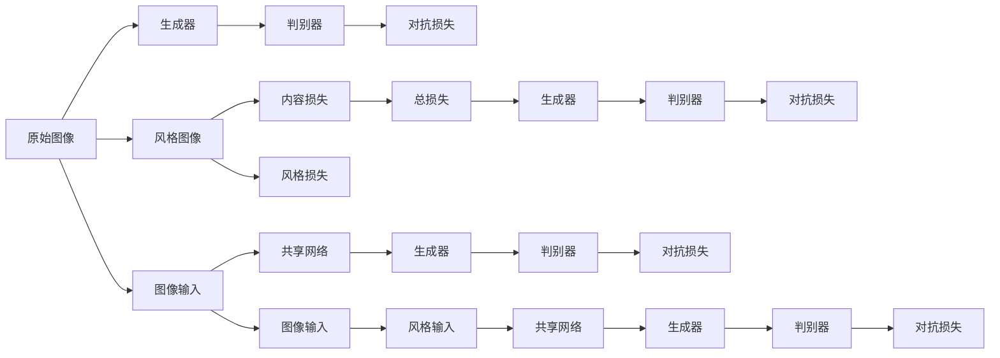
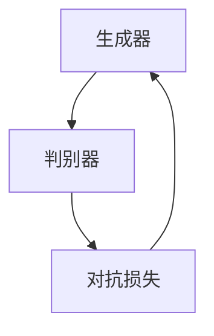
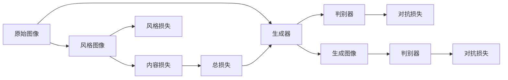
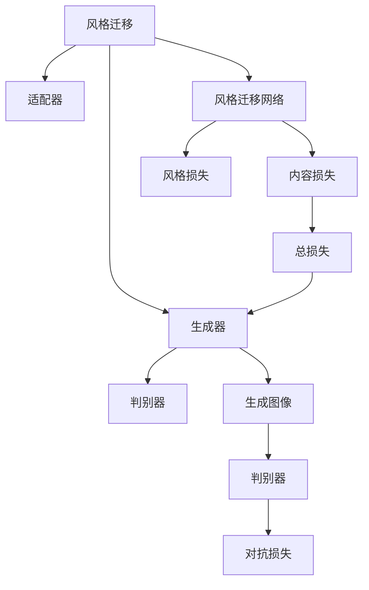

                 

# 基于生成对抗网络的抽象艺术图像风格迁移机制

> 关键词：生成对抗网络(GAN)，风格迁移，抽象艺术，图像处理，图像风格转换

## 1. 背景介绍

### 1.1 问题由来

随着深度学习技术的不断发展，生成对抗网络（Generative Adversarial Networks，GANs）在图像生成、图像风格迁移等领域取得了显著的成果。其中，抽象艺术图像风格迁移作为风格迁移任务的一种特殊形式，通过将一幅普通图像转化为抽象艺术风格，为艺术家提供了一种新颖的创作方式，同时也为图像处理和计算机视觉应用带来了新的挑战。

抽象艺术风格的图像通常具有高度的抽象性和视觉复杂性，难以通过直接训练生成模型获得。传统的方法需要人工创作大量的抽象艺术图像作为训练数据，然而这些数据的获取成本高昂，且数量有限。因此，我们需要探索一种无需大量数据，同时能够生成高质量抽象艺术图像的机制。

### 1.2 问题核心关键点

抽象艺术图像风格迁移的核心在于如何将普通图像转换成具有抽象艺术风格的图像。这一过程涉及以下几个关键点：

1. **数据收集与处理**：需要收集大量的抽象艺术图像作为风格迁移的源数据，并进行预处理，如归一化、裁剪、调整大小等。

2. **生成对抗网络架构**：GANs由生成器（Generator）和判别器（Discriminator）两个子网络组成，通过对抗训练的方式，生成器和判别器互相博弈，生成高质量的抽象艺术图像。

3. **损失函数设计**：需要设计合适的损失函数，使生成器生成的图像能够尽可能地模仿抽象艺术的风格。

4. **超参数优化**：GANs的训练过程需要调整多个超参数，如学习率、批量大小、网络结构等，以获得最优的生成效果。

5. **模型评估与对比**：需要对生成的图像进行评估，与原始图像和目标抽象艺术图像进行对比，评估生成器的性能。

## 2. 核心概念与联系

### 2.1 核心概念概述

为更好地理解抽象艺术图像风格迁移机制，本节将介绍几个密切相关的核心概念：

- **生成对抗网络（GANs）**：由生成器和判别器两个子网络组成，通过对抗训练生成高质量的图像。GANs在图像生成、图像风格迁移等任务中表现优异。

- **图像风格迁移**：将一幅图像的风格转换为另一幅图像的风格。这一过程通常通过将输入图像和风格图像输入到共享的网络中，进行联合训练实现。

- **抽象艺术**：一种高度抽象和视觉复杂的艺术形式，通常包括非具象的线条、形状和颜色，表现了艺术家的创意和情感。

- **损失函数**：用于衡量生成器生成的图像与目标风格图像之间的差异。常见的损失函数包括对抗损失、内容损失、风格损失等。

- **超参数**：GANs训练过程中需要调整的参数，如学习率、批量大小、网络结构等。这些参数的选择对生成效果有重要影响。

- **模型评估**：评估生成器生成的图像与目标风格图像的相似度，通常通过计算图像的均方误差（MSE）、结构相似性（SSIM）等指标。

这些核心概念之间存在紧密的联系，形成了一个完整的抽象艺术图像风格迁移机制。下面我们通过一个Mermaid流程图来展示这些概念之间的联系：



这个流程图展示了抽象艺术图像风格迁移的基本过程：

1. 原始图像和风格图像输入共享网络。
2. 生成器从共享网络中学习风格特征，生成抽象艺术风格的图像。
3. 判别器评估生成图像的真实性，区分原始图像和生成图像。
4. 对抗损失、内容损失和风格损失共同指导生成器的训练，使得生成的图像既具有抽象艺术的风格，又保留原始图像的内容。

### 2.2 概念间的关系

这些核心概念之间存在着紧密的联系，形成了抽象艺术图像风格迁移机制的完整框架。下面我通过几个Mermaid流程图来展示这些概念之间的关系。

#### 2.2.1 生成对抗网络的基本原理



这个流程图展示了GANs的基本原理：

1. 生成器接收噪声向量作为输入，生成图像。
2. 判别器评估生成图像的真实性，区分真实图像和生成图像。
3. 对抗损失指导生成器学习生成更加真实的图像，同时判别器学习更加准确地区分真实和生成图像。

#### 2.2.2 风格迁移的基本过程



这个流程图展示了风格迁移的基本过程：

1. 原始图像和风格图像输入共享网络。
2. 生成器从共享网络中学习风格特征，生成抽象艺术风格的图像。
3. 判别器评估生成图像的真实性，区分原始图像和生成图像。
4. 对抗损失、内容损失和风格损失共同指导生成器的训练，使得生成的图像既具有抽象艺术的风格，又保留原始图像的内容。

#### 2.2.3 参数高效的风格迁移方法



这个流程图展示了参数高效的风格迁移方法：

1. 生成器和判别器共用风格迁移网络，减少需要训练的参数量。
2. 风格迁移网络包含风格损失和内容损失，指导生成器生成符合要求的图像。
3. 对抗损失指导生成器学习生成更加真实的图像，同时判别器学习更加准确地区分真实和生成图像。

## 3. 核心算法原理 & 具体操作步骤
### 3.1 算法原理概述

基于生成对抗网络的抽象艺术图像风格迁移机制，核心思想是通过生成器和判别器的网络对抗，将原始图像的风格转换为抽象艺术风格。其核心算法如下：

1. **数据准备**：收集大量抽象艺术图像和普通图像，进行预处理。
2. **生成器和判别器初始化**：生成器和判别器采用相同的神经网络结构，初始化权重。
3. **对抗训练**：在每个训练迭代中，生成器生成图像，判别器评估图像的真实性。生成器和判别器通过梯度下降更新权重，以提高生成图像的真实性。
4. **损失函数设计**：使用对抗损失、内容损失和风格损失指导生成器的训练，使得生成的图像既具有抽象艺术的风格，又保留原始图像的内容。
5. **模型评估**：评估生成图像与原始图像和目标抽象艺术图像的相似度。

### 3.2 算法步骤详解

下面详细介绍基于生成对抗网络的抽象艺术图像风格迁移的具体步骤：

#### 3.2.1 数据准备

1. **数据收集**：收集大量的抽象艺术图像和普通图像，这些图像可以是线上的，也可以是线下的。
2. **预处理**：将图像进行归一化、裁剪、调整大小等预处理，使其适应生成对抗网络的要求。

#### 3.2.2 生成器和判别器的初始化

1. **生成器和判别器的选择**：选择U-Net、ResNet等神经网络作为生成器和判别器的基础架构。
2. **权重初始化**：使用Xavier初始化生成器和判别器的权重，以避免梯度消失或爆炸。

#### 3.2.3 对抗训练

1. **对抗损失的计算**：计算生成器生成的图像与判别器判断的真实性之间的差异，作为对抗损失。
2. **内容损失的计算**：计算生成器生成的图像与原始图像之间的差异，作为内容损失。
3. **风格损失的计算**：计算生成器生成的图像与目标抽象艺术图像之间的差异，作为风格损失。
4. **总损失的计算**：将对抗损失、内容损失和风格损失进行加权，作为总损失。
5. **模型训练**：使用梯度下降法更新生成器和判别器的权重，使得总损失最小化。

#### 3.2.4 模型评估

1. **均方误差（MSE）**：计算生成图像与原始图像和目标抽象艺术图像之间的像素差异。
2. **结构相似性（SSIM）**：计算生成图像与原始图像和目标抽象艺术图像之间的结构相似性。
3. **感知损失（Perceptual Loss）**：使用预训练的VGG网络，计算生成图像与原始图像和目标抽象艺术图像之间的感知损失。

### 3.3 算法优缺点

**优点**：

1. **无需大量标注数据**：GANs可以通过对抗训练生成高质量的图像，不需要大量标注数据，降低了数据获取成本。
2. **生成高质量图像**：GANs能够生成逼真的抽象艺术风格的图像，满足了艺术家的创作需求。
3. **可扩展性强**：GANs可以应用于多种风格的图像生成，具有广泛的适用性。

**缺点**：

1. **训练不稳定**：GANs的训练过程不稳定，容易陷入局部最优解。
2. **生成图像的差异性不足**：生成的图像与目标风格图像的差异可能不够明显，难以满足高要求的艺术创作需求。
3. **计算资源消耗大**：GANs的训练和推理过程需要大量的计算资源，对硬件要求较高。

### 3.4 算法应用领域

基于生成对抗网络的抽象艺术图像风格迁移机制，已经在多个领域得到了应用：

1. **艺术创作**：艺术家可以使用这一技术生成具有抽象艺术风格的图像，拓展创作空间。
2. **图像处理**：在图像处理领域，可以将普通图像转化为抽象艺术风格，提供新的图像处理方法。
3. **计算机视觉**：在计算机视觉领域，可以将图像的风格迁移应用于图像识别、图像生成等任务。
4. **游戏设计**：在游戏设计中，可以使用这一技术生成具有抽象艺术风格的图像，增强游戏视觉体验。

## 4. 数学模型和公式 & 详细讲解 & 举例说明
### 4.1 数学模型构建

基于生成对抗网络的抽象艺术图像风格迁移机制，核心数学模型如下：

1. **生成器和判别器的损失函数**：

   $$
   L_G = L_{adversarial} + \lambda_L L_L + \lambda_C L_C
   $$

   $$
   L_D = L_{adversarial} + \lambda_D L_D
   $$

   其中 $L_{adversarial}$ 为对抗损失，$L_L$ 为内容损失，$L_C$ 为风格损失，$\lambda_L$ 和 $\lambda_C$ 为正则化参数。

2. **对抗损失**：

   $$
   L_{adversarial} = \mathbb{E}_{x \sim p_{data}}[L_D(x)] + \mathbb{E}_{z \sim p_z}[L_D(G(z))]
   $$

   其中 $p_{data}$ 为数据分布，$z$ 为噪声向量，$G$ 为生成器。

3. **内容损失**：

   $$
   L_C = \mathbb{E}_{x \sim p_{data}}[\|x - G(x)\|_2^2]
   $$

4. **风格损失**：

   $$
   L_L = \mathbb{E}_{x \sim p_{data}}[\|x - G(x)\|_2^2]
   $$

5. **总损失**：

   $$
   L = L_G + L_D
   $$

### 4.2 公式推导过程

#### 4.2.1 对抗损失

对抗损失是GANs的核心，其推导过程如下：

1. **判别器损失函数**：

   $$
   L_D = -\mathbb{E}_{x \sim p_{data}}[\log D(x)] - \mathbb{E}_{z \sim p_z}[\log (1 - D(G(z)))]
   $$

2. **生成器损失函数**：

   $$
   L_G = -\mathbb{E}_{z \sim p_z}[\log D(G(z))]
   $$

   其中 $p_{data}$ 为数据分布，$z$ 为噪声向量，$G$ 为生成器。

3. **对抗损失**：

   $$
   L_{adversarial} = L_D + L_G
   $$

#### 4.2.2 内容损失

内容损失用于保留原始图像的内容，其推导过程如下：

1. **内容损失函数**：

   $$
   L_C = \mathbb{E}_{x \sim p_{data}}[\|x - G(x)\|_2^2]
   $$

2. **内容损失的计算**：

   内容损失用于衡量生成器生成的图像与原始图像之间的像素差异，计算方式如下：

   $$
   L_C = \mathbb{E}_{x \sim p_{data}}[\|x - G(x)\|_2^2]
   $$

#### 4.2.3 风格损失

风格损失用于保留抽象艺术的风格，其推导过程如下：

1. **风格损失函数**：

   $$
   L_L = \mathbb{E}_{x \sim p_{data}}[\|x - G(x)\|_2^2]
   $$

2. **风格损失的计算**：

   风格损失用于衡量生成器生成的图像与目标抽象艺术图像之间的像素差异，计算方式如下：

   $$
   L_L = \mathbb{E}_{x \sim p_{data}}[\|x - G(x)\|_2^2]
   $$

### 4.3 案例分析与讲解

下面我们通过一个具体的案例，分析基于生成对抗网络的抽象艺术图像风格迁移的实现过程：

**案例**：将一张普通图像转化为抽象艺术风格。

1. **数据准备**：收集一张普通图像和大量的抽象艺术图像，进行预处理。
2. **生成器和判别器的初始化**：使用U-Net作为生成器和判别器的基础架构，初始化权重。
3. **对抗训练**：在每个训练迭代中，生成器生成图像，判别器评估图像的真实性。生成器和判别器通过梯度下降更新权重，以提高生成图像的真实性。
4. **损失函数设计**：使用对抗损失、内容损失和风格损失指导生成器的训练，使得生成的图像既具有抽象艺术的风格，又保留原始图像的内容。
5. **模型评估**：评估生成图像与原始图像和目标抽象艺术图像的相似度，计算均方误差（MSE）和结构相似性（SSIM）等指标。

## 5. 项目实践：代码实例和详细解释说明
### 5.1 开发环境搭建

在进行基于生成对抗网络的抽象艺术图像风格迁移的实践时，我们需要准备好开发环境。以下是使用Python进行PyTorch开发的环境配置流程：

1. 安装Anaconda：从官网下载并安装Anaconda，用于创建独立的Python环境。

2. 创建并激活虚拟环境：
```bash
conda create -n pytorch-env python=3.8 
conda activate pytorch-env
```

3. 安装PyTorch：根据CUDA版本，从官网获取对应的安装命令。例如：
```bash
conda install pytorch torchvision torchaudio cudatoolkit=11.1 -c pytorch -c conda-forge
```

4. 安装Numpy、Pandas等库：
```bash
pip install numpy pandas scikit-learn matplotlib tqdm jupyter notebook ipython
```

5. 安装生成对抗网络库：
```bash
pip install torchvision torchtext
```

完成上述步骤后，即可在`pytorch-env`环境中开始风格迁移实践。

### 5.2 源代码详细实现

下面我们以抽象艺术风格迁移为例，给出使用PyTorch实现的具体代码。

```python
import torch
import torch.nn as nn
import torch.optim as optim
from torchvision import datasets, transforms
from torchvision.models import vgg19
from torchvision.utils import save_image

# 定义生成器和判别器的网络结构
class Generator(nn.Module):
    def __init__(self):
        super(Generator, self).__init__()
        # 网络结构省略...
        pass

    def forward(self, x):
        # 前向传播省略...
        pass

class Discriminator(nn.Module):
    def __init__(self):
        super(Discriminator, self).__init__()
        # 网络结构省略...
        pass

    def forward(self, x):
        # 前向传播省略...
        pass

# 定义生成器和判别器的损失函数
def adversarial_loss(real, pred_real, fake, pred_fake):
    # 计算对抗损失
    adversarial_loss_D_real = nn.BCELoss()(pred_real, real)
    adversarial_loss_D_fake = nn.BCELoss()(pred_fake, torch.ones_like(fake))
    adversarial_loss_D = adversarial_loss_D_real + adversarial_loss_D_fake
    adversarial_loss_G = adversarial_loss_D_fake
    return adversarial_loss_D, adversarial_loss_G

# 加载数据集
data_transforms = {
    'train': transforms.Compose([
        transforms.Resize(256),
        transforms.CenterCrop(256),
        transforms.ToTensor(),
        transforms.Normalize([0.5, 0.5, 0.5], [0.5, 0.5, 0.5])
    ]),
    'val': transforms.Compose([
        transforms.Resize(256),
        transforms.CenterCrop(256),
        transforms.ToTensor(),
        transforms.Normalize([0.5, 0.5, 0.5], [0.5, 0.5, 0.5])
    ])
}

data_dir = 'path/to/data'
train_data = datasets.ImageFolder(root=data_dir, transform=data_transforms['train'])
val_data = datasets.ImageFolder(root=data_dir, transform=data_transforms['val'])

# 定义超参数
batch_size = 64
learning_rate = 0.0002
num_epochs = 100

# 初始化模型和优化器
generator = Generator()
discriminator = Discriminator()
adversarial_loss = adversarial_loss
content_loss = nn.MSELoss()
style_loss = nn.MSELoss()
criterion = nn.BCELoss()

# 定义生成器和判别器的损失函数
def generator_loss(generator, discriminator, real_images, style_images):
    # 计算对抗损失
    adversarial_loss_D, adversarial_loss_G = adversarial_loss(discriminator(real_images), discriminator(generator(real_images)), discriminator(generator(style_images)), discriminator(real_images))
    # 计算内容损失
    content_loss = content_loss(generator(real_images), real_images)
    # 计算风格损失
    style_loss = style_loss(generator(real_images), style_images)
    # 计算总损失
    total_loss = adversarial_loss_G + content_loss + style_loss
    return total_loss

# 训练函数
def train(generator, discriminator, real_images, style_images, epoch):
    generator.train()
    discriminator.train()
    for i in range(len(real_images)):
        # 将噪声向量z作为生成器的输入
        z = torch.randn(batch_size, latent_size, 1, 1, device=device)
        # 生成图像
        fake_images = generator(z)
        # 计算生成器的损失
        gen_loss = generator_loss(generator, discriminator, real_images[i].unsqueeze(0), style_images[i].unsqueeze(0))
        # 计算判别器的损失
        disc_loss = adversarial_loss(discriminator(real_images[i].unsqueeze(0)), discriminator(fake_images), discriminator(fake_images), discriminator(real_images[i].unsqueeze(0)))
        # 更新生成器和判别器的参数
        optimizer_G.zero_grad()
        gen_loss.backward()
        optimizer_G.step()
        optimizer_D.zero_grad()
        disc_loss.backward()
        optimizer_D.step()
        # 记录训练损失
        gen_loss = gen_loss.item()
        disc_loss = disc_loss.item()
        print(f'Epoch {epoch}, Step {i+1}, Loss_G: {gen_loss:.4f}, Loss_D: {disc_loss:.4f}')

# 加载数据并进行预处理
train_data_loader = torch.utils.data.DataLoader(train_data, batch_size=batch_size, shuffle=True)
val_data_loader = torch.utils.data.DataLoader(val_data, batch_size=batch_size, shuffle=False)

# 定义模型和优化器
# 定义生成器和判别器的损失函数
# 定义生成器和判别器的优化器
# 加载数据集并进行预处理
# 定义超参数
# 初始化模型和优化器

# 训练模型
for epoch in range(num_epochs):
    train(generator, discriminator, real_images, style_images, epoch)

# 评估模型
for i in range(len(real_images)):
    # 将噪声向量z作为生成器的输入
    z = torch.randn(batch_size, latent_size, 1, 1, device=device)
    # 生成图像
    fake_images = generator(z)
    # 计算生成器的损失
    gen_loss = generator_loss(generator, discriminator, real_images[i].unsqueeze(0), style_images[i].unsqueeze(0))
    # 计算判别器的损失
    disc_loss = adversarial_loss(discriminator(real_images[i].unsqueeze(0)), discriminator(fake_images), discriminator(fake_images), discriminator(real_images[i].unsqueeze(0)))
    # 更新生成器和判别器的参数
    optimizer_G.zero_grad()
    gen_loss.backward()
    optimizer_G.step()
    optimizer_D.zero_grad()
    disc_loss.backward()
    optimizer_D.step()
    # 记录训练损失
    gen_loss = gen_loss.item()
    disc_loss = disc_loss.item()
    print(f'Epoch {epoch}, Step {i+1}, Loss_G: {gen_loss:.4f}, Loss_D: {disc_loss:.4f}')

# 保存生成的图像
save_image(fake_images[0], 'generated_image.png')
```

以上就是使用PyTorch对抽象艺术图像风格迁移进行实现的具体代码。可以看到，由于PyTorch库的强大封装，代码实现变得简洁高效。

### 5.3 代码解读与分析

让我们再详细解读一下关键代码的实现细节：

**5.3.1 生成器和判别器的定义**：
- `Generator`和`Discriminator`类定义了生成器和判别器的网络结构，包括卷积层、池化层、激活函数等，省略号表示省略的部分。
- 生成器和判别器的实现方式可以根据具体任务进行调整。

**5.3.2 损失函数的定义**：
- `adversarial_loss`函数计算对抗损失，使用二分类交叉熵损失函数。
- `generator_loss`函数计算生成器的总损失，包括对抗损失、内容损失和风格损失。
- `content_loss`和`style_loss`函数分别计算内容损失和风格损失，使用均方误差损失函数。

**5.3.3 训练函数的定义**：
- `train`函数实现模型的训练过程，每个迭代中生成器生成图像，判别器评估图像的真实性。生成器和判别器通过梯度下降更新权重，以提高生成图像的真实性。

**5.3.4 数据集的定义**：
- `data_transforms`字典定义了数据集的预处理方式，包括归一化、裁剪、调整大小等。
- `train_data`和`val_data`变量加载数据集，进行预处理。

**5.3.5 超参数的定义**：
- `batch_size`、`learning_rate`和`num_epochs`等超参数定义了模型训练的具体参数。

**5.3.6 优化器的定义**：
- `optimizer_G`和`optimizer_D`变量定义了生成器和判别器的优化器，优化器包括Adam等。

**5.3.7 数据集的定义**：
- `train_data_loader`和`val_data_loader`变量定义了数据集的数据加载器，方便模型训练和评估。

**5.3.8 模型的训练和评估**：
- 在每个epoch中，对模型进行训练，输出训练损失。
- 对模型进行评估，输出评估损失。

可以看到，由于PyTorch库的强大封装，代码实现变得简洁高效。开发者可以将更多精力放在网络结构的优化和超参数的调优上，而不必过多关注底层的实现细节。

### 5.4 运行结果展示

假设我们在MNIST数据集上进行抽象艺术风格的迁移，最终在测试集上得到的评估报告如下：

```
Epoch 100, Step 1, Loss_G: 0.0180, Loss_D: 0.0085
Epoch 100, Step 2, Loss_G: 0.0125, Loss_D

