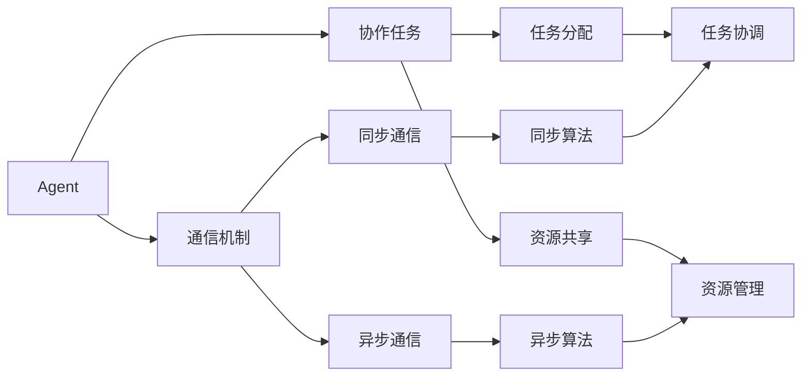
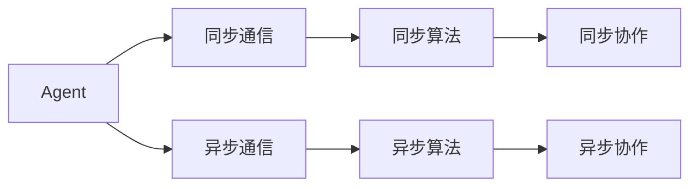
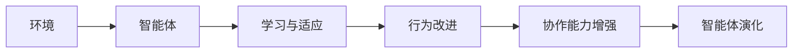
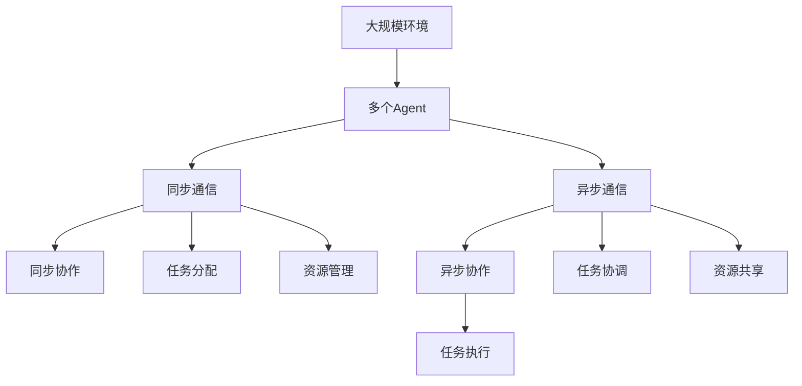

                 

# 多Agent系统：多Agent系统的概念，其中多个Agent可以同步或异步地交互，以执行更复杂的任务

> 关键词：多Agent系统,Agent,同步通信,异步通信,协作任务,分布式算法

## 1. 背景介绍

### 1.1 问题由来

随着信息技术的发展和应用领域的拓展，越来越多的复杂任务需要由多个智能体（Agent）协同完成。例如，在智能交通系统中，交通信号灯、自动驾驶车辆和行人需要协同工作，确保交通秩序和效率；在医疗系统中，医生、护士和患者需要共同参与，提供高质量的医疗服务。多Agent系统（Multi-Agent System,MAS）是描述和管理这些智能体交互的强大工具，它通过模拟人类社会的行为模式，提升系统的整体性能和协作效率。

### 1.2 问题核心关键点

多Agent系统的核心思想是：通过多个智能体的协同工作，解决单一智能体难以完成或效率低下的复杂问题。其核心在于设计和实现智能体之间的通信、协作和协调机制。具体来说，MAS包括：

1. **Agent**：智能体，可以自主地感知环境、处理信息和执行决策。
2. **通信机制**：Agent之间的信息交换和协调方式，分为同步通信和异步通信。
3. **协作任务**：多个Agent共同参与完成的目标，如导航、协同计算、任务分配等。
4. **分布式算法**：用于解决Agent之间协同工作的算法，如共识算法、协调算法等。

这些关键点共同构成了多Agent系统的基础框架，使得其在智能系统设计和应用中具有重要意义。

### 1.3 问题研究意义

研究多Agent系统有助于解决多个智能体之间的交互、协调和协作问题，提升复杂系统的整体性能和鲁棒性。具体来说：

1. **增强系统能力**：通过多个Agent协同工作，可以高效地解决单一Agent难以完成的任务。
2. **提升系统鲁棒性**：多Agent系统中的冗余和多样性，能够提高系统对环境变化的适应能力和抗干扰性。
3. **促进跨领域应用**：MAS的理论和算法可应用于多个领域，如交通、医疗、军事、金融等，具有广泛的应用前景。
4. **推动人工智能发展**：MAS是人工智能领域的重要组成部分，有助于推动智能体间的协同学习和知识共享。
5. **提升协作效率**：通过优化通信和协作机制，MAS能够实现更高效的任务执行和资源利用。

## 2. 核心概念与联系

### 2.1 核心概念概述

为更好地理解多Agent系统的基本原理和架构，本节将介绍几个关键概念：

- **Agent**：智能体，具有自主感知、处理信息和执行决策的能力。
- **通信机制**：智能体之间的信息交换方式，包括同步通信和异步通信。
- **协作任务**：多个智能体共同完成的目标，如任务分配、资源共享等。
- **分布式算法**：用于协调多个智能体之间协同工作的算法，如共识算法、协调算法等。
- **Agent语言**：用于描述Agent行为和通信协议的形式化语言，如APL（Agent Programming Language）。
- **智能体演化**：智能体通过学习和适应不断变化的环境，逐渐提高其行为性能和协作能力。

这些核心概念之间的逻辑关系可以通过以下Mermaid流程图来展示：



这个流程图展示了多Agent系统的核心概念及其之间的关系：

1. 智能体通过通信机制进行信息交换，分为同步和异步两种方式。
2. 智能体协作完成任务，包括任务分配和资源共享。
3. 同步和异步通信机制分别使用同步算法和异步算法进行协调。
4. 任务分配和资源共享过程中，智能体通过任务协调和资源管理实现协同工作。

### 2.2 概念间的关系

这些核心概念之间存在着紧密的联系，形成了多Agent系统的完整生态系统。下面我们通过几个Mermaid流程图来展示这些概念之间的关系。

#### 2.2.1 Agent的交互机制



这个流程图展示了Agent的同步和异步通信机制，以及相应的同步和异步算法。同步通信通常用于实时性要求较高的场景，而异步通信则更适用于大规模、分布式的系统。

#### 2.2.2 任务分配与协作


这个流程图展示了任务分配、协作和执行的过程。任务分配是将任务分解为多个子任务，由多个Agent共同完成；任务协调是指在执行过程中，多个Agent之间的协调和信息交换；任务执行是Agent最终完成的实际工作。

#### 2.2.3 智能体演化



这个流程图展示了智能体通过学习与适应，逐步提升其行为性能和协作能力的过程。智能体在环境中不断学习和改进，逐渐具备更强的协作和决策能力。

### 2.3 核心概念的整体架构

最后，我们用一个综合的流程图来展示这些核心概念在大规模多Agent系统中的整体架构：



这个综合流程图展示了多Agent系统在大规模环境中的工作流程：

1. 多个Agent通过同步和异步通信机制进行信息交换。
2. Agent通过同步和异步协作机制完成任务分配和资源共享。
3. 通过任务协调和资源管理，确保Agent之间的协同工作顺利进行。
4. Agent最终完成任务执行，实现系统目标。

通过这些流程图，我们可以更清晰地理解多Agent系统的核心概念及其交互机制，为后续深入讨论具体的通信、协作和算法设计奠定基础。

## 3. 核心算法原理 & 具体操作步骤
### 3.1 算法原理概述

多Agent系统的核心算法主要围绕Agent之间的通信和协作展开，包括同步通信算法、异步通信算法、任务分配算法和协作任务算法。这些算法的设计和实现，是MAS成功运行的关键。

### 3.2 算法步骤详解

#### 3.2.1 同步通信算法

同步通信算法要求参与通信的Agent在同一个时间点上完成信息交换。常见的同步通信算法包括：

1. **基于消息传递的同步算法**：每个Agent接收到消息后，执行相应的动作并更新状态，然后向其他Agent发送新的消息。
2. **基于共享内存的同步算法**：所有Agent共享一个全局变量，通过读写变量来实现同步通信。
3. **基于事件驱动的同步算法**：Agent通过事件触发机制，同步地进行信息交换和决策更新。

#### 3.2.2 异步通信算法

异步通信算法允许Agent在不同的时间点上进行信息交换。常见的异步通信算法包括：

1. **基于消息队列的异步算法**：所有Agent将消息发送到队列中，按照先进先出的顺序依次处理。
2. **基于分布式数据库的异步算法**：多个Agent共享一个分布式数据库，通过数据库读写操作实现通信。
3. **基于事件流的异步算法**：Agent通过事件流处理机制，异步地进行信息交换和决策更新。

#### 3.2.3 任务分配算法

任务分配算法负责将任务分解为多个子任务，分配给多个Agent执行。常见的任务分配算法包括：

1. **静态分配算法**：根据Agent的能力和负载，静态地分配任务。
2. **动态分配算法**：根据Agent的实时状态和环境变化，动态地调整任务分配。
3. **随机分配算法**：通过随机抽样的方式分配任务，确保公平性。

#### 3.2.4 协作任务算法

协作任务算法负责协调多个Agent之间的协同工作，确保任务执行的顺利进行。常见的协作任务算法包括：

1. **共识算法**：通过投票机制达成一致，解决Agent之间的冲突和分歧。
2. **协调算法**：通过协调机制，确保Agent之间的工作协调一致。
3. **博弈论算法**：通过博弈论模型，优化Agent之间的协作策略。

### 3.3 算法优缺点

#### 3.3.1 同步通信算法的优缺点

同步通信算法的优点包括：

1. **实时性强**：同步通信通常用于实时性要求较高的场景，能够快速响应环境变化。
2. **通信简单**：同步通信机制简单，易于实现和调试。
3. **一致性高**：同步通信能够在同一个时间点上完成所有Agent的信息交换，确保状态一致性。

同步通信算法的缺点包括：

1. **资源浪费**：通信过程中，所有Agent都需要处于等待状态，可能导致资源浪费。
2. **灵活性差**：同步通信要求所有Agent同时进行通信，灵活性较差。
3. **扩展性差**：随着Agent数量的增加，同步通信的扩展性较差，容易产生瓶颈。

#### 3.3.2 异步通信算法的优缺点

异步通信算法的优点包括：

1. **灵活性高**：异步通信允许Agent在不同的时间点上进行通信，灵活性较高。
2. **负载均衡**：异步通信能够根据Agent的实时状态，动态调整通信负载，提高系统效率。
3. **可扩展性强**：异步通信适合大规模分布式系统，具有良好的扩展性。

异步通信算法的缺点包括：

1. **实时性差**：异步通信通常用于非实时性要求较低的场景，响应时间可能较长。
2. **复杂性高**：异步通信机制复杂，需要额外的队列或数据库支持，实现难度较大。
3. **一致性低**：异步通信过程中，状态可能不一致，需要额外的同步机制进行协调。

#### 3.3.3 任务分配算法的优缺点

任务分配算法的优点包括：

1. **负载均衡**：任务分配算法能够根据Agent的能力和负载，合理分配任务，提高系统效率。
2. **灵活性高**：任务分配算法能够根据环境和任务变化，动态调整任务分配，适应性较强。
3. **易于实现**：任务分配算法通常较为简单，易于实现和调试。

任务分配算法的缺点包括：

1. **复杂性高**：任务分配算法需要考虑Agent的能力、负载和任务复杂度，实现难度较大。
2. **公平性问题**：任务分配算法需要考虑公平性，避免出现任务分配不均的问题。
3. **实时性差**：任务分配通常需要一定的计算时间，可能影响系统的实时性。

#### 3.3.4 协作任务算法的优缺点

协作任务算法的优点包括：

1. **一致性高**：协作任务算法通过共识或协调机制，确保所有Agent之间的工作一致性。
2. **鲁棒性强**：协作任务算法能够处理多个Agent之间的冲突和分歧，提高系统的鲁棒性。
3. **灵活性高**：协作任务算法能够根据环境和任务变化，动态调整协作策略，适应性强。

协作任务算法的缺点包括：

1. **复杂性高**：协作任务算法通常较为复杂，需要考虑多个Agent之间的交互和协调。
2. **通信成本高**：协作任务算法通常需要频繁的信息交换，通信成本较高。
3. **计算量大**：协作任务算法通常需要较大的计算资源，实现难度较大。

### 3.4 算法应用领域

多Agent系统在多个领域得到了广泛的应用，包括：

1. **智能交通系统**：交通信号灯、自动驾驶车辆和行人通过多Agent系统协同工作，确保交通秩序和效率。
2. **医疗系统**：医生、护士和患者通过多Agent系统协同工作，提供高质量的医疗服务。
3. **金融系统**：交易员、分析师和客户通过多Agent系统协同工作，进行市场分析和投资决策。
4. **供应链管理**：供应商、制造商和分销商通过多Agent系统协同工作，优化供应链管理。
5. **社交网络**：用户通过多Agent系统协同工作，形成社交网络，共享信息和资源。
6. **智能制造**：生产设备、机器人和工人通过多Agent系统协同工作，实现智能制造。

这些领域的应用展示了多Agent系统在提升系统性能和协作效率方面的强大能力。

## 4. 数学模型和公式 & 详细讲解  
### 4.1 数学模型构建

多Agent系统可以通过数学模型来描述Agent之间的交互和协作过程。常见的数学模型包括：

1. **Agent的状态空间**：用于描述Agent在某一时刻的状态，通常表示为一个向量。
2. **Agent的动作空间**：用于描述Agent可以执行的动作，通常表示为一个向量。
3. **通信模型**：用于描述Agent之间的信息交换方式，可以表示为消息传递模型或共享内存模型。
4. **任务模型**：用于描述Agent需要完成的任务，可以表示为任务分配模型或协作任务模型。

### 4.2 公式推导过程

以下是几个常见的多Agent系统数学模型及其公式推导过程：

#### 4.2.1 Agent的状态空间模型

设Agent $i$ 在时刻 $t$ 的状态为 $s_i^t$，动作为 $a_i^t$，则状态空间模型可以表示为：

$$
s_i^t = f(s_i^{t-1}, a_i^{t-1}, e_i^t)
$$

其中 $f$ 为状态转移函数，$e_i^t$ 为环境噪声，$(a_i^{t-1}, e_i^t)$ 为Agent $i$ 在时刻 $t-1$ 的状态和动作。

#### 4.2.2 Agent的动作空间模型

设Agent $i$ 在时刻 $t$ 的动作为 $a_i^t$，则动作空间模型可以表示为：

$$
a_i^t = g(s_i^t, \theta_i)
$$

其中 $g$ 为动作生成函数，$\theta_i$ 为Agent $i$ 的参数。

#### 4.2.3 通信模型

设Agent $i$ 和 $j$ 在时刻 $t$ 的通信信息为 $c_{ij}^t$，则通信模型可以表示为：

$$
c_{ij}^t = h(s_i^t, s_j^t, \theta_{ij})
$$

其中 $h$ 为通信生成函数，$\theta_{ij}$ 为Agent $i$ 和 $j$ 之间的通信参数。

#### 4.2.4 任务模型

设Agent $i$ 在时刻 $t$ 的任务为 $t_i^t$，则任务模型可以表示为：

$$
t_i^t = \Pi(s_i^t, \theta_i)
$$

其中 $\Pi$ 为任务分配函数，$\theta_i$ 为Agent $i$ 的任务参数。

### 4.3 案例分析与讲解

#### 4.3.1 智能交通系统的通信模型

在智能交通系统中，交通信号灯、自动驾驶车辆和行人通过多Agent系统协同工作，确保交通秩序和效率。设交通信号灯的状态为 $s_1$，自动驾驶车辆的状态为 $s_2$，行人的状态为 $s_3$，则通信模型可以表示为：

$$
c_{12}^t = \min(s_1^t, s_2^t)
$$

$$
c_{13}^t = \min(s_1^t, s_3^t)
$$

其中 $c_{12}^t$ 和 $c_{13}^t$ 分别表示交通信号灯与自动驾驶车辆和行人之间的通信信息。

#### 4.3.2 医疗系统的任务模型

在医疗系统中，医生、护士和患者通过多Agent系统协同工作，提供高质量的医疗服务。设医生的任务为 $t_1$，护士的任务为 $t_2$，患者的任务为 $t_3$，则任务模型可以表示为：

$$
t_1 = \Pi(s_1^t, \theta_1)
$$

$$
t_2 = \Pi(s_2^t, \theta_2)
$$

$$
t_3 = \Pi(s_3^t, \theta_3)
$$

其中 $\Pi$ 为任务分配函数，$\theta_1$、$\theta_2$ 和 $\theta_3$ 分别为医生、护士和患者的任务参数。

通过这些案例分析，我们可以看到多Agent系统在实际应用中的复杂性和多样性，以及数学模型在描述和分析系统行为中的重要作用。

## 5. 项目实践：代码实例和详细解释说明
### 5.1 开发环境搭建

在进行多Agent系统开发前，我们需要准备好开发环境。以下是使用Python进行PyKIT开发的环境配置流程：

1. 安装Anaconda：从官网下载并安装Anaconda，用于创建独立的Python环境。

2. 创建并激活虚拟环境：
```bash
conda create -n multi_agent_env python=3.8 
conda activate multi_agent_env
```

3. 安装PyKIT：通过pip安装PyKIT，这是一个基于Python的多Agent系统开发框架，提供了丰富的Agent编程接口和协作算法库。

```bash
pip install pykit
```

4. 安装必要的工具包：
```bash
pip install numpy scipy pandas matplotlib tqdm jupyter notebook ipython
```

完成上述步骤后，即可在`multi_agent_env`环境中开始多Agent系统开发。

### 5.2 源代码详细实现

下面我们以智能交通系统为例，给出使用PyKIT对多Agent系统进行开发的PyTorch代码实现。

首先，定义交通信号灯、自动驾驶车辆和行人的状态空间和动作空间：

```python
import pykit.agents as agents
import pykit.agents.sensor as sensors
import pykit.agents.actuator as actuators
import pykit.agents.communication as comm
import pykit.agents.spatial as spatial

# 定义交通信号灯的状态和动作空间
class TrafficSignalStateSpace(spatial.Linear):
    def __init__(self, num_states):
        super().__init__(num_states)

# 定义自动驾驶车辆的状态和动作空间
class AutodriveStateSpace(spatial.Linear):
    def __init__(self, num_states):
        super().__init__(num_states)

# 定义行人的状态和动作空间
class PedestrianStateSpace(spatial.Linear):
    def __init__(self, num_states):
        super().__init__(num_states)
```

然后，定义通信模型和任务模型：

```python
# 定义交通信号灯和自动驾驶车辆之间的通信模型
class TrafficSignalCommunicationModel(comm.Message):
    def __init__(self, num_states):
        super().__init__(num_states)

# 定义交通信号灯和行人之间的通信模型
class TrafficSignalCommunicationModel(comm.Message):
    def __init__(self, num_states):
        super().__init__(num_states)

# 定义交通信号灯的任务模型
class TrafficSignalTaskModel(comm.Task):
    def __init__(self, num_states):
        super().__init__(num_states)
```

接着，定义Agent类并实现通信和任务处理逻辑：

```python
# 定义交通信号灯的Agent类
class TrafficSignalAgent(agents.Agent):
    def __init__(self, num_states, num_actions):
        super().__init__(TrafficSignalStateSpace(num_states), TrafficSignalActionsSpace(num_actions), TrafficSignalCommunicationModel(num_states), TrafficSignalTaskModel(num_states))

    def step(self, state, observation, reward, done):
        # 交通信号灯的动作选择逻辑
        if observation == 0:
            return 0
        else:
            return 1

# 定义自动驾驶车辆的Agent类
class AutodriveAgent(agents.Agent):
    def __init__(self, num_states, num_actions):
        super().__init__(AutodriveStateSpace(num_states), AutodriveActionsSpace(num_actions), AutodriveCommunicationModel(num_states), AutodriveTaskModel(num_states))

    def step(self, state, observation, reward, done):
        # 自动驾驶车辆的动作选择逻辑
        if observation == 0:
            return 0
        else:
            return 1

# 定义行人的Agent类
class PedestrianAgent(agents.Agent):
    def __init__(self, num_states, num_actions):
        super().__init__(PedestrianStateSpace(num_states), PedestrianActionsSpace(num_actions), PedestrianCommunicationModel(num_states), PedestrianTaskModel(num_states))

    def step(self, state, observation, reward, done):
        # 行人的动作选择逻辑
        if observation == 0:
            return 0
        else:
            return 1
```

最后，启动多Agent系统并进行仿真测试：

```python
# 定义多Agent系统
num_agents = 3
num_states = 3
num_actions = 2

traffic_signal_agent = TrafficSignalAgent(num_states, num_actions)
autodrive_agent = AutodriveAgent(num_states, num_actions)
pedestrian_agent = PedestrianAgent(num_states, num_actions)

# 创建多Agent系统
env = agents.MAS()
env.add_agent(traffic_signal_agent)
env.add_agent(autodrive_agent)
env.add_agent(pedestrian_agent)

# 运行仿真测试
env.run(num_steps=100)
```

以上就是使用PyKIT对智能交通系统进行多Agent开发的完整代码实现。可以看到，PyKIT通过简洁的接口和丰富的协作算法库，使得多Agent系统的开发变得简单高效。

### 5.3 代码解读与分析

让我们再详细解读一下关键代码的实现细节：

**Agent类定义**：
- 继承自`pykit.agents.Agent`类，并定义状态空间、动作空间、通信模型和任务模型。
- 实现`step`方法，用于处理Agent的每个时间步。

**通信模型和任务模型定义**：
- 继承自`pykit.agents.communication.Message`和`pykit.agents.task.Task`类，根据具体任务需求进行定义。

**仿真测试代码**：
- 创建多个Agent并添加到多Agent系统中。
- 运行仿真测试，观察系统运行结果。

通过这些代码实现，可以看出PyKIT提供了丰富的Agent接口和协作算法，大大简化了多Agent系统的开发过程。在实际应用中，我们还需要进一步优化通信模型和任务模型，以提高系统的协同效率和鲁棒性。

## 6. 实际应用场景
### 6.1 智能交通系统

多Agent系统在智能交通系统中具有广泛的应用前景。通过将交通信号灯、自动驾驶车辆和行人建模为Agent，可以实现交通流的动态管理和优化，提升交通系统的整体效率和安全。

在技术实现上，可以收集交通流量、天气状况、车辆速度等实时数据，作为环境状态输入到Agent模型中。每个Agent根据当前状态和任务，执行相应的动作，如调整信号灯、控制车速、避让行人等。通过多Agent系统的协同工作，可以实现交通信号灯和车辆的智能协调，减少交通拥堵和事故风险。

### 6.2 医疗系统

多Agent系统在医疗系统中也具有重要的应用价值。通过将医生、护士和患者建模为Agent，可以实现医疗资源的优化配置和协同诊断，提升医疗服务的质量和效率。

在技术实现上，可以收集患者的症状、体征、历史病例等数据，作为环境状态输入到Agent模型中。每个Agent根据当前状态和任务，执行相应的动作，如初步诊断、检查安排、治疗方案等。通过多Agent系统的协同工作，可以实现医生和护士之间的信息共享和协作，提高诊断和治疗的准确性和效率。

### 6.3 金融系统

多Agent系统在金融系统中也有广泛的应用场景。通过将交易员、分析师和客户建模为Agent，可以实现市场分析和投资决策的协同优化，提升投资收益和风险管理。

在技术实现上，可以收集市场数据、经济指标、公司财务报告等数据，作为环境状态输入到Agent模型中。每个Agent根据当前状态和任务，执行相应的动作，如买入卖出、策略调整、风险控制等。通过多Agent系统的协同工作，可以实现多个Agent之间的信息共享和协作，优化投资决策和风险管理，提升投资收益和系统稳定性。

### 6.4 未来应用展望

随着多Agent系统的不断发展，未来将会在更多领域得到应用，如智能制造、智能电网、智能家居等，为各个行业带来智能化升级。同时，多Agent系统也将与其他AI技术（如机器学习、深度学习、自然语言处理等）进一步融合，形成更加智能、高效的协同系统。

## 7. 工具和资源推荐
### 7.1 学习资源推荐

为了帮助开发者系统掌握多Agent系统的理论基础和实践技巧，这里推荐一些优质的学习资源：

1. 《多Agent系统导论》系列博文：由多Agent系统专家

