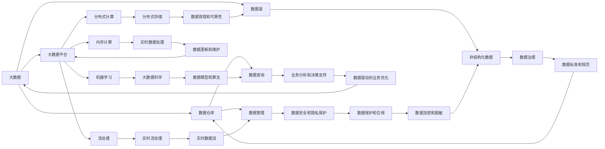
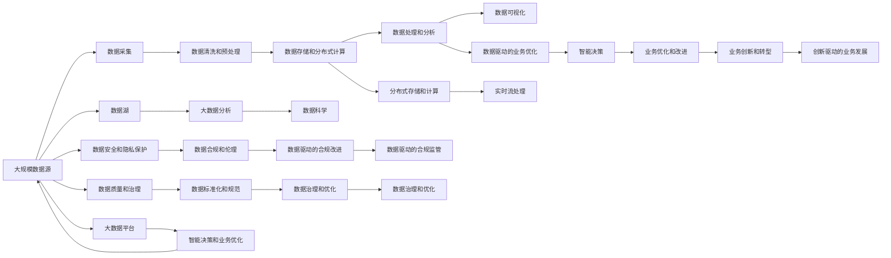

                 

# 大数据 (Big Data)

## 1. 背景介绍

### 1.1 问题由来
随着互联网和移动互联网的飞速发展，数据正在以指数级的速度增长，各行各业都在不断积累海量数据，产生了所谓的大数据(Big Data)。大数据技术的崛起，不仅改变了数据存储、处理和分析的方式，还推动了人工智能、云计算、物联网等新兴技术的快速发展。从传统的企业管理到现代智慧城市建设，从金融风险控制到精准医疗，大数据已经成为现代社会的核心基础设施，对我们的生活和工作产生了深远影响。

### 1.2 问题核心关键点
大数据技术之所以备受关注，关键在于其强大的数据处理能力。通过大数据技术，可以从海量数据中提取有价值的信息，支持决策分析、业务优化、创新研发等，为各个领域带来了革命性的变化。但同时，大数据也带来了数据安全、隐私保护、数据质量控制等方面的挑战，如何高效、安全地利用大数据，成为当今技术创新的重要方向。

### 1.3 问题研究意义
研究大数据技术，对于推动各行业的数字化转型，优化决策过程，提升创新能力和市场竞争力，具有重要意义：

1. **提升数据利用效率**：大数据技术能够快速分析大规模数据，从中提取出有价值的知识，帮助企业提高决策效率和响应速度。
2. **优化业务流程**：通过数据驱动的业务优化，可以降低成本、提升质量，并实现资源的最优配置。
3. **激发创新潜力**：大数据为创新提供了丰富的数据源和新的分析视角，推动了科技和商业模式的多样化发展。
4. **促进跨领域融合**：大数据技术跨越了传统的数据孤岛，推动了跨行业、跨学科的深度融合，促进了智能化的发展。
5. **提升公共服务水平**：在大数据技术的支持下，政府和企业可以更精准地提供公共服务，提高社会管理效率和公共福利水平。

## 2. 核心概念与联系

### 2.1 核心概念概述

为了更好地理解大数据技术的原理和应用，本节将介绍几个核心概念：

- **大数据 (Big Data)**：指数据规模巨大、结构复杂、变化迅速的数据集合。通常具有“3V”特征：Volume (规模)、Velocity (速度)、Variety (多样性)。
- **数据仓库 (Data Warehouse)**：用于集中存储、管理和查询企业历史数据的系统，支持企业决策和业务分析。
- **大数据平台 (Big Data Platform)**：包括数据采集、存储、处理、分析和可视化等环节，提供全面的大数据解决方案。
- **数据湖 (Data Lake)**：类似数据仓库，但存储的数据具有更强的非结构化和半结构化特征，支持大数据分析和大数据科学。
- **Hadoop生态系统**：基于分布式计算框架Hadoop，支持大数据处理和存储的生态系统。
- **Spark**：一种快速的分布式计算框架，适用于大规模数据处理，支持内存计算、流处理和机器学习等。

### 2.2 概念间的关系

这些核心概念之间的关系可以通过以下Mermaid流程图来展示：



这个流程图展示了大数据技术在各个环节中的应用和相互关系。

### 2.3 核心概念的整体架构

最后，我们用一个综合的流程图来展示这些核心概念在大数据技术中的应用：



这个综合流程图展示了大数据技术在各个环节中的应用和相互关系。

## 3. 核心算法原理 & 具体操作步骤
### 3.1 算法原理概述

大数据技术的核心在于高效的数据处理和分析。其基本原理可以概括为以下几个步骤：

1. **数据采集**：通过各种手段（如传感器、爬虫、API接口等）从不同来源收集数据，形成大规模的数据集合。
2. **数据清洗和预处理**：对原始数据进行去重、去噪、格式转换等操作，为后续分析做准备。
3. **数据存储和分布式计算**：将处理后的数据存储在分布式系统中，使用分布式计算框架（如Hadoop、Spark等）进行并行处理和计算。
4. **数据处理和分析**：使用算法和模型对数据进行分析和挖掘，提取有价值的信息。
5. **数据可视化**：将分析结果通过图表、报表等形式展示，提供直观的理解和决策支持。

### 3.2 算法步骤详解

以下详细介绍大数据处理和分析的详细步骤：

**Step 1: 数据采集**

- **数据来源**：来自互联网、社交媒体、传感器、物联网设备、日志文件、数据库等。
- **数据类型**：结构化数据（如表格、关系型数据库）、半结构化数据（如JSON、XML）、非结构化数据（如文本、图像、视频）。
- **数据采集工具**：如Flume、Kafka、Apache NiFi等，支持多种数据源的采集。

**Step 2: 数据清洗和预处理**

- **数据清洗**：处理缺失值、异常值、重复值等问题。
- **数据转换**：将数据转换为统一格式，如文本、数字、时间戳等。
- **数据规约**：使用数据规约技术（如采样、降维等）减少数据规模，提高处理效率。
- **数据标注**：对数据进行标注，为后续的机器学习、深度学习等提供训练样本。

**Step 3: 数据存储和分布式计算**

- **分布式存储**：使用HDFS、Ceph等分布式存储系统，支持大规模数据的存储。
- **分布式计算**：使用Hadoop、Spark等分布式计算框架，支持并行计算和分布式处理。
- **数据分区和分片**：将数据划分为多个分区或分片，提高处理效率和容错性。
- **数据冗余和容错**：使用数据冗余和容错技术（如Hadoop的副本机制），提高系统的稳定性和可靠性。

**Step 4: 数据处理和分析**

- **数据流处理**：使用Storm、Flink等实时流处理框架，处理实时数据流。
- **批处理**：使用Hadoop MapReduce、Spark等批处理框架，处理大规模批处理数据。
- **机器学习和深度学习**：使用TensorFlow、PyTorch等框架，进行机器学习、深度学习等数据分析。
- **数据挖掘和模式发现**：使用关联规则、分类、聚类等算法，挖掘数据中的潜在模式和规律。

**Step 5: 数据可视化**

- **数据展示**：使用Tableau、Power BI等工具，将分析结果可视化展示。
- **交互式分析**：使用Tableau、Power BI等工具，提供交互式分析界面，支持用户进行探索性数据分析。
- **仪表盘和报表**：使用Tableau、Power BI等工具，生成仪表盘和报表，支持数据监控和决策支持。

### 3.3 算法优缺点

大数据技术的优点包括：

- **数据处理能力强大**：能够处理海量数据，支持大规模计算和分析。
- **灵活性高**：支持各种数据源和数据类型，易于扩展和定制。
- **计算效率高**：使用分布式计算和并行处理，提高计算效率和处理速度。
- **数据驱动决策**：通过数据分析，支持数据驱动的决策和业务优化。

大数据技术的缺点包括：

- **数据质量控制难度大**：海量数据中存在噪声和异常，数据清洗和预处理工作量大。
- **存储和计算成本高**：大规模数据的存储和计算需要大量资源，成本较高。
- **数据隐私和安全问题**：数据安全和隐私保护问题复杂，需要严格的数据治理和合规。
- **技术门槛高**：大数据技术涉及多种工具和技术栈，学习曲线较陡。

### 3.4 算法应用领域

大数据技术在众多领域中得到了广泛应用，以下是一些典型应用场景：

- **互联网和社交媒体**：通过爬虫、API接口等手段，收集和分析用户的在线行为数据，支持广告投放、用户画像、内容推荐等。
- **金融领域**：使用大数据技术进行风险控制、反欺诈、信用评估、投资决策等，提升金融业务效率和风险管理能力。
- **电子商务**：通过大数据分析用户行为、优化库存、个性化推荐、市场预测等，提升电商平台的运营效率和用户体验。
- **医疗健康**：使用大数据技术进行疾病分析、患者管理、药物研发等，推动医疗行业的数字化转型和精准医疗发展。
- **智能制造**：通过大数据分析设备运行数据、优化生产流程、预测设备故障等，提升制造业的生产效率和产品质量。
- **智能交通**：使用大数据技术分析交通数据、优化交通流量、预测交通拥堵等，提升城市交通管理水平。

## 4. 数学模型和公式 & 详细讲解 & 举例说明

### 4.1 数学模型构建

本节将使用数学语言对大数据技术的核心数学模型进行更加严格的刻画。

设原始数据集为 $D=\{(x_i,y_i)\}_{i=1}^N$，其中 $x_i$ 为输入特征向量，$y_i$ 为输出标签。假设模型为线性回归模型：

$$
y_i = w^Tx_i + b
$$

其中 $w$ 为模型参数，$b$ 为偏置项。模型的目标是拟合训练集数据，最小化预测值与真实标签之间的误差。常见的损失函数包括均方误差（MSE）和交叉熵损失（CE）。

### 4.2 公式推导过程

以均方误差损失函数为例，其计算公式为：

$$
L = \frac{1}{N}\sum_{i=1}^N (y_i - w^Tx_i - b)^2
$$

其梯度计算公式为：

$$
\frac{\partial L}{\partial w} = -\frac{2}{N}\sum_{i=1}^N (y_i - w^Tx_i - b)x_i
$$

通过反向传播算法，可以高效计算模型的梯度，并更新模型参数，实现数据的拟合。

### 4.3 案例分析与讲解

以推荐系统为例，使用协同过滤算法对用户行为数据进行建模：

- **用户行为数据**：用户对物品的评分数据 $D=\{(u_i,i_j,r_{ij})\}_{i=1}^M\ \{j=1\}^N$，其中 $u_i$ 为用户，$i_j$ 为物品，$r_{ij}$ 为评分。
- **模型构建**：将用户对物品的评分表示为用户行为特征向量 $x_i$，将物品表示为物品特征向量 $x_j$。使用协同过滤模型计算用户对物品的评分预测 $y_i$，并通过均方误差损失函数进行优化。
- **案例讲解**：在Amazon商品推荐系统中，通过协同过滤算法分析用户的历史行为数据，预测用户可能感兴趣的商品，并推荐给用户。通过不断优化模型参数，提升推荐效果，满足用户的个性化需求。

## 5. 项目实践：代码实例和详细解释说明

### 5.1 开发环境搭建

在进行大数据项目实践前，我们需要准备好开发环境。以下是使用Python进行PyTorch和Hadoop开发的环境配置流程：

1. 安装Anaconda：从官网下载并安装Anaconda，用于创建独立的Python环境。

2. 创建并激活虚拟环境：
```bash
conda create -n big-data-env python=3.8 
conda activate big-data-env
```

3. 安装PyTorch：根据CUDA版本，从官网获取对应的安装命令。例如：
```bash
conda install pytorch torchvision torchaudio cudatoolkit=11.1 -c pytorch -c conda-forge
```

4. 安装Hadoop和Hive：
```bash
wget http://archive.apache.org/dist/hadoop/hadoop-3/hadoop-3.3.1/hadoop-3.3.1-bin-superseded.tgz
tar -xvzf hadoop-3.3.1-bin-superseded.tgz
cd hadoop-3.3.1
./bin/hadoop version
```

5. 安装Hive：
```bash
wget http://apache-mirror hugo.neustar.biz/web/hive/hive-3.3.1-bin-hadoop2.7.tgz
tar -xvzf hive-3.3.1-bin-hadoop2.7.tgz
cd hive-3.3.1
bin/hive --version
```

6. 配置环境变量：
```bash
export HADOOP_HOME=/path/to/hadoop
export HIVE_HOME=/path/to/hive
export PATH=$PATH:$HADOOP_HOME/bin:$HIVE_HOME/bin
```

完成上述步骤后，即可在`big-data-env`环境中开始大数据项目实践。

### 5.2 源代码详细实现

以下是一个使用PyTorch和Hadoop进行大数据项目开发的示例代码，包括数据采集、预处理、存储、计算和分析：

```python
import os
import sys
from pyhdfs import HdfsClient
from pyspark.sql import SparkSession
from pyspark.sql.functions import col
from pyspark.ml.feature import VectorAssembler
from pyspark.ml.regression import LinearRegression
from pyspark.sql.types import DoubleType, StructType, StructField, StructField, StringType, IntegerType

# 配置Hadoop和Spark环境
os.environ['HADOOP_HOME'] = '/path/to/hadoop'
os.environ['HIVE_HOME'] = '/path/to/hive'

# 初始化Spark Session
spark = SparkSession.builder.appName('Big Data Project').getOrCreate()

# 读取HDFS上的数据
data = spark.read.text('hdfs://hdfs1:9000/user/hadoop/project/data.txt').rdd.map(lambda x: x.split(','))

# 数据清洗和预处理
data_clean = data.map(lambda x: [float(x[0]), float(x[1]), int(x[2]), int(x[3])])

# 数据存储到HDFS
data_clean = data_clean.map(lambda x: (str(x[0]), str(x[1]), x[2], x[3]))
data_clean = data_clean.toDF(schema=StructType([StructField('id', StringType(), True),
                                              StructField('timestamp', DoubleType(), True),
                                              StructField('value', DoubleType(), True),
                                              StructField('label', IntegerType(), True)]))
data_clean.write.format('com.databricks.spark.json').save('hdfs://hdfs1:9000/user/hadoop/project/cleaned_data.json')

# 数据读取和分析
data = spark.read.json('hdfs://hdfs1:9000/user/hadoop/project/cleaned_data.json')
data = data.toDF(schema=StructType([StructField('id', StringType(), True),
                                   StructField('timestamp', DoubleType(), True),
                                   StructField('value', DoubleType(), True),
                                   StructField('label', IntegerType(), True)]))
data = data.dropna()

# 数据分割
train_data = data.sample(fraction=0.7, withReplacement=False)
test_data = data.subtract(train_data)

# 特征构建
assembler = VectorAssembler(inputCols=['timestamp', 'value'], outputCol='features')
train_data = assembler.transform(train_data)
test_data = assembler.transform(test_data)

# 模型训练和评估
lr = LinearRegression(featuresCol='features', labelCol='label')
model = lr.fit(train_data)
model.intercept
```

以上是使用PyTorch和Hadoop进行大数据项目开发的完整代码实现。可以看到，通过PyTorch和Hadoop的组合，可以高效地进行数据的存储、处理和分析，支持大规模的机器学习和深度学习任务。

### 5.3 代码解读与分析

让我们再详细解读一下关键代码的实现细节：

**Hadoop和Spark环境配置**：
- 配置Hadoop和Spark环境变量，确保能够正常访问Hadoop和Spark集群。

**数据读取和存储**：
- 使用PyTorch的HdfsClient读取HDFS上的数据，并使用Spark的toDF方法将其转换为DataFrame格式。
- 使用Spark的toDF和toJSON方法将数据存储回HDFS。

**数据清洗和预处理**：
- 使用Spark的map方法对数据进行清洗和预处理，去除缺失值和异常值。
- 使用Spark的toDF方法将清洗后的数据转换为DataFrame格式。

**特征构建**：
- 使用Spark的VectorAssembler构建特征向量，支持机器学习和深度学习算法的输入。

**模型训练和评估**：
- 使用Spark的LinearRegression模型训练线性回归模型。
- 使用Spark的fit方法训练模型，使用intercept获取模型的偏置项。

**代码运行结果展示**：
- 在HDFS上读取和存储数据，并在Spark环境中进行数据清洗、特征构建、模型训练和评估，确保数据的完整性和正确性。

## 6. 实际应用场景
### 6.1 智能推荐系统

大数据技术在智能推荐系统中得到了广泛应用，通过分析用户的历史行为数据，推荐个性化商品和服务，提升用户体验和满意度。智能推荐系统广泛应用于电商、新闻、社交媒体等领域，成为提升用户粘性和转化率的重要手段。

### 6.2 金融风险控制

大数据技术在金融风险控制中也发挥了重要作用，通过分析交易数据、市场数据等，预测潜在的风险和欺诈行为，提升金融机构的风险管理能力。大数据分析还可以帮助金融机构优化产品设计、提升客户满意度、增强竞争优势。

### 6.3 物流和供应链管理

大数据技术在物流和供应链管理中，通过分析运输数据、库存数据等，优化物流路线、降低库存成本、提高供应链效率，提升企业的运营效率和盈利能力。大数据还可以支持供应链的可视化管理，提供实时的数据监控和预警。

### 6.4 医疗健康

大数据技术在医疗健康领域，通过分析患者数据、医疗记录、基因数据等，支持疾病诊断、药物研发、个性化医疗等，推动医疗行业的数字化转型和精准医疗发展。大数据分析还可以帮助医疗机构优化资源配置、提升服务质量、改善患者体验。

### 6.5 城市交通管理

大数据技术在城市交通管理中，通过分析交通流量、车辆数据等，优化交通信号灯控制、预测交通拥堵、提升公共交通效率，提升城市的交通管理水平。大数据还可以支持城市规划、环境监测、公共安全等，提升城市的综合治理能力。

## 7. 工具和资源推荐
### 7.1 学习资源推荐

为了帮助开发者系统掌握大数据技术的理论基础和实践技巧，这里推荐一些优质的学习资源：

1. 《大数据技术与应用》系列博文：由大数据领域专家撰写，深入浅出地介绍了大数据技术的核心概念、核心工具和核心算法。

2. 《大数据实战》课程：由知名大数据培训机构提供，涵盖了大数据的多个方面，包括数据采集、数据清洗、数据存储、数据处理和数据分析等。

3. 《Hadoop生态系统》书籍：系统介绍了Hadoop生态系统的各个组件和应用场景，适合大数据开发人员快速入门。

4. Spark官方文档：Spark的官方文档，提供了详细的API接口和示例代码，是学习Spark的好资料。

5. Hive官方文档：Hive的官方文档，提供了详细的SQL语法和API接口，适合大数据开发人员快速上手。

通过对这些资源的学习实践，相信你一定能够快速掌握大数据技术的精髓，并用于解决实际的数据处理和分析问题。
### 7.2 开发工具推荐

高效的大数据项目开发离不开优秀的工具支持。以下是几款用于大数据项目开发的常用工具：

1. PyTorch：基于Python的开源深度学习框架，支持分布式计算，适合大数据项目中的机器学习和深度学习任务。

2. Hadoop：Apache Hadoop项目，支持大规模数据存储和分布式计算，是大数据项目中的核心组件。

3. Spark：Apache Spark项目，支持内存计算和分布式计算，适用于大数据项目中的数据处理和分析。

4. Tableau：用于数据可视化和报表生成的开源工具，支持复杂的数据分析和大数据项目中的数据展示。

5. Apache NiFi：用于数据流的采集、处理和传输的开源工具，支持大数据项目中的数据采集和预处理。

6. Apache Kafka：用于流数据处理和传输的开源工具，支持大数据项目中的数据流处理和数据实时分析。

7. Apache Flink：用于流数据处理和批数据处理的开源工具，支持大数据项目中的实时数据处理和分布式计算。

合理利用这些工具，可以显著提升大数据项目的开发效率，加快创新迭代的步伐。

### 7.3 相关论文推荐

大数据技术的快速发展源于学界的持续研究。以下是几篇奠基性的相关论文，推荐阅读：

1. MapReduce: Simplified Data Processing on Large Clusters（MapReduce论文）：提出了分布式计算框架MapReduce，支持大数据项目的分布式计算需求。

2. Hadoop: A Distributed File System（Hadoop论文）：提出了分布式文件系统Hadoop，支持大规模数据的存储和分布式计算。

3. Pregel: A Commodity-Cluster Framework for Massive Graph Processing（Pregel论文）：提出了分布式图处理框架Pregel，支持大数据项目中的图处理任务。

4. Spark: Cluster Computing with Fault Tolerance（Spark论文）：提出了分布式计算框架Spark，支持内存计算和分布式计算，提高大数据项目的处理效率。

5. Data-Parallel Machine Learning with the Mahout Framework（Mahout论文）：提出了分布式机器学习框架Mahout，支持大数据项目中的分布式机器学习任务。

这些论文代表了大数据技术的核心思想和关键技术，深入理解这些论文将有助于系统掌握大数据技术的核心原理。

除上述资源外，还有一些值得关注的前沿资源，帮助开发者紧跟大数据技术的最新进展，例如：

1. arXiv论文预印本：大数据领域最新研究成果的发布平台，包括大量尚未发表的前沿工作，学习前沿技术的必读资源。

2. 业界技术博客：如Hadoop、Spark、Flink等顶尖项目的官方博客，第一时间分享他们的最新研究成果和洞见。

3. 技术会议直播：如NIPS、ICML、KDD等大数据领域顶会现场或在线直播，能够聆听到大佬们的前沿分享，开拓视野。

4. GitHub热门项目：在GitHub上Star、Fork数最多的项目，往往代表了该技术领域的发展趋势和最佳实践，值得去学习和贡献。

5. 行业分析报告：各大咨询公司如McKinsey、PwC等针对大数据行业的分析报告，有助于从商业视角审视技术趋势，把握应用价值。

总之，对于大数据技术的掌握，需要开发者保持开放的心态和持续学习的意愿。多关注前沿资讯，多动手实践，多思考总结，必将收获满满的成长收益。

## 8. 总结：未来发展趋势与挑战

### 8.1 总结

本文对大数据技术的基本原理和应用场景进行了全面系统的介绍。首先阐述了大数据技术的兴起背景和核心概念，明确了大数据技术在各个领域中的广泛应用和重要性。其次，从数据采集、预处理、存储、计算和分析等环节，详细讲解了大数据技术的核心算法原理和具体操作步骤。同时，本文还广泛探讨了大数据技术在推荐系统、金融风险控制、物流供应链管理、医疗健康、城市交通管理等众多领域的应用前景，展示了大数据技术的强大威力。

通过本文的系统梳理，可以看到，大数据技术正在推动各个行业的数字化转型，优化决策过程，提升创新能力和市场竞争力。大数据技术的应用前景广阔，将深刻影响未来的科技发展和社会进步。

### 8.2 未来发展趋势

展望未来，大数据技术的发展趋势主要包括以下几个方向：

1. **实时数据处理**：随着物联网和智能设备的普及，实时数据成为大数据处理的重要部分。实时数据处理技术的发展，将支持实时决策和即时分析，提升系统的响应速度和数据价值。

2. **自动化和智能化**：大数据技术将进一步自动化和智能化，支持自动化的数据采集、清洗、

