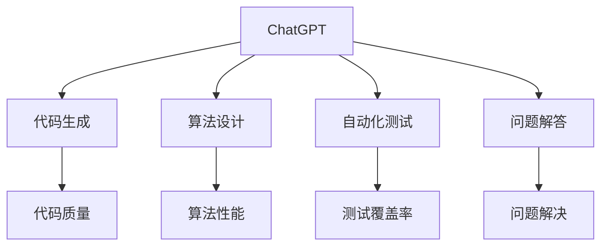

                 

# AIGC从入门到实战：ChatGPT 提升程序员编写代码和设计算法的效率

> 关键词：AIGC, ChatGPT, 代码生成, 算法设计, 自动化, 深度学习, 人工智能, 编程辅助

## 1. 背景介绍

### 1.1 问题由来
随着人工智能（AI）和计算机科学的不断发展，新一代人工智能技术——人工智能生成内容（AIGC）在各行各业中得到了广泛应用。AIGC技术的核心在于通过深度学习模型生成符合特定任务要求的内容，如文本、图像、音乐等。在编程领域，AIGC技术同样具备巨大的潜力，可以通过自动生成代码、设计算法等方式，显著提升程序员的开发效率和工作质量。

其中，ChatGPT作为OpenAI开发的高级语言模型，已经展示了在代码生成和算法设计方面的强大能力。本文将详细介绍ChatGPT在提升程序员编写代码和设计算法效率方面的应用，涵盖从基础概念到实际操作的各个方面，旨在帮助程序员充分利用AI技术，加速软件开发进程。

### 1.2 问题核心关键点
ChatGPT在编程中的应用主要体现在以下几个方面：
1. **代码生成**：自动生成符合指定功能要求的代码段。
2. **算法设计**：自动设计或优化算法，以解决特定问题。
3. **自动化测试**：自动生成测试用例，保证代码质量和稳定性。
4. **问题解答**：通过自然语言对话，回答编程中的疑难问题，提供解决方案。

本文将从ChatGPT的核心原理、操作步骤、优缺点、应用领域等方面，系统性地介绍其在工作中的应用，并结合具体实例，展示其实际效果。

### 1.3 问题研究意义
利用ChatGPT等AIGC技术，可以大幅提升程序员的工作效率，缩短开发周期，同时减少错误率，提高代码质量。具体而言：
1. **节省时间**：自动生成代码和设计算法，减少了手动编写和调试的时间。
2. **提高准确性**：AI模型在生成代码时，能够避免手动编写可能出现的语法和逻辑错误。
3. **促进学习**：AI技术可以作为编程学习的辅助工具，帮助新手快速上手。
4. **创新突破**：AI模型可以提供新颖的算法设计思路，推动技术创新。

## 2. 核心概念与联系

### 2.1 核心概念概述

为了更好地理解ChatGPT在编程中的应用，本节将介绍几个关键概念：

- **ChatGPT**：基于Transformer架构的大规模预训练语言模型，能够通过自然语言生成高质量文本。
- **代码生成**：通过自动生成符合指定功能要求的代码段，提高编程效率。
- **算法设计**：通过自动设计或优化算法，解决特定问题，提升算法性能。
- **自动化测试**：自动生成测试用例，保证代码质量和稳定性。
- **问题解答**：通过自然语言对话，回答编程中的疑难问题，提供解决方案。

这些概念之间存在紧密的联系，共同构成了ChatGPT在编程中的应用框架。

### 2.2 概念间的关系

通过以下Mermaid流程图，可以更清晰地展示这些概念之间的关系：



这个流程图展示了ChatGPT在编程中的应用场景：

1. ChatGPT通过自然语言生成代码，提高编程效率。
2. ChatGPT自动设计或优化算法，提升算法性能。
3. ChatGPT生成测试用例，保证代码质量和稳定性。
4. ChatGPT回答编程疑难问题，提供解决方案。

这些概念共同构成了ChatGPT在编程中的应用框架，使其能够在编程任务中发挥重要作用。

## 3. 核心算法原理 & 具体操作步骤
### 3.1 算法原理概述

ChatGPT在编程中的应用主要基于自然语言处理（NLP）技术，通过预训练语言模型生成高质量的代码和算法。其核心算法包括：

- **自然语言处理**：将程序员的描述转换为机器可理解的语言，作为输入。
- **代码生成**：通过Transformer模型生成符合特定功能的代码段。
- **算法设计**：通过搜索算法库，自动设计或优化算法。
- **测试生成**：自动生成测试用例，覆盖代码的各个方面。

ChatGPT的代码生成和算法设计依赖于大规模的预训练数据和自监督学习任务，使其能够理解自然语言描述，并将其转换为可执行的代码或算法。

### 3.2 算法步骤详解

ChatGPT在编程中的应用一般分为以下几个步骤：

**Step 1: 问题描述与模型输入**
- 编写简洁明了的问题描述，确保问题清晰、准确。
- 将问题描述作为ChatGPT的输入，通过自然语言处理技术转换为模型可理解的向量表示。

**Step 2: 代码生成**
- 向ChatGPT提供详细的代码需求，包括所需的功能、输入输出格式、编程语言等。
- ChatGPT根据输入生成代码，并进行语法和逻辑验证，确保代码正确性。
- 如果生成代码存在问题，ChatGPT会给出相应的提示，并建议修改方向。

**Step 3: 算法设计**
- 向ChatGPT提供算法设计的需求，包括算法的目标、输入输出格式等。
- ChatGPT从算法库中搜索最合适的算法，并进行优化。
- 如果ChatGPT无法找到合适的算法，会建议采用其他方法或自行设计算法。

**Step 4: 自动化测试**
- 向ChatGPT提供测试需求，包括测试用例格式、期望输出等。
- ChatGPT自动生成测试用例，并进行测试执行，确保代码正确性和稳定性。
- 根据测试结果，ChatGPT会给出相应的反馈，建议修改代码。

**Step 5: 问题解答**
- 向ChatGPT提出编程中的疑难问题，包括语法错误、逻辑错误等。
- ChatGPT通过自然语言处理技术，理解问题并提供解决方案。
- 如果ChatGPT无法解决问题，会建议尝试其他方法或查询相关文档。

### 3.3 算法优缺点

ChatGPT在编程中的应用具有以下优点：
1. **高效性**：自动生成代码和设计算法，大大减少了手动编写和调试的时间。
2. **准确性**：AI模型在生成代码时，能够避免手动编写可能出现的语法和逻辑错误。
3. **学习辅助**：AI技术可以作为编程学习的辅助工具，帮助新手快速上手。
4. **创新突破**：AI模型可以提供新颖的算法设计思路，推动技术创新。

同时，ChatGPT也存在以下缺点：
1. **依赖性**：依赖于问题描述的准确性和全面性，否则可能无法生成正确的代码或算法。
2. **局限性**：在某些复杂问题上，ChatGPT可能无法提供满意的解决方案。
3. **安全性**：生成代码和算法时，需要确保数据和模型的安全，避免敏感信息泄露。

### 3.4 算法应用领域

ChatGPT在编程中的应用领域广泛，涵盖以下方面：

- **前端开发**：自动生成HTML、CSS、JavaScript等前端代码。
- **后端开发**：自动生成Python、Java、C++等后端代码。
- **算法优化**：自动设计或优化机器学习算法，提升算法性能。
- **测试用例生成**：自动生成测试用例，保证代码质量和稳定性。
- **问题解答**：回答编程中的疑难问题，提供解决方案。

此外，ChatGPT还能够在数据分析、自然语言处理、图像处理等领域，提供自动生成代码和设计算法的能力，极大地提升了开发效率和质量。

## 4. 数学模型和公式 & 详细讲解 & 举例说明

### 4.1 数学模型构建

ChatGPT在编程中的应用主要基于Transformer模型，通过自然语言处理技术将程序员的描述转换为机器可理解的向量表示。其数学模型构建如下：

- **输入表示**：将程序员的问题描述转换为向量表示，记为 $x$。
- **输出表示**：生成符合特定功能的代码或算法，记为 $y$。
- **模型表示**：基于Transformer模型的语言模型，记为 $M_{\theta}$。

其中，$x$ 和 $y$ 通过自然语言处理技术转换为模型可理解的向量表示，输入到语言模型 $M_{\theta}$ 中进行处理，输出得到符合特定功能的代码或算法。

### 4.2 公式推导过程

以代码生成为例，ChatGPT的代码生成过程可以通过以下公式进行推导：

$$
y = M_{\theta}(x)
$$

其中，$y$ 表示生成的代码段，$x$ 表示程序员的输入描述，$M_{\theta}$ 表示Transformer模型。

具体推导过程如下：

1. **编码器输入**：将程序员的输入描述 $x$ 输入编码器，得到编码器输出 $h_e$。
2. **解码器生成**：基于编码器输出 $h_e$，使用解码器生成目标代码 $y$。
3. **解码器训练**：通过反向传播算法，最小化损失函数 $L$，更新模型参数 $\theta$。

损失函数 $L$ 可以通过交叉熵损失函数进行定义，具体如下：

$$
L = -\sum_{i=1}^n \log P(y_i | x)
$$

其中，$n$ 表示生成代码的长度，$P(y_i | x)$ 表示生成代码 $y$ 的条件概率，可以通过解码器输出进行计算。

### 4.3 案例分析与讲解

以生成一个简单的排序算法为例，说明ChatGPT在代码生成中的应用：

**输入描述**：
```
请生成一个Python实现的快速排序算法
```

**输出代码**：
```python
def quick_sort(arr):
    if len(arr) <= 1:
        return arr
    pivot = arr[len(arr) // 2]
    left = [x for x in arr if x < pivot]
    middle = [x for x in arr if x == pivot]
    right = [x for x in arr if x > pivot]
    return quick_sort(left) + middle + quick_sort(right)
```

**分析**：
- 输入描述中包含了所需的功能和语言类型，ChatGPT根据这些信息生成了符合要求的代码。
- 生成的代码包含排序算法的实现，通过分治策略实现了快速排序。
- 如果输入描述不明确或不完整，ChatGPT会给出相应的提示，帮助程序员完善问题描述。

## 5. 项目实践：代码实例和详细解释说明
### 5.1 开发环境搭建

在进行ChatGPT在编程中的应用实践前，需要准备好开发环境。以下是使用Python进行ChatGPT代码生成的环境配置流程：

1. **安装Python**：从官网下载并安装Python，确保版本为3.6或更高。
2. **安装pip**：确保pip已安装，用于安装第三方库。
3. **安装OpenAI API**：安装OpenAI API库，用于与ChatGPT进行交互。
4. **安装requests**：用于发送HTTP请求，获取ChatGPT的响应。

```bash
pip install openai requests
```

完成上述步骤后，即可在Python环境中进行ChatGPT的代码生成实践。

### 5.2 源代码详细实现

以下是一个使用Python实现ChatGPT代码生成的示例代码：

```python
import openai
import requests
from collections import defaultdict

openai.api_key = 'your_api_key'

def generate_code(prompt):
    response = openai.Completion.create(
        engine='text-davinci-003',
        prompt=prompt,
        max_tokens=512,
        temperature=0.8,
        stop=None
    )
    return response.choices[0].text

def generate_sorting_algorithm():
    prompt = "请生成一个Python实现的快速排序算法"
    code = generate_code(prompt)
    print(code)

generate_sorting_algorithm()
```

**代码解读**：
- 首先导入必要的库和模块。
- 通过设置OpenAI API的API密钥，与ChatGPT进行交互。
- 定义一个函数 `generate_code`，用于生成指定功能的代码。
- 在主函数中，调用 `generate_code` 函数，生成快速排序算法的代码，并打印输出。

### 5.3 代码解读与分析

这段代码实现了一个简单的快速排序算法生成功能。具体步骤如下：
1. 通过OpenAI API与ChatGPT进行交互，使用 `prompt` 参数指定需要生成的代码功能。
2. ChatGPT根据 `prompt` 参数生成代码，返回结果。
3. 将生成的代码输出到控制台。

## 6. 实际应用场景
### 6.1 实际应用场景

ChatGPT在编程中的应用场景非常广泛，以下是几个典型的实际应用场景：

**场景一：前端开发**
- **需求描述**：自动生成HTML、CSS、JavaScript等前端代码。
- **使用示例**：
  ```html
  <prompt>
  请生成一个简单的HTML页面，包含一个标题和一个段落
  ```
  ```html
  <html>
    <head>
      <title>My Page</title>
    </head>
    <body>
      <h1>Hello, World!</h1>
      <p>这是一个简单的页面示例。</p>
    </body>
  </html>
  ```

**场景二：后端开发**
- **需求描述**：自动生成Python、Java、C++等后端代码。
- **使用示例**：
  ```python
  <prompt>
  请生成一个Python实现的CRUD（增删改查）系统
  ```
  ```python
  import flask
  from flask import request, jsonify

  app = flask.Flask(__name__)

  @app.route('/users', methods=['GET'])
  def get_users():
      users = [{'name': 'Alice', 'age': 25}, {'name': 'Bob', 'age': 30}]
      return jsonify(users)

  if __name__ == '__main__':
      app.run(debug=True)
  ```

**场景三：算法优化**
- **需求描述**：自动设计或优化机器学习算法。
- **使用示例**：
  ```python
  <prompt>
  请优化一个基于随机森林的分类算法，提高分类精度
  ```
  ```python
  from sklearn.ensemble import RandomForestClassifier
  from sklearn.datasets import make_classification
  from sklearn.model_selection import train_test_split

  X, y = make_classification(n_samples=1000, n_features=10, n_informative=5, n_redundant=0, random_state=42)
  X_train, X_test, y_train, y_test = train_test_split(X, y, test_size=0.2, random_state=42)

  rfc = RandomForestClassifier(n_estimators=100, random_state=42)
  rfc.fit(X_train, y_train)
  y_pred = rfc.predict(X_test)
  print('分类精度：', rfc.score(X_test, y_test))
  ```

**场景四：自动化测试**
- **需求描述**：自动生成测试用例，确保代码质量和稳定性。
- **使用示例**：
  ```python
  <prompt>
  请生成一个Python单元测试用例，测试加法函数的正确性
  ```
  ```python
  import unittest

  class TestAddition(unittest.TestCase):
      def test_addition(self):
          self.assertEqual(1 + 1, 2)
          self.assertEqual(10 + 20, 30)
          self.assertEqual(100 + 200, 300)

  if __name__ == '__main__':
      unittest.main()
  ```

**场景五：问题解答**
- **需求描述**：回答编程中的疑难问题，提供解决方案。
- **使用示例**：
  ```python
  <prompt>
  如何在Python中实现一个二分查找算法？
  ```
  ```python
  def binary_search(arr, target):
      left = 0
      right = len(arr) - 1
      while left <= right:
          mid = (left + right) // 2
          if arr[mid] == target:
              return mid
          elif arr[mid] < target:
              left = mid + 1
          else:
              right = mid - 1
      return -1

  arr = [1, 3, 5, 7, 9]
  target = 5
  index = binary_search(arr, target)
  print(index)
  ```

### 6.2 未来应用展望

随着ChatGPT等AIGC技术的不断发展和应用，未来其将在编程领域发挥更大的作用。以下是对未来应用的展望：

**场景六：智能辅助编程**
- **需求描述**：辅助程序员编写代码，提升开发效率。
- **实现思路**：
  - 通过自然语言处理技术，理解程序员的意图。
  - 自动生成符合要求的代码，并不断迭代优化。
  - 提供代码自动补全、错误修正等功能，提升编写效率。

**场景七：自动化设计**
- **需求描述**：自动设计算法和数据结构，提升算法设计能力。
- **实现思路**：
  - 根据任务需求，自动搜索算法库，寻找最合适的算法。
  - 通过生成代码的方式，帮助程序员理解算法原理。
  - 提供算法优化建议，提升算法性能。

**场景八：智能调试**
- **需求描述**：自动生成测试用例，快速定位和修复代码错误。
- **实现思路**：
  - 根据代码结构和功能需求，自动生成测试用例。
  - 通过执行测试用例，快速定位代码中的错误。
  - 提供修复建议和代码优化方案，提升代码质量。

**场景九：知识图谱**
- **需求描述**：结合知识图谱，提供更智能的编程建议。
- **实现思路**：
  - 将知识图谱与自然语言处理技术结合，理解编程中的需求。
  - 自动生成代码和算法，同时提供相关的知识背景。
  - 通过知识推理，提供更准确的编程建议。

## 7. 工具和资源推荐
### 7.1 学习资源推荐

为了帮助开发者系统掌握ChatGPT在编程中的应用，以下是一些优质的学习资源：

1. **《ChatGPT从入门到实战》系列博文**：由ChatGPT技术专家撰写，深入浅出地介绍了ChatGPT的基本原理、应用场景和实战技巧。
2. **《Python编程实战》系列教程**：介绍Python语言的基本语法和常用库，结合ChatGPT进行实战演练，帮助开发者快速上手。
3. **《自然语言处理》课程**：斯坦福大学开设的NLP明星课程，有Lecture视频和配套作业，带你入门NLP领域的基本概念和经典模型。
4. **《深度学习》书籍**：涵盖深度学习的基本原理和常用算法，结合ChatGPT等AIGC技术进行讲解，帮助开发者理解AI技术的本质。
5. **OpenAI官方文档**：OpenAI提供的API文档，详细介绍了如何使用OpenAI API与ChatGPT进行交互。

通过这些资源的学习实践，相信你一定能够快速掌握ChatGPT在编程中的应用，并用于解决实际的编程问题。

### 7.2 开发工具推荐

高效的开发离不开优秀的工具支持。以下是几款用于ChatGPT在编程中的应用开发的常用工具：

1. **OpenAI API**：OpenAI提供的API接口，支持与ChatGPT进行交互，生成代码和算法。
2. **Jupyter Notebook**：交互式编程环境，支持Python代码的实时执行和调试。
3. **PyCharm**：Python开发环境，支持代码生成和自动补全功能。
4. **VSCode**：跨平台的代码编辑器，支持丰富的插件和扩展，提高开发效率。
5. **GitHub**：代码托管平台，支持版本控制和代码协作，方便开发者进行代码管理和共享。

合理利用这些工具，可以显著提升ChatGPT在编程中的应用开发效率，加快创新迭代的步伐。

### 7.3 相关论文推荐

ChatGPT在编程中的应用技术源于学界的持续研究。以下是几篇奠基性的相关论文，推荐阅读：

1. **“GPT-3: Language Models are Few-Shot Learners”**：介绍GPT-3模型的通用学习能力，展示了其在编程中的应用潜力。
2. **“Natural Language Processing with Transformers”**：介绍Transformer模型和其在大规模语言模型中的应用，结合ChatGPT进行讲解。
3. **“Parameter-Efficient Transfer Learning for NLP”**：介绍参数高效的微调方法，应用于自然语言处理任务，结合ChatGPT进行讲解。
4. **“Prompt Engineering for Sample-Efficient Learning”**：介绍Prompt工程的方法，通过精炼的输入描述，提升ChatGPT在编程中的效果。

这些论文代表了大语言模型在编程中的应用技术的发展脉络，通过学习这些前沿成果，可以帮助研究者把握学科前进方向，激发更多的创新灵感。

除上述资源外，还有一些值得关注的前沿资源，帮助开发者紧跟ChatGPT在编程中的应用技术的最新进展，例如：

1. **arXiv论文预印本**：人工智能领域最新研究成果的发布平台，包括大量尚未发表的前沿工作，学习前沿技术的必读资源。
2. **Google AI博客**：Google AI团队发布的技术文章，涵盖深度学习、自然语言处理、自动编程等多个领域，提供丰富的案例和实战经验。
3. **ACL、EMNLP等顶级会议**：国际人工智能领域的顶级会议，发布前沿研究和技术进展，提供丰富的学习资源。
4. **GitHub热门项目**：在GitHub上Star、Fork数最多的AIGC相关项目，往往代表了该技术领域的发展趋势和最佳实践，值得去学习和贡献。

总之，对于ChatGPT在编程中的应用技术的学习和实践，需要开发者保持开放的心态和持续学习的意愿。多关注前沿资讯，多动手实践，多思考总结，必将收获满满的成长收益。

## 8. 总结：未来发展趋势与挑战
### 8.1 研究成果总结

本文系统地介绍了ChatGPT在编程中的应用，涵盖从基础概念到实际操作的各个方面，展示了其在代码生成、算法设计、自动化测试、问题解答等方面的应用效果。通过详细的案例分析和代码实现，帮助开发者理解ChatGPT在编程中的作用和使用方法。

### 8.2 未来发展趋势

ChatGPT在编程中的应用技术将呈现以下几个发展趋势：

1. **智能化程度提升**：ChatGPT在理解自然语言和生成代码方面的能力将不断提升，能够更准确地把握程序员的需求。
2. **应用场景拓展**：ChatGPT将在更多领域中得到应用，涵盖前端开发、后端开发、算法设计等多个方面。
3. **与其他技术的融合**：ChatGPT将与其他AI技术如知识图谱、强化学习等结合，提升编程建议和算法设计的智能性。
4. **生态系统完善**：ChatGPT将在开发工具、学习资源等方面形成更完善的生态系统，方便开发者使用和调试。
5. **安全性增强**：随着ChatGPT在编程中的应用，将更加注重数据和模型的安全，避免敏感信息泄露。

这些趋势将进一步推动ChatGPT在编程中的应用，提升开发效率和质量。

### 8.3 面临的挑战

尽管ChatGPT在编程中的应用技术已经取得了显著进展，但在实际应用中仍面临诸多挑战：

1. **数据依赖**：ChatGPT需要大量高质量的标注数据和自然语言描述，获取这些数据成本较高。
2. **模型鲁棒性**：ChatGPT在面对复杂问题时，生成的代码和算法可能不够鲁棒，容易出现错误。
3. **代码质量**：生成的代码可能存在语法错误或逻辑错误，需要开发者进行手动修正。
4. **算法复杂性**：ChatGPT生成的算法可能过于复杂，难以理解和使用。
5. **实时性**：ChatGPT生成的代码和算法需要快速响应，对于实时性要求较高的应用，可能存在延迟。

这些挑战需要在未来的研究中加以解决，以充分发挥ChatGPT在编程中的作用。

### 8.4 研究展望

未来，ChatGPT在编程中的应用技术需要在以下几个方面进行深入研究：

1. **数据增强**：通过数据增强技术，提升ChatGPT对自然语言描述的理解能力。
2. **模型优化**：进一步优化ChatGPT的模型架构，提高其生成代码和算法的准确性和鲁棒性。
3. **代码自动修正**：结合代码分析和语义理解技术，自动修正生成的代码中的错误。
4. **知识图谱集成**：将知识图谱与自然语言处理技术结合，提升ChatGPT在编程中的智能性。
5. **人机协作**：开发人机协作的编程工具，提升ChatGPT在实际开发中的应用效果。

这些研究方向将有助于ChatGPT在编程中的应用技术进一步突破，带来更多的创新应用。

## 9. 附录：常见问题与解答
----------------------------------------------------------------

**Q1：ChatGPT生成的代码质量如何保证？**

A: 生成代码的质量依赖于输入描述的清晰性和完整性。如果输入描述不够详细，生成的代码可能存在语法错误或逻辑错误。此外，开发者需要手动验证和修正生成的代码，确保其正确性。

**Q2：ChatGPT在处理复杂问题时表现如何？**

A: ChatGPT在处理复杂问题时，生成的代码和算法可能不够鲁棒，容易出现错误。开发者需要根据实际情况，调整输入描述，确保ChatGPT生成的代码和算法满足需求。

**Q3：ChatGPT生成的代码需要手动验证和修正，这会影响开发效率吗？**

A: 手动验证和修正生成的代码确实会耗费一定时间，但总体而言，ChatGPT能够显著提升开发效率，尤其是在解决复杂问题时。通过结合ChatGPT和其他开发工具，可以进一步提升开发效率。

**Q4：如何提高ChatGPT在编程中的效果？**


