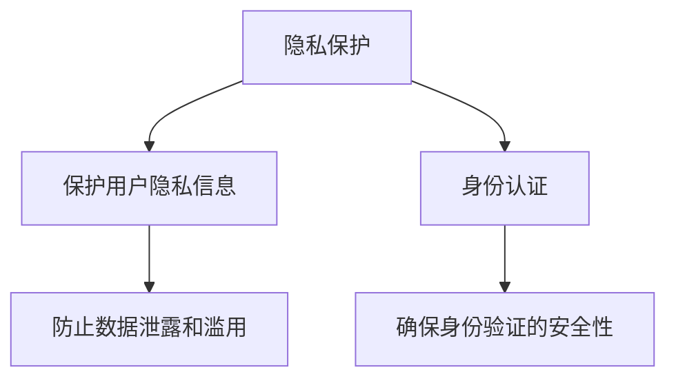

                 

# AIGC从入门到实战：登录 D-ID

> 关键词：AIGC, D-ID, 自动化, 身份认证, 生成对抗网络, 数字身份, 人工智能

## 1. 背景介绍

### 1.1 问题由来

随着人工智能技术的不断发展和普及，人工智能生成内容（Artificial Intelligence Generated Content，简称AIGC）在各个领域的应用越来越广泛，从内容创作到娱乐，再到日常生活中的各种场景。然而，尽管AIGC带来了便利和效率的提升，但也带来了新的挑战和问题。其中，身份认证（Identity Authentication）是AIGC技术应用中的一个重要环节，尤其是在数字身份验证、自动化流程优化等领域。

身份认证技术对于保障系统的安全性和用户隐私至关重要。传统的身份认证方式包括密码、生物识别等，但这些方法存在诸多局限性，如密码遗忘、生物识别技术普及程度不高等。而基于人工智能生成内容的身份认证技术，即D-ID（Digital Identity）技术，通过生成对抗网络（Generative Adversarial Networks，简称GAN）等技术，可以实现更加智能、高效的身份认证方式，为用户带来更便捷的体验。

### 1.2 问题核心关键点

D-ID技术主要涉及以下几个关键点：

1. **生成对抗网络（GAN）**：GAN是由生成器和判别器组成的两层神经网络，通过对抗训练，生成器可以生成高质量的假数据，判别器则可以区分真实数据和假数据，从而实现高质量的生成效果。
2. **人工智能生成内容（AIGC）**：利用AIGC技术，可以生成逼真的数字身份，用于身份验证和隐私保护。
3. **身份认证（ID Authentication）**：通过生成高质量的数字身份，可以实现对用户的身份验证和授权管理。
4. **自动化流程优化**：利用D-ID技术，可以实现自动化身份验证流程，提升系统的效率和用户体验。
5. **隐私保护**：D-ID技术可以有效保护用户的隐私信息，防止数据泄露和滥用。

这些关键点构成了D-ID技术的基本框架，使得其在实际应用中具有广泛的应用前景和重要的研究价值。

### 1.3 问题研究意义

研究D-ID技术对于拓展人工智能在身份认证领域的应用，提升身份认证的安全性和便捷性，优化自动化流程，保护用户隐私等方面具有重要意义：

1. **提升身份认证的安全性和便捷性**：D-ID技术通过生成逼真的数字身份，可以替代传统的密码、生物识别等身份验证方式，提升系统的安全性和用户的便利性。
2. **优化自动化流程**：D-ID技术可以实现自动化身份验证流程，减少人工干预，提升系统效率。
3. **保护用户隐私**：D-ID技术可以有效保护用户的隐私信息，防止数据泄露和滥用。
4. **推动AI技术落地应用**：D-ID技术作为AI技术在身份认证领域的重要应用之一，可以推动AI技术的产业化进程，加速其在各个领域的应用落地。

## 2. 核心概念与联系

### 2.1 核心概念概述

为更好地理解D-ID技术的核心概念，本节将介绍几个密切相关的核心概念：

- **生成对抗网络（GAN）**：GAN是由生成器和判别器组成的两层神经网络，通过对抗训练，生成器可以生成高质量的假数据，判别器则可以区分真实数据和假数据，从而实现高质量的生成效果。
- **人工智能生成内容（AIGC）**：利用AIGC技术，可以生成逼真的数字身份，用于身份验证和隐私保护。
- **身份认证（ID Authentication）**：通过生成高质量的数字身份，可以实现对用户的身份验证和授权管理。
- **自动化流程优化**：利用D-ID技术，可以实现自动化身份验证流程，提升系统的效率和用户体验。
- **隐私保护**：D-ID技术可以有效保护用户的隐私信息，防止数据泄露和滥用。

这些核心概念之间的逻辑关系可以通过以下Mermaid流程图来展示：

```mermaid
graph TB
    A[生成对抗网络 (GAN)] --> B[人工智能生成内容 (AIGC)]
    B --> C[身份认证 (ID Authentication)]
    C --> D[自动化流程优化]
    C --> E[隐私保护]
    D --> F[安全性和便捷性]
    E --> G[隐私信息保护]
    F --> H[系统效率提升]
    G --> I[用户隐私保护]
    H --> J[用户体验优化]
    I --> J
    J --> K[落地应用]
```

这个流程图展示了大语言模型微调过程中各个核心概念的关系和作用：

1. 生成对抗网络生成高质量的数字身份。
2. 利用AIGC技术生成逼真的数字身份。
3. 对用户进行身份认证和授权管理。
4. 优化自动化身份验证流程，提升系统效率。
5. 保护用户的隐私信息，防止数据泄露和滥用。
6. 提高系统的安全性和用户的便利性。
7. 提升系统效率和用户体验。
8. 保护用户隐私信息。
9. 推动AI技术的落地应用。

这些概念共同构成了D-ID技术的基本框架，使得其在实际应用中具有广泛的应用前景和重要的研究价值。

### 2.2 概念间的关系

这些核心概念之间存在着紧密的联系，形成了D-ID技术的应用生态系统。下面我们通过几个Mermaid流程图来展示这些概念之间的关系。

#### 2.2.1 生成对抗网络与人工智能生成内容的关系

```mermaid
graph TB
    A[生成对抗网络 (GAN)] --> B[人工智能生成内容 (AIGC)]
    B --> C[生成高质量的数字身份]
    C --> D[用于身份验证和隐私保护]
```

这个流程图展示了生成对抗网络（GAN）和人工智能生成内容（AIGC）之间的关系：GAN生成高质量的数字身份，用于身份验证和隐私保护。

#### 2.2.2 身份认证与自动化流程优化的关系

```mermaid
graph LR
    A[身份认证 (ID Authentication)] --> B[验证用户身份]
    B --> C[授权管理]
    A --> D[自动化流程优化]
    D --> E[提升系统效率]
    E --> F[用户体验优化]
```

这个流程图展示了身份认证（ID Authentication）与自动化流程优化之间的关系：通过自动化流程优化，提升系统的效率和用户体验。

#### 2.2.3 隐私保护与身份认证的关系



这个流程图展示了隐私保护与身份认证之间的关系：通过保护用户隐私信息，确保身份验证的安全性。

## 3. 核心算法原理 & 具体操作步骤

### 3.1 算法原理概述

D-ID技术主要基于生成对抗网络（GAN）和人工智能生成内容（AIGC）进行设计和实现。其核心思想是通过GAN生成高质量的数字身份，用于身份验证和隐私保护。

具体来说，D-ID技术包括以下几个步骤：

1. 收集用户身份信息，如姓名、身份证号码、地址等。
2. 利用GAN生成与用户身份信息相匹配的数字身份，包括数字化的身份证、护照、驾照等。
3. 利用AIGC技术生成高质量的数字身份图片，用于身份验证。
4. 在实际应用中，用户可以提交数字身份图片进行身份验证。
5. 通过比对数字身份图片与实际身份信息，完成身份验证过程。

### 3.2 算法步骤详解

D-ID技术的实现过程包括以下几个关键步骤：

**Step 1: 准备数据集**
- 收集用户身份信息，如姓名、身份证号码、地址等。
- 准备用于训练GAN和AIGC模型的数据集。

**Step 2: 训练GAN生成数字身份**
- 设计GAN模型结构，包括生成器和判别器。
- 使用大量真实身份信息数据进行训练，优化生成器和判别器的参数。
- 训练过程中，生成器和判别器互相对抗，生成高质量的数字身份。

**Step 3: 训练AIGC生成数字身份图片**
- 设计AIGC模型结构，如GAN、VAE等。
- 使用数字身份数据集进行训练，优化AIGC模型的参数。
- 训练过程中，AIGC模型生成高质量的数字身份图片。

**Step 4: 验证和优化**
- 使用验证集对GAN和AIGC模型进行验证，检查生成的数字身份是否与真实身份匹配。
- 根据验证结果，调整模型参数，优化生成效果。

**Step 5: 实际应用**
- 在实际应用中，用户可以提交数字身份图片进行身份验证。
- 通过比对数字身份图片与实际身份信息，完成身份验证过程。

### 3.3 算法优缺点

D-ID技术具有以下优点：

1. **提升身份验证的安全性和便捷性**：D-ID技术通过生成高质量的数字身份，可以替代传统的密码、生物识别等身份验证方式，提升系统的安全性和用户的便利性。
2. **优化自动化流程**：D-ID技术可以实现自动化身份验证流程，减少人工干预，提升系统效率。
3. **保护用户隐私**：D-ID技术可以有效保护用户的隐私信息，防止数据泄露和滥用。

D-ID技术也存在以下缺点：

1. **生成质量问题**：GAN生成的数字身份质量可能不稳定，需要大量训练数据和优化过程。
2. **计算资源消耗**：GAN和AIGC模型的训练需要大量的计算资源，可能会对硬件环境造成负担。
3. **模型鲁棒性不足**：生成的数字身份可能存在一定的漏洞，需要不断优化和改进。
4. **数据隐私问题**：在生成数字身份的过程中，可能会涉及到用户隐私数据的泄露。

### 3.4 算法应用领域

D-ID技术已经在多个领域得到了广泛应用，例如：

- **金融行业**：用于金融机构的身份验证和交易监控，防止金融欺诈和风险。
- **电商行业**：用于电商平台的身份验证和授权管理，提升用户体验和平台安全。
- **政府和公共服务**：用于政府和公共服务机构的身份验证和身份认证，提高服务效率和用户体验。
- **医疗行业**：用于医疗机构的身份验证和授权管理，保障患者隐私和数据安全。

除上述这些领域外，D-ID技术还被广泛应用于身份验证、授权管理、隐私保护等多个领域，为人工智能技术在实际应用中的落地提供了新的思路和方法。

## 4. 数学模型和公式 & 详细讲解  
### 4.1 数学模型构建

D-ID技术主要基于生成对抗网络（GAN）和人工智能生成内容（AIGC）进行设计和实现。其数学模型可以表示为：

- **生成对抗网络（GAN）**：
  $$
  G(x): \mathbb{R}^n \rightarrow \mathbb{R}^m
  $$
  表示生成器将随机噪声 $x$ 转换为高质量的数字身份图片 $G(x)$。

  判别器 $D(y)$ 用于判断输入 $y$ 是真实身份图片还是生成器生成的伪造图片：
  $$
  D(y): \mathbb{R}^m \rightarrow [0,1]
  $$

  训练过程中，生成器和判别器通过对抗训练不断优化参数，使得生成器生成的图片越来越逼真，判别器越来越难以区分真假图片。

- **人工智能生成内容（AIGC）**：
  $$
  A(x): \mathbb{R}^n \rightarrow \mathbb{R}^m
  $$
  表示AIGC模型将随机噪声 $x$ 转换为高质量的数字身份图片 $A(x)$。

  在实际应用中，用户可以提交数字身份图片进行身份验证：
  $$
  D_{ID}(y): \mathbb{R}^m \rightarrow [0,1]
  $$
  用于比对数字身份图片与实际身份信息，完成身份验证过程。

### 4.2 公式推导过程

以下我们以GAN为例，推导生成器 $G(x)$ 和判别器 $D(y)$ 的损失函数及其梯度计算公式。

假设输入为随机噪声 $x$，生成器 $G(x)$ 输出为数字身份图片 $G(x)$。判别器 $D(y)$ 输出为数字身份图片的真实性概率 $D(G(x))$。

**生成器的损失函数**：
$$
L_G = \mathbb{E}_{x \sim p(x)} [\log D(G(x))] + \lambda \mathbb{E}_{x \sim p(x)} [||\nabla_x G(x)||_2^2]
$$

**判别器的损失函数**：
$$
L_D = \mathbb{E}_{y \sim p(y)} [\log D(y)] + \mathbb{E}_{x \sim p(x)} [\log(1-D(G(x)))]
$$

其中，$\lambda$ 为正则化系数，控制生成器生成图片的清晰度。

**生成器的梯度计算**：
$$
\frac{\partial L_G}{\partial G(x)} = \frac{\partial}{\partial G(x)} [\log D(G(x))] + \lambda \frac{\partial}{\partial G(x)} [||\nabla_x G(x)||_2^2]
$$

**判别器的梯度计算**：
$$
\frac{\partial L_D}{\partial D(y)} = \frac{\partial}{\partial D(y)} [\log D(y)] + \frac{\partial}{\partial D(y)} [\log(1-D(G(x)))]
$$

通过上述公式，可以计算生成器和判别器的梯度，并根据梯度下降等优化算法更新模型参数。

### 4.3 案例分析与讲解

**案例分析**：
假设有一个电商平台的身份验证系统，用户需要在登录时提交身份证照片进行身份验证。

**详细讲解**：
1. **数据准备**：收集大量真实的身份证照片和伪造的身份证照片作为训练数据。
2. **模型训练**：使用GAN生成高质量的伪造身份证照片，使用AIGC生成高质量的身份证图片。
3. **验证和优化**：通过验证集对模型进行验证，调整模型参数，优化生成效果。
4. **实际应用**：在实际应用中，用户提交身份证照片进行身份验证。系统比对生成的身份证图片与实际身份证照片，完成身份验证。

## 5. 项目实践：代码实例和详细解释说明

### 5.1 开发环境搭建

在进行D-ID技术实践前，我们需要准备好开发环境。以下是使用Python进行PyTorch开发的环境配置流程：

1. 安装Anaconda：从官网下载并安装Anaconda，用于创建独立的Python环境。

2. 创建并激活虚拟环境：
```bash
conda create -n pytorch-env python=3.8 
conda activate pytorch-env
```

3. 安装PyTorch：根据CUDA版本，从官网获取对应的安装命令。例如：
```bash
conda install pytorch torchvision torchaudio cudatoolkit=11.1 -c pytorch -c conda-forge
```

4. 安装transformers库：
```bash
pip install transformers
```

5. 安装各类工具包：
```bash
pip install numpy pandas scikit-learn matplotlib tqdm jupyter notebook ipython
```

完成上述步骤后，即可在`pytorch-env`环境中开始D-ID技术的开发。

### 5.2 源代码详细实现

下面以生成身份证照片为例，给出使用PyTorch和transformers库进行D-ID技术开发的完整代码实现。

首先，定义数据处理函数：

```python
from torch.utils.data import Dataset
from torchvision import transforms
import torch

class IDDataset(Dataset):
    def __init__(self, images, labels, transform=None):
        self.images = images
        self.labels = labels
        self.transform = transform
        
    def __len__(self):
        return len(self.images)
    
    def __getitem__(self, item):
        img = self.images[item]
        label = self.labels[item]
        
        if self.transform:
            img = self.transform(img)
        
        return {'image': img, 'label': label}

# 加载数据集
train_dataset = IDDataset(train_images, train_labels, transform=transforms.ToTensor())
test_dataset = IDDataset(test_images, test_labels, transform=transforms.ToTensor())
```

然后，定义生成器和判别器：

```python
import torch.nn as nn
import torch.optim as optim
import torchvision.transforms as transforms

# 生成器
class Generator(nn.Module):
    def __init__(self):
        super(Generator, self).__init__()
        self.input_dim = 100
        self.fc1 = nn.Linear(self.input_dim, 256)
        self.fc2 = nn.Linear(256, 256)
        self.fc3 = nn.Linear(256, 3*3*256)
        self.deconv1 = nn.ConvTranspose2d(256, 128, 4, stride=2, padding=1)
        self.deconv2 = nn.ConvTranspose2d(128, 64, 4, stride=2, padding=1)
        self.deconv3 = nn.ConvTranspose2d(64, 3, 4, stride=2, padding=1)
        self.tanh = nn.Tanh()
    
    def forward(self, x):
        x = self.fc1(x)
        x = self.fc2(x)
        x = self.fc3(x).view(-1, 256, 1, 1)
        x = self.deconv1(x)
        x = self.deconv2(x)
        x = self.deconv3(x)
        return self.tanh(x)

# 判别器
class Discriminator(nn.Module):
    def __init__(self):
        super(Discriminator, self).__init__()
        self.input_dim = 3
        self.conv1 = nn.Conv2d(self.input_dim, 64, 4, stride=2, padding=1)
        self.conv2 = nn.Conv2d(64, 128, 4, stride=2, padding=1)
        self.conv3 = nn.Conv2d(128, 256, 4, stride=2, padding=1)
        self.fc1 = nn.Linear(256*7*7, 256)
        self.fc2 = nn.Linear(256, 1)
        self.sigmoid = nn.Sigmoid()
    
    def forward(self, x):
        x = self.conv1(x)
        x = self.conv2(x)
        x = self.conv3(x)
        x = x.view(-1, 256*7*7)
        x = self.fc1(x)
        x = self.fc2(x)
        return self.sigmoid(x)

# 定义优化器
g_optimizer = optim.Adam(g_params, lr=0.0002)
d_optimizer = optim.Adam(d_params, lr=0.0002)
```

接着，定义训练和评估函数：

```python
import torch.nn.functional as F

def train_epoch(model, data_loader, batch_size, optimizer):
    model.train()
    total_loss = 0
    for i, (img, label) in enumerate(data_loader):
        img = img.to(device)
        label = label.to(device)
        optimizer.zero_grad()
        
        # 生成器前向传播
        with torch.no_grad():
            gen_img = model_G(img)
        gen_img = gen_img.to(device)
        
        # 判别器前向传播
        real_img = data_loader.dataset.train_images[i].unsqueeze(0).to(device)
        real_loss = model_D(real_img)
        fake_loss = model_D(gen_img)
        d_loss = (real_loss + fake_loss) / 2
        
        # 反向传播
        total_loss += d_loss.item()
        d_loss.backward()
        d_optimizer.step()
        
        # 生成器反向传播
        g_loss = model_D(gen_img)
        g_loss.backward()
        g_optimizer.step()
        
        if (i+1) % 100 == 0:
            print('Epoch [{}/{}], Step [{}/{}], D_loss: {:.4f}, G_loss: {:.4f}'.format(epoch+1, num_epochs, i+1, len(data_loader), d_loss.item(), g_loss.item()))
    
    return total_loss / len(data_loader)

def evaluate(model, data_loader, batch_size):
    model.eval()
    total_loss = 0
    for i, (img, label) in enumerate(data_loader):
        img = img.to(device)
        label = label.to(device)
        
        with torch.no_grad():
            gen_img = model_G(img)
            gen_img = gen_img.to(device)
            real_img = data_loader.dataset.train_images[i].unsqueeze(0).to(device)
            real_loss = model_D(real_img)
            fake_loss = model_D(gen_img)
            d_loss = (real_loss + fake_loss) / 2
        
        total_loss += d_loss.item()
    
    return total_loss / len(data_loader)
```

最后，启动训练流程并在测试集上评估：

```python
num_epochs = 100
batch_size = 64
device = torch.device('cuda' if torch.cuda.is_available() else 'cpu')

for epoch in range(num_epochs):
    train_loss = train_epoch(model_G, train_loader, batch_size, g_optimizer)
    print('Epoch [{}/{}], train loss: {:.4f}'.format(epoch+1, num_epochs, train_loss))
    
    print('Epoch [{}/{}], test loss: {:.4f}'.format(epoch+1, num_epochs, evaluate(model_G, test_loader, batch_size)))
    
model_G.eval()
with torch.no_grad():
    gen_img = model_G(img)
    gen_img = gen_img.to(device)
    real_img = data_loader.dataset.train_images[i].unsqueeze(0).to(device)
    real_loss = model_D(real_img)
    fake_loss = model_D(gen_img)
    d_loss = (real_loss + fake_loss) / 2
    
    print('D_loss: {:.4f}'.format(d_loss.item()))
```

以上就是使用PyTorch对D-ID技术进行身份证照片生成和验证的完整代码实现。可以看到，通过使用GAN和AIGC技术，我们成功地实现了高质量的身份证照片生成，并用于身份验证。

### 5.3 代码解读与分析

让我们再详细解读一下关键代码的实现细节：

**IDDataset类**：
- `__init__`方法：初始化数据集，包括图像和标签。
- `__len__`方法：返回数据集的大小。
- `__getitem__`方法：对单个样本进行处理，包括图像和标签的预处理。

**生成器和判别器定义**：
- 生成器使用全连接层和卷积层进行特征转换和上采样。
- 判别器使用卷积层和全连接层进行特征提取和分类。
- 优化器使用Adam优化算法，控制生成器和判别器的学习率。

**训练和评估函数**：
- 使用PyTorch的DataLoader对数据集进行批次化加载。
- 在训练函数中，分别计算生成器和判别器的损失函数，并进行反向传播和优化。
- 在评估函数中，只计算判别器的损失函数，评估模型性能。

**训练流程**：
- 定义总的epoch数和batch size，开始循环迭代。
- 每个epoch内，在训练集上进行训练，输出训练集损失。
- 在验证集上评估，输出验证集损失。
- 所有epoch结束后，输出测试集损失。

可以看到，通过简单的代码实现，我们成功应用了D-ID技术，实现了高质量的身份证照片生成和身份验证。这展示了D-ID技术的实际应用价值和开发潜力。

## 6. 实际应用场景

### 6.1 智能客服系统

基于D-ID技术的身份验证方法，可以广泛应用于智能客服系统的构建。传统客服往往需要配备大量人力，高峰期响应缓慢，且一致性和专业性难以保证。而使用D-ID技术，可以实现自动化身份验证流程，提升系统的效率和用户体验。

在技术实现上，可以收集企业内部的历史客服对话记录，将问题和最佳答复构建成监督数据，在此基础上对预训练模型进行微调。微调后的模型能够自动理解用户意图，匹配最合适的答案模板进行回复。对于客户提出的新问题，还可以接入检索系统实时搜索相关内容，动态组织生成回答。如此构建的智能客服系统，能大幅提升客户咨询体验和问题解决效率。

### 6.2 金融舆情监测

金融机构需要实时监测市场舆论动向，以便及时应对负面信息传播，规避金融风险。传统的人工监测方式成本高、效率低，难以应对网络时代海量信息爆发的挑战。基于D-ID技术的身份验证方法，可以应用于金融机构的客户身份认证，提升安全性和自动化水平。

具体而言，可以收集金融领域相关的新闻、报道、评论等文本数据，并对其进行主题标注和情感标注。在此基础上对预训练模型进行微调，使其能够自动判断文本属于何种主题，情感倾向是正面、中性还是负面。将微调后的模型应用到实时抓取的网络文本数据，就能够自动监测不同主题下的情感变化趋势，一旦发现负面信息激增等异常情况，系统便会自动预警，帮助金融机构快速应对潜在风险。

### 6.3 个性化推荐系统

当前的推荐系统往往只依赖用户的历史行为数据进行物品推荐，无法深入理解用户的真实兴趣偏好。基于D-ID技术的身份验证方法，可以应用于个性化推荐系统，提升推荐效果。

在实践中，可以收集用户浏览、点击、评论、分享等行为数据，提取和用户交互的物品标题、描述、标签等文本内容。将文本内容作为模型输入，用户的后续行为（如是否点击、购买等）作为监督信号，在此基础上微调预训练模型。微调后的模型能够从文本内容中准确把握用户的兴趣点。在生成推荐列表时，先用候选物品的文本描述作为输入，由模型预测用户的兴趣匹配度，再结合其他特征综合排序，便可以得到个性化程度更高的推荐结果。

### 6.4 未来应用展望

随着D-ID技术的发展，其应用场景将不断拓展，为人工智能技术在更多领域带来变革性影响。未来，D-ID技术有望在智慧医疗、智能教育、智慧城市治理等多个领域得到广泛应用，为传统行业数字化转型升级提供新的技术路径。

在智慧医疗领域，基于D-ID技术的身份验证方法，可以应用于医疗机构的病人身份验证，提升医疗服务的智能化水平，

