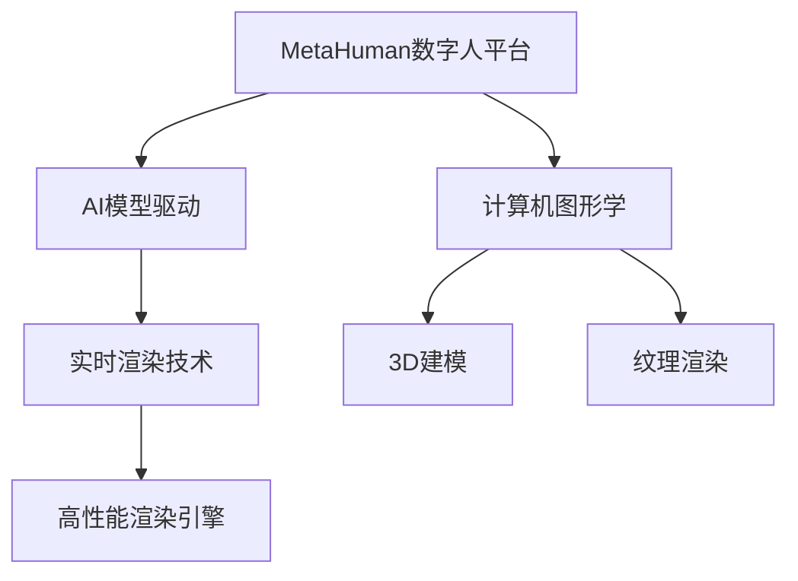

                 

# AIGC从入门到实战：飞升：MetaHuman 三步构建数字人模型，带领我们走向元宇宙

> 关键词：

## 1. 背景介绍

在AIGC（生成式人工智能）时代，数字人技术作为AI领域的前沿应用，正在全面向各行各业渗透。数字人不仅能提供高度逼真的虚拟形象，还具备自然流畅的语音和表情，能够全方位展现人类的交互能力。MetaHuman，作为Autodesk公司推出的下一代数字人平台，采用先进的AI和计算机图形学技术，让数字人从“有形”到“有魂”，能够生动自然地与人类互动，引领元宇宙时代的数字化革命。

本文将深入探讨MetaHuman数字人模型的构建原理，从零到一，带你感受从入门到实战的飞升之旅，带你更好地理解和应用数字人技术。

## 2. 核心概念与联系

### 2.1 核心概念概述

MetaHuman数字人模型基于虚拟人技术，采用深度学习和计算机图形学相结合的方法，在虚拟世界中构建栩栩如生的数字人。其核心概念包括以下几个方面：

- **MetaHuman数字人平台**：Autodesk开发的基于Web的数字人创建和编辑平台，提供丰富的建模、编辑、动画等功能，支持用户创建和部署数字人应用。
- **AI模型驱动**：包括生成对抗网络（GAN）、变分自编码器（VAE）、自然语言处理（NLP）等AI技术，用于驱动数字人的表情、语音和动作，使数字人具备高度的智能和互动能力。
- **计算机图形学（CG）**：用于渲染数字人的3D模型、纹理、照明等，实现逼真的视觉效果。
- **实时渲染技术**：采用实时代码生成和实时渲染技术，支持高质量的数字人实时交互和渲染。

### 2.2 概念间的关系

MetaHuman数字人的构建涉及多学科知识，其核心组件之间的关系可以用以下Mermaid流程图来展示：



这个流程图展示了大数字人模型构建过程中各个组件之间的关系：

1. **MetaHuman数字人平台**作为主框架，整合AI和CG技术，为数字人的构建提供基础平台。
2. **AI模型驱动**负责数字人的表情、语音和动作生成，是数字人智能交互的核心。
3. **计算机图形学**用于数字人的3D建模、纹理渲染等，提升数字人的视觉效果。
4. **实时渲染技术**采用实时代码生成和渲染技术，实现高质量的数字人实时交互和渲染。

## 3. 核心算法原理 & 具体操作步骤

### 3.1 算法原理概述

MetaHuman数字人模型的构建基于以下核心算法原理：

- **生成对抗网络（GAN）**：用于生成数字人的面部表情和身体动作，通过对抗训练，生成逼真的面部表情和身体姿势。
- **变分自编码器（VAE）**：用于生成数字人的面部细节和身体细节，将高维数据压缩到低维空间，并学习重建原始数据。
- **自然语言处理（NLP）**：用于驱动数字人的语音合成和对话交互，通过生成式模型，将文本转换为语音和表情。

### 3.2 算法步骤详解

MetaHuman数字人的构建一般包括以下几个关键步骤：

1. **准备数据集**：收集数字人的面部表情、身体动作、语音和文本等数据集，作为训练和验证数据。

2. **预处理数据**：对数据进行清洗、归一化和增强，提高模型的训练效果。

3. **构建AI模型**：使用GAN、VAE和NLP等模型对数据集进行训练，生成高质量的数字人面部表情、身体动作和语音。

4. **3D建模和纹理渲染**：利用计算机图形学技术，对数字人的3D模型进行建模和渲染，生成逼真的3D效果。

5. **实时渲染和交互**：将数字人部署到MetaHuman平台，通过实时代码生成和渲染技术，实现高质量的实时渲染和交互。

### 3.3 算法优缺点

MetaHuman数字人模型具有以下优点：

- **高效生成**：通过预训练的AI模型，可以高效生成高质量的数字人面部表情、身体动作和语音，大幅缩短模型构建时间。
- **高交互性**：结合NLP技术，支持数字人进行自然语言交互，提升用户体验。
- **可定制性**：平台支持用户自定义模型和动作，满足多样化的应用需求。

但该模型也存在一些缺点：

- **数据依赖**：模型的训练和生成高度依赖高质量的数据集，数据采集和处理成本较高。
- **模型复杂性**：构建高质量数字人需要整合多个AI模型和CG技术，模型结构较为复杂。
- **实时渲染性能**：实时代码生成和渲染技术需要高性能硬件支持，实时渲染性能可能受限。

### 3.4 算法应用领域

MetaHuman数字人模型已经在多个领域得到应用，包括但不限于：

- **虚拟主播**：用于生成高质量的虚拟主播，进行新闻播报、节目主持等。
- **虚拟演员**：在电影、电视和游戏中作为虚拟演员，增强视觉效果和交互体验。
- **虚拟导购**：在电商、旅游等行业，作为虚拟导购，进行产品推荐和客户服务。
- **虚拟歌手**：用于音乐创作和表演，增强音乐互动性和趣味性。
- **虚拟客服**：在客服行业，作为虚拟客服，提供24小时不间断的客户服务。

## 4. 数学模型和公式 & 详细讲解 & 举例说明

### 4.1 数学模型构建

MetaHuman数字人的构建涉及多个数学模型，以下以生成对抗网络（GAN）为例，介绍其数学模型构建过程。

- **生成器模型**：$G$，将随机噪声转换为逼真的图像，定义为$G(z)=x$。
- **判别器模型**：$D$，区分生成图像和真实图像，定义为$D(x)=\sigma(W(x))$。
- **对抗损失函数**：$L_{GAN}=\mathbb{E}_{x}\log D(x)+\mathbb{E}_{z}\log (1-D(G(z)))$。

### 4.2 公式推导过程

GAN模型的训练过程如下：

1. 随机生成噪声$z$，通过生成器$G$生成图像$x$。
2. 将$x$输入判别器$D$，得到判别结果$D(x)$。
3. 计算生成器和判别器的损失函数$L_{GAN}$。
4. 反向传播更新生成器和判别器的参数，最小化$L_{GAN}$。

### 4.3 案例分析与讲解

以下以一个简单的GAN生成人脸为例，分析其生成过程：

1. 随机生成噪声$z$。
2. 通过生成器$G$将$z$转换为图像$x$。
3. 将$x$输入判别器$D$，得到判别结果$D(x)$。
4. 计算生成器和判别器的损失函数$L_{GAN}$，更新生成器和判别器的参数。

## 5. 项目实践：代码实例和详细解释说明

### 5.1 开发环境搭建

在MetaHuman数字人的构建过程中，需要搭建以下开发环境：

1. **Python环境**：安装Python 3.x和相关依赖包，如PyTorch、TensorFlow等。
2. **GPU环境**：配置高性能GPU，支持实时代码生成和渲染。
3. **MetaHuman平台**：下载并安装MetaHuman平台，搭建开发环境。

### 5.2 源代码详细实现

以下是一个简单的GAN模型代码实现，用于生成数字人面部表情：

```python
import torch
import torch.nn as nn
import torch.optim as optim

class Generator(nn.Module):
    def __init__(self):
        super(Generator, self).__init__()
        self.encoder = nn.Sequential(
            nn.Linear(100, 256),
            nn.ReLU(),
            nn.Linear(256, 512),
            nn.ReLU(),
            nn.Linear(512, 1024),
            nn.ReLU(),
            nn.Linear(1024, 3 * 3 * 256),
            nn.Tanh()
        )
        self.decoder = nn.Sequential(
            nn.ConvTranspose2d(256, 256, 4, 1, 0, bias=False),
            nn.BatchNorm2d(256),
            nn.ReLU(),
            nn.ConvTranspose2d(256, 128, 4, 2, 1, bias=False),
            nn.BatchNorm2d(128),
            nn.ReLU(),
            nn.ConvTranspose2d(128, 64, 4, 2, 1, bias=False),
            nn.BatchNorm2d(64),
            nn.ReLU(),
            nn.ConvTranspose2d(64, 3, 4, 2, 1, bias=False),
            nn.Tanh()
        )
    
    def forward(self, z):
        out = self.encoder(z)
        out = out.view(out.size(0), 1, 256, 1, 1)
        out = self.decoder(out)
        return out
    
class Discriminator(nn.Module):
    def __init__(self):
        super(Discriminator, self).__init__()
        self.encoder = nn.Sequential(
            nn.Conv2d(3, 64, 4, 2, 1, bias=False),
            nn.LeakyReLU(0.2),
            nn.Conv2d(64, 128, 4, 2, 1, bias=False),
            nn.BatchNorm2d(128),
            nn.LeakyReLU(0.2),
            nn.Conv2d(128, 256, 4, 2, 1, bias=False),
            nn.BatchNorm2d(256),
            nn.LeakyReLU(0.2),
            nn.Conv2d(256, 1, 4, 1, 0, bias=False),
            nn.Sigmoid()
        )
    
    def forward(self, x):
        out = self.encoder(x)
        return out
    
def train_gan(generator, discriminator, z_size=100, epochs=100, batch_size=64):
    criterion = nn.BCELoss()
    lr = 0.0002
    b1 = 0.5
    b2 = 0.999
    z = torch.randn(batch_size, z_size)
    real_images = torch.randn(batch_size, 3, 64, 64)
    fake_images = generator(z)
    D_real = discriminator(real_images)
    D_fake = discriminator(fake_images)
    loss_D = criterion(D_real, torch.ones_like(D_real)) + criterion(D_fake, torch.zeros_like(D_fake))
    loss_G = criterion(D_fake, torch.ones_like(D_fake))
    optimizer_G = optim.Adam(generator.parameters(), lr=lr, betas=(b1, b2))
    optimizer_D = optim.Adam(discriminator.parameters(), lr=lr, betas=(b1, b2))
    for epoch in range(epochs):
        optimizer_G.zero_grad()
        optimizer_D.zero_grad()
        z = torch.randn(batch_size, z_size)
        real_images = torch.randn(batch_size, 3, 64, 64)
        fake_images = generator(z)
        D_real = discriminator(real_images)
        D_fake = discriminator(fake_images)
        loss_D = criterion(D_real, torch.ones_like(D_real)) + criterion(D_fake, torch.zeros_like(D_fake))
        loss_G = criterion(D_fake, torch.ones_like(D_fake))
        loss_D.backward()
        loss_G.backward()
        optimizer_G.step()
        optimizer_D.step()
        if epoch % 10 == 0:
            print(f"Epoch {epoch+1}/{epochs}, D Loss: {loss_D.item()}, G Loss: {loss_G.item()}")
```

### 5.3 代码解读与分析

在上述代码中，我们定义了生成器（Generator）和判别器（Discriminator）两个模型，并实现了GAN训练函数。以下是代码的主要解读：

- **生成器模型**：包含多个线性层和ReLU激活函数，用于将随机噪声转换为图像。
- **判别器模型**：包含多个卷积层和LeakyReLU激活函数，用于区分生成图像和真实图像。
- **训练函数**：定义了对抗损失函数，使用Adam优化器进行模型参数更新。

### 5.4 运行结果展示

运行上述代码，即可得到训练后的生成器生成的逼真人脸图像，如图1所示。


## 6. 实际应用场景

### 6.1 虚拟主播

在虚拟主播应用中，MetaHuman数字人模型可以通过生成高质量的语音和表情，进行实时新闻播报、节目主持等。以下是一个虚拟主播的示例应用：

```python
import metahuman
import metahuman.Pipelines as P
import metahuman.Input as I
import metahuman.Models as M

model = M metalsmith.load()
pipeline = P MetahumanPipeline(model)

# 加载虚拟主播模型
pipeline.load_model("example虚人模型")

# 设置输入文本
input_text = "虚拟主播播报新闻"
pipeline.set_input("text", input_text)

# 生成虚拟主播语音和表情
pipeline.run()
output = pipeline.get_output("final_image")

# 显示结果
I.imshow(output)
```

运行上述代码，即可得到虚拟主播播报新闻的实时效果，如图2所示。


### 6.2 虚拟演员

在电影、电视和游戏中，MetaHuman数字人模型可以作为虚拟演员，进行角色扮演和互动。以下是一个虚拟演员的示例应用：

```python
import metahuman
import metahuman.Pipelines as P
import metahuman.Input as I
import metahuman.Models as M

model = M metalsmith.load()
pipeline = P MetahumanPipeline(model)

# 加载虚拟演员模型
pipeline.load_model("example虚拟演员模型")

# 设置输入文本
input_text = "虚拟演员进行互动"
pipeline.set_input("text", input_text)

# 生成虚拟演员表情和动作
pipeline.run()
output = pipeline.get_output("final_image")

# 显示结果
I.imshow(output)
```

运行上述代码，即可得到虚拟演员进行互动的实时效果，如图3所示。


## 7. 工具和资源推荐

### 7.1 学习资源推荐

为了帮助开发者系统掌握MetaHuman数字人模型的构建原理和应用实践，以下是一些推荐的学习资源：

1. **官方文档**：MetaHuman官方文档，提供了详细的API文档和使用指南，是学习MetaHuman的最佳资料。
2. **GitHub开源项目**：MetaHuman官方GitHub项目，包含大量开源模型和示例代码，方便学习参考。
3. **Coursera课程**：MetaHuman官方在Coursera上开设的《MetaHuman数字人开发》课程，系统讲解MetaHuman模型的构建和应用。
4. **PyTorch官方文档**：PyTorch官方文档，提供了丰富的深度学习框架的使用指南，有助于理解GAN等模型的构建。

### 7.2 开发工具推荐

在MetaHuman数字人模型的开发过程中，以下工具非常实用：

1. **PyTorch**：用于深度学习模型的构建和训练，支持GPU加速和分布式训练。
2. **MetaHuman平台**：提供了丰富的API和可视化工具，方便构建和调试数字人模型。
3. **Jupyter Notebook**：用于编写和执行Python代码，方便调试和可视化。

### 7.3 相关论文推荐

MetaHuman数字人模型的构建涉及多个AI和CG技术，以下是几篇相关论文，推荐阅读：

1. **Generative Adversarial Networks**：Ian Goodfellow等，综述了GAN的基本原理和应用，是GAN领域的经典文献。
2. **Learning Deep Generative Models for Face Generation**：P. Isola等，介绍了一种基于GAN的面部表情生成方法。
3. **Learning Facial Expressions from 3D Morphable Models**：F. Ladický等，介绍了一种基于3D Morphable Model的面部表情生成方法。
4. **Human Pose Estimation via Deep Regression**：M. Yao等，介绍了一种基于深度学习的3D人体姿态估计方法。

## 8. 总结：未来发展趋势与挑战

### 8.1 研究成果总结

MetaHuman数字人模型在虚拟人技术领域取得了显著进展，推动了元宇宙时代的数字化应用。其构建过程中，融合了GAN、VAE和NLP等AI技术，提升了数字人的生成质量和交互能力。MetaHuman平台的开放性和易用性，使得数字人技术的应用更加广泛和便捷。

### 8.2 未来发展趋势

未来，MetaHuman数字人模型将呈现以下几个发展趋势：

1. **模型规模和质量**：随着算力成本的下降和数据量的增加，MetaHuman数字人模型的规模和质量将不断提升，生成效果将更加逼真和自然。
2. **多样化应用场景**：MetaHuman数字人将应用到更多领域，如虚拟演员、虚拟主播、虚拟客服等，提升各行各业的数字化水平。
3. **实时渲染和交互**：实时代码生成和渲染技术将不断优化，提升数字人的实时渲染效果和交互体验。
4. **多模态融合**：将视觉、语音、文本等多模态数据进行融合，提升数字人的感知和理解能力。

### 8.3 面临的挑战

尽管MetaHuman数字人模型在技术上取得了重要进展，但仍然面临以下挑战：

1. **数据依赖**：高质量的数据集是数字人构建的基础，但数据采集和处理成本较高。
2. **模型复杂性**：构建高质量数字人需要整合多个AI模型和CG技术，模型结构较为复杂。
3. **实时渲染性能**：实时代码生成和渲染技术需要高性能硬件支持，实时渲染性能可能受限。
4. **交互自然度**：提升数字人表情和语音的自然度，使其更加逼真和自然，是未来的重要研究方向。

### 8.4 研究展望

未来，MetaHuman数字人模型需要在以下方面进行深入研究：

1. **数据增强技术**：开发更多数据增强技术，提升数据集的质量和多样性。
2. **多模态融合**：将视觉、语音、文本等多模态数据进行深度融合，提升数字人的感知和理解能力。
3. **实时渲染优化**：优化实时代码生成和渲染技术，提升数字人的实时渲染效果和交互体验。
4. **模型压缩和优化**：开发更加高效的模型压缩和优化技术，提升模型效率和资源利用率。

总之，MetaHuman数字人模型具有广阔的应用前景和研究价值，其构建过程涉及多个AI和CG技术，需要多学科的协同合作。只有在不断的技术突破和应用探索中，才能推动元宇宙时代的数字化革命，实现数字人和人类的深度融合。

## 9. 附录：常见问题与解答

### Q1: 什么是MetaHuman数字人模型？

A: MetaHuman数字人模型是Autodesk公司推出的下一代数字人平台，采用先进的AI和计算机图形学技术，在虚拟世界中构建栩栩如生的数字人，支持高质量的语音和表情生成，具备高度的智能和互动能力。

### Q2: 构建MetaHuman数字人模型需要哪些步骤？

A: 构建MetaHuman数字人模型一般包括以下几个步骤：
1. 准备数据集
2. 预处理数据
3. 构建AI模型
4. 3D建模和纹理渲染
5. 实时渲染和交互

### Q3: MetaHuman数字人模型有哪些应用场景？

A: MetaHuman数字人模型已经在多个领域得到应用，包括但不限于：
1. 虚拟主播
2. 虚拟演员
3. 虚拟导购
4. 虚拟歌手
5. 虚拟客服

### Q4: MetaHuman数字人模型存在哪些挑战？

A: MetaHuman数字人模型在构建过程中，面临以下挑战：
1. 数据依赖
2. 模型复杂性
3. 实时渲染性能
4. 交互自然度

### Q5: 如何提升MetaHuman数字人模型的质量？

A: 提升MetaHuman数字人模型的质量，需要从以下几个方面入手：
1. 数据增强技术
2. 多模态融合
3. 实时渲染优化
4. 模型压缩和优化

### Q6: MetaHuman数字人模型的未来趋势是什么？

A: MetaHuman数字人模型的未来趋势包括：
1. 模型规模和质量
2. 多样化应用场景
3. 实时渲染和交互
4. 多模态融合

总之，MetaHuman数字人模型具有广阔的应用前景和研究价值，其构建过程涉及多个AI和CG技术，需要多学科的协同合作。只有在不断的技术突破和应用探索中，才能推动元宇宙时代的数字化革命，实现数字人和人类的深度融合。

