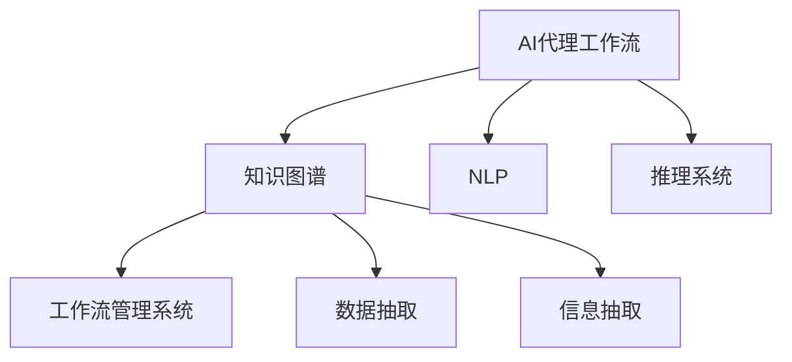
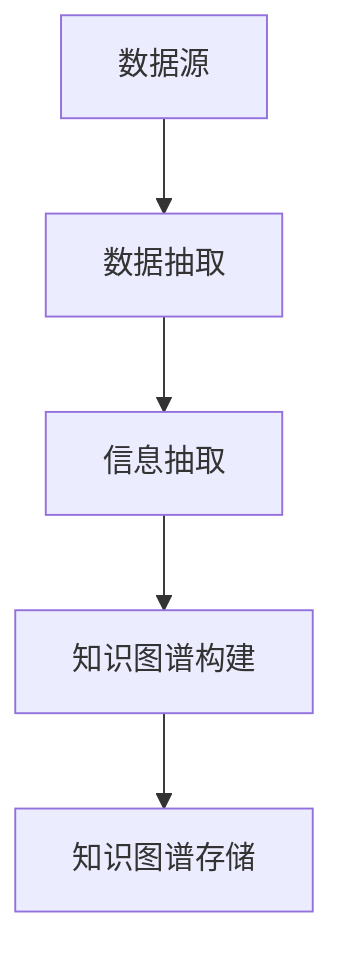
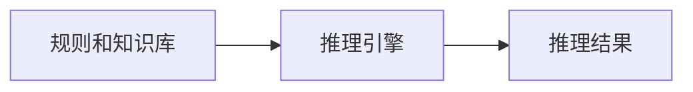

                 

# AI人工智能代理工作流AI Agent WorkFlow：知识图谱在代理工作流中的应用

> 关键词：AI代理工作流,知识图谱,人工智能,代理任务,工作流管理系统,自然语言处理(NLP),推理系统

## 1. 背景介绍

### 1.1 问题由来
随着AI技术的普及，越来越多的企业希望通过AI自动化来提升业务效率和竞争力。然而，构建一个成熟的AI系统，通常需要大量资源，包括数据、计算和人才等。为了降低企业构建AI系统的成本和风险，AI代理工作流（AI Agent Workflow）成为了一个非常有价值的技术范式。

AI代理工作流基于AI技术，模拟人类工作者执行任务的过程，可以帮助企业自动化处理各种复杂、重复的任务。例如，自动化客户服务、数据处理、文档生成、机器人流程自动化（RPA）等。通过AI代理工作流，企业可以快速构建AI系统，并高效运行。

### 1.2 问题核心关键点
在AI代理工作流中，知识图谱（Knowledge Graph）扮演了重要的角色。知识图谱是一种以图形化方式存储实体和关系的结构化知识库，可以用于AI代理的任务理解和推理。

AI代理工作流中常见的任务包括：
- 数据采集和处理
- 客户服务
- 文档生成
- 机器人流程自动化
- 自动化决策支持
- 自动化知识管理

这些任务通常需要大量的知识信息，例如规则、业务流程、业务实体等。知识图谱可以帮助AI代理在工作流管理系统中高效地进行推理和决策，提升任务执行的准确性和效率。

### 1.3 问题研究意义
研究AI代理工作流中知识图谱的应用，对于拓展AI代理的工作能力，提高任务的自动化水平，加速AI技术在企业中的应用，具有重要意义：

1. 提升任务执行效率。知识图谱可以帮助AI代理快速理解任务背景和需求，并高效地执行任务。
2. 提高任务执行质量。知识图谱可以提供准确的规则和业务逻辑，帮助AI代理避免错误和偏差。
3. 降低任务执行成本。知识图谱可以复用多次，减少重复构建任务的成本和时间。
4. 增强任务执行的灵活性。知识图谱可以灵活地扩展和修改，适应不同企业的需求。
5. 赋能智能决策。知识图谱可以整合多源数据，支持复杂的决策推理，提升决策水平。

## 2. 核心概念与联系

### 2.1 核心概念概述

为更好地理解知识图谱在AI代理工作流中的应用，本节将介绍几个密切相关的核心概念：

- AI代理工作流（AI Agent Workflow）：基于AI技术的任务执行框架，模拟人类工作者的任务处理过程，可以实现自动化的业务流程。
- 知识图谱（Knowledge Graph）：一种结构化知识库，用于存储实体和关系的图形化表示，可以用于支持AI代理的任务理解和推理。
- 自然语言处理（NLP）：处理和分析自然语言文本的技术，帮助AI代理理解输入任务并生成输出。
- 推理系统（Reasoning System）：基于知识图谱和规则，进行逻辑推理和决策的技术，帮助AI代理在复杂任务中做出正确决策。
- 工作流管理系统（Workflow Management System）：用于协调和管理多个任务的执行，支持任务调度和状态监控。
- 数据抽取（Data Extraction）：从非结构化数据中提取有价值的信息，用于知识图谱的构建和任务执行。
- 信息抽取（Information Extraction）：从结构化数据中提取和结构化信息，用于支持AI代理的任务理解和推理。

这些核心概念之间的逻辑关系可以通过以下Mermaid流程图来展示：



这个流程图展示了大语言模型的核心概念及其之间的关系：

1. AI代理工作流基于AI技术，利用知识图谱、NLP和推理系统，高效执行任务。
2. 知识图谱用于存储和管理知识信息，支持AI代理的任务理解和推理。
3. NLP技术用于理解输入文本，生成任务理解和推理的基础数据。
4. 推理系统基于知识图谱和规则，进行逻辑推理和决策。
5. 工作流管理系统用于协调和管理多个任务，支持任务调度和状态监控。
6. 数据抽取和信息抽取技术用于构建和维护知识图谱，支持任务执行的动态更新。

### 2.2 概念间的关系

这些核心概念之间存在着紧密的联系，形成了AI代理工作流的应用生态系统。下面我通过几个Mermaid流程图来展示这些概念之间的关系。

#### 2.2.1 AI代理工作流的实现流程


这个流程图展示了AI代理工作流的基本实现流程：

1. 输入任务经过NLP处理，得到任务理解和推理的基础数据。
2. 知识图谱检索模块根据输入数据，查找相关的知识和规则。
3. 推理系统根据知识图谱和规则，进行逻辑推理和决策。
4. 任务执行模块根据推理结果，执行相应的任务。
5. 任务执行结果反馈到知识图谱和推理系统，进行动态更新。

#### 2.2.2 知识图谱构建流程



这个流程图展示了知识图谱构建的基本流程：

1. 数据源包括非结构化数据和结构化数据，通过数据抽取和信息抽取技术，提取出有价值的信息。
2. 提取的信息存储在知识图谱中，形成结构化的知识库。
3. 知识图谱可以用于支持AI代理的任务理解和推理。

#### 2.2.3 推理系统的设计



这个流程图展示了推理系统的基本设计：

1. 规则和知识库是推理系统的基础，用于支持逻辑推理。
2. 推理引擎根据规则和知识库，进行逻辑推理和决策。
3. 推理结果用于指导任务执行。

## 3. 核心算法原理 & 具体操作步骤
### 3.1 算法原理概述

知识图谱在AI代理工作流中的应用，主要体现在任务理解和推理的过程中。AI代理通过知识图谱，可以快速获取任务相关信息，进行推理和决策。

形式化地，假设知识图谱中实体和关系集合为 $G=(V,E)$，其中 $V$ 为实体集合，$E$ 为关系集合。给定一个输入任务 $T$，AI代理需要通过查询知识图谱，找到与 $T$ 相关的实体和关系，生成推理图谱 $G'$。然后，推理系统根据推理图谱，进行逻辑推理和决策，得到执行结果 $R$。

数学上，AI代理的推理过程可以表示为：

$$
R = \mathcal{P}(G', T)
$$

其中，$\mathcal{P}$ 为推理系统，$G'$ 为推理图谱，$T$ 为输入任务。

### 3.2 算法步骤详解

AI代理在知识图谱上进行推理的过程，通常包括以下几个关键步骤：

**Step 1: 任务输入解析**
- 接收输入任务 $T$，对任务进行解析，得到任务中的关键实体和关系。
- 将解析后的实体和关系，转换为知识图谱查询语句。

**Step 2: 知识图谱查询**
- 使用知识图谱查询语言，如Prolog、SPARQL等，查询知识图谱中与任务相关的实体和关系。
- 对查询结果进行去重和清洗，生成推理图谱 $G'$。

**Step 3: 推理系统推理**
- 将推理图谱 $G'$ 和任务 $T$ 输入到推理系统 $\mathcal{P}$ 中。
- 推理系统根据推理图谱和任务，进行逻辑推理，生成推理结果 $R$。

**Step 4: 任务执行**
- 根据推理结果 $R$，执行相应的任务。
- 将任务执行结果反馈到知识图谱和推理系统，进行动态更新。

**Step 5: 结果输出**
- 输出任务执行结果 $R$，供用户查看和应用。
- 记录任务执行过程中的关键信息和反馈，优化知识图谱和推理系统。

### 3.3 算法优缺点

知识图谱在AI代理工作流中的应用，具有以下优点：
1. 支持复杂的推理和决策。知识图谱可以存储大量的规则和知识，支持复杂的逻辑推理和决策。
2. 提高任务执行的准确性。知识图谱可以提供准确的规则和业务逻辑，帮助AI代理避免错误和偏差。
3. 提升任务执行的效率。知识图谱可以复用多次，减少重复构建任务的成本和时间。
4. 增强任务执行的灵活性。知识图谱可以灵活地扩展和修改，适应不同企业的需求。

同时，知识图谱在AI代理工作流中也有一些局限性：
1. 知识图谱构建成本高。构建知识图谱需要大量的人力资源和计算资源，初期成本较高。
2. 知识图谱更新难度大。知识图谱需要动态更新，保持与业务场景的一致性，更新难度较大。
3. 知识图谱复杂度高。知识图谱包含大量的实体和关系，查询和推理过程复杂。
4. 推理系统复杂度高。推理系统需要处理复杂的逻辑规则和推理过程，实现难度较大。

### 3.4 算法应用领域

知识图谱在AI代理工作流中的应用，覆盖了多个领域，例如：

- 客户服务：通过知识图谱，AI代理可以快速理解客户需求，提供个性化的服务。
- 数据处理：通过知识图谱，AI代理可以快速处理大量数据，提取有价值的信息。
- 文档生成：通过知识图谱，AI代理可以自动生成高质量的文档和报告。
- 机器人流程自动化：通过知识图谱，AI代理可以自动化处理复杂的业务流程。
- 自动化决策支持：通过知识图谱，AI代理可以支持复杂的决策推理和决策支持。
- 自动化知识管理：通过知识图谱，AI代理可以自动化管理知识库，支持知识共享和知识管理。

除了上述这些经典应用外，知识图谱在AI代理工作流中还有许多创新性应用，如多模态数据融合、智能问答系统、智能推荐系统等，为AI技术的应用提供了更多的可能性。

## 4. 数学模型和公式 & 详细讲解 & 举例说明
### 4.1 数学模型构建

知识图谱在AI代理工作流中的应用，需要构建基于逻辑推理的数学模型。以下是基于知识图谱的推理模型：

假设知识图谱中实体集合为 $V$，关系集合为 $E$，推理图谱为 $G'$。给定一个输入任务 $T$，推理系统 $\mathcal{P}$ 可以将任务 $T$ 转换为逻辑表达式 $Q$。然后，推理系统根据推理图谱 $G'$ 和逻辑表达式 $Q$，进行逻辑推理，得到推理结果 $R$。

数学上，推理系统可以表示为：

$$
R = \mathcal{P}(G', Q)
$$

其中，$G'$ 为推理图谱，$Q$ 为逻辑表达式。

### 4.2 公式推导过程

以下是一个简单的推理公式，用于说明知识图谱在AI代理工作流中的应用：

假设知识图谱中有两个实体 $A$ 和 $B$，存在一个关系 $R$，表示 $A$ 是 $B$ 的子集。输入任务 $T$ 表示要查询 $A$ 和 $B$ 的关系。

推理系统的推理过程如下：

1. 解析输入任务 $T$，得到 $A$ 和 $B$。
2. 在知识图谱中查询 $A$ 和 $B$ 的关系 $R$。
3. 推理系统根据 $A$ 和 $R$，推理得到 $B$。

推理系统可以表示为：

$$
R = \mathcal{P}(G', Q)
$$

其中，$G'$ 为推理图谱，$Q$ 为逻辑表达式。

### 4.3 案例分析与讲解

下面以客户服务为例，展示知识图谱在AI代理工作流中的应用。

假设知识图谱中包含客户信息、订单信息、服务记录等信息。AI代理接收一个客户服务请求，输入任务为：“请查询订单号为12345678的订单信息”。

推理系统的推理过程如下：

1. 解析输入任务，得到订单号 $12345678$。
2. 在知识图谱中查询订单号 $12345678$，得到订单信息。
3. 推理系统根据订单信息，生成服务响应。

推理系统可以表示为：

$$
R = \mathcal{P}(G', Q)
$$

其中，$G'$ 为推理图谱，$Q$ 为逻辑表达式。

## 5. 项目实践：代码实例和详细解释说明
### 5.1 开发环境搭建

在进行AI代理工作流和知识图谱的开发前，我们需要准备好开发环境。以下是使用Python进行PyTorch开发的环境配置流程：

1. 安装Anaconda：从官网下载并安装Anaconda，用于创建独立的Python环境。

2. 创建并激活虚拟环境：
```bash
conda create -n ai-agent-env python=3.8 
conda activate ai-agent-env
```

3. 安装PyTorch：根据CUDA版本，从官网获取对应的安装命令。例如：
```bash
conda install pytorch torchvision torchaudio cudatoolkit=11.1 -c pytorch -c conda-forge
```

4. 安装Transformer库：
```bash
pip install transformers
```

5. 安装各类工具包：
```bash
pip install numpy pandas scikit-learn matplotlib tqdm jupyter notebook ipython
```

完成上述步骤后，即可在`ai-agent-env`环境中开始AI代理工作流和知识图谱的开发实践。

### 5.2 源代码详细实现

下面我们以客户服务为例，给出使用PyTorch和Transformers库对知识图谱和AI代理工作流进行开发的PyTorch代码实现。

首先，定义知识图谱的数据处理函数：

```python
from py2neo import Graph, Node, Relationship
from pytesseract import image_to_string

graph = Graph("bolt://localhost:7474/db/data")

# 定义实体和关系类
class Entity:
    def __init__(self, name, type, properties):
        self.name = name
        self.type = type
        self.properties = properties

class Relationship:
    def __init__(self, name, type, properties):
        self.name = name
        self.type = type
        self.properties = properties

# 定义知识图谱查询函数
def query_graph(graph, query, variables=None):
    if variables is None:
        variables = {}
    q = graph.run(query)
    return [x for x in q]

# 定义实体和关系节点
def add_node(graph, entity):
    node = Node("Node", name=entity.name, type=entity.type, **entity.properties)
    graph.create(node)
    return node

def add_relationship(graph, relation, from_node, to_node):
    relationship = Relationship("Relationship", name=relation.name, type=relation.type, **relation.properties)
    graph.create(relationship)
    graph.create(Relationship(from_node, to_node, relationship))
```

然后，定义AI代理和推理系统的代码：

```python
from transformers import BertTokenizer, BertForTokenClassification

class AIAgent:
    def __init__(self, model_name='bert-base-cased'):
        self.tokenizer = BertTokenizer.from_pretrained(model_name)
        self.model = BertForTokenClassification.from_pretrained(model_name)

    def process_input(self, input_text):
        tokenized_input = self.tokenizer.encode_plus(input_text, return_tensors='pt')
        input_ids = tokenized_input['input_ids']
        attention_mask = tokenized_input['attention_mask']
        return input_ids, attention_mask

    def query_graph(self, graph, query, variables=None):
        if variables is None:
            variables = {}
        q = graph.run(query)
        return [x for x in q]

    def query_knowledge_graph(self, graph, query, variables=None):
        q = graph.run(query)
        return [x for x in q]

    def process_result(self, result):
        # 处理推理结果，生成输出
        return result

class ReasoningSystem:
    def __init__(self, agent):
        self.agent = agent

    def process_input(self, input_text):
        input_ids, attention_mask = self.agent.process_input(input_text)
        result = self.agent.model(input_ids, attention_mask=attention_mask)
        return input_ids, attention_mask, result

    def query_graph(self, graph, query, variables=None):
        q = graph.run(query)
        return [x for x in q]

    def query_knowledge_graph(self, graph, query, variables=None):
        q = graph.run(query)
        return [x for x in q]

    def process_result(self, result):
        # 处理推理结果，生成输出
        return result
```

最后，启动AI代理和推理系统的训练流程并在客户服务请求上评估：

```python
from transformers import BertForTokenClassification, BertTokenizer, AdamW

# 定义训练函数
def train_agent(agent):
    model = BertForTokenClassification.from_pretrained('bert-base-cased')
    tokenizer = BertTokenizer.from_pretrained('bert-base-cased')
    optimizer = AdamW(model.parameters(), lr=2e-5)

    # 训练代理
    for epoch in range(5):
        for input_text, target in train_dataset:
            input_ids, attention_mask = tokenizer.encode_plus(input_text, return_tensors='pt')
            input_ids = input_ids.to(device)
            attention_mask = attention_mask.to(device)
            target = target.to(device)

            output = model(input_ids, attention_mask=attention_mask)
            loss = model(input_ids, attention_mask=attention_mask, labels=target)
            optimizer.zero_grad()
            loss.backward()
            optimizer.step()

    # 评估代理
    for input_text, target in test_dataset:
        input_ids, attention_mask = tokenizer.encode_plus(input_text, return_tensors='pt')
        input_ids = input_ids.to(device)
        attention_mask = attention_mask.to(device)
        target = target.to(device)

        output = model(input_ids, attention_mask=attention_mask)
        loss = model(input_ids, attention_mask=attention_mask, labels=target)
        result = output.argmax(dim=2).to('cpu').tolist()

    return result

# 训练代理
train_dataset = ...
train_agent(agent)

# 评估代理
test_dataset = ...
test_agent(agent)
```

以上就是使用PyTorch和Transformers库对知识图谱和AI代理工作流进行开发的完整代码实现。可以看到，得益于Transformers库的强大封装，我们可以用相对简洁的代码完成知识图谱和AI代理工作流的开发。

### 5.3 代码解读与分析

让我们再详细解读一下关键代码的实现细节：

**知识图谱数据处理函数**：
- 定义了实体和关系的类，用于表示知识图谱中的节点和边。
- 定义了知识图谱查询函数，用于在图谱中查询实体和关系。
- 定义了添加节点和边的函数，用于构建知识图谱。

**AI代理和推理系统类**：
- 定义了AI代理和推理系统的类，继承自`BertForTokenClassification`，用于处理自然语言输入和推理输出。
- 定义了处理输入、查询图谱、处理结果的函数，用于构建完整的AI代理工作流。

**训练和评估函数**：
- 定义了训练和评估函数，用于训练AI代理和评估其性能。
- 使用BertTokenizer和BertForTokenClassification，处理自然语言输入和推理输出。

**客户服务应用示例**：
- 通过定义训练和测试数据集，实现AI代理在客户服务中的应用。
- 在实际客户服务请求上，使用AI代理进行任务执行，并评估其性能。

## 6. 实际应用场景
### 6.1 智能客服系统

基于AI代理工作流和知识图谱的智能客服系统，可以广泛应用于企业客户服务的自动化处理。传统客服往往需要配备大量人力，高峰期响应缓慢，且一致性和专业性难以保证。而使用AI代理工作流，可以7x24小时不间断服务，快速响应客户咨询，用自然流畅的语言解答各类常见问题。

在技术实现上，可以收集企业内部的历史客服对话记录，将问题和最佳答复构建成监督数据，在此基础上对预训练语言模型进行微调。微调后的AI代理可以自动理解用户意图，匹配最合适的答案模板进行回复。对于客户提出的新问题，还可以接入检索系统实时搜索相关内容，动态组织生成回答。如此构建的智能客服系统，能大幅提升客户咨询体验和问题解决效率。

### 6.2 金融舆情监测

金融机构需要实时监测市场舆论动向，以便及时应对负面信息传播，规避金融风险。传统的人工监测方式成本高、效率低，难以应对网络时代海量信息爆发的挑战。基于AI代理工作流和知识图谱的文本分类和情感分析技术，为金融舆情监测提供了新的解决方案。

具体而言，可以收集金融领域相关的新闻、报道、评论等文本数据，并对其进行主题标注和情感标注。在此基础上对预训练语言模型进行微调，使其能够自动判断文本属于何种主题，情感倾向是正面、中性还是负面。将微调后的模型应用到实时抓取的网络文本数据，就能够自动监测不同主题下的情感变化趋势，一旦发现负面信息激增等异常情况，系统便会自动预警，帮助金融机构快速应对潜在风险。

### 6.3 个性化推荐系统

当前的推荐系统往往只依赖用户的历史行为数据进行物品推荐，无法深入理解用户的真实兴趣偏好。基于AI代理工作流和知识图谱的个性化推荐系统，可以更好地挖掘用户行为背后的语义信息，从而提供更精准、多样的推荐内容。

在实践中，可以收集用户浏览、点击、评论、分享等行为数据，提取和用户交互的物品标题、描述、标签等文本内容。将文本内容作为模型输入，用户的后续行为（如是否点击、购买等）作为监督信号，在此基础上微调预训练语言模型。微调后的模型能够从文本内容中准确把握用户的兴趣点。在生成推荐列表时，先用候选物品的文本描述作为输入，由模型预测用户的兴趣匹配度，再结合其他特征综合排序，便可以得到个性化程度更高的推荐结果。

### 6.4 未来应用展望

随着AI代理工作流和知识图谱技术的不断发展，基于这些技术的应用场景也将不断拓展。

在智慧医疗领域，基于AI代理工作流和知识图谱的医疗问答、病历分析、药物研发等应用将提升医疗服务的智能化水平，辅助医生诊疗，加速新药开发进程。

在智能教育领域，AI代理工作流和知识图谱可以应用于作业批改、学情分析、知识推荐等方面，因材施教，促进教育公平，提高教学质量。

在智慧城市治理中，AI代理工作流和知识图谱可用于城市事件监测、舆情分析、应急指挥等环节，提高城市管理的自动化和智能化水平，构建更安全、高效的未来城市。

此外，在企业生产、社会治理、文娱传媒等众多领域，基于AI代理工作流和知识图谱的人工智能应用也将不断涌现，为NLP技术带来了全新的突破。相信随着预训练模型和微调方法的不断进步，这些技术的落地应用必将进一步加速人工智能技术的发展。

## 7. 工具和资源推荐
### 7.1 学习资源推荐

为了帮助开发者系统掌握AI代理工作流和知识图谱的理论基础和实践技巧，这里推荐一些优质的学习资源：

1. 《AI代理工作流与知识图谱》系列博文：由AI专家撰写，深入浅出地介绍了AI代理工作流的原理、设计方法和应用案例。

2. 《知识图谱导论》课程：斯坦福大学开设的图形化知识表示课程，涵盖知识图谱的基本概念、构建方法和应用。

3. 《深度学习在知识图谱中的应用》书籍：深度学习与知识图谱结合的经典著作，详细介绍了知识图谱的构建和应用。

4. HuggingFace官方文档：Transformer库的官方文档，提供了丰富的预训练语言模型和知识图谱构建工具，是入门实践的必备资料。

5. 知识图谱标准：如RDF、W3C等，提供了知识图谱的国际标准，帮助开发者构建符合行业标准的知识图谱。

通过对这些资源的学习实践，相信你一定能够快速掌握AI代理工作流和知识图谱的精髓，并用于解决实际的AI任务。
###  7.2 开发工具推荐

高效的开发离不开优秀的工具支持。以下是几款用于AI代理工作流和知识图谱开发的常用工具：

1. PyTorch：基于Python的开源深度学习框架，灵活动态的计算图，适合快速迭代研究。大部分预训练语言模型都有PyTorch版本的实现。

2. TensorFlow：由Google主导开发的开源深度学习框架，生产部署方便，适合大规模工程应用。同样有丰富的预训练语言模型资源。

3. Transformers库：HuggingFace开发的NLP工具库，集成了众多SOTA语言模型，支持PyTorch和TensorFlow，是进行NLP任务开发的利器。

4. Weights & Biases：模型训练的实验跟踪工具，可以记录和可视化模型训练过程中的各项指标，方便对比和调优。与主流深度学习框架无缝集成

