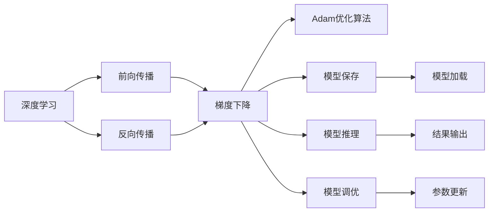
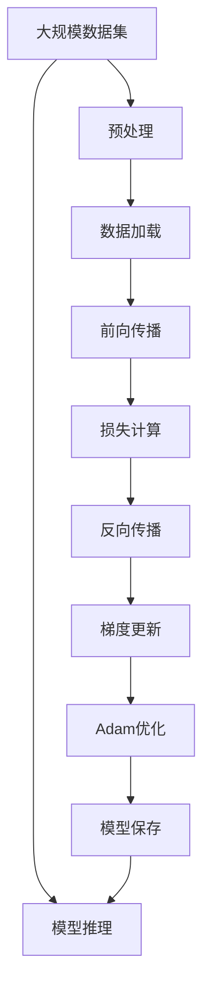

                 

# AI人工智能核心算法原理与代码实例讲解：算法实现

> 关键词：核心算法, 代码实现, 深度学习, 机器学习, 优化算法, 模型训练, 项目实践

## 1. 背景介绍

### 1.1 问题由来
在人工智能领域，算法实现一直以来都是核心技术的体现。随着深度学习、机器学习技术的不断进步，许多高效、先进的算法模型不断涌现，推动了人工智能技术在各个领域的应用。然而，算法实现不仅仅是代码的编写，更是对算法原理、数据结构、优化策略的全面理解和应用。本文旨在通过深入讲解几个核心算法，并配以代码实例，让读者全面掌握其原理和应用方法。

### 1.2 问题核心关键点
本系列文章将围绕以下核心算法进行详细讲解：
1. **深度学习基础算法**：包括前向传播、反向传播、梯度下降等基本算法。
2. **模型优化算法**：包括Adam、Adagrad、SGD等常用优化算法。
3. **模型训练算法**：包括交叉验证、正则化、数据增强等关键技术。
4. **项目实践算法**：包括模型保存、模型推理、模型调优等实战技巧。

这些算法是构建高效、稳定、可解释的AI模型的基石，掌握它们能够帮助开发者更好地应对各种实际问题。

### 1.3 问题研究意义
深入理解AI核心算法原理和实现方法，对于提升AI技术的应用水平，推动AI技术的产业化和普及具有重要意义：
1. 降低技术门槛：掌握核心算法原理，能够更快速地开发和调试AI模型，降低技术入门难度。
2. 提升模型性能：通过优化算法和训练技术，能够显著提升模型的准确性和泛化能力。
3. 扩展应用范围：结合实际项目需求，灵活运用各类算法，能够拓展AI技术的适用领域。
4. 增强可解释性：理解算法的原理和实现，有助于更好地解释AI模型的决策过程，提高模型透明度和可靠性。

## 2. 核心概念与联系

### 2.1 核心概念概述

为了更好地理解核心算法的原理和应用，本节将介绍几个密切相关的核心概念：

- **深度学习**：一种模拟人脑神经网络结构的人工智能技术，通过多层神经网络对数据进行非线性映射和特征提取。
- **前向传播**：数据从输入层向输出层单向传递的过程，计算神经网络的预测结果。
- **反向传播**：根据预测结果与实际标签的误差，反向调整神经网络的权重和偏置，以优化模型性能。
- **梯度下降**：一种基于梯度信息的优化算法，通过迭代更新模型参数，最小化损失函数。
- **Adam优化算法**：一种基于梯度和动量的自适应优化算法，具有学习率自适应、动量自适应和偏差校正的特点。
- **模型保存**：将训练好的模型参数和架构信息保存到文件或数据库中，便于后续使用和部署。
- **模型推理**：使用训练好的模型对新数据进行预测或分类，输出模型的预测结果。
- **模型调优**：通过调整模型参数、优化算法、数据集等手段，提升模型的性能和泛化能力。

这些核心概念构成了深度学习算法的核心框架，通过理解这些概念，能够更好地掌握深度学习技术。

### 2.2 概念间的关系

这些核心概念之间存在紧密的联系，形成了一个完整的深度学习算法生态系统。我们可以用以下Mermaid流程图来展示这些概念之间的关系：



这个流程图展示了深度学习算法的基本流程和各个模块的功能。前向传播计算预测结果，反向传播更新模型参数，梯度下降优化损失函数，Adam算法调整学习率，模型保存和加载确保模型可复用，模型推理输出预测结果，模型调优提升模型性能。

### 2.3 核心概念的整体架构

最后，我们用一个综合的流程图来展示这些核心概念在大规模深度学习模型训练和推理过程中的整体架构：



这个综合流程图展示了从数据预处理到模型推理的完整过程。通过预处理、加载、前向传播、损失计算、反向传播、梯度更新、优化等步骤，构建和训练深度学习模型，并通过模型保存和推理实现模型应用。

## 3. 核心算法原理 & 具体操作步骤
### 3.1 算法原理概述

本节将对几个核心算法的基本原理进行概述，帮助读者建立对算法实现的初步认识。

#### 3.1.1 前向传播和反向传播
前向传播是神经网络的基本计算过程，其核心是将输入数据经过多层神经元的计算，最终得到网络的输出。反向传播则在前向传播的基础上，通过计算误差梯度，反向调整网络参数，以优化模型性能。具体步骤如下：

1. **前向传播**：
   - 将输入数据 $x$ 输入到网络中，经过多层神经元计算，得到输出结果 $y$。
   - 公式表示为：
     \[
     y = f(Wx + b)
     \]
    其中，$W$ 是权重矩阵，$b$ 是偏置向量，$f$ 是激活函数。

2. **反向传播**：
   - 计算损失函数 $\mathcal{L}(y, \hat{y})$，其中 $y$ 是真实标签，$\hat{y}$ 是模型预测结果。
   - 根据链式法则，计算损失函数对各层参数的梯度，更新权重和偏置。
   - 公式表示为：
     \[
     \frac{\partial \mathcal{L}}{\partial W} = \frac{\partial \mathcal{L}}{\partial y} \frac{\partial y}{\partial W}
     \]
     \[
     \frac{\partial \mathcal{L}}{\partial b} = \frac{\partial \mathcal{L}}{\partial y} \frac{\partial y}{\partial b}
     \]

#### 3.1.2 梯度下降
梯度下降是一种常用的优化算法，通过迭代更新模型参数，最小化损失函数。其核心思想是沿着损失函数的梯度方向，逐步调整模型参数，以找到最优解。具体步骤如下：

1. **初始化参数**：随机初始化模型参数 $\theta$。
2. **计算梯度**：计算损失函数对参数的梯度 $\nabla_{\theta}\mathcal{L}$。
3. **更新参数**：使用梯度信息更新参数，公式表示为：
   \[
   \theta \leftarrow \theta - \eta \nabla_{\theta}\mathcal{L}
   \]
   其中，$\eta$ 是学习率。

#### 3.1.3 Adam优化算法
Adam是一种自适应优化算法，结合了动量和梯度信息，具有学习率自适应和偏差校正的特点。具体步骤如下：

1. **初始化动量和梯度**：对动量参数 $m$ 和梯度平方参数 $v$ 进行初始化。
2. **计算梯度和动量**：计算损失函数对参数的梯度和动量，公式表示为：
   \[
   m_t = \beta_1 m_{t-1} + (1-\beta_1) \nabla_{\theta}\mathcal{L}
   \]
   \[
   v_t = \beta_2 v_{t-1} + (1-\beta_2) \nabla_{\theta}\mathcal{L}^2
   \]
3. **更新参数**：根据动量和梯度信息，使用自适应学习率更新参数，公式表示为：
   \[
   \hat{m}_t = \frac{m_t}{1-\beta_1^t}
   \]
   \[
   \hat{v}_t = \frac{v_t}{1-\beta_2^t}
   \]
   \[
   \theta \leftarrow \theta - \frac{\eta}{\sqrt{\hat{v}_t} + \epsilon} \hat{m}_t
   \]

### 3.2 算法步骤详解

#### 3.2.1 算法实现流程
1. **数据预处理**：对输入数据进行标准化、归一化、扩充等处理，提高数据质量。
2. **模型构建**：定义神经网络的层数、每层的神经元个数、激活函数等参数。
3. **模型训练**：使用前向传播、反向传播和优化算法，逐步更新模型参数，最小化损失函数。
4. **模型保存**：将训练好的模型参数和架构信息保存到文件或数据库中，以便后续使用。
5. **模型推理**：使用训练好的模型对新数据进行预测或分类，输出模型的预测结果。

#### 3.2.2 代码实现示例
以下是一个简单的神经网络模型，使用TensorFlow实现前向传播、反向传播和Adam优化算法：

```python
import tensorflow as tf

class NeuralNetwork(tf.keras.Model):
    def __init__(self, input_size, hidden_size, output_size):
        super(NeuralNetwork, self).__init__()
        self.dense1 = tf.keras.layers.Dense(hidden_size, activation='relu')
        self.dense2 = tf.keras.layers.Dense(output_size, activation='softmax')
    
    def call(self, inputs):
        x = self.dense1(inputs)
        x = self.dense2(x)
        return x

# 数据准备
x_train = tf.random.normal([100, input_size])
y_train = tf.random.normal([100, output_size])

# 构建模型
model = NeuralNetwork(input_size, hidden_size, output_size)

# 定义损失函数和优化器
loss_fn = tf.keras.losses.SparseCategoricalCrossentropy()
optimizer = tf.keras.optimizers.Adam()

# 训练模型
for epoch in range(num_epochs):
    with tf.GradientTape() as tape:
        predictions = model(x_train)
        loss_value = loss_fn(y_train, predictions)
    gradients = tape.gradient(loss_value, model.trainable_variables)
    optimizer.apply_gradients(zip(gradients, model.trainable_variables))
```

### 3.3 算法优缺点
#### 3.3.1 优点
1. **高效性**：梯度下降和Adam优化算法能够快速收敛到最优解，提高模型训练效率。
2. **自适应性**：Adam算法能够自适应调整学习率，适应不同的数据分布和模型结构。
3. **泛化能力强**：前向传播和反向传播能够有效捕捉数据中的复杂非线性关系，提高模型的泛化能力。

#### 3.3.2 缺点
1. **易陷入局部最优**：梯度下降算法可能陷入局部最优，无法找到全局最优解。
2. **计算资源消耗大**：大规模神经网络和高精度浮点数计算对计算资源需求较大。
3. **过拟合风险**：模型参数过多可能导致过拟合，需要加入正则化等方法进行缓解。

### 3.4 算法应用领域

深度学习和优化算法广泛应用于各种人工智能应用场景，例如：

1. **图像识别**：通过卷积神经网络对图像数据进行特征提取和分类，如图像分类、目标检测等。
2. **自然语言处理**：通过循环神经网络或Transformer模型对文本数据进行序列建模和分类，如情感分析、机器翻译等。
3. **推荐系统**：通过神经网络对用户行为和物品属性进行协同过滤和推荐，如协同过滤、内容推荐等。
4. **金融预测**：通过时间序列模型对金融数据进行预测和分析，如股票价格预测、信用评分等。
5. **医疗诊断**：通过神经网络对医疗数据进行分析和诊断，如病理诊断、医学图像识别等。

## 4. 数学模型和公式 & 详细讲解 & 举例说明

### 4.1 数学模型构建

在深度学习中，数学模型通常包括输入数据、模型参数、损失函数和优化算法。以下以一个简单的线性回归模型为例，说明数学模型的构建方法。

#### 4.1.1 输入数据
假设我们有一个包含 $N$ 个样本的输入数据集 $X = \{x_1, x_2, ..., x_N\}$，每个样本有 $m$ 个特征，即 $x_i = [x_{i1}, x_{i2}, ..., x_{im}]$。

#### 4.1.2 模型参数
模型参数包括权重矩阵 $W$ 和偏置向量 $b$，分别表示为：
\[
W = [w_1, w_2, ..., w_m]
\]
\[
b = [b_1, b_2, ..., b_1]
\]

#### 4.1.3 损失函数
线性回归模型的损失函数通常采用均方误差（MSE），公式表示为：
\[
\mathcal{L}(W, b) = \frac{1}{N} \sum_{i=1}^N (y_i - wx_i - b)^2
\]

其中，$y_i$ 是样本的真实标签，$wx_i + b$ 是模型的预测结果。

#### 4.1.4 优化算法
常用的优化算法包括梯度下降和Adam算法。以梯度下降为例，其更新公式为：
\[
W \leftarrow W - \eta \nabla_{W}\mathcal{L}(W, b)
\]
\[
b \leftarrow b - \eta \nabla_{b}\mathcal{L}(W, b)
\]

### 4.2 公式推导过程

以一个简单的全连接神经网络为例，进行前向传播和反向传播的公式推导。

#### 4.2.1 前向传播
假设神经网络包含 $n$ 个隐藏层，每个隐藏层有 $k$ 个神经元，输入数据为 $x$，输出为 $y$。前向传播的过程如下：
\[
z_1 = wx_1 + b_1
\]
\[
a_1 = f(z_1)
\]
\[
z_2 = w_2a_1 + b_2
\]
\[
a_2 = f(z_2)
\]
\[
\cdots
\]
\[
z_n = w_na_{n-1} + b_n
\]
\[
a_n = f(z_n)
\]
\[
y = w_{out}a_n + b_{out}
\]

其中，$f$ 是激活函数，$w$ 和 $b$ 分别是权重矩阵和偏置向量。

#### 4.2.2 反向传播
根据前向传播的结果，计算损失函数对每个参数的梯度，更新参数。假设损失函数为 $L(y, \hat{y})$，其中 $y$ 是真实标签，$\hat{y}$ 是模型预测结果。反向传播的过程如下：
\[
\frac{\partial L}{\partial a_n} = \frac{\partial L}{\partial z_n} \frac{\partial z_n}{\partial a_{n-1}} \frac{\partial a_{n-1}}{\partial z_{n-1}} \cdots \frac{\partial z_1}{\partial a_1}
\]
\[
\frac{\partial L}{\partial z_n} = \frac{\partial L}{\partial a_n} \frac{\partial a_n}{\partial z_n}
\]
\[
\frac{\partial L}{\partial w_{out}} = \frac{\partial L}{\partial y} \frac{\partial y}{\partial a_n} \frac{\partial a_n}{\partial z_n} \frac{\partial z_n}{\partial a_{n-1}} \frac{\partial a_{n-1}}{\partial z_{n-1}} \cdots \frac{\partial z_1}{\partial a_1}
\]
\[
\frac{\partial L}{\partial b_{out}} = \frac{\partial L}{\partial y}
\]
\[
\frac{\partial L}{\partial w_i} = \frac{\partial L}{\partial z_i} \frac{\partial z_i}{\partial a_{i-1}} \frac{\partial a_{i-1}}{\partial z_{i-1}} \cdots \frac{\partial z_1}{\partial a_1}
\]
\[
\frac{\partial L}{\partial b_i} = \frac{\partial L}{\partial z_i}
\]

### 4.3 案例分析与讲解

以一个简单的手写数字识别任务为例，使用卷积神经网络进行模型构建和训练。

#### 4.3.1 数据准备
我们使用MNIST数据集，包含60,000个训练样本和10,000个测试样本。每个样本是一个28x28像素的手写数字图像，像素值为0到255之间的整数。

#### 4.3.2 模型构建
我们构建一个包含两个卷积层和两个全连接层的卷积神经网络，其中卷积核大小为3x3，池化大小为2x2，激活函数为ReLU，全连接层的激活函数为Softmax。

#### 4.3.3 模型训练
使用Adam优化算法，对模型进行训练。具体步骤如下：
1. **数据预处理**：将输入数据标准化，并将像素值归一化到0到1之间。
2. **模型构建**：定义卷积层、池化层、全连接层等组件，并搭建完整的神经网络模型。
3. **模型训练**：使用前向传播、反向传播和Adam优化算法，逐步更新模型参数，最小化损失函数。
4. **模型保存**：将训练好的模型参数和架构信息保存到文件或数据库中，以便后续使用。
5. **模型推理**：使用训练好的模型对新数据进行预测或分类，输出模型的预测结果。

### 4.4 代码实现示例
以下是一个使用TensorFlow实现卷积神经网络的代码示例：

```python
import tensorflow as tf

# 定义模型
class ConvNet(tf.keras.Model):
    def __init__(self):
        super(ConvNet, self).__init__()
        self.conv1 = tf.keras.layers.Conv2D(32, (3, 3), activation='relu')
        self.pool1 = tf.keras.layers.MaxPooling2D((2, 2))
        self.conv2 = tf.keras.layers.Conv2D(64, (3, 3), activation='relu')
        self.pool2 = tf.keras.layers.MaxPooling2D((2, 2))
        self.flatten = tf.keras.layers.Flatten()
        self.fc1 = tf.keras.layers.Dense(128, activation='relu')
        self.fc2 = tf.keras.layers.Dense(10, activation='softmax')

    def call(self, inputs):
        x = self.conv1(inputs)
        x = self.pool1(x)
        x = self.conv2(x)
        x = self.pool2(x)
        x = self.flatten(x)
        x = self.fc1(x)
        x = self.fc2(x)
        return x

# 数据准备
mnist = tf.keras.datasets.mnist
(x_train, y_train), (x_test, y_test) = mnist.load_data()
x_train, x_test = x_train / 255.0, x_test / 255.0

# 构建模型
model = ConvNet()

# 定义损失函数和优化器
loss_fn = tf.keras.losses.SparseCategoricalCrossentropy()
optimizer = tf.keras.optimizers.Adam()

# 训练模型
for epoch in range(num_epochs):
    with tf.GradientTape() as tape:
        predictions = model(x_train)
        loss_value = loss_fn(y_train, predictions)
    gradients = tape.gradient(loss_value, model.trainable_variables)
    optimizer.apply_gradients(zip(gradients, model.trainable_variables))
```

## 5. 项目实践：代码实例和详细解释说明
### 5.1 开发环境搭建

在进行深度学习项目实践前，我们需要准备好开发环境。以下是使用Python进行PyTorch开发的环境配置流程：

1. 安装Anaconda：从官网下载并安装Anaconda，用于创建独立的Python环境。

2. 创建并激活虚拟环境：
```bash
conda create -n pytorch-env python=3.8 
conda activate pytorch-env
```

3. 安装PyTorch：根据CUDA版本，从官网获取对应的安装命令。例如：
```bash
conda install pytorch torchvision torchaudio cudatoolkit=11.1 -c pytorch -c conda-forge
```

4. 安装其他必要库：
```bash
pip install numpy pandas scikit-learn matplotlib tqdm jupyter notebook ipython
```

完成上述步骤后，即可在`pytorch-env`环境中开始项目实践。

### 5.2 源代码详细实现

下面我们以手写数字识别任务为例，给出使用PyTorch实现卷积神经网络的代码实现。

首先，定义数据处理函数：

```python
import torch
from torchvision import datasets, transforms

class ToTensor:
    def __call__(self, x):
        return torch.tensor(x, dtype=torch.float32).unsqueeze(0)

train_dataset = datasets.MNIST(root='./data', train=True, download=True, transform=transforms.Compose([
    transforms.ToTensor(),
    transforms.Normalize((0.5,), (0.5,))
]))

test_dataset = datasets.MNIST(root='./data', train=False, download=True, transform=transforms.Compose([
    transforms.ToTensor(),
    transforms.Normalize((0.5,), (0.5,))
]))
```

然后，定义模型和优化器：

```python
import torch.nn as nn
import torch.optim as optim

class ConvNet(nn.Module):
    def __init__(self):
        super(ConvNet, self).__init__()
        self.conv1 = nn.Conv2d(1, 32, kernel_size=3, stride=1, padding=1)
        self.relu = nn.ReLU()
        self.pool = nn.MaxPool2d(kernel_size=2, stride=2)
        self.conv2 = nn.Conv2d(32, 64, kernel_size=3, stride=1, padding=1)
        self.fc1 = nn.Linear(64 * 7 * 7, 128)
        self.fc2 = nn.Linear(128, 10)

    def forward(self, x):
        x = self.conv1(x)
        x = self.relu(x)
        x = self.pool(x)
        x = self.conv2(x)
        x = self.relu(x)
        x = self.pool(x)
        x = x.view(-1, 64 * 7 * 7)
        x = self.fc1(x)
        x = self.relu(x)
        x = self.fc2(x)
        return x

model = ConvNet()
optimizer = optim.Adam(model.parameters(), lr=0.001)
criterion = nn.CrossEntropyLoss()

device = torch.device("cuda:0" if torch.cuda.is_available() else "cpu")
model.to(device)
```

接着，定义训练和评估函数：

```python
def train_epoch(model, device, train_loader, optimizer, criterion):
    model.train()
    loss_total = 0
    correct = 0
    for data, target in train_loader:
        data, target = data.to(device), target.to(device)
        optimizer.zero_grad()
        output = model(data)
        loss = criterion(output, target)
        loss.backward()
        optimizer.step()
        loss_total += loss.item() * data.size(0)
        _, predicted = output.max(1)
        correct += predicted.eq(target).sum().item()

    return loss_total / len(train_loader.dataset), correct / len(train_loader.dataset)

def evaluate(model, device, test_loader, criterion):
    model.eval()
    loss_total = 0
    correct = 0
    with torch.no_grad():
        for data, target in test_loader:
            data, target = data.to(device), target.to(device)
            output = model(data)
            loss = criterion(output, target)
            loss_total += loss.item() * data.size(0)
            _, predicted = output.max(1)
            correct += predicted.eq(target).sum().item()

    return loss_total / len(test_loader.dataset), correct / len(test_loader.dataset)
```

最后，启动训练流程并在测试集上评估：

```python
num_epochs = 10
batch_size = 64

for epoch in range(num_epochs):
    train_loss, train_acc = train_epoch(model, device, train_loader, optimizer, criterion)
    test_loss, test_acc = evaluate(model, device, test_loader, criterion)
    print(f"Epoch: {epoch+1}, train loss: {train_loss:.4f}, train acc: {train_acc:.4f}, test loss: {test_loss:.4f}, test acc: {test_acc:.4f}")
```

以上就是使用PyTorch实现卷积神经网络并对手写数字进行识别训练的完整代码实现。可以看到，PyTorch提供了丰富的组件和灵活的接口，使得模型构建和训练变得异常简单。

### 5.3 代码解读与分析

让我们再详细解读一下关键代码的实现细节：

**ToTensor类**：
- `__call__`方法：将图像数据转换为PyTorch张量，并进行归一化处理。

**ConvNet模型**：
- 定义了卷积层、激活函数、池化层和全连接层等组件，并搭建完整的卷积神经网络模型。
- 使用`nn.Conv2d`定义

