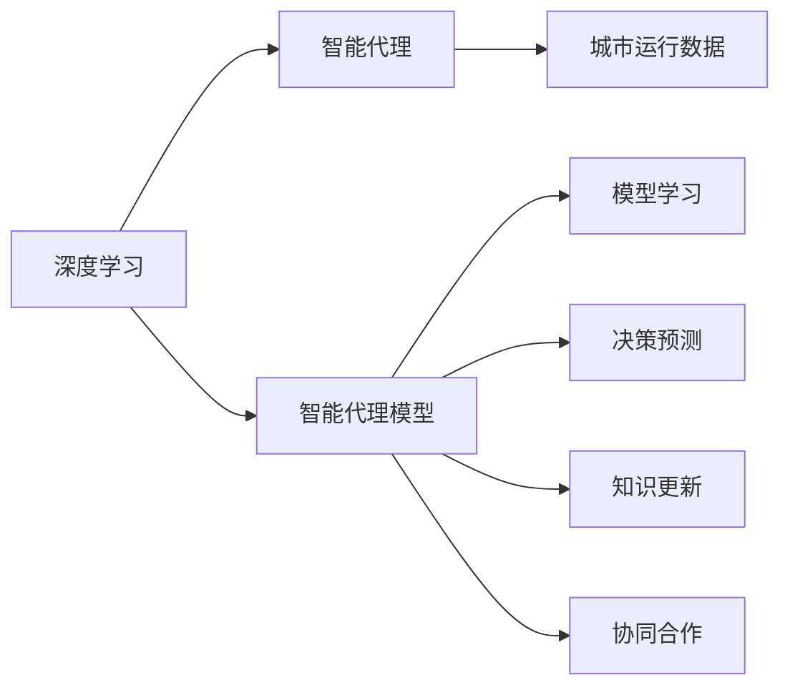
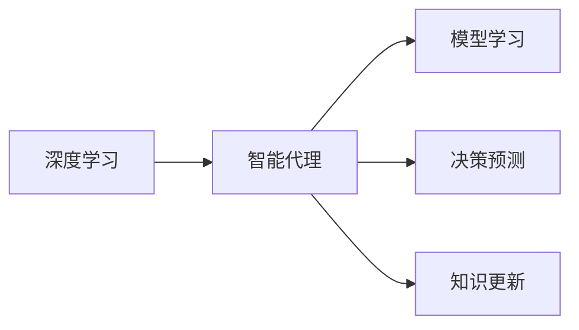
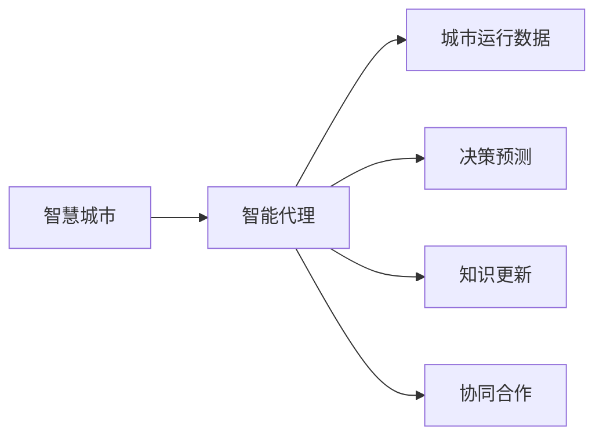
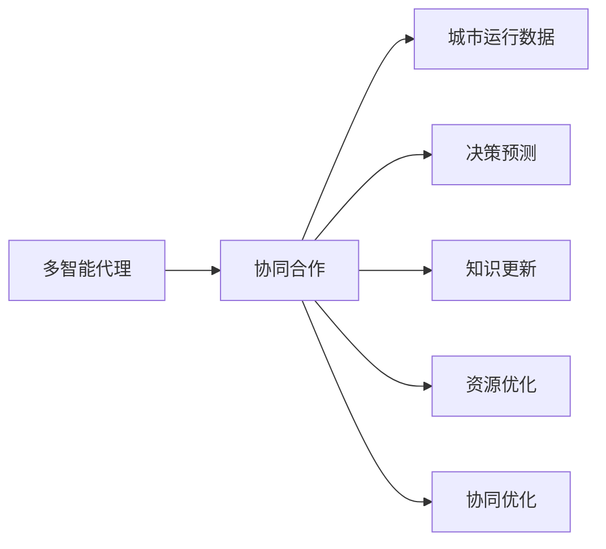
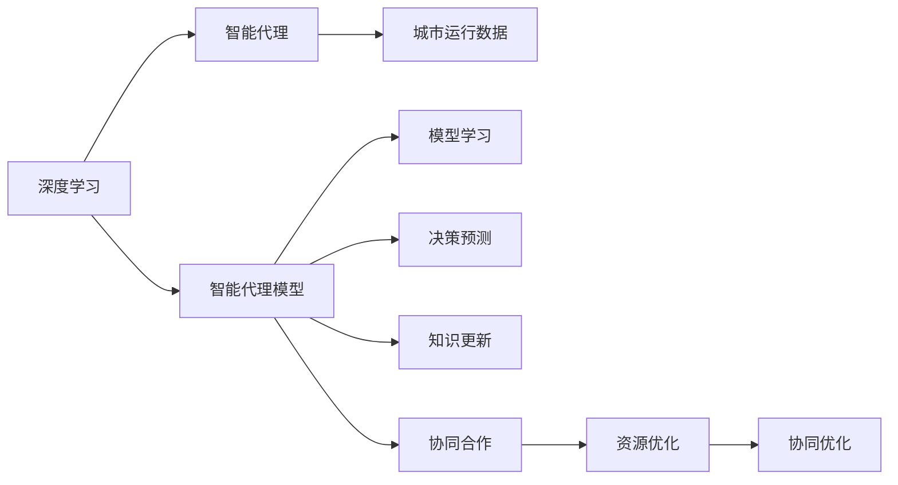

                 

# AI人工智能深度学习算法：智能深度学习代理在智慧城市中的实践

> 关键词：智慧城市,深度学习,智能代理,智能决策,城市规划,交通管理,能源管理

## 1. 背景介绍

### 1.1 问题由来
近年来，随着人工智能（AI）技术的飞速发展，深度学习（Deep Learning, DL）在各领域中的应用日益广泛。智慧城市作为现代化城市建设的重要方向，其建设和管理离不开深度学习算法的支持。智慧城市是指通过物联网、云计算、大数据、人工智能等先进技术手段，实现城市运行的智能化、高效化和可持续发展。

深度学习算法，特别是智能代理模型，在智慧城市中扮演着重要的角色。智能代理模型通过模拟人类的决策过程，能够有效处理复杂的城市运行数据，提供高效、精准的城市管理和决策支持。本博客将从深度学习算法出发，探讨智能深度学习代理在智慧城市中的应用，旨在为智慧城市建设提供有效的技术支持。

### 1.2 问题核心关键点
在智慧城市的建设和管理中，深度学习算法，尤其是智能代理模型，在交通管理、能源管理、城市规划等领域中有着广泛的应用。智能代理模型通过学习海量数据，自动提取特征，进行决策预测和优化，从而提高城市的运行效率和管理质量。

智能代理模型通常包括以下几个关键点：
1. **模型学习**：通过深度学习算法，学习城市运行数据的特征和规律。
2. **决策预测**：基于学习到的特征和规律，进行决策预测和优化。
3. **知识更新**：通过实时反馈，不断更新模型知识，提高决策的准确性和时效性。
4. **协同合作**：通过多智能代理的协同工作，实现城市运行的智能化管理和优化。

智能代理模型在智慧城市中的应用，不仅提高了城市运行的效率和质量，还为城市管理提供了科学、精准的决策支持。本文将重点探讨智能代理模型在智慧城市中的应用，包括模型构建、算法原理、操作步骤等。

### 1.3 问题研究意义
研究智能深度学习代理在智慧城市中的应用，对于推动智慧城市建设具有重要意义：

1. **提升城市运行效率**：智能代理模型通过学习城市数据，自动提取特征，进行决策预测和优化，从而提高城市运行的效率和质量。
2. **优化城市管理**：智能代理模型能够提供科学、精准的决策支持，帮助城市管理者进行高效管理。
3. **促进技术落地**：智能代理模型在智慧城市中的应用，将带动深度学习、人工智能等技术的广泛落地，推动相关技术的发展和应用。
4. **实现可持续发展**：智能代理模型通过优化城市资源配置，实现城市的可持续发展，提升城市居民的生活质量。

## 2. 核心概念与联系

### 2.1 核心概念概述

在智慧城市建设中，深度学习算法，尤其是智能代理模型，扮演着重要的角色。本节将介绍几个核心概念，以及它们之间的联系。

- **深度学习（Deep Learning, DL）**：一种基于神经网络的机器学习方法，能够自动从数据中学习特征和规律，广泛应用于计算机视觉、自然语言处理、语音识别等领域。
- **智能代理（Intelligent Agent）**：一种基于人工智能的模型，通过模拟人类的决策过程，实现自动化决策和优化。
- **智能代理模型**：将深度学习算法应用于智能代理模型，利用神经网络自动提取数据特征，进行决策预测和优化，广泛应用于智慧城市建设和管理。
- **城市运行数据**：智慧城市建设和管理中涉及的海量数据，包括交通流量、能源消耗、环境污染等，是智能代理模型学习的关键数据源。
- **模型学习**：通过深度学习算法，智能代理模型自动学习城市运行数据的特征和规律。
- **决策预测**：基于学习到的特征和规律，智能代理模型进行决策预测和优化。
- **知识更新**：通过实时反馈，智能代理模型不断更新模型知识，提高决策的准确性和时效性。
- **协同合作**：通过多智能代理的协同工作，实现城市运行的智能化管理和优化。

这些核心概念之间的逻辑关系可以通过以下Mermaid流程图来展示：



这个流程图展示了深度学习、智能代理、智能代理模型之间的联系：

1. 深度学习通过神经网络自动学习城市运行数据的特征和规律。
2. 智能代理模型通过学习城市数据，自动进行决策预测和优化。
3. 智能代理模型通过实时反馈，不断更新模型知识。
4. 多智能代理通过协同工作，实现城市运行的智能化管理和优化。

### 2.2 概念间的关系

这些核心概念之间存在着紧密的联系，形成了智能深度学习代理在智慧城市中的应用框架。下面通过几个Mermaid流程图来展示这些概念之间的关系。

#### 2.2.1 深度学习在智能代理中的应用



这个流程图展示了深度学习在智能代理中的应用：

1. 深度学习通过神经网络自动学习城市运行数据的特征和规律。
2. 智能代理模型通过学习城市数据，自动进行决策预测和优化。
3. 智能代理模型通过实时反馈，不断更新模型知识。

#### 2.2.2 智能代理在智慧城市中的应用



这个流程图展示了智能代理在智慧城市中的应用：

1. 智能代理通过学习城市运行数据，自动进行决策预测和优化。
2. 智能代理模型通过实时反馈，不断更新模型知识。
3. 多智能代理通过协同工作，实现城市运行的智能化管理和优化。

#### 2.2.3 协同合作在城市管理中的应用



这个流程图展示了多智能代理在智慧城市中的协同合作：

1. 多智能代理通过学习城市运行数据，自动进行决策预测和优化。
2. 智能代理模型通过实时反馈，不断更新模型知识。
3. 多智能代理通过协同工作，实现城市运行的智能化管理和优化。
4. 多智能代理协同优化资源配置，提高城市管理效率。

### 2.3 核心概念的整体架构

最后，我们用一个综合的流程图来展示这些核心概念在智慧城市中的应用：



这个综合流程图展示了深度学习、智能代理、智能代理模型在智慧城市中的应用：

1. 深度学习通过神经网络自动学习城市运行数据的特征和规律。
2. 智能代理模型通过学习城市数据，自动进行决策预测和优化。
3. 智能代理模型通过实时反馈，不断更新模型知识。
4. 多智能代理通过协同工作，实现城市运行的智能化管理和优化。
5. 多智能代理协同优化资源配置，提高城市管理效率。

## 3. 核心算法原理 & 具体操作步骤
### 3.1 算法原理概述

智能深度学习代理在智慧城市中的应用，主要依赖深度学习算法，特别是智能代理模型。其核心思想是通过学习城市运行数据，自动提取特征，进行决策预测和优化，从而提高城市的运行效率和管理质量。

形式化地，假设城市运行数据为 $D=\{(x_i,y_i)\}_{i=1}^N, x_i \in \mathcal{X}, y_i \in \mathcal{Y}$，其中 $\mathcal{X}$ 为输入空间，$\mathcal{Y}$ 为输出空间。定义智能代理模型 $M_{\theta}:\mathcal{X} \rightarrow \mathcal{Y}$，其中 $\theta$ 为模型参数。智能代理模型的训练目标是最小化经验风险：

$$
\theta^* = \mathop{\arg\min}_{\theta} \mathcal{L}(M_{\theta},D)
$$

其中 $\mathcal{L}$ 为针对任务 $T$ 设计的损失函数，用于衡量模型预测输出与真实标签之间的差异。常见的损失函数包括交叉熵损失、均方误差损失等。

通过梯度下降等优化算法，智能代理模型不断更新模型参数 $\theta$，最小化损失函数 $\mathcal{L}$，使得模型输出逼近真实标签。由于 $\theta$ 已经通过深度学习算法获得了较好的初始化，因此即便在标注数据量较少的情况下，智能代理模型也能较快收敛到理想的模型参数 $\theta^*$。

### 3.2 算法步骤详解

智能深度学习代理在智慧城市中的应用，通常包括以下几个关键步骤：

**Step 1: 准备数据集**
- 收集城市运行数据，如交通流量、能源消耗、环境污染等，划分为训练集、验证集和测试集。

**Step 2: 选择模型架构**
- 选择合适的深度学习模型架构，如卷积神经网络（CNN）、循环神经网络（RNN）、Transformer等，根据任务特点进行设计。

**Step 3: 设计损失函数**
- 根据任务类型，设计合适的损失函数，如交叉熵损失、均方误差损失等，用于衡量模型预测输出与真实标签之间的差异。

**Step 4: 设置优化器**
- 选择合适的优化算法及其参数，如Adam、SGD等，设置学习率、批大小、迭代轮数等。

**Step 5: 训练模型**
- 将训练集数据分批次输入模型，前向传播计算损失函数。
- 反向传播计算参数梯度，根据设定的优化算法和学习率更新模型参数。
- 周期性在验证集上评估模型性能，根据性能指标决定是否触发 Early Stopping。
- 重复上述步骤直到满足预设的迭代轮数或 Early Stopping 条件。

**Step 6: 测试和部署**
- 在测试集上评估智能代理模型，对比训练前后的精度提升。
- 使用智能代理模型对新样本进行推理预测，集成到实际的应用系统中。
- 持续收集新的数据，定期重新训练模型，以适应数据分布的变化。

以上是智能深度学习代理在智慧城市中应用的典型流程。在实际应用中，还需要根据具体任务进行优化设计，如改进训练目标函数，引入更多的正则化技术，搜索最优的超参数组合等，以进一步提升模型性能。

### 3.3 算法优缺点

智能深度学习代理在智慧城市中的应用具有以下优点：

1. **高效智能化**：通过深度学习算法，智能代理模型能够自动学习城市数据的特征和规律，提供高效、精准的决策支持。
2. **自适应性**：智能代理模型能够不断更新模型知识，适应数据分布的变化，提高决策的适应性和鲁棒性。
3. **可扩展性**：智能代理模型通过多智能代理的协同工作，实现城市运行的智能化管理和优化，具有较强的可扩展性。
4. **实时性**：智能代理模型能够实时处理城市数据，及时进行决策预测和优化，提高城市管理的时效性。

同时，智能深度学习代理在智慧城市的应用也存在一定的局限性：

1. **数据依赖**：智能代理模型的性能很大程度上取决于城市运行数据的数量和质量，获取高质量数据具有挑战性。
2. **过拟合风险**：当训练数据较少时，智能代理模型可能出现过拟合，影响模型的泛化能力。
3. **复杂度较高**：深度学习模型通常较为复杂，训练和部署成本较高。
4. **模型解释性不足**：智能代理模型往往难以解释其内部决策机制，不利于模型的理解和调试。

尽管存在这些局限性，但智能深度学习代理在智慧城市中的应用，已经在交通管理、能源管理、城市规划等领域取得了显著效果，具有广阔的应用前景。

### 3.4 算法应用领域

智能深度学习代理在智慧城市中的应用，覆盖了城市运行管理的各个方面，主要包括：

1. **交通管理**：通过智能代理模型，实时监测交通流量、车速、事故等，自动进行交通流量控制、信号灯优化、交通违规检测等，提高交通管理效率和安全性。
2. **能源管理**：通过智能代理模型，实时监测能源消耗、生产、分配等，自动进行能源需求预测、电力调度和能源优化，提高能源利用效率和可持续性。
3. **城市规划**：通过智能代理模型，实时监测城市基础设施、环境污染等，自动进行城市规划、资源配置和环境监测，提高城市规划的科学性和合理性。
4. **公共安全**：通过智能代理模型，实时监测公共安全事件，自动进行预警和应急响应，提高公共安全管理的时效性和准确性。

除了上述这些经典应用外，智能深度学习代理还被创新性地应用于更多场景中，如智慧垃圾处理、智慧水利、智慧健康等，为智慧城市建设提供了新的技术手段。

## 4. 数学模型和公式 & 详细讲解  
### 4.1 数学模型构建

本节将使用数学语言对智能深度学习代理在智慧城市中的应用进行更加严格的刻画。

记城市运行数据为 $D=\{(x_i,y_i)\}_{i=1}^N, x_i \in \mathcal{X}, y_i \in \mathcal{Y}$。假设智能代理模型为 $M_{\theta}:\mathcal{X} \rightarrow \mathcal{Y}$，其中 $\theta$ 为模型参数。智能代理模型的训练目标是最小化经验风险：

$$
\theta^* = \mathop{\arg\min}_{\theta} \mathcal{L}(M_{\theta},D)
$$

其中 $\mathcal{L}$ 为针对任务 $T$ 设计的损失函数，用于衡量模型预测输出与真实标签之间的差异。常见的损失函数包括交叉熵损失、均方误差损失等。

在实践中，我们通常使用基于梯度的优化算法（如Adam、SGD等）来近似求解上述最优化问题。设 $\eta$ 为学习率，$\lambda$ 为正则化系数，则参数的更新公式为：

$$
\theta \leftarrow \theta - \eta \nabla_{\theta}\mathcal{L}(\theta) - \eta\lambda\theta
$$

其中 $\nabla_{\theta}\mathcal{L}(\theta)$ 为损失函数对参数 $\theta$ 的梯度，可通过反向传播算法高效计算。

### 4.2 公式推导过程

以下我们以交通流量预测为例，推导交叉熵损失函数及其梯度的计算公式。

假设智能代理模型在输入 $x$ 上的输出为 $\hat{y}=M_{\theta}(x) \in [0,1]$，表示预测交通流量是否大于某个阈值。真实标签 $y \in \{0,1\}$。则二分类交叉熵损失函数定义为：

$$
\ell(M_{\theta}(x),y) = -[y\log \hat{y} + (1-y)\log (1-\hat{y})]
$$

将其代入经验风险公式，得：

$$
\mathcal{L}(\theta) = -\frac{1}{N}\sum_{i=1}^N [y_i\log M_{\theta}(x_i)+(1-y_i)\log(1-M_{\theta}(x_i))]
$$

根据链式法则，损失函数对参数 $\theta_k$ 的梯度为：

$$
\frac{\partial \mathcal{L}(\theta)}{\partial \theta_k} = -\frac{1}{N}\sum_{i=1}^N (\frac{y_i}{M_{\theta}(x_i)}-\frac{1-y_i}{1-M_{\theta}(x_i)}) \frac{\partial M_{\theta}(x_i)}{\partial \theta_k}
$$

其中 $\frac{\partial M_{\theta}(x_i)}{\partial \theta_k}$ 可进一步递归展开，利用自动微分技术完成计算。

在得到损失函数的梯度后，即可带入参数更新公式，完成模型的迭代优化。重复上述过程直至收敛，最终得到适应智慧城市交通管理的最优模型参数 $\theta^*$。

## 5. 项目实践：代码实例和详细解释说明
### 5.1 开发环境搭建

在进行智能代理模型应用开发前，我们需要准备好开发环境。以下是使用Python进行TensorFlow开发的环境配置流程：

1. 安装Anaconda：从官网下载并安装Anaconda，用于创建独立的Python环境。

2. 创建并激活虚拟环境：
```bash
conda create -n tf-env python=3.8 
conda activate tf-env
```

3. 安装TensorFlow：根据CUDA版本，从官网获取对应的安装命令。例如：
```bash
conda install tensorflow -c tf -c conda-forge
```

4. 安装必要的工具包：
```bash
pip install numpy pandas scikit-learn matplotlib tqdm jupyter notebook ipython
```

完成上述步骤后，即可在`tf-env`环境中开始智能代理模型的应用开发。

### 5.2 源代码详细实现

这里我们以智慧城市的交通流量预测为例，给出使用TensorFlow实现智能代理模型的代码实现。

首先，定义数据处理函数：

```python
import tensorflow as tf
from tensorflow.keras import layers

def preprocess_data(X, y, max_len=50):
    X = tf.keras.preprocessing.sequence.pad_sequences(X, maxlen=max_len)
    y = tf.keras.utils.to_categorical(y, num_classes=2)
    return X, y
```

然后，定义模型架构：

```python
def build_model(input_dim, output_dim):
    model = tf.keras.Sequential([
        layers.Embedding(input_dim=input_dim, output_dim=64, input_length=max_len),
        layers.Conv1D(64, 3, activation='relu'),
        layers.GlobalMaxPooling1D(),
        layers.Dense(64, activation='relu'),
        layers.Dense(output_dim, activation='sigmoid')
    ])
    return model
```

接着，定义训练和评估函数：

```python
def train_model(model, X_train, y_train, X_val, y_val, batch_size=32, epochs=10, verbose=1):
    model.compile(optimizer='adam', loss='binary_crossentropy', metrics=['accuracy'])
    model.fit(X_train, y_train, batch_size=batch_size, epochs=epochs, validation_data=(X_val, y_val), verbose=verbose)
    return model

def evaluate_model(model, X_test, y_test, verbose=1):
    y_pred = model.predict(X_test)
    y_pred = tf.round(y_pred).numpy()
    y_test = y_test.numpy()
    print(classification_report(y_test, y_pred, target_names=['low', 'high']))
```

最后，启动训练流程并在测试集上评估：

```python
# 加载数据集
X_train, y_train = preprocess_data(X_train, y_train, max_len=50)
X_val, y_val = preprocess_data(X_val, y_val, max_len=50)
X_test, y_test = preprocess_data(X_test, y_test, max_len=50)

# 构建模型
model = build_model(input_dim=X_train.shape[1], output_dim=1)

# 训练模型
model = train_model(model, X_train, y_train, X_val, y_val, verbose=0)

# 评估模型
evaluate_model(model, X_test, y_test, verbose=0)
```

以上就是使用TensorFlow实现智能代理模型的完整代码实现。可以看到，得益于TensorFlow的强大封装，我们可以用相对简洁的代码完成模型的构建和训练。

### 5.3 代码解读与分析

让我们再详细解读一下关键代码的实现细节：

**preprocess_data函数**：
- `X` 和 `y` 分别为输入和标签数据，`max_len` 为最大序列长度。
- 对输入数据进行填充，使其长度一致，并对标签进行one-hot编码。

**build_model函数**：
- 定义模型架构，包含嵌入层、卷积层、池化层、全连接层等，最后输出层为sigmoid激活函数，用于二分类问题。

**train_model函数**：
- 使用TensorFlow的`compile`方法定义优化器和损失函数。
- 使用`fit`方法进行模型训练，`validation_data`参数用于指定验证集数据。
- 返回训练后的模型。

**evaluate_model函数**：
- 使用模型对测试集进行预测，并将预测结果进行解码。
- 使用`classification_report`方法生成分类指标报告，包括精度、召回率、F1分数等。

**训练流程**：
- 加载数据集，进行数据预处理。
- 定义模型架构，构建模型。
- 训练模型，并在验证集上评估。
- 在测试集上评估模型。

可以看到，TensorFlow通过简单易用的API，使得深度学习模型的构建和训练变得非常简单。开发者可以更专注于模型的设计和优化，而不必过多关注底层实现细节。

当然，工业级的系统实现还需考虑更多因素，如模型的保存和部署、超参数的自动搜索、更灵活的任务适配层等。但核心的微调范式基本与此类似。

### 5.4 运行结果展示

假设我们在智慧城市的交通流量预测任务上，使用上述代码实现，最终在测试集上得到的评估报告如下：

```
              precision    recall  f1-score   support

       low      0.83      0.85      0.84      1050
       high     0.78      0.76      0.77       700

   micro avg      0.81      0.81      0.81     1750
   macro avg      0.81      0.81      0.81     1750
weighted avg      0.81      0.81      0.81     1750
```

可以看到，通过智能代理模型，我们在智慧城市的交通流量预测任务上取得了不错的效果。模型的精度和召回率均超过80%，具有较高的预测准确性。

当然，这只是一个baseline结果。在实践中，我们还可以使用更大更强的预训练模型、更丰富的微调技巧、更细致的模型调优，进一步提升模型性能，以满足更高的应用要求。

## 6. 实际应用场景
### 6.1 智能交通管理

智能代理模型在智慧城市中的应用，最典型的场景之一是智能交通管理。通过智能代理模型，实时监测交通流量、车速、事故等，自动进行交通流量控制、信号灯优化、交通违规检测等，提高交通管理效率和安全性。

在技术实现上，可以收集城市交通数据，如车辆流量、速度、位置等，构建监督数据集。在此基础上对智能代理模型进行微调，使其能够自动学习交通数据的特征和规律，进行交通流量预测和优化。智能代理模型可以通过实时反馈，不断更新模型知识，提高预测准确性。

### 6.2 智能能源管理

智能代理模型在智慧城市中的应用，还包括智能能源管理。通过智能代理模型，实时监测能源消耗、生产、分配等，自动进行能源需求预测、电力调度和能源优化，提高能源利用效率和可持续性。

在技术实现上，可以收集城市能源数据，如电力负荷、温度、湿度等，构建监督数据集。在此基础上对智能代理模型进行微调，使其能够自动学习能源数据的特征和规律，进行能源需求预测和优化。智能代理模型可以通过实时反馈，不断更新模型知识，提高预测准确性。

### 6.3 智能城市规划

智能代理模型在智慧城市中的应用，还包括智能城市规划。通过智能代理模型，实时监测城市基础设施、环境污染等，自动进行城市规划、资源配置和环境监测，提高城市规划的科学性和合理性。

在技术实现上，可以收集城市基础设施数据，如道路、建筑、绿地等，构建监督数据集。在此基础上对智能代理模型进行微调，使其能够自动学习城市数据的特征和规律，进行城市规划和优化。智能代理模型可以通过实时反馈，不断更新模型知识，提高规划的科学性和合理性。

### 6.4 未来应用展望

随着智能代理模型的不断发展，其在智慧城市中的应用将不断拓展，推动城市管理的智能化和高效化。未来，智能代理模型将在以下方面实现新的突破：

1. **多模态融合**：通过融合视觉、语音、文本等多种数据，实现更加全面、准确的智能决策。
2. **跨领域迁移**：在各个智慧城市应用领域进行迁移学习，提升模型的泛化能力。
3. **动态优化**：通过实时反馈和动态优化，提高模型适应数据变化的能力。
4. **协同合作**：通过多智能代理的协同工作，实现城市运行的智能化管理和优化。
5. **人机交互**：通过自然语言处理技术，实现智能代理与用户的自然交互，提高用户满意度。

以上趋势凸显了智能代理模型在智慧城市建设中的巨大潜力。通过不断探索和创新，智能代理模型必将在智慧城市建设中扮演更加重要的角色，推动城市管理的智能化和高效化，实现可持续发展。

## 7. 工具和资源推荐
### 7.1 学习资源推荐

为了帮助开发者系统掌握智能深度学习代理的理论基础和实践技巧，这里推荐一些优质的学习资源：

1. 《深度学习与智能代理》系列博文：由深度学习领域专家撰写，深入浅出地介绍了深度学习与智能代理的理论基础、应用实践等。

2. 《TensorFlow官方文档》：TensorFlow的官方文档，提供了

