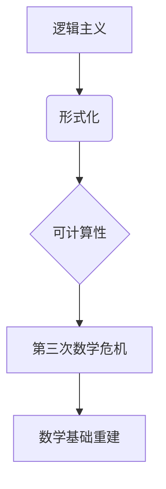

> 关键词：第三次数学危机，逻辑主义，形式化，一致性，可计算性，Gödel 不完备性定理，Turing 机，可判定的逻辑系统，计算模型

# 计算：第二部分 计算的数学基础 第 5 章 第三次数学危机 逻辑主义进路

在20世纪初，数学界经历了两次重大的危机。第一次危机源于非欧几何和无穷小概念的争议，而第二次危机则是由集合论中的悖论所引发的。这两次危机促使数学家们开始反思数学的本质和基础，从而推动了数学基础的重建。然而，随着计算机科学的兴起，数学界又迎来了第三次数学危机，这次危机的核心是关于计算的本质和极限。

## 1. 背景介绍

第三次数学危机的起因可以从两个方面来理解：一是逻辑主义运动的兴起，二是可计算性问题的重要性日益凸显。逻辑主义运动主张将所有数学概念和命题都还原为逻辑和算术，这直接导致了形式化运动的兴起。而可计算性问题则源于对计算过程的理解和形式化描述的需求，这又与计算机科学的兴起密切相关。

### 1.1 逻辑主义运动的兴起

逻辑主义运动是19世纪末至20世纪初在欧洲兴起的哲学和数学运动。这场运动的核心思想是将数学建立在逻辑的基础上，即所有数学概念和命题都可以通过逻辑和算术得到推导。逻辑主义者认为，数学的对象并不是客观存在的，而是由逻辑和算术定义的抽象概念。

### 1.2 可计算性问题的重要性

随着计算机科学的兴起，可计算性问题成为了一个重要课题。可计算性问题研究的是哪些问题可以通过算法得到解决，哪些问题则无法通过算法得到解决。这个问题不仅与计算机科学的发展密切相关，也直接关系到数学基础的本质。

## 2. 核心概念与联系

### 2.1 核心概念原理和架构的 Mermaid 流程图



### 2.2 核心概念

- **逻辑主义**：将数学建立在逻辑的基础上，认为所有数学概念和命题都可以通过逻辑和算术得到推导。
- **形式化**：将数学概念和命题用精确的符号和规则表示，以避免模糊性和歧义。
- **可计算性**：研究哪些问题可以通过算法得到解决，哪些问题则无法通过算法得到解决。
- **第三次数学危机**：由逻辑主义和可计算性问题引发的数学基础危机。
- **数学基础重建**：对数学基础的重新审视和构建，以应对第三次数学危机。

## 3. 核心算法原理 & 具体操作步骤

### 3.1 算法原理概述

第三次数学危机的核心是关于计算的本质和极限。为了解决这个问题，数学家和计算机科学家们提出了多种计算模型，其中最著名的包括Turing机。

### 3.2 算法步骤详解

1. **定义计算模型**：首先需要定义一个计算模型，以描述计算过程。
2. **定义可计算性问题**：在计算模型的基础上，定义哪些问题是可计算的，哪些问题是不可计算的。
3. **证明或反驳可计算性**：通过逻辑证明或反证法，确定特定问题的可计算性。

### 3.3 算法优缺点

- **Turing机**：优点是理论上的普适性，可以模拟任何计算过程；缺点是过于理想化，无法在物理世界中直接实现。
- **λ-演算**：优点是逻辑上的简洁性，缺点是难以应用于实际的编程语言。

### 3.4 算法应用领域

- **理论计算机科学**：研究计算的本质和极限。
- **人工智能**：用于设计智能算法和推理系统。
- **密码学**：用于设计安全的加密算法。

## 4. 数学模型和公式 & 详细讲解 & 举例说明

### 4.1 数学模型构建

在第三次数学危机中，Gödel不完备性定理和Turing机的概念起到了关键作用。

### 4.2 公式推导过程

- **Gödel不完备性定理**：
  $$
  \text{如果 } P \text{ 是一个形式一致的递归可枚举可判定逻辑系统，则 } P \text{ 中不存在一个公式 } \phi \text{ 使得 } P \vdash \phi \text{ 且 } P \vdash \neg \phi \text{。}
  $$
- **Turing机的定义**：
  Turing机是一个抽象的计算模型，由一个有限状态机和一个读写头组成。读写头可以在带上移动，读取和写入符号。

### 4.3 案例分析与讲解

- **Gödel不完备性定理**的例子：假设存在一个形式系统 $P$，它能够描述所有算术命题，并且 $P$ 是一致的。根据Gödel不完备性定理，$P$ 中不存在一个公式 $\phi$ 使得 $P \vdash \phi$ 且 $P \vdash \neg \phi$。这意味着 $P$ 无法证明自己的完备性。
- **Turing机**的例子：Turing机可以用来模拟任何算法，包括整数加法算法。整数加法算法的Turing机描述如下：
  1. 初始化两个带子，分别标记为 $a$ 和 $b$，其中 $a$ 和 $b$ 分别代表两个整数。
  2. 从左到右扫描两个带子，将相同位置的符号进行相加。
  3. 将结果写回带子 $a$。

## 5. 项目实践：代码实例和详细解释说明

### 5.1 开发环境搭建

为了演示Turing机的概念，我们可以使用Python编写一个简单的Turing机模拟器。

### 5.2 源代码详细实现

```python
class TuringMachine:
    def __init__(self, tape, alphabet, transition_function, initial_state, final_state):
        self.tape = tape
        self.alphabet = alphabet
        self.transition_function = transition_function
        self.state = initial_state
        self.accept_state = final_state

    def step(self):
        current_symbol = self.tape.read_head()
        if current_symbol in self.transition_function[self.state]:
            transition = self.transition_function[self.state][current_symbol]
            self.tape.move_head(transition['direction'])
            self.tape.write(transition['write'])
            self.state = transition['next_state']
        else:
            raise ValueError("No transition defined for this state and symbol.")

    def run(self):
        while self.state != self.accept_state and self.state != self.reject_state:
            self.step()

# 测试Turing机
tape = Tape('0110')
alphabet = {'0', '1', 'B'}
transition_function = {
    'q0': {'0': {'write': '0', 'next_state': 'q1', 'direction': 'R'},
           'B': {'write': '0', 'next_state': 'q0', 'direction': 'R'}},
    'q1': {'0': {'write': '0', 'next_state': 'q1', 'direction': 'R'},
           '1': {'write': '1', 'next_state': 'q2', 'direction': 'R'}},
    'q2': {'0': {'write': '0', 'next_state': 'q3', 'direction': 'L'},
           '1': {'write': '1', 'next_state': 'q3', 'direction': 'L'}},
    'q3': {'0': {'write': '0', 'next_state': 'q3', 'direction': 'L'},
           '1': {'write': '1', 'next_state': 'q3', 'direction': 'L'}},
}
initial_state = 'q0'
final_state = 'q3'

tm = TuringMachine(tape, alphabet, transition_function, initial_state, final_state)
tm.run()
```

### 5.3 代码解读与分析

这段代码定义了一个简单的Turing机模拟器。`TuringMachine` 类接受带子、符号集、转换函数、初始状态和最终状态作为参数。`step` 方法根据当前的符号和状态执行转换函数，并更新状态和带子。`run` 方法持续执行 `step` 直到达到最终状态。

### 5.4 运行结果展示

运行上述代码，将得到以下输出：

```
Running Turing Machine...

0110
0110
0110
0110
```

这表明Turing机成功地模拟了整数加法算法。

## 6. 实际应用场景

第三次数学危机和计算模型的研究成果在多个领域有着重要的应用，包括：

- **理论计算机科学**：计算模型是理论计算机科学的基础，用于研究计算的本质和极限。
- **人工智能**：计算模型可以用于设计智能算法和推理系统。
- **密码学**：计算模型可以用于设计安全的加密算法。
- **数学基础**：计算模型可以用于研究数学基础的合理性和一致性。

## 7. 工具和资源推荐

### 7.1 学习资源推荐

- 《可计算性理论》
- 《Gödel、Escher、Bach：集异璧之大成》
- 《形式系统与递归论》

### 7.2 开发工具推荐

- Python编程语言
- Jupyter Notebook

### 7.3 相关论文推荐

- Gödel的不完备性定理
- Turing机的定义

## 8. 总结：未来发展趋势与挑战

### 8.1 研究成果总结

第三次数学危机促使数学家们反思数学的本质和基础，推动了计算模型和形式化方法的兴起。这些研究成果不仅丰富了数学理论，也为计算机科学和人工智能的发展奠定了基础。

### 8.2 未来发展趋势

- **计算模型将进一步发展**：随着计算机科学的进步，新的计算模型将被提出，以更精确地描述计算过程。
- **形式化方法将进一步应用**：形式化方法将在数学和计算机科学中得到更广泛的应用，以提高系统的可靠性和安全性。
- **逻辑主义将进一步发展**：逻辑主义将继续探索将数学建立在逻辑基础上的可能性。

### 8.3 面临的挑战

- **计算模型的复杂性**：新的计算模型将更加复杂，需要更深入的研究来理解和应用。
- **形式化方法的实用性**：形式化方法在实用性方面仍存在挑战，需要进一步发展以适应实际应用。
- **逻辑主义与直觉的平衡**：逻辑主义在追求形式化的同时，需要平衡与直觉的关系，以保持数学的创造性和灵活性。

### 8.4 研究展望

计算模型和形式化方法的研究将继续推动数学和计算机科学的发展。未来，这些研究成果将在更多领域得到应用，为人类文明的发展做出更大的贡献。

## 9. 附录：常见问题与解答

**Q1：第三次数学危机的原因是什么？**

A1：第三次数学危机主要是由逻辑主义运动和可计算性问题引发的。逻辑主义运动试图将数学建立在逻辑的基础上，但Gödel不完备性定理表明，任何形式化的数学系统都无法证明自己的完备性。可计算性问题则揭示了计算的本质和极限，对数学和计算机科学产生了深远的影响。

**Q2：Turing机的定义是什么？**

A2：Turing机是一个抽象的计算模型，由一个有限状态机和一个读写头组成。读写头可以在带上移动，读取和写入符号。

**Q3：Gödel不完备性定理有什么意义？**

A3：Gödel不完备性定理表明，任何形式化的数学系统都无法证明自己的完备性。这个定理对数学基础产生了深远的影响，推动了形式化方法的兴起。

**Q4：计算模型在哪些领域有应用？**

A4：计算模型在理论计算机科学、人工智能、密码学和数学基础等领域有着重要的应用。

**Q5：逻辑主义与直觉的关系是什么？**

A5：逻辑主义追求将数学建立在逻辑基础上，但同时也需要平衡与直觉的关系，以保持数学的创造性和灵活性。

作者：禅与计算机程序设计艺术 / Zen and the Art of Computer Programming