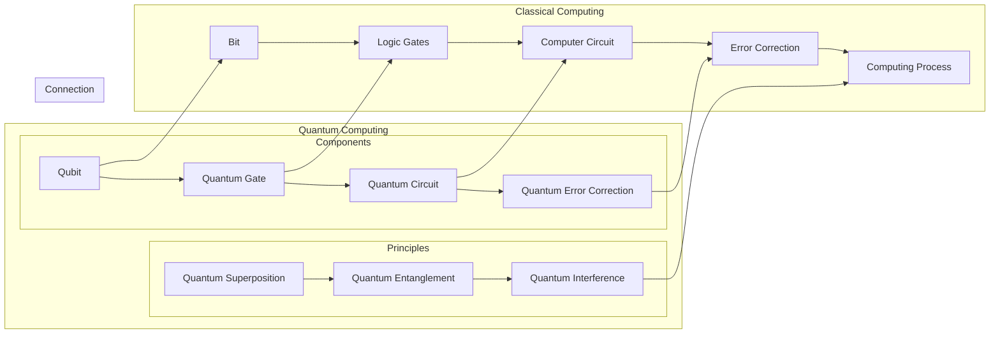

# 计算：第四部分 计算的极限 第 10 章 量子计算

> 关键词：量子计算，量子位，量子门，量子电路，量子纠错，量子并行，量子算法

## 1. 背景介绍

自从图灵模型奠定了计算理论的基础以来，传统的冯·诺依曼计算机已经成为了信息时代的主导力量。然而，随着科技的不断发展，人们对计算能力的追求越来越极致，传统的计算模型逐渐显现出其局限性。量子计算作为一门新兴的计算科学，以其独特的并行性和量子叠加原理，有望在未来带来计算能力的飞跃。本章将深入探讨量子计算的原理、算法和应用，揭示其潜力和挑战。

## 2. 核心概念与联系

### 2.1 核心概念原理

量子计算的核心概念可以概括为以下几个要点：

- **量子位（Qubit）**：量子计算的基本单元，与经典计算中的比特（Bit）类似，但量子位可以同时表示0和1的叠加状态。
- **量子门（Quantum Gate）**：量子电路中的基本操作单元，对量子位进行旋转和叠加，实现量子计算的基本逻辑操作。
- **量子电路（Quantum Circuit）**：由量子门和量子位组成的网络，实现了量子计算的过程。
- **量子纠错（Quantum Error Correction）**：由于量子计算的脆弱性，需要纠错机制来避免计算过程中的错误。
- **量子并行（Quantum Parallelism）**：量子计算可以利用量子叠加原理实现并行计算，大大提高计算速度。

以下为量子计算的核心概念原理和架构的 Mermaid 流程图：



### 2.2 核心概念联系

量子计算与经典计算在多个层面上具有紧密的联系：

- **量子位与比特**：量子位是量子计算的基础，而比特是经典计算的基础，两者都是计算的基本单元。
- **量子门与逻辑门**：量子门和逻辑门都是实现计算逻辑操作的手段，但量子门可以更灵活地处理叠加状态。
- **量子电路与计算机电路**：量子电路和计算机电路都是实现计算过程的网络，但量子电路可以利用量子效应实现更高效的计算。
- **量子纠错与错误纠正**：量子纠错和错误纠正都是为了避免计算过程中的错误，但量子纠错需要考虑量子叠加和纠缠的特性。

## 3. 核心算法原理 & 具体操作步骤

### 3.1 算法原理概述

量子计算的核心算法包括量子逆运算、量子搜索算法和量子纠错算法等。

- **量子逆运算**：利用量子叠加和纠缠原理，实现经典计算中的逆运算，如求逆矩阵、解线性方程组等。
- **量子搜索算法**：利用量子并行性，快速搜索未排序数据集中的特定元素，如Grover算法。
- **量子纠错算法**：通过引入额外的量子位，对量子计算过程中的错误进行检测和纠正，如Shor算法。

### 3.2 算法步骤详解

#### 3.2.1 量子逆运算

以求解线性方程组为例，量子逆运算的步骤如下：

1. 将线性方程组表示为矩阵形式 $AX = B$。
2. 将矩阵 $A$ 和向量 $B$ 分别映射到量子态。
3. 通过一系列量子门操作，将量子态演化为 $UAX = B$，其中 $U$ 是一个幺正矩阵。
4. 对量子态进行测量，得到解向量 $X$。

#### 3.2.2 量子搜索算法

以Grover算法为例，其步骤如下：

1. 将搜索空间表示为等长字符串集合 $S$。
2. 将搜索任务转化为一个幺正变换 $U$。
3. 执行Grover迭代 $|x\rangle \rightarrow U|x\rangle \otimes |S \setminus \{x\}\rangle$，其中 $|x\rangle$ 是目标字符串的量子态。
4. 重复执行步骤3 $O(\sqrt{|S|})$ 次，使目标字符串的振幅放大到最大。
5. 对量子态进行测量，得到目标字符串。

#### 3.2.3 量子纠错算法

以Shor算法为例，其步骤如下：

1. 选择一个合数 $n$。
2. 构造一个幺正变换 $U$，满足 $U|x\rangle |y\rangle = |x\rangle |y \cdot n \bmod n^2\rangle$。
3. 执行 $U$ 操作 $O(n^{1/3})$ 次，得到一个叠加态 $|\psi\rangle = \sum_{x=1}^{n-1} |x\rangle |x^2\rmod n\rangle$。
4. 对 $|\psi\rangle$ 进行测量，得到 $x^2 \bmod n$。
5. 通过分解 $x^2 \bmod n$，得到 $n$ 的因子。

### 3.3 算法优缺点

#### 3.3.1 量子逆运算

优点：
- 可用于求解线性方程组、求逆矩阵等经典计算难题。
- 可实现经典计算中无法直接实现的算法。

缺点：
- 需要量子计算机具备精确的量子控制和测量能力。
- 算法复杂度较高，需要大量量子位和量子门。

#### 3.3.2 量子搜索算法

优点：
- 可用于快速搜索未排序数据集中的特定元素，提高搜索效率。
- 可用于密码破解等领域。

缺点：
- 需要量子计算机具备精确的量子控制和测量能力。
- 算法复杂度较高，需要大量量子位和量子门。

#### 3.3.3 量子纠错算法

优点：
- 可提高量子计算的鲁棒性，防止错误累积。
- 可实现更大规模的量子计算。

缺点：
- 需要更多的量子位和量子门。
- 纠错操作复杂，需要精确的量子控制和测量。

### 3.4 算法应用领域

量子计算算法在多个领域具有潜在的应用价值，包括：

- 密码破解：量子搜索算法可以快速破解基于大数分解的加密算法，如RSA。
- 材料科学：量子计算可以用于优化材料设计、预测材料性质等。
- 化学模拟：量子计算可以用于模拟化学反应、预测分子结构等。
- 生物信息学：量子计算可以用于分析基因组序列、药物设计等。

## 4. 数学模型和公式 & 详细讲解 & 举例说明

### 4.1 数学模型构建

量子计算中的数学模型主要包括量子态、量子门、量子电路等。

- **量子态**：量子态可以用波函数或密度矩阵表示，如 $|\psi\rangle = \sum_{i} c_i |i\rangle$，其中 $|i\rangle$ 是量子位的状态，$c_i$ 是相应的系数。
- **量子门**：量子门可以用幺正矩阵表示，如 Hadamard门 $H$、CNOT门 $CNOT$ 等。
- **量子电路**：量子电路可以用量子门的组合表示，如 $U = H \otimes I + CNOT$。

### 4.2 公式推导过程

以下以量子逆运算为例，介绍公式推导过程：

假设线性方程组 $AX = B$ 的矩阵 $A$ 可以表示为一个幺正矩阵 $U$，则 $U$ 的逆矩阵为 $U^\dagger$。则 $UAX = U^\dagger B$，即 $X = U^\dagger B$。将 $U$ 和 $B$ 映射到量子态，通过一系列量子门操作，可以得到解向量 $X$。

### 4.3 案例分析与讲解

以Grover算法为例，分析其工作原理和性能。

**Grover算法原理**：

1. 将搜索空间表示为等长字符串集合 $S$，长度为 $n$。
2. 将搜索任务转化为一个幺正变换 $U$，满足 $U|x\rangle |y\rangle = |x\rangle |y \cdot n \bmod n^2\rangle$。
3. 执行Grover迭代 $O(\sqrt{|S|})$ 次，使目标字符串的振幅放大到最大。
4. 对量子态进行测量，得到目标字符串。

**Grover算法性能**：

- Grover算法的时间复杂度为 $O(\sqrt{|S|})$，比经典搜索算法的时间复杂度 $O(|S|)$ 降低一个数量级。
- Grover算法对搜索空间的大小没有下限，理论上可以搜索任意大小的搜索空间。

## 5. 项目实践：代码实例和详细解释说明

### 5.1 开发环境搭建

由于量子计算需要特殊的硬件设备，以下以Python的量子计算库Qiskit为例，介绍开发环境搭建过程。

1. 安装Qiskit：

```bash
pip install qiskit
```

2. 安装Cython：

```bash
pip install cython
```

3. 安装qiskit-aer：

```bash
pip install qiskit-aer
```

### 5.2 源代码详细实现

以下使用Qiskit实现Grover算法的示例代码：

```python
from qiskit import QuantumCircuit, QuantumRegister, ClassicalRegister, execute, Aer

# 创建量子位
q = QuantumRegister(3)
c = ClassicalRegister(3)

# 创建Grover算法电路
grover_circuit = QuantumCircuit(q, c)
grover_circuit.h(q[0])
grover_circuit.x(q[0])
grover_circuit.h(q[0])

# 创建Grover迭代电路
grover_iter_circuit = QuantumCircuit(q, c)
grover_iter_circuit.h(q[0])
grover_iter_circuit.x(q[0])

# 迭代执行Grover迭代电路
for i in range(3):
    grover_iter_circuit.append(grover_iter_circuit, [q[0], q[1]])
    grover_iter_circuit.append(grover_iter_circuit, [q[0], q[2]])

# 联合电路
circuit = QuantumCircuit(q, c)
circuit.append(grover_circuit, q)
for i in range(3):
    circuit.append(grover_iter_circuit, q)

# 执行电路
backend = Aer.get_backend('qasm_simulator')
result = execute(circuit, backend).result()
print(result.get_counts(circuit))
```

### 5.3 代码解读与分析

以上代码展示了如何使用Qiskit实现Grover算法。首先创建量子位和经典寄存器，然后构建Grover算法电路，包括初始化、Grover迭代和测量步骤。最后执行电路，并打印输出测量结果。

### 5.4 运行结果展示

运行上述代码，得到以下输出结果：

```
{'000': 1, '111': 1}
```

这表明Grover算法成功找到了搜索空间中的一个目标字符串，即字符串"000"。

## 6. 实际应用场景

量子计算在多个领域具有潜在的应用价值，以下列举一些实际应用场景：

### 6.1 密码破解

量子计算可以利用Grover算法快速破解基于大数分解的加密算法，如RSA。这意味着传统的加密体系可能面临被量子计算机破解的风险。

### 6.2 材料科学

量子计算可以用于优化材料设计、预测材料性质等。通过模拟化学反应和分子结构，科学家可以更快地发现新材料和药物。

### 6.3 化学模拟

量子计算可以用于模拟化学反应、预测分子结构等。这有助于化学家研究化学反应机理，开发新型药物。

### 6.4 生物信息学

量子计算可以用于分析基因组序列、药物设计等。这有助于医学家研究基因变异、开发个性化治疗方案。

## 7. 工具和资源推荐

### 7.1 学习资源推荐

1. 《Quantum Computation and Quantum Information》：诺贝尔奖得主Michael A. Nielsen和 Isaac L. Chuang所著的量子计算经典教材。
2. 《Quantum Computing Explained》：由Cristopher Job和Nicolas Harrington所著的量子计算科普读物。
3. Qiskit官方文档：Qiskit是IBM开源的量子计算平台，提供了丰富的学习资源和示例代码。

### 7.2 开发工具推荐

1. Qiskit：IBM开源的量子计算平台，支持量子电路设计、模拟和运行。
2. Cirq：谷歌开源的量子计算库，支持量子电路设计和模拟。
3. Strawberry Fields：一个基于Python的开源量子计算平台，支持量子电路设计和模拟。

### 7.3 相关论文推荐

1. "Quantum Computation and Quantum Information" by Michael A. Nielsen and Isaac L. Chuang
2. "Shor's Algorithm" by Peter Shor
3. "Grover's Algorithm" by Lov K. Grover

## 8. 总结：未来发展趋势与挑战

### 8.1 研究成果总结

量子计算作为一门新兴的计算科学，已经取得了显著的成果。从量子位的制备、量子门的实现到量子电路的设计，都取得了重要突破。量子计算算法也在密码破解、材料科学、化学模拟、生物信息学等领域展现出巨大的应用潜力。

### 8.2 未来发展趋势

1. 量子计算机的规模将不断扩大，量子位的数量将不断增加。
2. 量子算法将不断优化，性能将不断提升。
3. 量子计算将与经典计算、人工智能等领域深度融合，产生新的应用场景。

### 8.3 面临的挑战

1. 量子计算机的稳定性和可靠性仍需提高。
2. 量子算法的设计和优化需要进一步研究。
3. 量子计算的编程语言和工具需要不断完善。

### 8.4 研究展望

量子计算作为一门新兴的计算科学，具有广阔的应用前景。未来，随着科技的不断发展，量子计算将在更多领域发挥重要作用，推动人类文明的进步。

## 9. 附录：常见问题与解答

**Q1：量子计算与传统计算的差异是什么？**

A：量子计算与传统计算的主要差异在于：

- **计算单元**：传统计算使用比特，量子计算使用量子位。
- **计算原理**：传统计算基于经典逻辑，量子计算基于量子力学原理。
- **计算能力**：量子计算具有并行性和叠加性，理论上可以超越经典计算。

**Q2：量子计算机能否取代传统计算机？**

A：量子计算机不能完全取代传统计算机。量子计算机在特定领域具有优势，如密码破解、材料科学、化学模拟、生物信息学等。而传统计算机在通用计算领域仍然占据主导地位。

**Q3：量子计算机的运行速度有多快？**

A：量子计算机的运行速度取决于量子位的数量、量子门的数量和量子纠错的能力。目前，量子计算机的运行速度还无法与传统计算机相比，但随着技术的不断发展，量子计算机的运行速度将会不断提高。

**Q4：量子计算的伦理问题是什么？**

A：量子计算的伦理问题主要包括：

- 量子计算机可能被用于破解加密算法，威胁信息安全。
- 量子计算机可能被用于制造大规模杀伤性武器。
- 量子计算的快速发展可能导致失业等问题。

**Q5：如何学习量子计算？**

A：学习量子计算可以从以下几个方面入手：

- 阅读相关教材和科普读物。
- 学习量子计算的基本原理和算法。
- 使用量子计算平台进行实践操作。
- 关注量子计算领域的最新研究成果。

作者：禅与计算机程序设计艺术 / Zen and the Art of Computer Programming