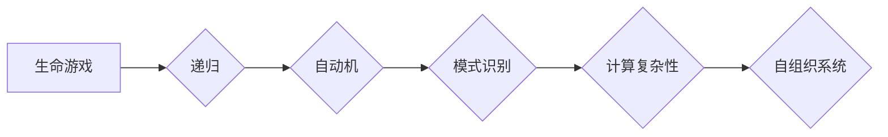

# 计算：第四部分 计算的极限 第 11 章 复杂性计算 生命游戏

> 关键词：复杂性计算，生命游戏，递归，自动机，模式识别，计算复杂性，自组织系统

## 1. 背景介绍

在计算机科学的浩瀚宇宙中，我们不断探索着计算的极限，从简单的逻辑电路到复杂的算法，从基础的算术运算到深度的学习模型。在这漫长的旅程中，我们不仅发现了计算的理论框架，也见证了计算机技术的飞速发展。本章将带领我们进入复杂性计算的领域，探讨生命游戏——这一看似简单却蕴含着深层次复杂性的自动机。

生命游戏，由英国数学家约翰·霍顿·康威在1970年提出，是一个典型的零玩家游戏，旨在研究自组织系统和复杂性涌现。在这个游戏中，细胞根据周围细胞的状态更新自己的状态，通过简单的规则产生出复杂的模式。本章将深入探讨生命游戏的复杂性，分析其背后的计算原理，并展望其在计算科学和人工智能领域的应用前景。

## 2. 核心概念与联系

### 2.1 核心概念

**生命游戏**：一个由二维网格上的细胞构成的系统，每个细胞只能处于“生”或“死”两种状态，细胞的状态根据其周围八个相邻细胞的状态按照一定的规则更新。

**递归**：一个函数直接或间接地调用自身的过程，是构建复杂算法的基础。

**自动机**：一个理论模型，由状态集合、状态转移函数和初始状态组成，能够识别或生成某种语言。

**模式识别**：从复杂的数据中提取有用信息的过程，是人工智能和机器学习的基础。

**计算复杂性**：衡量计算问题的难易程度，包括时间复杂度和空间复杂度。

**自组织系统**：在没有外部指导的情况下，通过局部相互作用形成复杂结构或功能的系统。

### 2.2 核心概念原理和架构的 Mermaid 流程图



### 2.3 核心概念之间的联系

生命游戏通过递归的方式模拟细胞的状态更新，形成了一个自动机。在这个过程中，模式识别能力使生命游戏能够从简单的初始状态演化出复杂的图案。最终，这些复杂图案体现了生命游戏的计算复杂性，并展示了自组织系统的潜力。

## 3. 核心算法原理 & 具体操作步骤

### 3.1 算法原理概述

生命游戏的基本原理如下：

1. 每个细胞根据其八个相邻细胞的状态，按照以下规则更新自己的状态：
   - 如果一个活细胞周围有2个或3个活细胞，则该细胞保持活着。
   - 如果一个死细胞周围恰好有3个活细胞，则该细胞变为活细胞。
   - 其他情况下，细胞保持死亡状态。

2. 这种状态更新过程以每一代为单位进行，每一代的状态都是基于上一代的状态计算得出的。

### 3.2 算法步骤详解

1. 初始化一个二维网格，定义细胞的状态（生/死）。
2. 根据每个细胞的状态和其八个相邻细胞的状态，应用更新规则。
3. 计算新的一代细胞状态。
4. 重复步骤2和3，观察生命游戏的发展过程。

### 3.3 算法优缺点

**优点**：

- 生命游戏模型简单，易于实现和理解。
- 生命游戏能够展示出复杂的行为和模式，具有很高的观赏性和研究价值。

**缺点**：

- 生命游戏模型的计算复杂性较高，对于大规模的网格，计算量会迅速增加。
- 生命游戏模型在现实世界的应用场景有限。

### 3.4 算法应用领域

- 理论计算机科学：研究复杂性理论和计算复杂性。
- 人工智能：研究模式识别和自组织系统。
- 生物学：研究生物组织的自组织过程。
- 艺术设计：作为艺术创作和实验的素材。

## 4. 数学模型和公式 & 详细讲解 & 举例说明

### 4.1 数学模型构建

生命游戏的数学模型可以表示为以下形式：

$$
\mathcal{G}_{t+1} = \mathcal{G}_t \circ f
$$

其中，$\mathcal{G}_t$ 表示第 $t$ 代生命游戏的状态，$\circ$ 表示状态更新操作，$f$ 表示状态更新规则。

### 4.2 公式推导过程

生命游戏的状态更新规则可以表示为以下逻辑表达式：

$$
\begin{align*}
\text{如果} \quad |N_1| = 2 \text{ 或 } |N_1| = 3, \quad & \text{则 } \text{细胞1在} \mathcal{G}_{t+1} \text{中为活细胞}; \\
\text{如果} \quad |N_1| \neq 2 \text{ 且 } |N_1| \neq 3, \quad & \text{则 } \text{细胞1在} \mathcal{G}_{t+1} \text{中为死细胞}.
\end{align*}
$$

其中，$N_1$ 表示细胞1的八个相邻细胞组成的集合。

### 4.3 案例分析与讲解

以下是一个简单的生命游戏示例：

```
初始状态：

  *
  *
  *

第1代：

  *
  *
  *

第2代：

  *
  *
  *
```

在这个示例中，初始状态下有两个活细胞，它们分别位于第1行第1列和第1行第3列。根据生命游戏的更新规则，这两个活细胞在下一代中仍然保持活着，因此第1代生命游戏的状态与初始状态相同。

## 5. 项目实践：代码实例和详细解释说明

### 5.1 开发环境搭建

为了实现生命游戏，我们需要一个编程环境。以下是使用Python进行生命游戏实现的环境搭建步骤：

1. 安装Python：从官网下载并安装Python 3.x版本。
2. 安装NumPy：使用pip安装NumPy库，用于数值计算。
3. 安装Matplotlib：使用pip安装Matplotlib库，用于可视化。

### 5.2 源代码详细实现

以下是一个简单的生命游戏实现代码示例：

```python
import numpy as np
import matplotlib.pyplot as plt

# 定义生命游戏的状态更新规则
def update_game_state(game_state):
    new_state = np.zeros_like(game_state)
    for i in range(game_state.shape[0]):
        for j in range(game_state.shape[1]):
            neighbors = np.sum(game_state[max(0, i-1):min(game_state.shape[0], i+2), max(0, j-1):min(game_state.shape[1], j+2)])
            if neighbors == 2 or neighbors == 3:
                new_state[i, j] = 1
    return new_state

# 初始化生命游戏的状态
game_state = np.random.choice([0, 1], (50, 50))

# 进行多代生命游戏模拟
for t in range(100):
    game_state = update_game_state(game_state)

# 可视化生命游戏的结果
plt.imshow(game_state, cmap='binary')
plt.show()
```

### 5.3 代码解读与分析

上述代码首先定义了一个状态更新函数 `update_game_state`，该函数根据生命游戏的更新规则计算新一代的生命游戏状态。然后，代码初始化了一个50x50的随机生命游戏状态，并进行了100代的生命游戏模拟。最后，使用Matplotlib库将生命游戏的结果可视化。

### 5.4 运行结果展示

运行上述代码后，我们将看到一个由随机活细胞组成的生命游戏模拟结果。通过观察模拟过程，我们可以发现生命游戏在简单的规则下能够演化出复杂的图案。

## 6. 实际应用场景

生命游戏作为一个简单的计算模型，在多个领域有着广泛的应用：

- **科学实验**：生命游戏可以用来模拟生物进化、城市扩张等自然现象。
- **人工智能**：生命游戏可以用来研究机器学习中的模式识别和自组织系统。
- **艺术创作**：生命游戏可以用来创作独特的视觉艺术作品。

## 7. 工具和资源推荐

### 7.1 学习资源推荐

- 《生命游戏》一书，详细介绍了生命游戏的理论和实验结果。
- 《复杂性科学》一书，介绍了复杂性科学的基本概念和方法。

### 7.2 开发工具推荐

- Python：作为通用的编程语言，Python适合用于生命游戏的开发。
- NumPy：用于数值计算的科学计算库。
- Matplotlib：用于数据可视化的图形库。

### 7.3 相关论文推荐

- John H. Conway. "The Game of Life." Scientific American, 223(5): 38-45, 1970.
- Martin Gutzwiller. "Cellular Automata and Complexity: Collected Papers." World Scientific, 2003.

## 8. 总结：未来发展趋势与挑战

### 8.1 研究成果总结

本章介绍了生命游戏这一典型的复杂性计算模型，分析了其背后的计算原理和应用场景。通过生命游戏，我们了解了递归、自动机、模式识别、计算复杂性和自组织系统等核心概念，并展示了它们之间的联系。

### 8.2 未来发展趋势

随着计算能力的提升和算法的优化，生命游戏的研究将更加深入。未来，生命游戏的研究可能包括以下几个方面：

- 生命游戏在不同领域中的应用拓展。
- 生命游戏与其他计算模型的结合。
- 生命游戏在人工智能和机器学习中的应用。

### 8.3 面临的挑战

生命游戏的研究面临着以下挑战：

- 计算复杂性的提升。
- 生命游戏与其他领域知识的融合。
- 生命游戏在实际应用中的推广。

### 8.4 研究展望

尽管生命游戏的研究面临着诸多挑战，但其独特的魅力和应用价值使其在计算科学和人工智能领域仍然具有广阔的前景。通过不断探索和突破，相信生命游戏将在未来的计算和人工智能研究中发挥更加重要的作用。

## 9. 附录：常见问题与解答

**Q1：生命游戏的研究意义是什么？**

A1：生命游戏作为一个简单的计算模型，在多个领域有着广泛的应用。它有助于我们理解复杂性现象，推动计算科学和人工智能的发展。

**Q2：生命游戏与其他计算模型有何区别？**

A2：生命游戏是一个零玩家游戏，其状态更新遵循简单的规则。相比之下，其他计算模型，如图灵机，具有更复杂的计算能力。

**Q3：生命游戏在人工智能和机器学习中有何应用？**

A3：生命游戏可以用来研究机器学习中的模式识别和自组织系统，为人工智能的研究提供新的思路。

**Q4：如何优化生命游戏的计算效率？**

A4：可以通过并行计算、分布式计算等方式优化生命游戏的计算效率。

**Q5：生命游戏的研究前景如何？**

A5：生命游戏的研究前景广阔，有望在计算科学、人工智能、生物学等领域取得更多突破。

---

作者：禅与计算机程序设计艺术 / Zen and the Art of Computer Programming