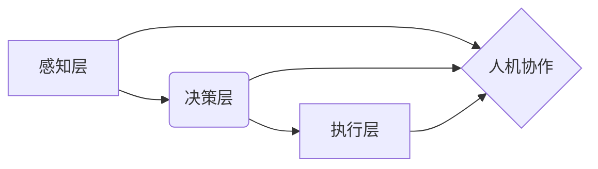

# 计算：附录 D 机器智能宣言

> 关键词：机器智能，计算能力，算法，人工智能伦理，可持续发展，人机协作，未来展望

## 1. 背景介绍

随着科技的飞速发展，机器智能已经成为当今世界最具变革性的力量之一。从简单的计算任务到复杂的决策问题，机器智能正在改变我们生活的方方面面。然而，随着技术的进步，我们也面临着前所未有的挑战，包括数据安全、算法偏见、隐私保护等问题。为了应对这些挑战，我们需要一个共同的宣言，来指导机器智能的发展方向和应用实践。

## 2. 核心概念与联系

### 2.1 机器智能的定义

机器智能是指使计算机能够模拟、延伸和扩展人类的智能行为的能力。这包括学习、推理、感知、理解和创造等方面。

### 2.2 计算能力的提升

计算能力的提升是机器智能发展的重要驱动力。随着处理器性能的提高和算法的优化，计算机能够处理更加复杂的任务。

### 2.3 机器智能的架构

机器智能的架构通常包括感知层、决策层和执行层。感知层负责收集和处理数据，决策层负责分析和决策，执行层负责将决策转化为实际行动。



### 2.4 机器智能与伦理

机器智能的伦理是确保技术发展符合人类价值观和社会规范的关键。这包括数据隐私、算法公平性、责任归属等方面。

## 3. 核心算法原理 & 具体操作步骤

### 3.1 算法原理概述

机器智能的核心算法包括但不限于机器学习、深度学习、自然语言处理等。这些算法通过从数据中学习规律，使计算机能够执行复杂的任务。

### 3.2 算法步骤详解

1. 数据收集：从各种来源收集数据，包括文本、图像、声音等。
2. 数据预处理：对收集到的数据进行清洗、转换和格式化，以便用于训练。
3. 模型选择：选择合适的机器学习或深度学习模型。
4. 模型训练：使用训练数据对模型进行训练，调整模型参数以最小化损失函数。
5. 模型评估：使用验证数据评估模型性能。
6. 模型部署：将训练好的模型部署到实际应用中。

### 3.3 算法优缺点

- 优点：能够处理大量数据，发现数据中的规律，提高工作效率。
- 缺点：对数据质量要求高，可能存在过拟合、欠拟合等问题。

### 3.4 算法应用领域

机器智能算法在各个领域都有广泛应用，包括：

- 医疗：疾病诊断、药物研发、个性化医疗
- 金融：风险评估、欺诈检测、算法交易
- 交通：自动驾驶、交通流量管理、智能交通系统
- 教育：个性化学习、智能教育平台、智能辅导
- 安全：入侵检测、网络安全、生物识别

## 4. 数学模型和公式 & 详细讲解 & 举例说明

### 4.1 数学模型构建

机器智能的数学模型主要包括：

- 线性回归：用于预测连续值。
- 逻辑回归：用于预测二元分类问题。
- 支持向量机：用于分类和回归任务。
- 深度学习模型：如卷积神经网络（CNN）、循环神经网络（RNN）和Transformer。

### 4.2 公式推导过程

以下以线性回归为例，介绍公式推导过程：

假设我们有一个输入变量 $x$ 和一个输出变量 $y$，它们的线性关系可以表示为：

$$
y = \beta_0 + \beta_1 x + \epsilon
$$

其中，$\beta_0$ 和 $\beta_1$ 是模型参数，$\epsilon$ 是误差项。

我们可以使用最小二乘法来估计 $\beta_0$ 和 $\beta_1$：

$$
\beta_1 = \frac{\sum_{i=1}^n (x_i - \bar{x})(y_i - \bar{y})}{\sum_{i=1}^n (x_i - \bar{x})^2}
$$

$$
\beta_0 = \bar{y} - \beta_1 \bar{x}
$$

### 4.3 案例分析与讲解

以下以情感分析为例，介绍如何使用机器学习模型进行情感分析：

1. 数据收集：收集包含情感标签的文本数据。
2. 数据预处理：对文本数据进行清洗、分词、去停用词等操作。
3. 特征提取：将文本数据转换为向量表示。
4. 模型选择：选择合适的分类模型，如逻辑回归、SVM等。
5. 模型训练：使用训练数据训练模型。
6. 模型评估：使用测试数据评估模型性能。

通过以上步骤，我们可以构建一个能够对文本进行情感分类的机器学习模型。

## 5. 项目实践：代码实例和详细解释说明

### 5.1 开发环境搭建

为了进行机器智能项目实践，我们需要以下开发环境：

- 编程语言：Python
- 深度学习框架：TensorFlow或PyTorch
- 数据处理库：NumPy、Pandas、Scikit-learn等

### 5.2 源代码详细实现

以下是一个使用PyTorch实现情感分析的简单示例：

```python
import torch
import torch.nn as nn
import torch.optim as optim

# 定义模型
class SentimentClassifier(nn.Module):
    def __init__(self, vocab_size, embedding_dim, hidden_dim):
        super(SentimentClassifier, self).__init__()
        self.embedding = nn.Embedding(vocab_size, embedding_dim)
        self.rnn = nn.LSTM(embedding_dim, hidden_dim)
        self.fc = nn.Linear(hidden_dim, 2)

    def forward(self, x):
        x = self.embedding(x)
        x, _ = self.rnn(x)
        x = torch.max(x, dim=1)[0]
        x = self.fc(x)
        return x

# 模型参数
vocab_size = 10000  # 词汇表大小
embedding_dim = 50  # 嵌入维度
hidden_dim = 128  # 隐藏层维度

# 实例化模型
model = SentimentClassifier(vocab_size, embedding_dim, hidden_dim)

# 损失函数和优化器
criterion = nn.CrossEntropyLoss()
optimizer = optim.Adam(model.parameters())

# 训练模型
# ...
```

### 5.3 代码解读与分析

上述代码定义了一个简单的情感分析模型，包括嵌入层、循环神经网络和全连接层。模型使用Adam优化器和交叉熵损失函数进行训练。

### 5.4 运行结果展示

通过训练和测试，我们可以得到模型的准确率、召回率等指标，以此来评估模型性能。

## 6. 实际应用场景

机器智能在各个领域都有广泛的应用，以下是一些典型的应用场景：

### 6.1 医疗

- 疾病诊断
- 药物研发
- 个性化医疗

### 6.2 金融

- 风险评估
- 欺诈检测
- 算法交易

### 6.3 交通

- 自动驾驶
- 交通流量管理
- 智能交通系统

### 6.4 教育

- 个性化学习
- 智能教育平台
- 智能辅导

## 7. 工具和资源推荐

### 7.1 学习资源推荐

- 《Python深度学习》
- 《深度学习》
- 《统计学习方法》

### 7.2 开发工具推荐

- TensorFlow
- PyTorch
- Jupyter Notebook

### 7.3 相关论文推荐

- "Deep Learning" by Ian Goodfellow, Yoshua Bengio, and Aaron Courville
- "Speech Recognition" by Herve Jegou
- "Computer Vision: Algorithms and Applications" by Richard Szeliski

## 8. 总结：未来发展趋势与挑战

### 8.1 研究成果总结

机器智能在近年来取得了显著的进展，已经能够在许多领域取得与人类相当甚至更好的表现。然而，我们仍然面临着许多挑战，包括数据安全、算法偏见、隐私保护等问题。

### 8.2 未来发展趋势

- 多模态学习：将文本、图像、声音等多种模态信息进行融合，使机器智能更加全面地理解世界。
- 自适应学习：使机器智能能够根据不同的环境和任务动态调整自己的学习策略。
- 伦理和可持续发展：确保机器智能的发展符合人类的价值观和社会规范，并促进可持续发展。

### 8.3 面临的挑战

- 数据安全：如何保护用户隐私和数据安全是机器智能发展的重要挑战。
- 算法偏见：算法偏见可能导致不公平的决策，需要采取有效措施消除。
- 隐私保护：如何在保护用户隐私的前提下进行机器学习是另一个重要挑战。

### 8.4 研究展望

未来，机器智能将继续发展，并将在更多领域发挥重要作用。我们需要共同努力，确保机器智能的发展能够造福人类社会。

## 9. 附录：常见问题与解答

**Q1：机器智能和人工智能有什么区别？**

A：机器智能和人工智能是同义词，通常指使计算机能够模拟、延伸和扩展人类的智能行为的能力。

**Q2：机器智能的伦理问题有哪些？**

A：机器智能的伦理问题包括数据安全、算法偏见、隐私保护、责任归属等。

**Q3：机器智能的未来发展趋势是什么？**

A：机器智能的未来发展趋势包括多模态学习、自适应学习、伦理和可持续发展等。

作者：禅与计算机程序设计艺术 / Zen and the Art of Computer Programming