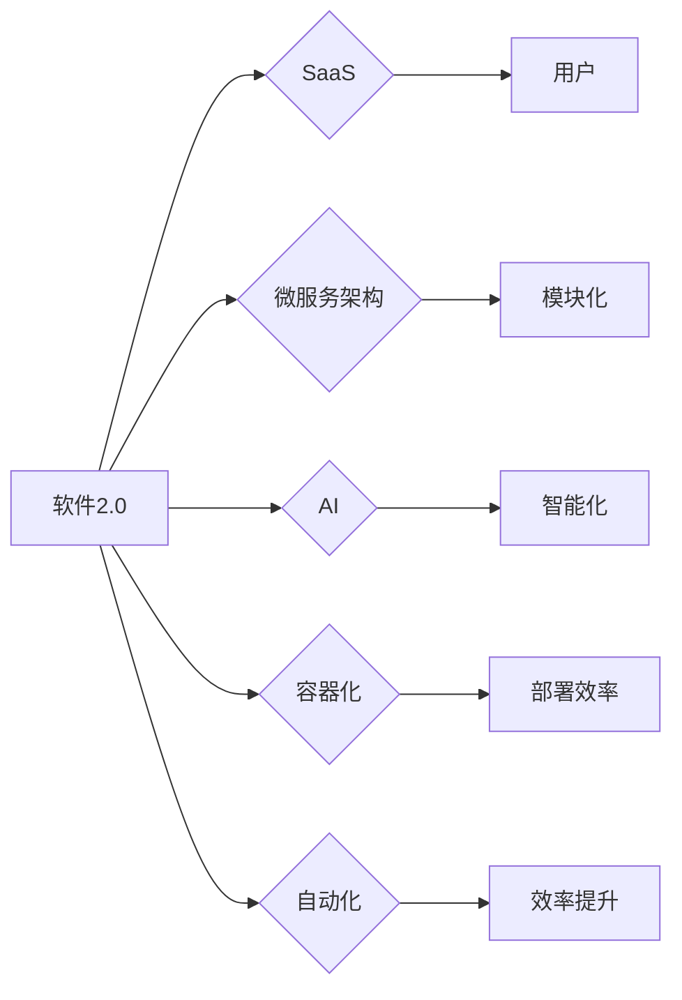

> 软件即服务、微服务架构、人工智能、容器化、自动化、DevOps、持续集成

# 软件 2.0 的未来展望：更智能、更强大

在信息技术的发展历程中，软件经历了多次变革。从最初的程序语言到面向对象编程，再到互联网时代的Web应用，软件的定义和应用场景都在不断演进。如今，我们正站在软件2.0时代的门槛上，面对着前所未有的机遇和挑战。本文将探讨软件2.0的核心概念、发展趋势，以及面临的挑战和未来展望。

## 1. 背景介绍

### 1.1 问题的由来

随着互联网的普及和移动设备的兴起，用户对软件的需求日益多样化、个性化。传统的软件开发模式已无法满足快速变化的市场需求。为了应对这种挑战，软件2.0的概念应运而生。

### 1.2 研究现状

软件2.0强调软件的智能化、服务化、轻量化、可定制化。目前，软件2.0在以下几个方面取得了显著进展：

- **软件即服务(SaaS)**：软件以服务的形式提供，用户按需付费，降低了软件的门槛。
- **微服务架构**：将大型软件拆分为多个独立的服务，提高了软件的模块化和可扩展性。
- **人工智能(AI)**：将AI技术应用于软件，实现智能化功能。
- **容器化**：使用容器技术，提高软件的部署效率和可移植性。
- **自动化**：通过自动化工具，提高软件开发、部署和运维的效率。

### 1.3 研究意义

研究软件2.0的未来展望，对于推动软件产业的创新发展、提升软件质量和用户体验具有重要意义。

### 1.4 本文结构

本文将按照以下结构展开：

- 第2部分介绍软件2.0的核心概念。
- 第3部分阐述软件2.0的关键技术。
- 第4部分探讨软件2.0的实际应用场景。
- 第5部分展望软件2.0的未来发展趋势与挑战。

## 2. 核心概念与联系

### 2.1 核心概念原理

软件2.0的核心概念包括：

- **软件即服务(SaaS)**：软件以服务的形式提供，用户按需付费。
- **微服务架构**：将大型软件拆分为多个独立的服务。
- **人工智能(AI)**：将AI技术应用于软件。
- **容器化**：使用容器技术，提高软件的部署效率和可移植性。
- **自动化**：通过自动化工具，提高软件开发、部署和运维的效率。

### 2.2 核心概念架构的 Mermaid 流程图



## 3. 核心算法原理 & 具体操作步骤

### 3.1 算法原理概述

软件2.0的核心算法原理包括：

- **SaaS架构**：基于云计算的软件服务模式。
- **微服务架构**：将大型软件拆分为多个独立的服务。
- **AI应用**：将AI技术应用于软件。
- **容器化技术**：使用容器技术封装、部署和运行软件。
- **自动化工具**：自动化软件开发、部署和运维。

### 3.2 算法步骤详解

#### 3.2.1 SaaS架构

SaaS架构通常包括以下步骤：

1. 构建软件平台：开发通用的软件平台，提供用户界面和业务逻辑。
2. 部署云基础设施：部署云服务器、存储和网络等基础设施。
3. 部署软件服务：将软件平台部署到云基础设施上，提供SaaS服务。
4. 用户付费使用：用户根据实际使用情况付费。

#### 3.2.2 微服务架构

微服务架构通常包括以下步骤：

1. 分析业务需求：分析业务需求，确定需要拆分的微服务。
2. 设计微服务：设计每个微服务的功能、接口和通信协议。
3. 开发微服务：开发每个微服务的代码。
4. 部署微服务：将微服务部署到容器化平台。
5. 通信与协调：实现微服务之间的通信和协调。

#### 3.2.3 AI应用

AI应用通常包括以下步骤：

1. 数据收集：收集与任务相关的数据。
2. 数据预处理：对收集到的数据进行预处理。
3. 模型训练：训练AI模型。
4. 模型部署：将训练好的模型部署到软件中。
5. 模型评估：评估模型性能。

#### 3.2.4 容器化技术

容器化技术通常包括以下步骤：

1. 选择容器技术：选择合适的容器技术，如Docker。
2. 编写Dockerfile：编写Dockerfile定义容器环境。
3. 构建容器镜像：构建容器镜像。
4. 部署容器：将容器镜像部署到容器化平台。
5. 运行容器：运行容器，执行软件。

#### 3.2.5 自动化工具

自动化工具通常包括以下步骤：

1. 选择自动化工具：选择合适的自动化工具，如Jenkins。
2. 编写自动化脚本：编写自动化脚本实现自动化任务。
3. 部署自动化脚本：部署自动化脚本。
4. 运行自动化任务：运行自动化任务，实现自动化。

### 3.3 算法优缺点

#### 3.3.1 SaaS架构

**优点**：

- 降低软件门槛：用户无需购买和安装软件，即可使用软件。
- 降低成本：用户只需按需付费，降低了软件使用成本。

**缺点**：

- 依赖网络：使用SaaS服务需要稳定的网络连接。
- 数据安全：用户数据存储在云端，存在数据安全风险。

#### 3.3.2 微服务架构

**优点**：

- 提高可扩展性：提高软件的可扩展性，满足业务需求。
- 提高可维护性：提高软件的可维护性，方便开发、测试和部署。

**缺点**：

- 分布式系统复杂度：分布式系统的复杂度增加，需要更多的维护工作。
- 通信开销：微服务之间需要进行通信，增加了通信开销。

#### 3.3.3 AI应用

**优点**：

- 提高智能化：提高软件的智能化水平，提升用户体验。
- 提高效率：提高工作效率，降低人力成本。

**缺点**：

- 模型训练难度：AI模型训练难度大，需要专业的技术支持。
- 模型可解释性：AI模型可解释性差，难以理解模型决策过程。

#### 3.3.4 容器化技术

**优点**：

- 提高部署效率：提高软件的部署效率，加快软件开发周期。
- 提高可移植性：提高软件的可移植性，方便在不同环境中部署。

**缺点**：

- 资源消耗：容器化需要额外的资源消耗，如内存和CPU。
- 依赖容器技术：依赖于容器技术，需要一定的学习成本。

#### 3.3.5 自动化工具

**优点**：

- 提高效率：提高软件开发、部署和运维的效率。
- 减少错误：减少人为错误，提高软件质量。

**缺点**：

- 学习成本：需要学习自动化工具的使用方法。
- 维护成本：需要维护自动化工具的运行状态。

### 3.4 算法应用领域

软件2.0的关键技术已广泛应用于以下领域：

- 企业级应用：如ERP、CRM等。
- 移动应用：如电子商务、社交网络等。
- 教育应用：如在线教育、虚拟课堂等。
- 医疗应用：如远程医疗、健康管理等。

## 4. 数学模型和公式 & 详细讲解 & 举例说明

### 4.1 数学模型构建

软件2.0的数学模型包括：

- **SaaS模型**：基于云计算的软件服务模式。
- **微服务模型**：将大型软件拆分为多个独立的服务。
- **AI模型**：将AI技术应用于软件。
- **容器化模型**：使用容器技术封装、部署和运行软件。
- **自动化模型**：自动化软件开发、部署和运维。

### 4.2 公式推导过程

由于软件2.0的数学模型涉及多个方面，以下仅以SaaS模型为例进行说明。

SaaS模型可以表示为：

$$
SaaS = \sum_{i=1}^{n} P_{i} \cdot Q_{i}
$$

其中，$P_{i}$表示第$i$个服务的价格，$Q_{i}$表示第$i$个服务的使用量。

### 4.3 案例分析与讲解

以下以一个在线教育平台的SaaS模型为例进行说明。

假设该在线教育平台提供以下服务：

- 用户课程：价格为20元/课程。
- 在线答疑：价格为10元/小时。

用户在一个月内购买了5门课程，使用了10小时的在线答疑服务。

根据SaaS模型，该用户需要支付的费用为：

$$
SaaS = 20 \times 5 + 10 \times 10 = 200 + 100 = 300 \text{元}
$$

## 5. 项目实践：代码实例和详细解释说明

### 5.1 开发环境搭建

以下以使用Python和Django框架开发一个简单的SaaS平台为例，说明开发环境搭建过程。

1. 安装Python 3.8及以上版本。
2. 安装Django 3.2及以上版本。
3. 创建一个新的Django项目。
4. 创建一个Django应用。

### 5.2 源代码详细实现

以下是一个简单的Django应用的代码示例：

```python
# views.py
from django.shortcuts import render, HttpResponse
from .models import Service

def index(request):
    return render(request, 'index.html')

def purchase_service(request, service_id):
    service = Service.objects.get(id=service_id)
    service.quantity += 1
    service.save()
    return HttpResponse('Service purchased')

# models.py
from django.db import models

class Service(models.Model):
    name = models.CharField(max_length=100)
    price = models.DecimalField(max_digits=10, decimal_places=2)
    quantity = models.IntegerField(default=0)
```

### 5.3 代码解读与分析

上述代码示例中，我们创建了一个名为`Service`的模型，用于表示平台上的服务。`Service`模型包含以下字段：

- `name`：服务的名称。
- `price`：服务的价格。
- `quantity`：服务的使用量。

在`views.py`中，我们定义了两个视图函数：

- `index`：显示平台首页。
- `purchase_service`：处理服务购买请求。

### 5.4 运行结果展示

运行Django应用后，访问首页可以看到以下界面：

```
+--------------------------------------+
| Welcome to our SaaS platform!        |
+--------------------------------------+
| [Purchase Service]                   |
+--------------------------------------+
```

点击“Purchase Service”链接，可以选择要购买的服务并提交订单。

## 6. 实际应用场景

### 6.1 企业级应用

SaaS平台可以应用于企业级应用，如ERP、CRM等。企业可以通过SaaS平台实现以下功能：

- 管理客户信息。
- 管理销售线索。
- 管理供应链。
- 管理人力资源。

### 6.2 移动应用

SaaS平台可以应用于移动应用，如电子商务、社交网络等。用户可以通过移动应用购买、浏览和分享内容。

### 6.3 教育应用

SaaS平台可以应用于在线教育、虚拟课堂等教育应用。学生可以通过SaaS平台学习、提交作业和参加考试。

### 6.4 医疗应用

SaaS平台可以应用于远程医疗、健康管理等医疗应用。用户可以通过SaaS平台预约医生、查询健康数据和进行健康咨询。

## 7. 工具和资源推荐

### 7.1 学习资源推荐

- 《Python编程：从入门到实践》
- 《Django By Example》
- 《软件工程：实践者的研究方法》

### 7.2 开发工具推荐

- Python
- Django
- Docker
- Jenkins

### 7.3 相关论文推荐

- 《云计算：概念、技术和应用》
- 《软件架构：实践者的研究方法》
- 《人工智能：一种现代的方法》

## 8. 总结：未来发展趋势与挑战

### 8.1 研究成果总结

软件2.0的核心概念和关键技术已取得显著进展，在多个领域得到广泛应用。未来，软件2.0将继续朝着以下方向发展：

- 智能化：软件将更加智能化，具备自主学习、自我优化和自我进化能力。
- 服务化：软件将更加服务化，满足用户个性化需求。
- 轻量化：软件将更加轻量化，降低使用门槛。
- 可定制化：软件将更加可定制化，满足不同场景需求。

### 8.2 未来发展趋势

- 软件智能化：AI技术将深入应用到软件中，实现智能化功能。
- 软件服务化：软件将以服务的形式提供，满足用户个性化需求。
- 软件轻量化：软件将更加轻量化，降低使用门槛。
- 软件可定制化：软件将更加可定制化，满足不同场景需求。

### 8.3 面临的挑战

- 技术挑战：软件2.0的技术挑战包括AI技术、云计算技术、自动化技术等。
- 伦理挑战：软件2.0的伦理挑战包括数据安全、隐私保护、算法偏见等。
- 管理挑战：软件2.0的管理挑战包括团队协作、项目管理、质量控制等。

### 8.4 研究展望

未来，软件2.0的研究将主要集中在以下几个方面：

- 智能化技术：研究更加智能、高效的AI技术。
- 服务化技术：研究更加灵活、可扩展的服务化技术。
- 轻量化技术：研究更加轻量级的软件架构和开发方法。
- 可定制化技术：研究更加可定制的软件架构和开发方法。

## 9. 附录：常见问题与解答

**Q1：软件2.0与软件1.0有什么区别？**

A：软件1.0主要指传统的软件，以本地安装为主，用户需要购买和安装软件。软件2.0主要指基于云计算的软件服务模式，以SaaS形式提供，用户按需付费。

**Q2：微服务架构有哪些优点？**

A：微服务架构具有以下优点：

- 提高可扩展性：提高软件的可扩展性，满足业务需求。
- 提高可维护性：提高软件的可维护性，方便开发、测试和部署。

**Q3：AI技术如何应用于软件？**

A：AI技术可以应用于软件的各个方面，如自然语言处理、图像识别、推荐系统等。

**Q4：容器化技术有哪些优势？**

A：容器化技术具有以下优势：

- 提高部署效率：提高软件的部署效率，加快软件开发周期。
- 提高可移植性：提高软件的可移植性，方便在不同环境中部署。

**Q5：自动化工具如何提高软件开发的效率？**

A：自动化工具可以自动化软件开发、部署和运维的各个环节，从而提高效率，减少人为错误。

---

作者：禅与计算机程序设计艺术 / Zen and the Art of Computer Programming