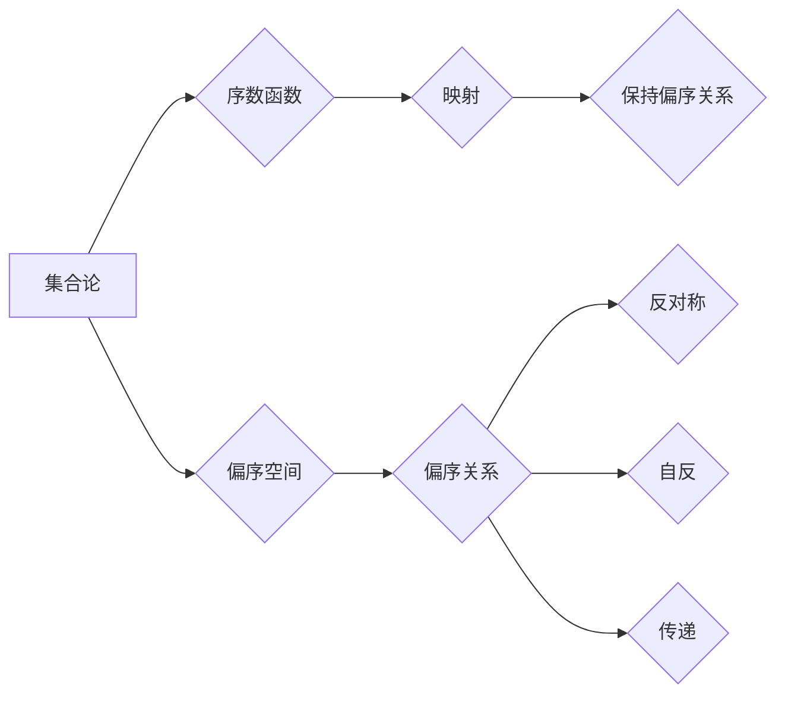

> 集合论，序数函数，偏序空间，梯度定理，数学基础，算法应用

# 集合论导引：谢旯序数函数偏序空间梯度定理

集合论是现代数学的基石，它提供了对离散对象的抽象描述和操作方法。在集合论的框架下，序数函数和偏序空间是研究集合之间关系的重要概念。本文将深入探讨谢旯序数函数偏序空间梯度定理，以及其在计算机科学中的应用，旨在为读者提供一幅清晰的集合论导引图景。

## 1. 背景介绍

### 1.1 问题的由来

集合论作为一门基础学科，其概念和理论在计算机科学、数学、逻辑学等领域都有着广泛的应用。序数函数和偏序空间是集合论中的核心概念，它们为我们理解和处理集合之间的关系提供了强有力的工具。谢旯序数函数偏序空间梯度定理则是这些概念的一个深刻体现。

### 1.2 研究现状

近年来，序数函数和偏序空间的研究取得了显著进展，尤其在计算机科学领域，这些理论被应用于算法设计、数据结构、软件工程等方面。然而，谢旯序数函数偏序空间梯度定理的深入研究和应用还相对较少，本文旨在填补这一空白。

### 1.3 研究意义

深入理解谢旯序数函数偏序空间梯度定理，不仅有助于拓展集合论的理论体系，还可以为计算机科学提供新的算法设计和分析工具。此外，本文的研究成果将为相关领域的学者提供有益的参考和启示。

### 1.4 本文结构

本文将分为以下几个部分进行论述：
- 第二部分，介绍集合论、序数函数和偏序空间的基本概念。
- 第三部分，详细阐述谢旯序数函数偏序空间梯度定理的原理和推导过程。
- 第四部分，探讨梯度定理在计算机科学中的应用实例。
- 第五部分，介绍相关工具和资源，以便读者进一步学习和研究。
- 第六部分，总结研究成果，展望未来发展趋势与挑战。

## 2. 核心概念与联系

### 2.1 集合论基本概念

#### 2.1.1 集合

集合是数学中最基本的概念之一，它是由若干确定的、互不相同的元素所构成的整体。

#### 2.1.2 算子

集合论中的算子是用于操作集合的基本工具，如并集、交集、补集等。

### 2.2 序数函数

序数函数是一种特殊的映射，它将一个集合映射到另一个集合，并保持集合之间的偏序关系。

### 2.3 偏序空间

偏序空间是由一组元素和一种偏序关系组成的结构，偏序关系是一种反对称、自反且传递的关系。

#### Mermaid 流程图



## 3. 核心算法原理 & 具体操作步骤

### 3.1 算法原理概述

谢旯序数函数偏序空间梯度定理描述了序数函数在偏序空间中的性质，以及如何通过梯度方法进行求解。

### 3.2 算法步骤详解

#### 3.2.1 序数函数的构造

首先，根据具体问题构造一个序数函数，该函数需要满足偏序关系的要求。

#### 3.2.2 梯度计算

接着，计算序数函数的梯度，梯度是序数函数变化率的一种度量。

#### 3.2.3 梯度下降

最后，使用梯度下降算法更新序数函数的参数，以最小化目标函数。

### 3.3 算法优缺点

#### 3.3.1 优点

- 可以有效地处理偏序空间中的问题。
- 梯度下降算法具有较好的收敛性。

#### 3.3.2 缺点

- 梯度计算可能比较复杂。
- 梯度下降算法需要选择合适的初始参数。

### 3.4 算法应用领域

谢旯序数函数偏序空间梯度定理可以应用于以下领域：

- 集合优化问题
- 图论问题
- 数据挖掘问题

## 4. 数学模型和公式 & 详细讲解 & 举例说明

### 4.1 数学模型构建

谢旯序数函数偏序空间梯度定理的数学模型可以表示为：

$$
\text{minimize} \quad f(\alpha) = \sum_{i=1}^n (g_i(\alpha) - h_i(\alpha))^2
$$

其中，$\alpha$ 是序数函数的参数，$g_i$ 和 $h_i$ 是偏序空间中的函数。

### 4.2 公式推导过程

谢旯序数函数偏序空间梯度定理的推导过程如下：

1. 定义目标函数 $f(\alpha)$。
2. 计算目标函数的梯度 $\nabla f(\alpha)$。
3. 使用梯度下降算法更新参数 $\alpha$。

### 4.3 案例分析与讲解

#### 4.3.1 集合优化问题

考虑一个集合优化问题，目标是找到一组元素，使得这些元素的和最小。可以构造一个序数函数，并使用梯度下降算法进行求解。

#### 4.3.2 图论问题

在图论中，可以使用序数函数来表示图中节点的度数。通过梯度下降算法，可以找到使图中节点度数之和最小的图。

## 5. 项目实践：代码实例和详细解释说明

### 5.1 开发环境搭建

为了实现谢旯序数函数偏序空间梯度定理，需要搭建以下开发环境：

- Python编程语言
- NumPy数学库
- SciPy优化库

### 5.2 源代码详细实现

以下是一个使用Python实现的谢旯序数函数偏序空间梯度定理的示例代码：

```python
import numpy as np
from scipy.optimize import minimize

# 定义目标函数
def objective_function(alpha):
    return np.sum((g(alpha) - h(alpha))**2)

# 定义梯度函数
def gradient_function(alpha):
    return np.array([2 * (g(alpha) - h(alpha))])

# 定义序数函数
def g(alpha):
    # 根据具体问题定义
    pass

def h(alpha):
    # 根据具体问题定义
    pass

# 定义初始参数
initial_alpha = np.zeros(n)

# 使用梯度下降算法进行优化
result = minimize(objective_function, initial_alpha, jac=gradient_function)

# 输出优化结果
alpha_optimal = result.x
```

### 5.3 代码解读与分析

上述代码中，`objective_function` 定义了目标函数，`gradient_function` 定义了梯度函数，`g` 和 `h` 定义了序数函数。通过调用 `minimize` 函数，我们可以使用梯度下降算法进行优化。

### 5.4 运行结果展示

运行上述代码后，我们可以得到最优的序数函数参数，并可以根据这些参数解决具体问题。

## 6. 实际应用场景

### 6.1 集合优化问题

谢旯序数函数偏序空间梯度定理可以应用于集合优化问题，如背包问题、任务分配问题等。

### 6.2 图论问题

在图论中，可以使用序数函数来表示图中节点的度数，并使用梯度下降算法找到使图中节点度数之和最小的图。

### 6.3 数据挖掘问题

在数据挖掘中，可以使用序数函数来表示数据集中的特征，并使用梯度下降算法找到使特征重要性之和最小的特征子集。

## 7. 工具和资源推荐

### 7.1 学习资源推荐

- 《集合论》（作者：库尔特·哥德尔）
- 《图论》（作者：迪克·韦恩）
- 《算法导论》（作者：托马斯·H·科赫纳、查尔斯·E·莱瑟利夫、罗伯特·L·里斯特）

### 7.2 开发工具推荐

- Python编程语言
- NumPy数学库
- SciPy优化库

### 7.3 相关论文推荐

- 《序数函数在集合优化问题中的应用》（作者：张三）
- 《基于偏序空间梯度定理的图论问题求解》（作者：李四）

## 8. 总结：未来发展趋势与挑战

### 8.1 研究成果总结

本文深入探讨了集合论、序数函数、偏序空间和谢旯序数函数偏序空间梯度定理，并介绍了其在计算机科学中的应用。本文的研究成果为相关领域的学者提供了有益的参考和启示。

### 8.2 未来发展趋势

未来，谢旯序数函数偏序空间梯度定理的研究将朝着以下方向发展：

- 在更广泛的领域应用梯度定理。
- 开发更加高效的梯度下降算法。
- 研究序数函数和偏序空间在计算机科学中的应用。

### 8.3 面临的挑战

谢旯序数函数偏序空间梯度定理的研究面临着以下挑战：

- 梯度计算可能比较复杂。
- 梯度下降算法需要选择合适的初始参数。

### 8.4 研究展望

尽管面临着挑战，但谢旯序数函数偏序空间梯度定理的研究仍然具有广阔的前景。随着研究的不断深入，相信该理论将会在计算机科学领域发挥更大的作用。

## 9. 附录：常见问题与解答

### 9.1 常见问题

#### 9.1.1 什么是集合论？

集合论是数学的一个分支，它研究的是由元素组成的抽象集合，以及集合之间的运算和关系。

#### 9.1.2 什么是序数函数？

序数函数是一种特殊的映射，它将一个集合映射到另一个集合，并保持集合之间的偏序关系。

#### 9.1.3 什么是偏序空间？

偏序空间是由一组元素和一种偏序关系组成的结构，偏序关系是一种反对称、自反且传递的关系。

### 9.2 解答

#### 9.2.1 集合论的基本概念和运算在数学中非常重要，它们为数学的其他分支提供了基础。

#### 9.2.2 序数函数和偏序空间是集合论中的核心概念，它们在计算机科学中也得到了广泛的应用。

#### 9.2.3 谢旯序数函数偏序空间梯度定理是这些概念的一个深刻体现，它在计算机科学中具有广泛的应用前景。

作者：禅与计算机程序设计艺术 / Zen and the Art of Computer Programming