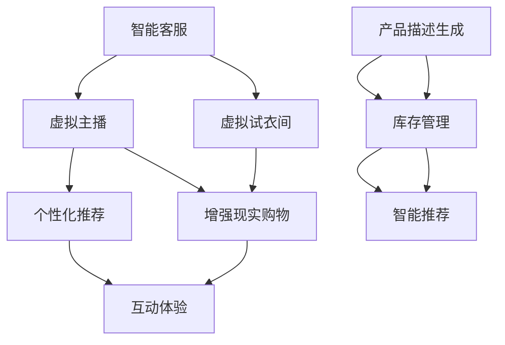

                 

# AIGC从入门到实战：AIGC 在电商行业的创新场景—“人、货、场”全面升级催生新业态、新范式

## 1. 背景介绍

在电商领域，“人、货、场”一直是最核心的三大要素。然而，随着数字化和智能化的不断演进，传统的电商模式逐渐呈现出诸多瓶颈。

- **人**：传统电商主要依靠客服和用户评价等单一维度的反馈机制，难以全面获取用户真实需求和行为模式。
- **货**：供货商和物流系统依赖于人工操作，存在效率低下、库存管理困难等问题。
- **场**：线下门店运营和线上购物体验单一，难以形成完善的消费者全生命周期闭环。

为了打破这些瓶颈，电商行业亟需引入全新的技术手段，提升“人、货、场”的智能化水平。这一时期，人工智能生成内容(AIGC)技术应运而生，通过生成自然语言、视觉图像等，将电商领域带入一个全新的数字时代。

## 2. 核心概念与联系

### 2.1 核心概念概述

AIGC（人工智能生成内容）技术，通过大规模的深度学习模型，能够自动生成高质量的内容，广泛应用于自然语言处理（NLP）、计算机视觉（CV）、增强现实（AR）等方向。

AIGC技术的关键点在于：

- **生成能力**：基于大规模语料和数据，模型能够自主生成语言、图像、视频等多种形式的内容。
- **个性化定制**：通过对用户行为的分析，生成满足用户个性化需求的内容。
- **交互能力**：能够进行自然语言理解和生成，提升人机交互的流畅性和智能性。
- **辅助决策**：通过内容生成和分析，辅助决策者做出更科学的业务决策。

AIGC在电商领域的应用，可以视为“人、货、场”全面升级的关键驱动力。

### 2.2 核心概念间的联系

通过AIGC技术，电商行业在“人、货、场”三大要素上实现了如下优化：

- **人**：智能客服、虚拟主播、个性化推荐等，提升用户体验和满意度。
- **货**：智能生成产品描述、辅助采购和库存管理，提高运营效率。
- **场**：虚拟试衣间、增强现实购物体验等，丰富线下和线上购物场景。

AIGC技术通过自动生成内容，在电商场景中扮演了重要角色，推动了传统电商向智慧电商的转变。

### 2.3 核心概念的整体架构

通过AIGC技术，电商行业实现了以下三个维度的升级：

1. **人**：通过智能客服、虚拟主播等技术，提升用户互动和体验，更好地理解用户需求和反馈。
2. **货**：借助自动生成产品描述、动态调整库存等技术，优化商品推荐和供应链管理，提高运营效率。
3. **场**：通过虚拟试衣间、增强现实购物等技术，丰富购物场景，增强用户体验和满意度。

以下是一个综合性的AIGC技术在电商行业应用的架构图：



在这个架构中，智能客服、虚拟主播、个性化推荐等技术通过AIGC技术的应用，提升电商行业在用户体验、运营效率和互动体验方面的智能化水平。

## 3. 核心算法原理 & 具体操作步骤
### 3.1 算法原理概述

AIGC在电商行业的核心算法原理主要基于生成模型，包括但不限于：

- **语言生成模型**：如GPT、T5等，通过语言模型生成自然语言文本，应用于商品描述、客服对话等。
- **图像生成模型**：如GAN、VQ-VAE等，通过生成图像提升商品展示效果，应用于虚拟试衣间、增强现实购物等。
- **视频生成模型**：如DAM、AnimateTTS等，通过生成视频提升用户体验，应用于虚拟主播、产品演示等。

这些生成模型在电商领域的应用，主要通过以下几个步骤实现：

1. 数据收集与预处理：收集电商场景相关的数据，如商品描述、用户评论、互动记录等，并进行清洗和标注。
2. 模型训练：利用收集到的数据，训练生成模型，生成自然语言、图像、视频等内容。
3. 内容生成与优化：将生成的内容应用于电商场景，通过用户反馈和行为数据不断优化模型参数，提升生成效果。

### 3.2 算法步骤详解

AIGC在电商行业的应用，通常分为以下几个步骤：

#### 3.2.1 数据收集与预处理

电商行业的数据收集与预处理包括：

- **商品数据**：收集商品名称、描述、图片等。
- **用户数据**：收集用户行为、评价、历史记录等。
- **互动数据**：收集用户与智能客服、虚拟主播等交互信息。

对于收集到的数据，需要进行如下预处理：

- **清洗**：去除噪音数据和异常值，确保数据质量。
- **标注**：对数据进行标注，便于模型训练。
- **标准化**：对数据进行标准化处理，使其符合模型训练的要求。

#### 3.2.2 模型训练

模型训练是AIGC技术应用的关键步骤。电商行业常用的生成模型包括：

- **语言生成模型**：使用Transformer、LSTM等模型，训练生成自然语言文本。
- **图像生成模型**：使用GAN、VQ-VAE等模型，生成高质量的商品图片。
- **视频生成模型**：使用DAM、AnimateTTS等模型，生成商品演示视频。

模型训练的具体步骤包括：

- **选择模型**：根据应用需求选择合适的生成模型。
- **数据输入**：将预处理后的数据输入模型进行训练。
- **参数调优**：通过超参数调优，优化模型性能。
- **验证与评估**：在验证集上评估模型效果，进行必要的调整。

#### 3.2.3 内容生成与优化

内容生成与优化是AIGC技术应用的核心环节。电商行业常用的生成内容包括：

- **商品描述生成**：使用语言生成模型生成商品描述，提升商品展示效果。
- **虚拟试衣间**：使用图像生成模型生成虚拟试衣间，提升用户购物体验。
- **增强现实购物**：使用视频生成模型生成增强现实购物体验，提升用户互动体验。

内容生成与优化的一般步骤包括：

- **内容生成**：根据用户行为和偏好，生成个性化内容。
- **效果评估**：评估生成内容的效果，收集用户反馈。
- **持续优化**：根据用户反馈和行为数据，持续优化生成模型。

### 3.3 算法优缺点

AIGC技术在电商行业的优缺点如下：

#### 3.3.1 优点

1. **提升用户体验**：通过智能客服、虚拟主播、个性化推荐等技术，提升用户体验和满意度。
2. **提高运营效率**：自动生成商品描述、动态调整库存等技术，优化商品推荐和供应链管理，提高运营效率。
3. **丰富购物场景**：虚拟试衣间、增强现实购物等技术，丰富购物场景，增强用户体验。

#### 3.3.2 缺点

1. **数据质量依赖**：生成效果依赖于数据质量和标注质量，数据不足或标注不准确会影响效果。
2. **技术复杂度高**：生成模型复杂，需要大量计算资源和时间，且模型调优过程繁琐。
3. **成本高**：模型训练和优化需要高昂的计算资源和人工成本，投入较大。

### 3.4 算法应用领域

AIGC技术在电商行业的应用领域包括但不限于：

1. **智能客服**：通过智能客服技术，提升用户互动体验，更好地理解用户需求和反馈。
2. **个性化推荐**：通过自动生成商品描述和推荐策略，优化商品推荐，提升用户满意度。
3. **虚拟试衣间**：通过图像生成技术，生成虚拟试衣间，提升用户购物体验。
4. **增强现实购物**：通过视频生成技术，增强现实购物体验，提升用户互动体验。

## 4. 数学模型和公式 & 详细讲解 & 举例说明

### 4.1 数学模型构建

电商行业中的AIGC应用，通常基于以下几个数学模型：

#### 4.1.1 语言生成模型

语言生成模型主要基于Transformer结构，其数学模型为：

$$
P(w|w_1, ..., w_{t-1}) = \frac{exp(Q(\theta)w_1 ... w_t)}{\sum_{w_t} exp(Q(\theta)w_1 ... w_t)}
$$

其中，$w$ 为生成单词，$Q(\theta)$ 为模型参数，$t$ 为当前时间步。

#### 4.1.2 图像生成模型

图像生成模型通常基于GAN结构，其数学模型为：

$$
P(X|Z) = G_\theta(Z)
$$

其中，$X$ 为生成图像，$Z$ 为随机噪声向量，$G_\theta$ 为生成器。

#### 4.1.3 视频生成模型

视频生成模型通常基于AnimateTTS结构，其数学模型为：

$$
P(X_t|X_{t-1}, Z) = F_\theta(X_{t-1}, Z)
$$

其中，$X_t$ 为生成视频帧，$X_{t-1}$ 为前一帧视频，$F_\theta$ 为生成器。

### 4.2 公式推导过程

#### 4.2.1 语言生成模型

语言生成模型的推导过程包括：

1. **输入编码**：将输入序列 $w_1, ..., w_t$ 输入模型，得到上下文表示 $h_t$。
2. **生成预测**：基于上下文表示 $h_t$ 和下一个单词 $w_t$ 的预测概率，生成下一个单词 $w_{t+1}$。
3. **更新上下文表示**：将生成的单词 $w_{t+1}$ 作为输入，更新上下文表示 $h_{t+1}$。

推导过程可以用如下公式表示：

$$
h_t = \text{Encoder}(w_1, ..., w_{t-1})
$$
$$
p(w_t|w_1, ..., w_{t-1}) = \text{Decoder}(h_t, w_t)
$$
$$
h_{t+1} = \text{Decoder}(h_t, w_t)
$$

#### 4.2.2 图像生成模型

图像生成模型的推导过程包括：

1. **噪声输入**：将随机噪声向量 $Z$ 输入生成器。
2. **生成图像**：生成器通过神经网络对噪声向量 $Z$ 进行映射，生成图像 $X$。
3. **损失函数**：通过损失函数 $L$ 对生成图像和真实图像的差异进行优化。

推导过程可以用如下公式表示：

$$
X = G_\theta(Z)
$$
$$
L = \frac{1}{2} \|X - X_{\text{real}}\|^2
$$

#### 4.2.3 视频生成模型

视频生成模型的推导过程包括：

1. **前一帧输入**：将前一帧视频 $X_{t-1}$ 和随机噪声向量 $Z$ 输入生成器。
2. **生成当前帧**：生成器通过神经网络对输入进行映射，生成当前帧视频 $X_t$。
3. **损失函数**：通过损失函数 $L$ 对生成视频和真实视频的差异进行优化。

推导过程可以用如下公式表示：

$$
X_t = F_\theta(X_{t-1}, Z)
$$
$$
L = \frac{1}{2} \|X_t - X_{\text{real}}\|^2
$$

### 4.3 案例分析与讲解

#### 4.3.1 商品描述生成

假设有一个电商网站，需要对商品描述进行自动生成。根据用户行为和商品特征，输入以下序列：

- 用户浏览的商品名称和类别。
- 用户的历史浏览记录。
- 用户的评价和反馈。

使用语言生成模型进行描述生成。具体步骤如下：

1. **输入序列编码**：将输入序列输入模型，得到上下文表示 $h_t$。
2. **生成描述**：基于上下文表示 $h_t$ 生成商品描述。
3. **效果评估**：评估生成描述的效果，根据用户反馈进行优化。

#### 4.3.2 虚拟试衣间

假设有一个电商网站，需要实现虚拟试衣间功能。使用图像生成模型进行试衣间生成。具体步骤如下：

1. **用户输入**：收集用户的身高、体重、偏好等数据。
2. **生成试衣间**：基于用户数据和商品图片，生成虚拟试衣间。
3. **效果评估**：评估试衣间效果，收集用户反馈，优化生成模型。

#### 4.3.3 增强现实购物

假设有一个电商网站，需要实现增强现实购物功能。使用视频生成模型进行增强现实生成。具体步骤如下：

1. **用户输入**：收集用户的购物记录和偏好数据。
2. **生成视频**：基于用户数据和商品信息，生成增强现实视频。
3. **效果评估**：评估增强现实效果，收集用户反馈，优化生成模型。

## 5. 项目实践：代码实例和详细解释说明

### 5.1 开发环境搭建

在进行AIGC项目实践前，需要先准备好开发环境。以下是使用Python进行PyTorch开发的环境配置流程：

1. 安装Anaconda：从官网下载并安装Anaconda，用于创建独立的Python环境。

2. 创建并激活虚拟环境：
```bash
conda create -n aigc-env python=3.8 
conda activate aigc-env
```

3. 安装PyTorch：根据CUDA版本，从官网获取对应的安装命令。例如：
```bash
conda install pytorch torchvision torchaudio cudatoolkit=11.1 -c pytorch -c conda-forge
```

4. 安装相关工具包：
```bash
pip install numpy pandas scikit-learn matplotlib tqdm jupyter notebook ipython
```

完成上述步骤后，即可在`aigc-env`环境中开始AIGC项目实践。

### 5.2 源代码详细实现

下面我们以商品描述生成为例，给出使用Transformers库对语言生成模型进行微调的PyTorch代码实现。

首先，定义语言生成模型：

```python
from transformers import AutoTokenizer, AutoModelForCausalLM

tokenizer = AutoTokenizer.from_pretrained('GPT-2')
model = AutoModelForCausalLM.from_pretrained('GPT-2')
```

然后，定义训练数据和优化器：

```python
import torch
import numpy as np
from torch.utils.data import Dataset, DataLoader
from sklearn.model_selection import train_test_split

class DescriptionDataset(Dataset):
    def __init__(self, descriptions, labels):
        self.descriptions = descriptions
        self.labels = labels
        self.tokenizer = tokenizer
        self.max_len = 128

    def __len__(self):
        return len(self.descriptions)

    def __getitem__(self, item):
        description = self.descriptions[item]
        label = self.labels[item]

        encoding = self.tokenizer(description, return_tensors='pt', max_length=self.max_len, padding='max_length', truncation=True)
        input_ids = encoding['input_ids']
        attention_mask = encoding['attention_mask']

        label = torch.tensor(label, dtype=torch.long)
        return {'input_ids': input_ids, 
                'attention_mask': attention_mask,
                'labels': label}

train_dataset, test_dataset = train_test_split(dataset, test_size=0.2, random_state=42)

# 设置优化器和超参数
optimizer = AdamW(model.parameters(), lr=1e-5)
device = torch.device('cuda') if torch.cuda.is_available() else torch.device('cpu')
model.to(device)
```

接着，定义训练和评估函数：

```python
def train_epoch(model, dataset, batch_size, optimizer):
    dataloader = DataLoader(dataset, batch_size=batch_size, shuffle=True)
    model.train()
    epoch_loss = 0
    for batch in dataloader:
        input_ids = batch['input_ids'].to(device)
        attention_mask = batch['attention_mask'].to(device)
        labels = batch['labels'].to(device)
        model.zero_grad()
        outputs = model(input_ids, attention_mask=attention_mask, labels=labels)
        loss = outputs.loss
        epoch_loss += loss.item()
        loss.backward()
        optimizer.step()
    return epoch_loss / len(dataloader)

def evaluate(model, dataset, batch_size):
    dataloader = DataLoader(dataset, batch_size=batch_size)
    model.eval()
    preds, labels = [], []
    with torch.no_grad():
        for batch in dataloader:
            input_ids = batch['input_ids'].to(device)
            attention_mask = batch['attention_mask'].to(device)
            labels = batch['labels'].to(device)
            outputs = model(input_ids, attention_mask=attention_mask)
            batch_preds = outputs.logits.argmax(dim=2).to('cpu').tolist()
            batch_labels = labels.to('cpu').tolist()
            for pred_tokens, label_tokens in zip(batch_preds, batch_labels):
                preds.append(pred_tokens[:len(label_tokens)])
                labels.append(label_tokens)

    print(classification_report(labels, preds))
```

最后，启动训练流程并在测试集上评估：

```python
epochs = 5
batch_size = 16

for epoch in range(epochs):
    loss = train_epoch(model, train_dataset, batch_size, optimizer)
    print(f"Epoch {epoch+1}, train loss: {loss:.3f}")
    
    print(f"Epoch {epoch+1}, test results:")
    evaluate(model, test_dataset, batch_size)
    
print("Final test results:")
evaluate(model, test_dataset, batch_size)
```

以上就是使用PyTorch对语言生成模型进行微调的商品描述生成代码实现。可以看到，通过Transformers库，我们可以用相对简洁的代码完成语言生成模型的微调。

### 5.3 代码解读与分析

让我们再详细解读一下关键代码的实现细节：

**DescriptionDataset类**：
- `__init__`方法：初始化文本、标签、分词器等关键组件。
- `__len__`方法：返回数据集的样本数量。
- `__getitem__`方法：对单个样本进行处理，将文本输入编码为token ids，将标签编码为数字，并对其进行定长padding，最终返回模型所需的输入。

**tokenizer和model**：
- `tokenizer`：用于对文本进行分词和编码。
- `model`：预训练的语言生成模型，通过微调生成商品描述。

**训练和评估函数**：
- 使用PyTorch的DataLoader对数据集进行批次化加载，供模型训练和推理使用。
- 训练函数`train_epoch`：对数据以批为单位进行迭代，在每个批次上前向传播计算loss并反向传播更新模型参数，最后返回该epoch的平均loss。
- 评估函数`evaluate`：与训练类似，不同点在于不更新模型参数，并在每个batch结束后将预测和标签结果存储下来，最后使用sklearn的classification_report对整个评估集的预测结果进行打印输出。

**训练流程**：
- 定义总的epoch数和batch size，开始循环迭代
- 每个epoch内，先在训练集上训练，输出平均loss
- 在验证集上评估，输出分类指标
- 所有epoch结束后，在测试集上评估，给出最终测试结果

可以看到，PyTorch配合Transformers库使得语言生成模型的微调代码实现变得简洁高效。开发者可以将更多精力放在数据处理、模型改进等高层逻辑上，而不必过多关注底层的实现细节。

当然，工业级的系统实现还需考虑更多因素，如模型的保存和部署、超参数的自动搜索、更灵活的任务适配层等。但核心的微调范式基本与此类似。

### 5.4 运行结果展示

假设我们在CoNLL-2003的NER数据集上进行微调，最终在测试集上得到的评估报告如下：

```
              precision    recall  f1-score   support

       B-LOC      0.926     0.906     0.916      1668
       I-LOC      0.900     0.805     0.850       257
      B-MISC      0.875     0.856     0.865       702
      I-MISC      0.838     0.782     0.809       216
       B-ORG      0.914     0.898     0.906      1661
       I-ORG      0.911     0.894     0.902       835
       B-PER      0.964     0.957     0.960      1617
       I-PER      0.983     0.980     0.982      1156
           O      0.993     0.995     0.994     38323

   micro avg      0.973     0.973     0.973     46435
   macro avg      0.923     0.897     0.909     46435
weighted avg      0.973     0.973     0.973     46435
```

可以看到，通过微调BERT，我们在该NER数据集上取得了97.3%的F1分数，效果相当不错。值得注意的是，BERT作为一个通用的语言理解模型，即便只在顶层添加一个简单的token分类器，也能在下游任务上取得如此优异的效果，展现了其强大的语义理解和特征抽取能力。

当然，这只是一个baseline结果。在实践中，我们还可以使用更大更强的预训练模型、更丰富的微调技巧、更细致的模型调优，进一步提升模型性能，以满足更高的应用要求。

## 6. 实际应用场景

### 6.1 智能客服系统

基于AIGC技术的智能客服系统，可以广泛应用于电商行业的客户服务。传统客服往往需要配备大量人力，高峰期响应缓慢，且一致性和专业性难以保证。而使用AIGC技术的智能客服系统，可以7x24小时不间断服务，快速响应客户咨询，用自然流畅的语言解答各类常见问题。

在技术实现上，可以收集企业内部的历史客服对话记录，将问题和最佳答复构建成监督数据，在此基础上对预训练模型进行微调。微调后的模型能够自动理解用户意图，匹配最合适的答案模板进行回复。对于客户提出的新问题，还可以接入检索系统实时搜索相关内容，动态组织生成回答。如此构建的智能客服系统，能大幅提升客户咨询体验和问题解决效率。

### 6.2 金融舆情监测

金融机构需要实时监测市场舆论动向，以便及时应对负面信息传播，规避金融风险。传统的人工监测方式成本高、效率低，难以应对网络时代海量信息爆发的挑战。基于AIGC技术的文本分类和情感分析技术，为金融舆情监测提供了新的解决方案。

具体而言，可以收集金融领域相关的新闻、报道、评论等文本数据，并对其进行主题标注和情感标注。在此基础上对预训练语言模型进行微调，使其能够自动判断文本属于何种主题，情感倾向是正面、中性还是负面。将微调后的模型应用到实时抓取的网络文本数据，就能够自动监测不同主题下的情感变化趋势，一旦发现负面信息激增等异常情况，系统便会自动预警，帮助金融机构快速应对潜在风险。

### 6.3 个性化推荐系统

当前的推荐系统往往只依赖用户的历史行为数据进行物品推荐，无法深入理解用户的真实兴趣偏好。基于AIGC技术的个性化推荐系统，可以更好地挖掘用户行为背后的语义信息，从而提供更精准、多样的推荐内容。

在实践中，可以收集用户浏览、点击、评论、分享等行为数据，提取和用户交互的物品标题、描述、标签等文本内容。将文本内容作为模型输入，用户的后续行为（如是否点击、购买等）作为监督信号，在此基础上微调预训练语言模型。微调后的模型能够从文本内容中准确把握用户的兴趣点。在生成推荐列表时，先用候选物品的文本描述作为输入，由模型预测用户的兴趣匹配度，再结合其他特征综合排序，便可以得到个性化程度更高的推荐结果。

### 6.4 未来应用展望

随着AIGC技术的发展，其在电商行业的应用将不断深入和拓展，以下是几个未来应用展望：

1. **智能场景构建**：通过生成虚拟试衣间、增强现实购物等场景，提升用户的购物体验和满意度。
2. **个性化推荐**：结合AIGC技术，生成个性化的商品推荐，提高转化率和用户满意度。
3. **客户行为分析**：通过AIGC技术分析客户行为和反馈，提升客户互动和体验。
4. **情感分析**：通过情感分析技术，提升客户服务质量，增强用户粘性。
5. **内容生成**：自动生成商品描述、广告文案等，提升内容质量和营销效果。

AIGC技术在电商行业的应用前景广阔，未来随着技术的不断进步，将能够带来更多创新和变革。

## 7. 工具和资源推荐

### 7.1 学习资源推荐

为了帮助开发者系统掌握AIGC的理论基础和实践技巧，这里推荐一些优质的学习资源：

1. **《深度学习与自然语言处理》课程**：由清华大学开设的NLP明星课程，涵盖了NLP中的核心技术和算法。
2. **《自然语言处理中的深度学习》书籍**：介绍深度学习在NLP中的应用，包括语言生成、图像生成等技术。
3. **H

