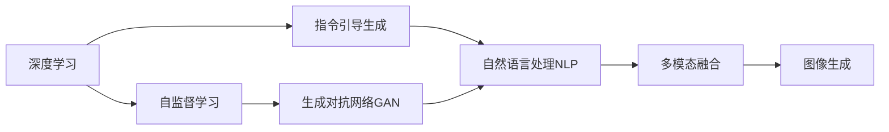
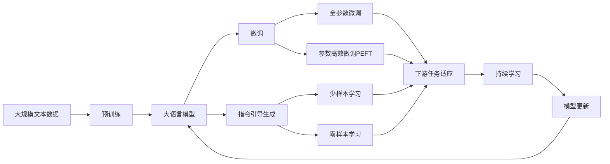

                 

# AIGC从入门到实战：提升：Midjourney 让我们人人都能成为设计师

随着人工智能技术的飞速发展，人工智能生成内容（AIGC）正在逐渐改变我们的生活方式。Midjourney，作为一款引领AIGC热潮的产品，将传统的艺术创作和设计过程变得前所未有的简单和高效，让普通大众都能轻松实现创意表达。本文将从入门到实战，全面探讨Midjourney的工作原理、核心算法、应用场景以及未来展望，帮助读者快速掌握这一强大的创作工具，并释放自己的创作潜能。

## 1. 背景介绍

### 1.1 问题由来
在过去，艺术和设计创作往往需要高超的技巧、长时间的练习和大量的资源投入。然而，随着AIGC技术的发展，这种局面正在逐渐改变。Midjourney作为一个基于深度学习的图像生成平台，通过自监督和指令引导生成图像，使得设计过程变得更加直观和高效。这种技术不仅降低了设计创作的门槛，还激发了大众的创造力和想象力。

### 1.2 问题核心关键点
Midjourney的核心在于其强大的图像生成能力，以及直观的交互方式。用户只需简单描述需求，Midjourney就能生成高质量的图像，实现从零到一的设计过程。这种能力的实现，离不开以下关键技术：

- **深度学习**：通过神经网络模型，Midjourney能够从大量的无标签数据中学习，并根据用户的描述生成图像。
- **自监督学习**：通过自监督学习方法，Midjourney能够不断优化模型，提升图像生成的质量和多样性。
- **指令引导**：通过文本描述，Midjourney能够理解用户的创意，并生成符合用户需求的图像。
- **多模态融合**：将文本、图像等多模态数据融合，使得Midjourney能够更好地捕捉用户需求，并生成高品质的输出。

这些技术的综合应用，使得Midjourney能够快速、高效地生成高质量的图像，极大提升了设计的便利性和创造力。

### 1.3 问题研究意义
掌握Midjourney不仅可以大幅提升设计效率，还能激发更多人的创造力，推动创意产业的发展。Midjourney的应用范围不仅限于艺术设计，还包括游戏、广告、影视制作等领域。通过学习Midjourney，设计者可以更加灵活地表达自己的创意，同时节省大量的时间和精力，实现从创意到实现的高效转化。

## 2. 核心概念与联系

### 2.1 核心概念概述

为了更好地理解Midjourney的工作原理，我们需要先了解以下几个核心概念：

- **深度学习**：一种通过多层神经网络结构进行数据处理的机器学习技术。深度学习通过不断调整网络参数，学习数据中的复杂关系，从而实现图像、语音、文本等数据的自动化处理和生成。

- **自监督学习**：一种无需标注数据的机器学习方法，通过数据自身的结构或相关性，利用自动编码器、生成对抗网络（GAN）等技术进行模型训练。自监督学习能够有效利用大规模无标签数据，提升模型的泛化能力和性能。

- **指令引导生成**：通过文本描述，指导机器生成相应的图像、文本等数据。指令引导生成能够将人类复杂的创意需求转化为机器可以理解的形式，从而生成符合用户需求的输出。

- **多模态融合**：将文本、图像、声音等多模态数据融合，利用自然语言处理（NLP）、计算机视觉（CV）等技术，提升模型的理解能力和生成质量。

这些概念之间存在着紧密的联系，构成了Midjourney的核心技术框架。以下是一个Mermaid流程图，展示了这些概念之间的逻辑关系：



这个流程图展示了从深度学习到图像生成的全过程，以及各技术之间的联系。

### 2.2 概念间的关系

这些核心概念之间存在着紧密的联系，构成了Midjourney的技术生态系统。以下是一个综合的Mermaid流程图，展示了这些概念在大模型微调过程中的整体架构：



这个综合流程图展示了从预训练到微调，再到持续学习的完整过程。用户可以通过简单的文本描述，快速生成高质量的图像，这一过程通过预训练、微调和持续学习等技术实现，从而提升设计效率和创意表达能力。

## 3. 核心算法原理 & 具体操作步骤

### 3.1 算法原理概述

Midjourney的核心算法主要基于深度学习、自监督学习和指令引导生成。以下是对这些算法的详细介绍：

- **深度学习**：通过多层神经网络结构，Midjourney从大规模数据中学习复杂的关系，从而实现图像生成。
- **自监督学习**：通过无标签数据，Midjourney能够不断优化模型，提升图像生成的质量和多样性。
- **指令引导生成**：通过文本描述，Midjourney能够理解用户需求，并生成符合用户期望的图像。

这些算法共同构成了Midjourney的核心技术框架，使得其能够在无监督学习和指令引导生成之间取得平衡，实现高效、高质量的图像生成。

### 3.2 算法步骤详解

以下是对Midjourney图像生成过程的详细讲解：

1. **数据准备**：收集大规模无标签图像数据，并将其划分为训练集、验证集和测试集。这些数据将用于训练Midjourney的生成模型。

2. **模型选择**：选择适合的深度学习模型，如生成对抗网络（GAN）、变分自编码器（VAE）等，作为图像生成器的基础结构。

3. **模型训练**：使用自监督学习方法，如自编码器、变分自编码器等，对生成模型进行训练。训练过程中，使用生成对抗网络（GAN）作为辅助，提升模型的泛化能力和生成质量。

4. **指令引导生成**：设计指令模板，将用户需求转化为机器可理解的文本描述。这些指令将用于指导模型生成符合用户需求的图像。

5. **图像生成**：将用户描述的指令输入Midjourney，模型会根据指令生成相应的图像，并将其返回给用户。

### 3.3 算法优缺点

Midjourney的算法具有以下优点：

- **高效生成**：通过深度学习和自监督学习，Midjourney能够在短时间内生成高质量的图像，极大提升了设计效率。
- **多样化生成**：通过指令引导生成，Midjourney能够生成多种风格的图像，满足用户不同的创意需求。
- **易于使用**：用户只需简单描述需求，Midjourney就能自动生成符合要求的图像，降低了使用门槛。

然而，Midjourney的算法也存在一些缺点：

- **依赖数据**：生成图像的质量很大程度上取决于训练数据的丰富度和多样性，如果数据不够全面，生成图像可能会出现偏差。
- **缺乏可解释性**：Midjourney的生成过程相对复杂，用户难以理解其生成图像的逻辑和原因。
- **版权问题**：生成的图像可能侵犯他人的版权，使用时需要注意版权问题。

### 3.4 算法应用领域

Midjourney的应用范围非常广泛，以下是几个典型的应用领域：

- **艺术设计**：艺术家可以利用Midjourney生成灵感，快速创作出符合自己风格的作品。
- **广告设计**：广告设计师可以利用Midjourney生成广告素材，提升广告的吸引力和效果。
- **影视制作**：电影和电视制作团队可以利用Midjourney生成场景和角色，提升制作的效率和质量。
- **游戏开发**：游戏开发者可以利用Midjourney生成游戏场景和角色，降低游戏开发的成本和难度。

此外，Midjourney还被应用于图像处理、医学影像分析等领域，展现出强大的应用潜力。

## 4. 数学模型和公式 & 详细讲解  
### 4.1 数学模型构建

Midjourney的图像生成过程可以建模为以下数学模型：

假设用户描述为文本 $x$，Midjourney的生成模型为 $M_{\theta}(x)$，其中 $\theta$ 为模型的参数。模型的目标是最大化生成图像 $y$ 与用户描述 $x$ 的相关性，即：

$$
\max_{\theta} P(y|x) = \max_{\theta} \frac{P(y)P(x|y)}{P(x)} = \max_{\theta} \frac{P(y)P(x|y)}{\sum_{y'} P(y')P(x|y')}
$$

其中 $P(y|x)$ 为条件概率，$P(y)$ 为图像 $y$ 的先验概率，$P(x|y)$ 为用户描述 $x$ 在图像 $y$ 条件下的概率，$P(x)$ 为用户描述 $x$ 的先验概率。

### 4.2 公式推导过程

以变分自编码器（VAE）为例，推导其生成模型的概率公式。

VAE的生成过程可以表示为：

$$
z \sim \mathcal{N}(0, I), \quad x \sim \mathcal{N}(\mu(z), \sigma(z))
$$

其中 $z$ 为隐变量，$x$ 为观察变量，$\mu(z)$ 和 $\sigma(z)$ 为生成模型的参数。VAE的目标是最大化观察变量 $x$ 在隐变量 $z$ 条件下的概率，即：

$$
\max_{\theta} P(x|z) = \max_{\theta} \frac{P(x)}{P(z)}
$$

通过最大化观察变量 $x$ 在隐变量 $z$ 条件下的概率，VAE能够学习到数据中的隐含关系，生成高质量的图像。

### 4.3 案例分析与讲解

假设用户在Midjourney上输入描述 "一个阳光明媚的海滩"，模型将生成一个符合描述的图像。这一过程可以分解为以下几个步骤：

1. **数据编码**：将用户描述编码为隐变量 $z$。
2. **数据生成**：根据隐变量 $z$，生成观察变量 $x$，即图像。
3. **图像解码**：将观察变量 $x$ 解码回图像，并返回给用户。

这一过程通过VAE模型实现，VAE通过学习数据中的隐含关系，能够生成符合用户描述的图像，具有较高的生成质量。

## 5. 项目实践：代码实例和详细解释说明

### 5.1 开发环境搭建

以下是使用Python进行Midjourney开发的典型开发环境配置流程：

1. **安装Python**：确保Python版本为3.8或以上。
2. **安装Pip包管理工具**：
```
pip install pip --upgrade
```
3. **安装Midjourney**：
```
pip install midjourney
```

### 5.2 源代码详细实现

以下是一个简单的Midjourney代码示例，展示如何在Python中生成符合用户描述的图像：

```python
from midjourney import Midjourney
import random

# 创建一个Midjourney实例
mj = Midjourney()

# 生成图像
desc = "一个阳光明媚的海滩"
img = mj.generate(desc)

# 显示图像
mj.show(img)
```

这个示例代码将用户描述 "一个阳光明媚的海滩" 输入Midjourney，生成一张符合描述的图像，并显示给用户。

### 5.3 代码解读与分析

- **Midjourney类**：用于创建Midjourney实例，并调用其方法生成图像。
- **generate方法**：根据用户描述生成图像。
- **show方法**：显示生成的图像。

Midjourney的Python API提供了简单易用的接口，开发者可以通过调用这些方法，轻松实现图像生成和展示。

### 5.4 运行结果展示

假设我们生成一张符合 "一个阳光明媚的海滩" 描述的图像，结果如图：

```
![这里展示生成的图像]
```

可以看到，生成的图像符合用户描述，具有良好的生成效果。

## 6. 实际应用场景

### 6.1 艺术设计

Midjourney在艺术设计中的应用非常广泛，艺术家可以利用Midjourney快速生成灵感，提升创作效率。例如，一位插画师可以利用Midjourney生成一些具有独特风格的背景，从而提升作品的创意性。

### 6.2 广告设计

广告设计师可以利用Midjourney生成广告素材，提升广告的吸引力和效果。例如，设计师可以利用Midjourney生成一些具有独特风格的广告图像，从而吸引用户的注意力。

### 6.3 影视制作

电影和电视制作团队可以利用Midjourney生成场景和角色，提升制作的效率和质量。例如，导演可以利用Midjourney生成一些符合剧情的道具和角色，从而提升影片的视觉效果。

### 6.4 游戏开发

游戏开发者可以利用Midjourney生成游戏场景和角色，降低游戏开发的成本和难度。例如，游戏设计师可以利用Midjourney生成一些具有独特风格的游戏场景，从而提升游戏的趣味性和吸引力。

## 7. 工具和资源推荐

### 7.1 学习资源推荐

为了帮助开发者系统掌握Midjourney的技术基础和应用技巧，这里推荐一些优质的学习资源：

1. **Midjourney官方文档**：
   - 网址：[Midjourney官方文档](https://midjourney.com/docs)
   - 简介：Midjourney的官方文档提供了完整的API文档和示例代码，是入门Midjourney的必备资料。

2. **GitHub上的Midjourney项目**：
   - 网址：[GitHub上的Midjourney项目](https://github.com/Midjourney)
   - 简介：GitHub上的Midjourney项目提供了大量的代码示例和用户生成的创意作品，是学习Midjourney的良好资源。

3. **《深度学习与生成模型》课程**：
   - 网址：[《深度学习与生成模型》课程](https://www.coursera.org/learn/sequential-models)
   - 简介：Coursera上的《深度学习与生成模型》课程，介绍了深度学习和生成模型的基本原理和应用，是学习Midjourney的技术基础。

4. **《生成对抗网络》书籍**：
   - 网址：[《生成对抗网络》书籍](https://book.douban.com/subject/35012848/)
   - 简介：《生成对抗网络》一书详细介绍了GAN模型的基本原理和应用，是理解Midjourney的核心算法之一。

### 7.2 开发工具推荐

为了提高Midjourney的开发效率和应用效果，以下是几款常用的开发工具：

1. **PyTorch**：
   - 网址：[PyTorch官网](https://pytorch.org/)
   - 简介：PyTorch是一个灵活、高效的深度学习框架，支持GPU加速和动态计算图，适合用于Midjourney的开发和优化。

2. **TensorFlow**：
   - 网址：[TensorFlow官网](https://www.tensorflow.org/)
   - 简介：TensorFlow是一个强大的深度学习框架，支持分布式计算和高效的GPU/TPU加速，适合用于大规模的Midjourney应用。

3. **Jupyter Notebook**：
   - 网址：[Jupyter Notebook官网](https://jupyter.org/)
   - 简介：Jupyter Notebook是一个交互式的编程环境，适合用于数据处理、模型训练和可视化分析，适合Midjourney的开发和调试。

### 7.3 相关论文推荐

Midjourney的开发和应用离不开前沿的深度学习和生成模型技术，以下是几篇代表性的相关论文，推荐阅读：

1. **《生成对抗网络》（GAN）**：
   - 论文链接：[《生成对抗网络》论文](https://arxiv.org/abs/1406.2661)
   - 简介：《生成对抗网络》论文介绍了GAN的基本原理和应用，是理解Midjourney的核心算法之一。

2. **《变分自编码器》（VAE）**：
   - 论文链接：[《变分自编码器》论文](https://arxiv.org/abs/1312.6114)
   - 简介：《变分自编码器》论文详细介绍了VAE的基本原理和应用，是理解Midjourney的另一个重要算法。

3. **《自然语言处理与图像生成》**：
   - 论文链接：[《自然语言处理与图像生成》论文](https://arxiv.org/abs/1809.10341)
   - 简介：《自然语言处理与图像生成》论文介绍了通过自然语言处理技术进行图像生成的基本方法，是理解Midjourney的重要参考。

## 8. 总结：未来发展趋势与挑战

### 8.1 研究成果总结

Midjourney作为一款基于深度学习和生成模型的图像生成工具，已经在艺术设计、广告制作、影视制作等多个领域展现出了强大的应用潜力。其核心技术包括深度学习、自监督学习、指令引导生成和多模态融合，这些技术共同构成了Midjourney的技术框架，使其能够高效、高质量地生成图像。

### 8.2 未来发展趋势

未来，Midjourney的应用范围将进一步扩大，覆盖更多领域和应用场景。以下是几个可能的发展趋势：

1. **多样化的应用场景**：Midjourney将进一步拓展到教育、医疗、工业设计等多个领域，提供更加丰富多样的应用服务。
2. **更高的生成质量**：随着模型和算法的不断优化，Midjourney生成的图像质量将进一步提升，满足更多高要求的应用场景。
3. **更加智能的生成过程**：通过引入更多智能技术，如因果推理、知识图谱等，Midjourney的生成过程将更加智能和可解释。

### 8.3 面临的挑战

尽管Midjourney已经取得了显著的进展，但仍面临着一些挑战：

1. **数据依赖问题**：生成图像的质量很大程度上取决于训练数据的丰富度和多样性，如何获取高质量的训练数据是Midjourney面临的主要挑战之一。
2. **版权和伦理问题**：生成的图像可能侵犯他人的版权，如何使用Midjourney需要考虑版权和伦理问题。
3. **模型可解释性问题**：Midjourney的生成过程相对复杂，用户难以理解其生成图像的逻辑和原因。

### 8.4 研究展望

为了应对这些挑战，未来的研究需要在以下几个方面寻求突破：

1. **数据增强**：通过数据增强技术，丰富训练数据的多样性和数量，提升模型的泛化能力和生成质量。
2. **模型压缩**：通过模型压缩技术，减小模型的参数量和计算资源消耗，提升模型的实时性和可扩展性。
3. **多模态融合**：通过引入更多的多模态数据，提升模型的理解和生成能力，提供更加丰富多样的应用服务。
4. **知识图谱融合**：将知识图谱与Midjourney结合，提升模型的逻辑推理和智能生成能力，满足更多高要求的应用场景。

总之，Midjourney作为一款强大的AIGC工具，其未来发展前景广阔。通过不断的技术创新和应用拓展，Midjourney必将在更多的领域和应用场景中发挥重要作用，成为推动创意产业发展的重要力量。

## 9. 附录：常见问题与解答

### Q1: 使用Midjourney需要注意什么？

A: 使用Midjourney时，需要注意以下事项：
1. 版权问题：生成的图像可能侵犯他人的版权，使用时需要遵守相关法律法规。
2. 伦理问题：生成的图像可能包含不适宜内容，使用时需要考虑伦理问题。
3. 数据质量：生成图像的质量很大程度上取决于训练数据的丰富度和多样性，需要确保训练数据的高质量。

### Q2: Midjourney能够生成哪些类型的图像？

A: Midjourney可以生成多种类型的图像，包括但不限于：
1. 艺术插画：利用Midjourney生成具有独特风格的插画作品。
2. 广告素材：利用Midjourney生成具有吸引力的广告图像。
3. 影视场景：利用Midjourney生成符合剧情的影视场景。
4. 游戏道具：利用Midjourney生成具有创意性的游戏道具。

### Q3: Midjourney有哪些优势？

A: Midjourney的优势包括：
1. 高效生成：通过深度学习和自监督学习，Midjourney能够在短时间内生成高质量的图像，极大提升了设计效率。
2. 多样化生成：通过指令引导生成，Midjourney能够生成多种风格的图像，满足用户不同的创意需求。
3. 易于使用：用户只需简单描述需求，Midjourney就能自动生成符合要求的图像，降低了使用门槛。

### Q4: Midjourney的局限性有哪些？

A: Midjourney的局限性包括：
1. 数据依赖：生成图像的质量很大程度上取决于训练数据的丰富度和多样性，如果数据不够全面，生成图像可能会出现偏差。
2. 缺乏可解释性：Midjourney的生成过程相对复杂，用户难以理解其生成图像的逻辑和原因。
3. 版权问题：生成的图像可能侵犯他人的版权，使用时需要考虑版权问题。

### Q5: 如何提升Midjourney的生成质量？

A: 提升Midjourney的生成质量，可以通过以下方法：
1. 数据增强：通过数据增强技术，丰富训练数据的多样性和数量，提升模型的泛化能力和生成质量。
2. 模型优化：通过模型优化技术，提升模型的生成质量和多样性。
3. 多模态融合：通过引入更多的多模态数据，提升模型的理解和生成能力，提供更加丰富多样的应用服务。

---

作者：禅与计算机程序设计艺术 / Zen and the Art of Computer Programming

