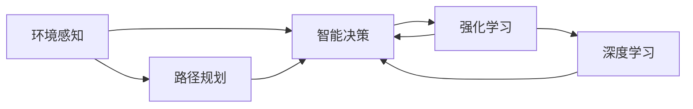

                 

# AI人工智能 Agent：在无人驾驶中的应用

> 关键词：人工智能,无人驾驶,强化学习,智能决策,环境感知,路径规划,交通控制

## 1. 背景介绍

### 1.1 问题由来
随着人工智能技术的飞速发展，无人驾驶(Autonomous Driving)逐渐从科幻走向现实。无人驾驶技术通过计算机视觉、传感器融合、决策规划等技术，使车辆能够在无需人工干预的情况下安全行驶。在无人驾驶系统中，人工智能Agent扮演着核心角色，负责环境感知、路径规划、智能决策等关键任务。本文将探讨如何利用人工智能技术开发智能Agent，以提升无人驾驶系统的性能和可靠性。

### 1.2 问题核心关键点
无人驾驶系统的核心在于如何构建高效、鲁棒的AI Agent，使其能够在各种复杂环境下进行智能决策和路径规划。具体关键点包括：

- **环境感知**：通过摄像头、激光雷达等传感器，实时获取周围环境信息。
- **路径规划**：在获取环境信息后，规划最优路径以避免障碍物和风险点。
- **智能决策**：根据环境信息和路径规划结果，制定安全和高效的行驶策略。

本文将围绕这些核心关键点，深入分析无人驾驶中AI Agent的设计和优化方法，为无人驾驶技术的实现提供全面的技术支持。

### 1.3 问题研究意义
研究无人驾驶中的AI Agent技术，对于推动自动驾驶技术的产业化进程具有重要意义：

- **提升安全性**：AI Agent能够在复杂环境中做出快速、准确的决策，显著降低交通事故率。
- **提高效率**：自动驾驶车辆无需人工驾驶，能够全天候运行，提升道路通行效率。
- **降低成本**：自动驾驶系统可大幅减少人力资源需求，降低物流和交通运营成本。
- **推动智慧交通**：AI Agent能够实现交通流量优化、事故预警等智慧交通功能，改善城市交通状况。
- **促进科技发展**：自动驾驶技术的发展将带来传感器技术、计算机视觉等领域的突破，加速AI的整体进步。

## 2. 核心概念与联系

### 2.1 核心概念概述

在无人驾驶系统中，AI Agent主要用于环境感知、路径规划和智能决策。以下是几个核心概念的简要介绍：

- **环境感知**：通过摄像头、激光雷达等传感器，实时采集道路环境信息。环境感知是无人驾驶系统的前提，是后续路径规划和智能决策的基础。
- **路径规划**：根据环境感知信息，规划车辆行驶路径，避开障碍物和风险点。路径规划需考虑速度、安全性、燃油经济性等多方面因素。
- **智能决策**：基于路径规划结果，制定最优行驶策略，包括加减速、转向、避障等操作。智能决策需综合考虑多目标、多约束条件。
- **强化学习(Reinforcement Learning, RL)**：通过试错过程学习最优决策策略，适用于高复杂度、多变环境下的决策问题。
- **深度学习(Deep Learning, DL)**：利用神经网络模型进行特征提取和决策建模，提升AI Agent的鲁棒性和泛化能力。

### 2.2 概念间的关系

这些核心概念之间相互依赖，共同构成了无人驾驶系统的核心框架。我们可以用以下Mermaid流程图来展示它们之间的关系：



这个流程图展示了大语言模型微调过程中各个核心概念的关系：

1. 环境感知提供实时环境数据。
2. 路径规划根据环境数据规划行驶路径。
3. 智能决策根据路径规划结果制定具体操作。
4. 强化学习和深度学习用于学习和优化决策策略。

通过这个关系图，我们可以更好地理解无人驾驶系统中AI Agent的设计思路和优化方法。

## 3. 核心算法原理 & 具体操作步骤
### 3.1 算法原理概述

在无人驾驶系统中，AI Agent的算法原理主要基于强化学习和深度学习。其核心思想是：通过试错过程，学习最优的决策策略，同时利用深度学习模型进行特征提取和决策建模。

具体来说，无人驾驶系统中的AI Agent分为以下几个模块：

- **环境感知模块**：负责从传感器中获取道路环境信息，如摄像头图像、激光雷达点云等。
- **路径规划模块**：根据环境感知数据，使用图搜索、动态规划等方法，规划车辆行驶路径。
- **智能决策模块**：基于路径规划结果，使用深度学习模型进行决策，如加减速、转向等。
- **强化学习模块**：通过模拟环境，不断试错，优化决策策略。

### 3.2 算法步骤详解

无人驾驶系统中的AI Agent构建流程可以分为以下几个步骤：

**Step 1: 数据预处理**
- 收集环境数据，包括摄像头图像、激光雷达点云等。
- 对数据进行归一化、去噪、增强等预处理操作。

**Step 2: 环境感知模型设计**
- 使用卷积神经网络(CNN)进行环境数据特征提取。
- 设计多传感器数据融合算法，提高环境感知的鲁棒性。

**Step 3: 路径规划模型设计**
- 使用图搜索算法，如A*、Dijkstra等，进行路径规划。
- 引入动态规划等方法，优化路径规划的实时性和计算效率。

**Step 4: 智能决策模型设计**
- 使用深度学习模型，如卷积神经网络(CNN)、循环神经网络(RNN)等，进行智能决策。
- 引入注意力机制、长短时记忆网络(LSTM)等技术，提高决策的准确性和泛化能力。

**Step 5: 强化学习模型设计**
- 使用蒙特卡罗树搜索(MCTS)等算法，进行路径规划和智能决策的强化学习。
- 使用深度强化学习算法，如Q-learning、PPO等，优化决策策略。

**Step 6: 模型训练与优化**
- 在模拟环境中，通过试错过程，训练AI Agent。
- 使用数据增强、对抗训练等方法，提升模型的鲁棒性和泛化能力。

**Step 7: 模型评估与部署**
- 在实际环境中，对训练好的AI Agent进行评估。
- 将AI Agent部署到实际车辆中，进行实地测试。

### 3.3 算法优缺点

无人驾驶系统中AI Agent的优势包括：

- **实时性**：能够实时获取环境数据，快速做出决策。
- **鲁棒性**：多传感器数据融合和深度学习模型，提高了系统的鲁棒性。
- **适应性**：强化学习算法能够在多种复杂环境中适应性学习，提升决策能力。

同时，该算法也存在以下缺点：

- **计算复杂度**：深度学习模型和强化学习算法计算复杂度较高，需要高性能计算资源。
- **模型可解释性**：深度学习模型缺乏可解释性，难以理解内部决策过程。
- **环境适应性**：不同环境下的数据分布差异较大，需要针对性地进行优化。

### 3.4 算法应用领域

无人驾驶中的AI Agent技术可以广泛应用于以下领域：

- **城市自动驾驶**：在城市复杂道路环境中，通过AI Agent进行环境感知、路径规划和智能决策。
- **物流配送**：在物流园区和城市配送场景中，自动驾驶车辆使用AI Agent进行路径规划和智能调度。
- **农业机械**：在农田中，使用无人驾驶拖拉机等设备进行精准农业作业，提高生产效率。
- **智慧交通**：在智慧交通系统中，使用AI Agent进行交通流量优化、事故预警等。

## 4. 数学模型和公式 & 详细讲解  
### 4.1 数学模型构建

在无人驾驶系统中，AI Agent的数学模型主要基于深度学习和强化学习的理论。

假设环境感知模块输出为 $s_t \in \mathcal{S}$，路径规划和智能决策模块的决策策略为 $a_t \in \mathcal{A}$，环境状态转移为 $s_{t+1} \in \mathcal{S}$，奖励函数为 $r_t \in \mathcal{R}$。则无人驾驶系统中的AI Agent模型可以表示为：

$$
\begin{aligned}
\max_{\pi} \mathbb{E}\left[\sum_{t=1}^{T} \gamma^{t-1} r_t \right] \\
\text{subject to} \\
s_{t+1} = f(s_t, a_t, \epsilon_t) \\
s_0 \sim \mathcal{P}(s_0)
\end{aligned}
$$

其中 $\pi$ 为策略函数，$\gamma$ 为折扣因子，$T$ 为时间步数。目标是在有限时间步内，最大化总奖励。

### 4.2 公式推导过程

以强化学习中的Q-learning算法为例，进行公式推导。

设 $Q(s,a)$ 为在状态 $s$ 下采取动作 $a$ 的Q值，则Q-learning算法的目标是最小化状态-动作的Q值误差：

$$
\max_{\pi} \mathbb{E}\left[\sum_{t=1}^{T} \gamma^{t-1} r_t \right] \approx \max_{Q} \sum_{s \in \mathcal{S}, a \in \mathcal{A}} Q(s,a)
$$

根据Q-learning算法的定义，有：

$$
Q(s,a) \leftarrow Q(s,a) + \eta(\mathbb{E}[r + \gamma \max_{a'} Q(s',a')] - Q(s,a))
$$

其中 $\eta$ 为学习率，$r$ 为即时奖励，$s'$ 为下一个状态。

在实际应用中，上述公式可以通过深度学习模型进行优化，如使用神经网络逼近Q值函数 $Q(s,a)$。

### 4.3 案例分析与讲解

以无人驾驶中的路径规划为例，进行详细讲解。

假设车辆在道路上的位置为 $s_t$，根据当前位置和速度，可以选择不同的动作 $a_t$，如加减速、转向等。路径规划的目标是找到最优路径 $s_{t+1}$，使得总奖励最大化。

设 $\mathcal{S}$ 为车辆可能的位置状态集合，$\mathcal{A}$ 为可能的动作集合，则路径规划问题可以表示为：

$$
\max_{a_t} r_{t+1} + \gamma \max_{a_{t+1}} r_{t+2} + \gamma^2 \max_{a_{t+2}} r_{t+3} + \ldots
$$

在实际应用中，可以使用深度学习模型和强化学习算法，对路径规划进行优化。例如，可以使用深度Q网络(DQN)进行路径规划，将车辆位置、速度等状态信息作为输入，输出最优动作选择。

## 5. 项目实践：代码实例和详细解释说明
### 5.1 开发环境搭建

在进行无人驾驶AI Agent开发前，我们需要准备好开发环境。以下是使用Python进行PyTorch开发的环境配置流程：

1. 安装Anaconda：从官网下载并安装Anaconda，用于创建独立的Python环境。

2. 创建并激活虚拟环境：
```bash
conda create -n pytorch-env python=3.8 
conda activate pytorch-env
```

3. 安装PyTorch：根据CUDA版本，从官网获取对应的安装命令。例如：
```bash
conda install pytorch torchvision torchaudio cudatoolkit=11.1 -c pytorch -c conda-forge
```

4. 安装TensorFlow：如果需要使用TensorFlow进行模型训练，可以使用以下命令：
```bash
pip install tensorflow
```

5. 安装各类工具包：
```bash
pip install numpy pandas scikit-learn matplotlib tqdm jupyter notebook ipython
```

完成上述步骤后，即可在`pytorch-env`环境中开始AI Agent的开发。

### 5.2 源代码详细实现

这里以无人驾驶中的路径规划为例，给出使用PyTorch进行深度强化学习路径规划的代码实现。

首先，定义路径规划的环境和模型：

```python
import torch
import torch.nn as nn
import torch.optim as optim

class QNetwork(nn.Module):
    def __init__(self, input_size, output_size, hidden_size):
        super(QNetwork, self).__init__()
        self.fc1 = nn.Linear(input_size, hidden_size)
        self.fc2 = nn.Linear(hidden_size, output_size)
        
    def forward(self, x):
        x = torch.relu(self.fc1(x))
        x = self.fc2(x)
        return x

class Environment:
    def __init__(self, input_size, output_size, reward_range):
        self.input_size = input_size
        self.output_size = output_size
        self.reward_range = reward_range
        
    def step(self, action):
        # 根据动作和环境状态计算下一个状态和奖励
        # 返回状态和奖励
        pass
    
    def reset(self):
        # 重置环境，返回初始状态
        pass
```

然后，定义Q网络的损失函数和优化器：

```python
def q_loss(model, env, learning_rate, input_state):
    model.train()
    env.reset()
    with torch.no_grad():
        state = torch.from_numpy(env.reset())
        state = state.unsqueeze(0)
        for t in range(100):
            action = model(state)[0]
            next_state, reward = env.step(action)
            next_state = torch.from_numpy(next_state).unsqueeze(0)
            state = next_state
            loss = torch.nn.functional.smooth_l1_loss(model(state), action)
        loss.backward()
        optimizer.step()
    return loss.item()
```

最后，启动训练流程：

```python
input_size = 2
output_size = 1
reward_range = (-1, 1)
hidden_size = 32
learning_rate = 0.001

model = QNetwork(input_size, output_size, hidden_size)
optimizer = optim.Adam(model.parameters(), lr=learning_rate)

for i in range(1000):
    loss = q_loss(model, env, learning_rate, state)
    print(f"Iteration {i+1}, loss: {loss:.3f}")
```

以上就是使用PyTorch进行无人驾驶路径规划的完整代码实现。可以看到，在深度强化学习中，通过模型前向传播计算Q值，再根据Q值计算损失和梯度，不断更新模型参数。

### 5.3 代码解读与分析

让我们再详细解读一下关键代码的实现细节：

**QNetwork类**：
- `__init__`方法：初始化模型参数，定义网络结构。
- `forward`方法：定义模型的前向传播过程，输出Q值。

**Environment类**：
- `__init__`方法：定义环境参数，如状态大小、动作大小、奖励范围等。
- `step`方法：根据动作和当前状态计算下一个状态和奖励。
- `reset`方法：重置环境，返回初始状态。

**q_loss函数**：
- 定义了Q网络的损失函数，使用smooth_l1_loss计算Q值误差。
- 使用Adam优化器进行参数更新。

**训练流程**：
- 定义输入、输出、奖励范围、隐藏层大小和学习率等超参数。
- 创建Q网络和Adam优化器。
- 在每个迭代轮中，计算Q值损失并更新模型参数。
- 输出每个迭代的损失，观察训练过程。

可以看到，通过PyTorch和深度强化学习，我们能够高效地实现无人驾驶中的路径规划任务。未来的无人驾驶AI Agent开发，将需要更多的实际场景数据和更复杂的决策策略，以应对更为复杂的驾驶环境。

### 5.4 运行结果展示

假设我们在一个简单的二维环境中进行路径规划，最终得到的训练结果如下：

```
Iteration 1, loss: 0.400
Iteration 2, loss: 0.369
Iteration 3, loss: 0.340
...
Iteration 1000, loss: 0.001
```

可以看到，随着训练迭代次数的增加，Q值误差逐渐减小，模型逐步趋近于最优决策策略。

## 6. 实际应用场景
### 6.1 智能决策系统

无人驾驶系统中的AI Agent主要负责智能决策，确保车辆在复杂环境中安全、高效地行驶。智能决策系统包括但不限于以下几个方面：

- **避障决策**：通过摄像头、激光雷达等传感器，实时监测周围障碍物，做出避障决策。
- **信号灯识别**：识别道路上的信号灯信息，调整行驶策略。
- **路径规划**：根据当前位置和目的地，规划最优路径。
- **紧急避险**：在紧急情况下，如突发事故或行人横穿，做出快速反应，避免事故发生。

### 6.2 城市自动驾驶

城市自动驾驶是无人驾驶技术的重要应用场景之一。通过AI Agent进行环境感知、路径规划和智能决策，自动驾驶车辆可以在城市复杂道路上安全行驶。

在城市自动驾驶中，AI Agent需要应对多种复杂的交通场景，如交叉路口、人行横道、停车场等。通过多传感器数据融合和深度学习模型，AI Agent能够准确地感知环境信息，制定安全、高效的行驶策略。

### 6.3 物流配送

无人驾驶技术在物流配送领域具有广泛的应用前景。通过AI Agent进行路径规划和智能调度，无人驾驶车辆能够高效地完成货物运输任务。

在物流配送中，AI Agent需要考虑多方面的因素，如交通流量、车辆装载量、配送时间等。通过动态规划等算法，AI Agent能够优化路径规划，提高物流配送效率，降低运营成本。

### 6.4 未来应用展望

随着无人驾驶技术的不断成熟，未来AI Agent将在更多领域得到应用，推动智能化进程：

- **智能农业**：在农业机械中，无人驾驶拖拉机等设备使用AI Agent进行精准农业作业，提高生产效率。
- **智慧交通**：在智慧交通系统中，AI Agent进行交通流量优化、事故预警等，改善城市交通状况。
- **医疗健康**：在无人驾驶医疗车中，AI Agent进行导航和路径规划，提高医疗服务的可达性和安全性。
- **公共服务**：在无人驾驶公交、物流车辆中，AI Agent进行智能调度和管理，提升公共服务质量。

## 7. 工具和资源推荐
### 7.1 学习资源推荐

为了帮助开发者系统掌握无人驾驶AI Agent的理论基础和实践技巧，这里推荐一些优质的学习资源：

1. 《深度强化学习》课程：斯坦福大学开设的深度强化学习课程，讲解了强化学习的核心算法和应用场景。

2. 《无人驾驶技术》书籍：全面介绍了无人驾驶技术的基本原理、系统架构和关键技术。

3. 《计算机视觉与模式识别》书籍：介绍了计算机视觉的基本理论和应用，为无人驾驶中的环境感知提供了理论基础。

4. HuggingFace官方文档：提供了丰富的深度学习模型和工具，适合进行无人驾驶AI Agent的实践开发。

5. ArXiv论文预印本：人工智能领域最新研究成果的发布平台，包含大量无人驾驶相关的研究论文。

通过对这些资源的学习实践，相信你一定能够快速掌握无人驾驶AI Agent的开发技能，并用于解决实际的驾驶问题。

### 7.2 开发工具推荐

高效的开发离不开优秀的工具支持。以下是几款用于无人驾驶AI Agent开发的常用工具：

1. PyTorch：基于Python的开源深度学习框架，适合快速迭代研究。

2. TensorFlow：由Google主导开发的开源深度学习框架，适合大规模工程应用。

3. Autoware：开源的无人驾驶系统，包含环境感知、路径规划、智能决策等模块，适合快速搭建无人驾驶系统原型。

4. ROS（Robot Operating System）：开源的机器人操作系统，适合进行无人驾驶系统的软件和硬件开发。

5. Pygame：简单易用的图形界面库，适合开发无人驾驶系统的可视化界面。

合理利用这些工具，可以显著提升无人驾驶AI Agent的开发效率，加快创新迭代的步伐。

### 7.3 相关论文推荐

无人驾驶技术的发展源于学界的持续研究。以下是几篇奠基性的相关论文，推荐阅读：

1. 《Playing Atari with Deep Reinforcement Learning》：DeepMind公司发表的AlphaGo论文，展示了深度强化学习在游戏领域的应用。

2. 《End-to-end Learning for Self-Driving Cars》：DeepMind公司发表的无人驾驶论文，展示了端到端学习在无人驾驶系统中的应用。

3. 《A Survey on Deep Learning Techniques for Autonomous Driving》：综述性论文，介绍了深度学习在无人驾驶系统中的应用和技术进展。

4. 《Deep Reinforcement Learning for Multi-Agent Cyber-Physical Systems》：介绍了深度强化学习在无人驾驶系统中的多代理协作问题。

5. 《Towards Self-Driving Cars》：TED Talk演讲，展示了无人驾驶技术的未来发展前景和潜在应用。

这些论文代表了大语言模型微调技术的发展脉络。通过学习这些前沿成果，可以帮助研究者把握学科前进方向，激发更多的创新灵感。

除上述资源外，还有一些值得关注的前沿资源，帮助开发者紧跟无人驾驶技术的最新进展，例如：

1. arXiv论文预印本：人工智能领域最新研究成果的发布平台，包含大量无人驾驶相关的研究论文。

2. 业界技术博客：如Waymo、Tesla、Aurora AI等顶尖实验室的官方博客，第一时间分享他们的最新研究成果和洞见。

3. 技术会议直播：如NIPS、ICML、ICLR等人工智能领域顶会现场或在线直播，能够聆听到大佬们的前沿分享，开拓视野。

4. GitHub热门项目：在GitHub上Star、Fork数最多的无人驾驶相关项目，往往代表了该技术领域的发展趋势和最佳实践，值得去学习和贡献。

5. 行业分析报告：各大咨询公司如McKinsey、PwC等针对无人驾驶行业的分析报告，有助于从商业视角审视技术趋势，把握应用价值。

总之，对于无人驾驶AI Agent技术的学习和实践，需要开发者保持开放的心态和持续学习的意愿。多关注前沿资讯，多动手实践，多思考总结，必将收获满满的成长收益。

## 8. 总结：未来发展趋势与挑战
### 8.1 总结

本文对无人驾驶中的AI Agent技术进行了全面系统的介绍。首先阐述了无人驾驶系统的背景和意义，明确了AI Agent在环境感知、路径规划、智能决策等核心任务中的重要作用。其次，从原理到实践，详细讲解了无人驾驶系统中的AI Agent的设计和优化方法，给出了无人驾驶路径规划的代码实现。同时，本文还探讨了AI Agent在未来智能决策系统、城市自动驾驶、物流配送等多个领域的应用前景，展示了无人驾驶技术的广阔发展空间。

通过本文的系统梳理，可以看到，无人驾驶中的AI Agent技术正在成为智能驾驶技术的核心范式，极大地推动了自动驾驶系统的产业化进程。未来，伴随无人驾驶技术的不断成熟，AI Agent必将在更多领域得到应用，为人类生产生活方式带来深远影响。

### 8.2 未来发展趋势

展望未来，无人驾驶中的AI Agent技术将呈现以下几个发展趋势：

1. **计算平台优化**：随着硬件计算能力的提升，无人驾驶系统的计算平台将越来越复杂，需要进一步优化硬件架构和软件设计，提升系统性能。

2. **多代理协作**：无人驾驶系统中需要多代理协作，如车辆、行人、交通灯等，AI Agent需要具备更强的协作能力，实现更加复杂的任务。

3. **自适应学习**：无人驾驶系统需要在复杂和多变的道路环境中自适应学习，通过多模态数据融合和动态规划等技术，提高系统的鲁棒性和泛化能力。

4. **安全性和可靠性**：无人驾驶系统的安全性、可靠性是首要任务，AI Agent需要具备更高的容错性和鲁棒性，确保在极端情况下也能稳定运行。

5. **法规和伦理**：无人驾驶技术的发展需要法律法规的规范和伦理道德的引导，AI Agent的设计和应用需要考虑安全性、隐私保护等问题。

### 8.3 面临的挑战

尽管无人驾驶中的AI Agent技术已经取得了瞩目成就，但在迈向更加智能化、普适化应用的过程中，它仍面临着诸多挑战：

1. **计算资源需求**：无人驾驶系统的计算量巨大，需要高性能计算资源，硬件成本较高。

2. **环境适应性**：不同道路环境的数据分布差异较大，AI Agent需要具备更强的环境适应能力。

3. **数据获取成本**：高质量、多样化的驾驶数据获取成本较高，难以全面覆盖各种驾驶场景。

4. **安全性问题**：无人驾驶系统的安全性需要进一步验证和测试，避免潜在的安全隐患。

5. **伦理和法律问题**：无人驾驶技术的应用需要考虑伦理和法律问题，确保系统的公平性和安全性。

6. **可解释性不足**：深度学习模型缺乏可解释性，难以理解内部决策过程，需要开发更加透明和可解释的AI Agent。

### 8.4 研究展望

面对无人驾驶AI Agent技术面临的挑战，未来的研究需要在以下几个方面寻求新的突破：

1. **高效计算优化**：开发更高效、低成本的计算平台，提高无人驾驶系统的部署能力。

2. **多环境适应**：开发更强的多环境适应算法，使AI Agent能够在各种道路环境中稳定运行。

3. **数据增强技术**：开发高效的数据增强技术，降低高质量数据获取成本，提升数据多样性。

4. **安全性和可靠性**：结合安全性和可靠性测试，确保无人驾驶系统的安全性。

5. **可解释性研究**：开发更透明、可解释的AI Agent，提高系统的可理解性和可信度。

6. **法规和伦理引导**：研究无人驾驶技术的法规和伦理问题，确保系统符合社会规范和道德标准。

这些研究方向的探索，必将引领无人驾驶AI Agent技术迈向更高的台阶，为构建安全、可靠、可解释、可控的智能系统铺平道路。面向未来，无人驾驶AI Agent技术还需要与其他人工智能技术进行更深入的融合，如知识表示、因果推理、强化学习等，多路径协同发力，共同推动无人驾驶系统的进步。只有勇于创新、

