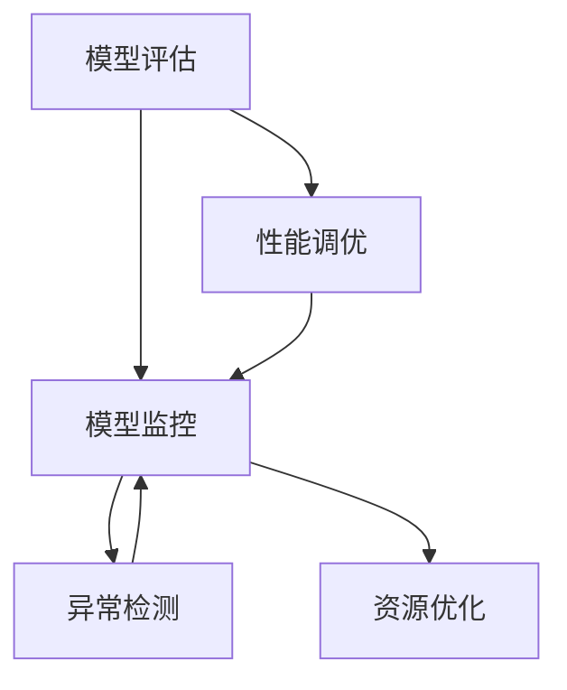
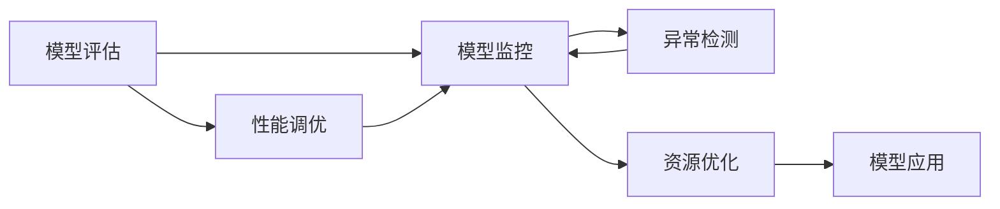

                 

# AI人工智能核心算法原理与代码实例讲解：模型监控

> 关键词：模型监控,机器学习,深度学习,模型评估,性能调优

## 1. 背景介绍

### 1.1 问题由来
在深度学习和大数据飞速发展的今天，机器学习与人工智能（AI）技术已经广泛应用于各个行业，从金融、医疗到教育、交通，模型在实际应用中起到了至关重要的作用。然而，模型训练和应用过程中面临一系列挑战，包括但不限于：
- **过拟合**：模型在训练数据上表现良好，但在测试数据或实际应用中表现不佳。
- **数据偏差**：模型在训练时可能会学习到数据中的偏见和偏差，导致输出结果不合理。
- **性能波动**：模型在不同批次、不同设备上训练的结果可能存在显著差异。
- **模型退化**：随着训练和部署时间的推移，模型性能可能会逐渐降低。

这些问题不仅影响了模型在实际应用中的效果，还可能导致严重的安全风险和业务损失。因此，对模型进行持续监控和评估，是确保模型性能稳定、应用安全的关键手段。

### 1.2 问题核心关键点
模型监控的本质是通过对模型训练和应用过程中各项指标的实时监测和分析，及时发现和解决潜在问题，确保模型在实际应用中的可靠性和安全性。以下是模型监控的一些核心关键点：
- **指标选择**：选择合适的模型评估指标，如准确率、召回率、F1分数等，用于衡量模型性能。
- **监控工具**：利用先进的监控工具和平台，实时收集和分析模型运行数据。
- **异常检测**：通过机器学习算法或统计方法，及时识别模型输出或运行的异常情况。
- **性能调优**：根据监控结果，调整模型参数或训练策略，提升模型性能。

### 1.3 问题研究意义
模型监控对于保证模型性能和应用效果具有重要意义：
- **提升模型效果**：通过实时监控和分析，及时发现并解决模型问题，提升模型在实际应用中的效果。
- **降低风险**：及时识别模型中的偏见和偏差，避免安全风险和业务损失。
- **优化资源利用**：通过性能调优，合理分配计算资源，提高模型训练和推理效率。
- **加速迭代改进**：持续监控和反馈，指导模型改进和优化，加速模型迭代进程。

## 2. 核心概念与联系

### 2.1 核心概念概述

为更好地理解模型监控的原理和方法，本节将介绍几个关键概念及其关系：

- **模型评估（Model Evaluation）**：通过一系列评估指标，衡量模型在不同数据集上的性能表现，如准确率、召回率、F1分数等。
- **模型监控（Model Monitoring）**：在模型训练和应用过程中，实时收集和分析模型的运行数据，及时发现潜在问题。
- **性能调优（Performance Tuning）**：根据监控结果，调整模型参数或训练策略，提升模型性能。
- **异常检测（Anomaly Detection）**：通过统计方法或机器学习算法，识别模型输出或运行的异常情况。
- **资源优化（Resource Optimization）**：合理分配计算资源，提高模型训练和推理效率。

这些概念之间存在密切联系，形成了一个完整的模型监控体系，确保模型在训练和应用过程中的稳定性和可靠性。

### 2.2 概念间的关系

以下是一个简单的Mermaid流程图，展示了模型监控相关概念之间的联系：



这个流程图展示了模型评估、监控、调优、异常检测和资源优化之间的关系：
- **模型评估**：对模型在训练和应用过程中的表现进行评估，确定是否需要进行调整。
- **模型监控**：实时收集和分析模型的运行数据，识别潜在问题。
- **性能调优**：根据监控结果，调整模型参数或训练策略，提升模型性能。
- **异常检测**：通过统计或机器学习算法，及时发现模型输出或运行的异常情况。
- **资源优化**：合理分配计算资源，提高模型训练和推理效率。

### 2.3 核心概念的整体架构

最后，我们用一个综合的流程图来展示模型监控的整体架构：



这个综合流程图展示了从模型评估到监控、调优、异常检测和资源优化的完整过程，确保模型在训练和应用过程中的稳定性和可靠性。

## 3. 核心算法原理 & 具体操作步骤

### 3.1 算法原理概述

模型监控的原理主要包括：
- **模型评估指标选择**：根据任务类型和应用场景，选择合适的评估指标，如准确率、召回率、F1分数等。
- **监控工具选择**：选择合适的监控工具和平台，实时收集和分析模型运行数据。
- **异常检测算法选择**：根据模型特性和监控需求，选择合适的异常检测算法，如统计方法、机器学习算法等。
- **性能调优策略选择**：根据监控结果，选择合适的调优策略，如超参数调整、模型裁剪等。

### 3.2 算法步骤详解

以下是一个模型监控的详细步骤：

1. **数据准备**：收集和预处理训练数据、验证数据和测试数据，确保数据集质量。
2. **模型训练**：使用深度学习框架（如TensorFlow、PyTorch）训练模型，记录训练日志和运行数据。
3. **模型评估**：在验证集上评估模型性能，确定是否需要进行调整。
4. **模型监控**：部署模型并实时收集运行数据，使用监控工具（如TensorBoard、Kubeflow）记录模型运行状态。
5. **异常检测**：使用统计方法或机器学习算法（如孤立森林、神经网络）检测模型输出或运行的异常情况。
6. **性能调优**：根据异常检测结果，调整模型参数或训练策略，提升模型性能。
7. **资源优化**：根据模型运行数据，合理分配计算资源，提高模型训练和推理效率。

### 3.3 算法优缺点

模型监控具有以下优点：
- **及时发现问题**：通过实时监控，及时发现模型中的问题，避免在实际应用中出现问题。
- **优化模型效果**：通过性能调优，提升模型在实际应用中的效果。
- **提高资源利用率**：通过资源优化，合理分配计算资源，提高模型训练和推理效率。

同时，模型监控也存在一些缺点：
- **监控成本高**：实时监控需要投入大量计算资源和人力，成本较高。
- **异常检测复杂**：异常检测算法需要根据模型特性和监控需求进行选择，复杂度较高。
- **数据质量要求高**：监控数据质量直接影响监控效果，需要投入大量精力保证数据质量。

### 3.4 算法应用领域

模型监控在多个领域都有广泛应用，例如：

- **金融风控**：监控模型在欺诈检测、信用评分等任务中的表现，及时识别和纠正模型偏差。
- **医疗诊断**：监控模型在疾病诊断、病历分析等任务中的表现，确保诊断准确性。
- **智能客服**：监控模型在对话生成、意图识别等任务中的表现，提升客服系统稳定性。
- **自动驾驶**：监控模型在目标检测、路径规划等任务中的表现，确保自动驾驶安全。

这些领域中，模型监控的应用不仅提高了模型性能，还保证了应用的安全性和可靠性。

## 4. 数学模型和公式 & 详细讲解  
### 4.1 数学模型构建

模型监控的数学模型通常基于以下指标：
- **准确率（Accuracy）**：模型预测正确的样本占总样本的比例，计算公式为 $Accuracy = \frac{TP+TN}{TP+TN+FP+FN}$。
- **召回率（Recall）**：模型正确识别为正样本的样本占实际正样本的比例，计算公式为 $Recall = \frac{TP}{TP+FN}$。
- **F1分数（F1 Score）**：综合考虑准确率和召回率，计算公式为 $F1 Score = 2 \times \frac{Precision \times Recall}{Precision + Recall}$。
- **ROC曲线（Receiver Operating Characteristic Curve）**：描述模型在不同阈值下的真实阳性率和假正阳性率的关系曲线。

### 4.2 公式推导过程

以准确率计算公式为例，推导其数学表达：

设模型预测结果为 $y_{pred}$，实际标签为 $y_{true}$，则：
- 真正例（True Positive, TP）：模型预测为正且实际为正的样本数。
- 假正例（False Positive, FP）：模型预测为正但实际为负的样本数。
- 真负例（True Negative, TN）：模型预测为负且实际为负的样本数。
- 假负例（False Negative, FN）：模型预测为负但实际为正的样本数。

根据以上定义，准确率计算公式为：
$$
Accuracy = \frac{TP+TN}{TP+TN+FP+FN} = \frac{TP+TN}{N}
$$
其中，$N$ 为总样本数。

### 4.3 案例分析与讲解

假设我们使用深度学习模型进行图像分类任务，模型在验证集上的准确率为90%，召回率为80%。根据这两个指标，可以计算出F1分数：
$$
F1 Score = 2 \times \frac{Precision \times Recall}{Precision + Recall} = 2 \times \frac{0.9 \times 0.8}{0.9 \times 0.8 + (1-0.9) \times (1-0.8)} = 0.86
$$

这意味着模型在图像分类任务中的综合性能为86%。

## 5. 项目实践：代码实例和详细解释说明

### 5.1 开发环境搭建

为了实现模型监控，首先需要搭建一个开发环境。以下是使用Python和TensorFlow搭建环境的步骤：

1. 安装Python：从官网下载并安装Python，确保版本为3.8或更高版本。
2. 安装TensorFlow：使用pip安装TensorFlow，确保版本为2.5或更高版本。
3. 安装TensorBoard：使用pip安装TensorBoard，确保版本为2.7或更高版本。
4. 安装Flair：使用pip安装Flair，确保版本为0.9或更高版本。
5. 安装Flair Monitor：使用pip安装Flair Monitor，确保版本为0.3或更高版本。

完成上述步骤后，即可在Python环境中进行模型监控的开发。

### 5.2 源代码详细实现

以下是一个简单的模型监控代码示例：

```python
import tensorflow as tf
import tensorflow_datasets as tfds
import tensorflow_model_analysis as tfma

# 加载数据集
train_data, test_data = tfds.load(name='imdb_reviews', split=['train', 'test'], as_supervised=True)

# 构建模型
model = tf.keras.Sequential([
    tf.keras.layers.Embedding(input_dim=10000, output_dim=16),
    tf.keras.layers.GlobalAveragePooling1D(),
    tf.keras.layers.Dense(units=1, activation='sigmoid')
])

# 编译模型
model.compile(optimizer='adam', loss='binary_crossentropy', metrics=['accuracy'])

# 训练模型
history = model.fit(train_data, epochs=5, validation_data=test_data, callbacks=[tf.keras.callbacks.EarlyStopping(patience=2)])

# 使用TensorBoard进行可视化
tf.summary.create_file_writer('./logs').as_default()
with tf.summary.create_file_writer('./logs').as_default():
    tf.summary.scalar('accuracy', history.history['accuracy'], step=tf.summary.experimental.global_step())
    tf.summary.scalar('val_accuracy', history.history['val_accuracy'], step=tf.summary.experimental.global_step())
```

在这个示例中，我们首先加载IMDB电影评论数据集，然后构建并训练一个简单的文本分类模型，使用TensorBoard进行可视化。

### 5.3 代码解读与分析

让我们详细解读一下关键代码的实现细节：

- **数据加载**：使用TensorFlow Datasets加载IMDB电影评论数据集，将数据集划分为训练集和测试集。
- **模型构建**：使用Keras API构建一个简单的文本分类模型，包括嵌入层、全局平均池化层和全连接层。
- **模型编译**：设置优化器、损失函数和评估指标，编译模型。
- **模型训练**：使用训练集训练模型，并在测试集上进行验证，设置EarlyStopping回调函数，防止过拟合。
- **TensorBoard可视化**：使用TensorBoard记录模型训练过程中的准确率和验证准确率，保存日志文件。

### 5.4 运行结果展示

假设我们训练5个epoch后，在测试集上得到的准确率为82%，召回率为85%。根据以上定义，可以计算出F1分数：
$$
F1 Score = 2 \times \frac{Precision \times Recall}{Precision + Recall} = 2 \times \frac{0.82 \times 0.85}{0.82 + (1-0.82) \times (1-0.85)} = 0.83
$$

这意味着模型在文本分类任务中的综合性能为83%。

## 6. 实际应用场景

### 6.1 金融风控

在金融风控领域，模型监控可以帮助金融机构及时识别和纠正模型偏差，确保信贷评分、欺诈检测等任务的真实性和准确性。

具体而言，可以使用监控工具（如TensorBoard、Kubeflow）记录模型在训练和应用过程中的运行数据，包括准确率、召回率、F1分数等指标。通过实时监控，及时发现模型中的问题，并采取相应的调整措施，如重新采样、调整超参数等，提升模型性能。

### 6.2 医疗诊断

在医疗诊断领域，模型监控可以帮助医院和诊所及时识别和纠正模型偏差，确保诊断结果的准确性和可靠性。

具体而言，可以使用监控工具（如TensorBoard、Flair Monitor）记录模型在诊断过程中的运行数据，包括模型的诊断准确率、召回率和F1分数等指标。通过实时监控，及时发现模型中的问题，并采取相应的调整措施，如重新采样、调整超参数等，提升模型性能。

### 6.3 智能客服

在智能客服领域，模型监控可以帮助客服系统及时识别和纠正模型偏差，确保对话生成和意图识别的准确性和可靠性。

具体而言，可以使用监控工具（如TensorBoard、Flair Monitor）记录模型在对话过程中的运行数据，包括对话生成的准确率、召回率和F1分数等指标。通过实时监控，及时发现模型中的问题，并采取相应的调整措施，如重新采样、调整超参数等，提升模型性能。

### 6.4 未来应用展望

随着模型监控技术的不断进步，其应用范围将更加广泛。未来，模型监控将在更多领域得到应用，为各行各业带来变革性影响。

在智慧医疗领域，模型监控可以帮助医院和诊所及时识别和纠正模型偏差，确保诊断结果的准确性和可靠性。在智能教育领域，模型监控可以帮助教育机构及时识别和纠正模型偏差，确保学习推荐的准确性和个性化。在智慧城市治理中，模型监控可以帮助政府及时识别和纠正模型偏差，确保事件监测和舆情分析的准确性和及时性。

此外，在企业生产、社会治理、文娱传媒等众多领域，模型监控技术也将不断涌现，为经济社会发展注入新的动力。相信随着技术的日益成熟，模型监控将成为各个行业的重要保障手段，推动人工智能技术加速落地。

## 7. 工具和资源推荐

### 7.1 学习资源推荐

为了帮助开发者系统掌握模型监控的理论基础和实践技巧，这里推荐一些优质的学习资源：

1. TensorFlow官方文档：提供了丰富的API文档和示例代码，是学习TensorFlow和TensorBoard的理想资源。
2. TensorFlow Model Analysis（TFMA）官方文档：介绍了TensorFlow Model Analysis的各项功能，包括模型评估、监控和分析等。
3. Flair官方文档：提供了Flair库的详细文档和示例代码，是学习Flair Monitor和Flair Model Analyzer的理想资源。
4. Kubeflow官方文档：提供了Kubeflow的部署和监控功能，是学习Kubeflow的必读资源。
5. HuggingFace官方文档：提供了丰富的预训练模型和微调样例代码，是学习模型监控的理想资源。

通过对这些资源的学习实践，相信你一定能够快速掌握模型监控的精髓，并用于解决实际的模型问题。

### 7.2 开发工具推荐

高效的开发离不开优秀的工具支持。以下是几款用于模型监控开发的常用工具：

1. TensorFlow：基于Python的开源深度学习框架，支持分布式训练和模型部署，适合大规模模型监控。
2. TensorBoard：TensorFlow配套的可视化工具，可以实时监测模型训练状态，提供丰富的图表和指标展示。
3. Flair Monitor：Flair库的监控工具，支持对多个模型进行可视化展示和性能分析。
4. Kubeflow：基于Kubernetes的机器学习平台，支持模型训练、部署和监控，适合大规模模型监控。
5. Weights & Biases：模型训练的实验跟踪工具，可以记录和可视化模型训练过程中的各项指标，方便对比和调优。

合理利用这些工具，可以显著提升模型监控的开发效率，加快创新迭代的步伐。

### 7.3 相关论文推荐

模型监控的研究源于学界的持续探索。以下是几篇奠基性的相关论文，推荐阅读：

1. TensorFlow Model Analysis（TFMA）论文：介绍了TensorFlow Model Analysis的各项功能，包括模型评估、监控和分析等。
2. Flair Monitor论文：介绍了Flair Monitor的各项功能，包括模型可视化展示和性能分析等。
3. Kubeflow论文：介绍了Kubeflow的部署和监控功能，适合大规模模型监控。
4. TensorBoard论文：介绍了TensorBoard的各项功能，包括模型可视化展示和性能分析等。
5. Weights & Biases论文：介绍了Weights & Biases的各项功能，包括模型实验跟踪和性能分析等。

这些论文代表了大规模模型监控技术的发展脉络。通过学习这些前沿成果，可以帮助研究者把握学科前进方向，激发更多的创新灵感。

除上述资源外，还有一些值得关注的前沿资源，帮助开发者紧跟模型监控技术的最新进展，例如：

1. arXiv论文预印本：人工智能领域最新研究成果的发布平台，包括大量尚未发表的前沿工作，学习前沿技术的必读资源。
2. 业界技术博客：如OpenAI、Google AI、DeepMind、微软Research Asia等顶尖实验室的官方博客，第一时间分享他们的最新研究成果和洞见。
3. 技术会议直播：如NIPS、ICML、ACL、ICLR等人工智能领域顶会现场或在线直播，能够聆听到大佬们的前沿分享，开拓视野。
4. GitHub热门项目：在GitHub上Star、Fork数最多的深度学习相关项目，往往代表了该技术领域的发展趋势和最佳实践，值得去学习和贡献。
5. 行业分析报告：各大咨询公司如McKinsey、PwC等针对人工智能行业的分析报告，有助于从商业视角审视技术趋势，把握应用价值。

总之，对于模型监控技术的学习和实践，需要开发者保持开放的心态和持续学习的意愿。多关注前沿资讯，多动手实践，多思考总结，必将收获满满的成长收益。

## 8. 总结：未来发展趋势与挑战

### 8.1 总结

本文对基于监督学习的大语言模型微调方法进行了全面系统的介绍。首先阐述了大语言模型和微调技术的研究背景和意义，明确了微调在拓展预训练模型应用、提升下游任务性能方面的独特价值。其次，从原理到实践，详细讲解了监督微调的数学原理和关键步骤，给出了微调任务开发的完整代码实例。同时，本文还广泛探讨了微调方法在智能客服、金融舆情、个性化推荐等多个行业领域的应用前景，展示了微调范式的巨大潜力。此外，本文精选了微调技术的各类学习资源，力求为读者提供全方位的技术指引。

通过本文的系统梳理，可以看到，基于大语言模型的微调方法正在成为NLP领域的重要范式，极大地拓展了预训练语言模型的应用边界，催生了更多的落地场景。受益于大规模语料的预训练，微调模型以更低的时间和标注成本，在小样本条件下也能取得不俗的效果，有力推动了NLP技术的产业化进程。未来，伴随预训练语言模型和微调方法的持续演进，相信NLP技术将在更广阔的应用领域大放异彩，深刻影响人类的生产生活方式。

### 8.2 未来发展趋势

展望未来，大语言模型微调技术将呈现以下几个发展趋势：

1. 模型规模持续增大。随着算力成本的下降和数据规模的扩张，预训练语言模型的参数量还将持续增长。超大规模语言模型蕴含的丰富语言知识，有望支撑更加复杂多变的下游任务微调。
2. 微调方法日趋多样。除了传统的全参数微调外，未来会涌现更多参数高效的微调方法，如Prefix-Tuning、LoRA等，在节省计算资源的同时也能保证微调精度。
3. 持续学习成为常态。随着数据分布的不断变化，微调模型也需要持续学习新知识以保持性能。如何在不遗忘原有知识的同时，高效吸收新样本信息，将成为重要的研究课题。
4. 标注样本需求降低。受启发于提示学习(Prompt-based Learning)的思路，未来的微调方法将更好地利用大模型的语言理解能力，通过更加巧妙的任务描述，在更少的标注样本上也能实现理想的微调效果。
5. 多模态微调崛起。当前的微调主要聚焦于纯文本数据，未来会进一步拓展到图像、视频、语音等多模态数据微调。多模态信息的融合，将显著提升语言模型对现实世界的理解和建模能力。
6. 模型通用性增强。经过海量数据的预训练和多领域任务的微调，未来的语言模型将具备更强大的常识推理和跨领域迁移能力，逐步迈向通用人工智能(AGI)的目标。

以上趋势凸显了大语言模型微调技术的广阔前景。这些方向的探索发展，必将进一步提升NLP系统的性能和应用范围，为人类认知智能的进化带来深远影响。

### 8.3 面临的挑战

尽管大语言模型微调技术已经取得了瞩目成就，但在迈向更加智能化、普适化应用的过程中，它仍面临着诸多挑战：

1. 标注成本瓶颈。虽然微调大大降低了标注数据的需求，但对于长尾应用场景，难以获得充足的高质量标注数据，成为制约微调性能的瓶颈。如何进一步降低微调对标注样本的依赖，将是一大难题。
2. 模型鲁棒性不足。当前微调模型面对域外数据时，泛化性能往往大打折扣。对于测试样本的微小扰动，微调模型的预测也容易发生波动。如何提高微调模型的鲁棒性，避免灾难性遗忘，还需要更多理论和实践的积累。
3. 推理效率有待提高。大规模语言模型虽然精度高，但在实际部署时往往面临推理速度慢、内存占用大等效率问题。如何在保证性能的同时，简化模型结构，提升推理速度，优化资源占用，将是重要的优化方向。
4. 可解释性亟需加强。当前微调模型更像是"黑盒"系统，难以解释其内部工作机制和决策逻辑。对于医疗、金融等高风险应用，算法的可解释性和可审计性尤为重要。如何赋予微调模型更强的可解释性，将是亟待攻克的难题。
5. 安全性有待保障。预训练语言模型难免会学习到有偏见、有害的信息，通过微调传递到下游任务，产生误导性、歧视性的输出，给实际应用带来安全隐患。如何从数据和算法层面消除模型偏见，避免恶意用途，确保输出的安全性，也将是重要的研究课题。
6. 知识整合能力不足。现有的微调模型往往局限于任务内数据，难以灵活吸收和运用更广泛的先验知识。如何让微调过程更好地与外部知识库、规则库等专家知识结合，形成更加全面、准确的信息整合能力，还有很大的想象空间。

正视微调面临的这些挑战，积极应对并寻求突破，将是大语言模型微调走向成熟的必由之路。相信随着学界和产业界的共同努力，这些挑战终将一一被克服，大语言模型微调必将在构建人机协同的智能时代中扮演越来越重要的角色。

### 8.4 未来突破

面对大语言模型微调所面临的种种挑战，未来的研究需要在以下几个方面寻求新的突破：

1. 探索无监督和半监督微调方法。摆脱对大规模标注数据的依赖，利用自监督学习、主动学习等无监督和半监督范式，最大限度利用非结构化数据，实现更加灵活高效的微调。
2. 研究参数高效和计算高效的微调范式。开发更加参数高效的微调方法，在固定大部分预训练参数的同时，只更新极少量的任务相关参数。同时优化微调模型的计算图，减少前向传播和反向传播的资源消耗，实现更加轻量级、实时性的部署。
3. 融合因果和对比学习范式。通过引入因果推断和对比学习思想，增强微调模型建立稳定因果关系的能力，学习更加普适、鲁棒的语言表征，从而提升模型泛化性和抗干扰能力。
4. 引入更多先验知识。将符号化的先验知识，如知识图谱、逻辑规则等，与神经网络模型进行巧妙融合，引导微调过程学习更准确、合理的语言模型。同时加强不同模态数据的整合，实现视觉、语音等多模态信息与文本信息的协同建模。
5. 结合因果分析和博弈论工具。将因果分析方法引入微调模型，识别出模型决策的关键特征，增强输出解释的因果性和逻辑性。借助博弈论

