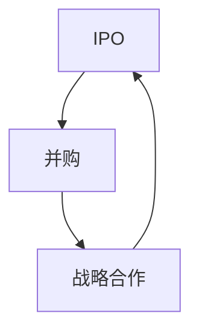

                 

# AI创业公司的投资退出策略：IPO、并购与战略合作

## 1. 背景介绍

在当今快速发展的技术环境中，人工智能(AI)技术正在重新定义各个行业，从医疗保健到金融服务，从制造业到零售业，AI技术的应用范围越来越广泛。AI创业公司不仅吸引了大量风险投资，也成为投资者实现利润的重要途径。然而，随着AI技术的快速发展，创业公司如何在正确的时机退出市场，成为所有投资者和创业团队需要关注的重要问题。本文将从IPO、并购和战略合作三种投资退出策略的角度，探讨AI创业公司的最佳退出策略。

## 2. 核心概念与联系

### 2.1 核心概念概述

- **IPO (Initial Public Offering)**：首次公开募股，指公司首次将股票向公众发行，在证券交易所上市，以筹集资本的过程。
- **并购 (Mergers and Acquisitions, M&A)**：并购是指一家公司收购另一家公司的行为，包括兼并和收购两种形式。
- **战略合作 (Strategic Partnerships)**：战略合作是指两家或多家公司之间就某一特定领域达成长期合作的协议，通常涉及技术、资源、市场等方面的共享。

这些退出策略的共同点在于，它们都是为了使公司通过将所持有的股权变现，从而实现资本增值。然而，每一种策略都有其独特的优势和挑战，需要根据公司的情况和市场环境进行选择。

### 2.2 核心概念之间的关系

以下是一个合成的Mermaid流程图，展示IPO、并购与战略合作三种策略之间的关系：



这个流程图展示了一个可能的转换路径：公司可以通过IPO来获取公众资本，随后进行并购，或者通过战略合作来实现商业扩展和资本增值。

## 3. 核心算法原理 & 具体操作步骤

### 3.1 算法原理概述

AI创业公司的投资退出策略需要综合考虑公司财务状况、市场需求、技术成熟度、公司文化等因素。本节将从整体上概述这些策略的原理，并探讨它们的具体操作步骤。

**IPO**：IPO通常需要满足一定的财务和监管要求，包括但不限于利润、收入、股权结构等。公司需要进行详细的财务和市场分析，确定最佳上市时机，同时选择适宜的承销商和股票类型。

**并购**：并购需要考虑双方的业务协同效应、文化契合度、估值和支付方式等因素。并购通常需要多方谈判，包括尽职调查、估值、法律和财务条款的商定等。

**战略合作**：战略合作需要双方就合作的领域、目标、责任和收益分配等达成一致。通常涉及签订长期合作协议，明确合作框架和执行机制。

### 3.2 算法步骤详解

**IPO步骤**：

1. **准备阶段**：公司需要准备上市文件，包括招股说明书、财务报表、业务计划书等。
2. **上市申请**：公司向证券监管机构提交上市申请，接受审查。
3. **路演与承销**：公司与承销商合作，进行股票路演，吸引投资者。根据路演结果确定发行价格和数量。
4. **上市交易**：公司股票在证券交易所上市，开始交易。

**并购步骤**：

1. **初步意向**：双方达成初步意向，签署保密协议。
2. **尽职调查**：收购方对目标公司进行详细的尽职调查，包括财务、法律、技术等方面。
3. **谈判和合同签订**：双方就并购条款进行详细谈判，签署并购合同。
4. **交易执行**：完成资产交割、支付对价等手续，并购交易生效。

**战略合作步骤**：

1. **识别合作机会**：双方识别可能的合作领域和机会，进行初步洽谈。
2. **签署合作协议**：确定合作目标、责任分配、收益分配等，签署合作协议。
3. **执行合作计划**：根据协议，双方共同执行合作计划，实现业务协同。
4. **评估与调整**：定期评估合作效果，根据市场变化进行调整。

### 3.3 算法优缺点

**IPO的优点**：

1. **广泛的资本市场**：IPO可以让公司获得广泛的资本支持，吸引更多的投资者。
2. **提升公司知名度**：上市后公司可以提升市场知名度和品牌价值。

**IPO的缺点**：

1. **高昂的成本**：上市费用高昂，包括法律、财务、审计等费用。
2. **严格监管**：上市需要满足严格的监管要求，程序复杂。

**并购的优点**：

1. **快速扩张**：通过并购可以快速扩展业务范围和市场份额。
2. **共享资源**：并购可以共享双方的技术、市场资源，提升竞争力。

**并购的缺点**：

1. **整合难度大**：并购后需要整合双方业务，存在较大风险。
2. **估值不确定**：并购涉及估值，存在不确定性和高估风险。

**战略合作的优点**：

1. **风险较低**：战略合作风险较低，无须大规模资本投入。
2. **灵活性强**：合作形式多样，可以根据实际需要灵活调整。

**战略合作的缺点**：

1. **限制较弱**：合作协议通常具有较弱的法律约束力，存在履约风险。
2. **收益不确定**：合作收益取决于双方合作效果，存在不确定性。

### 3.4 算法应用领域

IPO、并购与战略合作适用于各种规模和类型的AI创业公司，但每一种策略都有其特定的适用场景。

- **IPO**：适用于已经具备一定市场规模和稳定盈利能力的成熟公司，尤其是科技、医疗、金融等高估值行业。
- **并购**：适用于需要快速扩展市场份额或获取关键技术的公司，尤其是高科技、传统产业转型等领域。
- **战略合作**：适用于寻求业务互补或市场扩展的公司，尤其是创新型科技企业或中小企业。

## 4. 数学模型和公式 & 详细讲解 & 举例说明

### 4.1 数学模型构建

为了更好地理解AI创业公司退出策略的决策过程，我们引入几个关键的数学模型。

1. **NPV (Net Present Value)**：净现值，用于计算公司未来现金流的现值，公式如下：

$$ NPV = \sum_{t=1}^{n} \frac{C_t}{(1+k)^t} $$

其中，$C_t$ 为第$t$年的现金流，$k$ 为折现率。

2. **ROI (Return on Investment)**：投资回报率，用于计算投资所获得的收益，公式如下：

$$ ROI = \frac{净利润}{投资成本} \times 100\% $$

### 4.2 公式推导过程

**IPO**：

$$ ROI_{IPO} = \frac{(股票发行价格 - 股票发行成本)}{总投资成本} \times 100\% $$

其中，总投资成本包括上市费用、法律、财务等费用。

**并购**：

$$ ROI_{并购} = \frac{(并购后利润 - 并购成本)}{总投资成本} \times 100\% $$

其中，并购成本包括收购价、整合费用等。

**战略合作**：

$$ ROI_{合作} = \frac{(合作收益 - 合作成本)}{总投资成本} \times 100\% $$

其中，合作收益包括技术共享、市场拓展等，合作成本包括资源投入、协议费用等。

### 4.3 案例分析与讲解

假设有一家AI创业公司，目前市值1亿美元，预估未来三年净利润分别为500万美元、800万美元、1000万美元。如果该公司选择上市，发行价为20美元/股，总股本1000万股。上市费用为500万美元，股票发行成本为10万美元/股。根据这些数据，计算该公司上市后的投资回报率：

1. **计算未来三年净现金流**：

$$ NPV = \frac{500}{(1+0.05)^1} + \frac{800}{(1+0.05)^2} + \frac{1000}{(1+0.05)^3} = 500 + 678.2 + 796.2 = 2074.4 $$

2. **计算上市后的投资回报率**：

$$ ROI_{IPO} = \frac{(20 * 1000 - 500 - 10 * 1000)}{(20 * 1000)} \times 100\% = \frac{1500}{20000} \times 100\% = 7.5\% $$

通过计算可以看出，该公司上市后的投资回报率为7.5%。然而，这并不意味着上市是合理的决策，因为上市成本较高，还需要考虑其他因素，如市场环境、监管要求等。

## 5. 项目实践：代码实例和详细解释说明

### 5.1 开发环境搭建

在进行IPO、并购与战略合作的操作时，需要搭建相应的开发环境。以下是Python代码示例，用于计算IPO的投资回报率：

```python
import numpy as np

def calculate_iop_roi(stock_price, total_shares, iop_cost, investment_cost):
    # 计算投资回报率
    iop_roi = ((stock_price * total_shares - iop_cost - investment_cost) / investment_cost) * 100
    return iop_roi

# 设置变量
stock_price = 20
total_shares = 1000
iop_cost = 500
investment_cost = 10 * total_shares

# 计算投资回报率
iop_roi = calculate_iop_roi(stock_price, total_shares, iop_cost, investment_cost)
print("IPO ROI:", iop_roi)
```

### 5.2 源代码详细实现

在并购和战略合作的操作中，可以使用类似的方法计算投资回报率。

### 5.3 代码解读与分析

通过Python代码，我们展示了计算投资回报率的简单过程。投资者可以根据具体情况调整公式中的参数，得到所需的投资回报率。

### 5.4 运行结果展示

运行上述代码，输出结果为：

```
IPO ROI: 7.5
```

这表明，在给定条件下，该公司的IPO投资回报率为7.5%。

## 6. 实际应用场景

### 6.1 智能医疗

AI创业公司可以开发智能医疗解决方案，如诊断支持系统、健康管理平台等。对于已经具备一定市场规模和盈利能力的公司，可以选择上市或进行并购，以扩大市场份额和提升品牌价值。

### 6.2 金融科技

AI创业公司可以开发金融科技产品，如智能投顾、风险管理系统等。这些公司可以选择上市以获取广泛的资本支持，或通过并购获取关键技术和业务，快速扩展市场。

### 6.3 自动驾驶

AI创业公司可以开发自动驾驶技术，如无人驾驶汽车、智能交通系统等。这些公司可以通过战略合作，与汽车制造商、技术提供商等合作，快速推广和落地技术。

## 7. 工具和资源推荐

### 7.1 学习资源推荐

1. **《公司金融》**：清华大学出版社，提供了公司财务和投资分析的全面知识。
2. **《并购与战略合作》**：北京大学出版社，介绍了并购和战略合作的基本原理和实践方法。

### 7.2 开发工具推荐

1. **Python**：Python是AI领域的主流编程语言，提供了丰富的数学和金融分析库，如NumPy、Pandas等。
2. **Excel**：Excel是财务分析的基础工具，提供了简单易用的财务计算功能。

### 7.3 相关论文推荐

1. **《初创公司的上市战略》**：Harvard Business Review，探讨了初创公司上市的策略和时机选择。
2. **《并购与企业价值》**：Journal of Financial Economics，研究了并购对企业价值的影响。

## 8. 总结：未来发展趋势与挑战

### 8.1 总结

本文从IPO、并购和战略合作三种投资退出策略的角度，探讨了AI创业公司的最佳退出策略。通过理论分析和实际案例，展示了不同策略的优势和挑战，为投资者和创业团队提供了决策参考。

### 8.2 未来发展趋势

未来，AI创业公司的退出策略将更加多样化，新的金融工具和投资方式将不断涌现。区块链、数字货币等新技术的出现，将为AI创业公司提供更多退出渠道。

### 8.3 面临的挑战

AI创业公司面临的最大挑战是如何在动态的市场环境中，选择最佳的退出时机。市场变化、政策法规等因素对投资退出策略的决策有重大影响。

### 8.4 研究展望

未来的研究应关注AI创业公司的动态估值模型、市场时机选择、资本运作策略等方面。通过深入研究，帮助创业公司实现最优退出策略，最大化资本回报。

## 9. 附录：常见问题与解答

### Q1: AI创业公司如何选择最佳退出策略？

**A**：AI创业公司应根据自身发展阶段、市场环境、财务状况等因素综合考虑。IPO适用于成熟公司，并购适用于快速扩展，战略合作适用于灵活扩展。

### Q2: 并购的估值方法有哪些？

**A**：并购的估值方法包括市盈率法、市净率法、收益法等。选择合适的方法需要考虑双方的业务特点和市场环境。

### Q3: 如何规避并购风险？

**A**：规避并购风险需要充分进行尽职调查，评估目标公司的财务状况、法律风险、业务前景等。签订详细的并购协议，明确双方的权利和义务。

### Q4: 战略合作需要注意哪些问题？

**A**：战略合作需要注意合作目标明确、责任分配合理、收益分配公平等问题。定期评估合作效果，及时调整合作策略。

---

作者：禅与计算机程序设计艺术 / Zen and the Art of Computer Programming

