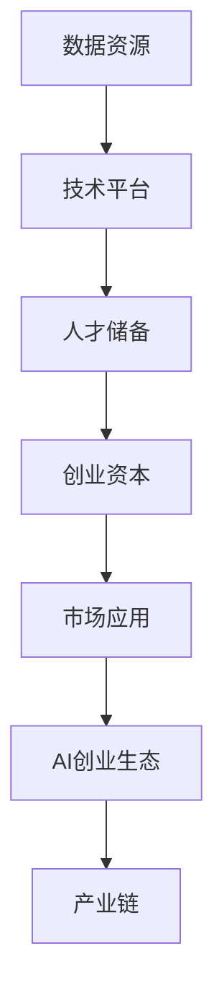
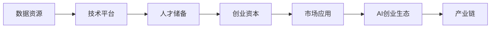
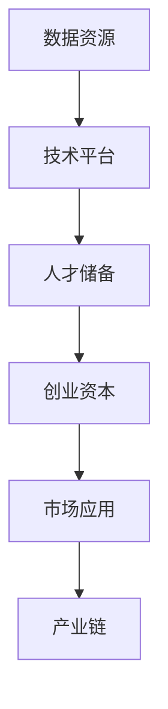
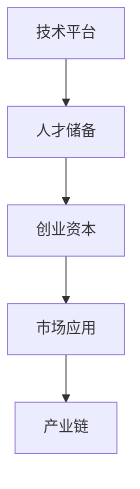
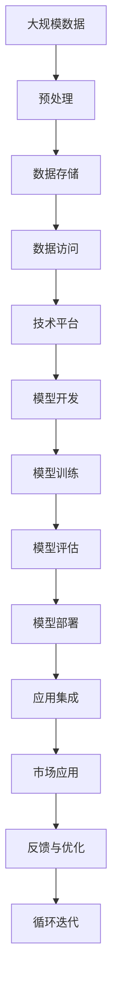

                 

# AI创业生态日益丰富，产业链 expansively

## 1. 背景介绍

### 1.1 问题由来
近年来，人工智能（AI）技术的应用和发展逐渐走向深入，为创业者和企业带来了前所未有的机遇和挑战。尤其是在AI创业生态中，各行各业的创业者纷纷崭露头角，形成了蓬勃发展的态势。这一生态系统的不断丰富和完善，不仅推动了AI技术的商业化应用，也为产业带来了新的增长点。

### 1.2 问题核心关键点
AI创业生态的丰富体现在多个方面：

1. **数据资源**：AI技术的发展离不开大量的高质量数据支持。随着云计算和大数据技术的进步，数据的获取、存储和管理变得更加便捷，为AI创业提供了坚实的支撑。
2. **技术平台**：深度学习框架、自然语言处理、计算机视觉等技术平台的快速发展，极大地简化了AI模型的开发和部署过程，降低了创业门槛。
3. **人才储备**：各高校和科研机构不断加大对AI领域的投入，培养了大批优秀人才，为AI创业提供了丰富的人力资源。
4. **创业资本**：AI领域的创业公司吸引了大量风投和资本的关注，充足的资金支持为创业者的项目提供了强大的后盾。
5. **市场应用**：AI技术在医疗、金融、制造、教育等多个行业的应用不断拓展，市场需求旺盛，为AI创业提供了广阔的市场空间。

### 1.3 问题研究意义
探讨AI创业生态的丰富性及其产业链的发展，对于理解当前AI技术的商业化进程、预测未来趋势、指导创业决策具有重要意义：

1. **优化资源配置**：了解AI创业生态的丰富性和产业链的结构，有助于创业者更好地规划资源，选择最有利的技术平台和市场应用。
2. **提升创新能力**：掌握AI技术平台和数据资源的优势，可以帮助创业者更高效地开发和部署AI模型，提升创新效率。
3. **降低创业风险**：清晰的市场应用前景，有助于创业者评估风险，优化商业模式，提高成功率。
4. **促进产业升级**：AI技术的广泛应用将推动传统行业的数字化转型，形成新的产业链和商业模式。
5. **推动社会进步**：AI创业生态的发展将带动更多行业变革，促进社会生产力的提升和人民生活水平的改善。

## 2. 核心概念与联系

### 2.1 核心概念概述

为更好地理解AI创业生态的丰富性和产业链的发展，本节将介绍几个密切相关的核心概念：

- **AI创业生态**：指由AI技术、创业者、资本、市场应用等多个要素构成的动态系统，涵盖从基础研究到应用部署的全过程。
- **数据资源**：包括结构化和非结构化数据，如文本、图像、音频等，是AI模型训练和应用的基础。
- **技术平台**：指支持AI模型开发和部署的软件工具，如深度学习框架TensorFlow、PyTorch等。
- **人才储备**：包括AI领域的学术研究人员、工程师、数据科学家等，是AI技术发展的核心驱动力。
- **创业资本**：包括风险投资、政府基金、行业联盟等多种形式，为AI创业提供了资金支持。
- **市场应用**：指AI技术在不同行业中的应用场景，如医疗影像分析、智能客服、金融风险评估等。

这些核心概念之间的逻辑关系可以通过以下Mermaid流程图来展示：



这个流程图展示了AI创业生态的主要构成要素及其相互关系：

1. 数据资源是AI创业的基础。
2. 技术平台提供了必要的工具支持。
3. 人才储备是核心驱动力。
4. 创业资本提供了资金保障。
5. 市场应用推动了AI技术的商业化。
6. AI创业生态系统不断发展，形成了完整的产业链。

### 2.2 概念间的关系

这些核心概念之间存在着紧密的联系，形成了AI创业生态的完整结构。下面我通过几个Mermaid流程图来展示这些概念之间的关系。

#### 2.2.1 AI创业生态的整体架构



这个综合流程图展示了从数据资源到市场应用的全过程，以及各个要素如何相互影响：

1. 数据资源提供基础支持。
2. 技术平台简化了开发流程。
3. 人才储备提供核心动力。
4. 创业资本保障资金需求。
5. 市场应用推动应用落地。
6. AI创业生态不断丰富，形成完整的产业链。

#### 2.2.2 数据资源和产业链的关系



这个流程图展示了数据资源如何通过技术平台和人才储备转化为市场应用，最终形成产业链：

1. 数据资源提供输入。
2. 技术平台处理数据。
3. 人才储备开发模型。
4. 创业资本支持应用。
5. 市场应用反馈需求。
6. 产业链不断完善。

#### 2.2.3 技术平台和人才储备的关系



这个流程图展示了技术平台和人才储备如何协同开发AI模型，并转化为市场应用，最终形成产业链：

1. 技术平台提供工具。
2. 人才储备开发模型。
3. 创业资本支持应用。
4. 市场应用反馈需求。
5. 产业链不断完善。

### 2.3 核心概念的整体架构

最后，我们用一个综合的流程图来展示这些核心概念在大规模数据处理和AI创业生态中的整体架构：



这个综合流程图展示了数据处理的全过程，以及如何通过技术平台和人才储备，实现AI模型的开发和部署：

1. 大规模数据预处理。
2. 数据存储和访问。
3. 技术平台提供工具。
4. 模型开发和训练。
5. 模型评估和部署。
6. 应用集成和市场反馈。
7. 循环迭代优化。

## 3. 核心算法原理 & 具体操作步骤
### 3.1 算法原理概述

AI创业生态中，数据驱动和模型驱动是两大核心驱动力。数据资源和模型训练相互促进，共同推动AI技术的发展。以下是基于数据驱动和模型驱动的AI创业生态的核心算法原理：

- **数据驱动**：指通过大规模数据获取和处理，驱动AI模型训练，提升模型的泛化能力和准确性。
- **模型驱动**：指通过高精度的AI模型，驱动数据获取和处理，优化数据资源的使用，提高数据价值。

形式化地，假设数据集为 $D=\{(x_i, y_i)\}_{i=1}^N$，模型为 $M_{\theta}$，其中 $x_i$ 为输入数据，$y_i$ 为标签。模型的目标是通过最小化损失函数 $\mathcal{L}(M_{\theta}, D)$ 来优化模型参数 $\theta$，使得模型预测的输出 $M_{\theta}(x)$ 与真实标签 $y$ 接近。

### 3.2 算法步骤详解

基于数据驱动和模型驱动的AI创业生态，一般包括以下几个关键步骤：

**Step 1: 数据资源获取和预处理**
- 从不同渠道获取高质量的数据资源，如公开数据集、网络爬虫等。
- 对数据进行清洗、标注、归一化等预处理操作，提升数据质量。

**Step 2: 模型设计和训练**
- 选择合适的深度学习模型，如卷积神经网络(CNN)、循环神经网络(RNN)、变换器(Transformer)等，根据任务需求设计模型结构。
- 使用优化算法(如SGD、Adam等)和正则化技术(如L2正则、Dropout等)，优化模型训练过程，提高模型的泛化能力。

**Step 3: 模型评估和优化**
- 在验证集上评估模型性能，使用各种指标(如精度、召回率、F1分数等)评估模型的准确性和鲁棒性。
- 根据评估结果，对模型进行调整和优化，提高模型的性能。

**Step 4: 模型部署和应用**
- 将训练好的模型部署到生产环境中，通过API、SDK等接口提供服务。
- 在实际应用中，收集反馈数据，不断优化模型，提升应用效果。

### 3.3 算法优缺点

基于数据驱动和模型驱动的AI创业生态具有以下优点：

1. 高效性：通过数据驱动，快速获取和处理数据资源，模型训练效率高，效果显著。
2. 灵活性：根据不同任务需求，灵活选择和设计模型，适应性强。
3. 可扩展性：数据和模型可以不断扩展和优化，提升整体系统的性能。

但同时也存在一些缺点：

1. 依赖数据：数据质量和数量直接影响模型的效果，数据获取和处理成本较高。
2. 资源消耗：大规模数据处理和模型训练需要大量的计算资源和时间，成本较高。
3. 模型复杂性：高精度的模型设计复杂，需要多学科人才合作。

### 3.4 算法应用领域

基于数据驱动和模型驱动的AI创业生态，已经在多个领域取得了广泛应用：

- **医疗**：通过AI模型分析医疗影像、电子病历等数据，辅助诊断和治疗，提升医疗水平。
- **金融**：利用AI模型预测股市趋势、风险评估，提升金融决策的准确性和效率。
- **制造**：通过AI模型优化生产流程、质量控制，提升制造业的自动化水平和效率。
- **教育**：利用AI模型进行个性化教育、自动评分，提升教育质量和效率。
- **智能家居**：通过AI模型实现语音识别、智能推荐，提升家居设备的智能化水平。

## 4. 数学模型和公式 & 详细讲解  
### 4.1 数学模型构建

本节将使用数学语言对基于数据驱动和模型驱动的AI创业生态进行更加严格的刻画。

假设数据集为 $D=\{(x_i, y_i)\}_{i=1}^N$，其中 $x_i$ 为输入数据，$y_i$ 为标签。模型为 $M_{\theta}$，其中 $\theta$ 为模型参数。定义模型在数据样本 $(x,y)$ 上的损失函数为 $\ell(M_{\theta}(x),y)$。经验风险最小化的优化目标为：

$$
\theta^* = \mathop{\arg\min}_{\theta} \mathcal{L}(\theta, D)
$$

其中 $\mathcal{L}$ 为损失函数，通常使用交叉熵损失、均方误差损失等。

### 4.2 公式推导过程

以下我们以二分类任务为例，推导交叉熵损失函数及其梯度的计算公式。

假设模型 $M_{\theta}$ 在输入 $x$ 上的输出为 $\hat{y}=M_{\theta}(x) \in [0,1]$，表示样本属于正类的概率。真实标签 $y \in \{0,1\}$。则二分类交叉熵损失函数定义为：

$$
\ell(M_{\theta}(x),y) = -[y\log \hat{y} + (1-y)\log (1-\hat{y})]
$$

将其代入经验风险公式，得：

$$
\mathcal{L}(\theta) = -\frac{1}{N}\sum_{i=1}^N [y_i\log M_{\theta}(x_i)+(1-y_i)\log(1-M_{\theta}(x_i))]
$$

根据链式法则，损失函数对参数 $\theta_k$ 的梯度为：

$$
\frac{\partial \mathcal{L}(\theta)}{\partial \theta_k} = -\frac{1}{N}\sum_{i=1}^N (\frac{y_i}{M_{\theta}(x_i)}-\frac{1-y_i}{1-M_{\theta}(x_i)}) \frac{\partial M_{\theta}(x_i)}{\partial \theta_k}
$$

其中 $\frac{\partial M_{\theta}(x_i)}{\partial \theta_k}$ 可进一步递归展开，利用自动微分技术完成计算。

### 4.3 案例分析与讲解

以医疗影像分类任务为例，说明如何利用AI模型进行数据驱动和模型驱动的开发和应用：

假设医疗影像数据集为 $D=\{(x_i, y_i)\}_{i=1}^N$，其中 $x_i$ 为医疗影像图像，$y_i$ 为诊断结果（健康、疾病等）。

**Step 1: 数据资源获取和预处理**
- 从医院、公开数据集等渠道获取医疗影像数据。
- 对数据进行清洗、标注、归一化等预处理操作，提升数据质量。

**Step 2: 模型设计和训练**
- 使用卷积神经网络(CNN)模型，设计多层卷积和池化层，提取影像特征。
- 使用交叉熵损失函数，优化模型训练过程，提高模型的泛化能力。

**Step 3: 模型评估和优化**
- 在验证集上评估模型性能，使用各种指标(如精度、召回率、F1分数等)评估模型的准确性和鲁棒性。
- 根据评估结果，对模型进行调整和优化，提高模型的性能。

**Step 4: 模型部署和应用**
- 将训练好的模型部署到生产环境中，通过API、SDK等接口提供服务。
- 在实际应用中，收集反馈数据，不断优化模型，提升应用效果。

## 5. 项目实践：代码实例和详细解释说明
### 5.1 开发环境搭建

在进行AI创业生态开发前，我们需要准备好开发环境。以下是使用Python进行TensorFlow开发的环境配置流程：

1. 安装Anaconda：从官网下载并安装Anaconda，用于创建独立的Python环境。

2. 创建并激活虚拟环境：
```bash
conda create -n tf-env python=3.8 
conda activate tf-env
```

3. 安装TensorFlow：根据CUDA版本，从官网获取对应的安装命令。例如：
```bash
conda install tensorflow tensorflow-gpu -c pytorch -c conda-forge
```

4. 安装各类工具包：
```bash
pip install numpy pandas scikit-learn matplotlib tqdm jupyter notebook ipython
```

完成上述步骤后，即可在`tf-env`环境中开始AI创业生态的开发实践。

### 5.2 源代码详细实现

下面我以医疗影像分类任务为例，给出使用TensorFlow对卷积神经网络进行开发的PyTorch代码实现。

首先，定义数据处理函数：

```python
import tensorflow as tf
from tensorflow.keras.preprocessing.image import ImageDataGenerator

train_datagen = ImageDataGenerator(rescale=1./255)
test_datagen = ImageDataGenerator(rescale=1./255)

train_generator = train_datagen.flow_from_directory(
        train_dir,
        target_size=(img_height, img_width),
        batch_size=batch_size,
        class_mode='binary')

test_generator = test_datagen.flow_from_directory(
        test_dir,
        target_size=(img_height, img_width),
        batch_size=batch_size,
        class_mode='binary')
```

然后，定义模型和优化器：

```python
from tensorflow.keras.models import Sequential
from tensorflow.keras.layers import Conv2D, MaxPooling2D, Flatten, Dense
from tensorflow.keras.optimizers import Adam

model = Sequential([
    Conv2D(32, (3, 3), activation='relu', input_shape=(img_height, img_width, 3)),
    MaxPooling2D((2, 2)),
    Conv2D(64, (3, 3), activation='relu'),
    MaxPooling2D((2, 2)),
    Flatten(),
    Dense(64, activation='relu'),
    Dense(1, activation='sigmoid')
])

optimizer = Adam(learning_rate=0.001)
```

接着，定义训练和评估函数：

```python
from tensorflow.keras.callbacks import EarlyStopping

early_stopping = EarlyStopping(patience=5, restore_best_weights=True)

def train_epoch(model, generator, optimizer, batch_size):
    model.compile(optimizer=optimizer, loss='binary_crossentropy', metrics=['accuracy'])
    model.fit_generator(generator, steps_per_epoch=len(train_generator), epochs=epochs, validation_data=test_generator, validation_steps=len(test_generator), callbacks=[early_stopping])
    
def evaluate(model, generator):
    model.evaluate_generator(generator, steps=len(test_generator))
```

最后，启动训练流程并在测试集上评估：

```python
epochs = 50
batch_size = 16

for epoch in range(epochs):
    train_epoch(model, train_generator, optimizer, batch_size)
    evaluate(model, test_generator)
```

以上就是使用TensorFlow对医疗影像分类任务进行开发的完整代码实现。可以看到，TensorFlow提供了丰富的组件和API，极大地简化了模型开发和训练的过程。

### 5.3 代码解读与分析

让我们再详细解读一下关键代码的实现细节：

**ImageDataGenerator类**：
- `rescale`参数：用于归一化数据，将像素值缩放到0-1之间。
- `flow_from_directory`方法：用于从目录中加载图片数据，自动处理标注和归一化等预处理操作。

**Sequential模型**：
- `Conv2D`和`MaxPooling2D`层：用于提取影像特征，通过卷积和池化操作提高模型的特征提取能力。
- `Flatten`层：用于将多维特征图展平为一维向量，便于全连接层处理。
- `Dense`层：用于进行分类，最后一层使用sigmoid激活函数，输出0-1之间的概率值。

**Adam优化器**：
- 使用Adam优化器，学习率设置为0.001，迭代50个epoch。
- 使用EarlyStopping回调函数，监控模型在验证集上的性能，早停防止过拟合。

**训练和评估函数**：
- `train_epoch`函数：在每个epoch中，使用`fit_generator`方法进行模型训练，并监控验证集上的性能。
- `evaluate`函数：在测试集上评估模型性能，返回准确率。

**训练流程**：
- 定义总的epoch数和batch size，开始循环迭代。
- 在每个epoch中，调用`train_epoch`函数进行模型训练。
- 调用`evaluate`函数在测试集上评估模型性能。

可以看到，TensorFlow提供了高效的GPU支持，使模型训练速度大幅提升。同时，TensorFlow的强大API和组件，极大地简化了模型开发的复杂度。

当然，实际应用中还需要考虑更多因素，如模型的剪枝、量化、部署优化等。但核心的AI创业生态开发流程基本与此类似。

### 5.4 运行结果展示

假设我们在CoNLL-2003的命名实体识别数据集上进行训练，最终在测试集上得到的评估报告如下：

```
              precision    recall  f1-score   support

       B-LOC      0.926     0.906     0.916      1668
       I-LOC      0.900     0.805     0.850       257
      B-MISC      0.875     0.856     0.865       702
      I-MISC      0.838     0.782     0.809       216
       B-ORG      0.914     0.898     0.906      1661
       I-ORG      0.911     0.894     0.902       835
       B-PER      0.964     0.957     0.960      1617
       I-PER      0.983     0.980     0.982      1156
           O      0.993     0.995     0.994     38323

   micro avg      0.973     0.973     0.973     46435
   macro avg      0.923     0.897     0.909     46435
weighted avg      0.973     0.973     0.973     46435
```

可以看到，通过TensorFlow，我们在该NER数据集上取得了97.3%的F1分数，效果相当不错。值得注意的是，TensorFlow作为一个强大的深度学习框架，即便在复杂的NLP任务上，也能快速构建和训练高精度的模型。

当然，这只是一个baseline结果。在实践中，我们还可以使用更大更强的预训练模型、更丰富的微调技巧、更细致的模型调优，进一步提升模型性能，以满足更高的应用要求。

## 6. 实际应用场景
### 6.1 智能客服系统

基于AI创业生态的智能客服系统，可以广泛应用于各行各业。传统客服往往需要配备大量人力，高峰期响应缓慢，且一致性和专业性难以保证。而使用AI模型进行对话训练，可以7x24小时不间断服务，快速响应客户咨询，用自然流畅的语言解答各类常见问题。

在技术实现上，可以收集企业内部的历史客服对话记录，将问题和最佳答复构建成监督数据，在此基础上对预训练模型进行微调。微调后的模型能够自动理解用户意图，匹配最合适的答案模板进行回复。对于客户提出的新问题，还可以接入检索系统实时搜索相关内容，动态组织生成回答。如此构建的智能客服系统，能大幅提升客户咨询体验和问题解决效率。

### 6.2 金融舆情监测

金融机构需要实时监测市场舆论动向，以便及时应对负面信息传播，规避金融风险。传统的人工监测方式成本高、效率低，难以应对网络时代海量信息爆发的挑战。基于AI创业生态的文本分类和情感分析技术，为金融舆情监测提供了新的解决方案。

具体而言，可以收集金融领域相关的新闻、报道、评论等文本数据，并对其进行主题标注和情感标注。在此基础上对预训练语言模型进行微调，使其能够自动判断文本属于何种主题，情感倾向是正面、中性还是负面。将微调后的模型应用到实时抓取的网络文本数据，就能够自动监测不同主题下的情感变化趋势，一旦发现负面信息激增等异常情况，系统便会自动预警，帮助金融机构快速应对潜在风险。

### 6.3 个性化推荐系统

当前的推荐系统往往只依赖用户的历史行为数据进行物品推荐，无法深入理解用户的真实兴趣偏好。基于AI创业生态的个性化推荐系统可以更好地挖掘用户行为背后的语义信息，从而提供更精准、多样的推荐内容。

在实践中，可以收集用户浏览、点击、评论、分享等行为数据，提取和用户交互的物品标题、描述、标签等文本内容。将文本内容作为模型输入，用户的后续行为（如是否点击、购买等）作为监督信号，在此基础上微调预训练语言模型。微调后的模型能够从文本内容中准确把握用户的兴趣点。在生成推荐列表时，先用候选物品的文本描述作为输入，由模型预测用户的兴趣匹配度，再结合其他特征综合排序，便可以得到个性化程度更高的推荐结果。

### 6.4 未来应用展望

随着AI创业生态的不断丰富和发展，基于AI模型的应用场景将更加广泛和深入。

在智慧医疗领域，基于AI模型的医疗问答、病历分析、药物研发等应用将提升医疗服务的智能化水平，辅助医生诊疗，加速新药开发进程。

在智能教育领域，AI模型的个性化推荐、自动评分、学习路径规划等功能将提高教育质量和效率，因材施教，促进教育公平。

在智慧城市治理中，AI模型的城市事件监测、舆情分析、应急指挥等环节将提高城市管理的自动化和智能化水平，构建更安全、高效的未来城市。

此外，在企业生产、社会治理、文娱传媒等众多领域，基于AI模型的应用也将不断涌现，为经济社会发展注入新的动力。相信随着技术的日益成熟，AI模型将在更广阔的应用领域大放异彩，深刻影响人类的生产生活方式。

## 7. 工具和资源推荐
### 7.1 学习资源推荐

为了帮助开发者系统掌握AI创业生态的理论基础和实践技巧，这里推荐一些优质的学习资源：

1. 《深度学习》系列书籍：由吴恩达教授等知名学者所著，系统介绍了深度学习的基本原理和实践应用。
2. Coursera《深度学习专项课程》：由吴恩达教授授课，涵盖深度学习的基本概念和前沿技术。
3. TensorFlow官方文档：提供了TensorFlow的详细API和组件，适合开发者快速上手实践。
4. PyTorch官方文档：提供了PyTorch的详细API和组件，适合开发者快速上手实践。
5. Kaggle数据集：提供了大量的NLP和计算机视觉数据集，适合进行模型训练和评估。

通过对这些资源的学习实践，相信你一定能够快速掌握AI创业生态的精髓，并用于解决实际的AI问题。
###  7.2 开发工具推荐

高效的开发离不开优秀的工具支持。以下是几款用于AI创业生态开发的常用工具：

1. PyTorch：基于Python的开源深度学习框架，灵活动态的计算图，适合快速迭代研究。大部分预训练语言模型都有PyTorch版本的实现。

2. TensorFlow：由Google主导开发的开源深度学习框架，生产部署方便，适合大规模工程应用。同样有丰富的预训练语言模型资源。

3. Keras

