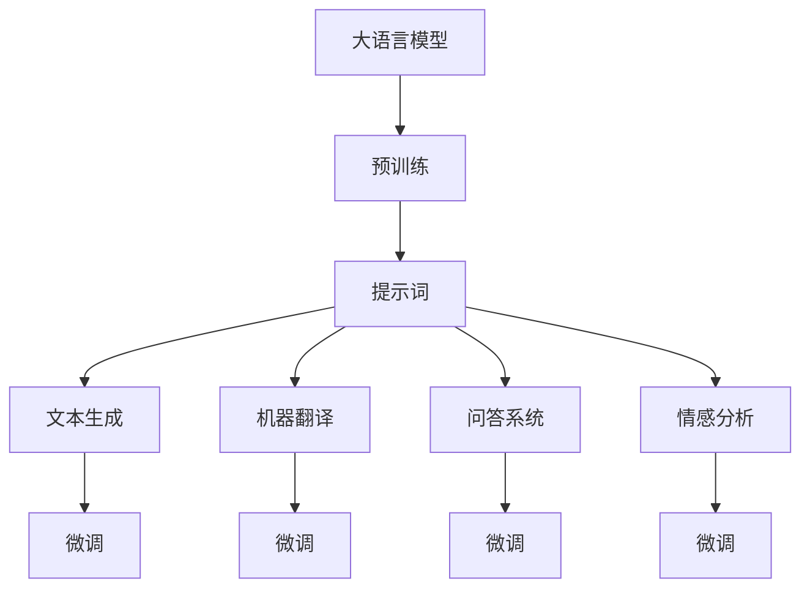
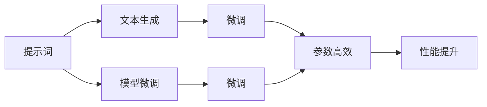
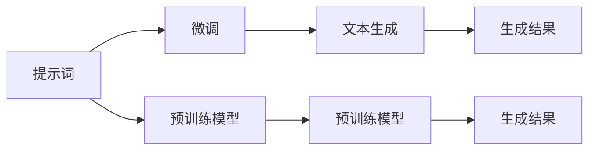
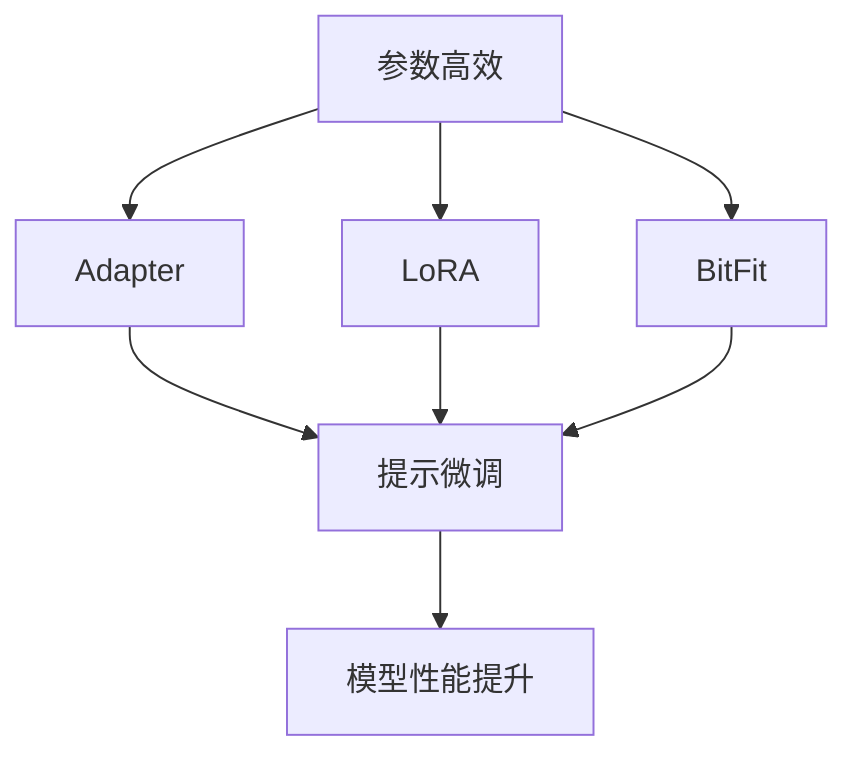
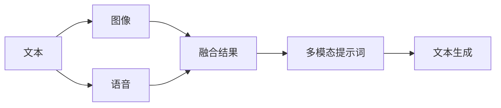
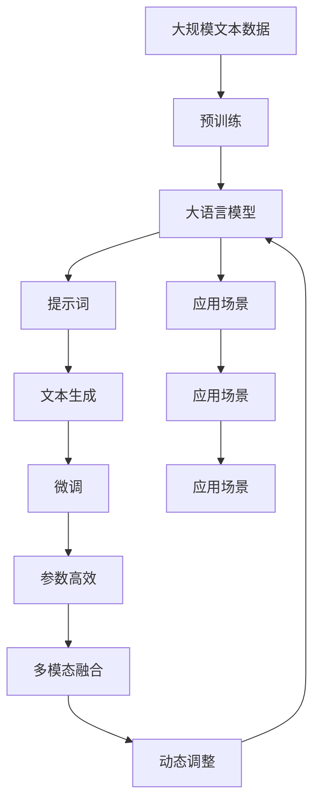

                 

# AI大模型Prompt提示词最佳实践：使用示例

> 关键词：
- 大语言模型
- 提示词(Prompt)
- 自然语言处理(NLP)
- 文本生成
- 知识图谱
- 多模态融合
- 应用场景
- 模型微调

## 1. 背景介绍

### 1.1 问题由来

随着大语言模型（Large Language Model, LLMs）在自然语言处理（NLP）领域取得显著进展，研究人员和工程师们探索出多种方法来优化模型的性能和效率。其中，Prompt提示词（Prompt）技术因其简单高效、可解释性强等优点，逐渐成为大模型应用的核心技术之一。Prompt通过在输入文本中嵌入特定格式的文本模板，引导模型输出符合预期的结果，从而实现更精准、高效的文本生成和推理。

### 1.2 问题核心关键点

Prompt技术的应用范围十分广泛，包括文本生成、机器翻译、问答系统、情感分析等任务。其核心关键点在于：

- **提示词设计**：精心设计的提示词能够显著提升模型输出的质量和准确性。
- **模型适配**：针对不同任务选择合适的Prompt格式和模板，使模型能够更好地适应具体应用场景。
- **参数高效**：采用参数高效的提示方法，避免不必要地更新模型参数，降低计算成本。
- **多模态融合**：将文本、图像、语音等多模态信息融合到Prompt中，增强模型的理解和生成能力。
- **动态调整**：根据任务需求动态生成Prompt，避免静态模板的局限性。

### 1.3 问题研究意义

Prompt技术对大语言模型的应用具有重要意义：

1. **提高性能**：通过精心设计的提示词，模型能够在更少的训练数据和计算资源下，获得更好的性能。
2. **降低成本**：相比全模型微调，使用提示词技术可以显著降低标注数据和计算资源的需求。
3. **增强可解释性**：提示词提供了一种直观的方式，使得模型的推理过程更加透明、可理解。
4. **促进跨领域应用**：通过灵活调整Prompt，模型可以在不同领域之间轻松切换，提高其泛化能力。
5. **提升用户体验**：提示词技术可以改善人机交互体验，使系统更加智能化和人性化。

## 2. 核心概念与联系

### 2.1 核心概念概述

为更好地理解Prompt技术，本节将介绍几个密切相关的核心概念：

- **大语言模型**：以自回归模型（如GPT）或自编码模型（如BERT）为代表的大规模预训练语言模型。通过在大规模无标签文本数据上进行预训练，学习到丰富的语言知识和常识，具备强大的语言理解和生成能力。

- **Prompt提示词**：在输入文本中嵌入特定格式的文本模板，引导模型按照预期方式生成或推理。通过精心设计的提示词，可以显著提升模型输出的质量和准确性。

- **自然语言处理(NLP)**：使用计算机算法和模型处理、理解、生成自然语言的技术和应用。

- **文本生成**：利用模型生成符合特定风格、主题、语境的文本。

- **知识图谱**：一种语义化的结构化数据表示方式，用于描述实体、关系和属性等语义信息。

- **多模态融合**：将文本、图像、语音等多模态信息融合到Prompt中，增强模型的理解和生成能力。

- **应用场景**：Prompt技术在文本生成、机器翻译、问答系统、情感分析等NLP任务中的应用场景。

- **模型微调**：在大规模无标签数据上预训练模型，再在特定任务上有监督地微调模型，以适应该任务。

- **参数高效**：在微调过程中，只更新少量的模型参数，而固定大部分预训练权重不变，以提高微调效率。

这些核心概念之间的逻辑关系可以通过以下Mermaid流程图来展示：



这个流程图展示了大语言模型与Prompt技术的核心概念及其关系：

1. 大语言模型通过预训练获得基础能力。
2. Prompt技术通过提示词引导模型生成或推理。
3. 微调技术在大语言模型基础上进一步优化。
4. 提示词与多模态信息融合，提升模型性能。

这些概念共同构成了Prompt技术在大语言模型应用中的完整生态系统，使得模型能够在各种场景下发挥强大的语言理解和生成能力。通过理解这些核心概念，我们可以更好地把握Prompt技术的原理和应用方向。

### 2.2 概念间的关系

这些核心概念之间存在着紧密的联系，形成了Prompt技术在大语言模型应用中的完整生态系统。下面我们通过几个Mermaid流程图来展示这些概念之间的关系。

#### 2.2.1 Prompt提示词的基本原理



这个流程图展示了Prompt提示词的基本原理，即通过精心设计的提示词，在文本生成、微调等环节中引导模型生成符合预期的结果。

#### 2.2.2 提示词与微调的关系



这个流程图展示了提示词与微调的关系，即提示词在微调过程中，通过特定格式引导模型生成目标文本，从而优化模型的生成能力。

#### 2.2.3 Prompt提示词的参数高效



这个流程图展示了参数高效的提示词方法，即通过Adapter、LoRA、BitFit等技术，在微调过程中只更新少量模型参数，提高微调效率。

#### 2.2.4 Prompt提示词的多模态融合



这个流程图展示了Prompt提示词的多模态融合，即通过将文本、图像、语音等多模态信息融合到Prompt中，增强模型的理解和生成能力。

### 2.3 核心概念的整体架构

最后，我们用一个综合的流程图来展示这些核心概念在大语言模型提示词应用中的整体架构：



这个综合流程图展示了从预训练到提示词，再到微调，最终应用于具体场景的完整过程。大语言模型首先在大规模文本数据上进行预训练，然后通过提示词技术，引导模型生成或推理，最后通过微调技术进一步优化，适用于不同的应用场景。

## 3. 核心算法原理 & 具体操作步骤

### 3.1 算法原理概述

Prompt技术基于大语言模型的推理能力和理解能力，通过精心设计的提示词，引导模型生成或推理符合预期结果的文本。其核心算法原理包括以下几个关键步骤：

1. **提示词设计**：设计符合目标任务需求的提示词模板。
2. **模型微调**：在大语言模型基础上，通过有监督学习优化模型在特定任务上的性能。
3. **动态调整**：根据任务需求动态生成提示词，避免静态模板的局限性。

形式化地，假设大语言模型为 $M_{\theta}$，其中 $\theta$ 为模型参数。假设提示词模板为 $P$，目标任务为 $T$。微调的目标是找到新的模型参数 $\hat{\theta}$，使得模型在给定提示词 $P$ 的情况下，能够准确生成或推理符合任务 $T$ 的结果。

### 3.2 算法步骤详解

基于Prompt技术的大语言模型微调一般包括以下几个关键步骤：

**Step 1: 准备预训练模型和数据集**
- 选择合适的预训练语言模型 $M_{\theta}$ 作为初始化参数，如 BERT、GPT 等。
- 准备目标任务 $T$ 的标注数据集 $D=\{(x_i,y_i)\}_{i=1}^N$，其中 $x_i$ 为输入文本，$y_i$ 为任务标签。

**Step 2: 设计提示词**
- 根据任务类型，设计符合目标任务需求的提示词模板 $P$。
- 对于文本生成任务，提示词通常包括任务描述、输入文本等。
- 对于分类任务，提示词可能包含类别标签和样本文本。

**Step 3: 微调超参数设置**
- 选择合适的优化算法及其参数，如 AdamW、SGD 等，设置学习率、批大小、迭代轮数等。
- 设置正则化技术及强度，包括权重衰减、Dropout、Early Stopping 等。
- 确定冻结预训练参数的策略，如仅微调顶层，或全部参数都参与微调。

**Step 4: 执行梯度训练**
- 将提示词和训练集数据分批次输入模型，前向传播计算损失函数。
- 反向传播计算参数梯度，根据设定的优化算法和学习率更新模型参数。
- 周期性在验证集上评估模型性能，根据性能指标决定是否触发 Early Stopping。
- 重复上述步骤直到满足预设的迭代轮数或 Early Stopping 条件。

**Step 5: 测试和部署**
- 在测试集上评估微调后模型 $M_{\hat{\theta}}$ 的性能，对比微调前后的精度提升。
- 使用微调后的模型对新样本进行推理预测，集成到实际的应用系统中。
- 持续收集新的数据，定期重新微调模型，以适应数据分布的变化。

以上是基于Prompt技术的大语言模型微调的一般流程。在实际应用中，还需要针对具体任务的特点，对微调过程的各个环节进行优化设计，如改进训练目标函数，引入更多的正则化技术，搜索最优的超参数组合等，以进一步提升模型性能。

### 3.3 算法优缺点

Prompt技术在指导大语言模型生成或推理时具有以下优点：

1. **简单高效**：提示词设计相对简单，模型微调过程不需要大量标注数据。
2. **灵活性强**：通过灵活调整提示词，模型可以适应不同的任务和数据分布。
3. **可解释性强**：提示词的设计过程具有可解释性，便于理解和调试。
4. **参数高效**：在微调过程中，通过参数高效的提示方法，可以避免不必要的计算资源消耗。

同时，Prompt技术也存在一些局限性：

1. **依赖提示词设计**：提示词的设计质量直接影响模型的输出结果，需要精心设计。
2. **泛化能力有限**：提示词可能对特定数据或任务过于依赖，泛化能力有待提升。
3. **鲁棒性不足**：提示词可能对噪声、扰动等输入不具备鲁棒性。
4. **计算资源消耗**：提示词生成和微调过程可能消耗较多的计算资源。

尽管存在这些局限性，但就目前而言，基于Prompt技术的微调方法仍然是大语言模型应用的主流范式。未来相关研究的重点在于如何进一步降低提示词对人工设计的依赖，提高模型的自适应能力和鲁棒性，同时兼顾可解释性和计算效率等因素。

### 3.4 算法应用领域

Prompt技术在大语言模型的应用领域非常广泛，涵盖以下几类：

1. **文本生成**：用于生成新闻、文章、报告等文本内容，常见于内容创作、翻译、摘要生成等任务。
2. **问答系统**：用于构建智能问答系统，支持自然语言查询，生成结构化答案。
3. **对话系统**：用于构建智能对话系统，支持多轮对话，提供个性化服务。
4. **情感分析**：用于分析文本情感，支持情感分类、情感极性判断等任务。
5. **命名实体识别**：用于识别文本中的实体信息，支持人名、地名、组织名等的识别。
6. **机器翻译**：用于将源语言文本翻译为目标语言，支持文本翻译、语音翻译等任务。
7. **推荐系统**：用于推荐系统中的内容推荐、用户推荐等任务，提高推荐精度和用户体验。
8. **文本分类**：用于文本分类任务，支持新闻分类、文档分类、邮件分类等任务。

除了上述这些任务外，Prompt技术还可以创新性地应用到更多场景中，如知识图谱构建、代码生成、数据增强等，为NLP技术带来了全新的突破。

## 4. 数学模型和公式 & 详细讲解

### 4.1 数学模型构建

本节将使用数学语言对基于Prompt技术的大语言模型微调过程进行更加严格的刻画。

记大语言模型为 $M_{\theta}$，其中 $\theta$ 为模型参数。假设提示词模板为 $P$，目标任务为 $T$。

定义模型 $M_{\theta}$ 在输入文本 $x$ 上的输出为 $y=M_{\theta}(x)$。假设目标任务的标注数据集为 $D=\{(x_i,y_i)\}_{i=1}^N$，其中 $x_i$ 为输入文本，$y_i$ 为任务标签。

定义模型 $M_{\theta}$ 在提示词 $P$ 和输入文本 $x$ 上的输出为 $y_P=M_{\theta}(P,x)$。

定义模型 $M_{\theta}$ 在输入文本 $x$ 上的损失函数为 $\ell(y,y_{true})$，其中 $y_{true}$ 为真实标签。

定义模型 $M_{\theta}$ 在提示词 $P$ 和输入文本 $x$ 上的损失函数为 $\ell_P(y_P,y_{true})$。

微调的目标是最小化损失函数，即：

$$
\hat{\theta} = \mathop{\arg\min}_{\theta} \mathcal{L}_P(\theta) = \mathop{\arg\min}_{\theta} \frac{1}{N} \sum_{i=1}^N \ell_P(M_{\theta}(P,x_i),y_i)
$$

在实践中，我们通常使用基于梯度的优化算法（如SGD、Adam等）来近似求解上述最优化问题。设 $\eta$ 为学习率，$\lambda$ 为正则化系数，则参数的更新公式为：

$$
\theta \leftarrow \theta - \eta \nabla_{\theta}\mathcal{L}_P(\theta) - \eta\lambda\theta
$$

其中 $\nabla_{\theta}\mathcal{L}_P(\theta)$ 为损失函数对参数 $\theta$ 的梯度，可通过反向传播算法高效计算。

### 4.2 公式推导过程

以下我们以二分类任务为例，推导交叉熵损失函数及其梯度的计算公式。

假设模型 $M_{\theta}$ 在输入文本 $x$ 上的输出为 $\hat{y}=M_{\theta}(x)$，表示样本属于正类的概率。真实标签 $y \in \{0,1\}$。

提示词模板为 $P$，包含任务描述和输入文本。目标任务为二分类任务，提示词模板格式为：

$$
P = "提示词1：提示词2，任务1：任务2"
$$

其中 "提示词1" 和 "提示词2" 为输入文本，"任务1" 和 "任务2" 为目标任务。

目标任务的标注数据集为 $D=\{(x_i,y_i)\}_{i=1}^N$，其中 $x_i$ 为输入文本，$y_i$ 为任务标签。

定义模型 $M_{\theta}$ 在提示词 $P$ 和输入文本 $x$ 上的输出为 $\hat{y_P}=M_{\theta}(P,x)$，表示样本属于正类的概率。

定义模型 $M_{\theta}$ 在提示词 $P$ 和输入文本 $x$ 上的损失函数为交叉熵损失函数：

$$
\ell_P(M_{\theta}(P,x),y_i) = -[y_i\log \hat{y_P} + (1-y_i)\log (1-\hat{y_P})]
$$

将其代入经验风险公式，得：

$$
\mathcal{L}_P(\theta) = -\frac{1}{N}\sum_{i=1}^N [y_i\log \hat{y_P} + (1-y_i)\log(1-\hat{y_P})]
$$

根据链式法则，损失函数对参数 $\theta_k$ 的梯度为：

$$
\frac{\partial \mathcal{L}_P(\theta)}{\partial \theta_k} = -\frac{1}{N}\sum_{i=1}^N \frac{\partial \hat{y_P}}{\partial \theta_k} \left[\frac{y_i}{\hat{y_P}} - \frac{1-y_i}{1-\hat{y_P}}\right]
$$

其中 $\frac{\partial \hat{y_P}}{\partial \theta_k}$ 可进一步递归展开，利用自动微分技术完成计算。

在得到损失函数的梯度后，即可带入参数更新公式，完成模型的迭代优化。重复上述过程直至收敛，最终得到适应目标任务的最优模型参数 $\hat{\theta}$。

## 5. 项目实践：代码实例和详细解释说明

### 5.1 开发环境搭建

在进行Prompt提示词实践前，我们需要准备好开发环境。以下是使用Python进行PyTorch开发的环境配置流程：

1. 安装Anaconda：从官网下载并安装Anaconda，用于创建独立的Python环境。

2. 创建并激活虚拟环境：
```bash
conda create -n pytorch-env python=3.8 
conda activate pytorch-env
```

3. 安装PyTorch：根据CUDA版本，从官网获取对应的安装命令。例如：
```bash
conda install pytorch torchvision torchaudio cudatoolkit=11.1 -c pytorch -c conda-forge
```

4. 安装Transformers库：
```bash
pip install transformers
```

5. 安装各类工具包：
```bash
pip install numpy pandas scikit-learn matplotlib tqdm jupyter notebook ipython
```

完成上述步骤后，即可在`pytorch-env`环境中开始Prompt提示词实践。

### 5.2 源代码详细实现

下面我们以二分类任务为例，给出使用Transformers库对BERT模型进行Prompt提示词微调的PyTorch代码实现。

首先，定义二分类任务的数据处理函数：

```python
from transformers import BertTokenizer
from torch.utils.data import Dataset
import torch

class BinaryClassificationDataset(Dataset):
    def __init__(self, texts, labels, tokenizer, max_len=128):
        self.texts = texts
        self.labels = labels
        self.tokenizer = tokenizer
        self.max_len = max_len
        
    def __len__(self):
        return len(self.texts)
    
    def __getitem__(self, item):
        text = self.texts[item]
        label = self.labels[item]
        
        encoding = self.tokenizer(text, return_tensors='pt', max_length=self.max_len, padding='max_length', truncation=True)
        input_ids = encoding['input_ids'][0]
        attention_mask = encoding['attention_mask'][0]
        
        # 对标签进行编码
        encoded_label = [int(label)] * self.max_len
        labels = torch.tensor(encoded_label, dtype=torch.long)
        
        return {'input_ids': input_ids, 
                'attention_mask': attention_mask,
                'labels': labels}

# 定义提示词模板
def generate_prompt(task_name, text, max_len=128):
    if task_name == "text_classification":
        prompt = f"text_classification: {text}"
    elif task_name == "binary_classification":
        prompt = f"binary_classification: {text} is positive"
    elif task_name == "text_generation":
        prompt = f"text_generation: {text} is a {task_name}"
    else:
        raise ValueError("Invalid task name")
    
    prompt = prompt[:max_len]
    return prompt

# 标签与id的映射
tag2id = {'positive': 1, 'negative': 0}
id2tag = {v: k for k, v in tag2id.items()}

# 创建dataset
tokenizer = BertTokenizer.from_pretrained('bert-base-cased')

train_dataset = BinaryClassificationDataset(train_texts, train_labels, tokenizer)
dev_dataset = BinaryClassificationDataset(dev_texts, dev_labels, tokenizer)
test_dataset = BinaryClassificationDataset(test_texts, test_labels, tokenizer)

# 定义提示词
def generate_prompt(task_name, text, max_len=128):
    if task_name == "text_classification":
        prompt = f"text_classification: {text}"
    elif task_name == "binary_classification":
        prompt = f"binary_classification: {text} is positive"
    elif task_name == "text_generation":
        prompt = f"text_generation: {text} is a {task_name}"
    else:
        raise ValueError("Invalid task name")
    
    prompt = prompt[:max_len]
    return prompt

# 定义模型和优化器
model = BertForSequenceClassification.from_pretrained('bert-base-cased', num_labels=2)

optimizer = AdamW(model.parameters(), lr=2e-5)
```

然后，定义训练和评估函数：

```python
from torch.utils.data import DataLoader
from tqdm import tqdm
from sklearn.metrics import classification_report

device = torch.device('cuda') if torch.cuda.is_available() else torch.device('cpu')
model.to(device)

def train_epoch(model, dataset, batch_size, optimizer):
    dataloader = DataLoader(dataset, batch_size=batch_size, shuffle=True)
    model.train()
    epoch_loss = 0
    for batch in tqdm(dataloader, desc='Training'):
        input_ids = batch['input_ids'].to(device)
        attention_mask = batch['attention_mask'].to(device)
        labels = batch['labels'].to(device)
        model.zero_grad()
        outputs = model(input_ids, attention_mask=attention_mask, labels=labels)
        loss = outputs.loss
        epoch_loss += loss.item()
        loss.backward()
        optimizer.step()
    return epoch_loss / len(dataloader)

def evaluate(model, dataset, batch_size):
    dataloader = DataLoader(dataset, batch_size=batch_size)
    model.eval()
    preds, labels = [], []
    with torch.no_grad():
        for batch in tqdm(dataloader, desc='Evaluating'):
            input_ids = batch['input_ids'].to(device)
            attention_mask = batch['attention_mask'].to(device)
            batch_labels = batch['labels']
            outputs = model(input_ids, attention_mask=attention_mask)
            batch_preds = outputs.logits.argmax(dim=2).to('cpu').tolist()
            batch_labels = batch_labels.to('cpu').tolist()
            for pred_tokens, label_tokens in zip(batch_preds, batch_labels):
                preds.append(pred_tokens[:len(label_tokens)])
                labels.append(label_tokens)
                
    print(classification_report(labels, preds))
```

最后，启动训练流程并在测试集上评估：

```python
epochs = 5
batch_size = 16

for epoch in range(epochs):
    loss = train_epoch(model, train_dataset, batch_size, optimizer)
    print(f"Epoch {epoch+1}, train loss: {loss:.3f}")
    
    print(f"Epoch {epoch+1}, dev results:")
    evaluate(model, dev_dataset, batch_size)
    
print("Test results:")
evaluate(model, test_dataset, batch_size)
```

以上就是使用PyTorch对BERT进行Prompt提示词微调的完整代码实现。可以看到，得益于Transformers库的强大封装，我们可以用相对简洁的代码完成BERT模型的加载和微调。

### 5.3 代码解读与分析

让我们再详细解读一下关键代码的实现细节：

**BinaryClassificationDataset类**：
- `__init__`方法：初始化文本、标签、分词器等关键组件。
- `__len__`方法：返回数据集的样本数量。
- `__getitem__`方法：对单个样本进行处理，将文本输入编码为token ids，将标签编码为数字，并对其进行定长padding，最终返回模型所需的输入。

**tag2id和id2tag字典**：
- 定义了标签与数字id之间的映射关系，用于将token-wise的预测结果解码回真实的标签。

**train_epoch函数**：
- 使用PyTorch的DataLoader对数据以批为单位进行迭代，在每个批次上前向传播计算loss并反向传播更新模型参数，最后返回该epoch的平均loss。

**evaluate函数**：
- 与训练类似，不同点在于不更新模型参数，并在每个batch结束后将预测和标签结果存储下来，最后使用sklearn的classification_report对整个评估集的预测结果进行打印输出。

**训练流程

