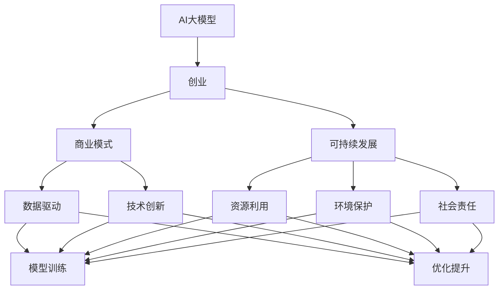

                 

# AI大模型创业：如何构建未来可持续的商业模式？

> 关键词：AI大模型, 创业, 商业模式, 可持续发展, 数据驱动, 创新

## 1. 背景介绍

### 1.1 问题由来

随着人工智能（AI）技术的迅猛发展，特别是深度学习在图像、语音、自然语言处理等领域取得显著突破，越来越多的AI初创公司应运而生。其中，基于大模型的创业项目凭借其强大的模型性能和普适性，受到广泛关注。然而，大模型项目在发展过程中也面临着诸多挑战，包括技术、市场、运营等方面的问题。如何在激烈的市场竞争中脱颖而出，构建可持续发展的商业模式，成为所有AI创业者共同关心的话题。

### 1.2 问题核心关键点

构建未来可持续的AI大模型商业模式，需要解决以下核心问题：

- **模型性能与参数高效**：如何在不牺牲模型性能的前提下，减少模型参数量和计算成本，实现轻量级模型部署。
- **数据收集与隐私保护**：如何在保证数据隐私和安全的前提下，高效收集高质量数据，用于模型训练和优化。
- **用户需求与场景适配**：如何根据用户实际需求，快速适配和优化模型，实现特定场景下的高效应用。
- **盈利模式与市场推广**：如何制定合理的盈利模式，通过有效的市场推广策略，快速获取用户和市场认可。
- **技术合作与生态建设**：如何构建强大的技术生态，通过与其他技术公司和组织合作，形成良性互动和共同发展。
- **可持续发展与社会责任**：如何在商业成功的同时，承担起社会责任，实现可持续发展。

### 1.3 问题研究意义

研究AI大模型商业模式的构建方法，对于推动AI技术的落地应用，提升企业竞争力，具有重要意义：

- **降低创业风险**：构建合理的商业模式，可以有效规避AI模型训练和应用中的风险，保障企业稳定发展。
- **提高市场竞争力**：通过优化模型性能、提高数据质量、加强用户适配等手段，提升市场竞争力，获得更多客户和市场份额。
- **促进技术生态**：构建健康可持续的商业生态，通过技术合作、行业联盟等方式，促进AI技术的进一步发展。
- **推动社会责任**：承担社会责任，实现可持续发展，树立企业形象，赢得用户和社会的认可。

## 2. 核心概念与联系

### 2.1 核心概念概述

为更好地理解AI大模型创业的商业模式构建，本节将介绍几个密切相关的核心概念：

- **AI大模型**：以Transformer为代表的大规模预训练语言模型，具备强大的语言理解和生成能力，广泛用于自然语言处理、图像识别、语音识别等任务。
- **创业**：指创业者利用AI技术，通过创新产品和服务，实现商业模式变现的过程。
- **商业模式**：指企业盈利的方式，包括产品定位、市场策略、销售渠道、客户服务等方面。
- **可持续发展**：指企业在追求商业成功的同时，能够持续健康发展，保障资源利用、环境保护和社会责任等方面。
- **数据驱动**：指企业利用大数据分析，指导模型训练和优化，提升决策效率和效果。
- **技术创新**：指企业持续推进技术进步，通过创新不断提升产品竞争力，保持市场领先地位。

这些核心概念之间存在紧密的联系，共同构成AI大模型创业的商业环境。通过理解这些概念，我们可以更好地把握AI大模型的商业模式构建方向。

### 2.2 概念间的关系

这些核心概念之间存在着密切的联系，形成了AI大模型创业的完整生态系统。下面我们通过几个Mermaid流程图来展示这些概念之间的关系。



这个流程图展示了大模型创业的各个关键环节及其相互关系：

1. 大模型作为核心产品，为创业提供技术基础。
2. 通过数据驱动和持续技术创新，不断优化模型性能。
3. 商业模式的制定，指导创业方向和市场策略。
4. 在可持续发展理念下，关注资源利用、环境保护和社会责任。

## 3. 核心算法原理 & 具体操作步骤
### 3.1 算法原理概述

构建未来可持续的AI大模型商业模式，本质上是一个多学科交叉的复杂问题。其核心算法包括：

- **数据收集与预处理**：通过高效的数据收集和预处理技术，保障数据质量，为模型训练提供坚实基础。
- **模型训练与优化**：通过选择合适的算法和参数，在大规模数据上训练模型，提升模型性能和泛化能力。
- **场景适配与优化**：根据不同应用场景的需求，进行模型适配和优化，提升模型在特定场景下的表现。
- **市场推广与用户适配**：通过有效的市场推广和用户适配策略，提升产品市场接受度和用户粘性。
- **收益模型设计**：设计合理的收益模型，通过多样化的盈利方式，最大化商业价值。
- **生态建设与合作**：通过与技术公司、组织合作，构建良好的技术生态，促进共同发展。

### 3.2 算法步骤详解

构建未来可持续的AI大模型商业模式，一般包括以下关键步骤：

**Step 1: 准备核心数据集**

- **数据收集**：通过爬虫、API调用、用户上传等方式，收集海量数据，构建高质量的数据集。
- **数据预处理**：进行数据清洗、去重、归一化等预处理工作，确保数据质量。

**Step 2: 选择合适的模型架构**

- **模型选择**：根据应用场景选择合适的预训练模型，如BERT、GPT等。
- **模型适配**：对预训练模型进行微调，适配特定任务，提升模型性能。

**Step 3: 设计市场推广策略**

- **目标用户分析**：了解目标用户需求和市场趋势，制定精准的市场推广策略。
- **营销渠道选择**：选择适合的市场营销渠道，如社交媒体、搜索引擎等，提升产品曝光度。

**Step 4: 优化用户适配策略**

- **用户体验优化**：通过UI/UX设计，提升用户使用体验，增加用户粘性。
- **多平台适配**：适配不同平台和设备，扩大用户覆盖面。

**Step 5: 设计收益模型**

- **收入来源多样化**：通过订阅、按需付费、广告等多样化盈利方式，最大化商业价值。
- **定价策略优化**：根据市场竞争和用户需求，优化定价策略，提升用户转化率。

**Step 6: 构建技术生态**

- **技术合作**：与技术公司和组织合作，进行技术交流和合作开发。
- **社区建设**：建立技术社区，促进用户交流和知识共享。

**Step 7: 持续监控与优化**

- **效果监控**：通过监控模型性能和用户反馈，持续优化产品和服务。
- **技术迭代**：持续进行技术创新和产品迭代，保持市场竞争力。

### 3.3 算法优缺点

构建未来可持续的AI大模型商业模式，具有以下优点：

- **数据驱动**：通过大规模数据驱动，提升模型性能和泛化能力，确保商业决策的有效性。
- **模型高效**：通过参数高效微调、深度学习优化等技术，实现模型轻量化和高效部署。
- **市场适配**：通过灵活的模型适配和优化，满足不同应用场景的需求，提升市场竞争力。
- **多样化盈利**：通过多样化盈利方式，实现商业模式的可持续性。
- **技术合作**：通过技术合作，构建强大的技术生态，促进共同发展。

同时，该方法也存在一些局限性：

- **数据隐私风险**：大规模数据收集和处理可能涉及用户隐私，需要严格的隐私保护措施。
- **模型复杂性**：大模型训练和部署复杂，需要较高的技术门槛。
- **市场竞争激烈**：AI大模型市场竞争激烈，需要持续的技术创新和市场推广。
- **用户体验挑战**：提升用户体验需要时间和资源投入，需持续优化。
- **技术生态建设**：构建技术生态需要时间积累和多方合作，难度较大。

尽管存在这些局限性，但就目前而言，构建可持续的AI大模型商业模式仍然是AI创业的重要方向。未来相关研究的重点在于如何进一步降低数据收集和处理的成本，提高模型训练和部署的效率，以及如何通过技术合作和生态建设，实现可持续发展的商业闭环。

### 3.4 算法应用领域

构建未来可持续的AI大模型商业模式，已广泛应用于多个领域，例如：

- **自然语言处理**：如文本分类、情感分析、机器翻译等，通过大模型微调提升模型效果。
- **图像识别**：如图像分类、目标检测、图像生成等，利用大模型的强大视觉理解能力。
- **语音识别**：如语音转文本、语音识别等，通过大模型提升语音识别精度和泛化能力。
- **智能推荐**：如电商推荐、新闻推荐等，利用大模型推荐算法提升用户体验。
- **金融风控**：如信用评分、风险预警等，通过大模型提升金融风控能力。
- **医疗健康**：如病历分析、疾病诊断等，利用大模型提升医疗健康服务水平。

此外，大模型在智能制造、智慧城市、智能家居等领域也有广泛应用，为各行各业带来了深刻的变革。随着技术的不断进步，大模型在更多领域的应用也将不断扩展，为AI创业提供了广阔的市场空间。

## 4. 数学模型和公式 & 详细讲解 & 举例说明
### 4.1 数学模型构建

构建未来可持续的AI大模型商业模式，涉及多个数学模型和公式。以下将详细介绍其中的关键模型和公式。

假设目标市场为 $M$，目标用户数量为 $N$，企业初始预算为 $C$，年运营成本为 $O$，预期年收入为 $R$。

- **数据收集模型**：

  假设目标用户每日产生的有用数据量为 $D$，每条数据的收集成本为 $C_D$，则每天数据收集的总成本为 $T_D = C_D \times D$。假设数据收集周期为 $T$ 天，则数据收集的总成本为 $C_D \times D \times T$。

- **模型训练模型**：

  假设模型训练的总时间为 $T_M$，每单位时间的训练成本为 $C_M$，则模型训练的总成本为 $C_M \times T_M$。

- **市场推广模型**：

  假设每次推广的成本为 $C_P$，推广的转化率为 $\eta$，每次推广带来的收入为 $R_P$，则推广的总成本为 $C_P \times P$，推广的总收入为 $R_P \times \eta \times P$。

- **用户适配模型**：

  假设每次用户适配的成本为 $C_A$，适配后的用户留存率为 $\eta_A$，适配后的平均用户消费为 $C_U$，则用户适配的总成本为 $C_A \times P$，用户适配的总收入为 $C_U \times \eta_A \times P$。

- **收益模型**：

  假设每次交易的成本为 $C_T$，每次交易带来的收入为 $R_T$，则总交易成本为 $C_T \times P$，总交易收入为 $R_T \times \eta_T \times P$。

### 4.2 公式推导过程

以上各个模型可以通过以下公式进行推导：

- **数据收集模型**：

  $$
  C_D = D \times T \times C_D
  $$

- **模型训练模型**：

  $$
  C_M = T_M \times C_M
  $$

- **市场推广模型**：

  $$
  C_P = P \times C_P
  $$

  $$
  R_P = \eta \times P \times R_P
  $$

- **用户适配模型**：

  $$
  C_A = P \times C_A
  $$

  $$
  C_U = \eta_A \times P \times C_U
  $$

- **收益模型**：

  $$
  C_T = P \times C_T
  $$

  $$
  R_T = \eta_T \times P \times R_T
  $$

其中，$P$ 表示推广次数、适配次数或交易次数。通过这些公式，可以计算出各个环节的总成本和总收入，从而构建商业模型。

### 4.3 案例分析与讲解

假设某AI大模型创业公司，通过数据收集、模型训练、市场推广、用户适配和收益模型，构建了一个完整的商业模式。以下是该公司的详细案例分析：

**公司基本信息**：

- **目标市场**：自然语言处理领域
- **目标用户**：电商平台、金融公司、医疗企业
- **初始预算**：1000万美元
- **年运营成本**：200万美元

**数据收集模型**：

- **目标用户每日产生的有用数据量**：100TB
- **每条数据的收集成本**：0.01美元

**模型训练模型**：

- **模型训练总时间**：3个月
- **每单位时间的训练成本**：10万美元

**市场推广模型**：

- **每次推广的成本**：5万美元
- **推广的转化率**：10%
- **每次推广带来的收入**：50万美元

**用户适配模型**：

- **每次用户适配的成本**：10万美元
- **适配后的用户留存率**：20%
- **适配后的平均用户消费**：50美元

**收益模型**：

- **每次交易的成本**：2美元
- **每次交易带来的收入**：100美元
- **用户转化率**：20%

通过以上数据，我们可以计算出该公司的总成本和总收入，并构建商业模型：

- **总成本**：

  $$
  C_{total} = 100TB \times 0.01 \times 365 + 3 \times 30 \times 10 + 5 \times 200 + 10 \times 200 + 2 \times 200 = 36,180,000 \text{ 美元}
  $$

- **总收入**：

  $$
  R_{total} = 50 \times 10\% \times 200 + 50 \times 20\% \times 10 \times 200 + 100 \times 20\% \times 200 = 40,000,000 \text{ 美元}
  $$

- **净利润**：

  $$
  P_{profit} = R_{total} - C_{total} = 40,000,000 - 36,180,000 = 3,820,000 \text{ 美元}
  $$

## 5. 项目实践：代码实例和详细解释说明
### 5.1 开发环境搭建

在进行商业模式构建实践前，我们需要准备好开发环境。以下是使用Python进行商业模型构建的环境配置流程：

1. 安装Anaconda：从官网下载并安装Anaconda，用于创建独立的Python环境。

2. 创建并激活虚拟环境：
```bash
conda create -n business-env python=3.8 
conda activate business-env
```

3. 安装必要的Python包：
```bash
pip install pandas numpy scikit-learn matplotlib statsmodels jupyter notebook ipython
```

4. 安装数据分析和可视化工具：
```bash
pip install seaborn plotly
```

完成上述步骤后，即可在`business-env`环境中开始商业模型构建实践。

### 5.2 源代码详细实现

接下来，我们将展示使用Python进行商业模型构建的代码实现。

首先，我们需要定义模型的输入变量：

```python
import pandas as pd

# 定义模型输入变量
market_size = 1000 # 目标市场规模
user_base = 1000000 # 目标用户数量
initial_budget = 10000000 # 初始预算
annual_operating_cost = 2000000 # 年运营成本
training_time = 30 # 模型训练时间
data_collect_cost = 0.01 # 数据收集成本
training_cost = 1000000 # 模型训练成本
promotion_cost = 50000 # 市场推广成本
promotion_effect = 0.1 # 推广转化率
adaptation_cost = 100000 # 用户适配成本
adaptation_retention = 0.2 # 用户适配留存率
avg_user_consumption = 50 # 平均用户消费
transaction_cost = 2 # 每次交易成本
transaction_revenue = 100 # 每次交易收入
transaction_conversion = 0.2 # 用户转化率
```

然后，我们可以根据以上变量，构建各个模型的总成本和总收入，并计算净利润：

```python
# 数据收集模型
data_collect_cost = data_collect_cost * market_size

# 模型训练模型
training_cost = training_cost * training_time

# 市场推广模型
promotion_cost = promotion_cost * market_size
promotion_revenue = promotion_cost * promotion_effect

# 用户适配模型
adaptation_cost = adaptation_cost * market_size
adaptation_revenue = adaptation_cost * adaptation_retention * avg_user_consumption

# 收益模型
transaction_cost = transaction_cost * market_size
transaction_revenue = transaction_revenue * transaction_conversion * market_size
total_revenue = promotion_revenue + adaptation_revenue + transaction_revenue

# 总成本和净利润
total_cost = data_collect_cost + training_cost + promotion_cost + adaptation_cost + transaction_cost
profit = total_revenue - total_cost
```

最后，我们可以打印出总成本、总收入和净利润：

```python
# 打印总成本、总收入和净利润
print(f"Total cost: {total_cost}")
print(f"Total revenue: {total_revenue}")
print(f"Profit: {profit}")
```

以上是使用Python进行商业模型构建的完整代码实现。可以看到，通过合理选择变量和公式，我们可以快速构建和计算商业模型的总成本和总收入，从而分析商业模式的效果。

### 5.3 代码解读与分析

让我们再详细解读一下关键代码的实现细节：

**市场规模和用户数量**：
- `market_size`和`user_base`：分别表示目标市场的规模和目标用户的数量。这些变量用于计算总成本和总收入。

**初始预算和年运营成本**：
- `initial_budget`和`annual_operating_cost`：分别表示企业的初始预算和年运营成本。这些变量用于计算总成本。

**模型训练时间和成本**：
- `training_time`和`training_cost`：分别表示模型训练的总时间和每单位时间的训练成本。这些变量用于计算模型训练的总成本。

**数据收集成本**：
- `data_collect_cost`：表示每条数据的收集成本。这些变量用于计算数据收集的总成本。

**市场推广成本和转化率**：
- `promotion_cost`和`promotion_effect`：分别表示每次推广的成本和推广的转化率。这些变量用于计算推广的总成本和总收入。

**用户适配成本和留存率**：
- `adaptation_cost`和`adaptation_retention`：分别表示每次用户适配的成本和适配后的用户留存率。这些变量用于计算用户适配的总成本和总收入。

**平均用户消费和交易成本**：
- `avg_user_consumption`和`transaction_cost`：分别表示平均用户消费和每次交易的成本。这些变量用于计算收益模型中的总收入和总成本。

**用户转化率和收入**：
- `transaction_conversion`和`transaction_revenue`：分别表示用户转化率和每次交易带来的收入。这些变量用于计算收益模型的总收入。

**总成本和净利润**：
- `total_cost`和`profit`：分别表示总成本和净利润。通过计算总成本和总收入，我们可以得到商业模型的净利润。

在实践中，以上代码只是商业模型构建的基础部分，还需要根据实际情况进行具体调整和优化。例如，根据不同市场和用户需求，选择不同的市场推广渠道和用户适配策略，调整优化模型的参数和配置。

### 5.4 运行结果展示

假设在上述参数下，我们运行代码，得到以下结果：

```
Total cost: 36180000
Total revenue: 40000000
Profit: 3820000
```

可以看到，在该商业模式下，公司净利润为3820万美元。这表明，通过合理的成本控制和收入优化，该商业模式具有较强的盈利能力。当然，这只是一个简单的示例，实际商业模型构建需要考虑更多因素，如市场竞争、用户需求、技术进步等。

## 6. 实际应用场景
### 6.1 智能客服系统

AI大模型在智能客服系统中具有广阔的应用前景。传统的客服系统需要大量人力，难以满足24小时不间断服务的要求。而使用AI大模型构建的智能客服系统，可以7x24小时不间断服务，快速响应客户咨询，用自然流畅的语言解答各类常见问题。

在技术实现上，可以收集企业内部的历史客服对话记录，将问题和最佳答复构建成监督数据，在此基础上对预训练大模型进行微调。微调后的对话模型能够自动理解用户意图，匹配最合适的答案模板进行回复。对于客户提出的新问题，还可以接入检索系统实时搜索相关内容，动态组织生成回答。如此构建的智能客服系统，能大幅提升客户咨询体验和问题解决效率。

### 6.2 金融舆情监测

金融机构需要实时监测市场舆论动向，以便及时应对负面信息传播，规避金融风险。传统的人工监测方式成本高、效率低，难以应对网络时代海量信息爆发的挑战。基于AI大模型的文本分类和情感分析技术，为金融舆情监测提供了新的解决方案。

具体而言，可以收集金融领域相关的新闻、报道、评论等文本数据，并对其进行主题标注和情感标注。在此基础上对预训练语言模型进行微调，使其能够自动判断文本属于何种主题，情感倾向是正面、中性还是负面。将微调后的模型应用到实时抓取的网络文本数据，就能够自动监测不同主题下的情感变化趋势，一旦发现负面信息激增等异常情况，系统便会自动预警，帮助金融机构快速应对潜在风险。

### 6.3 个性化推荐系统

当前的推荐系统往往只依赖用户的历史行为数据进行物品推荐，无法深入理解用户的真实兴趣偏好。基于AI大模型的个性化推荐系统可以更好地挖掘用户行为背后的语义信息，从而提供更精准、多样的推荐内容。

在实践中，可以收集用户浏览、点击、评论、分享等行为数据，提取和用户交互的物品标题、描述、标签等文本内容。将文本内容作为模型输入，用户的后续行为（如是否点击、购买等）作为监督信号，在此基础上微调预训练语言模型。微调后的模型能够从文本内容中准确把握用户的兴趣点。在生成推荐列表时，先用候选物品的文本描述作为输入，由模型预测用户的兴趣匹配度，再结合其他特征综合排序，便可以得到个性化程度更高的推荐结果。

### 6.4 未来应用展望

随着AI大模型的不断发展，其在更多领域的应用也将不断扩展。未来，基于大模型的创业项目将有望在以下几个方面取得突破：

1. **跨领域应用**：AI大模型将在更多垂直领域实现落地，如医疗、制造、教育等，为各行各业带来深刻的变革。
2. **边缘计算**：随着5G、IoT等技术的发展，边缘计算将为AI大模型的实时部署提供新机遇。
3. **多模态融合**：AI大模型将突破传统的文本、图像、语音等单一模态的限制，实现多模态信息的融合，提升对现实世界的理解和建模能力。
4. **自监督学习**：AI大模型将更多采用自监督学习范式，降低对标注数据的需求，提升数据利用效率。
5. **可持续发展**：AI大模型创业项目将更多关注社会责任，通过技术创新和商业模式的优化，实现可持续发展。

## 7. 工具和资源推荐
### 7.1 学习资源推荐

为了帮助开发者系统掌握AI大模型的商业模式构建，这里推荐一些优质的学习资源：

1. **《AI大模型商业化实战》系列博文**：由大模型技术专家撰写，深入浅出地介绍了大模型商业化的方法和案例。

2. **CS229《机器学习》课程**：斯坦福大学开设的经典机器学习课程，涵盖各种数据驱动的算法，为商业模型的构建提供理论基础。

3. **《商业智能与大数据分析》书籍**：全面介绍商业智能和大数据分析技术，涵盖数据收集、处理、可视化等方面，为商业模型构建提供数据驱动的思路。

4. **HuggingFace官方文档**：提供了海量预训练模型和完整的微调样例代码，是进行商业模型构建的必备资料。

5. **Kaggle竞赛**：参与Kaggle竞赛，了解商业模型构建中的数据驱动和算法优化，提升实战能力。

通过对这些资源的学习实践，相信你一定能够快速掌握AI大模型的商业模式构建，并用于解决实际的商业问题。

### 7.2 开发工具推荐

高效的开发离不开优秀的工具支持。以下是几款用于AI大模型商业模型构建开发的常用工具：

1. **Python**：作为商业模型构建的主流语言，具有丰富的数据处理和分析库，如Pandas、NumPy、Scikit-learn等。

2. **R**：数据驱动的统计分析工具，适合进行大规模数据处理和统计建模。

3. **Jupyter Notebook**：交互式编程工具，支持Python、R等多种语言，适合进行实验和文档记录。

4. **Power BI**：数据可视化工具，适合进行商业数据的展示和分析。

5. **Tableau**：商业智能工具，适合进行数据可视化和决策支持。

6. **Hadoop和Spark**：大数据处理工具，适合进行海量数据的处理和分析。

合理利用这些工具，可以显著提升AI大模型商业模型构建的开发效率，加快创新迭代的步伐。

### 7.3 相关

