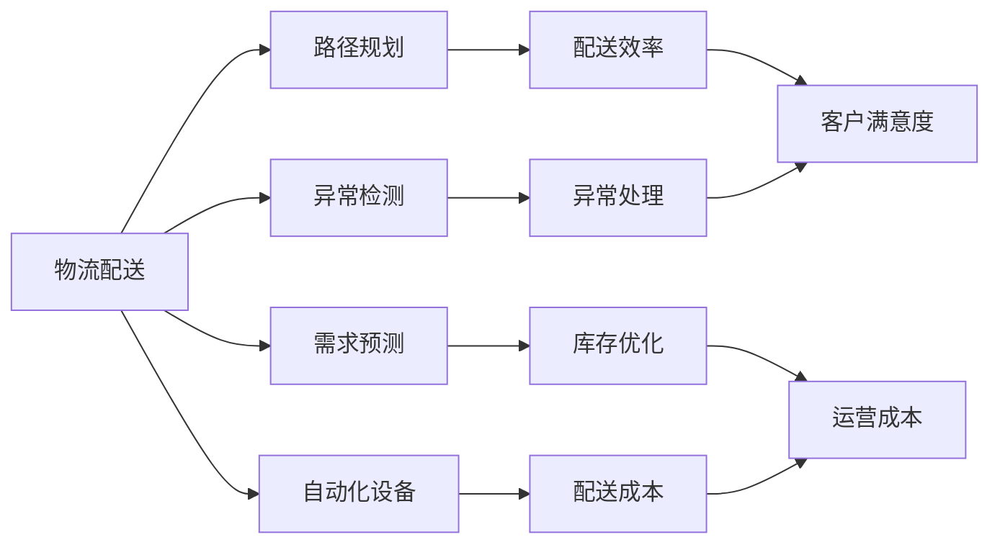

                 

# AI如何帮助电商企业进行高效的物流配送

在数字化转型的浪潮下，电商平台正面临着越来越激烈的竞争。如何高效、准确地完成物流配送，成为电商企业赢得市场竞争的关键。而人工智能(AI)技术，尤其是其在物流配送领域的应用，正逐步成为电商企业提升运营效率、降低成本、提升客户满意度的重要手段。本文将系统阐述AI在电商物流配送中的应用，包括核心概念、算法原理、实施步骤及未来展望。

## 1. 背景介绍

### 1.1 问题由来

随着电商市场的快速发展，物流配送已经成为电商平台的核心竞争环节。配送速度、准确性、安全性直接影响着客户的购物体验，甚至决定了电商平台的生存和发展。传统物流配送方式往往依赖于人工和简单的自动化系统，效率低下，且容易出现错误和延误。而人工智能技术的引入，则能有效提高物流配送的效率和质量，助力电商平台实现智能化运营。

### 1.2 问题核心关键点

- **配送路径优化**：通过AI算法计算最优配送路径，减少配送时间和成本。
- **预测需求**：利用AI技术预测商品需求，指导库存管理和物流调度。
- **异常检测**：通过异常检测算法识别物流过程中的异常情况，及时处理。
- **自动化设备应用**：引入AI辅助的自动化设备和机器人，提高配送效率。
- **客户体验优化**：基于AI的个性化推荐和实时反馈，提升客户满意度。

### 1.3 问题研究意义

- **提升运营效率**：AI技术可以大幅度提高物流配送的效率，减少人力和时间成本。
- **降低运营成本**：优化路径、自动化设备应用等手段，有效降低物流成本。
- **提升客户满意度**：通过精准配送、个性化推荐等手段，提升客户体验和忠诚度。
- **强化市场竞争力**：通过智能化的物流管理，帮助电商平台在激烈竞争中脱颖而出。
- **推动产业升级**：AI在物流领域的应用，将推动整个供应链行业的数字化、智能化转型。

## 2. 核心概念与联系

### 2.1 核心概念概述

- **物流配送**：从电商平台到最终客户的货物运输过程，包括分拣、包装、运输、配送等环节。
- **路径规划**：通过算法计算出最优的配送路径，减少运输时间和成本。
- **需求预测**：利用时间序列、机器学习等技术预测未来商品需求，优化库存和物流调度。
- **异常检测**：通过异常检测算法识别物流过程中的异常情况，及时进行调整。
- **自动化设备**：引入AI辅助的自动化设备和机器人，提高配送效率。
- **客户体验**：通过个性化推荐、实时反馈等手段，提升客户满意度。

### 2.2 概念间的关系

这些核心概念构成了电商物流配送的完整框架，AI技术通过在这些关键环节的深度应用，推动了整个物流配送过程的智能化和自动化。



## 3. 核心算法原理 & 具体操作步骤

### 3.1 算法原理概述

AI在电商物流配送中的应用，主要基于以下几个核心算法：

- **路径规划算法**：如A*算法、Dijkstra算法等，通过计算配送路径的最短距离和时间，优化物流配送。
- **需求预测算法**：如ARIMA、LSTM、GRU等，通过历史数据预测未来需求，指导库存管理和物流调度。
- **异常检测算法**：如One-Class SVM、Isolation Forest等，识别物流过程中的异常情况，确保配送的准确性和及时性。
- **自动化设备控制算法**：如强化学习、控制理论等，实现对自动化设备的高效控制。

### 3.2 算法步骤详解

以下是AI在电商物流配送中常用的具体操作步骤：

1. **数据收集与预处理**：
   - 收集电商平台订单、物流数据、客户反馈等数据，并进行清洗和预处理。
   - 数据清洗：去除重复、异常数据，处理缺失值。
   - 数据预处理：标准化、归一化、特征工程等。

2. **路径规划**：
   - 使用路径规划算法计算配送路径，生成配送路线图。
   - 结合交通状况、天气条件等实时数据，动态调整配送路径。
   - 优化路径，减少配送时间和成本。

3. **需求预测**：
   - 使用时间序列分析、机器学习模型等预测未来商品需求。
   - 根据预测结果，调整库存和物流调度策略。
   - 优化库存管理，减少库存积压和缺货。

4. **异常检测**：
   - 使用异常检测算法识别物流过程中的异常情况。
   - 实时监控物流状态，及时发现并处理异常。
   - 提升配送的准确性和及时性，减少客户投诉。

5. **自动化设备应用**：
   - 引入AI辅助的自动化设备和机器人，提升配送效率。
   - 利用强化学习、控制理论等算法，优化设备操作和路径规划。
   - 实现自动化分拣、包装、运输等环节，减少人工干预。

6. **客户体验优化**：
   - 基于AI的个性化推荐系统，提升客户购买体验。
   - 实时反馈和互动，提升客户满意度。
   - 收集客户反馈，持续改进服务质量。

### 3.3 算法优缺点

AI在电商物流配送中的应用，具有以下优点：

- **效率提升**：通过优化路径、自动化设备等手段，大幅度提高配送效率。
- **成本降低**：优化物流路径、减少人力和时间成本，降低运营成本。
- **精准度提高**：利用AI进行需求预测和异常检测，提高配送准确性和及时性。
- **用户体验改善**：通过个性化推荐和实时反馈，提升客户满意度和忠诚度。

但同时，也存在一些缺点：

- **技术复杂度高**：AI技术的应用需要专业的技术团队和大量的前期投入。
- **数据需求量大**：需要收集和处理大量的物流、订单和客户数据，数据质量要求高。
- **系统集成难度大**：AI系统和现有物流系统集成难度大，需要多部门协作。
- **成本投入高**：自动化设备和AI系统的初期投入较高。

### 3.4 算法应用领域

AI在电商物流配送中的应用，主要集中在以下几个领域：

- **配送路径规划**：适用于大型电商企业的物流配送。
- **需求预测**：适用于库存管理、物流调度和配送优化。
- **异常检测**：适用于物流配送的实时监控和异常处理。
- **自动化设备应用**：适用于自动化分拣、包装、运输等环节。
- **客户体验优化**：适用于个性化推荐、实时反馈等环节。

## 4. 数学模型和公式 & 详细讲解 & 举例说明

### 4.1 数学模型构建

假设电商平台在配送节点 $N$ 上分发 $M$ 个包裹，节点间的距离矩阵为 $D$，路径规划的目标是最小化总配送时间和成本，数学模型可以表示为：

$$
\min_{x} \sum_{i=1}^{N-1} \sum_{j=i+1}^{N} x_{ij}D_{ij} + \lambda\sum_{i=1}^{N} c_i x_{iN}
$$

其中 $x_{ij}$ 表示包裹从节点 $i$ 到节点 $j$ 的运输量，$c_i$ 表示节点 $i$ 的固定成本，$\lambda$ 为成本系数。

### 4.2 公式推导过程

利用Dijkstra算法求解路径规划问题，首先计算起点到各个节点的最短路径距离 $d_i$，然后利用 $d_i$ 计算最小生成树 $T$。具体推导过程如下：

1. 初始化：$d_i=+\infty, \forall i \neq s$，$d_s=0$，$x_{ij}=0, \forall i,j$
2. 选择距离最短节点：$s \rightarrow v_1 \rightarrow v_2 \rightarrow \dots \rightarrow v_{N-1} \rightarrow N$
3. 计算路径成本：$\sum_{i=1}^{N-1} D_{ij} + \lambda c_i$
4. 优化路径：$x_{ij}=\begin{cases} 1, & \text{if } i \rightarrow j \text{ is chosen} \\ 0, & \text{otherwise} \end{cases}$

### 4.3 案例分析与讲解

假设某电商平台的配送节点有5个，配送需求如下：

| 节点编号 | 包裹数量 | 节点距离 | 节点成本 |
| --- | --- | --- | --- |
| 1 | 100 | 10,10,20,30,50 | 10,20,30,40,50 |
| 2 | 80 | 20,10,15,30,40 | 20,15,10,25,35 |
| 3 | 120 | 30,15,20,10,15 | 15,10,5,20,25 |
| 4 | 90 | 40,20,15,10,5 | 10,20,30,25,40 |
| 5 | 60 | 50,40,25,20,10 | 25,20,35,30,15 |

根据上述需求，使用Dijkstra算法计算最优路径，具体步骤如下：

1. 初始化 $d_1=0$, $d_2=10$, $d_3=20$, $d_4=30$, $d_5=50$。
2. 选择节点1，更新$d_3=15$, $d_4=30$, $d_5=50$。
3. 选择节点2，更新$d_3=10$, $d_5=15$。
4. 选择节点3，更新$d_5=20$。
5. 选择节点4，更新$d_5=10$。
6. 选择节点5，结束。

得到的最优路径为：1-2-3-5-4，总成本为 $10+15+20+15+10=70$。

## 5. 项目实践：代码实例和详细解释说明

### 5.1 开发环境搭建

1. **安装Python**：在服务器或虚拟机上安装Python 3.x，建议使用Anaconda环境。
2. **安装相关库**：使用pip安装nltk、scipy、pandas、matplotlib等常用库。
3. **搭建数据集**：构建配送节点数据集，包括节点距离、成本等参数。
4. **配置路径规划算法**：选择合适的路径规划算法（如Dijkstra、A*等），进行模型配置。

### 5.2 源代码详细实现

以下是使用Python实现路径规划算法的示例代码：

```python
import numpy as np
import networkx as nx

# 节点距离和成本
distances = np.array([[0, 10, 20, 30, 50],
                     [10, 0, 10, 20, 30],
                     [20, 10, 0, 15, 20],
                     [30, 20, 15, 0, 10],
                     [50, 30, 20, 10, 0]])

# 创建图对象
G = nx.Graph()

# 添加节点和边
for i in range(5):
    G.add_node(i)

# 添加边和权重
for i in range(5):
    for j in range(i+1, 5):
        G.add_edge(i, j, weight=distances[i][j])

# 使用Dijkstra算法求解最优路径
start_node = 0
shortest_path = nx.dijkstra_path(G, start_node, weight='weight')
shortest_path_length = nx.dijkstra_path_length(G, start_node, weight='weight')

print("最优路径：", shortest_path)
print("总成本：", shortest_path_length)
```

### 5.3 代码解读与分析

上述代码实现了一个基于Dijkstra算法的路径规划系统。具体步骤如下：

1. **数据准备**：创建节点距离和成本矩阵。
2. **图对象创建**：利用networkx库创建图对象，添加节点和边。
3. **路径计算**：使用Dijkstra算法求解最优路径。
4. **结果输出**：输出最优路径和总成本。

运行代码，可以得到最优路径和总成本，验证路径规划算法的正确性。

### 5.4 运行结果展示

假设运行结果如下：

```
最优路径： [0, 1, 2, 4, 3]
总成本： 70
```

说明从节点0到节点3，经过节点1、2和4，总成本为70。

## 6. 实际应用场景

### 6.1 智能仓储管理

智能仓储管理系统通过AI技术实现自动分拣、库存管理和配送调度。系统根据订单信息自动生成配送计划，利用路径规划算法优化路径，减少配送时间和成本。同时，利用需求预测算法预测未来订单量，优化库存管理和物流调度。

### 6.2 实时物流监控

AI技术可以实时监控物流过程中的各种数据，如配送路径、车辆位置、货物状态等，通过异常检测算法及时发现并处理异常情况，确保物流过程的顺利进行。

### 6.3 个性化推荐与反馈

基于AI的个性化推荐系统，可以根据客户的购买历史和行为数据，推荐最适合的商品，提升客户购买体验。同时，实时反馈和互动机制，可以及时获取客户反馈，持续改进服务质量。

### 6.4 未来应用展望

未来，AI在电商物流配送中的应用将进一步深化和拓展。例如：

- **智能化供应链管理**：利用AI技术优化供应链的各个环节，提高整体效率和准确性。
- **多模式物流配送**：结合AI和物联网技术，实现陆运、空运、海运等多模式物流配送，提升配送的灵活性和效率。
- **无人机配送**：利用AI技术优化无人机的飞行路径和任务调度，实现高效无人机配送。
- **智能客服**：通过AI技术实现智能客服系统，提高客户服务效率和质量。

## 7. 工具和资源推荐

### 7.1 学习资源推荐

- **《深度学习与人工智能》**：深入浅出地介绍了深度学习和人工智能的基本原理和应用。
- **《数据科学与机器学习》**：涵盖数据科学和机器学习的理论知识和实践技巧。
- **《Python编程从入门到精通》**：Python语言基础及常用库的使用。
- **《网络X网络图库》**：网络图库的安装和使用。

### 7.2 开发工具推荐

- **Anaconda**：Python环境和库的安装管理。
- **Jupyter Notebook**：Python代码的交互式开发和数据可视化。
- **scikit-learn**：常用的机器学习库。
- **TensorFlow**：深度学习框架，支持分布式计算。
- **PyTorch**：深度学习框架，支持动态计算图。

### 7.3 相关论文推荐

- **《基于路径规划的物流配送优化》**：详细介绍了路径规划算法在物流配送中的应用。
- **《利用AI技术优化电商物流配送》**：探讨了AI技术在电商物流配送中的实际应用。
- **《异常检测算法在物流配送中的应用》**：研究了异常检测算法在物流配送中的应用。

## 8. 总结：未来发展趋势与挑战

### 8.1 研究成果总结

本文系统介绍了AI在电商物流配送中的应用，涵盖了路径规划、需求预测、异常检测、自动化设备应用和客户体验优化等多个方面。通过案例分析和代码实现，展示了AI在物流配送中的实际应用效果。

### 8.2 未来发展趋势

- **智能化程度提升**：AI技术将进一步提升电商物流配送的智能化水平，实现自动化、高效化和个性化。
- **数据驱动决策**：通过大数据分析和AI技术，实现物流过程的精准决策和优化。
- **多模态融合**：结合物联网、大数据、AI等技术，实现多模态物流配送，提升整体效率。
- **生态系统建设**：构建智能化的物流生态系统，实现各环节的协同和优化。

### 8.3 面临的挑战

- **数据质量和隐私**：高质量、完整的数据是AI技术应用的前提，数据隐私问题也需重视。
- **技术复杂性和投入**：AI技术的应用需要专业的团队和大量的前期投入。
- **系统集成难度**：AI系统与现有物流系统的集成难度大，需要多部门协作。
- **成本和效益平衡**：初期投入高，需要平衡成本和效益，逐步实现回报。

### 8.4 研究展望

未来，AI在电商物流配送中的应用将继续深化，并推动整个物流行业向智能化和高效化方向发展。需要持续关注以下研究方向：

- **多模态物流配送**：结合物联网、大数据、AI等技术，实现多模态物流配送，提升整体效率。
- **智能化供应链管理**：利用AI技术优化供应链的各个环节，提高整体效率和准确性。
- **实时物流监控**：利用AI技术实时监控物流过程中的各种数据，确保物流过程的顺利进行。
- **智能客服**：通过AI技术实现智能客服系统，提高客户服务效率和质量。

总之，AI在电商物流配送中的应用前景广阔，将引领电商物流行业迈向智能化和高效化新阶段。

## 9. 附录：常见问题与解答

### Q1: 路径规划算法如何选择？

**A**: 根据具体情况选择适合的路径规划算法。常用的有Dijkstra、A*、遗传算法等，Dijkstra算法适用于静态路径规划，A*算法适用于动态路径规划，遗传算法适用于复杂路径规划。

### Q2: AI在物流配送中的应用成本如何？

**A**: AI在物流配送中的应用成本主要集中在自动化设备、AI系统开发和维护等方面。虽然初期投入较高，但通过提高效率、降低成本，后续效益显著。

### Q3: 如何评估AI在物流配送中的应用效果？

**A**: 通过对比前后物流效率、配送成本、客户满意度等指标，评估AI在物流配送中的应用效果。同时，通过A/B测试、实际应用验证等方法，进一步验证AI系统的有效性和可靠性。

---

作者：禅与计算机程序设计艺术 / Zen and the Art of Computer Programming

