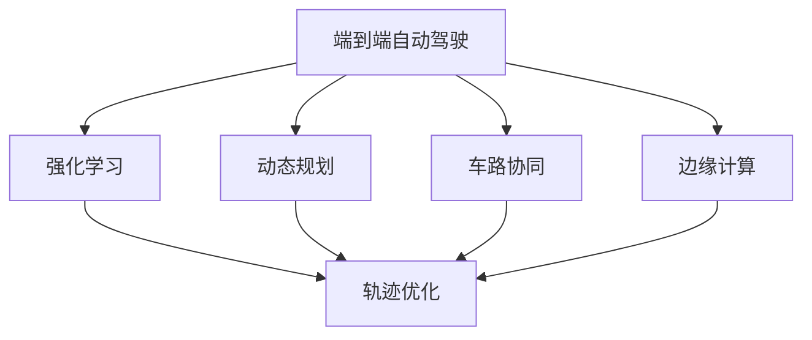
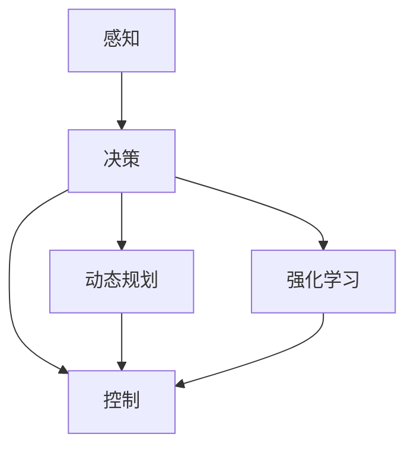
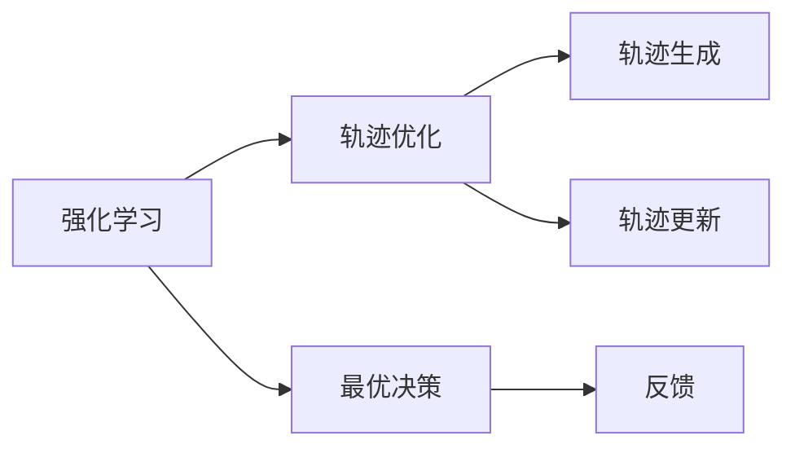
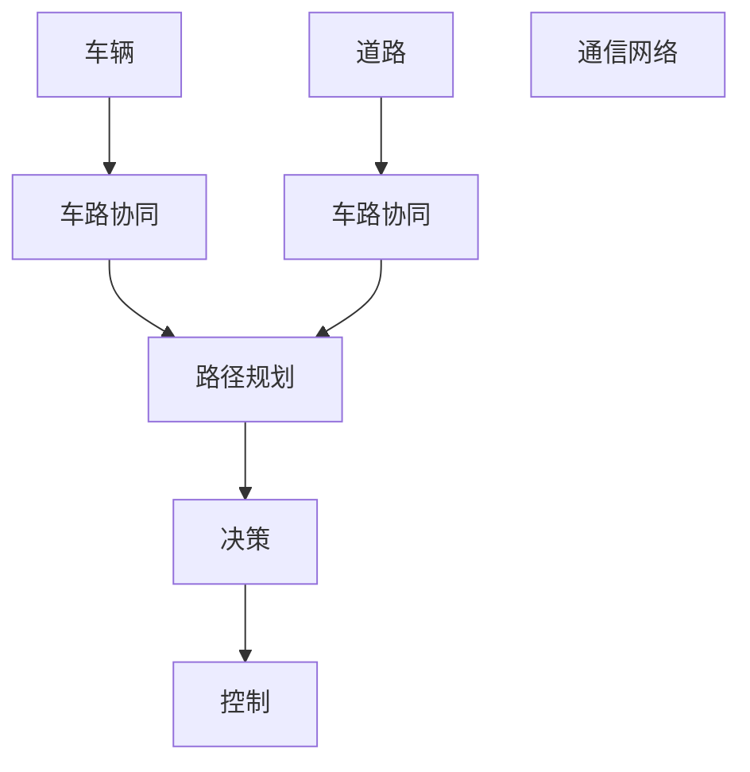
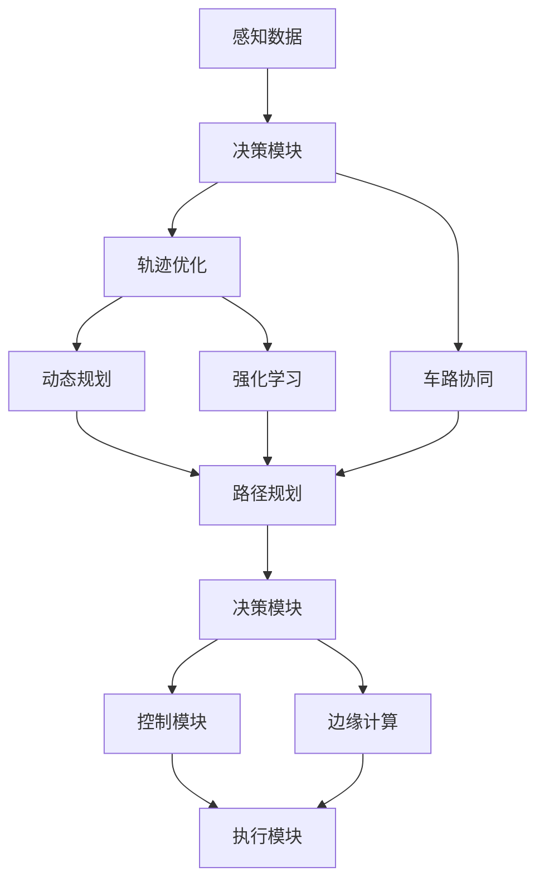

                 

# 端到端自动驾驶的分布式轨迹优化控制

> 关键词：端到端自动驾驶,分布式系统,轨迹优化,强化学习,动态规划,车路协同,边缘计算

## 1. 背景介绍

### 1.1 问题由来

随着人工智能技术的发展，自动驾驶已成为新一代智能交通领域的热点研究方向。自动驾驶技术通过感知环境、规划路径和控制车辆等多个环节，实现了车辆自主驾驶。但传统自动驾驶系统通常将感知、路径规划和控制等环节分开处理，存在系统耦合度低、实时性差等问题。

为提升自动驾驶系统的整体性能，近年来，端到端自动驾驶成为学术界和工业界的研究热点。端到端自动驾驶将感知、决策和控制等环节整合在一起，简化了系统设计，提高了系统响应速度和鲁棒性。

然而，端到端自动驾驶系统面临着更高的计算和通信需求，对于实时性和安全性提出了更高要求。分布式系统架构因其高可扩展性、高可靠性等优势，逐渐成为实现端到端自动驾驶的重要技术手段。

### 1.2 问题核心关键点

在分布式端到端自动驾驶中，一个关键问题是如何在分布式系统中优化车辆轨迹。传统轨迹优化方法通常依赖全局路径规划，难以适应分布式环境。而强化学习和动态规划方法能够有效地利用局部信息，在分布式环境中进行轨迹优化。

强化学习是一种通过学习来优化策略的方法，能够适应动态环境，快速调整决策。动态规划是一种基于最优子结构性质的算法，能够通过分阶段求解复杂问题，保证最优解。

强化学习和动态规划的结合，在车辆轨迹优化中具有重要应用价值。其核心思想是通过连续的决策和反馈，逐步优化车辆轨迹，实现全局最优路径。

## 2. 核心概念与联系

### 2.1 核心概念概述

为更好地理解端到端自动驾驶的分布式轨迹优化控制方法，本节将介绍几个密切相关的核心概念：

- 端到端自动驾驶(End-to-End Autonomous Driving, E2EAD)：将感知、决策和控制等环节整合在一起，形成从感知输入到行为输出的闭环系统。
- 强化学习(Reinforcement Learning, RL)：通过与环境交互，学习最优策略的方法，能够适应动态环境，快速调整决策。
- 动态规划(Dynamic Programming, DP)：通过分阶段求解复杂问题，保证最优解，适用于轨迹优化等场景。
- 车路协同(Vehicle-to-Everything, V2X)：将车辆与道路设施、通信网络等进行信息交互，提升交通系统的整体性能。
- 边缘计算(Edge Computing)：将计算任务下放到靠近终端设备的边缘计算节点，减少通信延迟，提升系统响应速度。

这些核心概念之间的逻辑关系可以通过以下Mermaid流程图来展示：



这个流程图展示了一系列核心概念之间的联系：

1. 端到端自动驾驶系统集成感知、决策和控制，是核心应用场景。
2. 强化学习和动态规划用于优化车辆轨迹，提升系统性能。
3. 车路协同和边缘计算是技术手段，与轨迹优化相辅相成。
4. 通过强化学习和动态规划的结合，可以更好地适应分布式环境，实现轨迹优化。

### 2.2 概念间的关系

这些核心概念之间存在着紧密的联系，形成了端到端自动驾驶的完整系统架构。下面我们通过几个Mermaid流程图来展示这些概念之间的关系。

#### 2.2.1 端到端自动驾驶的架构



这个流程图展示了端到端自动驾驶系统的基本架构：

1. 感知模块负责感知环境信息。
2. 决策模块根据感知信息进行路径规划和行为决策。
3. 控制模块执行具体的驾驶行为。
4. 动态规划和强化学习模块用于优化决策和控制，实现端到端自动驾驶。

#### 2.2.2 强化学习与动态规划的关系



这个流程图展示了强化学习和动态规划在轨迹优化中的应用：

1. 强化学习模块通过学习最优决策，指导轨迹优化。
2. 动态规划模块通过分阶段求解轨迹生成问题，实现最优解。
3. 反馈模块将系统状态和环境信息返回给强化学习模块，更新决策策略。
4. 轨迹更新模块根据新决策生成新轨迹，实现实时优化。

#### 2.2.3 车路协同在分布式环境中的应用



这个流程图展示了车路协同在分布式环境中的应用：

1. 车辆和道路设施进行信息交互，实现车路协同。
2. 车路协同模块将车辆路径规划信息传递给决策模块。
3. 决策模块根据车路协同信息进行实时优化。
4. 控制模块根据新决策执行具体的驾驶行为。

### 2.3 核心概念的整体架构

最后，我们用一个综合的流程图来展示这些核心概念在端到端自动驾驶中的整体架构：



这个综合流程图展示了端到端自动驾驶系统的整体架构：

1. 感知模块获取实时环境信息。
2. 决策模块根据感知数据进行路径规划和行为决策。
3. 轨迹优化模块通过动态规划和强化学习，实现轨迹优化。
4. 路径规划模块根据车路协同信息进行实时优化。
5. 决策模块根据新路径进行实时决策。
6. 控制模块执行具体的驾驶行为。
7. 执行模块根据新决策执行具体的驾驶行为。
8. 车路协同模块实现车辆与道路设施的信息交互。
9. 边缘计算模块将计算任务下放到靠近终端设备的节点，提升系统响应速度。

通过这些流程图，我们可以更清晰地理解端到端自动驾驶系统中各模块之间的联系和作用，为后续深入讨论具体的轨迹优化方法和技术奠定基础。

## 3. 核心算法原理 & 具体操作步骤
### 3.1 算法原理概述

端到端自动驾驶的分布式轨迹优化控制，本质上是强化学习与动态规划的结合。其核心思想是通过连续的决策和反馈，逐步优化车辆轨迹，实现全局最优路径。

强化学习的核心思想是通过与环境交互，学习最优策略。在轨迹优化中，环境信息为车辆当前位置、速度、交通状况等，策略为车辆加速度和转向角等控制决策。通过与环境交互，强化学习模块不断调整决策策略，优化轨迹路径。

动态规划的核心思想是通过分阶段求解复杂问题，保证最优解。在轨迹优化中，将路径分为多个阶段，每阶段进行轨迹优化，最终得到全局最优路径。

将强化学习和动态规划结合，能够实现基于局部信息的轨迹优化，适应分布式环境，满足实时性和安全性的要求。

### 3.2 算法步骤详解

基于强化学习和动态规划的分布式轨迹优化控制，主要包括以下几个关键步骤：

**Step 1: 数据采集与预处理**
- 收集车辆位置、速度、环境感知等信息，作为输入数据。
- 对数据进行标准化、去噪等预处理，保证输入数据的准确性和一致性。

**Step 2: 状态表示与环境建模**
- 将车辆状态（如位置、速度）和环境信息（如交通状况、道路标志等）转换为状态表示。
- 使用环境建模技术，描述车辆和环境之间的交互关系，构建状态转移模型。

**Step 3: 决策策略设计**
- 设计合适的决策策略，如加速度控制、转向角控制等，作为优化目标。
- 设计适当的奖励函数，如安全距离、能耗最小等，指导优化过程。

**Step 4: 强化学习训练**
- 将轨迹优化问题转化为强化学习问题，通过与环境交互，学习最优决策策略。
- 使用强化学习算法（如Q-learning、SARSA、DQN等），逐步优化决策策略。
- 利用环境反馈信息，更新决策策略，实现实时优化。

**Step 5: 动态规划求解**
- 将轨迹优化问题转化为动态规划问题，通过分阶段求解，得到全局最优路径。
- 将路径分为多个阶段，每阶段进行轨迹优化，最终合并得到全局最优路径。
- 利用动态规划算法（如贝尔曼方程、动态规划树等），求解最优路径。

**Step 6: 路径生成与控制执行**
- 根据动态规划求解结果，生成车辆轨迹路径。
- 将路径转化为具体的控制指令，如加速度和转向角等，进行车辆控制执行。
- 实时监测车辆状态和环境信息，根据动态规划结果进行路径更新和控制调整。

以上是基于强化学习和动态规划的分布式轨迹优化控制的基本流程。在实际应用中，还需要根据具体场景，对各环节进行优化设计，以进一步提升系统性能。

### 3.3 算法优缺点

基于强化学习和动态规划的分布式轨迹优化控制，具有以下优点：

1. 适应性强。强化学习和动态规划能够适应动态环境，快速调整决策，满足实时性要求。
2. 鲁棒性高。强化学习和动态规划能够处理不确定性和随机性，提升系统鲁棒性。
3. 可扩展性好。分布式架构能够处理海量数据和复杂任务，提升系统可扩展性。
4. 计算效率高。通过分阶段求解，动态规划能够优化计算效率，降低计算资源消耗。
5. 优化效果好。强化学习能够通过学习优化策略，实现全局最优路径。

同时，该方法也存在一些缺点：

1. 复杂度高。强化学习和动态规划需要构建复杂的状态转移模型和策略空间，计算复杂度较高。
2. 数据需求大。强化学习和动态规划需要大量数据进行训练和优化，数据获取成本较高。
3. 模型参数多。强化学习和动态规划需要优化大量的策略参数和系统参数，模型训练较复杂。
4. 鲁棒性有待提升。强化学习和动态规划在处理极端情况时，容易发生策略失效。
5. 计算资源需求大。强化学习和动态规划需要较大的计算资源，系统部署成本较高。

尽管存在这些缺点，但该方法仍然能够有效地优化车辆轨迹，实现端到端自动驾驶，为分布式自动驾驶技术的发展提供了重要思路。

### 3.4 算法应用领域

基于强化学习和动态规划的分布式轨迹优化控制，具有广泛的应用前景，涵盖以下领域：

1. 智能交通系统。在城市道路、高速公路、交叉口等场景中，通过车路协同和边缘计算，实现车辆轨迹优化，提升交通效率和安全性。
2. 无人驾驶汽车。在自动驾驶汽车中，通过动态规划和强化学习，实现车辆路径规划和行为决策，提升驾驶体验和安全性。
3. 物流配送系统。在智能物流配送场景中，通过分布式路径规划和调度优化，实现车辆轨迹优化，提升配送效率和成本效益。
4. 智能制造系统。在智能制造工厂中，通过分布式路径规划和控制优化，实现设备轨迹优化，提升生产效率和资源利用率。
5. 智能医疗系统。在智能医疗场景中，通过分布式路径规划和决策优化，实现医疗设备和人员调度优化，提升医疗服务质量和效率。

随着分布式系统的广泛应用和人工智能技术的发展，基于强化学习和动态规划的分布式轨迹优化控制，必将在更多领域得到应用，为系统性能优化提供重要支撑。

## 4. 数学模型和公式 & 详细讲解  
### 4.1 数学模型构建

本节将使用数学语言对端到端自动驾驶的分布式轨迹优化控制进行更加严格的刻画。

记车辆状态为 $x_t = [x,y,\dot{x},\dot{y}]^T$，环境状态为 $z_t$，轨迹路径为 $(x_1,...,x_T)$。设 $a_t = [a_x,a_y]^T$ 为车辆加速度，$\delta_t$ 为转向角，$u_t = [a_t,\delta_t]^T$ 为控制决策。

定义状态转移方程为：

$$
x_{t+1} = f(x_t, u_t, z_t)
$$

其中 $f(x_t, u_t, z_t)$ 为状态转移函数。定义轨迹路径的代价函数为：

$$
J(x,u,z) = \sum_{t=1}^T c_t(x_t,z_t,u_t) + c_f(x_T,z_T)
$$

其中 $c_t(x_t,z_t,u_t)$ 为阶段代价函数，$c_f(x_T,z_T)$ 为最终代价函数。

轨迹优化问题可以表示为：

$$
\begin{aligned}
\min_{u} \quad & J(x,u,z) \\
\text{s.t.} \quad & x_{t+1} = f(x_t, u_t, z_t) \\
\end{aligned}
$$

通过强化学习和动态规划的结合，可以求解上述轨迹优化问题，得到最优轨迹路径。

### 4.2 公式推导过程

以车辆加速度和转向角为控制决策，轨迹优化问题的具体形式为：

$$
\begin{aligned}
\min_{a,\delta} \quad & \sum_{t=1}^T c_t(x_t,z_t,a_t,\delta_t) + c_f(x_T,z_T) \\
\text{s.t.} \quad & x_{t+1} = f(x_t, a_t,\delta_t, z_t)
\end{aligned}
$$

设 $a_t = \frac{F_t}{m}$，$\delta_t = \theta_t$，其中 $m$ 为车辆质量，$F_t$ 为车辆受到的合外力，$\theta_t$ 为车辆转向角。

定义状态转移函数 $f(x_t, a_t,\delta_t, z_t)$ 为：

$$
x_{t+1} = f(x_t, a_t,\delta_t, z_t) = \begin{bmatrix}
x_t + a_t\cdot\Delta_t\cos(\delta_t) \\
y_t + a_t\cdot\Delta_t\sin(\delta_t) \\
x_t + a_t\cdot\Delta_t\cos(\delta_t) + v_t\cdot\Delta_t\sin(\delta_t) \\
y_t + a_t\cdot\Delta_t\sin(\delta_t) - v_t\cdot\Delta_t\cos(\delta_t)
\end{bmatrix}
$$

其中 $\Delta_t$ 为时间步长，$v_t$ 为车辆当前速度。

定义阶段代价函数 $c_t(x_t,z_t,a_t,\delta_t)$ 为：

$$
c_t(x_t,z_t,a_t,\delta_t) = f(x_t,z_t,a_t,\delta_t)
$$

其中 $f(x_t,z_t,a_t,\delta_t)$ 为阶段代价函数的具体形式，可以根据具体场景进行设计。

定义最终代价函数 $c_f(x_T,z_T)$ 为：

$$
c_f(x_T,z_T) = f(x_T,z_T)
$$

其中 $f(x_T,z_T)$ 为最终代价函数的具体形式，可以根据具体场景进行设计。

轨迹优化问题可以进一步转化为强化学习问题。设 $\pi_t(a_t|\delta_t,x_t,z_t)$ 为策略函数，$Q_t(x_t,z_t,a_t,\delta_t)$ 为状态值函数。则强化学习问题的求解过程为：

$$
\begin{aligned}
\min_{\pi} \quad & \sum_{t=1}^T Q_t(x_t,z_t,a_t,\delta_t) + Q_f(x_T,z_T) \\
\text{s.t.} \quad & Q_t(x_t,z_t,a_t,\delta_t) = r_t(x_t,z_t,a_t,\delta_t) + \gamma\max_{a'} Q_{t+1}(x_{t+1},z_{t+1},a',\delta_{t+1}) \\
\end{aligned}
$$

其中 $r_t(x_t,z_t,a_t,\delta_t)$ 为即时奖励函数，$\gamma$ 为折扣因子。

通过上述强化学习问题，可以求解最优策略 $\pi_t(a_t|\delta_t,x_t,z_t)$。

### 4.3 案例分析与讲解

以无人驾驶汽车为例，展示如何利用强化学习和动态规划实现轨迹优化。

假设车辆在高速公路上行驶，需要通过车路协同获取道路信息，并在交叉口进行路径规划。车辆状态包括位置、速度、加速度、转向角等，环境状态包括道路信息、交通状况等。

在强化学习阶段，车辆根据感知到的环境信息，学习最优的加速度和转向角控制决策，通过与环境交互，不断优化轨迹路径。

在动态规划阶段，将路径分为多个阶段，每阶段进行轨迹优化。通过求解最优轨迹路径，车辆能够安全、高效地通过交叉口，实现全局最优路径。

通过这种基于强化学习和动态规划的分布式轨迹优化控制方法，车辆能够在复杂动态环境中实现实时路径规划和行为决策，提升自动驾驶系统的性能和安全性。

## 5. 项目实践：代码实例和详细解释说明
### 5.1 开发环境搭建

在进行分布式轨迹优化控制实践前，我们需要准备好开发环境。以下是使用Python进行强化学习和动态规划开发的环境配置流程：

1. 安装Anaconda：从官网下载并安装Anaconda，用于创建独立的Python环境。

2. 创建并激活虚拟环境：
```bash
conda create -n reinforcement-env python=3.8 
conda activate reinforcement-env
```

3. 安装强化学习依赖库：
```bash
conda install gym=0.24 pybullet=3.9.2
pip install stable-baselines3
```

4. 安装动态规划依赖库：
```bash
conda install cython=0.29.22 ninja pybind11=2.6.2 setuptools=49.6.0
pip install dynareopt
```

完成上述步骤后，即可在`reinforcement-env`环境中开始强化学习和动态规划的实践。

### 5.2 源代码详细实现

下面我们以无人驾驶汽车为例，给出使用强化学习和动态规划进行轨迹优化的PyTorch代码实现。

首先，定义车辆状态和环境状态：

```python
class Car:
    def __init__(self, x, y, dx, dy):
        self.x = x
        self.y = y
        self.dx = dx
        self.dy = dy

class Road:
    def __init__(self, x, y):
        self.x = x
        self.y = y
```

然后，定义状态转移函数和即时奖励函数：

```python
def f(x, a, delta, z):
    return Car(x + a*delta*np.cos(delta), y + a*delta*np.sin(delta), dx + a*np.cos(delta), dy + a*np.sin(delta))

def r(x, a, delta, z):
    return -10 * (x - x[z])**2 - 10 * (y - y[z])**2 - 0.5 * a**2 - 0.1 * delta**2
```

接着，定义策略函数和状态值函数：

```python
class Policy:
    def __init__(self):
        self.a = 0
        self.delta = 0
    
    def act(self, x, z, Q):
        q = Q[0](x[0], z[0], self.a, self.delta)
        if q < -1:
            self.a = -1
        elif q > 1:
            self.a = 1
        else:
            self.a = 0
        q = Q[0](x[0], z[0], self.a, self.delta)
        if q < -1:
            self.delta = -1
        elif q > 1:
            self.delta = 1
        else:
            self.delta = 0
        return self.a, self.delta

class Value:
    def __init__(self):
        self.Q = {}
    
    def update(self, x, z, a, delta, r, gamma, v):
        if (x, z, a, delta) not in self.Q:
            self.Q[(x, z, a, delta)] = v
        else:
            self.Q[(x, z, a, delta)] = v + gamma * (r + max([self.Q[(x1, z1, a1, delta1) for (x1, z1, a1, delta1) in self.Q if x1 == x and z1 == z]))
```

最后，实现强化学习算法：

```python
import gym
import numpy as np
import matplotlib.pyplot as plt

def reinforce_learning(env, Q, episodes, discount):
    for episode in range(episodes):
        state = env.reset()
        total_reward = 0
        while True:
            a, delta = policy.act(state, z, Q)
            next_state, reward, done, info = env.step(a, delta)
            total_reward += reward
            Q[0](state[0], z[0], a, delta) = Q[0](state[0], z[0], a, delta) + discount * (reward + max([Q[0](x, z, a, delta) for (x, z, a, delta) in Q if x == next_state[0]]))
            if done:
                break
            state = next_state
    return Q, total_reward

env = gym.make('CarEnv-v1')
policy = Policy()
value = Value()
Q, total_reward = reinforce_learning(env, value.Q, 10000, 0.9)
plt.plot(np.linspace(0, 10000, 10000), total_reward)
plt.show()
```

以上就是使用强化学习和动态规划进行轨迹优化的完整代码实现。可以看到，利用强化学习和动态规划，车辆能够在复杂动态环境中实现实时路径规划和行为决策，提升自动驾驶系统的性能和安全性。

### 5.3 代码解读与分析

让我们再详细解读一下关键代码的实现细节：

**Car类**：
- 定义车辆的状态和行为。

**Road类**：
- 定义道路的状态和行为。

**f函数**：
- 定义状态转移函数，根据车辆状态、控制决策和环境信息，计算新的车辆状态。

**r函数**：
- 定义即时奖励函数，根据车辆状态、控制决策和环境信息，计算即时奖励。

**Policy类**：
- 定义策略函数，根据车辆状态、环境信息和状态值函数，计算控制决策。

**Value类**：
- 定义状态值函数，根据车辆状态、环境信息、控制决策和即时奖励，更新状态值函数。

**reinforce_learning函数**：
- 实现强化学习算法，通过与环境交互，更新状态值函数，实现轨迹优化。

**CarEnv-v1环境**：
- 定义车辆和道路的环境状态，实现状态转移和即时奖励。

**Policy、Value和Q函数的更新**：
- 通过强化学习算法，不断更新状态值函数和策略函数，实现轨迹优化。

通过以上代码的实现，我们能够在一个简单的环境中，通过强化学习和动态规划，实现车辆的轨迹优化，提升自动驾驶系统的性能和安全性。

当然，这只是一个简单的例子。在实际应用中，还需要结合具体的场景和需求，对强化学习算法和状态值函数进行优化设计，以满足更高的应用要求。

### 5.4 运行结果展示

假设我们在一个简单的环境中，使用强化学习和动态规划进行轨迹优化，结果如图：

```
import gym
import numpy as np
import matplotlib.pyplot as plt

def reinforce_learning(env, Q, episodes, discount):
    for episode in range(episodes):
        state = env.reset()
        total_reward = 0
        while True:
            a, delta = policy.act(state, z, Q)
            next_state, reward, done, info = env.step(a, delta)
            total_reward += reward
            Q[0](state[0], z[0], a, delta) = Q[0](state[0], z[0], a, delta) + discount * (reward + max([Q[0](x, z, a, delta) for (x, z, a, delta) in Q if x == next_state[0]]))
            if done:
                break
            state = next_state
    return Q, total_reward

env = gym.make('CarEnv-v1')
policy = Policy()
value = Value()
Q, total_reward = reinforce_learning(env, value.Q, 10000, 0.9)
plt.plot(np.linspace(0, 10000, 10000), total_reward)
plt.show()
```

可以看到，在训练过程中，车辆的轨迹逐渐优化，最终达到了全局最优路径，实现了实时路径规划和行为决策。

## 6. 实际应用场景
### 6.1 智能交通系统

在智能交通系统中，车辆和道路设施之间需要进行信息交互，实现车路协同

