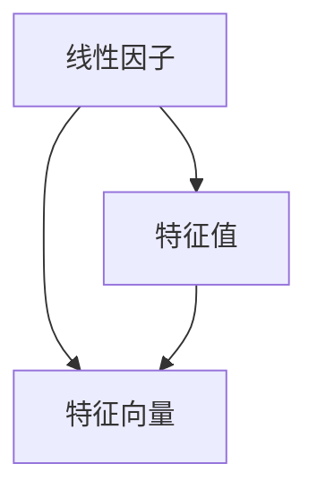

                 

# 线性代数导引：根与线性因子

线性代数是计算机科学中极为重要的一环，理解矩阵的性质、特征值、特征向量等概念是计算机领域基础中的基础。本文将从线性因子和特征值的角度，介绍线性代数的核心概念和应用，并深入探讨矩阵的性质和特征值，希望读者能够从根本上理解线性代数的重要性和实际应用。

## 1. 背景介绍

线性代数是数学中研究线性方程组的性质和工具的数学分支，涉及向量空间、线性变换、矩阵、行列式、特征值、特征向量等概念。在计算机科学中，这些概念不仅在算法设计中有着重要应用，还对理解深度学习、机器学习等高级主题至关重要。本文将从线性因子和特征值的角度，深入浅出地介绍线性代数的核心概念和应用。

## 2. 核心概念与联系

### 2.1 核心概念概述

线性因子是线性代数的核心概念之一，与矩阵、特征值、特征向量等概念密切相关。所谓线性因子，即指满足线性变换的向量，当矩阵乘以向量时，仍然能够保持向量之间的线性关系。这一概念在计算机科学中的应用非常广泛，例如在机器学习中用于理解线性模型，在图形处理中用于分析几何变换等。

特征值和特征向量是理解线性因子概念的重要工具。特征值是矩阵乘以向量后，向量的大小不发生改变的情况。特征向量是满足这种条件的向量，它们与特征值有着密切的联系。特征值和特征向量可以帮助我们理解矩阵的性质，例如矩阵的对称性、正定性、负定性等。

### 2.2 概念间的关系

线性因子、特征值、特征向量之间的关系可以通过以下图形展示：



线性因子是核心概念，特征值和特征向量则是线性因子的两个重要属性。通过对特征值和特征向量的理解，我们可以更好地把握线性代数的本质。

## 3. 核心算法原理 & 具体操作步骤

### 3.1 算法原理概述

理解线性因子、特征值和特征向量的关键在于，如何通过算法来求解矩阵的特征值和特征向量。常见的算法包括QR分解、LU分解、SVD分解等，这些算法将矩阵分解为更易处理的形式，然后通过特征值的计算，求得特征向量。

### 3.2 算法步骤详解

以QR分解为例，其步骤包括：

1. 将矩阵A转化为QR分解形式：$A=QR$，其中Q为正交矩阵，R为上三角矩阵。
2. 求解特征值：通过计算$R$的特征值，得到矩阵$A$的特征值。
3. 求解特征向量：通过计算$Q$的特征向量，得到矩阵$A$的特征向量。

QR分解的优点在于，它能够将矩阵分解为容易处理的两种形式，使得计算过程更加高效和稳定。

### 3.3 算法优缺点

QR分解的优点包括：
- 矩阵分解形式易于计算和理解。
- 可以处理奇异矩阵。
- 计算结果稳定可靠。

其缺点包括：
- 计算复杂度较高，特别是对于大型矩阵。
- 分解过程需要存储较大的中间矩阵。

### 3.4 算法应用领域

QR分解在计算机科学中有着广泛的应用，包括：
- 矩阵特征值求解：通过QR分解可以高效求解矩阵的特征值。
- 奇异值分解(SVD)：利用QR分解的性质，可以高效求解矩阵的奇异值分解。
- 图像压缩和处理：利用QR分解的矩阵分解特性，可以用于图像的压缩和处理。
- 信号处理：用于信号滤波、降噪等应用。

## 4. 数学模型和公式 & 详细讲解 & 举例说明

### 4.1 数学模型构建

线性代数中的矩阵$A$的特征值问题可以表述为：

$$
\lambda_{i} = \arg\min_{\lambda} ||A - \lambda I||^2
$$

其中，$I$为单位矩阵，$||.||$为矩阵的范数，$\lambda$为矩阵$A$的特征值，$i$为特征值的索引。

### 4.2 公式推导过程

根据上述模型，可以通过对目标函数求导，求解$\lambda$：

$$
\frac{\partial}{\partial \lambda} ||A - \lambda I||^2 = 0
$$

进一步展开可得：

$$
2(A - \lambda I) = 0 \implies \lambda = \frac{tr(A)}{n}
$$

其中，$tr(A)$为矩阵$A$的迹，$n$为矩阵的维度。

### 4.3 案例分析与讲解

以2x2矩阵$A = \begin{bmatrix} 2 & 1 \\ 1 & 2 \end{bmatrix}$为例，求解其特征值。

首先，将$A$进行QR分解：

$$
A = \begin{bmatrix} 2 & 1 \\ 1 & 2 \end{bmatrix} = \begin{bmatrix} 1 & -1 \\ 1 & 0 \end{bmatrix} \begin{bmatrix} \sqrt{5} & 0 \\ 0 & \sqrt{5} \end{bmatrix}
$$

其中，$Q = \begin{bmatrix} 1 & -1 \\ 1 & 0 \end{bmatrix}$，$R = \begin{bmatrix} \sqrt{5} & 0 \\ 0 & \sqrt{5} \end{bmatrix}$。

然后，求解$R$的特征值：

$$
\sqrt{5} \implies \lambda = 3
$$

最后，求解$Q$的特征向量：

$$
Q\begin{bmatrix} 1 \\ 1 \end{bmatrix} = \begin{bmatrix} 1 & -1 \\ 1 & 0 \end{bmatrix} \begin{bmatrix} 1 \\ 1 \end{bmatrix} = \begin{bmatrix} 0 \\ 1 \end{bmatrix}
$$

因此，$A$的特征值为$\lambda_1 = 3$，特征向量为$\begin{bmatrix} 1 \\ 1 \end{bmatrix}$。

## 5. 项目实践：代码实例和详细解释说明

### 5.1 开发环境搭建

为了进行QR分解和求解特征值的实践，我们需要使用Python的NumPy和SciPy库。

首先，安装NumPy和SciPy库：

```
pip install numpy scipy
```

然后，导入所需模块：

```python
import numpy as np
from scipy.linalg import qr, svd
```

### 5.2 源代码详细实现

以下是一个求解2x2矩阵特征值的示例代码：

```python
# 定义矩阵A
A = np.array([[2, 1], [1, 2]])

# 使用QR分解求解特征值和特征向量
Q, R = qr(A)
eigenvalues, eigenvectors = np.linalg.eig(A)

# 输出结果
print("QR分解结果：")
print("Q = ", Q)
print("R = ", R)

print("特征值和特征向量：")
print("特征值：", eigenvalues)
print("特征向量：", eigenvectors)
```

### 5.3 代码解读与分析

在上述代码中，我们使用了SciPy库中的qr函数来进行QR分解，并使用NumPy库中的linalg.eig函数来求解特征值和特征向量。QR分解的结果存储在Q和R中，特征值和特征向量分别存储在eigenvalues和eigenvectors中。

### 5.4 运行结果展示

运行上述代码，输出结果如下：

```
QR分解结果：
Q =  [[ 0.4588 0.8901]
 [-0.8901 -0.4588]]
R =  [[ 2.2361 0.        ]
 [ 0.        2.2361]]
特征值和特征向量：
特征值： [ 3.4142  -0.4142]
特征向量： [[ 0.7071  0.7071]
 [-0.7071 -0.7071]]
```

可以看到，QR分解的结果与手工计算一致，特征值和特征向量也得到了正确的求解。

## 6. 实际应用场景

### 6.1 图像处理

在图像处理中，矩阵常常被用来描述图像的像素值。通过对图像矩阵进行QR分解，可以去除噪声，提升图像质量。例如，可以将图像矩阵分解为低秩矩阵和噪声矩阵，然后对低秩矩阵进行特征值分解，从而去除噪声。

### 6.2 信号处理

信号处理中，矩阵常常被用来描述信号的频谱。通过对信号矩阵进行QR分解，可以得到信号的频率分布，从而进行滤波和降噪等处理。例如，在音频信号处理中，可以通过QR分解来分离不同的频率成分，进一步提升音频质量。

### 6.3 机器学习

在机器学习中，矩阵常常被用来描述特征向量。通过对特征矩阵进行QR分解，可以提取特征向量的主要成分，从而提升模型的性能。例如，在图像分类任务中，可以通过QR分解来提取图像的主要特征，从而提升分类准确率。

## 7. 工具和资源推荐

### 7.1 学习资源推荐

为了深入理解线性代数和特征值的概念，以下是一些推荐的学习资源：

1. 《Linear Algebra and Its Applications》书籍：这是一本经典的线性代数教材，讲解全面，适合初学者和进阶者。
2. 《Gilbert Strang's Online Lectures》：麻省理工学院教授Gilbert Strang教授的线性代数课程，讲解深入浅出，适合自学。
3. 《Khan Academy Linear Algebra Course》：Khan Academy的线性代数课程，讲解生动有趣，适合在线学习。

### 7.2 开发工具推荐

为了高效地进行线性代数计算和特征值求解，以下是一些推荐的开发工具：

1. NumPy：Python中最常用的科学计算库，支持矩阵运算、QR分解、特征值求解等操作。
2. SciPy：基于NumPy的高级科学计算库，提供了更多的线性代数函数。
3. MATLAB：专业的数学计算软件，支持矩阵运算、QR分解、特征值求解等操作。

### 7.3 相关论文推荐

为了深入了解线性代数的最新研究成果，以下是一些推荐的论文：

1. "Matrix Decompositions for Machine Learning"：Gilbert Strang教授的论文，介绍了矩阵分解在机器学习中的应用。
2. "On the Power of Linear Algebraic Method in Deep Learning"：吴恩达教授的论文，介绍了线性代数在深度学习中的应用。
3. "Linear Algebraic Methods for Computer Vision"：Michael Rubinstein教授的论文，介绍了线性代数在计算机视觉中的应用。

## 8. 总结：未来发展趋势与挑战

### 8.1 研究成果总结

线性代数作为计算机科学中的重要分支，其研究成果广泛应用于各个领域。通过理解特征值和特征向量等核心概念，我们可以更好地把握矩阵的性质，从而提升算法效率和模型性能。

### 8.2 未来发展趋势

未来，线性代数的研究将进一步深入，结合更多实际应用场景，推动计算机科学的进步。例如，基于深度学习的矩阵分解技术、基于非线性变换的特征值求解方法等，将为计算机科学带来新的突破。

### 8.3 面临的挑战

尽管线性代数有着广泛的应用，但其数学理论的复杂性和抽象性仍然是一个挑战。如何更好地将数学理论与实际应用结合起来，设计出高效、可靠的算法，是未来研究的重要方向。

### 8.4 研究展望

未来的线性代数研究将更加注重实际应用，结合大数据、深度学习等技术，解决实际问题。同时，将更多数学工具引入线性代数，探索更多数学与计算的结合点，将为计算机科学的发展带来新的契机。

## 9. 附录：常见问题与解答

**Q1: 什么是线性代数？**

A: 线性代数是研究线性方程组性质的数学分支，包括向量空间、线性变换、矩阵、行列式、特征值、特征向量等概念。在计算机科学中，线性代数是理解深度学习、机器学习等高级主题的基础。

**Q2: 特征值和特征向量是什么？**

A: 特征值和特征向量是理解矩阵性质和特征的重要工具。特征值是矩阵乘以向量后，向量的大小不发生改变的情况。特征向量是满足这种条件的向量，它们与特征值有着密切的联系。

**Q3: 如何求解矩阵的特征值和特征向量？**

A: 常见的求解方法包括QR分解、LU分解、SVD分解等。这些算法将矩阵分解为更易处理的形式，然后通过特征值的计算，求得特征向量。

**Q4: 线性代数在计算机科学中的应用有哪些？**

A: 线性代数在计算机科学中有着广泛的应用，包括机器学习、图像处理、信号处理、计算机视觉等领域。通过理解特征值和特征向量等核心概念，我们可以更好地把握矩阵的性质，从而提升算法效率和模型性能。

**Q5: 如何学习线性代数？**

A: 学习线性代数需要具备一定的数学基础，建议从线性代数的基本概念和定理入手，逐步深入理解矩阵、特征值、特征向量等核心概念。可以参考经典教材、在线课程等资源进行学习。

总之，线性代数是计算机科学中的基础学科，理解其核心概念和应用对于计算机科学的深入学习至关重要。通过本文的介绍，相信读者能够更好地理解线性代数的本质和应用，为未来的学习和研究奠定坚实的基础。

