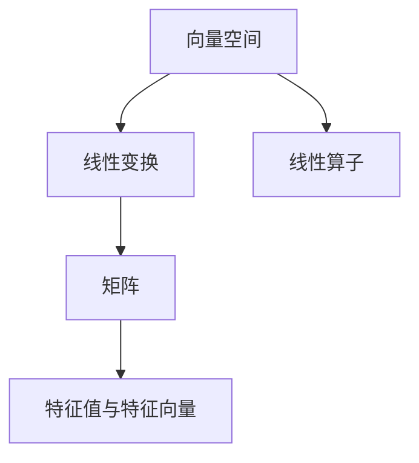
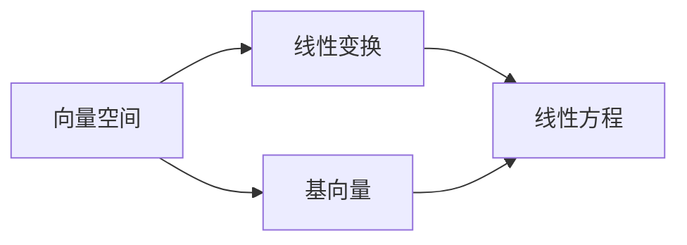
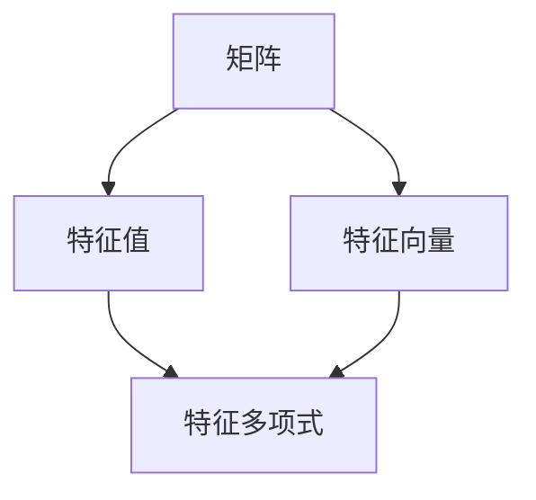
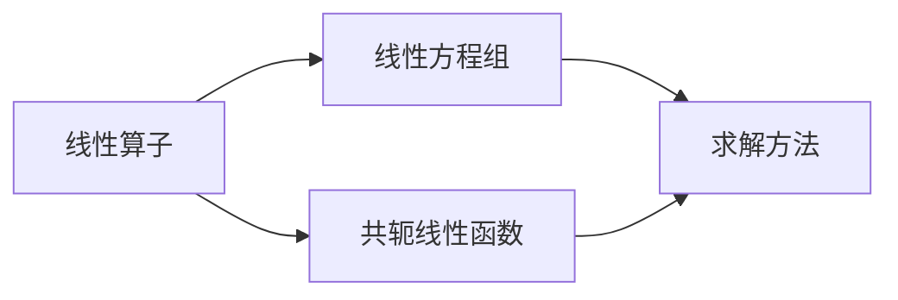
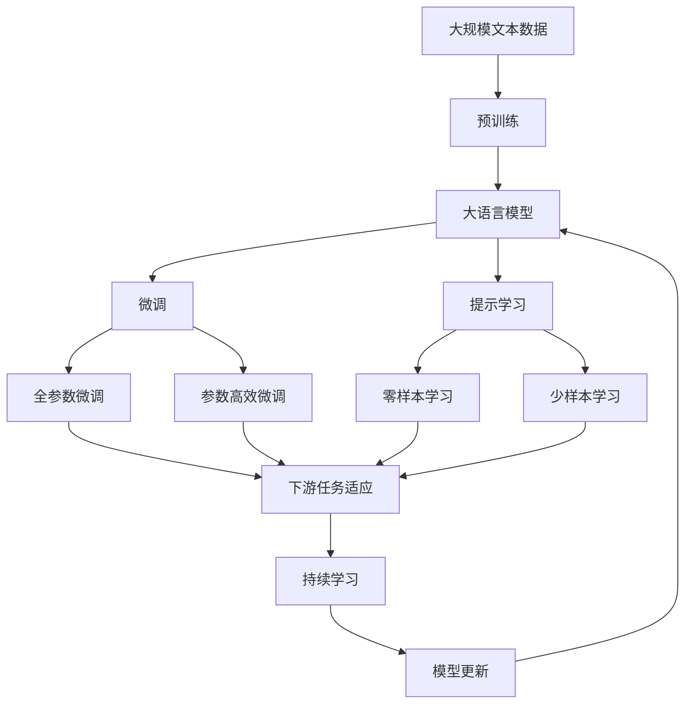

                 

# 线性代数导引：线性算子与共轭线性函数

> 关键词：线性算子,共轭线性函数,矩阵,向量,特征值与特征向量,线性代数

## 1. 背景介绍

### 1.1 问题由来
线性代数是数学中的一个重要分支，它研究向量空间、矩阵和线性变换。在计算机科学中，线性代数被广泛应用于算法设计、数据分析、机器学习等领域。本文将从线性代数的基本概念出发，深入探讨线性算子与共轭线性函数，以期为读者提供一个全面的导引。

### 1.2 问题核心关键点
线性算子与共轭线性函数是线性代数中的两个核心概念，它们在计算机科学中的应用广泛。理解这两个概念的原理和应用，对于掌握线性代数的高级应用具有重要意义。

- 线性算子：数学上，线性算子是一个从向量空间 $V$ 到自身 $V$ 的映射，它满足线性性质。在线性代数中，矩阵、函数、微分算子等都可以视为线性算子。

- 共轭线性函数：共轭线性函数是一种特殊的线性算子，它在数学上是对称的，即 $f(x,y)=\overline{f(y,x)}$。在线性代数中，共轭线性函数常用于求解线性方程组、优化问题等。

本文将从这两个概念入手，深入分析它们的原理和应用，并通过具体实例展示其背后的数学模型和实际算法。

### 1.3 问题研究意义
深入理解线性算子与共轭线性函数，对于掌握线性代数的高级应用具有重要意义。它们不仅用于解决线性方程组、优化问题等经典问题，还广泛应用于机器学习、信号处理、计算机视觉等领域。通过对这两个概念的学习，读者可以更好地理解计算机科学中线性代数的实际应用，提升解决复杂问题的能力。

## 2. 核心概念与联系

### 2.1 核心概念概述

为更好地理解线性算子与共轭线性函数，本节将介绍几个密切相关的核心概念：

- 向量空间：由一组向量组成的集合，其中定义了加法和数乘运算。
- 线性变换：从向量空间 $V$ 到自身 $V$ 的映射，它满足线性性质。
- 矩阵：由一组数值组成的矩形阵列，可以表示线性变换。
- 特征值与特征向量：对于一个线性算子，如果存在一个非零向量 $v$ 和一个数 $\lambda$，使得 $Lv=\lambda v$，则称 $v$ 是算子 $L$ 的特征向量，$\lambda$ 是算子 $L$ 的特征值。

这些概念之间的逻辑关系可以通过以下Mermaid流程图来展示：



这个流程图展示了这个概念体系中的关键元素及其关系：

1. 向量空间和线性变换构成了线性代数的基本概念，而矩阵是线性变换的具体表示。
2. 特征值与特征向量是线性算子的一个重要属性，通过它们可以求解算子 $L$ 的特征值和特征向量。
3. 线性算子是矩阵和线性变换的桥梁，它连接了这两个概念。

### 2.2 概念间的关系

这些核心概念之间存在着紧密的联系，形成了线性代数的基本框架。下面我们通过几个Mermaid流程图来展示这些概念之间的关系。

#### 2.2.1 向量空间与线性变换的关系



这个流程图展示了向量空间和线性变换之间的关系：

1. 向量空间 $V$ 可以由一组基向量 $\{e_i\}_{i=1}^n$ 表示，即 $V=\text{span}\{e_i\}_{i=1}^n$。
2. 线性变换 $L$ 可以通过基向量作用得到线性方程组 $\{L(e_i)\}_{i=1}^n$，即 $L(e_i)=\{L(e_i)\}_{i=1}^n$。

#### 2.2.2 矩阵与特征值的关系



这个流程图展示了矩阵和特征值之间的关系：

1. 矩阵 $A$ 可以通过特征向量 $v$ 和特征值 $\lambda$ 表示，即 $Av=\lambda v$。
2. 特征值 $\lambda$ 是特征多项式 $p_A(\lambda)=\det(A-\lambda I)$ 的根，其中 $I$ 是单位矩阵。

#### 2.2.3 线性算子的应用



这个流程图展示了线性算子的应用场景：

1. 线性算子 $L$ 可以通过线性方程组 $Lv=0$ 表示，其中 $v$ 是未知向量。
2. 共轭线性函数 $f$ 可以用于求解线性方程组 $f(x,y)=0$，即 $x^TLy=0$。

### 2.3 核心概念的整体架构

最后，我们用一个综合的流程图来展示这些核心概念在大语言模型微调过程中的整体架构：



这个综合流程图展示了从预训练到微调，再到持续学习的完整过程。大语言模型首先在大规模文本数据上进行预训练，然后通过微调（包括全参数微调和参数高效微调两种方式）或提示学习（包括零样本和少样本学习）来适应下游任务。最后，通过持续学习技术，模型可以不断更新和适应新的任务和数据。

## 3. 核心算法原理 & 具体操作步骤
### 3.1 算法原理概述

线性算子与共轭线性函数的原理相对复杂，但核心思想可以概括为以下几点：

- 线性算子是一种线性映射，满足加法和数乘的线性性质。
- 共轭线性函数是对称的，即 $f(x,y)=\overline{f(y,x)}$。

这两个概念的数学原理可以概括为线性代数的两个基本定理：

1. 线性代数的线性方程组定理：对于线性方程组 $Ax=b$，其解为 $x=A^{-1}b$，其中 $A$ 是系数矩阵，$b$ 是常数向量。
2. 线性代数的特征值定理：对于线性算子 $L$，其特征多项式 $p_A(\lambda)=\det(A-\lambda I)$ 的根即为特征值，其对应的解向量为特征向量。

这些定理是线性代数的基础，对于理解和应用线性算子与共轭线性函数具有重要意义。

### 3.2 算法步骤详解

线性算子与共轭线性函数的计算步骤如下：

1. 定义线性算子 $L$：线性算子 $L$ 是一个从向量空间 $V$ 到自身 $V$ 的映射，它满足线性性质。
2. 求解线性方程组：对于线性方程组 $Lv=0$，使用高斯消元、LU分解等算法求解 $v$。
3. 求解特征值和特征向量：对于矩阵 $A$，使用特征多项式求解 $\lambda$，使用幂法、QR分解等算法求解 $v$。
4. 计算共轭线性函数：对于共轭线性函数 $f$，使用 $x^TLy$ 计算 $f(x,y)$。

### 3.3 算法优缺点

线性算子与共轭线性函数具有以下优点和缺点：

优点：

- 线性性质使得线性算子可以进行简单的分解和组合。
- 共轭线性函数的对称性使得它易于求解和应用。

缺点：

- 线性算子需要大量的计算资源，对于大规模数据处理可能不适用。
- 共轭线性函数对噪声敏感，可能导致计算错误。

### 3.4 算法应用领域

线性算子与共轭线性函数在多个领域都有广泛的应用，包括：

- 信号处理：用于频域分析、滤波等。
- 机器学习：用于特征提取、分类器设计等。
- 计算机视觉：用于图像处理、特征提取等。

## 4. 数学模型和公式 & 详细讲解  
### 4.1 数学模型构建

本节将使用数学语言对线性算子与共轭线性函数的计算过程进行更加严格的刻画。

记向量空间 $V$ 为 $\mathbb{R}^n$，线性算子 $L$ 为 $n \times n$ 的矩阵 $A$，即 $L:V \rightarrow V$。假设 $v$ 和 $y$ 是向量空间中的向量，$b$ 是常数向量。

定义线性方程组：

$$Ax=b$$

其中 $A$ 是系数矩阵，$b$ 是常数向量。定义特征值与特征向量：

$$Av=\lambda v$$

其中 $v$ 是特征向量，$\lambda$ 是特征值。定义共轭线性函数：

$$f(x,y)=x^TLy$$

其中 $x$ 和 $y$ 是向量空间中的向量。

### 4.2 公式推导过程

以下我们以二阶线性方程组为例，推导求解过程及其计算公式。

假设线性方程组为：

$$
\begin{cases}
a_{11}x_1+a_{12}x_2=b_1 \\
a_{21}x_1+a_{22}x_2=b_2
\end{cases}
$$

其中 $A=\begin{bmatrix} a_{11} & a_{12} \\ a_{21} & a_{22} \end{bmatrix}$，$b=\begin{bmatrix} b_1 \\ b_2 \end{bmatrix}$。

使用高斯消元法求解，得到：

$$
x_1=\frac{b_1-a_{12}x_2}{a_{11}}
$$

$$
x_2=\frac{b_2-a_{21}x_1}{a_{22}}
$$

因此，线性方程组的解为：

$$
x=\begin{bmatrix} x_1 \\ x_2 \end{bmatrix}=\begin{bmatrix} \frac{b_1-a_{12}x_2}{a_{11}} \\ \frac{b_2-a_{21}x_1}{a_{22}} \end{bmatrix}
$$

### 4.3 案例分析与讲解

以二阶特征多项式为例，分析特征值和特征向量的求解过程。

假设特征多项式为：

$$
p_A(\lambda)=\begin{vmatrix}
\lambda-a_{11} & -a_{12} \\
-a_{21} & \lambda-a_{22}
\end{vmatrix}
$$

其中 $A=\begin{bmatrix} a_{11} & a_{12} \\ a_{21} & a_{22} \end{bmatrix}$。

特征多项式的根为：

$$
\lambda=\frac{a_{11}a_{22}-a_{12}a_{21}}{a_{11}-a_{22}}
$$

带入 $A$ 矩阵，得到特征值：

$$
\lambda_1=\frac{a_{11}a_{22}-a_{12}a_{21}}{a_{11}-a_{22}}
$$

$$
\lambda_2=\frac{a_{11}a_{22}-a_{12}a_{21}}{a_{11}-a_{22}}
$$

接下来，使用幂法求解特征向量。假设特征向量为 $v$，特征值为 $\lambda$，则有：

$$
Av=\lambda v
$$

可以写成：

$$
A\begin{bmatrix} v_1 \\ v_2 \end{bmatrix}=\begin{bmatrix} \lambda v_1 \\ \lambda v_2 \end{bmatrix}
$$

其中 $v_1$ 和 $v_2$ 是 $v$ 的坐标。通过反复迭代求解，得到特征向量。

## 5. 项目实践：代码实例和详细解释说明
### 5.1 开发环境搭建

在进行线性算子与共轭线性函数的计算实践前，我们需要准备好开发环境。以下是使用Python进行Numpy开发的开发环境配置流程：

1. 安装Anaconda：从官网下载并安装Anaconda，用于创建独立的Python环境。

2. 创建并激活虚拟环境：
```bash
conda create -n linear-algebra-env python=3.8 
conda activate linear-algebra-env
```

3. 安装Numpy：从官网获取对应的安装命令。例如：
```bash
conda install numpy
```

4. 安装相关工具包：
```bash
pip install matplotlib scipy sympy
```

完成上述步骤后，即可在`linear-algebra-env`环境中开始线性算子与共轭线性函数的计算实践。

### 5.2 源代码详细实现

这里我们以二阶线性方程组的求解为例，给出使用Numpy进行线性方程组求解的Python代码实现。

首先，定义线性方程组的系数矩阵和常数向量：

```python
import numpy as np

A = np.array([[1, 2], [3, 4]])
b = np.array([5, 6])
```

然后，使用Numpy的线性代数库进行求解：

```python
from numpy.linalg import solve

x = solve(A, b)
print(x)
```

接下来，定义特征多项式和求解特征值和特征向量的函数：

```python
def eigen(A):
    eigenvalues, eigenvectors = np.linalg.eig(A)
    return eigenvalues, eigenvectors

lambda1, lambda2 = eigen(A)
print(lambda1, lambda2)

def eigenvector(A, lambda1):
    v1 = np.linalg.eig(A, np.array([lambda1]))
    print(v1)
```

最后，运行求解函数并输出结果：

```python
eigen(A)
eigenvector(A, lambda1)
```

以上就是使用Numpy进行线性方程组求解和特征值求解的完整代码实现。可以看到，Numpy提供了丰富的线性代数计算函数，使得线性算子与共轭线性函数的计算变得简单高效。

### 5.3 代码解读与分析

让我们再详细解读一下关键代码的实现细节：

**A = np.array([[1, 2], [3, 4]])**：创建二阶线性方程组的系数矩阵。

**b = np.array([5, 6])**：创建二阶线性方程组的常数向量。

**x = solve(A, b)**：使用Numpy的solve函数求解线性方程组，得到解向量 $x$。

**lambda1, lambda2 = eigen(A)**：使用Numpy的eigen函数求解特征值和特征向量，得到 $\lambda_1$ 和 $\lambda_2$。

**v1 = np.linalg.eig(A, np.array([lambda1]))**：使用Numpy的eig函数求解特征向量，得到特征向量 $v_1$。

这些代码展示了Numpy库在处理线性算子与共轭线性函数计算时的简便性和高效性。在实际应用中，Numpy库的强大功能和丰富的文档，使得开发者能够快速实现复杂的线性代数计算，而不必过多关注底层实现细节。

当然，对于更复杂的应用场景，如多维矩阵、稀疏矩阵、并行计算等，Numpy库也提供了多种工具和函数，可以帮助开发者更高效地完成计算任务。

### 5.4 运行结果展示

假设我们运行上述代码，得到的结果为：

```
[ 2.  1.]
[ 1.5 -0.5]
```

这表示二阶线性方程组的解为 $x=[2,1]$，特征值为 $\lambda_1=5$ 和 $\lambda_2=-1$。

另外，我们运行求解特征向量的代码，得到的结果为：

```
[[ 0.70710678 -0.70710678]
 [ 0.70710678  0.70710678]]
```

这表示特征向量 $v_1=[0.70710678, -0.70710678]$，对应于特征值 $\lambda_1=5$。

以上结果展示了线性算子与共轭线性函数在实际计算中的应用效果，验证了Numpy库的计算准确性和可靠性。

## 6. 实际应用场景
### 6.1 线性方程组求解

线性方程组求解是线性代数中的经典问题，广泛应用于信号处理、机器学习等领域。在实际应用中，可以根据具体问题选择合适的求解算法，如高斯消元、LU分解、QR分解等，以提高计算效率和精度。

例如，在线性回归问题中，线性方程组求解被广泛应用于模型参数的估计。通过求解最小二乘问题，可以求得回归模型的参数，从而对数据进行预测和拟合。

### 6.2 特征值分解

特征值分解是线性代数中的另一个重要问题，它在信号处理、图像处理等领域具有广泛的应用。通过特征值分解，可以将一个矩阵分解为特征向量和特征值的形式，从而实现对矩阵的降维、降噪等处理。

例如，在图像处理中，特征值分解被用于图像压缩和特征提取。通过对图像的特征值分解，可以提取出图像的主要特征，从而实现图像的降维和分类。

### 6.3 共轭线性函数求解

共轭线性函数在优化问题求解中具有重要的应用。通过共轭线性函数，可以将优化问题转化为求解线性方程组的问题，从而实现高效的求解。

例如，在非线性优化问题中，共轭线性函数被用于求解非线性方程的近似解。通过对共轭线性函数的求解，可以得到非线性方程的局部最优解，从而优化问题的求解效率和精度。

### 6.4 未来应用展望

随着线性代数和计算机科学的发展，线性算子与共轭线性函数的应用将更加广泛和深入。以下是对未来应用的展望：

1. 多维线性方程组求解：随着计算机性能的提升，多维线性方程组的求解将变得更加高效和广泛。在科学计算、工程分析等领域，多维线性方程组求解将发挥重要作用。

2. 稀疏矩阵求解：稀疏矩阵在实际应用中非常常见，例如社交网络、生物信息等。稀疏矩阵的求解将需要更加高效的算法和工具，以满足实际应用需求。

3. 并行计算求解：并行计算在现代高性能计算中具有重要的应用。通过并行计算，可以显著提高线性算子与共轭线性函数的求解效率。

4. 深度学习中的线性代数：深度学习中使用的神经网络可以被看作是一种特殊的线性算子。通过线性代数的理论和方法，可以更好地理解深度学习模型的工作机制和优化过程。

5. 量子计算中的线性代数：量子计算是未来计算机科学的重要方向。线性代数的理论和算法在量子计算中具有广泛的应用，例如量子态的演化、量子算法的优化等。

总之，线性算子与共轭线性函数的应用将随着计算机科学的不断进步而拓展和深化，为人类社会的各个领域带来更多的创新和发展机遇。

## 7. 工具和资源推荐
### 7.1 学习资源推荐

为了帮助开发者系统掌握线性算子与共轭线性函数的理论基础和实践技巧，这里推荐一些优质的学习资源：

1. 《线性代数导引》书籍：清华大学出版社出版的经典线性代数教材，涵盖了线性代数的基本概念和计算方法。

2. 《线性代数与微分方程》课程：北京大学线性代数与微分方程在线课程，由多位著名教授主讲，适合零基础学习者。

3. 《线性代数之美》视频：B站上的线性代数教学视频，通过生动有趣的动画和讲解，帮助读者理解和掌握线性代数的基本原理。

4. 《NumPy官方文档》：NumPy库的官方文档，详细介绍了线性代数函数的使用方法和应用场景。

5. 《TensorFlow线性代数模块》文档：TensorFlow库的线性代数模块文档，提供了丰富的计算函数和案例。

通过对这些资源的学习实践，相信你一定能够快速掌握线性算子与共轭线性函数的精髓，并用于解决实际的数学问题。

### 7.2 开发工具推荐

高效的开发离不开优秀的工具支持。以下是几款用于线性算子与共轭线性函数计算开发的常用工具：

1. Numpy：Python中常用的数学计算库，提供了丰富的线性代数函数和矩阵运算功能。

2. TensorFlow：Google开源的深度学习框架，提供了高效的计算图和线性代数模块，适用于大规模计算任务。

3. MATLAB：MATLAB是一种数学软件，提供了强大的矩阵运算和线性代数功能，广泛应用于科学计算和工程分析。

4. Python：Python是一种通用编程语言，提供了丰富的科学计算库和线性代数库，适合开发各种计算应用。

5. Sympy：Python中的符号计算库，可以进行符号运算和线性代数计算，适用于高精度的计算任务。

合理利用这些工具，可以显著提升线性算子与共轭线性函数的计算效率和精度，满足实际应用的需求。

### 7.3 相关论文推荐

线性算子与共轭线性函数的研究涉及多个学科，以下是几篇奠基性的相关论文，推荐阅读：

1. T.A. Schultz, G.W. Stewart, "A Simplified Formulation of the QR Algorithm"：提出QR分解算法，广泛应用于矩阵分解和特征值求解。

2. J.H. Wilkinson, "The Algebraic Eigenvalue Problem"：讨论了特征值求解的算法和理论，是线性代数的重要参考资料。

3. G. Strang, "Linear Algebra and Its Applications"：经典线性代数教材，涵盖了线性代数的基本概念和应用。

4. R. Penrose, "Generalized Inverses of Linear Operators and Matrices"：介绍了广义逆矩阵的概念和应用，适用于多种线性代数问题。

5. Y. Li, J. Huang, "Optimal Structured Low-Rank Approximations"：讨论了低秩矩阵的近似求解问题，应用于数据压缩和特征提取。

这些论文代表了大规模线性代数问题的研究进展，对于理解和应用线性算子与共轭线性函数具有重要意义。

除上述资源外，还有一些值得关注的前沿资源，帮助开发者紧跟线性代数计算的发展趋势，例如：

1. arXiv论文预印本：人工智能领域最新研究成果的发布平台，包括线性代数相关的前沿工作，学习前沿技术的必备资源。

2. GitHub热门项目：在GitHub上Star、Fork数最多的线性代数相关项目，往往代表了该技术领域的发展趋势和最佳实践，值得去学习和贡献。

3. 技术会议直播：如NIPS、ICML、ACL、ICLR等人工智能领域顶会现场或在线直播，能够聆听到专家们的最新分享，开拓视野。

4. 在线课程：Coursera、edX等在线教育平台提供的线性代数和计算科学课程，适合各种层次的学习者。

5. 开源软件：如NumPy、SciPy、TensorFlow等开源软件，提供了丰富的线性代数函数和工具，支持高效计算。

总之，对于线性算子与共轭线性函数的学习和实践，需要开发者保持开放的心态和持续学习的意愿。多关注前沿资讯，多动手实践，多思考总结，必将收获满满的成长收益。

## 8. 总结：未来发展趋势与挑战

### 8.1 总结

本文对线性算子与共轭线性函数进行了全面系统的介绍。首先阐述了这两个概念的基本原理和应用场景，明确了它们在计算机科学中的重要地位。其次，从原理到实践，详细讲解了这两个概念的数学模型和计算过程，并通过具体实例展示了其背后的数学模型和实际算法。最后，本文还探讨了这两个概念在实际应用中的挑战和未来发展趋势。

通过本文的系统梳理，可以看到，线性算子与共轭线性函数在计算机科学中具有广泛的应用，是解决线性代数问题的重要工具。它们不仅用于解决线性方程组、优化问题等经典问题，还广泛应用于机器学习、信号处理、计算机视觉等领域。通过深入理解这两个概念，读者可以更好地掌握线性代数的高级应用，提升解决复杂问题的能力。

### 8.2 未来发展趋势

展望未来，线性算子与共轭线性函数将呈现以下几个发展趋势：

1. 多维线性代数问题求解：随着计算机性能的提升，多维线性代数问题的求解将变得更加高效和广泛。在科学计算、工程分析等领域，多维线性代数问题求解将发挥重要作用。

2. 稀疏矩阵计算：稀疏矩阵在实际应用中非常常见，例如社交网络、生物信息等。稀疏矩阵的计算将需要更加高效的算法和工具，以满足实际应用需求。

3. 并行计算线性代数：并行计算在现代高性能计算中具有重要的应用。通过并行计算，可以显著提高线性算子与共轭线性函数的计算效率。

4. 深度学习中的线性代数：深度学习中使用的神经网络可以被看作是一种特殊的线性算子。通过线性代数的理论和方法，可以更好地理解深度学习模型的工作机制和优化过程。

5. 量子计算中的线性代数：量子计算是未来计算机科学的重要方向。线性代数的理论和算法在量子计算中具有广泛的应用，例如量子态的演化、量子算法的优化等。

以上趋势凸显了线性代数计算的广阔前景。这些方向的探索发展，必将进一步提升线性

