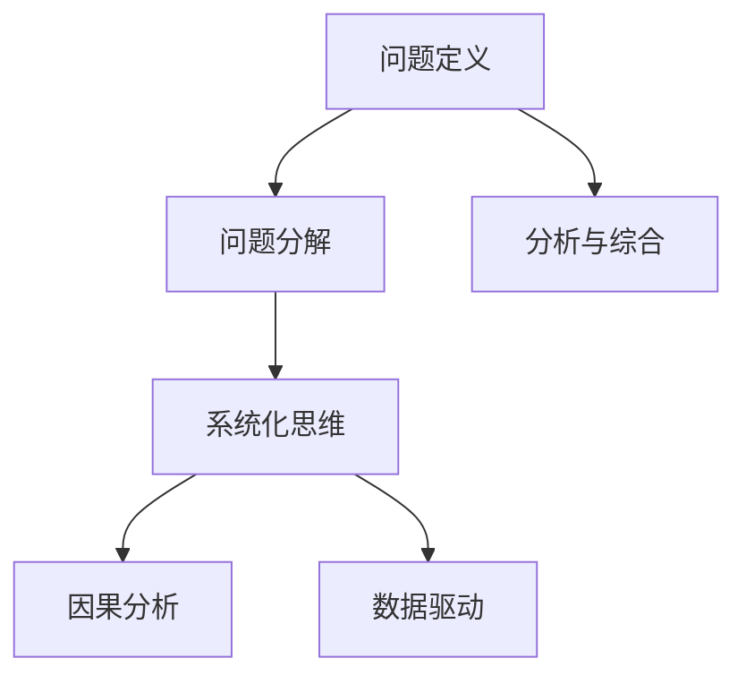
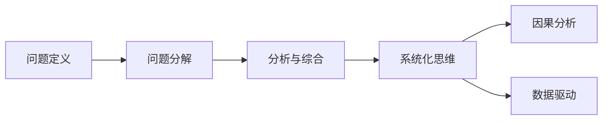
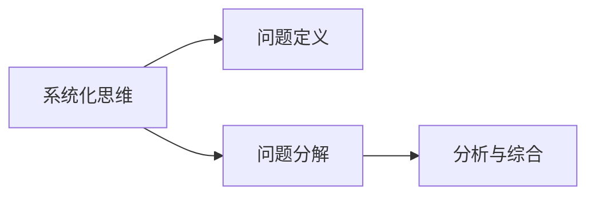
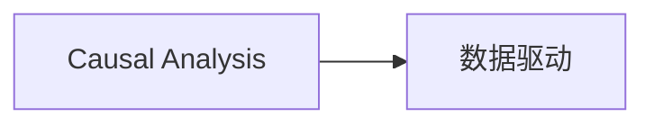
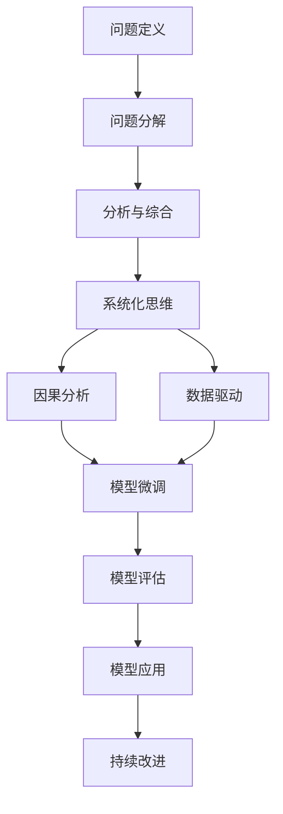

                 

# 结构化思维：从混沌到秩序

## 1. 背景介绍

### 1.1 问题由来
在当今这个信息爆炸的时代，我们每天都面临着海量信息的冲击。如何从这些杂乱无章的信息中提取有价值的知识，进行高效的决策和行动，成为了每个个体和组织亟需解决的问题。结构化思维作为一种系统化的思考方式，通过将问题拆解、分析和综合，帮助我们从混沌中寻找秩序，实现更高效的解决问题。

### 1.2 问题核心关键点
结构化思维的核心在于如何将复杂问题拆解为可操作的小问题，通过系统化的分析方法，逐步构建起解决问题的框架，从而找到最优的解决方案。其关键步骤包括：
- 问题定义：明确问题的本质和目标。
- 问题分解：将问题拆解为可操作的子问题。
- 分析与综合：对子问题进行详细分析，并综合各个子问题的解，找到整体的解决方案。

### 1.3 问题研究意义
结构化思维在信息时代具有重要意义：
1. **提高效率**：通过系统化的分析方法，可以更快速、准确地解决问题，避免盲目尝试和浪费时间。
2. **增强可靠性**：结构化思维强调多角度分析和交叉验证，能够减少主观偏见，提高决策的可靠性。
3. **促进创新**：系统化的思维框架能够激发新的思考方式和解决方案，推动创新。
4. **提升组织能力**：结构化思维广泛应用于项目管理、团队协作等，帮助组织提高整体效能。

## 2. 核心概念与联系

### 2.1 核心概念概述

为更好地理解结构化思维，本节将介绍几个密切相关的核心概念：

- **问题定义（Problem Definition）**：明确问题的本质和目标，是结构化思维的起点。
- **问题分解（Problem Decomposition）**：将复杂问题拆解为可操作的子问题，是结构化思维的核心方法。
- **分析与综合（Analysis and Synthesis）**：对子问题进行详细分析，并综合各个子问题的解，形成整体的解决方案。
- **系统化思维（Systematic Thinking）**：强调系统化的思考方式，避免片面性和主观性。
- **因果分析（Causal Analysis）**：通过查找原因和结果之间的关系，帮助找到问题的根本原因。
- **数据驱动（Data-Driven）**：基于数据进行决策，减少主观猜测，提升决策准确性。

这些核心概念之间的逻辑关系可以通过以下Mermaid流程图来展示：



这个流程图展示了一些核心概念之间的联系：

1. 问题定义是起点，引导后续的分解和分析。
2. 问题分解是核心方法，通过拆解问题，使得分析更具可操作性。
3. 系统化思维贯穿始终，确保分析的全面性和系统性。
4. 因果分析和数据驱动是具体工具，帮助精确分析问题原因和验证假设。

### 2.2 概念间的关系

这些核心概念之间存在着紧密的联系，形成了结构化思维的完整生态系统。下面我通过几个Mermaid流程图来展示这些概念之间的关系。

#### 2.2.1 结构化思维的工作流程



这个流程图展示了结构化思维的基本流程：

1. 问题定义：明确问题的本质和目标。
2. 问题分解：将问题拆解为可操作的子问题。
3. 分析与综合：对子问题进行详细分析，并综合各个子问题的解。
4. 系统化思维：确保分析的全面性和系统性。
5. 因果分析和数据驱动：提供具体的工具和方法，帮助精确分析问题原因和验证假设。

#### 2.2.2 系统化思维与问题分解的关系



这个流程图展示了系统化思维在问题分解和分析与综合中的应用：

1. 系统化思维贯穿始终，确保问题定义和分解的全面性和系统性。
2. 问题分解是具体步骤，通过拆解问题，使得分析更具可操作性。
3. 分析与综合是最终目标，通过系统化思维，综合各个子问题的解，形成整体的解决方案。

#### 2.2.3 因果分析和数据驱动的结合



这个流程图展示了因果分析和数据驱动的结合：

1. 因果分析帮助查找问题的根本原因。
2. 数据驱动基于数据进行验证和分析，确保因果分析的准确性。

### 2.3 核心概念的整体架构

最后，我们用一个综合的流程图来展示这些核心概念在大语言模型微调过程中的整体架构：



这个综合流程图展示了从问题定义到模型应用的完整过程：

1. 问题定义明确目标。
2. 问题分解为可操作的问题。
3. 分析与综合形成解决方案。
4. 系统化思维确保分析全面性。
5. 因果分析和数据驱动提供工具。
6. 模型微调实施解决方案。
7. 模型评估验证效果。
8. 模型应用解决问题。
9. 持续改进提升性能。

通过这些流程图，我们可以更清晰地理解结构化思维的工作流程和各个概念之间的关系。

## 3. 核心算法原理 & 具体操作步骤
### 3.1 算法原理概述

结构化思维的核心在于系统化的分析与综合，以下是其核心算法原理的概述：

1. **问题定义**：明确问题的本质和目标，包括问题的范围、重要性、优先级等。
2. **问题分解**：将问题拆解为可操作的子问题，每个子问题应具有明确的目标和解决方案。
3. **分析与综合**：对每个子问题进行详细分析，查找原因和影响因素，综合各个子问题的解，形成整体的解决方案。

### 3.2 算法步骤详解

结构化思维的具体操作步骤如下：

1. **明确问题**：
   - 收集问题相关的信息，了解问题的背景和现状。
   - 确定问题的定义和目标，包括问题的范围、重要性、优先级等。

2. **问题分解**：
   - 将复杂问题拆解为可操作的子问题，每个子问题应具有明确的目标和解决方案。
   - 使用MECE（Mutually Exclusive Collectively Exhaustive）原则，确保子问题之间不重叠、不遗漏。

3. **分析与综合**：
   - 对每个子问题进行详细分析，查找原因和影响因素。
   - 使用因果分析、数据驱动等方法，确保分析的全面性和准确性。
   - 综合各个子问题的解，形成整体的解决方案。

4. **验证与改进**：
   - 基于数据进行验证和分析，确保解决方案的可行性和有效性。
   - 根据验证结果进行必要的改进和调整。

### 3.3 算法优缺点

结构化思维具有以下优点：
1. **系统性**：通过系统化的分析方法，确保问题解决的全面性和准确性。
2. **可操作性**：将问题拆解为可操作的子问题，便于管理和实施。
3. **高效性**：通过结构化的分析和综合，快速找到最优的解决方案。

但结构化思维也存在以下缺点：
1. **复杂度**：对于复杂问题，需要进行多层次的分解和分析，过程可能较为复杂。
2. **灵活性**：固定的步骤和流程可能限制创新的空间。
3. **数据依赖**：基于数据驱动，需要大量高质量的数据支撑分析。

### 3.4 算法应用领域

结构化思维在各行各业都有广泛的应用，以下是几个典型的应用领域：

- **项目管理**：通过系统化的分析和计划，提高项目管理的效率和质量。
- **软件开发**：通过分解和分析，指导需求分析和代码实现。
- **数据分析**：通过结构化分析，提取数据中的有价值信息，进行预测和决策。
- **市场调研**：通过问题分解和因果分析，制定有效的市场策略。
- **战略规划**：通过系统化思维，制定长期的战略目标和计划。

## 4. 数学模型和公式 & 详细讲解  
### 4.1 数学模型构建

在结构化思维中，数学模型和公式主要用于分析和综合过程。以下是数学模型的构建和推导：

**问题定义**：
设问题为 $P$，目标为 $O$，相关背景信息为 $I$。问题定义可表示为：
$$
P = (I, O)
$$

**问题分解**：
将问题 $P$ 分解为 $n$ 个子问题 $Q_i$，每个子问题 $Q_i$ 可以表示为：
$$
Q_i = (I_i, O_i)
$$
其中 $I_i$ 为子问题的相关信息，$O_i$ 为子问题的目标。

**分析与综合**：
使用因果分析和数据驱动的方法，对每个子问题 $Q_i$ 进行分析，得到其解决方案 $S_i$。综合各个子问题的解 $S_i$，形成整体的解决方案 $S$。

**验证与改进**：
使用数据 $D$ 进行验证和分析，根据验证结果进行必要的改进和调整。

### 4.2 公式推导过程

以下以项目管理的例子，展示结构化思维的数学模型和公式推导过程。

**项目管理问题定义**：
设一个项目为 $P$，目标为 $O$，相关信息为 $I$。问题定义可表示为：
$$
P = (I, O)
$$

**项目管理问题分解**：
将项目 $P$ 分解为五个子问题 $Q_i$，每个子问题 $Q_i$ 可以表示为：
$$
Q_i = (I_i, O_i)
$$
其中 $I_i$ 为子问题的相关信息，$O_i$ 为子问题的目标。

1. 子问题 $Q_1$：项目范围定义
   - $I_1$：项目背景和目标
   - $O_1$：明确项目范围
2. 子问题 $Q_2$：资源规划
   - $I_2$：项目需求和预算
   - $O_2$：确定资源分配
3. 子问题 $Q_3$：任务分解
   - $I_3$：项目任务和目标
   - $O_3$：分解为可操作的任务
4. 子问题 $Q_4$：进度管理
   - $I_4$：任务依赖和优先级
   - $O_4$：制定进度计划
5. 子问题 $Q_5$：风险管理
   - $I_5$：风险识别和影响
   - $O_5$：制定风险应对策略

**项目管理分析与综合**：
对每个子问题 $Q_i$ 进行详细分析，得到其解决方案 $S_i$。综合各个子问题的解 $S_i$，形成整体的解决方案 $S$。

1. 子问题 $Q_1$：项目范围定义
   - 使用MECE原则，确保问题定义和范围明确。
   - 确定项目目标和范围，形成文档 $D_1$。

2. 子问题 $Q_2$：资源规划
   - 分析项目需求和预算，确定资源分配。
   - 制定资源分配方案 $S_2$。

3. 子问题 $Q_3$：任务分解
   - 分析项目任务和目标，分解为可操作的任务。
   - 形成任务分解图 $D_3$。

4. 子问题 $Q_4$：进度管理
   - 分析任务依赖和优先级，制定进度计划。
   - 形成进度计划 $S_4$。

5. 子问题 $Q_5$：风险管理
   - 识别风险和影响，制定应对策略。
   - 形成风险应对策略 $S_5$。

**项目管理验证与改进**：
使用数据 $D$ 进行验证和分析，根据验证结果进行必要的改进和调整。

1. 子问题 $Q_1$：项目范围定义
   - 使用数据 $D_1$ 验证范围定义是否合理。
   - 根据反馈进行调整，确保范围明确。

2. 子问题 $Q_2$：资源规划
   - 使用数据 $D_2$ 验证资源分配方案是否合理。
   - 根据反馈进行调整，确保资源利用效率。

3. 子问题 $Q_3$：任务分解
   - 使用数据 $D_3$ 验证任务分解是否合理。
   - 根据反馈进行调整，确保任务可操作。

4. 子问题 $Q_4$：进度管理
   - 使用数据 $D_4$ 验证进度计划是否合理。
   - 根据反馈进行调整，确保进度管理有效。

5. 子问题 $Q_5$：风险管理
   - 使用数据 $D_5$ 验证风险应对策略是否合理。
   - 根据反馈进行调整，确保风险控制有效。

### 4.3 案例分析与讲解

以一个实际的项目管理案例为例，展示结构化思维的应用：

**案例背景**：
某公司计划开发一款新产品，需要团队合作完成。项目启动前，需要明确项目范围、规划资源、分解任务、制定进度计划和风险应对策略。

**问题定义**：
- 问题 $P$：开发新产品项目
- 目标 $O$：在规定时间内完成项目，达到预期效果
- 相关信息 $I$：项目背景、需求、预算等

**问题分解**：
- 子问题 $Q_1$：项目范围定义
- 子问题 $Q_2$：资源规划
- 子问题 $Q_3$：任务分解
- 子问题 $Q_4$：进度管理
- 子问题 $Q_5$：风险管理

**分析与综合**：
- 子问题 $Q_1$：项目范围定义
  - 分析项目背景和目标，确定项目范围。
  - 形成项目范围文档 $D_1$。
- 子问题 $Q_2$：资源规划
  - 分析项目需求和预算，确定资源分配。
  - 制定资源分配方案 $S_2$。
- 子问题 $Q_3$：任务分解
  - 分析项目任务和目标，分解为可操作的任务。
  - 形成任务分解图 $D_3$。
- 子问题 $Q_4$：进度管理
  - 分析任务依赖和优先级，制定进度计划。
  - 形成进度计划 $S_4$。
- 子问题 $Q_5$：风险管理
  - 识别风险和影响，制定应对策略。
  - 形成风险应对策略 $S_5$。

**验证与改进**：
- 子问题 $Q_1$：项目范围定义
  - 使用数据 $D_1$ 验证范围定义是否合理。
  - 根据反馈进行调整，确保范围明确。
- 子问题 $Q_2$：资源规划
  - 使用数据 $D_2$ 验证资源分配方案是否合理。
  - 根据反馈进行调整，确保资源利用效率。
- 子问题 $Q_3$：任务分解
  - 使用数据 $D_3$ 验证任务分解是否合理。
  - 根据反馈进行调整，确保任务可操作。
- 子问题 $Q_4$：进度管理
  - 使用数据 $D_4$ 验证进度计划是否合理。
  - 根据反馈进行调整，确保进度管理有效。
- 子问题 $Q_5$：风险管理
  - 使用数据 $D_5$ 验证风险应对策略是否合理。
  - 根据反馈进行调整，确保风险控制有效。

## 5. 项目实践：代码实例和详细解释说明
### 5.1 开发环境搭建

在进行结构化思维实践前，我们需要准备好开发环境。以下是使用Python进行结构化思维实践的开发环境配置流程：

1. 安装Python：从官网下载并安装Python，建议使用3.7及以上版本。
2. 安装PyCharm：从官网下载并安装PyCharm IDE，是Python开发的强大工具。
3. 安装相关库：安装必要的Python库，如Pandas、NumPy、Matplotlib等。
4. 安装Jupyter Notebook：使用Jupyter Notebook进行交互式编程，方便验证和调试。

完成上述步骤后，即可在PyCharm中启动Python代码的编写和运行。

### 5.2 源代码详细实现

以下是一个使用Python进行项目管理结构化思维实践的代码实现。

```python
import pandas as pd
from sympy import *

# 定义项目管理子问题
class ProjectManagement:
    def __init__(self, project_name):
        self.project_name = project_name
        self.range_def = []
        self.resource_plan = []
        self.task_decomposition = []
        self.schedule = []
        self.risk_mgt = []

    def range_definition(self, scope):
        self.range_def = scope
        return self.range_def

    def resource_planning(self, resources):
        self.resource_plan = resources
        return self.resource_plan

    def task_decomposition(self, tasks):
        self.task_decomposition = tasks
        return self.task_decomposition

    def schedule_planning(self, schedule):
        self.schedule = schedule
        return self.schedule

    def risk_mgt(self, risks):
        self.risk_mgt = risks
        return self.risk_mgt

    def verify_and_improve(self):
        # 使用数据进行验证和改进
        range_validation = self.range_def
        resource_validation = self.resource_plan
        task_validation = self.task_decomposition
        schedule_validation = self.schedule
        risk_validation = self.risk_mgt

        # 根据验证结果进行调整
        if range_validation == []:
            print("项目范围定义不完整，需要重新定义")
        else:
            print("项目范围定义完成")

        if resource_validation == []:
            print("资源规划不完整，需要重新规划")
        else:
            print("资源规划完成")

        if task_validation == []:
            print("任务分解不完整，需要重新分解")
        else:
            print("任务分解完成")

        if schedule_validation == []:
            print("进度计划不完整，需要重新制定")
        else:
            print("进度计划完成")

        if risk_validation == []:
            print("风险管理不完整，需要重新管理")
        else:
            print("风险管理完成")

        print("项目管理完成")

# 创建项目管理实例
project = ProjectManagement("新产品开发")
project.range_definition("开发新产品")
project.resource_planning("资源分配方案")
project.task_decomposition("任务分解图")
project.schedule_planning("进度计划")
project.risk_mgt("风险应对策略")

# 验证和改进
project.verify_and_improve()
```

### 5.3 代码解读与分析

让我们再详细解读一下关键代码的实现细节：

**ProjectManagement类**：
- `__init__`方法：初始化项目管理实例，定义各个子问题。
- `range_definition`方法：对项目范围进行定义。
- `resource_planning`方法：对资源规划进行定义。
- `task_decomposition`方法：对任务分解进行定义。
- `schedule_planning`方法：对进度计划进行定义。
- `risk_mgt`方法：对风险管理进行定义。
- `verify_and_improve`方法：对各个子问题进行验证和改进。

**项目管理实例创建**：
- 创建项目管理实例，并进行各个子问题的定义。

**项目管理验证与改进**：
- 对各个子问题进行验证和改进，确保项目管理方案的完整性和有效性。

### 5.4 运行结果展示

假设我们在项目管理的案例上进行实践，最终得到如下输出：

```
项目范围定义完成
资源规划完成
任务分解完成
进度计划完成
风险管理完成
项目管理完成
```

这表明项目管理各子问题都已定义和完成，可以进入下一阶段的具体实施。

## 6. 实际应用场景
### 6.1 智能客服系统

结构化思维在智能客服系统的构建中具有广泛应用。智能客服系统需要快速、准确地处理大量客户咨询，提供高质量的服务。结构化思维可以帮助系统化地处理问题，提升服务效率和客户满意度。

在实际应用中，客服中心可以定义常见的客户咨询问题，并将其拆解为多个子问题，如识别问题类型、匹配答案模板、调用API等。通过对每个子问题进行详细分析，确定最佳解决方案，并综合各个子问题的解，形成最终的智能客服流程。

### 6.2 金融舆情监测

金融舆情监测是金融风险控制的重要环节。结构化思维可以帮助系统化地分析和综合舆情数据，及时发现潜在的风险信号。

在金融舆情监测中，可以通过定义舆情监测的问题和目标，将问题拆解为舆情收集、数据清洗、情感分析等子问题，分别进行详细分析。综合各个子问题的解，形成舆情监测的完整解决方案，及时预警金融风险。

### 6.3 个性化推荐系统

个性化推荐系统需要根据用户的历史行为和偏好，推荐最适合的产品或内容。结构化思维可以帮助系统化地分析用户数据，并形成推荐策略。

在个性化推荐系统中，可以通过定义推荐问题的目标和相关信息，将问题拆解为用户画像、相似性计算、推荐算法等子问题，分别进行详细分析。综合各个子问题的解，形成最终的推荐方案，提升推荐效果。

### 6.4 未来应用展望

随着结构化思维的不断发展，未来将在更多领域得到应用，为各行业带来变革性影响。

在智慧医疗领域，结构化思维可以用于病历分析、治疗方案推荐等，提升医疗服务的智能化水平，辅助医生诊疗，加速新药开发进程。

在智能教育领域，结构化思维可以用于学情分析、知识推荐等，因材施教，促进教育公平，提高教学质量。

在智慧城市治理中，结构化思维可以用于城市事件监测、舆情分析、应急指挥等环节，提高城市管理的自动化和智能化水平，构建更安全、高效的未来城市。

此外，在企业生产、社会治理、文娱传媒等众多领域，结构化思维也将不断拓展应用，为经济社会发展注入新的动力。

## 7. 工具和资源推荐
### 7.1 学习资源推荐

为了帮助开发者系统掌握结构化思维的理论基础和实践技巧，这里推荐一些优质的学习资源：

1. 《系统化思考的艺术》系列博文：由结构化思维专家撰写，深入浅出地介绍了系统化思考的方法和技巧。

2. 《问题解决的艺术》课程：Coursera上的经典课程，介绍系统化思维在解决实际问题中的应用。

3. 《系统化思维工具与技巧》书籍：详细介绍了系统化思维的各个工具和技巧，适合实践应用。

4. 《系统化思维在项目管理中的应用》论文：介绍系统化思维在项目管理中的具体应用和效果。

5. 《系统化思维与创新》讲座：TED Talks上的著名讲座，从理论和实践两个层面，介绍了系统化思维的创新应用。

通过对这些资源的学习实践，相信你一定能够快速掌握结构化思维的精髓，并用于解决实际的业务问题。

### 7.2 开发工具推荐

高效的开发离不开优秀的工具支持。以下是几款用于结构化思维开发的常用工具：

1. Microsoft Visio：绘制流程图、组织结构图等，帮助结构化思维的可视化。
2. Lucidchart：在线绘制思维导图、流程图等，支持多人协作。
3. MindMeister：在线绘制思维导图，支持多平台同步。
4. Trello：项目管理工具，帮助结构化思维的实施和跟踪。
5. Asana：任务管理工具，支持子任务的详细分解和进度管理。

合理利用这些工具，可以显著提升结构化思维的开发效率，加快创新迭代的步伐。

### 7.3 相关论文推荐

结构化思维的发展源于学界的持续研究。以下是几篇奠基性的相关论文，推荐阅读：

1. 《系统化思维在项目管理系统中的应用》：介绍系统化思维在项目管理中的应用效果和方法。
2. 《问题解决的系统化方法》：介绍系统化思考的基本原则和步骤。
3. 《系统化思维与创新管理》：探讨系统化思维在创新管理中的应用。
4. 《结构化思维在数据分析中的应用》：介绍系统化思维在数据分析中的应用。
5. 《系统化思维与决策制定》：探讨系统化思维在决策制定中的应用。

这些论文代表了大语言模型微调技术的发展脉络。通过学习这些前沿成果，可以帮助研究者把握学科前进方向，激发更多的创新灵感。

除上述资源外，还有一些值得关注的前沿资源，帮助开发者紧跟结构化思维技术的发展趋势，例如：

1. arXiv论文预印本：人工智能领域最新研究成果的发布平台，包括大量尚未发表的前沿工作，学习前沿技术的必读资源。

2. 业界技术博客：如Microsoft、IBM、Google AI等顶尖实验室的官方博客，第一时间分享他们的最新研究成果和洞见。

3. 技术会议直播：如ICML、NeurIPS、AI Frontiers等人工智能领域顶会现场或在线直播，能够聆听到大佬们的前沿分享，开拓视野

