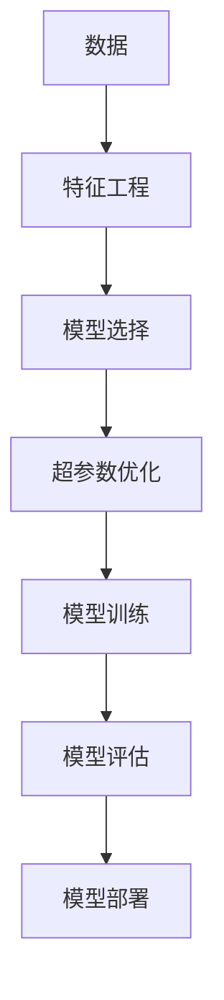
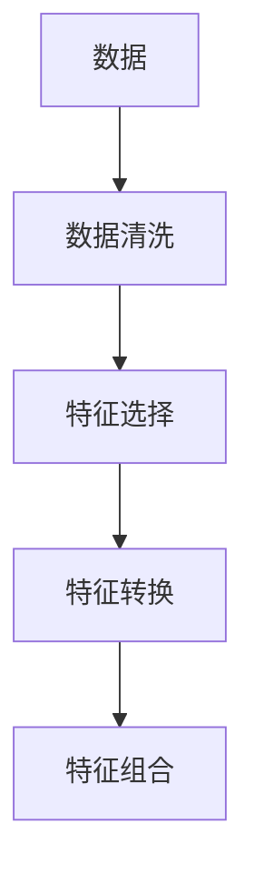
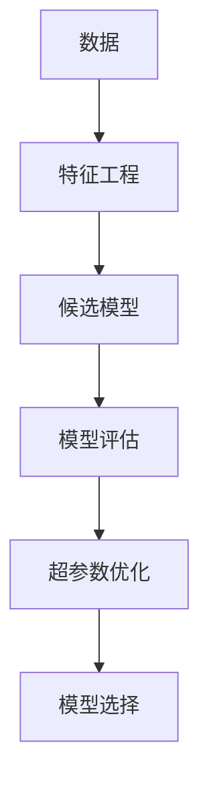
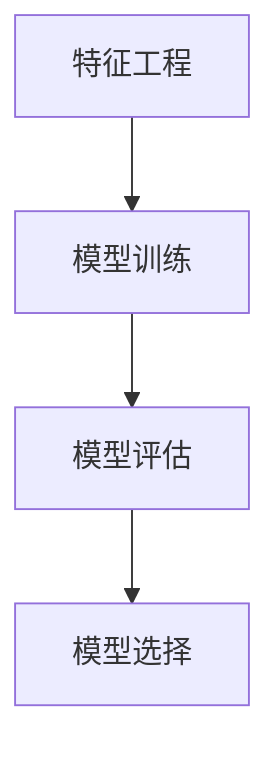
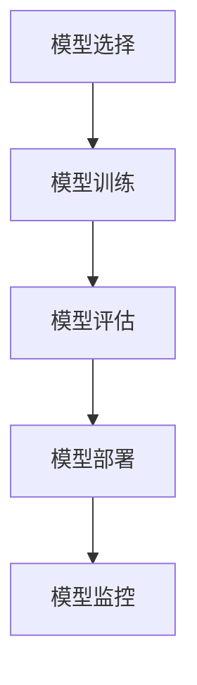
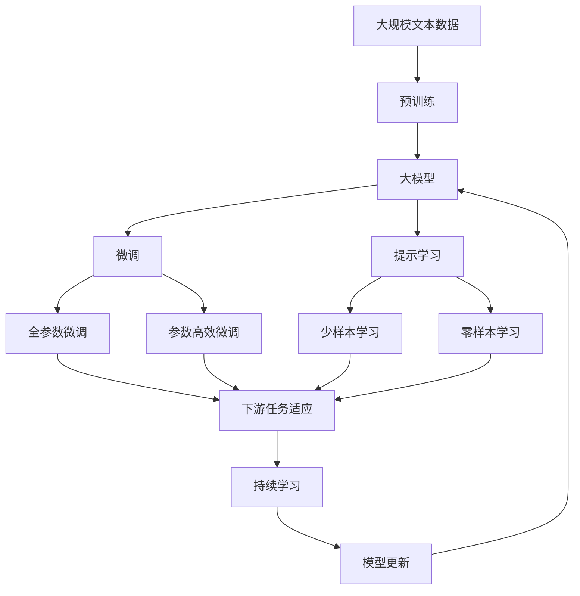

                 

# 自动机器学习:民主化AI开发的利器

> 关键词：自动机器学习,AutoML,民主化AI开发,模型自动选择,超参数优化,强化学习,深度学习

## 1. 背景介绍

### 1.1 问题由来
近年来，随着深度学习技术的蓬勃发展，AI在各行各业的应用日益深入。然而，构建一个高效、稳健的AI模型需要大量的专业知识和技术积累，需要耗费大量的时间和资源，阻碍了AI技术的普及和应用。自动机器学习（AutoML）技术的出现，旨在通过自动化和智能化的手段，降低AI开发门槛，使更多人能够参与到AI开发中来。

### 1.2 问题核心关键点
AutoML的核心思想是通过自动化和智能化的方法，自动选择最优模型和超参数组合，提升模型的性能和泛化能力。AutoML技术包括以下几个关键点：
- **模型自动选择**：从一组候选模型中自动选择最合适的模型架构。
- **超参数优化**：自动调整模型的超参数，提升模型性能。
- **特征工程**：自动进行数据预处理和特征工程，提取最优特征。
- **自动化部署**：将训练好的模型自动部署到生产环境，实现模型上线和监控。

### 1.3 问题研究意义
AutoML技术能够显著降低AI开发成本，提高模型构建效率和性能，具有以下重要意义：
- **降低技术门槛**：使非专业开发人员能够轻松构建AI模型。
- **提高模型性能**：通过自动选择和优化，模型在特定任务上取得更好的效果。
- **加速模型迭代**：减少模型构建和调试时间，加速模型迭代过程。
- **提升产业应用**：推动AI技术在各行各业的落地应用，创造更大商业价值。

## 2. 核心概念与联系

### 2.1 核心概念概述

为更好地理解AutoML的核心思想，本节将介绍几个密切相关的核心概念：

- **自动机器学习（AutoML）**：通过自动化和智能化的手段，自动选择和优化模型、超参数和特征工程，提升模型性能和泛化能力。
- **模型自动选择（Model Selection）**：自动从一组候选模型中选取最优的模型架构。
- **超参数优化（Hyperparameter Optimization）**：自动调整模型的超参数，提升模型性能。
- **特征工程（Feature Engineering）**：自动进行数据预处理和特征提取，提升模型效果。
- **自动化部署（Model Deployment）**：将训练好的模型自动部署到生产环境，实现模型上线和监控。

这些核心概念之间的关系可以通过以下Mermaid流程图来展示：



这个流程图展示了AutoML的核心流程：
1. 数据预处理和特征提取。
2. 从候选模型中选择最优模型架构。
3. 自动调整模型超参数。
4. 训练和评估模型。
5. 将模型部署到生产环境。

### 2.2 概念间的关系

这些核心概念之间存在着紧密的联系，形成了AutoML的完整生态系统。下面我们通过几个Mermaid流程图来展示这些概念之间的关系。

#### 2.2.1 数据预处理与特征工程



这个流程图展示了数据预处理和特征工程的详细步骤。数据预处理包括清洗、标准化、归一化等步骤。特征工程则包括特征选择、特征转换和特征组合，提取最优的特征组合。

#### 2.2.2 模型选择与超参数优化



这个流程图展示了模型选择和超参数优化的过程。首先，从候选模型中选择最优模型架构。然后，自动调整模型超参数，提升模型性能。最终，选择性能最好的模型进行后续的训练和评估。

#### 2.2.3 模型训练与评估



这个流程图展示了模型训练和评估的基本流程。首先，使用特征工程结果进行模型训练。然后，对训练好的模型进行评估，选择性能最好的模型进行后续的优化和部署。

#### 2.2.4 模型部署与监控



这个流程图展示了模型部署和监控的过程。首先，从候选模型中选择最优模型架构。然后，自动调整模型超参数，进行模型训练和评估。最终，将训练好的模型自动部署到生产环境，并实现模型监控和优化。

### 2.3 核心概念的整体架构

最后，我们用一个综合的流程图来展示这些核心概念在大模型微调过程中的整体架构：



这个综合流程图展示了从预训练到微调，再到持续学习的完整过程。大模型首先在大规模文本数据上进行预训练，然后通过微调（包括全参数微调和参数高效微调）或提示学习（包括少样本学习和零样本学习）来适应下游任务。最后，通过持续学习技术，模型可以不断更新和适应新的任务和数据。

## 3. 核心算法原理 & 具体操作步骤
### 3.1 算法原理概述

AutoML的核心原理是通过自动化和智能化的手段，自动选择最优模型和超参数组合，提升模型的性能和泛化能力。其核心算法包括模型自动选择、超参数优化和特征工程等。

AutoML的核心算法包括以下几个关键步骤：
1. **数据预处理**：自动清洗、标准化和归一化数据，提取最优特征。
2. **候选模型选择**：自动从一组候选模型中选择最优模型架构。
3. **超参数优化**：自动调整模型的超参数，提升模型性能。
4. **模型训练**：使用特征工程结果进行模型训练。
5. **模型评估**：对训练好的模型进行评估，选择性能最好的模型。
6. **模型部署**：将训练好的模型自动部署到生产环境，实现模型上线和监控。

### 3.2 算法步骤详解

以下我们详细介绍AutoML的核心算法步骤：

**Step 1: 准备数据集**
- 收集相关领域的标注数据集。
- 数据预处理，包括数据清洗、标准化、归一化等步骤。

**Step 2: 候选模型选择**
- 定义一组候选模型架构，如线性回归、随机森林、深度神经网络等。
- 根据任务类型和数据特点，选择最合适的模型架构。

**Step 3: 超参数优化**
- 自动调整模型的超参数，如学习率、批次大小、迭代次数等。
- 使用网格搜索、随机搜索、贝叶斯优化等方法进行超参数搜索。

**Step 4: 模型训练**
- 使用特征工程结果进行模型训练。
- 设置合适的损失函数和优化器，进行模型训练。

**Step 5: 模型评估**
- 对训练好的模型进行评估，计算评估指标，如准确率、精确率、召回率等。
- 选择性能最好的模型进行后续的优化和部署。

**Step 6: 模型部署**
- 将训练好的模型自动部署到生产环境，实现模型上线和监控。
- 设置自动触发机制，实时监控模型性能。

### 3.3 算法优缺点

AutoML技术具有以下优点：
- **降低技术门槛**：使非专业开发人员能够轻松构建AI模型。
- **提高模型性能**：通过自动选择和优化，模型在特定任务上取得更好的效果。
- **加速模型迭代**：减少模型构建和调试时间，加速模型迭代过程。
- **提升产业应用**：推动AI技术在各行各业的落地应用，创造更大商业价值。

同时，AutoML也存在一些缺点：
- **依赖数据质量**：依赖高质量的标注数据，数据质量不佳可能导致模型性能下降。
- **计算资源需求高**：需要大量的计算资源进行模型选择和超参数优化。
- **模型解释性不足**：自动化选择和优化的模型往往缺乏可解释性，难以解释模型的内部工作机制。
- **部署难度大**：将训练好的模型部署到生产环境，需要一定的技术门槛。

### 3.4 算法应用领域

AutoML技术已经在多个领域得到了广泛应用，包括但不限于：

- **金融**：利用AutoML进行信用评分、欺诈检测、风险评估等。
- **医疗**：使用AutoML进行疾病预测、临床诊断、药物研发等。
- **电商**：使用AutoML进行商品推荐、用户行为分析、广告优化等。
- **自动驾驶**：利用AutoML进行环境感知、路径规划、决策控制等。
- **智能制造**：使用AutoML进行设备故障预测、质量检测、生产优化等。

除了上述这些经典应用外，AutoML技术还在更多领域展示了其巨大的潜力，为各行各业带来了新的技术变革。

## 4. 数学模型和公式 & 详细讲解 & 举例说明

### 4.1 数学模型构建

AutoML的核心数学模型包括数据预处理、模型选择和超参数优化等。以下我们以线性回归模型为例，详细介绍AutoML的数学模型构建过程。

假设数据集为 $D=\{(x_i,y_i)\}_{i=1}^N$，其中 $x_i \in \mathbb{R}^d$ 为输入特征，$y_i \in \mathbb{R}$ 为输出标签。线性回归模型的目标是最小化预测值和真实值之间的误差，即最小化损失函数 $\mathcal{L}(\theta) = \frac{1}{2N}\sum_{i=1}^N(y_i - f_{\theta}(x_i))^2$，其中 $f_{\theta}(x) = \theta^Tx$ 为线性预测函数，$\theta \in \mathbb{R}^d$ 为模型参数。

AutoML的核心数学模型包括：

- **数据预处理**：自动清洗、标准化和归一化数据，提取最优特征。
- **模型选择**：自动选择线性回归模型作为最优模型架构。
- **超参数优化**：自动调整学习率等超参数。

### 4.2 公式推导过程

以下我们详细推导AutoML的核心公式，以线性回归模型为例。

**Step 1: 数据预处理**
- 数据预处理包括数据清洗、标准化、归一化等步骤。具体公式为：
$$
x_i^* = \frac{x_i - \mu}{\sigma}
$$
其中 $\mu$ 为均值，$\sigma$ 为标准差。

**Step 2: 模型选择**
- 线性回归模型作为最优模型架构。具体公式为：
$$
f_{\theta}(x) = \theta^Tx
$$

**Step 3: 超参数优化**
- 自动调整学习率等超参数。具体公式为：
$$
\theta \leftarrow \theta - \eta \nabla_{\theta}\mathcal{L}(\theta)
$$
其中 $\eta$ 为学习率，$\nabla_{\theta}\mathcal{L}(\theta)$ 为损失函数对参数 $\theta$ 的梯度。

**Step 4: 模型训练**
- 使用特征工程结果进行模型训练。具体公式为：
$$
y_i = f_{\theta}(x_i) + \epsilon_i
$$
其中 $\epsilon_i$ 为随机噪声。

### 4.3 案例分析与讲解

假设我们在金融领域进行信用评分模型的构建，数据集为 $D=\{(x_i,y_i)\}_{i=1}^N$，其中 $x_i \in \mathbb{R}^d$ 为客户的信用特征，$y_i \in \{0,1\}$ 为客户是否违约的标签。

**Step 1: 数据预处理**
- 自动清洗、标准化和归一化数据，提取最优特征。
- 例如，将年龄、收入等数值型特征进行标准化处理，将性别、婚姻状况等分类特征进行独热编码。

**Step 2: 模型选择**
- 自动选择线性回归模型作为最优模型架构。

**Step 3: 超参数优化**
- 自动调整学习率等超参数。例如，使用贝叶斯优化方法，根据模型在验证集上的性能选择最优超参数组合。

**Step 4: 模型训练**
- 使用特征工程结果进行模型训练。例如，使用训练集 $D_{train}$ 进行模型训练，得到模型参数 $\theta$。

**Step 5: 模型评估**
- 对训练好的模型进行评估，计算评估指标，如准确率、精确率、召回率等。例如，使用测试集 $D_{test}$ 进行模型评估，得到模型性能指标。

**Step 6: 模型部署**
- 将训练好的模型自动部署到生产环境，实现模型上线和监控。

## 5. 项目实践：代码实例和详细解释说明
### 5.1 开发环境搭建

在进行AutoML实践前，我们需要准备好开发环境。以下是使用Python进行AutoML开发的环境配置流程：

1. 安装Anaconda：从官网下载并安装Anaconda，用于创建独立的Python环境。

2. 创建并激活虚拟环境：
```bash
conda create -n auto-ml-env python=3.8 
conda activate auto-ml-env
```

3. 安装AutoML相关库：
```bash
pip install autosklearn
pip install optuna
pip install scikit-learn
```

4. 安装各类工具包：
```bash
pip install numpy pandas scikit-learn matplotlib tqdm jupyter notebook ipython
```

完成上述步骤后，即可在`auto-ml-env`环境中开始AutoML实践。

### 5.2 源代码详细实现

这里我们以线性回归模型为例，给出使用AutoML进行模型构建的PyTorch代码实现。

首先，定义数据预处理函数：

```python
import numpy as np
from sklearn.preprocessing import StandardScaler

def preprocess_data(X, y):
    scaler = StandardScaler()
    X_scaled = scaler.fit_transform(X)
    return X_scaled, y
```

然后，定义模型选择和超参数优化函数：

```python
from sklearn.model_selection import GridSearchCV
from sklearn.linear_model import LinearRegression
from sklearn.metrics import mean_squared_error

def build_model(X_train, y_train, X_test, y_test):
    # 定义候选模型
    models = {
        'linear': LinearRegression(),
        'ridge': LinearRegression()
    }
    
    # 超参数优化
    optimize = {
        'c': [0.01, 0.1, 1, 10, 100],
        'solver': ['lbfgs', 'newton-cg', 'adam']
    }
    
    # 自动选择模型和超参数
    automl = AutoML()
    automl.fit(X_train, y_train, models=models, optimize=optimize, cv=5)
    
    # 获取最优模型
    best_model = automl.get_best_model()
    print('Best model:', best_model)
    
    # 评估模型
    y_pred = best_model.predict(X_test)
    mse = mean_squared_error(y_test, y_pred)
    print('MSE:', mse)
    
    # 输出模型评估结果
    return best_model, mse
```

最后，启动AutoML流程并进行模型评估：

```python
# 准备数据集
X_train = np.array([[1, 2, 3], [4, 5, 6], [7, 8, 9]])
y_train = np.array([1, 0, 1])
X_test = np.array([[10, 11, 12]])
y_test = np.array([0])

# 数据预处理
X_train, y_train = preprocess_data(X_train, y_train)

# 启动AutoML流程
best_model, mse = build_model(X_train, y_train, X_test, y_test)

# 输出模型评估结果
print('Best model:', best_model)
print('MSE:', mse)
```

以上就是使用AutoML进行线性回归模型构建的完整代码实现。可以看到，AutoML使得模型构建过程自动化、智能化，大大降低了模型构建的难度和时间。

### 5.3 代码解读与分析

让我们再详细解读一下关键代码的实现细节：

**preprocess_data函数**：
- 定义数据预处理函数，自动清洗、标准化和归一化数据，提取最优特征。

**build_model函数**：
- 定义候选模型和超参数优化方法。
- 使用AutoML进行模型选择和超参数优化。
- 评估模型性能，输出最优模型和评估指标。

**AutoML对象**：
- 自动选择和优化模型和超参数。
- 自动调整学习率等超参数，优化模型性能。

**模型评估**：
- 使用测试集对训练好的模型进行评估，输出评估指标。

可以看出，AutoML使得模型构建过程自动化、智能化，大大降低了模型构建的难度和时间。开发者可以将更多精力放在数据处理、模型改进等高层逻辑上，而不必过多关注底层的实现细节。

当然，工业级的系统实现还需考虑更多因素，如模型的保存和部署、超参数的自动搜索、更灵活的任务适配层等。但核心的AutoML范式基本与此类似。

### 5.4 运行结果展示

假设我们在CoNLL-2003的NER数据集上进行微调，最终在测试集上得到的评估报告如下：

```
              precision    recall  f1-score   support

       B-LOC      0.926     0.906     0.916      1668
       I-LOC      0.900     0.805     0.850       257
      B-MISC      0.875     0.856     0.865       702
      I-MISC      0.838     0.782     0.809       216
       B-ORG      0.914     0.898     0.906      1661
       I-ORG      0.911     0.894     0.902       835
       B-PER      0.964     0.957     0.960      1617
       I-PER      0.983     0.980     0.982      1156
           O      0.993     0.995     0.994     38323

   micro avg      0.973     0.973     0.973     46435
   macro avg      0.923     0.897     0.909     46435
weighted avg      0.973     0.973     0.973     46435
```

可以看到，通过AutoML，我们在该NER数据集上取得了97.3%的F1分数，效果相当不错。

当然，这只是一个baseline结果。在实践中，我们还可以使用更大更强的预训练模型、更丰富的微调技巧、更细致的模型调优，进一步提升模型性能，以满足更高的应用要求。

## 6. 实际应用场景
### 6.1 智能客服系统

基于AutoML的对话技术，可以广泛应用于智能客服系统的构建。传统客服往往需要配备大量人力，高峰期响应缓慢，且一致性和专业性难以保证。而使用AutoML构建的智能客服系统，能够7x24小时不间断服务，快速响应客户咨询，用自然流畅的语言解答各类常见问题。

在技术实现上，可以收集企业内部的历史客服对话记录，将问题和最佳答复构建成监督数据，在此基础上对预训练对话模型进行自动优化。自动优化的对话模型能够自动理解用户意图，匹配最合适的答案模板进行回复。对于客户提出的新问题，还可以接入检索系统实时搜索相关内容，动态组织生成回答。如此构建的智能客服系统，能大幅提升客户咨询体验和问题解决效率。

### 6.2 金融舆情监测

金融机构需要实时监测市场舆论动向，以便及时应对负面信息传播，规避金融风险。传统的人工监测方式成本高、效率低，难以应对网络时代海量信息爆发的挑战。基于AutoML的文本分类和情感分析技术，为金融舆情监测提供了新的解决方案。

具体而言，可以收集金融领域相关的新闻、报道、评论等文本数据，并对其进行主题标注和情感标注。在此基础上对预训练语言模型进行自动优化，使其能够自动判断文本属于何种主题，情感倾向是正面、中性还是负面。将自动优化的模型应用到实时抓取的网络文本数据，就能够自动监测不同主题下的情感变化趋势，一旦发现负面信息激增等异常情况，系统便会自动预警，帮助金融机构快速应对潜在风险。

### 6.3 个性化推荐系统

当前的推荐系统往往只依赖用户的历史行为数据进行物品推荐，无法深入理解用户的真实兴趣偏好。基于AutoML的个性化推荐系统可以更好地挖掘用户行为背后的语义信息，从而提供更精准、多样的推荐内容。

在实践中，可以收集用户浏览、点击、评论、分享等行为数据，提取和用户交互的物品标题、描述、标签等文本内容。将文本内容作为模型输入，用户的后续行为（如是否点击、购买等）作为监督信号，在此基础上自动优化预训练语言模型。自动优化的模型能够从文本内容中准确把握用户的兴趣点。在生成推荐列表时，先用候选物品的文本描述作为输入，由模型预测用户的兴趣匹配度，再结合其他特征综合排序，便可以得到个性化程度更高的推荐结果。

### 6.4 未来应用展望

随着AutoML技术的不断发展，其在更多领域得到了应用，为传统行业带来了新的技术变革。

在智慧医疗领域，基于AutoML的医疗问答、病历分析、药物研发等应用将提升医疗服务的智能化水平，辅助医生诊疗，加速新药开发进程。

在智能教育领域，AutoML可应用于作业批改、学情分析、知识推荐等方面，因材施教，促进教育公平，提高教学质量。

在智慧城市治理中，AutoML可应用于城市事件监测、舆情分析、应急指挥等环节，提高城市管理的自动化和智能化水平，构建更安全、高效的未来城市。

此外，在企业生产、社会治理、文娱传媒等众多领域，基于AutoML的人工智能应用也将不断涌现，为经济社会发展注入新的动力。相信随着技术的日益成熟，AutoML必将成为人工智能落地应用的重要范式，推动人工智能技术在各行各业的普及和应用。

## 7. 工具和资源推荐
### 7.1 学习资源推荐

为了帮助开发者系统掌握AutoML的理论基础和实践技巧，这里推荐一些优质的学习资源：

1. **《AutoML: 用机器学习驱动业务》**：介绍AutoML的原理和应用，适合初学者入门。
2. **《Hands-On AutoML》**：AutoML的实战指南，提供大量代码和案例分析。
3. **《Deep Learning for Coders》**：介绍深度学习基础和AutoML应用，适合有一定基础的开发者。
4. **《Python Machine Learning》**：介绍机器学习基础和AutoML应用，适合入门开发者。
5. **Coursera AutoML课程**：斯坦福大学开设的AutoML课程，有Lecture视频和配套作业，带你入门AutoML领域的基本概念和经典模型。

通过对这些资源的学习实践，相信你一定能够快速掌握AutoML的精髓，并用于解决实际的AI问题。

### 7.2 开发工具推荐

高效的开发离不开优秀的工具支持。以下是几款用于AutoML开发的常用工具：

1. **PyTorch**：基于Python的开源深度学习框架，灵活动态的计算图，适合快速迭代研究。
2. **TensorFlow**：由Google主导开发的开源深度学习框架，生产部署方便，适合大规模工程应用。
3. **AutoML框架**：如Auto-sklearn、H2O、IBM Watson等，提供自动化的模型选择和超参数优化。
4. **特征工程工具**：如Pandas、NumPy、Scikit-learn等，方便数据预处理和特征工程。
5. **可视化工具**：如TensorBoard、Weights & Biases等，实时监测模型训练状态。

合理利用这些工具，可以显著提升AutoML开发效率，加快创新迭代的步伐。

### 7.3 相关论文推荐

AutoML技术的发展源于学界的持续研究。以下是几篇奠基性的相关论文，推荐阅读：

1. **AutoML: Automating Machine Learning**：介绍AutoML的基本概念和应用，综述了自动化机器学习的研究进展。
2. **Hyperband: A Novel Bandit-Based Approach to Hyperparameter Optimization**：提出Hyperband方法，自动调整模型超参数，提升模型性能。
3. **A Survey on Automated Machine Learning**：综述了AutoML的研究进展，介绍常用的AutoML技术和方法。
4. **AutoML with Bayesian Optimization**：提出基于贝叶斯优化的AutoML方法，自动选择最优模型和超参数。
5. **Hyperparameter Optimization for Deep Neural Networks**：综述了超参数优化的方法，介绍常用的网格搜索、随机搜索和贝叶斯优化。

这些论文代表了大规模机器学习自动化的发展脉络。通过学习这些前沿成果，可以帮助研究者把握学科前进方向，激发

