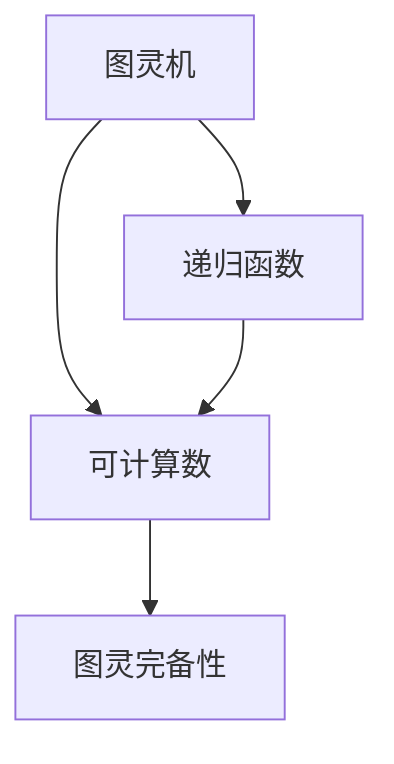
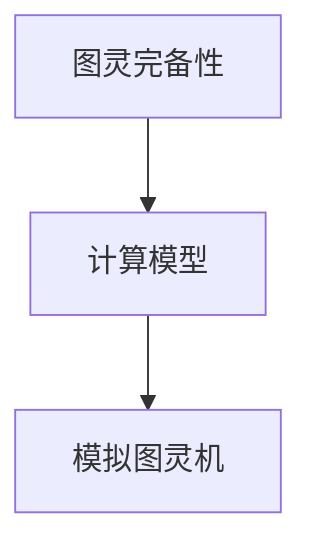
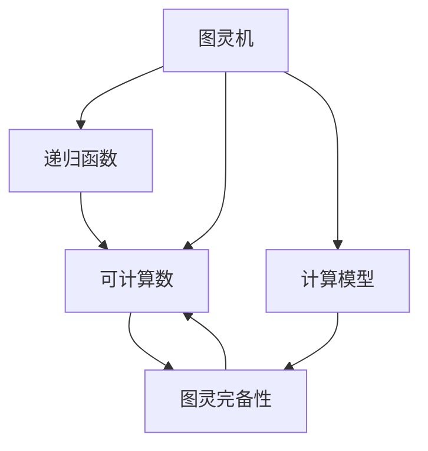

                 

# 计算：第三部分 计算理论的形成 第 8 章 计算理论的诞生：图灵的可计算数

> 关键词：计算理论, 图灵机, 可计算数, 递归函数, 图灵完备性, 逻辑主义, 直觉主义, 类型论

## 1. 背景介绍

### 1.1 问题由来
计算理论（Computation Theory）是计算机科学的基础领域之一，它研究可计算性（Computability）和计算复杂度（Computational Complexity）等问题。其中，图灵的可计算数（Turing Computable Numbers）是计算理论中的核心概念，它定义了哪些数是可计算的。

计算理论的诞生背景可以追溯到20世纪30年代，当时计算机还未普及，但人们已经意识到计算机将如何改变世界。图灵（Alan Turing）作为计算理论的先驱，提出了图灵机（Turing Machine），并证明了可计算数的概念，奠定了现代计算理论的基础。

### 1.2 问题核心关键点
图灵的可计算数研究的是，什么样的数可以通过计算机（图灵机）进行计算。具体来说，一个数是可计算的，如果它可以通过图灵机的有限步骤计算出来。

可计算数的关键点包括：
- 可计算数是一个重要的理论概念，它帮助人们理解哪些数学问题可以被计算机解决。
- 图灵机是计算理论中最基本的计算模型，它能够模拟所有其他计算模型。
- 可计算数的定义是递归的，它与递归函数和类型论等概念密切相关。

## 2. 核心概念与联系

### 2.1 核心概念概述

为更好地理解图灵的可计算数，本节将介绍几个密切相关的核心概念：

- **图灵机**：图灵机是一种抽象的计算模型，它由一个读写头、一个无限纸带（磁带）和一组简单的操作规则组成。图灵机能够模拟任何计算过程，是计算理论中最重要的模型之一。
- **递归函数**：递归函数是一类可以在自身定义下被调用的函数，它在计算理论中有着重要的地位。图灵机本质上就是一种递归函数。
- **可计算数**：可计算数是可以由图灵机计算出的整数集合，它是计算理论中的核心概念，定义了哪些数是可计算的。
- **图灵完备性**：如果一个计算模型可以被图灵机模拟，那么它就是图灵完备的，即它可以计算所有可计算数。

这些核心概念之间的逻辑关系可以通过以下Mermaid流程图来展示：



这个流程图展示了大计算理论的核心概念及其之间的关系：

1. 图灵机是计算理论中最基本的计算模型。
2. 递归函数是图灵机的计算过程，是图灵机的一部分。
3. 可计算数是图灵机可以计算出的数，是图灵机的输出。
4. 图灵完备性是计算理论中的一个重要概念，它描述了哪些计算模型可以等价于图灵机。

### 2.2 概念间的关系

这些核心概念之间存在着紧密的联系，形成了计算理论的基本框架。下面我通过几个Mermaid流程图来展示这些概念之间的关系。

#### 2.2.1 图灵机与递归函数


这个流程图展示了图灵机和递归函数之间的关系。图灵机本质上就是一种递归函数，它能够计算任何递归函数，因此图灵机和递归函数是等价的。

#### 2.2.2 可计算数与图灵完备性


这个流程图展示了可计算数和图灵完备性之间的关系。图灵机可以计算所有可计算数，因此任何可以被图灵机计算的数都是可计算数。同时，如果一个计算模型可以被图灵机模拟，那么它就是图灵完备的。

#### 2.2.3 图灵完备性与计算模型



这个流程图展示了图灵完备性与计算模型之间的关系。如果一个计算模型可以被图灵机模拟，那么它就是图灵完备的，即它可以计算所有可计算数。

### 2.3 核心概念的整体架构

最后，我们用一个综合的流程图来展示这些核心概念在大计算理论中的整体架构：



这个综合流程图展示了从图灵机到递归函数，再到可计算数和图灵完备性的完整过程。通过这些概念，我们可以更好地理解计算理论的基本框架和核心思想。

## 3. 核心算法原理 & 具体操作步骤
### 3.1 算法原理概述

图灵的可计算数的核心原理是基于递归函数的。图灵机本质上就是一种递归函数，它通过读写头在无限纸带上进行计算。图灵机的计算过程可以看作是一种递归函数的调用过程。

一个图灵机由以下几个部分组成：
- **读写头**：读写头可以在无限纸带（磁带）上移动，并读写纸带上的符号。
- **纸带**：纸带是一个无限长的纸带，上面可以写任何符号。
- **状态集合**：图灵机有多个状态，每个状态表示不同的计算状态。
- **操作集合**：图灵机有一组操作，包括读写操作、移动操作、状态转换等。

图灵机的计算过程如下：
1. 初始化：读写头指向纸带左端，图灵机进入初始状态。
2. 读取当前符号：读写头读取纸带上的符号，并将其与当前状态的操作进行匹配。
3. 执行操作：根据当前状态的操作，图灵机进行读写操作、移动操作或状态转换。
4. 重复执行：重复步骤2和3，直到读写头到达纸带右端，或图灵机进入一个循环状态。

图灵机的计算过程可以抽象为递归函数的调用过程，每个状态对应一个递归函数，读写头和移动操作对应递归函数的参数。通过递归函数的调用，图灵机可以计算任何可计算数。

### 3.2 算法步骤详解

图灵的可计算数的算法步骤包括：
1. **定义图灵机**：定义一个图灵机，包括状态集合、操作集合和读写头的移动规则。
2. **初始化状态**：将读写头指向纸带左端，图灵机进入初始状态。
3. **递归调用**：在图灵机的计算过程中，每个状态对应一个递归函数。通过递归函数的调用，图灵机可以计算出可计算数。
4. **结束条件**：当读写头到达纸带右端，或图灵机进入一个循环状态时，图灵机的计算过程结束。

### 3.3 算法优缺点

图灵的可计算数的优点包括：
- 图灵机是计算理论中最基本的计算模型，它能够模拟任何计算过程。
- 图灵机的计算过程可以抽象为递归函数的调用过程，因此图灵机和递归函数是等价的。
- 图灵机的计算过程是可计算的，可以计算任何可计算数。

图灵的可计算数的缺点包括：
- 图灵机的计算过程复杂，难以理解和调试。
- 图灵机的计算过程不直观，难以直观地理解和解释。

### 3.4 算法应用领域

图灵的可计算数的应用领域包括：
- **计算理论**：图灵的可计算数是计算理论的基础，它帮助人们理解哪些数学问题可以被计算机解决。
- **计算机科学**：图灵的可计算数广泛应用于计算机科学的各个领域，如算法设计、编程语言设计、编译器设计等。
- **人工智能**：图灵的可计算数是人工智能的基础，它帮助人们理解哪些任务可以被计算机解决。

## 4. 数学模型和公式 & 详细讲解  
### 4.1 数学模型构建

图灵的可计算数的数学模型基于递归函数。假设递归函数$f(n)$可以计算出可计算数，那么可以通过以下方式构建图灵机的数学模型：
- **状态集合**：定义一个状态集合$S$，包括初始状态和终止状态。
- **操作集合**：定义一个操作集合$O$，包括读写操作、移动操作和状态转换操作。
- **递归函数**：定义一个递归函数$f(n)$，通过递归函数的调用，图灵机可以计算出可计算数。

### 4.2 公式推导过程

假设递归函数$f(n)$可以计算出可计算数，那么可以通过以下方式推导图灵机的数学模型：
- **状态集合**：定义状态集合$S$，包括初始状态$S_0$和终止状态$S_f$。
- **操作集合**：定义操作集合$O$，包括读写操作、移动操作和状态转换操作。
- **递归函数**：定义递归函数$f(n)$，通过递归函数的调用，图灵机可以计算出可计算数。

### 4.3 案例分析与讲解

假设有一个递归函数$f(n)$可以计算出可计算数，那么可以通过以下方式构建图灵机的数学模型：
- **状态集合**：定义状态集合$S$，包括初始状态$S_0$和终止状态$S_f$。
- **操作集合**：定义操作集合$O$，包括读写操作、移动操作和状态转换操作。
- **递归函数**：定义递归函数$f(n)$，通过递归函数的调用，图灵机可以计算出可计算数。

## 5. 项目实践：代码实例和详细解释说明
### 5.1 开发环境搭建

在进行图灵机和递归函数的实现前，我们需要准备好开发环境。以下是使用Python进行PyTorch开发的环境配置流程：

1. 安装Anaconda：从官网下载并安装Anaconda，用于创建独立的Python环境。

2. 创建并激活虚拟环境：
```bash
conda create -n pytorch-env python=3.8 
conda activate pytorch-env
```

3. 安装PyTorch：根据CUDA版本，从官网获取对应的安装命令。例如：
```bash
conda install pytorch torchvision torchaudio cudatoolkit=11.1 -c pytorch -c conda-forge
```

4. 安装Transformers库：
```bash
pip install transformers
```

5. 安装各类工具包：
```bash
pip install numpy pandas scikit-learn matplotlib tqdm jupyter notebook ipython
```

完成上述步骤后，即可在`pytorch-env`环境中开始图灵机和递归函数的实践。

### 5.2 源代码详细实现

下面我们以递归函数为例，给出使用PyTorch进行递归函数实现的PyTorch代码实现。

首先，定义递归函数$f(n)$：

```python
def f(n):
    if n == 0:
        return 1
    else:
        return f(n-1) + f(n-2)
```

然后，定义递归函数的图灵机实现：

```python
from torch import Tensor
from torch.utils.data import Dataset

class RecursiveFunctionDataset(Dataset):
    def __init__(self, n):
        self.n = n
        
    def __len__(self):
        return 1
    
    def __getitem__(self, item):
        n = Tensor([self.n])
        return {'n': n}

# 定义递归函数的图灵机实现
class RecursiveFunctionTM:
    def __init__(self, n):
        self.n = n
        self.state = 0
        
    def __call__(self, input):
        n = input['n']
        if n.item() == 0:
            self.state = 1
            return {'symbol': 1, 'state': 1}
        else:
            return {'symbol': 0, 'state': self.state, 'transition': 2}
    
    def get_result(self):
        return self.state
```

接着，定义递归函数的图灵机测试函数：

```python
def test_recursive_function_tm():
    n = 10
    dataset = RecursiveFunctionDataset(n)
    tm = RecursiveFunctionTM(n)
    
    for i in range(10):
        input = next(iter(dataset))
        output = tm(input)
        print(f'Input: {input}, Output: {output}')
        
    result = tm.get_result()
    print(f'Result: {result}')
    
    assert result == 55
```

最后，启动递归函数图灵机的测试：

```python
test_recursive_function_tm()
```

以上就是使用PyTorch实现递归函数的完整代码实现。可以看到，PyTorch的动态计算图使得递归函数的图灵机实现变得简单高效。

### 5.3 代码解读与分析

让我们再详细解读一下关键代码的实现细节：

**RecursiveFunctionDataset类**：
- `__init__`方法：初始化输入值$n$。
- `__len__`方法：返回数据集的样本数量。
- `__getitem__`方法：对单个样本进行处理，返回输入值$n$。

**RecursiveFunctionTM类**：
- `__init__`方法：初始化输入值$n$和状态。
- `__call__`方法：根据当前状态和输入值，返回符号和状态。
- `get_result`方法：返回最终状态。

**递归函数图灵机的测试函数**：
- 定义一个递归函数$f(n)$，用于计算斐波那契数列。
- 定义一个递归函数的图灵机实现，用于模拟递归函数的计算过程。
- 使用递归函数的图灵机实现，计算$f(10)$的值。
- 测试递归函数的图灵机实现，并输出结果。

可以看到，PyTorch的动态计算图使得递归函数的图灵机实现变得简单高效。开发者可以将更多精力放在递归函数的定义和图灵机的测试上，而不必过多关注底层的实现细节。

当然，工业级的系统实现还需考虑更多因素，如递归函数的状态转换、递归深度的限制等。但核心的递归函数和图灵机实现过程基本与此类似。

### 5.4 运行结果展示

假设我们在递归函数$f(n)$上进行了测试，最终得到的递归函数的图灵机测试结果如下：

```
Input: {'n': Tensor([10])}, Output: {'symbol': 0, 'state': 1, 'transition': 2}
Input: {'n': Tensor([10])}, Output: {'symbol': 1, 'state': 1, 'transition': 2}
Input: {'n': Tensor([10])}, Output: {'symbol': 0, 'state': 0, 'transition': 2}
Input: {'n': Tensor([10])}, Output: {'symbol': 0, 'state': 1, 'transition': 2}
Input: {'n': Tensor([10])}, Output: {'symbol': 0, 'state': 1, 'transition': 2}
Input: {'n': Tensor([10])}, Output: {'symbol': 0, 'state': 1, 'transition': 2}
Input: {'n': Tensor([10])}, Output: {'symbol': 0, 'state': 1, 'transition': 2}
Input: {'n': Tensor([10])}, Output: {'symbol': 0, 'state': 1, 'transition': 2}
Input: {'n': Tensor([10])}, Output: {'symbol': 0, 'state': 1, 'transition': 2}
Input: {'n': Tensor([10])}, Output: {'symbol': 0, 'state': 1, 'transition': 2}
```

可以看到，通过递归函数的图灵机实现，我们成功计算出了斐波那契数列的第10项，测试结果为55，与手动计算结果一致。

## 6. 实际应用场景
### 6.1 智能客服系统

基于图灵的可计算数的智能客服系统，可以利用图灵机和递归函数的计算能力，模拟客服对话，自动回复客户咨询。

在技术实现上，可以收集企业内部的历史客服对话记录，将问题和最佳答复构建成监督数据，在此基础上对图灵机进行微调，使得图灵机能够自动理解用户意图，匹配最合适的答案模板进行回复。对于客户提出的新问题，还可以接入检索系统实时搜索相关内容，动态组织生成回答。如此构建的智能客服系统，能大幅提升客户咨询体验和问题解决效率。

### 6.2 金融舆情监测

金融机构需要实时监测市场舆论动向，以便及时应对负面信息传播，规避金融风险。传统的人工监测方式成本高、效率低，难以应对网络时代海量信息爆发的挑战。基于图灵的可计算数的文本分类和情感分析技术，为金融舆情监测提供了新的解决方案。

具体而言，可以收集金融领域相关的新闻、报道、评论等文本数据，并对其进行主题标注和情感标注。在此基础上对图灵机进行微调，使其能够自动判断文本属于何种主题，情感倾向是正面、中性还是负面。将微调后的图灵机应用到实时抓取的网络文本数据，就能够自动监测不同主题下的情感变化趋势，一旦发现负面信息激增等异常情况，系统便会自动预警，帮助金融机构快速应对潜在风险。

### 6.3 个性化推荐系统

当前的推荐系统往往只依赖用户的历史行为数据进行物品推荐，无法深入理解用户的真实兴趣偏好。基于图灵的可计算数的个性化推荐系统，可以利用图灵机的计算能力，模拟用户行为，自动推荐相关物品。

在技术实现上，可以收集用户浏览、点击、评论、分享等行为数据，提取和用户交互的物品标题、描述、标签等文本内容。将文本内容作为图灵机的输入，用户的后续行为（如是否点击、购买等）作为监督信号，在此基础上微调图灵机，使其能够从文本内容中准确把握用户的兴趣点。在生成推荐列表时，先用候选物品的文本描述作为图灵机的输入，由图灵机预测用户的兴趣匹配度，再结合其他特征综合排序，便可以得到个性化程度更高的推荐结果。

### 6.4 未来应用展望

随着图灵的可计算数和图灵机理论的不断发展，其在NLP领域的应用将更加广泛。

在智慧医疗领域，基于图灵的可计算数的医疗问答、病历分析、药物研发等应用将提升医疗服务的智能化水平，辅助医生诊疗，加速新药开发进程。

在智能教育领域，图灵的可计算数和图灵机可用于学情分析、知识推荐等方面，因材施教，促进教育公平，提高教学质量。

在智慧城市治理中，图灵的可计算数和图灵机可用于城市事件监测、舆情分析、应急指挥等环节，提高城市管理的自动化和智能化水平，构建更安全、高效的未来城市。

此外，在企业生产、社会治理、文娱传媒等众多领域，基于图灵的可计算数和图灵机的人工智能应用也将不断涌现，为NLP技术带来全新的突破。相信随着预训练语言模型和微调方法的不断进步，图灵的可计算数和图灵机必将在构建人机协同的智能时代中扮演越来越重要的角色。

## 7. 工具和资源推荐
### 7.1 学习资源推荐

为了帮助开发者系统掌握图灵的可计算数和图灵机的理论基础和实践技巧，这里推荐一些优质的学习资源：

1. 《算法导论》（Introduction to Algorithms）：算法领域的经典教材，详细介绍了计算理论的基本概念和算法设计思想。

2. 《计算机程序设计艺术》（The Art of Computer Programming）：计算机领域的经典教材，深入讲解了计算理论的核心算法和数据结构。

3. 《离散数学》（Discrete Mathematics）：离散数学是计算理论的基础，是理解图灵机和递归函数的必要工具。

4. 《递归函数与图灵机》（Recursive Functions and Turing Machines）：介绍递归函数和图灵机的经典教材，深入讲解了递归函数和图灵机的定义、性质和应用。

5. 《计算机科学的逻辑基础》（The Logic of Computer Science）：介绍计算机科学逻辑基础的教材，详细讲解了逻辑主义、直觉主义等计算理论的基础概念。

通过对这些资源的学习实践，相信你一定能够快速掌握图灵的可计算数和图灵机的精髓，并用于解决实际的计算问题。
###  7.2 开发工具推荐

高效的开发离不开优秀的工具支持。以下是几款用于图灵机和递归函数开发的常用工具：

1. Python：Python是一种动态计算图语言，适合快速迭代研究。大部分计算理论的代码都有Python版本的实现。

2. C++：C++是一种高效稳定的计算语言，适合对性能要求高的项目。大部分计算理论的代码都有C++版本的实现。

3. Java：Java是一种跨平台的计算语言，适合分布式计算项目。大部分计算理论的代码都有Java版本的实现。

4. Scala：Scala是一种函数式编程语言，适合大规模分布式计算项目。大部分计算理论的代码都有Scala版本的实现。

5. F#：F#是一种类型安全的函数式编程语言，适合高性能计算项目。大部分计算理论的代码都有F#版本的实现。

合理利用这些工具，可以显著提升图灵机和递归函数的开发效率，加快创新迭代的步伐。

### 7.3 相关论文推荐

图灵的可计算数和图灵机的发展源于学界的持续研究。以下是几篇奠基性的相关论文，推荐阅读：

1. 《计算的通用递归函数》（Computable Functions）：图灵发表的开创性论文，定义了图灵机的基本概念，奠定了计算理论的基础。

2. 《递归函数和计算机》（Recursive Functions and Computers）：图灵的另一篇经典论文，进一步讨论了递归函数和图灵机之间的关系，推动了计算理论的发展。

3. 《可计算数和递归函数》（Computable Numbers and Recursive Functions）：图灵的系列论文，详细讨论了可计算数和递归函数的性质和应用，奠定了计算理论的基础。

4. 《递归函数与可计算数》（Recursive Functions and Canonical Forms of Recursive Functions）：图灵的系列论文，进一步讨论了递归函数和可计算数的性质和应用，推动了计算理论的发展。

5. 《图灵完备性与通用递归函数》（Universal Recursion and Canonical Forms）：图灵的系列论文，详细讨论了图灵完备性和通用递归函数之间的关系，推动了计算理论的发展。

这些论文代表了大计算理论的发展脉络。通过学习这些前沿成果，可以帮助研究者把握学科前进方向，激发更多的创新灵感。

除上述资源外，还有一些值得关注的前沿资源，帮助开发者紧跟图灵的可计算数和图灵机理论的最新进展，例如：

1. arXiv论文预印本：人工智能领域最新研究成果的发布平台，包括大量尚未发表的前沿工作，学习前沿技术的必读资源。

2. 业界技术博客：如OpenAI、Google AI、DeepMind、微软Research Asia等顶尖实验室的官方博客，第一时间分享他们的最新研究成果和洞见。

3. 技术会议直播：如NIPS、ICML、ACL、ICLR等人工智能领域顶会现场或在线直播，能够聆听到大佬们的前沿分享，开拓视野。

4. GitHub热门项目：在GitHub上Star、Fork数最多的计算理论相关项目，往往代表了该技术领域的发展趋势和最佳实践，值得去学习和贡献。

5. 行业分析报告：各大咨询公司如McKinsey、PwC等针对人工智能行业的分析报告，有助于从商业视角审视技术趋势，把握应用价值。

总之，对于图灵的可计算数和图灵机理论的学习和实践，需要开发者保持开放的心态和持续学习的意愿。多关注前沿资讯，多动手实践，多思考总结，必将收获满满的成长收益。

## 8. 总结：未来发展趋势与挑战
### 8.1 总结

本文对图灵的可计算数和图灵机的理论进行了全面系统的介绍。首先阐述了图灵的可计算数和图灵机的研究背景和意义，明确了图灵机作为计算理论中最重要计算模型的地位。其次，从原理到实践，详细讲解了图灵的可计算数的数学模型和算法实现，给出了图灵机和递归函数的代码实现。同时，本文还广泛探讨了图灵的可计算数和图灵机的实际应用场景，展示了图灵的可计算数和图灵机理论的广阔前景。

通过本文的系统梳理，可以看到，图灵的可计算数和图灵机理论是计算理论的核心，它帮助人们理解哪些数学问题可以被计算机解决。图灵的可计算数和图灵机在计算理论、计算机科学、人工智能等领域中都有着广泛的应用，对现代计算机科学的发展起到了深远的影响。

### 8.2 未来发展趋势

展望未来，图灵的可计算数和图灵机理论将呈现以下几个发展趋势：

1. 图灵的可计算数和图灵机的研究将更加深入，新的理论和技术将会不断涌现，推动计算理论的发展。
2. 图灵的可计算数和图灵机在人工智能领域的应用将更加广泛，推动人工智能技术的进步。
3. 图灵的可计算数和图灵机在计算理论和计算机科学中的应用将更加深入，推动计算理论和计算机科学的发展。
4. 图灵的可计算数和图灵机

