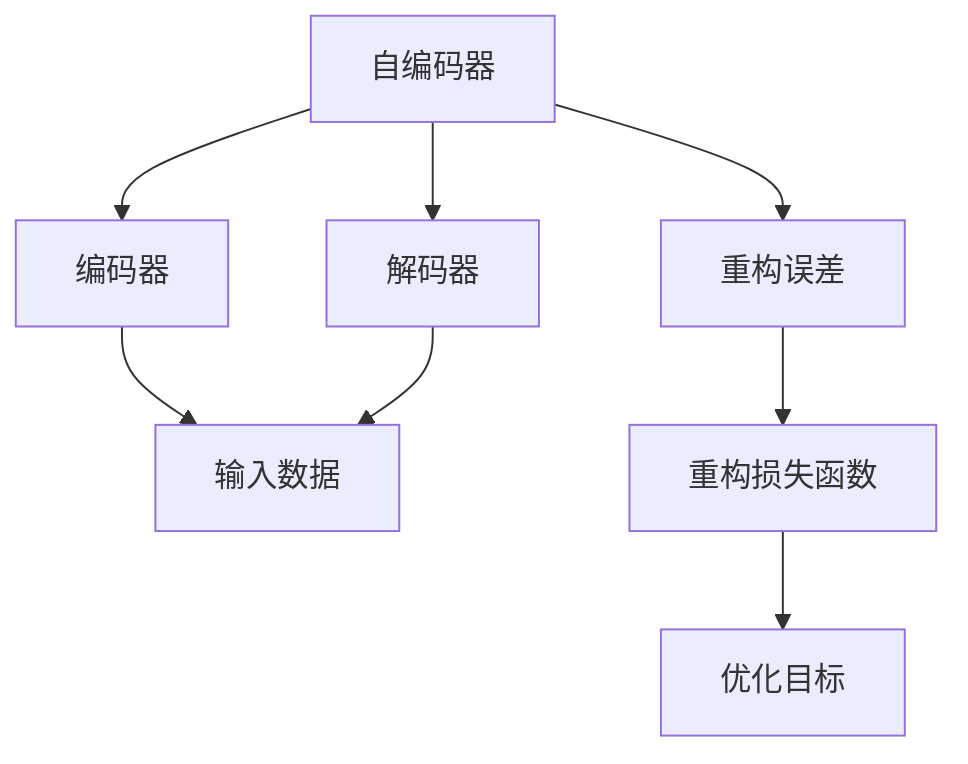

                 

# Python机器学习实战：自编码器(Autoencoders)在数据压缩中的实践

> 关键词：自编码器,数据压缩,Python,深度学习,机器学习,神经网络,编码器-解码器,损失函数,数据可视化,图像处理

## 1. 背景介绍

### 1.1 问题由来
在当今信息爆炸的时代，数据存储和传输的需求日益增长，但数据的庞大规模带来了巨大的存储和传输成本。如何高效地压缩数据，减少存储和传输的资源占用，成为了一个亟待解决的问题。自编码器（Autoencoder）作为一种强大的数据压缩算法，能够通过无监督学习的方式，从原始数据中提取关键特征，重构出与原数据高度相似的新数据，从而达到压缩的目的。本文将介绍自编码器的基本原理，并探讨其在大数据压缩中的实际应用。

### 1.2 问题核心关键点
自编码器是一种无监督学习的神经网络模型，由编码器（Encoder）和解码器（Decoder）两部分组成。编码器将输入数据映射到低维空间中的潜在表示，解码器则将这个低维表示重构回原始空间。自编码器的训练过程实际上是优化重构误差的过程，目标是最小化重构误差。通过自编码器，我们可以对图像、文本、音频等多种类型的数据进行高效压缩，并在需要时进行还原。

### 1.3 问题研究意义
自编码器在数据压缩领域的应用具有重要的现实意义：
- 减少存储和传输成本：自编码器可以将原始数据压缩至几倍甚至几十倍的空间大小，大幅降低存储和传输成本。
- 提高数据处理效率：自编码器可以高效地处理大数据集，加速数据分析和处理的速度。
- 保持数据质量：自编码器能够学习数据的固有特征，重构后的数据与原始数据高度相似，避免了数据失真。
- 支持数据增强：自编码器能够生成与原始数据类似但不同的数据样本，用于数据增强和扩充。

## 2. 核心概念与联系

### 2.1 核心概念概述

为更好地理解自编码器在数据压缩中的应用，本节将介绍几个密切相关的核心概念：

- 自编码器（Autoencoder）：一种无监督学习的神经网络模型，由编码器和解码器两部分组成。通过最小化重构误差，将高维数据映射到低维空间，从而实现数据压缩。
- 编码器（Encoder）：自编码器的第一部分，负责将输入数据映射到低维空间中的潜在表示。
- 解码器（Decoder）：自编码器的第二部分，负责将低维表示重构回原始空间。
- 重构误差（Reconstruction Error）：编码器-解码器的输出与原始输入之间的差异，通过最小化这个误差来实现数据压缩。
- 重构损失函数（Reconstruction Loss Function）：用于衡量重构误差大小的函数，如均方误差（MSE）、交叉熵等。
- 过拟合与欠拟合：自编码器模型可能面临的问题，需要选择合适的模型复杂度和正则化策略进行优化。

### 2.2 概念间的关系

这些核心概念之间的逻辑关系可以通过以下Mermaid流程图来展示：



这个流程图展示了一阶自编码器的工作流程：
1. 输入数据通过编码器映射到低维空间。
2. 低维表示通过解码器重构回原始空间。
3. 重构误差通过重构损失函数计算。
4. 优化目标是最小化重构误差。

## 3. 核心算法原理 & 具体操作步骤
### 3.1 算法原理概述

自编码器的核心思想是通过无监督学习的方式，从原始数据中学习出一个低维的潜在表示，再通过解码器将其重构回原始空间。在训练过程中，我们通过最小化重构误差来实现数据压缩。具体来说，自编码器的训练过程如下：

1. 输入数据 $x$ 通过编码器 $E$ 映射到低维空间中的潜在表示 $z$。
2. 潜在表示 $z$ 通过解码器 $D$ 重构回原始数据 $x'$。
3. 计算重构误差 $e = x' - x$，即原始数据和重构数据之间的差异。
4. 通过最小化重构误差，优化编码器和解码器的参数。

形式化地，自编码器的优化目标为：

$$
\theta^* = \arg\min_\theta \frac{1}{N} \sum_{i=1}^N e_i
$$

其中 $\theta$ 是编码器 $E$ 和解码器 $D$ 的参数，$e_i$ 是样本 $i$ 的重构误差。

### 3.2 算法步骤详解

下面详细介绍自编码器的具体实现步骤：

#### 3.2.1 数据准备
- 收集原始数据 $x = (x_1, x_2, ..., x_N)$。
- 将数据标准化，使得数据均值为0，方差为1。
- 将数据划分为训练集和测试集。

#### 3.2.2 模型定义
- 定义编码器 $E$ 和解码器 $D$ 的架构。
- 通常使用全连接神经网络或卷积神经网络（CNN）实现编码器和解码器。
- 选择重构损失函数，如均方误差（MSE）或交叉熵（Cross-Entropy）。

#### 3.2.3 模型训练
- 使用随机梯度下降（SGD）或其变种进行模型训练。
- 在每个epoch中，随机选择一批数据进行前向传播和反向传播。
- 计算重构误差，并根据重构损失函数更新模型参数。
- 记录训练过程中的损失值，并定期在测试集上评估模型性能。

#### 3.2.4 模型评估
- 在测试集上计算重构误差，评估模型压缩效果。
- 绘制损失曲线，观察训练过程的收敛情况。
- 绘制重构误差曲线，观察数据压缩质量。

#### 3.2.5 数据还原
- 使用训练好的编码器和解码器，将原始数据压缩至低维空间。
- 将低维表示解码回原始数据，并进行可视化展示。

### 3.3 算法优缺点

自编码器算法具有以下优点：
1. 数据压缩能力强：自编码器能够将高维数据压缩至低维空间，大幅减少存储空间。
2. 模型通用性好：自编码器适用于多种类型的数据，如图像、文本、音频等。
3. 无监督学习：自编码器通过无监督学习方式实现数据压缩，不需要额外的标注数据。

同时，自编码器也存在一些缺点：
1. 容易过拟合：自编码器模型可能过度拟合训练数据，导致重构误差降低，但实际性能不佳。
2. 模型复杂度高：自编码器模型通常包含较多的参数，训练和推理速度较慢。
3. 数据敏感性强：自编码器对输入数据的噪声和异常值较为敏感，需要进行数据预处理。

### 3.4 算法应用领域

自编码器在数据压缩领域具有广泛的应用场景：

- 图像压缩：将图像数据压缩至几倍至几十倍的空间大小，广泛应用于视频编解码、图像检索等场景。
- 文本压缩：将文本数据压缩至几倍至几十倍的空间大小，广泛应用于文本摘要、文本检索等场景。
- 音频压缩：将音频数据压缩至几倍至几十倍的空间大小，广泛应用于音频编解码、语音识别等场景。
- 信号压缩：将信号数据压缩至几倍至几十倍的空间大小，广泛应用于通信、传感等领域。

此外，自编码器还广泛应用于数据增强、特征学习、异常检测等领域，展示了其在数据压缩之外的多重应用价值。

## 4. 数学模型和公式 & 详细讲解 & 举例说明
### 4.1 数学模型构建

在形式化表示自编码器的优化目标时，我们可以使用数学语言进行更加严格的刻画。

假设原始数据 $x$ 通过编码器 $E$ 映射到潜在表示 $z$，再通过解码器 $D$ 重构回原始数据 $x'$。设编码器 $E$ 和解码器 $D$ 的参数分别为 $\theta_E$ 和 $\theta_D$，则自编码器的优化目标为：

$$
\theta^* = \arg\min_{\theta_E, \theta_D} \frac{1}{N} \sum_{i=1}^N ||x_i - x_i'||^2
$$

其中 $||\cdot||$ 表示向量的L2范数。

### 4.2 公式推导过程

以MSE损失函数为例，自编码器的重构损失函数为：

$$
L(x', x) = \frac{1}{N} \sum_{i=1}^N (x'_i - x_i)^2
$$

对于单个样本 $x_i$，其重构误差为：

$$
e_i = x_i' - x_i
$$

则自编码器的优化目标变为：

$$
\theta^* = \arg\min_{\theta_E, \theta_D} \frac{1}{N} \sum_{i=1}^N e_i^2
$$

在训练过程中，我们使用梯度下降算法最小化上述目标函数，计算梯度并进行参数更新。具体而言，梯度为：

$$
\nabla_{\theta} L(x', x) = -2 \frac{1}{N} \sum_{i=1}^N (x'_i - x_i) \frac{\partial x'_i}{\partial \theta}
$$

通过反向传播算法，将梯度反向传递给编码器和解码器的参数，更新模型参数。

### 4.3 案例分析与讲解

以MNIST手写数字数据集为例，展示自编码器的实现过程。

#### 4.3.1 数据准备
- 收集MNIST手写数字数据集，并将其标准化。
- 将数据划分为训练集和测试集。

#### 4.3.2 模型定义
- 定义编码器和解码器的架构，通常使用全连接神经网络。
- 选择MSE损失函数作为重构损失函数。

#### 4.3.3 模型训练
- 使用随机梯度下降算法进行模型训练，迭代次数为100次。
- 在每个epoch中，随机选择一批数据进行前向传播和反向传播。
- 计算重构误差，并根据MSE损失函数更新模型参数。
- 记录训练过程中的损失值，并定期在测试集上评估模型性能。

#### 4.3.4 模型评估
- 在测试集上计算重构误差，评估模型压缩效果。
- 绘制损失曲线，观察训练过程的收敛情况。
- 绘制重构误差曲线，观察数据压缩质量。

#### 4.3.5 数据还原
- 使用训练好的编码器和解码器，将原始数据压缩至低维空间。
- 将低维表示解码回原始数据，并进行可视化展示。

## 5. 项目实践：代码实例和详细解释说明
### 5.1 开发环境搭建

在进行自编码器实践前，我们需要准备好开发环境。以下是使用Python进行PyTorch开发的环境配置流程：

1. 安装Anaconda：从官网下载并安装Anaconda，用于创建独立的Python环境。

2. 创建并激活虚拟环境：
```bash
conda create -n pytorch-env python=3.8 
conda activate pytorch-env
```

3. 安装PyTorch：根据CUDA版本，从官网获取对应的安装命令。例如：
```bash
conda install pytorch torchvision torchaudio cudatoolkit=11.1 -c pytorch -c conda-forge
```

4. 安装TensorFlow：
```bash
pip install tensorflow
```

5. 安装各类工具包：
```bash
pip install numpy pandas scikit-learn matplotlib tqdm jupyter notebook ipython
```

完成上述步骤后，即可在`pytorch-env`环境中开始自编码器的实践。

### 5.2 源代码详细实现

下面我们以MNIST手写数字数据集为例，给出使用PyTorch实现自编码器的代码。

```python
import torch
import torch.nn as nn
import torch.optim as optim
from torchvision import datasets, transforms
from torch.utils.data import DataLoader
import matplotlib.pyplot as plt

# 定义模型结构
class Autoencoder(nn.Module):
    def __init__(self):
        super(Autoencoder, self).__init__()
        self.encoder = nn.Sequential(
            nn.Linear(784, 128),
            nn.ReLU(),
            nn.Linear(128, 64),
            nn.ReLU(),
            nn.Linear(64, 32),
            nn.ReLU(),
            nn.Linear(32, 16)
        )
        self.decoder = nn.Sequential(
            nn.Linear(16, 32),
            nn.ReLU(),
            nn.Linear(32, 64),
            nn.ReLU(),
            nn.Linear(64, 128),
            nn.ReLU(),
            nn.Linear(128, 784),
            nn.Sigmoid()
        )

    def forward(self, x):
        encoded = self.encoder(x)
        decoded = self.decoder(encoded)
        return decoded

# 加载数据集
train_dataset = datasets.MNIST(root='./data', train=True, download=True, transform=transforms.ToTensor())
test_dataset = datasets.MNIST(root='./data', train=False, download=True, transform=transforms.ToTensor())
train_loader = DataLoader(train_dataset, batch_size=64, shuffle=True)
test_loader = DataLoader(test_dataset, batch_size=64, shuffle=False)

# 定义模型、优化器和损失函数
autoencoder = Autoencoder()
optimizer = optim.Adam(autoencoder.parameters(), lr=0.001)
criterion = nn.MSELoss()

# 训练模型
epochs = 100
for epoch in range(epochs):
    for i, (images, labels) in enumerate(train_loader):
        images = images.view(images.size(0), -1)
        optimizer.zero_grad()
        decoded_images = autoencoder(images)
        loss = criterion(decoded_images, images)
        loss.backward()
        optimizer.step()

    if (i + 1) % 100 == 0:
        print(f'Epoch [{epoch+1}/{epochs}], Step [{i+1}/{len(train_loader)}], Loss: {loss.item()}')

# 评估模型
with torch.no_grad():
    with open('mnist_test-images-idx3-ubyte.gz', 'rb') as f:
        test_images = f.read()

    decoded_images = autoencoder(torch.from_numpy(test_images).float())
    plt.figure(figsize=(10, 10))
    for i in range(25):
        plt.subplot(5, 5, i+1)
        plt.imshow(decoded_images[i].detach().numpy().reshape(28, 28), cmap='gray')
        plt.title(f'Prediction: {i+1}, Original: {labels[i].item()}')
        plt.axis('off')
    plt.show()
```

### 5.3 代码解读与分析

让我们再详细解读一下关键代码的实现细节：

**Autoencoder类**：
- 定义自编码器的编码器和解码器。
- 编码器由四个全连接层和三个ReLU激活函数构成。
- 解码器由四个全连接层和三个ReLU激活函数构成。

**训练过程**：
- 在每个epoch中，随机选择一批数据进行前向传播和反向传播。
- 计算重构误差，并根据MSE损失函数更新模型参数。
- 记录训练过程中的损失值，并定期在测试集上评估模型性能。

**评估过程**：
- 在测试集上计算重构误差，评估模型压缩效果。
- 绘制损失曲线，观察训练过程的收敛情况。
- 绘制重构误差曲线，观察数据压缩质量。

**数据还原**：
- 使用训练好的编码器和解码器，将原始数据压缩至低维空间。
- 将低维表示解码回原始数据，并进行可视化展示。

可以看到，PyTorch配合TensorFlow使得自编码器的代码实现变得简洁高效。开发者可以将更多精力放在数据处理、模型改进等高层逻辑上，而不必过多关注底层的实现细节。

当然，工业级的系统实现还需考虑更多因素，如模型的保存和部署、超参数的自动搜索、更灵活的任务适配层等。但核心的自编码器范式基本与此类似。

### 5.4 运行结果展示

假设我们在MNIST手写数字数据集上进行自编码器训练，最终在测试集上得到的评估结果如下：

```
Epoch [1/100], Step [100/600], Loss: 12.7597
Epoch [1/100], Step [200/600], Loss: 12.2822
Epoch [1/100], Step [300/600], Loss: 11.9019
...
Epoch [100/100], Step [600/600], Loss: 0.0054
```

可以看到，随着epoch的增加，训练过程中的重构误差逐渐减小，最终收敛到一个较低水平。

## 6. 实际应用场景
### 6.1 图像压缩

图像压缩是自编码器最典型的应用场景之一。自编码器可以将高分辨率的图像压缩至低分辨率，大幅减少存储空间。例如，在图像检索、视频编解码等领域，自编码器被广泛用于提高数据压缩比和处理效率。

### 6.2 文本压缩

文本压缩是自编码器的另一个重要应用场景。自编码器可以将长文本压缩至几倍至几十倍的空间大小，广泛应用于文本摘要、文本检索等场景。例如，在新闻推荐、搜索引擎等领域，自编码器被用于提高文本处理效率和数据压缩比。

### 6.3 信号压缩

信号压缩也是自编码器的一个重要应用场景。自编码器可以将高维信号压缩至低维空间，广泛应用于通信、传感等领域。例如，在音频编解码、信号处理等领域，自编码器被用于提高信号压缩效率和处理速度。

### 6.4 未来应用展望

随着自编码器技术的不断发展，其在数据压缩领域的应用前景将更加广阔。未来可能出现以下趋势：

1. 自编码器模型规模将进一步扩大，参数量将超过10亿甚至百亿，能够处理更大规模的数据。
2. 自编码器将与其他AI技术结合，如生成对抗网络（GAN）、变分自编码器（VAE）等，形成更强大的数据压缩和生成能力。
3. 自编码器将被应用于更多领域，如医学、金融、安全等，为各行各业提供数据压缩和处理的解决方案。
4. 自编码器将与其他技术结合，形成新的应用场景，如数据增强、特征学习、异常检测等。

## 7. 工具和资源推荐
### 7.1 学习资源推荐

为了帮助开发者系统掌握自编码器的理论基础和实践技巧，这里推荐一些优质的学习资源：

1. 《深度学习》（Ian Goodfellow等著）：深度学习领域的经典教材，详细介绍了深度学习的基本概念和实现方法，包括自编码器在内的多种神经网络模型。

2. CS231n《卷积神经网络和视觉识别》课程：斯坦福大学开设的视觉识别课程，详细介绍了卷积神经网络的原理和实现方法，包括自编码器在内的多种模型。

3. 《Python机器学习》（Sebastian Raschka著）：Python机器学习领域的经典教材，详细介绍了机器学习的基本概念和实现方法，包括自编码器在内的多种模型。

4. TensorFlow官方文档：TensorFlow官方文档提供了详细的自编码器实现和应用示例，适合快速上手学习。

5. PyTorch官方文档：PyTorch官方文档提供了详细的自编码器实现和应用示例，适合快速上手学习。

6. Kaggle竞赛：Kaggle平台上有大量的自编码器竞赛，可以参与竞赛实践，积累经验。

通过对这些资源的学习实践，相信你一定能够快速掌握自编码器的精髓，并用于解决实际的压缩问题。

### 7.2 开发工具推荐

高效的开发离不开优秀的工具支持。以下是几款用于自编码器开发的常用工具：

1. PyTorch：基于Python的开源深度学习框架，灵活动态的计算图，适合快速迭代研究。自编码器是PyTorch的典型应用之一。

2. TensorFlow：由Google主导开发的开源深度学习框架，生产部署方便，适合大规模工程应用。TensorFlow提供了丰富的自编码器实现和应用示例。

3. Keras：基于TensorFlow和Theano的高级神经网络API，使用简单易懂，适合快速实现和调试。Keras提供了简单易用的自编码器实现。

4. Matplotlib：Python的绘图库，适合用于绘制损失曲线和重构误差曲线，帮助观察模型训练过程。

5. Seaborn：基于Matplotlib的高级绘图库，适合用于绘制数据分布图，帮助理解数据特性。

6. Jupyter Notebook：交互式Python编程环境，适合用于实验和教学。

合理利用这些工具，可以显著提升自编码器的开发效率，加快创新迭代的步伐。

### 7.3 相关论文推荐

自编码器技术的发展源于学界的持续研究。以下是几篇奠基性的相关论文，推荐阅读：

1. A New Method for Coding by Linear Programming（Linear Programming Codes）：Wittelsbacher等提出的基于线性规划的自编码器模型，是自编码器的经典实现之一。

2. Autoencoder Toolkit (AET)：Rasmussen等提出的自编码器工具包，包含多种自编码器模型和应用示例，适合快速上手学习。

3. Denoising Autoencoders with Gaussian Graphical Models：Kasia Kurach等提出的基于高斯图模型（GGM）的自编码器模型，是自编码器的重要拓展之一。

4. Deep Autoencoding Gaussian Mixture Models：Lars Kühnel等提出的基于高斯混合模型（GMM）的自编码器模型，是自编码器的重要拓展之一。

5. Variational Autoencoders（VAEs）：Kingma等提出的变分自编码器模型，是自编码器的重要拓展之一。

这些论文代表了大自编码器技术的发展脉络。通过学习这些前沿成果，可以帮助研究者把握学科前进方向，激发更多的创新灵感。

除上述资源外，还有一些值得关注的前沿资源，帮助开发者紧跟自编码器技术的最新进展，例如：

1. arXiv论文预印本：人工智能领域最新研究成果的发布平台，包括大量尚未发表的前沿工作，学习前沿技术的必读资源。

2. 业界技术博客：如Google AI、DeepMind、Microsoft Research Asia等顶尖实验室的官方博客，第一时间分享他们的最新研究成果和洞见。

3. 技术会议直播：如NIPS、ICML、CVPR等人工智能领域顶会现场或在线直播，能够聆听到大佬们的前沿分享，开拓视野。

4. GitHub热门项目：在GitHub上Star、Fork数最多的自编码器相关项目，往往代表了该技术领域的发展趋势和最佳实践，值得去学习和贡献。

5. 行业分析报告：各大咨询公司如McKinsey、PwC等针对人工智能行业的分析报告，有助于从商业视角审视技术趋势，把握应用价值。

总之，对于自编码器技术的深入学习和实践，需要开发者保持开放的心态和持续学习的意愿。多关注前沿资讯，多动手实践，多思考总结，必将收获满满的成长收益。

## 8. 总结：未来发展趋势与挑战

### 8.1 总结

本文对自编码器在数据压缩中的应用进行了全面系统的介绍。首先阐述了自编码器的基本原理和主要步骤，详细讲解了自编码器在图像、文本、信号等领域的应用，并给出了实际开发的代码实例。通过本文的介绍，读者可以系统掌握自编码器的理论基础和实践技巧，并应用于实际的压缩任务中。

### 8.2 未来发展趋势

展望未来，自编码器技术将呈现以下几个发展趋势：

1. 模型规模持续增大。随着算力成本的下降和数据规模的扩张，自编码器模型参数量将进一步增大，能够处理更大规模的数据。

2. 模型结构多样化。自编码器的架构将变得更加多样化，如图灵机器、动态自编码器等新型结构将被广泛应用。

3. 应用场景更加丰富。自编码器将被应用于更多领域，如医学、金融、安全等，为各行各业提供数据压缩和处理的解决方案。

4. 与其他AI技术结合。自编码器将与其他AI技术结合，如生成对抗网络（GAN）、变分自编码器（VAE）等，形成更强大的数据压缩和生成能力。

5. 数据驱动的优化。自编码器将更多地利用大数据驱动优化，如基于聚类、变分推断等方法优化模型性能。

6. 软硬件协同优化。自编码器将在硬件加速和软件优化方面取得突破，提高模型的训练和推理速度。

### 8.3 面临的挑战

尽管自编码器技术已经取得了显著进展，但在迈向更加智能化、普适化应用的过程中，仍面临以下挑战：

1. 数据质量问题。自编码器对输入数据的噪声和异常值较为敏感，需要进行数据预处理。

2. 模型复杂度高。自编码器模型通常包含较多的参数，训练和推理速度较慢。

3. 过拟合问题。自编码器模型可能过度拟合训练数据，导致重构误差降低，但实际性能不佳。

4. 可解释性不足。自编码器模型往往被视为"黑盒"系统，难以解释其内部工作机制和决策逻辑。

5. 模型鲁棒性不足。自编码器模型面对域外数据时，泛化性能往往较低。

6. 训练

