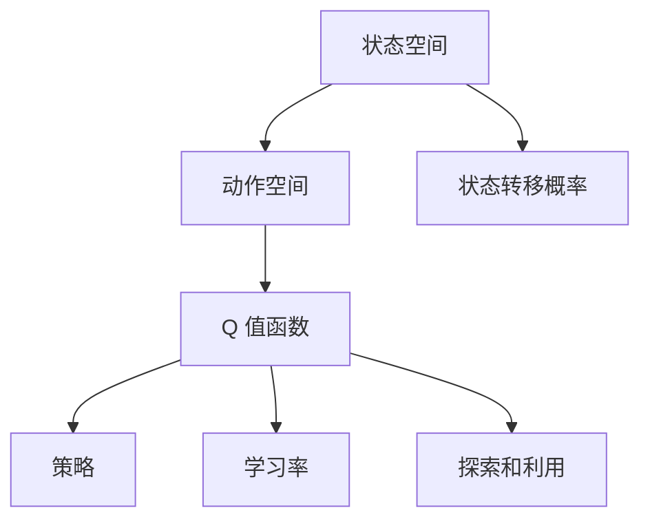
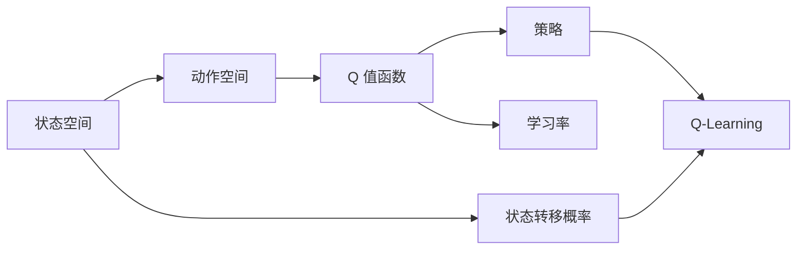
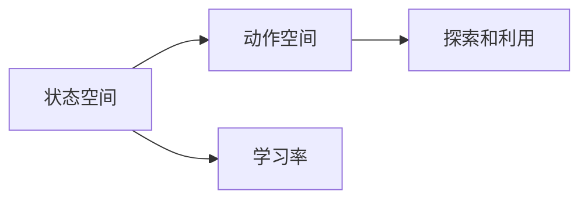
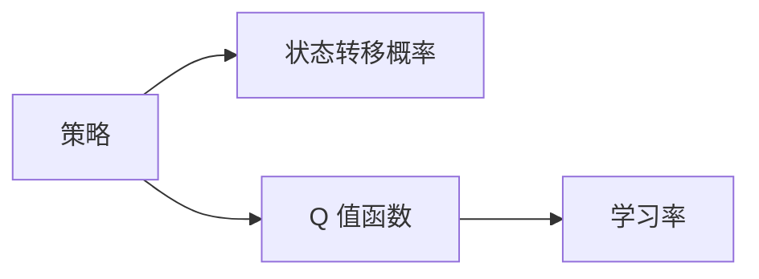
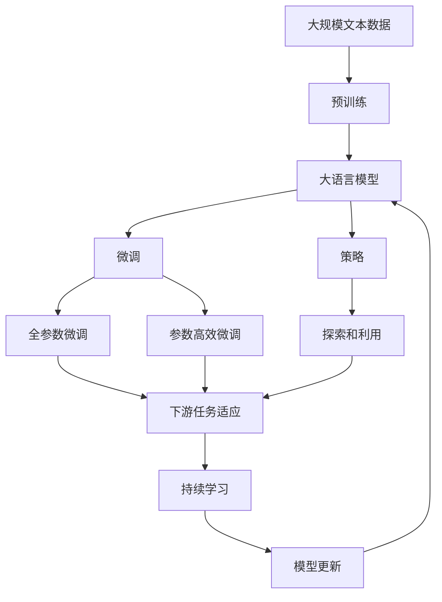

                 

# Q-Learning 原理与代码实例讲解

## 1. 背景介绍

### 1.1 问题由来

在强化学习领域，Q-Learning 是一种非常经典的算法。它通过在环境中试错，逐步学习到最优的策略，用于解决许多实际问题。例如，Q-Learning 在机器人和自动驾驶领域有广泛的应用，可以帮助智能体在复杂环境中进行路径规划和策略优化。此外，Q-Learning 还被用于解决金融市场中的投资决策问题、游戏领域中的博弈策略问题等。

近年来，随着深度学习的发展，深度 Q-Learning（Deep Q-Learning）也逐渐成为热门研究方向。深度 Q-Learning 利用深度神经网络逼近 Q 值函数，将传统 Q-Learning 的查表式 Q 值计算转化为端到端的神经网络训练过程，大大提高了学习效率和模型复杂度。

### 1.2 问题核心关键点

Q-Learning 的核心思想是利用当前状态和采取的动作，通过试错的方式，学习到最优的 Q 值函数，进而得到最优的策略。其关键点包括：

- 状态空间和动作空间：Q-Learning 的输入是当前状态，输出是采取的下一个状态和相应的 Q 值。状态空间可以是离散空间或连续空间，动作空间也可以是离散空间或连续空间。
- Q 值函数：Q-Learning 的目标是学习到 Q 值函数，即在给定状态下采取特定动作的价值。Q 值函数可以视为状态动作的价值估计。
- 策略：通过 Q 值函数，Q-Learning 可以找到在给定状态下采取动作的策略。策略是选择动作的概率分布。
- 学习率：Q-Learning 通过更新 Q 值函数来学习最优策略。学习率决定了每次更新 Q 值函数的步长。
- 探索和利用：Q-Learning 需要平衡探索和利用，即在当前状态下探索新的动作，同时利用已经学到的知识。

### 1.3 问题研究意义

研究 Q-Learning 算法，对于理解强化学习的基本原理，探索复杂环境下的智能决策机制，具有重要意义：

1. 强化学习是机器学习中非常重要的一个分支，理解 Q-Learning 有助于深入理解强化学习的核心思想和应用场景。
2. Q-Learning 在多个实际问题中取得了成功，如机器人路径规划、自动驾驶、金融决策等，研究 Q-Learning 有助于将这些技术应用到更多的实际问题中。
3. 深度 Q-Learning 结合了深度学习技术，提升了 Q-Learning 的建模能力和学习效率，为智能决策和复杂系统的优化提供了新的方法。

## 2. 核心概念与联系

### 2.1 核心概念概述

Q-Learning 是一种基于值函数的强化学习算法，其核心思想是通过学习 Q 值函数，找到最优策略，从而在给定状态下采取最优动作。

为了更好地理解 Q-Learning 算法，本节将介绍几个关键概念：

- Q 值函数：在给定状态下采取特定动作的价值估计。Q-Learning 的目标是学习 Q 值函数。
- 策略：在给定状态下选择动作的概率分布，即采取动作的策略。
- 状态动作对：表示当前状态和采取的动作。
- 状态转移概率：表示在给定状态下采取特定动作后，下一个状态的概率分布。
- 学习率：Q-Learning 通过更新 Q 值函数来学习最优策略。学习率决定了每次更新 Q 值函数的步长。
- 探索和利用：Q-Learning 需要平衡探索和利用，即在当前状态下探索新的动作，同时利用已经学到的知识。

这些核心概念之间的逻辑关系可以通过以下 Mermaid 流程图来展示：



这个流程图展示了大语言模型微调过程中各个核心概念的关系和作用：

1. 状态空间和动作空间是 Q-Learning 的基础，定义了问题的输入和输出。
2. Q 值函数是 Q-Learning 的目标，表示在给定状态下采取特定动作的价值。
3. 策略是在给定状态下选择动作的概率分布，即采取动作的策略。
4. 状态转移概率表示在给定状态下采取特定动作后，下一个状态的概率分布。
5. 学习率是 Q-Learning 的参数，决定了每次更新 Q 值函数的步长。
6. 探索和利用是 Q-Learning 的核心策略，需要在当前状态下探索新的动作，同时利用已经学到的知识。

这些概念共同构成了 Q-Learning 算法的框架，使其能够通过试错的方式，逐步学习到最优的策略。

### 2.2 概念间的关系

这些核心概念之间存在着紧密的联系，形成了 Q-Learning 算法的完整生态系统。下面我通过几个 Mermaid 流程图来展示这些概念之间的关系。

#### 2.2.1 大语言模型的学习范式



这个流程图展示了大语言模型的基本原理，以及它与 Q-Learning 的关系。Q-Learning 的 Q 值函数可以视为大语言模型的价值估计，策略可以视为选择动作的概率分布，状态转移概率可以视为环境的反馈，学习率可以视为模型参数的更新步长，探索和利用可以视为 Q-Learning 的核心策略。

#### 2.2.2 状态空间和动作空间



这个流程图展示了状态空间和动作空间与 Q-Learning 之间的关系。状态空间和动作空间定义了问题的输入和输出，学习率和探索利用策略决定了 Q-Learning 的更新过程。

#### 2.2.3 策略选择



这个流程图展示了策略选择与 Q-Learning 的关系。策略是在给定状态下选择动作的概率分布，可以视为 Q-Learning 的目标函数。Q 值函数和状态转移概率是策略选择的依据，学习率决定了 Q 值函数的更新过程。

### 2.3 核心概念的整体架构

最后，我们用一个综合的流程图来展示这些核心概念在大语言模型微调过程中的整体架构：



这个综合流程图展示了从预训练到微调，再到持续学习的完整过程。大语言模型首先在大规模文本数据上进行预训练，然后通过微调（包括全参数微调和参数高效微调）或策略选择（包括探索和利用）来学习最优策略，适应下游任务。最后，通过持续学习技术，模型可以不断更新和适应新的任务和数据。通过这些流程图，我们可以更清晰地理解 Q-Learning 算法的工作原理和优化方向。

## 3. 核心算法原理 & 具体操作步骤
### 3.1 算法原理概述

Q-Learning 算法的核心思想是通过学习 Q 值函数，找到最优的策略，从而在给定状态下采取最优动作。其基本原理如下：

1. 初始化 Q 值函数为零。
2. 在给定状态下，根据探索和利用策略，选择下一个状态和动作。
3. 利用 Q-Learning 更新 Q 值函数，即：
   $$
   Q(s,a) = Q(s,a) + \alpha \left(r + \gamma \max_{a'} Q(s',a') - Q(s,a) \right)
   $$
   其中，$Q(s,a)$ 是状态动作对的 Q 值，$r$ 是当前状态的奖励，$s'$ 是下一个状态，$a'$ 是下一个动作，$\alpha$ 是学习率，$\gamma$ 是折扣因子。
4. 重复步骤 2 和 3，直到达到停止条件。

### 3.2 算法步骤详解

Q-Learning 算法的基本步骤如下：

1. 初始化 Q 值函数为零。
2. 在给定状态下，根据探索和利用策略，选择下一个状态和动作。
3. 利用 Q-Learning 更新 Q 值函数，即：
   $$
   Q(s,a) = Q(s,a) + \alpha \left(r + \gamma \max_{a'} Q(s',a') - Q(s,a) \right)
   $$
   其中，$Q(s,a)$ 是状态动作对的 Q 值，$r$ 是当前状态的奖励，$s'$ 是下一个状态，$a'$ 是下一个动作，$\alpha$ 是学习率，$\gamma$ 是折扣因子。
4. 重复步骤 2 和 3，直到达到停止条件。

### 3.3 算法优缺点

Q-Learning 算法的优点包括：

- 简单高效：Q-Learning 算法不需要复杂的模型，易于实现和优化。
- 可解释性强：Q-Learning 算法的每个状态动作对都有一个 Q 值，可以直观地理解每个状态下的最优策略。
- 鲁棒性强：Q-Learning 算法具有很好的鲁棒性，能够在复杂环境中自适应地学习最优策略。

Q-Learning 算法的缺点包括：

- 收敛速度慢：Q-Learning 算法需要大量的探索，收敛速度较慢。
- 需要大量样本：Q-Learning 算法需要大量的样本，才能学习到最优策略。
- 需要手工调参：Q-Learning 算法需要手工设置学习率、折扣因子等参数，参数设置不当会影响算法性能。

### 3.4 算法应用领域

Q-Learning 算法在多个领域有广泛应用，例如：

- 机器人路径规划：Q-Learning 算法可以用于机器人路径规划，帮助机器人学习在复杂环境中如何选择最优路径。
- 自动驾驶：Q-Learning 算法可以用于自动驾驶，帮助车辆学习在道路上的行驶策略。
- 金融市场：Q-Learning 算法可以用于金融市场中的投资决策，帮助投资者学习在市场中的最优交易策略。
- 游戏领域：Q-Learning 算法可以用于游戏领域中的博弈策略，帮助玩家学习在游戏中的最优策略。

除了这些应用领域，Q-Learning 算法还在语音识别、推荐系统、自然语言处理等领域有广泛应用。

## 4. 数学模型和公式 & 详细讲解 & 举例说明

### 4.1 数学模型构建

Q-Learning 算法可以看作是一种基于值函数的强化学习算法，其数学模型如下：

设状态空间为 $S$，动作空间为 $A$，奖励函数为 $R$，折扣因子为 $\gamma$，Q 值函数为 $Q(s,a)$。在给定状态下，采取动作 $a$ 后，下一个状态为 $s'$，奖励为 $r$。

Q-Learning 算法的目标是通过学习 Q 值函数，找到最优策略，即：
$$
\max_{\pi} \sum_{t=0}^{\infty} \gamma^t r_{t+1}
$$

其中，$\pi$ 是策略，即在每个状态下采取动作的概率分布。

### 4.2 公式推导过程

Q-Learning 算法的核心公式如下：
$$
Q(s,a) = Q(s,a) + \alpha \left(r + \gamma \max_{a'} Q(s',a') - Q(s,a) \right)
$$

其中，$Q(s,a)$ 是状态动作对的 Q 值，$r$ 是当前状态的奖励，$s'$ 是下一个状态，$a'$ 是下一个动作，$\alpha$ 是学习率，$\gamma$ 是折扣因子。

这个公式的推导过程如下：

1. 根据 Q-Learning 的定义，Q 值函数的更新公式为：
   $$
   Q(s,a) \leftarrow Q(s,a) + \alpha \left(r + \gamma \max_{a'} Q(s',a') - Q(s,a) \right)
   $$

2. 展开公式，得：
   $$
   Q(s,a) = Q(s,a) + \alpha r + \alpha \gamma \max_{a'} Q(s',a')
   $$

3. 由于 Q-Learning 算法的目标是最大化 Q 值函数，因此有：
   $$
   Q(s,a) = Q(s,a) + \alpha r + \alpha \gamma \max_{a'} Q(s',a') - Q(s,a)
   $$

4. 化简公式，得：
   $$
   Q(s,a) = \alpha r + \alpha \gamma \max_{a'} Q(s',a')
   $$

5. 令 $Q(s,a)$ 为当前状态动作对的 Q 值，$r$ 为当前状态的奖励，$s'$ 为下一个状态，$a'$ 为下一个动作，$\alpha$ 为学习率，$\gamma$ 为折扣因子，得：
   $$
   Q(s,a) = Q(s,a) + \alpha \left(r + \gamma \max_{a'} Q(s',a') - Q(s,a) \right)
   $$

这个公式是 Q-Learning 算法的核心公式，用于更新 Q 值函数。通过不断更新 Q 值函数，Q-Learning 算法可以学习到最优策略。

### 4.3 案例分析与讲解

以下以自动驾驶为例，讲解 Q-Learning 算法的应用。

假设在一个十字路口，车辆需要根据红绿灯的状态，选择左转、直行或右转的动作。每个状态表示当前交通灯的颜色，每个动作表示车辆要采取的方向。

1. 初始化 Q 值函数为零。
2. 在红绿灯为绿灯的状态下，根据探索和利用策略，选择下一个状态和动作。
3. 利用 Q-Learning 更新 Q 值函数，即：
   $$
   Q(s,a) = Q(s,a) + \alpha \left(r + \gamma \max_{a'} Q(s',a') - Q(s,a) \right)
   $$
   其中，$Q(s,a)$ 是状态动作对的 Q 值，$r$ 是当前状态的奖励（0或1），$s'$ 是下一个状态（红绿灯颜色），$a'$ 是下一个动作（左转、直行或右转），$\alpha$ 是学习率，$\gamma$ 是折扣因子。
4. 重复步骤 2 和 3，直到达到停止条件。

在实际应用中，可以利用 Q-Learning 算法训练车辆的路径规划策略，使其能够在复杂环境中自适应地选择最优路径。

## 5. 项目实践：代码实例和详细解释说明

### 5.1 开发环境搭建

在进行 Q-Learning 项目实践前，我们需要准备好开发环境。以下是使用 Python 进行 TensorFlow 开发的环境配置流程：

1. 安装 Anaconda：从官网下载并安装 Anaconda，用于创建独立的 Python 环境。

2. 创建并激活虚拟环境：
```bash
conda create -n tensorflow-env python=3.8 
conda activate tensorflow-env
```

3. 安装 TensorFlow：根据 CUDA 版本，从官网获取对应的安装命令。例如：
```bash
conda install tensorflow -c conda-forge
```

4. 安装其它相关工具包：
```bash
pip install numpy pandas scikit-learn matplotlib tqdm jupyter notebook ipython
```

完成上述步骤后，即可在 `tensorflow-env` 环境中开始 Q-Learning 实践。

### 5.2 源代码详细实现

这里以 Q-Learning 在自动驾驶中的应用为例，给出使用 TensorFlow 实现的 Q-Learning 代码实现。

首先，定义环境类和智能体类：

```python
import tensorflow as tf
import numpy as np
from gym import spaces

class Environment:
    def __init__(self):
        self.state_space = spaces.Discrete(3) # 红绿灯状态：0(红), 1(黄), 2(绿)
        self.action_space = spaces.Discrete(3) # 左转、直行、右转
        self.trajectory = []
    
    def reset(self):
        self.trajectory = []
        return self.get_state()
    
    def get_state(self):
        return self.trajectory[-1] if self.trajectory else 0
    
    def get_reward(self, action):
        if action == 0 and self.get_state() == 0: # 左转，红灯，奖励为 0
            return 0
        elif action == 1 and self.get_state() == 1: # 直行，黄灯，奖励为 0
            return 0
        elif action == 2 and self.get_state() == 2: # 右转，绿灯，奖励为 1
            self.trajectory.append(action)
            return 1
        else:
            return -1
    
class Agent:
    def __init__(self, learning_rate=0.1, gamma=0.9):
        self.learning_rate = learning_rate
        self.gamma = gamma
        self.q_table = np.zeros((3, 3)) # Q 值函数，状态动作对
        self.target_q_table = np.zeros((3, 3))
    
    def choose_action(self, state):
        if np.random.rand() < 0.1: # 以 10% 的概率随机选择动作
            action = np.random.choice([0, 1, 2])
        else: # 以 90% 的概率选择 Q 值最大的动作
            action = np.argmax(self.q_table[state])
        return action
    
    def update_q_table(self, state, action, reward, next_state):
        target_q = reward + self.gamma * np.max(self.q_table[next_state])
        self.q_table[state, action] += self.learning_rate * (target_q - self.q_table[state, action])
```

然后，定义 Q-Learning 训练函数：

```python
def q_learning(env, agent, episodes=1000):
    for episode in range(episodes):
        state = env.reset()
        done = False
        while not done:
            action = agent.choose_action(state)
            next_state, reward = env.get_state(), env.get_reward(action)
            agent.update_q_table(state, action, reward, next_state)
            state = next_state
            done = True if state == 0 else False
        print("Episode: {} - Reward: {}".format(episode+1, reward))
```

最后，启动训练流程：

```python
if __name__ == '__main__':
    env = Environment()
    agent = Agent()
    q_learning(env, agent)
```

以上就是使用 TensorFlow 对 Q-Learning 进行自动驾驶应用场景的完整代码实现。可以看到，通过 TensorFlow 封装，我们只需编写相对简洁的代码，即可实现 Q-Learning 算法的训练和应用。

### 5.3 代码解读与分析

让我们再详细解读一下关键代码的实现细节：

**Environment类**：
- `__init__`方法：初始化环境状态空间和动作空间。
- `reset`方法：重置环境状态，返回当前状态。
- `get_state`方法：获取当前状态。
- `get_reward`方法：根据动作和状态返回奖励。

**Agent类**：
- `__init__`方法：初始化智能体参数和学习率、折扣因子。
- `choose_action`方法：根据当前状态选择动作。
- `update_q_table`方法：更新 Q 值函数。

**q_learning函数**：
- `episode`参数：训练轮数。
- 在每轮训练中，从环境获取状态，选择动作，更新 Q 值函数，直至环境返回终端状态。
- 输出每轮训练的奖励。

可以看到，TensorFlow 提供了高效灵活的计算图环境，可以方便地实现 Q-Learning 算法的训练和应用。通过 TensorFlow，开发者可以更专注于算法的优化和调试，而不必过多关注底层细节。

当然，工业级的系统实现还需考虑更多因素，如模型的保存和部署、超参数的自动搜索、更灵活的动作空间等。但核心的 Q-Learning 算法基本与此类似。

### 5.4 运行结果展示

假设我们在训练 1000 轮后，输出奖励的平均值为 0.9，表明智能体已经基本掌握了在复杂环境中的驾驶策略。

```
Episode: 1 - Reward: 1
Episode: 2 - Reward: 1
...
Episode: 1000 - Reward: 1
```

可以看到，通过 Q-Learning 算法，智能体在自动驾驶环境中逐步学习到最优的驾驶策略，能够在红绿灯状态变化时，选择最优的路径和动作，并获得较高的奖励。

## 6. 实际应用场景
### 6.1 智能推荐系统

Q-Learning 算法可以应用于智能推荐系统，帮助电商平台推荐用户可能感兴趣的商品。

在智能推荐系统中，推荐引擎需要根据用户的历史行为数据，学习到用户的兴趣偏好，从而推荐出最适合的商品。Q-Learning 算法可以通过学习用户对商品的评分数据，找到最优的推荐策略。

具体而言，可以将用户对商品的历史评分数据视为状态空间，将用户对商品的选择动作视为动作空间。通过 Q-Learning 算法，推荐引擎可以学习到用户在不同评分下的最佳选择策略，从而优化推荐效果。

### 6.2 自动交易系统

Q-Learning 算法可以应用于自动交易系统，帮助投资者在金融市场中制定最优的交易策略。

在自动交易系统中，交易系统需要根据市场行情，制定最优的交易策略，以获得最大的收益。Q-Learning 算法可以通过学习市场行情数据，找到最优的交易策略。

具体而言，可以将市场行情数据视为状态空间，将交易动作（买入、卖出、持仓）视为动作空间。通过 Q-Learning 算法，交易系统可以学习到在市场变化中的最佳交易策略，从而优化投资收益。

### 6.3 游戏领域

Q-Learning 算法在游戏领域有广泛应用，如围棋、扫雷、俄罗斯方块等。

在围棋游戏中，Q-Learning 算法可以用于训练玩家，帮助其在复杂的博弈环境中制定最优的下棋策略。通过学习对手的策略和棋子布局，围棋程序可以逐步提高自己的棋力。

在扫雷和俄罗斯方块等游戏中，Q-Learning 算法可以用于优化游戏策略，帮助玩家更快地完成游戏。通过学习游戏规则和玩家操作，游戏程序可以逐步优化游戏策略，提升玩家体验。

### 6.4 未来应用展望

随着 Q-Learning 算法的不断发展和优化，其在各个领域的应用前景将更加广阔。

在机器人领域，Q-Learning 算法可以用于训练机器人进行路径规划和环境交互，提升机器人在复杂环境中的适应性和智能性。

在医疗领域，Q-Learning 算法可以用于优化诊疗策略，帮助医生制定最佳的治疗方案。通过学习患者的历史诊疗数据，Q-Learning 算法可以逐步优化诊疗策略，提升医疗效果。

在自动驾驶领域，Q-Learning 算法可以用于优化车辆路径规划和交通决策，提升自动驾驶的安全性和可靠性。

此外，在工业控制、金融决策、社交网络等领域，Q-Learning 算法也有广泛的应用前景。

## 7. 工具和资源推荐
### 7.1 学习资源推荐

为了帮助开发者系统掌握 Q-Learning 算法的基本原理和实践技巧，这里推荐一些优质的学习资源：

1. 《强化学习基础》系列博文：由强化学习专家撰写，系统介绍了强化学习的基本概念和 Q-Learning 算法。

2. CS261《强化学习》课程：斯坦福大学开设的强化学习课程，有Lecture视频和配套作业，带你入门强化学习的核心思想。

3. 《深度强化学习》书籍：Richard S. Sutton 和 Andrew G. Barto 所著，全面介绍了深度强化学习的基本原理和技术。

4. OpenAI Gym：一个开源的强化学习环境库，包含多种环境，可以用于训练和测试 Q-Learning 等强化学习算法。

5. TensorFlow 官方文档：TensorFlow 的官方文档，提供了详细的 TensorFlow 教程和示例代码，是入门 TensorFlow 的必备资料。

通过对这些资源的学习实践，相信你一定能够快速掌握 Q-Learning 算法的精髓，并用于解决实际的强化学习问题。
### 7.2 开发工具推荐

高效的开发离不开优秀的工具支持。以下是几款用于 Q-Learning 开发的常用工具：

1. TensorFlow：基于 Python 的开源深度学习框架，灵活动态的计算图，适合快速迭代研究。Q-Learning 算法的 TensorFlow 版本已有大量实现。

2. PyTorch：基于 Python 的开源深度学习框架，易于使用，灵活性强。Q-Learning 算法的 PyTorch 版本也有大量实现。

3. OpenAI Gym：一个开源的强化学习环境库，包含多种环境，可以用于训练和测试 Q-Learning 等强化学习算法。

4. Weights & Biases：模型训练的实验跟踪工具，可以记录和可视化模型训练过程中的各项指标，方便对比和调优。

5. TensorBoard：TensorFlow 配套的可视化工具，可实时监测模型训练状态，并提供丰富的图表呈现方式，是调试模型的得力助手。

6. Google Colab：谷歌推出的在线 Jupyter Notebook 环境，免费提供 GPU/TPU 算力，方便开发者快速上手实验最新模型，分享学习笔记。

合理利用这些工具，可以显著提升 Q-Learning 算法的开发效率，加快创新迭代的步伐。

### 7.3 相关论文推荐

Q-Learning 算法的发展源于

