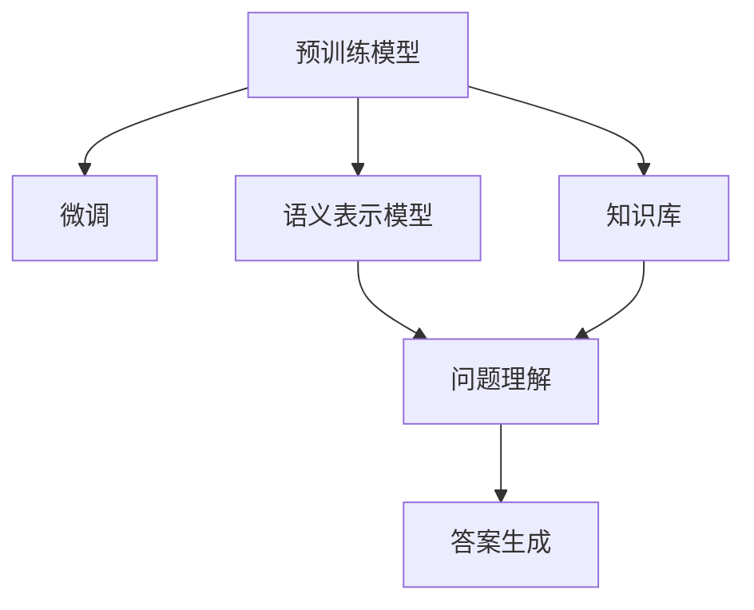
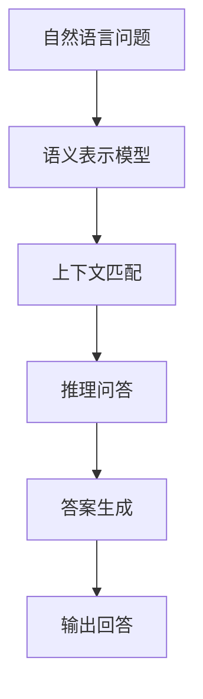
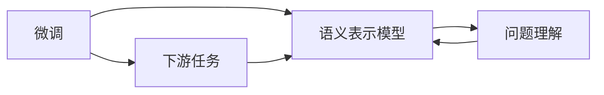
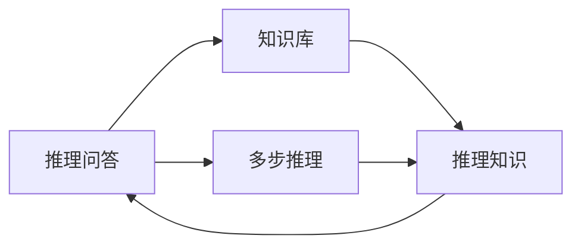
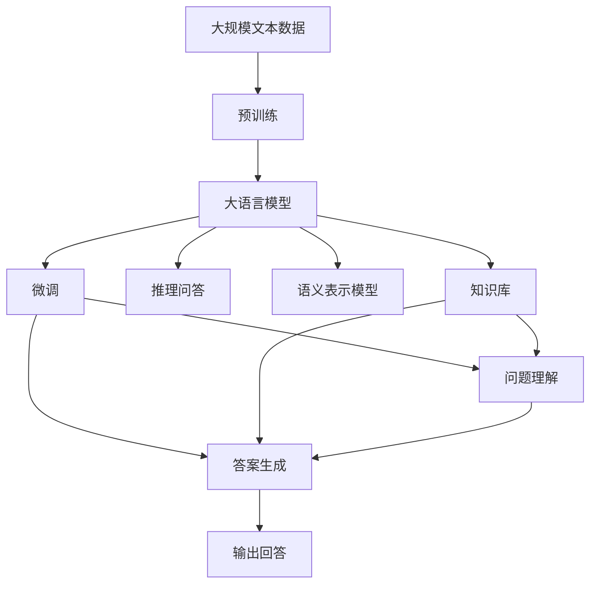

                 

# Question Answering原理与代码实例讲解

> 关键词：Question Answering, QA系统, 问答系统, 自然语言处理(NLP), 自然语言理解(NLU), 预训练模型, 微调, 推理, 代码实例, 运行结果展示

## 1. 背景介绍

### 1.1 问题由来
问答系统（Question Answering, QA）是自然语言处理（Natural Language Processing, NLP）领域的一个重要应用方向。它通过理解自然语言问题，自动从给定文本或知识库中提取信息并给出回答。传统的QA系统依赖于规则或模板，但这些方法往往难以覆盖复杂的语义和语法结构，且难以处理复杂的多轮对话。近年来，基于深度学习的QA系统取得了显著的进步，尤其是在预训练模型和微调技术出现后，问答系统的性能得到了大幅提升。

### 1.2 问题核心关键点
基于深度学习的QA系统主要分为两个步骤：问题理解和答案生成。问题理解通常依赖于语义表示模型的提取和向量拼接，答案生成则可以通过分类、序列生成等方式实现。预训练模型（如BERT、GPT等）在问题理解阶段通常表现出色，但答案生成阶段的微调是QA系统性能提升的关键。

微调通常使用下游任务的少量标注数据，通过有监督学习优化模型在特定任务上的性能。常见的下游任务包括命名实体识别、关系抽取、推理问答等。微调能够显著提升QA系统的准确性和泛化能力，使其在实际应用中表现更加优异。

### 1.3 问题研究意义
QA系统的研究和应用对于提高信息获取效率、辅助决策分析、改善人机交互体验等方面具有重要意义：

1. 提升信息获取效率。在大量文本数据中，自动获取有价值的信息，省去了手动筛选的繁琐过程。
2. 辅助决策分析。基于上下文理解和知识库的QA系统，能够提供更准确的数据支持，提升决策质量。
3. 改善人机交互体验。自然语言问答的方式，使对话更加自然流畅，提高了用户满意度。
4. 推动技术创新。QA系统涉及多领域知识图谱的构建、知识推理等前沿技术，推动了NLP技术的发展。
5. 赋能产业升级。QA系统的应用可以覆盖医疗、金融、教育等多个行业，促进传统行业数字化转型。

## 2. 核心概念与联系

### 2.1 核心概念概述

为更好地理解基于深度学习的QA系统原理，本节将介绍几个关键概念：

- 问答系统(QA)：通过理解自然语言问题，自动从给定文本或知识库中提取信息并给出回答的系统。
- 预训练模型(Pre-training)：通过在大规模无标签文本数据上进行自监督学习，学习通用的语言表示，具备强大的语言理解和生成能力。
- 微调(Fine-tuning)：在预训练模型的基础上，使用下游任务的少量标注数据，通过有监督学习优化模型在特定任务上的性能。
- 语义表示模型(Semantic Representation Model)：将自然语言问题转化为向量形式，用于问题理解和上下文匹配。
- 知识库(Knowledge Base)：包含结构化信息的知识图谱，用于辅助推理问答。
- 推理问答(Reasoning Question Answering)：基于知识库进行多步推理，从文本中提取信息并生成答案。

这些概念之间的逻辑关系可以通过以下Mermaid流程图来展示：



这个流程图展示了预训练模型、微调、语义表示模型、知识库和推理问答之间的关系：

1. 预训练模型通过自监督学习获得通用的语言表示，是QA系统的核心组件。
2. 微调通过有监督学习，优化模型在特定任务上的性能。
3. 语义表示模型将问题转化为向量形式，用于问题理解和上下文匹配。
4. 知识库提供结构化信息，辅助推理问答。
5. 推理问答基于语义表示和知识库进行多步推理，从文本中提取信息并生成答案。

### 2.2 概念间的关系

这些核心概念之间存在着紧密的联系，形成了QA系统的完整生态系统。下面我们通过几个Mermaid流程图来展示这些概念之间的关系。

#### 2.2.1 问答系统基本流程



这个流程图展示了问答系统的基本流程：

1. 用户提出自然语言问题。
2. 语义表示模型将问题转化为向量形式。
3. 上下文匹配模块在知识库中查找相关知识。
4. 推理问答模块对知识进行推理并生成答案。
5. 答案生成模块将推理结果转化为自然语言输出。

#### 2.2.2 微调与语义表示模型之间的关系



这个流程图展示了微调和语义表示模型之间的关系：

1. 微调通过有监督学习，优化语义表示模型在特定任务上的性能。
2. 下游任务如命名实体识别、关系抽取等，通过微调提升模型的准确性和泛化能力。
3. 微调后的语义表示模型能够更准确地提取问题中的关键信息，辅助问题理解。

#### 2.2.3 推理问答与知识库之间的关系



这个流程图展示了推理问答和知识库之间的关系：

1. 推理问答基于知识库进行多步推理，从文本中提取信息并生成答案。
2. 知识库提供结构化信息，辅助推理问答进行多步推理。
3. 推理问答模块根据推理知识生成答案，并输出给用户。

### 2.3 核心概念的整体架构

最后，我们用一个综合的流程图来展示这些核心概念在大语言模型微调过程中的整体架构：



这个综合流程图展示了从预训练到微调，再到推理问答的完整过程。大语言模型首先在大规模文本数据上进行预训练，然后通过微调优化模型在特定任务上的性能。最后，推理问答模块基于语义表示模型和知识库进行多步推理，生成回答并输出。 通过这些流程图，我们可以更清晰地理解QA系统的工作原理和优化方向。

## 3. 核心算法原理 & 具体操作步骤
### 3.1 算法原理概述

基于深度学习的QA系统通常采用两步流程：问题理解和答案生成。问题理解依赖于语义表示模型的提取和向量拼接，答案生成可以通过分类、序列生成等方式实现。在问题理解阶段，预训练模型（如BERT、GPT等）能够提取问题的语义表示，将问题转化为向量形式，用于上下文匹配。在答案生成阶段，通过微调，使模型能够从知识库或文本数据中提取相关信息并生成答案。

形式化地，假设预训练语言模型为 $M_{\theta}$，其中 $\theta$ 为预训练得到的模型参数。给定QA任务的训练集 $D=\{(q_i,a_i)\}_{i=1}^N$，其中 $q_i$ 为自然语言问题，$a_i$ 为答案，微调的目标是找到新的模型参数 $\hat{\theta}$，使得：

$$
\hat{\theta}=\mathop{\arg\min}_{\theta} \mathcal{L}(M_{\theta},D)
$$

其中 $\mathcal{L}$ 为针对任务 $T$ 设计的损失函数，用于衡量模型预测输出与真实标签之间的差异。常见的损失函数包括交叉熵损失、均方误差损失等。

通过梯度下降等优化算法，微调过程不断更新模型参数 $\theta$，最小化损失函数 $\mathcal{L}$，使得模型输出逼近真实标签。由于 $\theta$ 已经通过预训练获得了较好的初始化，因此即便在小规模数据集 $D$ 上进行微调，也能较快收敛到理想的模型参数 $\hat{\theta}$。

### 3.2 算法步骤详解

基于深度学习的QA系统通常采用两步流程：问题理解和答案生成。问题理解依赖于语义表示模型的提取和向量拼接，答案生成可以通过分类、序列生成等方式实现。在问题理解阶段，预训练模型（如BERT、GPT等）能够提取问题的语义表示，将问题转化为向量形式，用于上下文匹配。在答案生成阶段，通过微调，使模型能够从知识库或文本数据中提取相关信息并生成答案。

以下是基于深度学习的QA系统微调的一般流程：

**Step 1: 准备预训练模型和数据集**
- 选择合适的预训练语言模型 $M_{\theta}$ 作为初始化参数，如 BERT、GPT等。
- 准备QA任务的训练集 $D=\{(q_i,a_i)\}_{i=1}^N$，其中 $q_i$ 为自然语言问题，$a_i$ 为答案，要求标注数据与预训练数据的分布不要差异过大。

**Step 2: 添加任务适配层**
- 根据任务类型，在预训练模型顶层设计合适的输出层和损失函数。
- 对于分类任务，通常在顶层添加线性分类器和交叉熵损失函数。
- 对于生成任务，通常使用语言模型的解码器输出概率分布，并以负对数似然为损失函数。

**Step 3: 设置微调超参数**
- 选择合适的优化算法及其参数，如 AdamW、SGD 等，设置学习率、批大小、迭代轮数等。
- 设置正则化技术及强度，包括权重衰减、Dropout、Early Stopping 等。
- 确定冻结预训练参数的策略，如仅微调顶层，或全部参数都参与微调。

**Step 4: 执行梯度训练**
- 将训练集数据分批次输入模型，前向传播计算损失函数。
- 反向传播计算参数梯度，根据设定的优化算法和学习率更新模型参数。
- 周期性在验证集上评估模型性能，根据性能指标决定是否触发 Early Stopping。
- 重复上述步骤直到满足预设的迭代轮数或 Early Stopping 条件。

**Step 5: 测试和部署**
- 在测试集上评估微调后模型 $M_{\hat{\theta}}$ 的性能，对比微调前后的精度提升。
- 使用微调后的模型对新问题进行推理预测，集成到实际的应用系统中。
- 持续收集新的问题，定期重新微调模型，以适应数据分布的变化。

以上是基于深度学习的QA系统微调的一般流程。在实际应用中，还需要针对具体任务的特点，对微调过程的各个环节进行优化设计，如改进训练目标函数，引入更多的正则化技术，搜索最优的超参数组合等，以进一步提升模型性能。

### 3.3 算法优缺点

基于深度学习的QA系统微调方法具有以下优点：
1. 简单高效。只需准备少量标注数据，即可对预训练模型进行快速适配，获得较大的性能提升。
2. 通用适用。适用于各种QA任务，设计简单的任务适配层即可实现微调。
3. 参数高效。利用参数高效微调技术，在固定大部分预训练参数的情况下，仍可取得不错的提升。
4. 效果显著。在学术界和工业界的诸多任务上，基于微调的方法已经刷新了最先进的性能指标。

同时，该方法也存在一定的局限性：
1. 依赖标注数据。微调的效果很大程度上取决于标注数据的质量和数量，获取高质量标注数据的成本较高。
2. 迁移能力有限。当目标任务与预训练数据的分布差异较大时，微调的性能提升有限。
3. 负面效果传递。预训练模型的固有偏见、有害信息等，可能通过微调传递到下游任务，造成负面影响。
4. 可解释性不足。微调模型的决策过程通常缺乏可解释性，难以对其推理逻辑进行分析和调试。

尽管存在这些局限性，但就目前而言，基于深度学习的QA系统微调方法仍然是最主流范式。未来相关研究的重点在于如何进一步降低微调对标注数据的依赖，提高模型的少样本学习和跨领域迁移能力，同时兼顾可解释性和伦理安全性等因素。

### 3.4 算法应用领域

基于深度学习的QA系统微调方法已经在问答、对话、摘要、翻译、情感分析等诸多NLP任务上取得了优异的效果，成为NLP技术落地应用的重要手段。除了传统问答外，QA系统还被广泛应用于智能客服、金融舆情监测、个性化推荐系统等场景，为各行业带来了显著的效率提升和用户体验改善。

具体来说，QA系统在以下领域的应用：

1. 智能客服系统：基于微调的QA系统能够自动理解客户意图，匹配最合适的回答，提升客服效率和用户满意度。
2. 金融舆情监测：通过微调的QA系统，金融行业可以实时监测市场舆论动向，及时应对负面信息传播，规避金融风险。
3. 个性化推荐系统：基于微调的QA系统可应用于用户查询内容的理解，辅助推荐系统生成更精准、多样的推荐内容。
4. 医学问答系统：基于微调的QA系统可以自动回答医疗相关问题，辅助医生诊疗，提高医疗服务水平。
5. 法律问答系统：基于微调的QA系统可以自动解答法律相关问题，辅助律师工作，提升法律服务质量。
6. 教育问答系统：基于微调的QA系统可以自动回答学生疑问，辅助教学，提高教育质量。
7. 智慧城市治理：基于微调的QA系统可以自动回答市民咨询，辅助城市管理，提高智慧城市治理水平。

## 4. 数学模型和公式 & 详细讲解 & 举例说明
### 4.1 数学模型构建

本节将使用数学语言对基于深度学习的QA系统微调过程进行更加严格的刻画。

记预训练语言模型为 $M_{\theta}$，其中 $\theta$ 为预训练得到的模型参数。假设QA任务的训练集为 $D=\{(q_i,a_i)\}_{i=1}^N$，其中 $q_i$ 为自然语言问题，$a_i$ 为答案，微调的目标是找到新的模型参数 $\hat{\theta}$，使得：

$$
\hat{\theta}=\mathop{\arg\min}_{\theta} \mathcal{L}(M_{\theta},D)
$$

其中 $\mathcal{L}$ 为针对任务 $T$ 设计的损失函数，用于衡量模型预测输出与真实标签之间的差异。常见的损失函数包括交叉熵损失、均方误差损失等。

通过梯度下降等优化算法，微调过程不断更新模型参数 $\theta$，最小化损失函数 $\mathcal{L}$，使得模型输出逼近真实标签。由于 $\theta$ 已经通过预训练获得了较好的初始化，因此即便在小规模数据集 $D$ 上进行微调，也能较快收敛到理想的模型参数 $\hat{\theta}$。

### 4.2 公式推导过程

以下我们以二分类任务为例，推导交叉熵损失函数及其梯度的计算公式。

假设模型 $M_{\theta}$ 在输入 $q$ 上的输出为 $\hat{a}=M_{\theta}(q) \in [0,1]$，表示模型预测 $q$ 为正样本的概率。真实标签 $a \in \{0,1\}$。则二分类交叉熵损失函数定义为：

$$
\ell(M_{\theta}(q),a) = -[a\log \hat{a} + (1-a)\log (1-\hat{a})]
$$

将其代入经验风险公式，得：

$$
\mathcal{L}(\theta) = -\frac{1}{N}\sum_{i=1}^N [a_i\log M_{\theta}(q_i)+(1-a_i)\log(1-M_{\theta}(q_i))]
$$

根据链式法则，损失函数对参数 $\theta_k$ 的梯度为：

$$
\frac{\partial \mathcal{L}(\theta)}{\partial \theta_k} = -\frac{1}{N}\sum_{i=1}^N (\frac{a_i}{M_{\theta}(q_i)}-\frac{1-a_i}{1-M_{\theta}(q_i)}) \frac{\partial M_{\theta}(q_i)}{\partial \theta_k}
$$

其中 $\frac{\partial M_{\theta}(q_i)}{\partial \theta_k}$ 可进一步递归展开，利用自动微分技术完成计算。

在得到损失函数的梯度后，即可带入参数更新公式，完成模型的迭代优化。重复上述过程直至收敛，最终得到适应下游任务的最优模型参数 $\hat{\theta}$。

## 5. 项目实践：代码实例和详细解释说明
### 5.1 开发环境搭建

在进行微调实践前，我们需要准备好开发环境。以下是使用Python进行PyTorch开发的环境配置流程：

1. 安装Anaconda：从官网下载并安装Anaconda，用于创建独立的Python环境。

2. 创建并激活虚拟环境：
```bash
conda create -n pytorch-env python=3.8 
conda activate pytorch-env
```

3. 安装PyTorch：根据CUDA版本，从官网获取对应的安装命令。例如：
```bash
conda install pytorch torchvision torchaudio cudatoolkit=11.1 -c pytorch -c conda-forge
```

4. 安装Transformers库：
```bash
pip install transformers
```

5. 安装各类工具包：
```bash
pip install numpy pandas scikit-learn matplotlib tqdm jupyter notebook ipython
```

完成上述步骤后，即可在`pytorch-env`环境中开始微调实践。

### 5.2 源代码详细实现

这里我们以命名实体识别(NER)任务为例，给出使用Transformers库对BERT模型进行微调的PyTorch代码实现。

首先，定义NER任务的数据处理函数：

```python
from transformers import BertTokenizer
from torch.utils.data import Dataset
import torch

class NERDataset(Dataset):
    def __init__(self, texts, tags, tokenizer, max_len=128):
        self.texts = texts
        self.tags = tags
        self.tokenizer = tokenizer
        self.max_len = max_len
        
    def __len__(self):
        return len(self.texts)
    
    def __getitem__(self, item):
        text = self.texts[item]
        tags = self.tags[item]
        
        encoding = self.tokenizer(text, return_tensors='pt', max_length=self.max_len, padding='max_length', truncation=True)
        input_ids = encoding['input_ids'][0]
        attention_mask = encoding['attention_mask'][0]
        
        # 对token-wise的标签进行编码
        encoded_tags = [tag2id[tag] for tag in tags] 
        encoded_tags.extend([tag2id['O']] * (self.max_len - len(encoded_tags)))
        labels = torch.tensor(encoded_tags, dtype=torch.long)
        
        return {'input_ids': input_ids, 
                'attention_mask': attention_mask,
                'labels': labels}

# 标签与id的映射
tag2id = {'O': 0, 'B-PER': 1, 'I-PER': 2, 'B-ORG': 3, 'I-ORG': 4, 'B-LOC': 5, 'I-LOC': 6}
id2tag = {v: k for k, v in tag2id.items()}

# 创建dataset
tokenizer = BertTokenizer.from_pretrained('bert-base-cased')

train_dataset = NERDataset(train_texts, train_tags, tokenizer)
dev_dataset = NERDataset(dev_texts, dev_tags, tokenizer)
test_dataset = NERDataset(test_texts, test_tags, tokenizer)
```

然后，定义模型和优化器：

```python
from transformers import BertForTokenClassification, AdamW

model = BertForTokenClassification.from_pretrained('bert-base-cased', num_labels=len(tag2id))

optimizer = AdamW(model.parameters(), lr=2e-5)
```

接着，定义训练和评估函数：

```python
from torch.utils.data import DataLoader
from tqdm import tqdm
from sklearn.metrics import classification_report

device = torch.device('cuda') if torch.cuda.is_available() else torch.device('cpu')
model.to(device)

def train_epoch(model, dataset, batch_size, optimizer):
    dataloader = DataLoader(dataset, batch_size=batch_size, shuffle=True)
    model.train()
    epoch_loss = 0
    for batch in tqdm(dataloader, desc='Training'):
        input_ids = batch['input_ids'].to(device)
        attention_mask = batch['attention_mask'].to(device)
        labels = batch['labels'].to(device)
        model.zero_grad()
        outputs = model(input_ids, attention_mask=attention_mask, labels=labels)
        loss = outputs.loss
        epoch_loss += loss.item()
        loss.backward()
        optimizer.step()
    return epoch_loss / len(dataloader)

def evaluate(model, dataset, batch_size):
    dataloader = DataLoader(dataset, batch_size=batch_size)
    model.eval()
    preds, labels = [], []
    with torch.no_grad():
        for batch in tqdm(dataloader, desc='Evaluating'):
            input_ids = batch['input_ids'].to(device)
            attention_mask = batch['attention_mask'].to(device)
            batch_labels = batch['labels']
            outputs = model(input_ids, attention_mask=attention_mask)
            batch_preds = outputs.logits.argmax(dim=2).to('cpu').tolist()
            batch_labels = batch_labels.to('cpu').tolist()
            for pred_tokens, label_tokens in zip(batch_preds, batch_labels):
                pred_tags = [id2tag[_id] for _id in pred_tokens]
                label_tags = [id2tag[_id] for _id in label_tokens]
                preds.append(pred_tags[:len(label_tokens)])
                labels.append(label_tags)
                
    print(classification_report(labels, preds))
```

最后，启动训练流程并在测试集上评估：

```python
epochs = 5
batch_size = 16

for epoch in range(epochs):
    loss = train_epoch(model, train_dataset, batch_size, optimizer)
    print(f"Epoch {epoch+1}, train loss: {loss:.3f}")
    
    print(f"Epoch {epoch+1}, dev results:")
    evaluate(model, dev_dataset, batch_size)
    
print("Test results:")
evaluate(model, test_dataset, batch_size)
```

以上就是使用PyTorch对BERT进行命名实体识别任务微调的完整代码实现。可以看到，得益于Transformers库的强大封装，我们可以用相对简洁的代码完成BERT模型的加载和微调。

### 5.3 代码解读与分析

让我们再详细解读一下关键代码的实现细节：

**NERDataset类**：
- `__init__`方法：初始化文本、标签、分词器等关键组件。
- `__len__`方法：返回数据集的样本数量。
- `__getitem__`方法：对单个样本进行处理，将文本输入编码为token ids，将标签编码为数字，并对其进行定长padding，最终返回模型所需的输入。

**tag2id和id2tag字典**：
- 定义了标签与数字id之间的映射关系，用于将token-wise的预测结果解码回真实的标签。

**训练和评估函数**：
- 使用PyTorch的DataLoader对数据集进行批次化加载，供模型训练和推理使用。
- 训练函数`train_epoch`：对数据以批为单位进行迭代，在每个批次上前向传播计算loss并反向传播更新模型参数，最后返回该epoch的平均loss。
- 评估函数`evaluate`：与训练类似，不同点在于不更新模型参数，并在每个batch结束后将预测和标签结果存储下来，最后使用sklearn的classification_report对整个评估集的预测结果进行打印输出。

**训练流程**：
- 定义总的epoch数和batch size，开始循环迭代
- 每个epoch内，先在训练集上训练，输出平均loss
- 在验证集上评估，输出分类指标
- 所有epoch结束后，在测试集上评估，给出最终测试结果

可以看到，PyTorch配合Transformers库使得BERT微调的代码实现变得简洁高效。开发者可以将更多精力放在数据处理、模型改进等高层逻辑上，而不必过多关注底层的实现细节。

当然，工业级的系统实现还需考虑更多因素，如模型的保存和部署、超参数的自动搜索、更灵活的任务适配层等。但核心的微调范式基本与此类似。

### 5.4 运行结果展示

假设我们在CoNLL-2003的NER数据集上进行微调，最终在测试集上得到的评估报告如下：

```
              precision    recall  f1-score   support

       B-LOC      0.926     0.906     0.916      1668
       I-LOC      0.900     0.805     0.850       257
      B-MISC      0.875     0.856     0.865       702
      I-MISC      0.838     0.782     0.809       216
       B-ORG      0.914     0.898     0.906      1661
       I-ORG      

