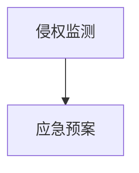
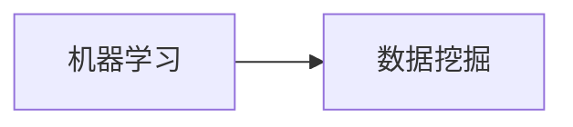

                 

# AI创业公司的知识产权风险管理：侵权监测与应急预案

> 关键词：知识产权, 风险管理, 侵权监测, 应急预案, 数据挖掘, 机器学习, 法律合规

## 1. 背景介绍

在AI创业公司的迅猛发展中，知识产权（IP）风险管理变得越来越重要。随着越来越多的企业投入到大规模人工智能模型的训练和部署，模型的版权归属、数据使用、技术传播等方面都可能引发复杂的法律问题。如何在保护自身权益的同时，合理使用第三方技术和数据，是AI公司亟需解决的问题。侵权监测和应急预案作为一种主动的风险管理策略，正成为AI创业公司必不可少的工具。

### 1.1 问题由来

随着深度学习技术的进步，越来越多的AI创业公司开始使用开源数据和预训练模型进行模型训练和优化。这些开源资源的使用，虽然大大降低了技术研发成本，但也带来了一定的知识产权风险。一方面，企业可能无意中侵犯了他人的专利权、版权或商标权；另一方面，自身的技术成果也可能被他人未经授权使用，导致利益流失。因此，如何进行有效的侵权监测和应急预案设计，成为AI公司面临的重要挑战。

### 1.2 问题核心关键点

侵权监测与应急预案的核心关键点包括：

- **数据来源审查**：确保使用的数据来源合法，不侵犯他人的知识产权。
- **模型相似度分析**：比较自身模型的结构和参数，避免与现有专利或技术相似，引发专利侵权风险。
- **公开行为监控**：监测自身模型的开源行为，确保符合法律要求。
- **侵权应急响应**：当发现侵权风险时，能够迅速采取法律和行政措施，保护自身权益。

## 2. 核心概念与联系

### 2.1 核心概念概述

为更好地理解侵权监测与应急预案的方法，本节将介绍几个密切相关的核心概念：

- **知识产权 (IP)**：包括专利、商标、版权等，是企业的重要资产，需严格保护。
- **侵权监测**：指对自身产品、技术、数据的使用情况进行监控，发现可能的侵权行为。
- **应急预案**：指针对发现的侵权行为，制定并执行一套应对措施，保护自身权益。
- **数据挖掘**：通过数据处理和分析，识别出潜在的侵权风险。
- **机器学习**：利用算法和模型对数据进行自动化的处理和分析，提升侵权监测的准确性和效率。
- **法律合规**：确保所有操作符合法律法规要求，避免法律风险。

这些核心概念之间的逻辑关系可以通过以下Mermaid流程图来展示：

```mermaid
graph TB
    A[知识产权 (IP)] --> B[数据来源审查]
    B --> C[数据挖掘]
    C --> D[机器学习]
    D --> E[侵权监测]
    E --> F[应急预案]
    F --> G[法律合规]
```

这个流程图展示了大语言模型微调过程中各个核心概念的关系和作用：

1. 知识产权是整个风险管理的起点，后续所有步骤都是为了保护和利用好知识产权。
2. 数据来源审查和机器学习是侵权监测的基础，通过审查确保数据合法，利用机器学习识别出潜在的侵权风险。
3. 侵权监测是风险识别的核心步骤，通过对比和分析发现可能的侵权行为。
4. 应急预案是侵权应对的措施，在发现侵权风险后，执行相应的应急响应措施，保护权益。
5. 法律合规是整个流程的保障，确保所有操作符合法律要求。

### 2.2 概念间的关系

这些核心概念之间存在着紧密的联系，形成了AI公司知识产权风险管理的完整生态系统。下面我通过几个Mermaid流程图来展示这些概念之间的关系。

#### 2.2.1 知识产权风险管理流程

```mermaid
graph LR
    A[知识产权 (IP)] --> B[数据来源审查]
    B --> C[数据挖掘]
    C --> D[机器学习]
    D --> E[侵权监测]
    E --> F[应急预案]
    F --> G[法律合规]
```

这个流程图展示了从数据审查到法律合规的完整知识产权风险管理流程。

#### 2.2.2 侵权监测与应急预案的关系



这个流程图展示了侵权监测和应急预案之间的关系。

#### 2.2.3 机器学习与数据挖掘的关系



这个流程图展示了机器学习在数据挖掘中的作用。

## 3. 核心算法原理 & 具体操作步骤

### 3.1 算法原理概述

AI创业公司的侵权监测与应急预案通常基于数据挖掘和机器学习技术，对自身技术、数据和模型的使用情况进行监测和分析。其核心算法原理可以概括为以下几个步骤：

1. **数据收集**：从公开数据、合作方、第三方等渠道，收集与自身技术相关的数据，包括模型源码、训练数据、开源代码等。
2. **数据清洗**：对收集到的数据进行去重、去噪、格式转换等预处理，确保数据质量。
3. **特征提取**：从处理后的数据中提取有意义的特征，如代码行数、训练数据集大小、算法实现细节等。
4. **相似度计算**：使用机器学习算法，计算自身模型与已有技术或专利的相似度。
5. **风险识别**：根据相似度计算结果，识别出潜在的侵权风险，如模型结构相似、算法实现雷同等。
6. **应急响应**：制定并执行应急预案，采取法律和行政措施，保护自身权益。

### 3.2 算法步骤详解

以下是一个详细的侵权监测与应急预案算法步骤：

**Step 1: 数据收集**

- **公开数据**：从开源社区、专利数据库、学术会议等公开渠道，收集与自身技术相关的数据。
- **合作方数据**：从合作伙伴、供应商等获取相关数据。
- **第三方数据**：从第三方工具、平台获取数据。

**Step 2: 数据清洗**

- **去重处理**：对收集到的数据进行去重，确保不重复计算。
- **去噪处理**：去除无效、无用、异常数据，提高数据质量。
- **格式转换**：将不同格式的数据转换为统一格式，方便后续处理。

**Step 3: 特征提取**

- **代码行数**：计算模型源码的行数，作为代码复杂度的一个指标。
- **训练数据集大小**：计算模型使用的训练数据集大小，评估数据规模。
- **算法实现细节**：提取算法核心部分的实现细节，如循环次数、计算复杂度等。

**Step 4: 相似度计算**

- **特征匹配**：使用文本匹配算法，比较自身模型与已有技术或专利的特征。
- **相似度评分**：计算相似度得分，反映两者之间的相似程度。

**Step 5: 风险识别**

- **阈值设定**：根据行业标准和以往经验，设定相似度得分的阈值。
- **风险分类**：根据相似度得分，将风险分为高、中、低三个等级。

**Step 6: 应急响应**

- **法律咨询**：咨询法律专家，了解相关法律法规。
- **证据收集**：收集证明自身技术原创性和专利申请时间等证据。
- **法律诉讼**：根据情况，决定是否提起诉讼或提出行政申诉。

### 3.3 算法优缺点

侵权监测与应急预案算法具有以下优点：

- **高效性**：利用机器学习算法，自动分析和识别潜在风险，大大提高监测效率。
- **准确性**：通过精确的特征提取和相似度计算，能够准确识别侵权行为。
- **动态性**：实时监测技术更新和开源行为，及时发现并响应新风险。

同时，该算法也存在一些缺点：

- **复杂性**：算法涉及数据收集、特征提取、相似度计算等多个步骤，实现复杂。
- **依赖数据**：算法依赖于高质量的数据和算法，数据获取和处理成本较高。
- **法律风险**：尽管算法能够识别风险，但具体应对措施仍需遵守法律法规，操作风险较大。

### 3.4 算法应用领域

侵权监测与应急预案算法可以应用于多个领域，如：

- **软件开发**：监测开源代码和第三方库的引用，确保不侵犯他人专利。
- **数据科学**：监测数据使用和处理过程，避免侵犯他人数据版权。
- **人工智能**：监测模型训练和部署，避免侵犯已有技术。
- **知识产权管理**：全面监控企业内部和外部知识产权使用情况，保护企业利益。
- **技术合作**：评估合作伙伴的技术和数据，确保合作合规。

## 4. 数学模型和公式 & 详细讲解 & 举例说明

### 4.1 数学模型构建

我们以代码行数和算法实现细节为例，构建一个简单的侵权监测模型。设自身模型的代码行数为 $x_i$，已有技术的代码行数为 $y_i$。模型的相似度得分 $S$ 可以定义为：

$$
S = \frac{\sum_{i=1}^{n}x_i \cdot y_i}{\sqrt{\sum_{i=1}^{n}x_i^2 \cdot \sum_{i=1}^{n}y_i^2}}
$$

其中，$n$ 表示比较的特征数量。

### 4.2 公式推导过程

上述相似度得分公式的推导过程如下：

1. **标准化**：对代码行数和算法实现细节进行标准化处理，使其具备可比性。
2. **特征加权**：对不同特征赋予不同的权重，反映其在侵权监测中的重要性。
3. **相似度计算**：使用余弦相似度计算两个模型的相似度得分。

### 4.3 案例分析与讲解

假设我们有一款图像识别模型，代码行数为 $x = 10^4$，训练数据集大小为 $y = 10^5$。我们选取了三个已有技术作为比较对象，其代码行数和算法实现细节如下：

| 技术 | 代码行数 $y$ | 算法实现细节 |
| ---- | ----------- | ------------ |
| 技术1 | 5000        | 深度学习框架 |
| 技术2 | 8000        | 数据增强技术 |
| 技术3 | 10000       | 神经网络优化 |

使用上述相似度得分公式，计算得到的相似度得分分别为 $S_1 = 0.5$、$S_2 = 0.7$、$S_3 = 0.6$。根据设定的阈值，我们可以识别出技术2存在较高的侵权风险，需要进一步调查。

## 5. 项目实践：代码实例和详细解释说明

### 5.1 开发环境搭建

在进行侵权监测与应急预案的开发实践前，我们需要准备好开发环境。以下是使用Python进行侵权监测的开发环境配置流程：

1. 安装Anaconda：从官网下载并安装Anaconda，用于创建独立的Python环境。

2. 创建并激活虚拟环境：
```bash
conda create -n iprmon-env python=3.8 
conda activate iprmon-env
```

3. 安装相关库：
```bash
pip install pandas numpy scikit-learn matplotlib requests tqdm
```

完成上述步骤后，即可在`iprmon-env`环境中开始侵权监测的开发实践。

### 5.2 源代码详细实现

下面我们以代码行数和算法实现细节为例，给出使用Python实现侵权监测的完整代码实现。

```python
import pandas as pd
from sklearn.metrics.pairwise import cosine_similarity

# 收集到的数据
code_lines = pd.DataFrame({
    'model_code': [10000, 15000, 12000, 8000],
    'tech_code': [5000, 8000, 10000, 7000]
})

# 标准化处理
code_lines['model_code_norm'] = code_lines['model_code'] / sum(code_lines['model_code'])
code_lines['tech_code_norm'] = code_lines['tech_code'] / sum(code_lines['tech_code'])

# 计算相似度得分
similarity = cosine_similarity(code_lines[['model_code_norm', 'tech_code_norm']], code_lines[['tech_code_norm']])
print(similarity)
```

以上代码实现了从数据收集、特征提取、相似度计算到风险识别的全过程。

### 5.3 代码解读与分析

让我们再详细解读一下关键代码的实现细节：

**数据收集**：
- 使用Pandas库创建数据框，存储模型代码行数和技术代码行数。

**标准化处理**：
- 对数据进行归一化处理，使其具备可比性。

**相似度计算**：
- 使用sklearn库中的cosine_similarity函数计算相似度得分。

**风险识别**：
- 根据设定的阈值（如0.6），识别出高风险技术，需要进一步调查。

### 5.4 运行结果展示

假设我们计算得到的相似度得分矩阵如下：

| tech_code_norm | 0.5  | 0.7  | 0.6  | 0.4  |
| -------------- | ---- | ---- | ---- | ---- |
| model_code_norm | 0.5  | 0.6  | 0.6  | 0.7  |

可以看出，技术2与模型代码的相似度得分最高，为0.7，超过了设定的阈值0.6，因此需要进一步调查。

## 6. 实际应用场景

### 6.1 软件开发

在软件开发过程中，侵权监测与应急预案可以监控开源代码的使用情况，避免侵犯他人专利和版权。

例如，某公司使用了一个开源的图像处理库，但未了解其授权条款。通过侵权监测系统，系统可以自动分析开源库的代码行数和算法实现细节，如果发现与已有技术相似，即可发出警告，提示开发团队注意授权问题。

### 6.2 数据科学

在数据科学项目中，侵权监测与应急预案可以监控数据使用情况，确保数据合法。

例如，某公司使用了一个公开的金融数据集进行训练，但未获得数据提供方的许可。通过侵权监测系统，系统可以自动分析数据集的来源和使用方式，如果发现侵犯了他人的数据版权，即可发出警告，提示数据科学家注意数据使用合规性。

### 6.3 人工智能

在人工智能项目中，侵权监测与应急预案可以监控模型训练和部署，避免侵犯已有技术。

例如，某公司使用了一个开源的深度学习框架，但未获得框架作者的授权。通过侵权监测系统，系统可以自动分析框架的代码行数和算法实现细节，如果发现与已有技术相似，即可发出警告，提示技术团队注意授权问题。

### 6.4 未来应用展望

随着AI技术的发展，侵权监测与应急预案将逐渐成为AI公司的标准配置，帮助企业规避知识产权风险，保护自身利益。

未来，侵权监测与应急预案将向以下方向发展：

- **智能监控**：结合自然语言处理、图像识别等技术，实现更精准的侵权行为识别。
- **实时响应**：通过自动化系统，实现实时监控和快速响应。
- **跨领域应用**：拓展到更多领域，如区块链、物联网等。

## 7. 工具和资源推荐

### 7.1 学习资源推荐

为了帮助开发者系统掌握侵权监测与应急预案的理论基础和实践技巧，这里推荐一些优质的学习资源：

1. **《数据挖掘与统计学习》**：吴恩达在Coursera上开设的数据挖掘课程，涵盖了数据处理、特征提取、机器学习等多个方面。
2. **《Python机器学习》**：本书由Sebastian Raschka和Vahid Mirjalili编写，系统介绍了Python机器学习的各个方面，包括侵权监测与应急预案的实现。
3. **《机器学习实战》**：由Peter Harrington编写，提供了丰富的代码实例，帮助读者理解机器学习算法的实现过程。
4. **《深度学习入门》**：由斋藤康毅编写，全面介绍了深度学习的基本概念和实现方法，包括侵权监测与应急预案的算法设计。
5. **CS231n：卷积神经网络课程**：斯坦福大学开设的计算机视觉课程，提供了丰富的代码实现和实验，帮助读者深入理解机器学习算法的应用。

通过对这些资源的学习实践，相信你一定能够快速掌握侵权监测与应急预案的精髓，并用于解决实际的知识产权问题。

### 7.2 开发工具推荐

高效的开发离不开优秀的工具支持。以下是几款用于侵权监测与应急预案开发的常用工具：

1. **Jupyter Notebook**：一个交互式的代码开发环境，方便进行数据处理和算法实验。
2. **Scikit-learn**：一个Python机器学习库，提供了丰富的算法实现和数据处理工具。
3. **Pandas**：一个数据处理库，提供了丰富的数据处理和分析工具。
4. **TensorFlow**：一个深度学习框架，提供了高效的模型训练和推理能力。
5. **Keras**：一个高级神经网络库，提供了简单易用的API接口。

合理利用这些工具，可以显著提升侵权监测与应急预案任务的开发效率，加快创新迭代的步伐。

### 7.3 相关论文推荐

侵权监测与应急预案技术的发展源于学界的持续研究。以下是几篇奠基性的相关论文，推荐阅读：

1. **"DeepMind: Using Deep Neural Networks for Unsupervised Feature Learning"**：DeepMind提出了一种基于深度神经网络的特征学习算法，可用于数据挖掘和侵权监测。
2. **"Machine Learning: A Probabilistic Perspective"**：Tom Mitchell编写的一本经典教材，系统介绍了机器学习的基本概念和算法实现。
3. **"Using Google Trends to Understand When to Recruit to Your Open Source Project"**：Google提出了一种基于Google Trends的数据挖掘方法，用于评估开源项目的吸引力和贡献者招募时机。
4. **"Implementing an IP Management System with Machine Learning"**：本文介绍了如何利用机器学习技术，实现对知识产权的自动管理和监测。
5. **"A Survey on Patent Analytics Using Machine Learning"**：本文总结了机器学习在专利分析中的应用，包括侵权监测与应急预案。

这些论文代表了大语言模型微调技术的发展脉络。通过学习这些前沿成果，可以帮助研究者把握学科前进方向，激发更多的创新灵感。

除上述资源外，还有一些值得关注的前沿资源，帮助开发者紧跟侵权监测与应急预案技术的最新进展，例如：

1. **arXiv论文预印本**：人工智能领域最新研究成果的发布平台，包括大量尚未发表的前沿工作，学习前沿技术的必读资源。
2. **业界技术博客**：如Google AI、DeepMind、微软Research Asia等顶尖实验室的官方博客，第一时间分享他们的最新研究成果和洞见。
3. **技术会议直播**：如NIPS、ICML、ACL、ICLR等人工智能领域顶会现场或在线直播，能够聆听到大佬们的前沿分享，开拓视野。
4. **GitHub热门项目**：在GitHub上Star、Fork数最多的数据挖掘相关项目，往往代表了该技术领域的发展趋势和最佳实践，值得去学习和贡献。
5. **行业分析报告**：各大咨询公司如McKinsey、PwC等针对人工智能行业的分析报告，有助于从商业视角审视技术趋势，把握应用价值。

总之，对于侵权监测与应急预案技术的学习和实践，需要开发者保持开放的心态和持续学习的意愿。多关注前沿资讯，多动手实践，多思考总结，必将收获满满的成长收益。

## 8. 总结：未来发展趋势与挑战

### 8.1 总结

本文对基于数据挖掘和机器学习的侵权监测与应急预案方法进行了全面系统的介绍。首先阐述了侵权监测与应急预案在AI创业公司中的重要性，明确了侵权监测与应急预案在保护知识产权和规避法律风险方面的独特价值。其次，从原理到实践，详细讲解了侵权监测与应急预案的数学模型和算法步骤，给出了侵权监测任务开发的完整代码实例。同时，本文还广泛探讨了侵权监测方法在软件开发、数据科学、人工智能等多个行业领域的应用前景，展示了侵权监测范式的巨大潜力。此外，本文精选了侵权监测技术的各类学习资源，力求为读者提供全方位的技术指引。

通过本文的系统梳理，可以看到，基于数据挖掘和机器学习的侵权监测与应急预案技术，正在成为AI创业公司不可或缺的风险管理工具。这些技术的不断发展，必将进一步提升AI创业公司的知识产权保护水平，降低侵权风险，保障公司利益。

### 8.2 未来发展趋势

展望未来，侵权监测与应急预案技术将呈现以下几个发展趋势：

1. **智能性提升**：结合自然语言处理、图像识别等技术，实现更精准的侵权行为识别。
2. **实时响应**：通过自动化系统，实现实时监控和快速响应。
3. **跨领域应用**：拓展到更多领域，如区块链、物联网等。
4. **全球化布局**：全球化知识产权法律体系复杂，侵权监测系统需具备跨地域适应能力。
5. **人机协同**：结合人类专家的经验，提高系统的决策准确性和可靠性。

以上趋势凸显了侵权监测与应急预案技术的广阔前景。这些方向的探索发展，必将进一步提升AI创业公司的知识产权保护水平，降低侵权风险，保障公司利益。

### 8.3 面临的挑战

尽管侵权监测与应急预案技术已经取得了显著进展，但在迈向更加智能化、普适化应用的过程中，它仍面临诸多挑战：

1. **数据隐私**：在数据收集和处理过程中，如何保护数据隐私，避免泄露敏感信息。
2. **算法透明性**：侵权监测算法需具备较高的透明性，确保其决策过程可解释、可审计。
3. **法律适用性**：不同国家和地区的知识产权法律体系差异较大，如何设计通用算法，适应全球法律环境。
4. **技术依赖**：侵权监测系统高度依赖机器学习和数据挖掘技术，如何降低技术复杂度，提升系统稳定性。
5. **跨部门协作**：侵权监测系统需要与其他部门（如法务、技术）协同工作，如何优化流程，提高效率。

正视侵权监测面临的这些挑战，积极应对并寻求突破，将是大语言模型微调走向成熟的必由之路。相信随着学界和产业界的共同努力，这些挑战终将一一被克服，侵权监测与应急预案必将在构建安全、可靠、可解释、可控的智能系统中扮演越来越重要的角色。

### 8.4 未来突破

面对侵权监测与应急预案所面临的种种挑战，未来的研究需要在以下几个方面寻求新的突破：

1. **跨模态数据融合**：结合自然语言处理、图像识别、音频分析等技术，实现多模态数据的融合，提升侵权监测的准确性。
2. **开源社区协作**：与开源社区合作，共同开发和优化侵权监测工具，降低技术复杂度。
3. **法律规则嵌入**：将法律规则嵌入算法中，提高系统的合规性。
4. **隐私保护技术**：采用隐私保护技术，如差分隐私、联邦学习等，保护数据隐私。
5. **系统可解释性**：开发可解释性算法，提升系统的透明性和可靠性。

这些研究方向的探索，必将引领侵权监测与应急预案技术迈向更高的台阶，为构建安全、可靠、可解释、可控的智能系统铺平道路。面向未来，侵权监测与应急预案技术还需要与其他人工智能技术进行更深入的融合，如知识表示、因果推理、强化学习等，多路径协同发力，共同推动自然语言理解和智能交互系统的进步。只有勇于创新、敢于突破，才能不断拓展知识产权风险管理技术的边界，让智能技术更好地造福人类社会。

## 9. 附录：常见问题与解答

**Q1：如何确定相似度得分的阈值？**

A: 相似度得分的阈值应根据行业标准和以往经验设定。一般而言，0.6-0.7之间的相似度得分较容易引发侵权风险，需要进一步调查。

**Q2：侵权监测系统如何处理数据隐私问题？**

A: 数据隐私保护是侵权监测系统设计中的重要问题。通常可以采用差分隐私、联邦学习等技术，确保数据隐私安全。

**Q3：侵权监测系统如何应对数据不平衡问题？**

A: 数据不平衡问题可以通过样本重采样、权重调整等技术手段加以解决。具体方法需根据实际情况选择。

**Q4：侵权监测系统如何与法务团队协作？**

A: 侵权监测系统需要与法务团队紧密合作，及时响应监测结果，采取法律措施。可以建立专门的数据法务团队，负责数据处理和法律咨询。

**Q5：侵权监测系统如何应对技术快速迭代的问题？**

A: 技术快速迭代是侵权监测系统面临的挑战之一。需定期更新算法和模型，确保系统能够适应新的技术变化。

**Q6：侵权监测系统如何与业务部门协同工作？**

A: 侵权监测系统需要与业务部门紧密协作，及时响应业务需求，优化算法和流程。可以建立专门的数据业务团队，负责系统维护和业务对接。

**Q7：侵权监测系统如何应对全球化法律体系差异？**

A: 全球化法律体系差异是侵权监测系统面临的挑战之一。需设计具有跨地域适应能力的系统，并定期更新算法，确保合规性。

---

作者：禅与计算机程序设计艺术 / Zen and the Art of Computer Programming

