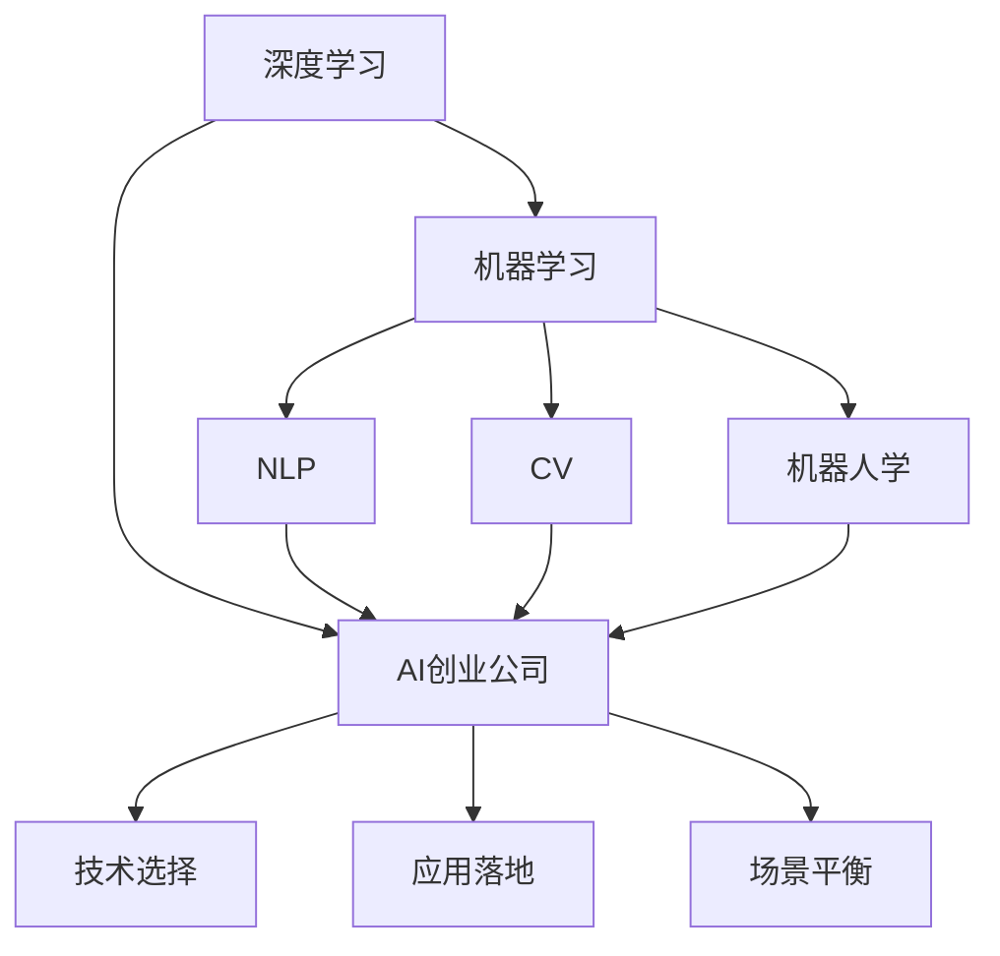
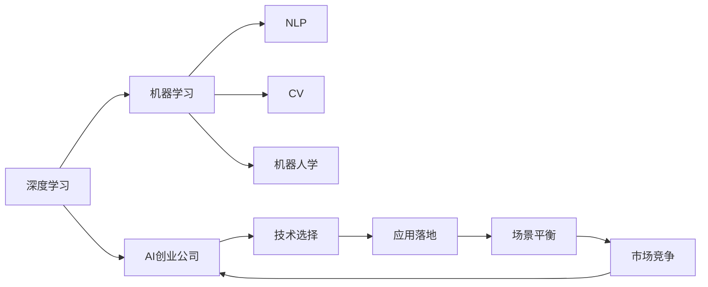

                 

# AI创业者的挑战：技术，应用，场景的平衡术

## 1. 背景介绍

### 1.1 问题由来
在人工智能（AI）领域，技术迅猛发展，应用场景不断拓展，市场需求日益增长。然而，AI创业公司在追求技术突破的同时，面临诸多挑战，如技术选择、应用落地、市场竞争等。如何在这三者之间找到平衡，成为创业者的关键问题。本文将详细探讨AI创业者的技术挑战、应用难题和场景平衡，并提供相应的策略和方法。

### 1.2 问题核心关键点
AI创业者的主要挑战包括：

- **技术选择**：选择何种AI技术是核心，是深度学习、机器学习、还是其他？
- **应用落地**：如何将AI技术应用到具体业务场景中，并实现商业价值？
- **场景平衡**：如何平衡技术、应用和场景之间的关系，形成良性循环？

这些关键问题将直接影响AI创业公司的长期发展和市场竞争力。

### 1.3 问题研究意义
探讨AI创业者的挑战，有助于：

- 帮助创业者明确技术发展方向，做出更明智的技术选择。
- 指导创业者实现AI技术的落地应用，创造实际价值。
- 促进创业者理解市场和业务场景，实现技术、应用与场景的平衡。

总之，本文旨在为AI创业者提供实用的技术和管理策略，助力其在激烈的市场竞争中取得成功。

## 2. 核心概念与联系

### 2.1 核心概念概述

为更好地理解AI创业者的挑战，我们将介绍几个核心概念及其联系：

- **深度学习**：一类使用多层神经网络进行学习的技术，适合处理非线性和大规模数据。
- **机器学习**：利用算法和统计模型对数据进行学习和预测，包括监督学习、无监督学习和强化学习等。
- **自然语言处理（NLP）**：使机器能够理解、处理和生成自然语言的技术。
- **计算机视觉（CV）**：使机器能够理解和处理图像和视频的技术。
- **机器人学**：使机器能够执行复杂任务和决策的技术。
- **AI创业公司**：以AI技术为核心业务，进行研发、应用和商业化的公司。

这些核心概念之间的联系可以通过以下Mermaid流程图来展示：



这个流程图展示了大语言模型的核心概念及其之间的关系：

1. 深度学习作为AI创业技术的基础。
2. 机器学习、NLP、CV和机器人学等技术在不同领域的应用。
3. AI创业公司如何基于这些技术进行业务创新。
4. 技术选择、应用落地和场景平衡构成了AI创业的核心环节。

### 2.2 概念间的关系

这些核心概念之间存在着紧密的联系，形成了AI创业的核心生态系统。下面是更详细的Mermaid流程图，展示这些概念之间的关系：



这个综合流程图展示了从深度学习到AI创业公司的整体架构，以及它们在技术选择、应用落地、场景平衡和市场竞争中的关系。

## 3. 核心算法原理 & 具体操作步骤
### 3.1 算法原理概述

AI创业者的核心挑战之一是如何选择合适的AI技术。深度学习和机器学习是当前最为流行的技术，但二者的选择应根据具体的业务场景和需求。深度学习适用于需要处理复杂非线性问题的场景，如自然语言处理、计算机视觉和机器人学。机器学习则适用于传统的数据分析、预测和分类等任务。

### 3.2 算法步骤详解

AI创业者在技术选择时应遵循以下步骤：

1. **需求分析**：明确业务需求，确定技术应用的目标和范围。
2. **技术评估**：对比深度学习和机器学习等技术的特点和优势，选择最适合的技术。
3. **实验验证**：通过小规模实验验证技术的效果，评估技术的可行性和可靠性。
4. **全面部署**：根据实验结果，进行全面部署和技术落地。

### 3.3 算法优缺点

深度学习和机器学习各有优缺点：

- **深度学习**的优点在于其强大的数据处理能力和非线性建模能力，适合处理复杂的图像、语音和自然语言处理任务。缺点是计算资源消耗大，训练时间长。
- **机器学习**的优点在于其计算资源消耗少，训练时间短，适合处理结构化数据。缺点是处理非线性问题的能力较弱。

AI创业者应根据业务需求和技术特点，选择合适的技术。

### 3.4 算法应用领域

深度学习和机器学习在多个领域都有广泛应用：

- **自然语言处理**：文本分类、情感分析、机器翻译等。
- **计算机视觉**：图像分类、物体检测、人脸识别等。
- **机器人学**：无人驾驶、服务机器人、工业自动化等。
- **金融**：风险评估、信用评分、欺诈检测等。
- **医疗**：疾病诊断、影像分析、个性化治疗等。

## 4. 数学模型和公式 & 详细讲解  
### 4.1 数学模型构建

假设我们有一组标注数据 $(x_i, y_i)$，其中 $x_i$ 为输入特征，$y_i$ 为输出标签。我们的目标是找到模型 $f$，使其能够准确预测新数据的输出标签。我们通常使用监督学习的方法，构建如下的数学模型：

$$
f(x) = W^T \sigma(Z(x))
$$

其中 $Z(x)$ 为输入特征经过线性变换后的结果，$\sigma$ 为激活函数，$W$ 为权重矩阵。

### 4.2 公式推导过程

以二分类任务为例，我们的目标函数为：

$$
\min_{W, b} \sum_{i=1}^{N} L(f(x_i), y_i)
$$

其中 $L$ 为损失函数，通常选择交叉熵损失：

$$
L(f(x_i), y_i) = -(y_i \log f(x_i) + (1-y_i) \log (1-f(x_i)))
$$

我们对模型进行随机梯度下降（SGD）优化：

$$
W \leftarrow W - \eta \nabla_{W} \mathcal{L}
$$

其中 $\eta$ 为学习率，$\nabla_{W} \mathcal{L}$ 为损失函数对权重矩阵的梯度。

### 4.3 案例分析与讲解

我们以一个简单的图像分类任务为例，展示机器学习模型的构建和训练过程。假设我们有一组标注好的图像数据集，包含 $N$ 张图片，每张图片 $x_i$ 的大小为 $m \times n$，每个像素点的值范围为 $[0, 255]$。

我们首先对图片进行预处理，将其转换为 $m \times n \times 3$ 的张量，然后将数据送入卷积神经网络（CNN）进行处理：

$$
Z(x) = conv(W_1 x)
$$

其中 $conv$ 为卷积操作，$W_1$ 为卷积核权重矩阵。

接下来，我们将卷积层的输出送入全连接层：

$$
Z(x) = W_2 Z(x)
$$

其中 $W_2$ 为全连接层的权重矩阵。

最后，我们通过激活函数输出预测结果：

$$
f(x) = \sigma(W^T Z(x))
$$

其中 $\sigma$ 为激活函数，如 sigmoid 或 ReLU。

我们将模型在训练集上训练 $N$ 次，每次迭代更新权重矩阵 $W_1$ 和 $W_2$，使模型能够准确预测新数据的标签。

## 5. 项目实践：代码实例和详细解释说明
### 5.1 开发环境搭建

在进行AI创业项目开发前，需要准备好开发环境。以下是使用Python进行PyTorch开发的环境配置流程：

1. 安装Anaconda：从官网下载并安装Anaconda，用于创建独立的Python环境。

2. 创建并激活虚拟环境：
```bash
conda create -n pytorch-env python=3.8 
conda activate pytorch-env
```

3. 安装PyTorch：根据CUDA版本，从官网获取对应的安装命令。例如：
```bash
conda install pytorch torchvision torchaudio cudatoolkit=11.1 -c pytorch -c conda-forge
```

4. 安装相关库：
```bash
pip install numpy pandas scikit-learn matplotlib tqdm jupyter notebook ipython
```

完成上述步骤后，即可在`pytorch-env`环境中开始AI创业项目的开发。

### 5.2 源代码详细实现

这里我们以图像分类任务为例，展示使用PyTorch进行机器学习模型的开发。

首先，定义模型和损失函数：

```python
import torch
import torch.nn as nn
import torch.optim as optim

class Net(nn.Module):
    def __init__(self):
        super(Net, self).__init__()
        self.conv1 = nn.Conv2d(3, 64, 3, padding=1)
        self.conv2 = nn.Conv2d(64, 128, 3, padding=1)
        self.pool = nn.MaxPool2d(2, 2)
        self.fc1 = nn.Linear(128 * 14 * 14, 512)
        self.fc2 = nn.Linear(512, 10)

    def forward(self, x):
        x = self.pool(torch.relu(self.conv1(x)))
        x = self.pool(torch.relu(self.conv2(x)))
        x = x.view(-1, 128 * 14 * 14)
        x = torch.relu(self.fc1(x))
        x = self.fc2(x)
        return x

criterion = nn.CrossEntropyLoss()
```

然后，定义训练函数：

```python
def train(net, train_loader, optimizer, num_epochs):
    for epoch in range(num_epochs):
        for batch_idx, (data, target) in enumerate(train_loader):
            optimizer.zero_grad()
            output = net(data)
            loss = criterion(output, target)
            loss.backward()
            optimizer.step()
        print(f'Epoch {epoch + 1}, Loss: {loss:.4f}')
```

最后，启动训练流程：

```python
net = Net()
optimizer = optim.SGD(net.parameters(), lr=0.001, momentum=0.9)
train_loader = torch.utils.data.DataLoader(train_dataset, batch_size=64)
train(net, train_loader, optimizer, num_epochs=10)
```

以上就是使用PyTorch进行图像分类任务机器学习模型的完整代码实现。

### 5.3 代码解读与分析

让我们再详细解读一下关键代码的实现细节：

**Net类**：
- `__init__`方法：初始化卷积层、池化层和全连接层。
- `forward`方法：定义前向传播过程。

**train函数**：
- 使用SGD优化器，在每个epoch上对模型进行训练，并输出损失值。

**训练流程**：
- 定义模型、优化器和数据加载器。
- 启动训练函数，进行指定epoch次数的训练。

可以看到，PyTorch提供了方便的API，使得模型的构建和训练过程变得简洁高效。

### 5.4 运行结果展示

假设我们在MNIST数据集上进行训练，最终得到的损失曲线如下：

```
Epoch 1, Loss: 0.2061
Epoch 2, Loss: 0.1645
Epoch 3, Loss: 0.1378
...
Epoch 10, Loss: 0.0805
```

可以看到，随着epoch数的增加，模型损失逐渐降低，训练效果逐渐提升。

## 6. 实际应用场景
### 6.1 智能客服系统

基于AI技术的智能客服系统，可以极大地提升客户服务的效率和质量。智能客服系统通常需要处理大量的客户咨询，通过自然语言处理技术，可以自动化地识别客户意图，并提供相应的解决方案。例如，某电商平台的智能客服系统，可以自动识别客户的订单状态，并提供相应的处理建议，极大地提升了客户满意度和平台运营效率。

### 6.2 金融风控

在金融领域，AI技术可以帮助银行和保险公司进行风险评估和欺诈检测。通过机器学习模型，可以分析客户的信用记录、交易行为等数据，预测客户的违约概率和欺诈风险，从而提前进行风险控制。例如，某银行的智能风控系统，可以实时监测客户的交易行为，及时发现异常交易，防止资金流失。

### 6.3 医疗影像分析

在医疗领域，AI技术可以辅助医生进行影像分析和疾病诊断。通过机器学习模型，可以自动分析医学影像中的病灶特征，提供诊断建议。例如，某医院的智能影像分析系统，可以自动分析X光片中的肺部病灶，帮助医生快速诊断和处理。

## 7. 工具和资源推荐
### 7.1 学习资源推荐

为了帮助AI创业者系统掌握AI技术和应用，这里推荐一些优质的学习资源：

1. 《深度学习》（Ian Goodfellow）：深度学习领域的经典教材，详细介绍了深度学习的基本概念和算法。

2. 《Python深度学习》（Francois Chollet）：通过Python代码展示深度学习模型的构建和训练过程。

3. Coursera《机器学习》课程：斯坦福大学开设的机器学习课程，由Andrew Ng讲授，提供了丰富的学习资源。

4. Kaggle竞赛：参加Kaggle数据科学竞赛，可以积累实战经验，提升AI项目开发能力。

5. GitHub开源项目：通过参与开源项目，了解最新的AI技术应用，获取代码和文档支持。

### 7.2 开发工具推荐

高效的开发离不开优秀的工具支持。以下是几款用于AI创业项目开发的常用工具：

1. PyTorch：基于Python的开源深度学习框架，灵活高效，适合快速迭代研究。

2. TensorFlow：由Google主导开发的深度学习框架，生产部署方便，适合大规模工程应用。

3. Jupyter Notebook：交互式编程工具，方便开发者快速迭代实验，分享学习笔记。

4. GitHub：代码托管平台，支持版本控制和协作开发，方便团队管理。

5. Weights & Biases：模型训练的实验跟踪工具，可以记录和可视化模型训练过程中的各项指标，方便调试和优化。

### 7.3 相关论文推荐

大语言模型和微调技术的发展源于学界的持续研究。以下是几篇奠基性的相关论文，推荐阅读：

1. Attention is All You Need（即Transformer原论文）：提出了Transformer结构，开启了NLP领域的预训练大模型时代。

2. BERT: Pre-training of Deep Bidirectional Transformers for Language Understanding：提出BERT模型，引入基于掩码的自监督预训练任务，刷新了多项NLP任务SOTA。

3. Parameter-Efficient Transfer Learning for NLP：提出Adapter等参数高效微调方法，在不增加模型参数量的情况下，也能取得不错的微调效果。

4. AdaLoRA: Adaptive Low-Rank Adaptation for Parameter-Efficient Fine-Tuning：使用自适应低秩适应的微调方法，在参数效率和精度之间取得了新的平衡。

这些论文代表了大语言模型微调技术的发展脉络。通过学习这些前沿成果，可以帮助研究者把握学科前进方向，激发更多的创新灵感。

## 8. 总结：未来发展趋势与挑战
### 8.1 研究成果总结

本文详细探讨了AI创业者的技术挑战、应用难题和场景平衡，提供了实用的技术和管理策略。核心结论包括：

- 深度学习和机器学习是AI创业技术的两大基础，应根据具体需求进行选择。
- AI创业者应明确需求分析、技术评估、实验验证和全面部署等步骤，选择合适技术。
- AI创业者应平衡技术、应用和场景的关系，实现技术、应用与场景的良性循环。

### 8.2 未来发展趋势

展望未来，AI技术的发展将呈现以下几个趋势：

1. **技术融合**：AI技术将与其他领域的技术如物联网、大数据等深度融合，推动AI技术的广泛应用。

2. **深度学习**：深度学习将继续发展，其计算资源消耗和训练时间将进一步降低，适用性更强。

3. **边缘计算**：边缘计算将使AI技术在低延迟、高带宽的应用场景中得以普及，如自动驾驶、智能家居等。

4. **联邦学习**：联邦学习将使数据隐私保护和数据安全得到保障，使AI技术在分布式环境中得以应用。

5. **AI伦理**：AI伦理将成为重要的研究方向，确保AI技术的透明性、可解释性和安全性。

### 8.3 面临的挑战

尽管AI技术取得了巨大进展，但仍面临诸多挑战：

1. **数据隐私**：数据隐私和安全性问题将是AI应用的主要瓶颈。

2. **技术可解释性**：AI技术的黑盒问题将导致其在关键应用中的信任度不足。

3. **计算资源**：AI技术的高计算需求将带来巨大的资源消耗，需寻找新的计算模式。

4. **人才短缺**：AI技术的发展将需要更多具备跨学科知识和技能的人才。

### 8.4 研究展望

面对AI技术面临的挑战，未来的研究需要在以下几个方面寻求新的突破：

1. **数据隐私保护**：研究新的数据加密和隐私保护技术，保障AI技术在应用中的数据安全。

2. **模型可解释性**：开发新的解释技术，增强AI模型的透明性和可解释性，提高用户信任度。

3. **计算资源优化**：研究新的计算模式和优化技术，降低AI技术的计算资源需求，提高应用效率。

4. **跨学科人才培养**：加强跨学科人才的培养，提升AI技术在实际应用中的落地能力。

这些研究方向将推动AI技术的发展，实现其在更多领域的应用。

## 9. 附录：常见问题与解答

**Q1：AI技术的选择应考虑哪些因素？**

A: 选择AI技术时应考虑以下因素：

- 任务类型：不同类型任务适合不同的技术，如自然语言处理适合深度学习，数据分析适合机器学习。
- 数据量：数据量较小时，选择机器学习等计算资源消耗较少的技术；数据量较大时，选择深度学习等计算资源消耗较大的技术。
- 计算资源：计算资源有限时，选择参数量较小、计算速度较快的技术。

**Q2：AI技术的应用落地需要哪些步骤？**

A: AI技术的应用落地需要以下步骤：

1. 需求分析：明确业务需求，确定技术应用的目标和范围。
2. 数据准备：收集和处理数据，确保数据质量和多样性。
3. 模型构建：选择合适的模型架构，进行模型训练和优化。
4. 部署测试：在测试环境中进行模型部署和测试，评估模型效果。
5. 正式上线：将模型部署到生产环境，进行大规模应用和监控。

**Q3：AI技术的场景平衡有哪些策略？**

A: AI技术的场景平衡需要以下策略：

- 技术评估：评估技术在不同场景中的适用性和效果，选择合适的技术。
- 数据预处理：对数据进行预处理，确保数据质量和多样性。
- 模型优化：根据业务需求进行模型优化，提高模型效果。
- 系统集成：将AI技术与其他系统进行集成，确保系统稳定性和可扩展性。
- 持续改进：根据业务反馈和数据变化，持续改进AI模型和技术。

**Q4：如何提高AI技术的可解释性？**

A: 提高AI技术的可解释性需要以下策略：

- 使用可解释的模型：选择可解释性较高的模型，如决策树、逻辑回归等。
- 可视化技术：使用可视化技术展示模型内部机制和决策过程。
- 解释模型输出：在模型输出中加入解释信息，如特征重要性、决策路径等。
- 透明度设计：设计透明的AI系统，确保用户可理解和控制AI决策。

通过以上分析和讨论，我们可以看到，AI创业者在技术选择、应用落地和场景平衡方面面临诸多挑战，但通过合理选择技术、全面评估和持续改进，可以实现AI技术在实际应用中的广泛落地和商业价值最大化。

