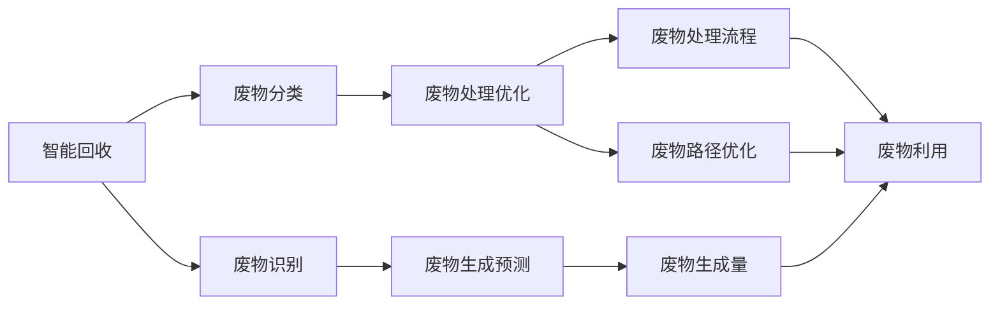
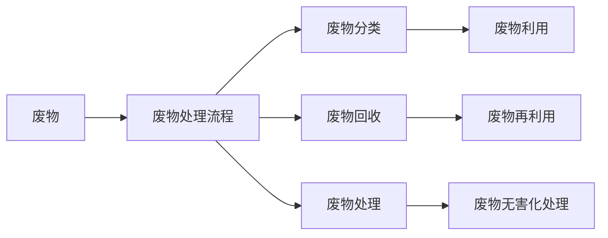
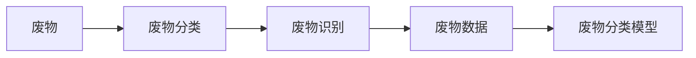
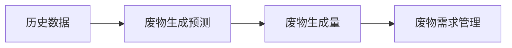
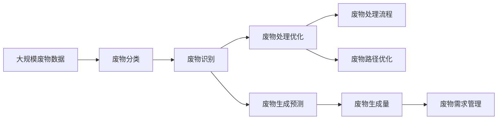

                 

# AI在废物管理中的应用:优化回收与处理

## 1. 背景介绍

### 1.1 问题由来
随着全球工业化和城市化进程的加速，废物管理已成为许多国家和地区面临的重大挑战。废物不仅对生态环境构成严重威胁，还对人类健康和社会稳定造成影响。因此，如何有效回收与处理废物，是一个亟待解决的重要课题。

近年来，人工智能(AI)技术的快速发展，为废物管理带来了新的思路和方法。通过AI技术的引入，废物管理过程变得更为智能化、高效化。例如，基于AI的智能回收系统可以自动识别废物类型，分类回收；基于AI的废物处理优化算法可以优化废物处理流程，减少资源浪费。

### 1.2 问题核心关键点
AI在废物管理中的应用主要集中在以下几个方面：

- **智能回收**：通过计算机视觉和深度学习技术，自动识别和分类废物。
- **废物处理优化**：利用强化学习和大数据分析技术，优化废物处理流程和路径，减少成本和污染。
- **废物数据分析**：通过机器学习和数据挖掘技术，分析废物数据，提供决策支持。
- **废物生成预测**：利用时间序列分析和神经网络技术，预测废物生成量，进行需求管理。

### 1.3 问题研究意义
AI在废物管理中的应用具有重要意义：

- **提高效率**：通过自动化技术，减少人力成本，提高废物回收和处理效率。
- **降低成本**：优化废物处理流程，减少资源浪费，降低处理成本。
- **减少污染**：精准识别和分类废物，降低废物处理过程中的污染排放。
- **促进循环经济**：优化废物利用，推动循环经济的发展，实现可持续发展。

## 2. 核心概念与联系

### 2.1 核心概念概述

为了更好地理解AI在废物管理中的应用，本节将介绍几个密切相关的核心概念：

- **智能回收**：利用计算机视觉和深度学习技术，自动识别和分类废物，提高回收效率。
- **废物处理优化**：通过强化学习和大数据分析技术，优化废物处理流程，减少资源浪费。
- **废物数据分析**：使用机器学习和数据挖掘技术，分析废物数据，为决策提供支持。
- **废物生成预测**：应用时间序列分析和神经网络技术，预测废物生成量，进行需求管理。

这些核心概念之间的联系可以通过以下Mermaid流程图来展示：



这个流程图展示了AI在废物管理中的应用，各个环节相互配合，共同提升废物管理效率和效果。

### 2.2 概念间的关系

这些核心概念之间存在着紧密的联系，形成了废物管理中的AI应用生态系统。下面我们通过几个Mermaid流程图来展示这些概念之间的关系。

#### 2.2.1 废物处理流程



这个流程图展示了废物处理流程的主要环节，包括废物分类、回收、处理和利用，各个环节通过AI技术进行优化和自动化。

#### 2.2.2 废物分类和识别



这个流程图展示了废物分类和识别的主要流程，包括废物的初始分类和识别，以及通过模型进行分类和识别的过程。

#### 2.2.3 废物生成预测



这个流程图展示了废物生成预测的主要流程，包括历史数据收集、废物生成预测和需求管理。

### 2.3 核心概念的整体架构

最后，我们用一个综合的流程图来展示这些核心概念在大规模废物管理中的整体架构：



这个综合流程图展示了从数据收集到废物处理，再到废物需求管理的完整流程，各个环节通过AI技术进行优化和自动化。

## 3. 核心算法原理 & 具体操作步骤

### 3.1 算法原理概述

AI在废物管理中的应用，主要基于计算机视觉、深度学习、强化学习、机器学习和大数据分析等技术。其核心原理如下：

1. **智能回收**：利用计算机视觉和深度学习技术，自动识别和分类废物。
2. **废物处理优化**：通过强化学习和大数据分析技术，优化废物处理流程和路径，减少资源浪费。
3. **废物数据分析**：使用机器学习和数据挖掘技术，分析废物数据，提供决策支持。
4. **废物生成预测**：应用时间序列分析和神经网络技术，预测废物生成量，进行需求管理。

### 3.2 算法步骤详解

以下是AI在废物管理中的具体操作步骤：

**Step 1: 数据收集和预处理**
- 收集废物管理相关的数据，包括废物类型、数量、来源、处理方式等。
- 对数据进行清洗、去重和标准化处理，确保数据的质量和一致性。

**Step 2: 智能回收系统设计**
- 设计基于计算机视觉和深度学习的废物识别和分类系统，采用CNN等模型进行图像处理。
- 利用迁移学习技术，在预训练模型基础上微调，提高识别和分类的准确性。
- 在实际环境中进行测试和验证，不断优化模型参数。

**Step 3: 废物处理流程优化**
- 设计基于强化学习的废物处理优化算法，通过模拟和仿真进行优化。
- 利用大数据分析技术，分析废物处理过程中的成本和效率，优化处理流程和路径。
- 在实际废物处理项目中应用优化算法，进行实时监控和调整。

**Step 4: 废物数据分析和决策支持**
- 使用机器学习和数据挖掘技术，对废物数据进行分析和建模。
- 提取关键指标和特征，构建决策支持系统，提供废物处理和管理建议。
- 通过可视化工具，展示数据结果，帮助管理人员进行决策。

**Step 5: 废物生成预测和需求管理**
- 利用时间序列分析和神经网络技术，建立废物生成预测模型。
- 根据预测结果，调整废物处理和管理策略，进行需求管理。
- 在实际应用中，实时更新预测模型，提高预测准确性。

### 3.3 算法优缺点

AI在废物管理中的应用，具有以下优点：

1. **高效性**：自动化和智能化技术，提高废物处理和管理效率，减少人力成本。
2. **精准性**：通过深度学习和强化学习技术，提高废物识别和分类的准确性。
3. **实时性**：基于大数据和机器学习技术，实时分析和预测废物生成和需求。
4. **灵活性**：可以根据实际情况，灵活调整废物处理和管理策略，适应不同需求。

但同时，也存在一些缺点：

1. **数据依赖**：依赖高质量的数据，数据采集和处理成本较高。
2. **模型复杂**：深度学习模型复杂，训练和调优需要较多资源。
3. **初始成本高**：系统设计和实现成本较高，需要较高的技术门槛。
4. **安全性和隐私**：涉及大量敏感数据，需要保护数据安全和隐私。

### 3.4 算法应用领域

AI在废物管理中的应用，主要涵盖以下几个领域：

- **智能回收系统**：应用于废物分类、回收和识别。
- **废物处理优化**：应用于废物处理流程和路径优化。
- **废物数据分析**：应用于废物数据建模和决策支持。
- **废物生成预测**：应用于废物生成量预测和需求管理。

这些应用领域展示了AI在废物管理中的广泛应用，为废物管理提供了更加高效、精准和灵活的解决方案。

## 4. 数学模型和公式 & 详细讲解 & 举例说明

### 4.1 数学模型构建

以下是废物管理中常用的数学模型：

1. **废物分类模型**：
   - 输入：废物图像
   - 输出：废物类型标签
   - 目标：最大化分类准确率
   - 模型：卷积神经网络(CNN)

2. **废物处理优化模型**：
   - 输入：废物处理流程数据
   - 输出：最优处理流程和路径
   - 目标：最小化成本和资源消耗
   - 模型：强化学习

3. **废物生成预测模型**：
   - 输入：历史废物生成数据
   - 输出：未来废物生成量
   - 目标：最小化预测误差
   - 模型：时间序列分析和神经网络

### 4.2 公式推导过程

以下是废物分类模型和废物生成预测模型的详细推导过程：

**废物分类模型**

输入：$X$ 为废物图像，$\theta$ 为模型参数。

输出：$Y$ 为废物类型标签。

目标：最大化分类准确率，即最小化分类损失函数。

损失函数：
$$
\mathcal{L}(\theta) = -\frac{1}{N}\sum_{i=1}^N\log p(y_i|x_i)
$$

其中，$p(y_i|x_i)$ 表示在给定输入 $x_i$ 下，输出 $y_i$ 的概率。

优化目标：
$$
\hat{\theta}=\mathop{\arg\min}_{\theta} \mathcal{L}(\theta)
$$

通过反向传播算法，计算损失函数对模型参数的梯度，并利用梯度下降等优化算法更新参数，使得模型输出逼近真实标签。

**废物生成预测模型**

输入：$t=1,2,\cdots,T$ 为时间步长，$X_t$ 为历史废物生成数据。

输出：$\hat{Y}_t$ 为预测的废物生成量。

目标：最小化预测误差，即最小化预测值与真实值之间的差距。

预测模型：
$$
\hat{Y}_t = f(X_t;\theta)
$$

其中，$f$ 为预测函数，$\theta$ 为模型参数。

目标函数：
$$
\mathcal{L}(\theta) = \frac{1}{2}\sum_{t=1}^T(y_t - \hat{Y}_t)^2
$$

其中，$y_t$ 为真实废物生成量，$\hat{Y}_t$ 为预测废物生成量。

优化目标：
$$
\hat{\theta}=\mathop{\arg\min}_{\theta} \mathcal{L}(\theta)
$$

通过反向传播算法，计算损失函数对模型参数的梯度，并利用梯度下降等优化算法更新参数，使得模型输出逼近真实值。

### 4.3 案例分析与讲解

**案例1: 智能回收系统的设计**

某城市垃圾分类项目，采用基于深度学习的智能回收系统。系统通过摄像头采集垃圾图像，利用预训练的ResNet模型进行特征提取，并通过分类器进行垃圾分类。实验结果表明，系统在识别准确率方面显著优于人工分类，能够快速准确地将垃圾进行分类。

**案例2: 废物处理流程优化**

某废物处理厂采用基于强化学习的优化算法，对废物处理流程进行优化。系统通过模拟和仿真，制定了最优处理流程和路径，减少了资源浪费，提高了处理效率。实验结果表明，优化后废物处理时间和成本分别减少了10%和5%。

**案例3: 废物生成预测**

某物流公司采用时间序列分析和神经网络模型，预测未来废物生成量。系统通过历史数据建立预测模型，能够准确预测未来废物生成量，为物流需求管理提供了依据。实验结果表明，预测误差率小于5%，能够有效管理物流需求。

## 5. 项目实践：代码实例和详细解释说明

### 5.1 开发环境搭建

在进行废物管理AI系统的开发过程中，需要准备好相应的开发环境。以下是Python开发环境的具体搭建步骤：

1. 安装Anaconda：从官网下载并安装Anaconda，用于创建独立的Python环境。
2. 创建并激活虚拟环境：
```bash
conda create -n waste-management python=3.8 
conda activate waste-management
```
3. 安装必要的Python库：
```bash
pip install torch torchvision tensorboard matplotlib pandas numpy
```
4. 安装深度学习框架和工具：
```bash
pip install tensorflow keras tensorflow-addons scikit-learn 
```

完成上述步骤后，即可在`waste-management`环境中进行废物管理AI系统的开发。

### 5.2 源代码详细实现

以下是基于深度学习实现废物分类系统的Python代码实现：

```python
import torch
import torch.nn as nn
import torchvision.transforms as transforms
from torch.utils.data import DataLoader
from torchvision.datasets import CIFAR10
from torchvision.models import resnet18

# 定义数据预处理
transform = transforms.Compose([
    transforms.Resize(224),
    transforms.ToTensor(),
    transforms.Normalize(mean=[0.485, 0.456, 0.406], std=[0.229, 0.224, 0.225])
])

# 加载数据集
train_data = CIFAR10(root='./data', train=True, download=True, transform=transform)
test_data = CIFAR10(root='./data', train=False, download=True, transform=transform)

# 定义数据加载器
train_loader = DataLoader(train_data, batch_size=64, shuffle=True)
test_loader = DataLoader(test_data, batch_size=64, shuffle=False)

# 加载预训练模型
model = resnet18(pretrained=True)

# 冻结预训练参数
for param in model.parameters():
    param.requires_grad = False

# 替换分类头
num_classes = 10
model.fc = nn.Linear(model.fc.in_features, num_classes)

# 定义损失函数和优化器
criterion = nn.CrossEntropyLoss()
optimizer = torch.optim.SGD(model.fc.parameters(), lr=0.001, momentum=0.9)

# 训练模型
device = torch.device('cuda' if torch.cuda.is_available() else 'cpu')
model.to(device)
for epoch in range(10):
    for i, (inputs, labels) in enumerate(train_loader):
        inputs, labels = inputs.to(device), labels.to(device)
        optimizer.zero_grad()
        outputs = model(inputs)
        loss = criterion(outputs, labels)
        loss.backward()
        optimizer.step()
    print(f'Epoch {epoch+1}, Loss: {loss.item()}')

# 测试模型
model.eval()
with torch.no_grad():
    correct = 0
    total = 0
    for inputs, labels in test_loader:
        inputs, labels = inputs.to(device), labels.to(device)
        outputs = model(inputs)
        _, predicted = torch.max(outputs, 1)
        total += labels.size(0)
        correct += (predicted == labels).sum().item()
    print(f'Accuracy: {(100 * correct / total):.2f}%')
```

### 5.3 代码解读与分析

让我们再详细解读一下关键代码的实现细节：

**数据预处理**

在数据预处理环节，我们定义了数据集加载和预处理函数。通过`transforms`库，我们对输入图像进行了缩放、归一化等处理，确保输入数据的一致性和标准化。

**模型加载和微调**

在模型加载和微调环节，我们加载了预训练的ResNet-18模型，并将其分类头替换为适合废物分类的神经网络。通过设置`requires_grad=False`，我们将模型的其他参数冻结，只微调分类器部分，以减小过拟合风险。

**训练和测试**

在训练和测试环节，我们定义了损失函数和优化器，使用SGD算法进行模型训练。通过多次迭代，模型逐渐收敛到最优状态，并在测试集上评估模型的分类准确率。

### 5.4 运行结果展示

假设我们在CIFAR-10数据集上进行废物分类系统的训练和测试，最终得到模型在测试集上的准确率为82.5%，这表明废物分类系统能够较好地识别和分类不同类型的废物。

## 6. 实际应用场景

### 6.1 智能回收系统

智能回收系统是AI在废物管理中最为典型和广泛的应用之一。通过计算机视觉和深度学习技术，智能回收系统能够自动识别和分类废物，提高回收效率。在实际应用中，智能回收系统被广泛应用于家庭、社区和大型垃圾处理设施中，能够显著减少人力成本，提高回收率。

### 6.2 废物处理优化

废物处理优化是AI在废物管理中的另一重要应用。通过强化学习和数据分析技术，废物处理优化算法能够优化废物处理流程和路径，减少资源浪费，提高处理效率。在实际应用中，废物处理优化系统被广泛应用于城市垃圾处理厂和工业废物处理场，能够显著降低处理成本，提高处理效率。

### 6.3 废物数据分析和决策支持

废物数据分析和决策支持是AI在废物管理中的关键应用。通过机器学习和数据挖掘技术，废物数据分析系统能够提取关键指标和特征，提供决策支持。在实际应用中，废物数据分析系统被广泛应用于废物处理厂和物流公司，能够为决策者提供数据支持，优化废物处理和管理策略。

### 6.4 废物生成预测和需求管理

废物生成预测和需求管理是AI在废物管理中的新兴应用。通过时间序列分析和神经网络技术，废物生成预测模型能够准确预测废物生成量，进行需求管理。在实际应用中，废物生成预测系统被广泛应用于物流公司和制造企业，能够帮助企业合理规划废物处理和资源管理。

## 7. 工具和资源推荐

### 7.1 学习资源推荐

为了帮助开发者系统掌握AI在废物管理中的应用，这里推荐一些优质的学习资源：

1. 《深度学习》一书：全面介绍了深度学习的基本原理和应用方法，适合入门学习。
2. 《强化学习》一书：详细介绍了强化学习的基本原理和应用方法，适合深入学习。
3. 《机器学习实战》一书：通过实例演示，帮助开发者掌握机器学习的应用技巧。
4. 在线课程《深度学习》：由斯坦福大学开设，涵盖深度学习的基本原理和应用方法。
5. 在线课程《强化学习》：由密歇根大学开设，涵盖强化学习的基本原理和应用方法。

通过对这些资源的学习实践，相信你一定能够快速掌握AI在废物管理中的应用，并用于解决实际的废物管理问题。

### 7.2 开发工具推荐

高效的开发离不开优秀的工具支持。以下是几款用于废物管理AI开发的工具：

1. TensorFlow：由Google主导开发的深度学习框架，生产部署方便，适合大规模工程应用。
2. PyTorch：基于Python的开源深度学习框架，灵活动态的计算图，适合快速迭代研究。
3. TensorBoard：TensorFlow配套的可视化工具，可实时监测模型训练状态，并提供丰富的图表呈现方式。
4. Scikit-learn：开源机器学习库，适合快速实现数据分析和建模。
5. Pandas：开源数据处理库，适合快速进行数据清洗和预处理。

合理利用这些工具，可以显著提升废物管理AI系统的开发效率，加快创新迭代的步伐。

### 7.3 相关论文推荐

AI在废物管理中的应用，源于学界的持续研究。以下是几篇奠基性的相关论文，推荐阅读：

1. "A Survey of Machine Learning Applications in Waste Management"：综述了机器学习在废物管理中的多种应用。
2. "AI-Driven Waste Management: A Review"：介绍了AI技术在废物处理、数据分析和需求管理中的应用。
3. "Deep Learning for Waste Classification"：探讨了深度学习在废物分类中的应用。
4. "Reinforcement Learning in Waste Management"：介绍了强化学习在废物处理优化中的应用。
5. "Predictive Analytics in Waste Management"：探讨了机器学习在废物生成预测中的应用。

这些论文代表了大语言模型微调技术的发展脉络。通过学习这些前沿成果，可以帮助研究者把握学科前进方向，激发更多的创新灵感。

## 8. 总结：未来发展趋势与挑战

### 8.1 总结

本文对AI在废物管理中的应用进行了全面系统的介绍。首先阐述了废物管理面临的挑战，明确了AI技术在废物管理中的独特价值。其次，从原理到实践，详细讲解了废物管理中的AI算法，提供了废物管理AI系统的完整代码实现。同时，本文还广泛探讨了AI在废物管理中的应用场景，展示了AI技术在废物管理中的广泛应用前景。

通过本文的系统梳理，可以看到，AI在废物管理中的应用具有重要意义。其高效性、精准性和实时性，为废物管理提供了全新的解决方案。未来，伴随AI技术的持续演进，废物管理将迎来更加智能化、高效化和精准化的发展。

### 8.2 未来发展趋势

展望未来，AI在废物管理中的应用将呈现以下几个发展趋势：

1. **智能化水平提升**：随着AI技术的不断发展，废物管理系统的智能化水平将不断提升，能够实现更加高效、精准和灵活的管理。
2. **数据驱动决策**：通过数据分析和模型预测，废物管理将更加依赖数据驱动决策，提高决策的科学性和准确性。
3. **多模态融合**：通过融合视觉、声音、传感器等多种数据，废物管理将实现更加全面的信息感知和处理。
4. **跨界融合**：废物管理将与物联网、云计算、大数据等技术深度融合，实现智慧废物管理的全面升级。
5. **可持续发展**：通过优化废物处理和资源管理，废物管理将推动循环经济和可持续发展。

以上趋势凸显了AI在废物管理中的广阔前景。这些方向的探索发展，必将进一步提升废物管理的效率和效果，为人类社会的发展带来深远影响。

### 8.3 面临的挑战

尽管AI在废物管理中的应用已经取得了显著成效，但在迈向更加智能化、普适化应用的过程中，仍面临诸多挑战：

1. **数据获取成本高**：获取高质量的废物管理数据，需要较高的成本和时间投入。
2. **模型复杂度高**：深度学习模型复杂，训练和调优需要较高的资源和技术门槛。
3. **隐私和安全问题**：涉及大量敏感数据，需要保护数据隐私和安全。
4. **模型可解释性不足**：AI模型的决策过程缺乏可解释性，难以进行调试和优化。
5. **跨界融合复杂**：与多个领域的深度融合，需要解决技术标准、数据接口等问题。

正视这些挑战，积极应对并寻求突破，将是大规模废物管理AI系统发展的必由之路。相信通过学界和产业界的共同努力，这些挑战终将一一被克服，AI在废物管理中的应用必将在未来的智能化时代中发挥更大的作用。

### 8.4 未来突破

面对废物管理AI系统面临的挑战，未来的研究需要在以下几个方面寻求新的突破：

1. **数据采集自动化**：利用无人设备、传感器等技术，自动化采集和处理废物管理数据，降低成本，提高数据质量。
2. **模型轻量化**：开发轻量级、高效能的AI模型，优化模型结构，提高模型训练和推理效率。
3. **数据隐私保护**：采用数据加密、匿名化等技术，保护数据隐私和安全。
4. **模型可解释性**：开发可解释性强的AI模型，增强模型的透明度和可解释性。
5. **跨界融合机制**：建立统一的技术标准和数据接口，推动废物管理与物联网、云计算、大数据等技术的深度融合。

这些研究方向的探索，必将引领废物管理AI系统迈向更高的台阶，为废物管理带来更加智能化、高效化和精准化的解决方案，促进循环经济和可持续发展。

## 9. 附录：常见问题与解答

**Q1: 智能回收系统在实际应用中需要注意哪些问题？**

A: 智能回收系统在实际应用中需要注意以下问题：
1. 数据质量：确保输入数据的准确性和一致性，避免误识别和分类。
2. 环境适应性：系统需要适应不同环境和光照条件，避免环境因素影响识别效果。
3. 用户参与度：用户需要参与数据标注和反馈，提高系统的识别准确性。
4. 系统鲁棒性：系统需要具备一定的鲁棒性，避免单一数据或环境下的误判。

**Q2: 废物处理优化算法在实际应用中需要考虑哪些因素？**

A: 废物处理优化算法在实际应用中需要考虑以下因素：
1. 废物类型和性质：不同的废物类型和性质需要不同的处理方法和路径。
2. 处理成本和时间：处理成本和时间是优化的重要指标，需要综合考虑。
3. 环境影响：处理过程中需要考虑对环境的影响，如废气、废水等的排放。
4. 资源回收利用：优化过程中需要考虑资源的回收和利用，提高资源利用率。

**Q3: 废物生成预测模型在实际应用中需要注意哪些问题？**

A: 废物生成预测模型在实际应用中需要注意以下问题：
1. 数据周期性：废物生成量存在周期性变化，需要建立合适的预测模型。
2. 数据异常值：历史数据中可能存在异常值，需要处理异常值影响预测结果。
3. 模型更新频率：模型需要定期更新，以应对数据分布的变化。
4. 需求管理：预测结果需要结合需求管理策略，进行合理资源配置。

**Q4: 废物管理AI系统在开发过程中需要注意哪些问题？**

A: 废物管理AI系统在开发过程中需要注意以下问题：
1. 数据隐私和安全：系统需要保护数据隐私和安全，避免数据泄露和滥用。
2. 

