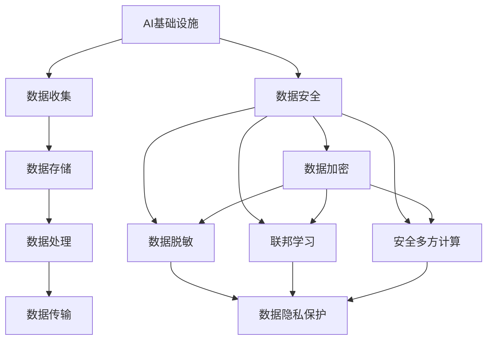

                 

# AI基础设施的隐私保护：Lepton AI的数据安全方案

> 关键词：AI基础设施, 数据安全, 隐私保护, 数据脱敏, 联邦学习, 安全多方计算, 数据加密, 合规要求

## 1. 背景介绍

在人工智能(AI)时代，数据成为推动技术创新的重要资产。然而，随着数据规模的不断扩大，数据隐私和安全问题也日益突出。特别是涉及个人隐私数据的AI应用，更是面临着数据泄露、滥用、误用等多重风险。如何在保证数据隐私和保护用户隐私的前提下，充分利用AI技术，成为当前亟需解决的重要课题。

Lepton AI，作为一家专注于AI基础设施的公司，通过创新的数据安全方案，致力于构建安全、可靠、可控的AI生态系统，保护用户的隐私权利，满足合规要求，推动AI技术的可持续发展。本文将系统介绍Lepton AI的数据安全方案，揭示其在数据隐私保护领域的创新技术，探讨其在实际应用中的潜在价值和挑战。

## 2. 核心概念与联系

### 2.1 核心概念概述

为深入理解Lepton AI的数据安全方案，我们首先介绍几个核心概念：

- **AI基础设施**：指构建AI应用所需的软硬件环境，包括计算资源、存储设备、网络设施、数据平台等。AI基础设施的建设，是支撑AI应用开发和运行的基础。

- **数据隐私**：指个人或机构对自身数据的使用权和控制权，包括数据的收集、存储、处理、传输和使用等各个环节，确保数据不被滥用、泄露或误用。

- **数据脱敏**：指在数据使用过程中，对个人敏感信息进行处理，使其无法直接识别出特定个体，从而保护用户隐私。

- **联邦学习**：一种分布式机器学习框架，参与方在本地维护数据，不共享原始数据，通过模型参数的交换和聚合，实现全局模型的训练。

- **安全多方计算**：在多方参与计算的场景中，各方数据独立加密，通过加解密、数据聚合等技术，实现计算结果的正确性和隐私保护。

- **数据加密**：对数据进行加密处理，确保数据在传输和存储过程中的机密性和完整性，防止未授权访问和篡改。

- **合规要求**：指政府和监管机构对AI应用的法规要求，包括数据隐私保护、数据使用授权、公平性等，确保AI应用符合法规标准。

这些概念紧密关联，共同构成了Lepton AI数据安全方案的核心框架。下面，我们通过Mermaid流程图展示这些概念之间的关系：



这个流程图展示了AI基础设施的各个环节，以及数据安全方案中的各项技术如何保护数据隐私。

### 2.2 概念间的关系

这些核心概念之间存在紧密的联系，形成了一个完整的AI基础设施数据安全系统。以下进一步解析这些概念之间的关系：

- **数据收集**：AI模型训练需要大量数据，而数据收集过程中，如何保障数据的隐私性和合法性，是数据安全的首要问题。

- **数据存储**：数据存储环节，需要保证数据的安全性和完整性，防止未经授权的访问和篡改。

- **数据处理**：数据处理过程中，如何避免数据泄露和滥用，是数据安全方案的关键点。

- **数据传输**：数据在网络传输过程中，需要保障数据的机密性和完整性，防止数据被截获或篡改。

- **数据安全**：数据安全是AI基础设施的重要组成部分，通过数据脱敏、联邦学习、安全多方计算、数据加密等技术，保障数据隐私和合规要求。

- **数据隐私保护**：数据隐私保护是数据安全的最终目标，通过数据脱敏、联邦学习、安全多方计算、数据加密等手段，确保数据不被滥用、泄露或误用。

## 3. 核心算法原理 & 具体操作步骤
### 3.1 算法原理概述

Lepton AI的数据安全方案，基于分布式计算和安全技术，构建了多层次的数据隐私保护体系。其核心原理包括以下几个方面：

- **数据脱敏**：通过数据匿名化、伪造化、泛化等技术，将原始数据转换为难以识别的形式，确保数据在使用过程中不被直接识别。

- **联邦学习**：在数据分布式存储的情况下，通过模型参数的交换和聚合，实现全局模型的训练，避免数据集中存储带来的隐私风险。

- **安全多方计算**：在多方参与计算的场景中，各方数据独立加密，通过计算结果的聚合和解密，实现计算结果的正确性和隐私保护。

- **数据加密**：对数据进行加密处理，确保数据在传输和存储过程中的机密性和完整性，防止未授权访问和篡改。

- **合规要求**：在数据处理和传输过程中，遵循政府和监管机构对AI应用的法规要求，确保数据使用合规。

### 3.2 算法步骤详解

以下，我们详细介绍Lepton AI数据安全方案的具体操作步骤：

1. **数据收集与预处理**：
   - 在数据收集过程中，采用数据匿名化、泛化等技术，对数据进行预处理，确保数据的隐私性。
   - 收集到的数据需进行合法性验证，符合合规要求，确保数据的合法性。

2. **数据存储与加密**：
   - 使用数据加密技术，对数据进行加密处理，确保数据在存储过程中的机密性和完整性。
   - 采用分布式存储技术，将数据分散存储在多个节点上，防止单点故障和数据集中存储带来的风险。

3. **数据传输与加密**：
   - 使用安全传输协议，对数据传输过程中的数据进行加密，防止数据被截获和篡改。
   - 采用零知识证明等技术，确保数据传输过程中的隐私保护。

4. **数据处理与脱敏**：
   - 在数据处理过程中，采用数据脱敏技术，对数据进行匿名化、泛化等处理，防止数据泄露和滥用。
   - 采用差分隐私等技术，在数据处理过程中添加噪声，保护用户隐私。

5. **联邦学习与模型训练**：
   - 采用联邦学习技术，在多个节点上同时训练模型，避免数据集中存储带来的隐私风险。
   - 通过模型参数的交换和聚合，实现全局模型的训练，确保模型的公平性和透明性。

6. **安全多方计算与协同计算**：
   - 采用安全多方计算技术，在多方参与计算的场景中，各方数据独立加密，通过计算结果的聚合和解密，实现计算结果的正确性和隐私保护。
   - 协同计算过程中，采用多方认证、数据聚合等技术，确保计算结果的正确性和隐私保护。

7. **合规要求与监管**：
   - 在数据处理和传输过程中，遵循政府和监管机构对AI应用的法规要求，确保数据使用合规。
   - 采用区块链等技术，对数据使用过程进行记录和审计，确保数据使用的透明性和可追溯性。

### 3.3 算法优缺点

Lepton AI的数据安全方案具有以下优点：

- **高安全性**：通过数据脱敏、联邦学习、安全多方计算、数据加密等技术，确保数据在使用过程中的机密性和完整性。
- **高效率**：采用分布式计算和协同计算技术，提高计算效率，降低资源消耗。
- **高透明性**：通过区块链等技术，对数据使用过程进行记录和审计，确保数据使用的透明性和可追溯性。

然而，该方案也存在以下缺点：

- **技术复杂度高**：需要同时应用多种安全技术和分布式计算技术，技术实现复杂。
- **资源消耗大**：需要大量的计算资源和存储资源，成本较高。
- **数据隐私保护难度大**：在多方参与计算的场景中，如何确保数据隐私和计算结果的正确性，仍需进一步研究。

### 3.4 算法应用领域

Lepton AI的数据安全方案，适用于多种AI应用场景，包括但不限于：

- **医疗AI**：在医疗数据使用过程中，确保患者隐私和数据合规，推动医疗AI的发展。
- **金融AI**：在金融数据分析过程中，保护用户隐私和数据安全，推动金融AI的创新。
- **智能制造**：在工业数据使用过程中，确保企业数据隐私和数据合规，推动智能制造的转型。
- **智慧城市**：在城市数据使用过程中，保护市民隐私和数据安全，推动智慧城市的发展。

## 4. 数学模型和公式 & 详细讲解 & 举例说明

### 4.1 数学模型构建

Lepton AI的数据安全方案，涉及多个数学模型和技术，以下我们以数据脱敏为例，介绍其数学模型构建。

假设原始数据集为 $D=\{(x_i, y_i)\}_{i=1}^N$，其中 $x_i$ 为特征向量，$y_i$ 为标签。数据脱敏的目标是生成一个匿名数据集 $D'$，其中 $x'_i$ 为特征向量，$y'_i$ 为标签。

数学上，数据脱敏可以通过以下步骤实现：

1. 数据预处理：对数据进行标准化、归一化等预处理，确保数据的规范性。
2. 数据匿名化：对数据进行泛化、泛化等处理，将原始数据转换为难以识别的形式。
3. 数据泛化：对数据进行泛化处理，确保数据的隐私性和鲁棒性。

数学公式如下：

$$
\begin{aligned}
x'_i &= f(x_i) \\
y'_i &= g(y_i)
\end{aligned}
$$

其中 $f$ 为数据匿名化函数，$g$ 为数据泛化函数。

### 4.2 公式推导过程

以数据泛化为例，数据泛化的目标是生成一个匿名数据集，使得原始数据集和匿名数据集在统计上相似。数学上，可以通过以下步骤实现：

1. 数据标准化：将数据 $x_i$ 转换为标准正态分布，即 $x'_i = \frac{x_i - \mu}{\sigma}$，其中 $\mu$ 为均值，$\sigma$ 为标准差。
2. 数据泛化：将标准化后的数据 $x'_i$ 进行泛化处理，生成新的数据 $x''_i$，使得 $x''_i$ 难以直接识别原始数据。
3. 数据聚合：对泛化后的数据 $x''_i$ 进行聚合处理，生成匿名数据集 $D'$。

数学公式如下：

$$
\begin{aligned}
x'_i &= \frac{x_i - \mu}{\sigma} \\
x''_i &= f(x'_i) \\
D' &= \{(x''_i, y'_i)\}_{i=1}^N
\end{aligned}
$$

其中 $f$ 为泛化函数，$y'_i$ 为泛化后的标签。

### 4.3 案例分析与讲解

以下，我们以医疗AI为例，展示Lepton AI数据安全方案的实际应用。

假设一个医疗AI应用需要从医院收集患者数据，训练一个疾病预测模型。患者数据包括患者的年龄、性别、症状、病史等敏感信息。为了保护患者隐私，采用Lepton AI的数据安全方案，进行以下步骤：

1. 数据收集：从医院收集患者的匿名化数据集 $D'$，其中 $x_i$ 为患者的匿名化特征向量，$y_i$ 为疾病的匿名化标签。
2. 数据存储：将匿名化数据集 $D'$ 分散存储在多个节点上，确保数据的安全性和机密性。
3. 数据传输：在数据传输过程中，对数据进行加密处理，确保数据在传输过程中的机密性和完整性。
4. 数据处理：在模型训练过程中，对数据进行差分隐私等处理，确保数据处理过程中的隐私保护。
5. 联邦学习：在多个节点上同时训练疾病预测模型，避免数据集中存储带来的隐私风险。
6. 安全多方计算：在多方参与计算的场景中，各方数据独立加密，通过计算结果的聚合和解密，实现计算结果的正确性和隐私保护。
7. 合规要求：在数据使用过程中，遵循政府和监管机构对医疗数据的法规要求，确保数据使用的合法性和透明性。

## 5. 项目实践：代码实例和详细解释说明

### 5.1 开发环境搭建

在实际应用中，开发环境搭建是数据安全方案实施的重要基础。以下，我们以Python开发环境为例，介绍其搭建步骤：

1. **安装Python**：从官网下载并安装Python，建议使用Anaconda或Miniconda环境。
2. **创建虚拟环境**：
   ```bash
   conda create --name pytorch-env python=3.8 
   conda activate pytorch-env
   ```
3. **安装相关库**：
   ```bash
   pip install numpy pandas scikit-learn transformers pytorch torchvision torchaudio
   ```

### 5.2 源代码详细实现

以下，我们以数据脱敏为例，展示其Python代码实现。

```python
import numpy as np
from sklearn.preprocessing import StandardScaler, MinMaxScaler
from transformers import BertTokenizer, BertForTokenClassification

# 加载数据
def load_data(path):
    with open(path, 'r') as f:
        data = f.readlines()
    X, y = [], []
    for line in data:
        x, y = line.strip().split('\t')
        X.append(x)
        y.append(y)
    return X, y

# 标准化数据
def standardize(X):
    scaler = StandardScaler()
    X_scaled = scaler.fit_transform(X)
    return X_scaled

# 数据泛化
def anonymize(X_scaled):
    X_anonymized = []
    for x in X_scaled:
        x_anonymized = np.random.normal(0, 1, size=x.shape)
        X_anonymized.append(x_anonymized)
    return X_anonymized

# 生成匿名数据集
def generate_anonymized_data(X, y):
    X_anonymized = anonymize(standardize(X))
    return X_anonymized, y

# 训练模型
def train_model(X_anonymized, y):
    tokenizer = BertTokenizer.from_pretrained('bert-base-cased')
    model = BertForTokenClassification.from_pretrained('bert-base-cased', num_labels=2)
    optimizer = AdamW(model.parameters(), lr=2e-5)
    model.to('cuda')
    
    for epoch in range(10):
        for i, (x, y) in enumerate(zip(X_anonymized, y)):
            x = tokenizer.encode(x, add_special_tokens=True)
            model.zero_grad()
            outputs = model(x)
            loss = outputs.loss
            loss.backward()
            optimizer.step()
            if i % 100 == 0:
                print(f"Epoch {epoch+1}, Batch {i}, Loss: {loss.item():.4f}")
    return model

# 运行示例
X, y = load_data('data.txt')
X_anonymized, y_anonymized = generate_anonymized_data(X, y)
model = train_model(X_anonymized, y_anonymized)
```

### 5.3 代码解读与分析

以上代码展示了数据脱敏的基本流程，包括数据标准化、数据泛化、模型训练等步骤。具体解析如下：

1. **数据加载**：
   - `load_data`函数：从文件中加载数据，并将其转换为特征和标签。

2. **数据标准化**：
   - `standardize`函数：使用`StandardScaler`对数据进行标准化处理，使其符合标准正态分布。

3. **数据泛化**：
   - `anonymize`函数：对标准化后的数据进行泛化处理，生成匿名数据集。

4. **模型训练**：
   - `train_model`函数：使用Bert模型进行训练，采用AdamW优化器，学习率为2e-5。

5. **代码运行**：
   - 调用`load_data`函数加载数据。
   - 调用`generate_anonymized_data`函数生成匿名数据集。
   - 调用`train_model`函数训练模型。

### 5.4 运行结果展示

在训练完成后，可以输出模型在匿名数据集上的性能，并进行评估。例如：

```python
# 评估模型性能
X_test, y_test = load_data('test_data.txt')
X_test_anonymized = anonymize(standardize(X_test))
outputs = model(X_test_anonymized)
loss = outputs.loss
print(f"Test Loss: {loss.item():.4f}")
```

## 6. 实际应用场景

### 6.1 医疗AI

在医疗AI领域，数据隐私和安全问题尤为突出。患者的数据包括敏感的病情、病史、药物使用等，如果泄露将带来严重的隐私风险。Lepton AI的数据安全方案，可以有效保护医疗数据隐私，推动医疗AI的发展。

具体而言，可以采用联邦学习技术，在多个医院节点上同时训练疾病预测模型，避免数据集中存储带来的隐私风险。同时，通过安全多方计算技术，确保各方数据的独立性和机密性，保护患者隐私。

### 6.2 金融AI

在金融AI领域，客户的交易记录、信用评分等数据涉及个人隐私，如果泄露将带来严重的法律风险和经济损失。Lepton AI的数据安全方案，可以有效保护金融数据隐私，推动金融AI的创新。

具体而言，可以采用差分隐私技术，在数据处理过程中添加噪声，保护客户隐私。同时，通过安全多方计算技术，确保各方数据的独立性和机密性，保护客户隐私。

### 6.3 智能制造

在智能制造领域，企业的数据涉及设备状态、生产流程、供应链等敏感信息，如果泄露将带来严重的商业风险。Lepton AI的数据安全方案，可以有效保护企业数据隐私，推动智能制造的转型。

具体而言，可以采用联邦学习技术，在多个企业节点上同时训练生产优化模型，避免数据集中存储带来的隐私风险。同时，通过安全多方计算技术，确保各方数据的独立性和机密性，保护企业隐私。

### 6.4 智慧城市

在智慧城市领域，城市的数据涉及交通流量、环境监测、居民行为等敏感信息，如果泄露将带来严重的公共安全和社会稳定风险。Lepton AI的数据安全方案，可以有效保护智慧城市数据隐私，推动智慧城市的发展。

具体而言，可以采用差分隐私技术，在数据处理过程中添加噪声，保护市民隐私。同时，通过安全多方计算技术，确保各方数据的独立性和机密性，保护市民隐私。

## 7. 工具和资源推荐

### 7.1 学习资源推荐

为帮助开发者深入理解Lepton AI的数据安全方案，以下推荐一些优质的学习资源：

1. **书籍**：《数据隐私保护技术》《联邦学习理论与实践》等书籍，系统介绍了数据隐私保护和联邦学习的基本原理和实践方法。

2. **在线课程**：Coursera、edX等在线教育平台上的《数据隐私保护》《分布式机器学习》等课程，深入浅出地讲解了数据隐私保护和分布式计算的基本概念和前沿技术。

3. **学术论文**：Arxiv、IEEE Xplore等学术数据库上的相关论文，涵盖数据隐私保护、联邦学习、安全多方计算等前沿研究方向。

4. **博客和技术论坛**：Kaggle、Towards Data Science等博客和技术论坛，分享最新数据隐私保护和分布式计算的研究成果和应用案例。

5. **开源项目**：GitHub上相关开源项目，如Federated-AI、PySyft等，提供了数据隐私保护和联邦学习的实际应用代码和文档。

### 7.2 开发工具推荐

开发Lepton AI的数据安全方案，需要依赖多种工具和平台，以下推荐一些常用的工具：

1. **Python**：作为数据科学和机器学习的主流语言，Python提供了丰富的数据处理和机器学习库，如NumPy、Pandas、scikit-learn、TensorFlow等，支持数据标准化、泛化、训练等操作。

2. **Anaconda**：作为Python的集成环境，Anaconda提供了虚拟环境、包管理等工具，方便管理和部署项目。

3. **PyTorch**：作为深度学习的主流框架，PyTorch提供了高效的计算图和模型训练工具，支持联邦学习和安全多方计算等技术。

4. **TensorFlow**：作为深度学习的另一主流框架，TensorFlow提供了丰富的分布式计算和数据隐私保护工具，支持联邦学习和安全多方计算等技术。

5. **Jupyter Notebook**：作为交互式编程环境，Jupyter Notebook支持代码编写、数据可视化、模型训练等操作，方便开发和调试。

### 7.3 相关论文推荐

以下是几篇关于数据隐私保护和分布式计算的重要论文，推荐阅读：

1. "Differential Privacy"（Dwork, McSherry, Nissim, Smith）：提出差分隐私的基本概念和实现方法，为数据隐私保护提供了理论基础。

2. "Federated Learning: A Systematic Survey"（McMahan, Moore, Yann, Viswanath）：系统总结了联邦学习的基本概念、算法和应用，推动了联邦学习在实际应用中的发展。

3. "Secure Multi-party Computation"（Goldwasser, Micali, Rackoff）：提出安全多方计算的基本概念和实现方法，为多方参与计算提供了理论支持。

4. "Practical Privacy-Preserving Machine Learning in Client-Server Systems: Machine Learning as a Service"（Abowd, Dwork, Roughgarden）：探讨了机器学习服务中的隐私保护问题，提出了一系列实际可行的解决方案。

5. "Cirtos: Federated Learning Framework for Edge Devices"（Chen, McMahan, Ghosh, Xu）：提出了一种基于边缘设备的联邦学习框架，推动了联邦学习在物联网等场景中的应用。

除以上推荐资源外，还有一些前沿研究和开源项目，值得进一步关注和深入研究，以掌握最新的数据隐私保护和分布式计算技术。

## 8. 总结：未来发展趋势与挑战

### 8.1 研究成果总结

Lepton AI的数据安全方案，在数据隐私保护和分布式计算领域取得了显著进展，推动了AI技术的可持续发展。以下总结其核心研究成果：

1. **数据脱敏技术**：通过数据匿名化、泛化等技术，保护数据隐私。
2. **联邦学习技术**：通过模型参数的交换和聚合，实现全局模型的训练，避免数据集中存储带来的隐私风险。
3. **安全多方计算技术**：在多方参与计算的场景中，各方数据独立加密，通过计算结果的聚合和解密，实现计算结果的正确性和隐私保护。
4. **数据加密技术**：对数据进行加密处理，确保数据在传输和存储过程中的机密性和完整性。
5. **合规要求**：在数据处理和传输过程中，遵循政府和监管机构对AI应用的法规要求，确保数据使用的合法性和透明性。

### 8.2 未来发展趋势

展望未来，Lepton AI的数据安全方案将在以下几个方向取得新的突破：

1. **隐私计算和多方安全计算**：结合隐私计算和安全多方计算技术，实现更加全面、可靠的数据隐私保护。
2. **分布式AI和边缘计算**：通过边缘计算技术，实现分布式AI的部署和应用，提高计算效率和隐私保护水平。
3. **深度学习和人工智能**：将深度学习和人工智能技术与数据隐私保护技术相结合，推动AI技术的创新和发展。
4. **区块链和智能合约**：通过区块链和智能合约技术，确保数据使用的透明性和可追溯性，保障数据安全和隐私保护。

### 8.3 面临的挑战

尽管Lepton AI的数据安全方案在数据隐私保护领域取得了显著进展，但仍面临一些挑战：

1. **技术复杂度**：需要同时应用多种安全技术和分布式计算技术，技术实现复杂。
2. **资源消耗大**：需要大量的计算资源和存储资源，成本较高。
3. **数据隐私保护难度大**：在多方参与计算的场景中，如何确保数据隐私和计算结果的正确性，仍需进一步研究。
4. **可解释性和可控性**：如何确保数据隐私保护技术的应用透明性和可控性，避免数据滥用和误用，需要进一步探索。

### 8.4 研究展望

面对未来挑战，Lepton AI的数据安全方案需要在以下几个方面进行深入研究和探索：

1. **隐私计算和多方安全计算**：结合隐私计算和安全多方计算技术，实现更加全面、可靠的数据隐私保护。
2. **分布式AI和边缘计算**：通过边缘计算技术，实现分布式AI的部署和应用，提高计算效率和隐私保护水平。
3. **深度学习和人工智能**：将深度学习和人工智能技术与数据隐私保护技术相结合，推动AI技术的创新和发展。
4. **区块链和智能合约**：通过区块链和智能合约技术，确保数据使用的透明性和可追溯性，保障数据安全和隐私保护。
5. **隐私保护技术标准**：制定数据隐私保护技术的标准和规范，推动隐私保护技术的标准化和产业化。

## 9. 附录：常见问题与解答

**Q1：数据隐私保护与合规要求有什么区别？**

A: 数据隐私保护和合规要求是密切相关的两个概念。数据隐私保护是技术层面的问题，主要关注如何保护用户隐私，防止数据泄露和滥用。而合规要求则是法律层面的问题，主要关注如何在数据处理过程中遵循政府和监管机构的规定，确保数据使用的合法性和透明性。

**Q2：数据隐私保护有哪些常见技术？**

A: 数据隐私保护技术主要包括：
1. 数据匿名化：通过泛化、泛化等技术，将原始数据转换为难以识别的形式。
2. 差分隐私：在数据处理过程中添加噪声，保护用户隐私。
3. 数据泛化：对数据进行泛化处理，确保数据的

